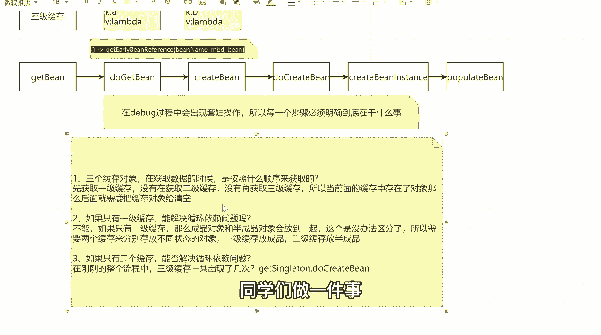
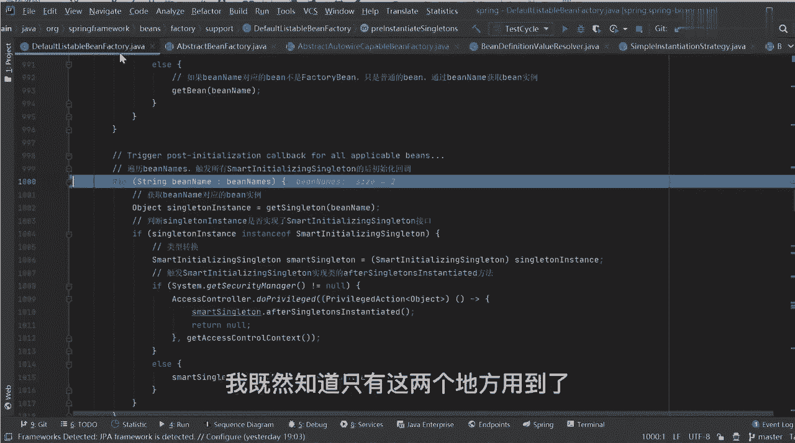
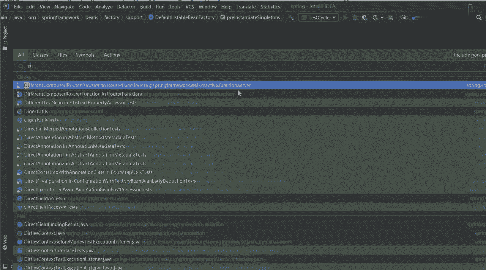
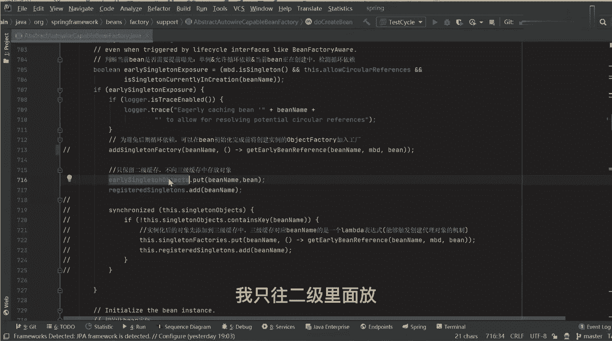
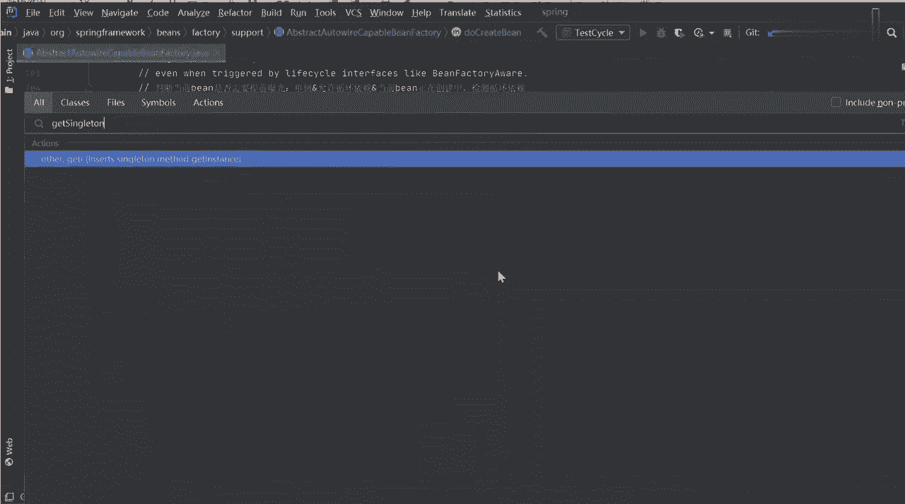
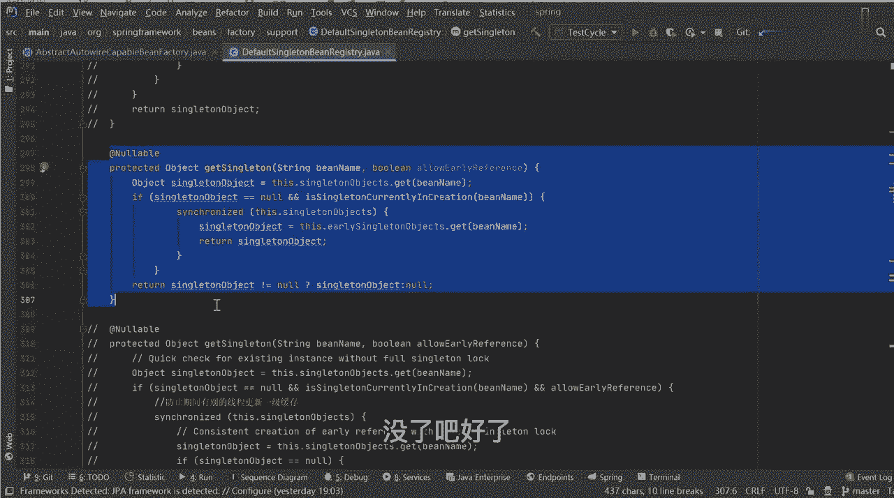
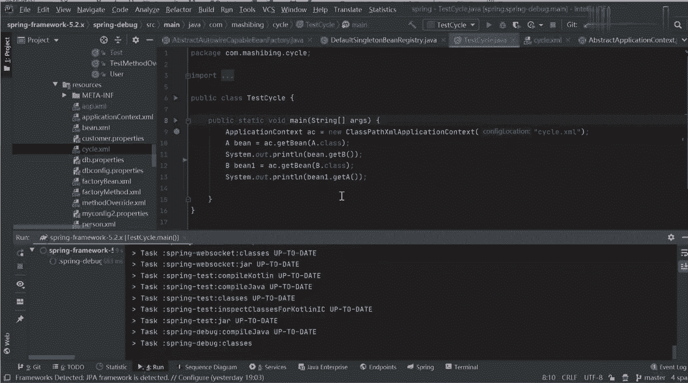
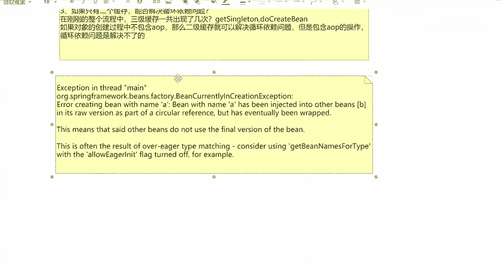

# 马士兵教育MCA4.0架构师课程 - P53：53、三级缓存解决循环依赖问题 - 马士兵学堂 - BV1E34y1w773

提问环节，提问环节第一个问题听好了，现在到总结过程了，这个总结也非常非常重要，听好了，三级，我三个缓存对象在获取数据的时候，是按照什么顺序来获取的，第一个问题，123吧，先获取一级缓存。

没有再获取二级缓存，没有再获取三级缓存，所以当好吧，前面，到缓存中存在了怎么办，我天呐，好诡异，我我我已经停了，他还在那个啥存在了对象，那么后面就需要把，什么缓存，对象，给清空，没问题吧，你想吧。

你一级缓存没有了，那么我二级三级就没有必没有存在的必要了，来这个问题听白同学给老师扣一，能听懂吗，我们一个来好吧，一个来第一个问题，来第二个问题，为什么，说如果只有一级缓存能解决循环依赖问题吗，能不能。

不能为什么不能，你告诉我为什么单例是因为单位吗，要是能spring就不写三级了，你别扯犊子好吧，如果只有一级缓存，那么成品对象和半成品对象会放到，一起这个时候没办法区分了。

所以需要两个缓存来分别存放不同状态的对象，一级缓存放什么东西成品，二级缓存放半成品，弄个不同的key，key是我们的冰name，你能弄不同的key吗，大叔K是我们的b name，你能放不同的K吗。

不能吧，所以最方便的，有人说老师我可以立即缓存，我在value里面，我给大家一个类型，value里面做一个标识不就行了吗，大叔子加一个123，你你你加多少个123啊，你加多少123。

还有人说老师我在value里面封装一个类型，我给他一个标志位，如果是一表示成品，如果零表示半成品，你还要挨个取对象，判断取对象判断你麻烦不麻烦呀，你用两个缓存就可以解决这件事情。

为什么要判断每个属性值呢，累不累啊，是这意思，可以用隐藏方式，但是你不能写那么low代码，懂我意思吧啊这东西来第三个问题，如果诶前两个问题弄懂，同学扣一，懂了第三个问题，如果只有第二级两个缓存能解决。

能否解决循环依赖问题，只有一级和二级可以解决吗，好了有说可以的，有说不能的，那这时候我问一个问题啊，在刚刚的整个流程中啊，三级缓存一共出现了几次，其次，两次吧。

第一个是在get singleton方法中出了一次，第二个是在哪，do create be方法的时候出现了一次对吧，现在我做一件事，同学们做一件事。

能和不能，我们来分情况，说明我既然知道只有这两个地方用到了好了。

我干一件事，找一下我们刚才说法叫什么叫do create b。

找对方法，然后我把我现在的这行代码给干掉，这行代码是完成了三级缓存的，一个一个一个一个存放对吧，我把下面两行给解开，下面两个解开，这是什么意思啊，告诉我，看啊我把这行代码干掉了，我把下面代码给解开。

这是几级缓存，二级吧，也就是说我现在我存放完成之后，我不往三级里面放了，我只往二级里面放对吧。

这是第一个地方，第二个地方叫get singleton。

这里面吧我把整段方法我都干掉，然后我把这段数理逻辑解开，我自己写的好吧，这段里面有三级缓存存在的意义吗，往下看啊，第一个我先从一级缓存里面取，如果取不到的话，我从二级缓存里面取，如果也取不到的话。

我就返回空，现在还有三级缓存吗。

没了吧好了，如果没了的话，我们先来干一件事，我再按照这个逻辑我去执行一遍，我们的方法处理，看一下它能否正常，呃有一个lock，我把你把它关掉啊，我把第八关掉，来把上面的lock给干掉，那文件表示锁定啊。

不让你删，走，我把它删掉，把它停了，删除好吧，来重新执行，右击run，这跟后置税方有啥关系啊，跟后置处理方案有关系吗，没关系好吧，等我等我讲完好吧，先往下看，好了，我的AB有没有打印出来，同学们看好了。

我的ab有没有打印出来，有没有AB有了吗，我二级缓存能不能解决循环依赖问题，能还是不能，能不能可以，但是如果他真的可以的话，为什么要加三级缓存呢，我来改一段逻辑，我把我们的配置文件打开，打开之后。

我把下面这段代码给解开，下面是干嘛的，现在干嘛呢，是不是加了一个a OP啊，那时候现在我需要把AB都创建代理对象了，然后这个时候我再来运行是吧，先看效果啊。

好了，非常抱歉，他报错了，报错呢，就这行代码，我把这个代码粘出来，我先站出来，站出来好吧，加上之后，我们这其实可以做到一个结论，什么结论，如果对象的创建过程中不包含a OP。

那么二级缓存就可以解决循环依赖问题啊，但是包含a OP的操作，循环依赖问题是解决不了的，没问题吧，这个结论理解的同学扣一理解吗，这么看这个结论好吧，然后这个时候我们再来看一下它报的错误，错误很多好吧。

我们把它给你们截一下分割来看一下，其实这里面分了很多错误，但只有一行错误是最主要的，来看中间这句话，他说了看上面啊，他说错误了，创建bean name a的时候说并非name a。

Has been inject into other beings，说我们的A对象已经注入到其他病死了好吧，然后in its role version as part of socreference。

在循环语句中，but好吧，Has event being viper，它已经被包装了好吧，这是什么意思呢，说this means that set other beings。

Do not use the final version of the be，这几个字非常非常重要，这说明其他病并没有使用最终版本的bean对象，那这个时候问题来了，什么叫最终版本的bean对象。

所以如果你能把这东西理解清楚，那基本上循环应用循环依赖你就搞明白了啊，所以我们现在来捋这套逻辑。

