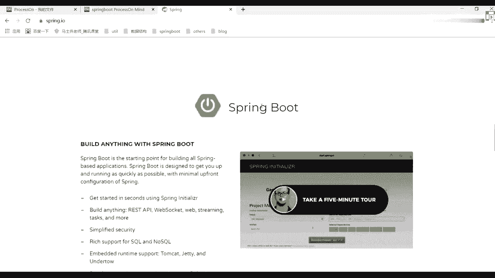
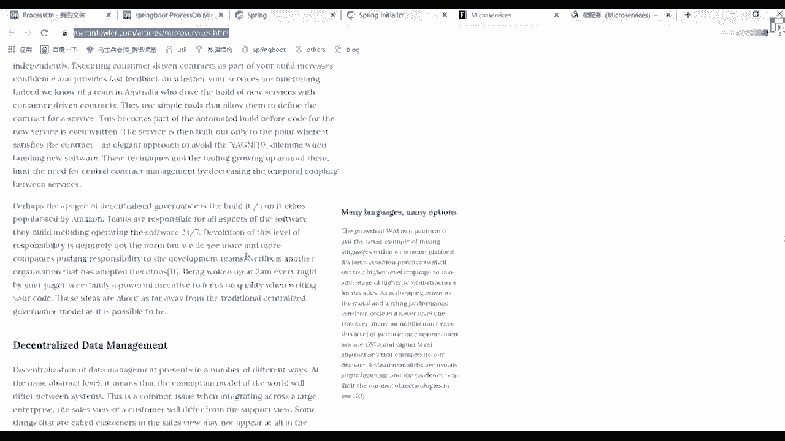
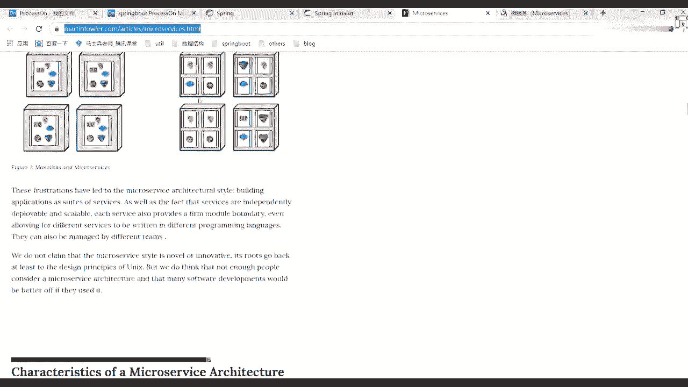

# 马士兵教育MCA4.0架构师课程 - P56：56、什么是微服务架构？ - 马士兵学堂 - BV1E34y1w773

就行了嗯好了呃。

禁止闲聊，我们接着往下看，好吧，刚刚说一下spring。

我们今天主要讲什么，讲spring boot这样东西，我还是那句话，我希望你们去看官网啊。

动画里面透露出来很多的一些相关信息，都是我们值得思考的，比如说很多人一直问我说，老师spring boot算不算是微服务啊，啊听到有问题啊，我说spring boot算不算微服务，就算同学扣一。

不算同学扣二，你觉得算吗，不算吧好吧，其实我照我的理解来说，我说一下可以说一下我个人的理解啊，在我看来在我看来，微博是什么东西或者什么东西，它其实就是一个启动器，就是原来我可能要做各种各样的一些。

配置文件的编写的啊，包括说各服模块单独起一个，然后现在呢我把它整合到一起了，所以这块他给了一个非常官方的一个描述，你可以看一下叫什么叫spring boot。

是一个什么叫starting point for building of spring base application，这句话什么意思能翻译出来吧，没有没有难单词，看错了，boot是一个什么呢。

叫构建所有spring1度为spring的应用程序，然后呢告诉你说starting point是不是一个启动点，是不是个启动点，好吧，再往下看，说boot设计用来干嘛呢。

Get you up and run，As quickly，As possible，什么意思，所以他这种设计为了什么呢，让你能够尽快的把它搭建起来，并且尽快的把它给运行起来，这是最好的一个方式好吧。

叫within minimal，叫apple phone configuration of three，减少我们对应spring的一个配置，这句话是很明清楚的描述。

你描述告诉我们spring boot是啥，有提到任何跟微服务相关的点吗，没听到过没有吧，所以你看到很多地方都在说spring spring boot微服务呃，这么说其实也没啥毛病，但是可能不太严谨。

也还是一样，看官方里面的一个基本描述，这里面是最准确的，它里面有什么特点啊。

第一个叫gun start in seconds，Using spring in the rather，什么意思，什么东西，这是啥，是不是说让你在进行配置的时候，通过在几秒钟之内就把它完成。

是不是有一个叫spring insuler的一个启动器，我们直接启动就可以了吧。

很多人在开发的时候是有这样的东西，叫study spring I/O，在里面我可以下载一个对应的一个炸包，建议运行，当然我们现在没人这么干啊，没人这么干，那怎么做，这可以，我们通过我们的idea。

是不是直接就给他进行一个集成，从idea里面直接做就可以了，好吧，S不要找事好吧。

你不来北京了吗，我等着跟你打架呢好吧，来北京找我好了，这是第一点，第二点是什么呢，叫building anything，什么意思，restful API吧，Websocket。

Web streaming task and more，是不是有很多很多这样的东西对吧，说构建任何事情再来看叫什么呢，叫更简单的一些security吧，是不是安全。

然后呢叫rich sport for circle，SQL非常丰富的一个支持，对于我们的circle和我们的NO SQL，然后内嵌的运行支持有tomcat，有gt，and you undertal对吧。

Developer production toys，是有很多开发者的一些高效率工具，比如说叫library reload，按照什么呢，auto restart自动启动，以及我们这个页面的一个自动加载好。

或者自动重载对吧。

再往下看这个翻译啊，我一直没解释解释对，我也不知道这个干嘛的啊，我也翻译不出来，谁知道可以给我说一下，懂我意思吧，在大家看看什么叫准备好一些特点，例如跟踪对吧，杜灵和我们的一些健康检查。

然后说worker in your favorite ide，可以在各种id里面进行运行，例如例如有什么spring steals，是一个工具的一个东西，还有idea以及我们的net beans。

net beans啊，现在已经没人用了，我之前的时候还用，现在已经没人用了，所以大家想一下，我们现在开发的时候更重要用什么，是用我们的idea之后，我们所有开发的时候都会在idea里面进行执行，好吧。

其实在1T架构课的时候，因为老师已经讲过我们对应的一个spring boot了，好吧，讲过我们对应的一个应用这块，大家应该都听过，为啥不说eclipse呃，这块是它集成好spring的一个工具吧。

也就是一个一个list吧，但它集成了我们spring是不是好吧，那现在你们公司没用什么用idea吧，还用玩家用的比较多一点，所以我们上课的时候也会用我们的店，不会用其他东西了，如果你觉得不习惯的话。

你可以把它切换成ELISE哇，这就无所谓啊，反正就是个DE而已，看你自己的公司notepad加加，你要能够派佳佳给我写好，你也是牛，你也是牛，我也佩服你，我也佩服你，好吧行了，这是官网的一个基本介绍。

这块就看这么多。

所以看完这些描述之后，你应该有个感知，OK我现在了解到spring boot到底是用来干嘛的，当然我现在还不会用，还不会用，不会用，没关系好吧。

一会我来教你如何进行一个使用，这边给大家画了一个什么呢，spring boot的一个思维导图呃。

我上课的时候习惯给大家画这些东西，好方便大家做一个整体的一个总结。

那我们来看一下吧，第一个叫回顾它需要某些spring的一些特点，比如说OWARE自动注入对，也就是说IOC和a OP，在我们的spring bot里面是有应用的，很多同学可能还没写spring。

没关系好吧，你不用管它，你不用管它好吧，这只是对spring的一个基本介绍，基本介绍你再简单看看就行了，好基本简单看就可以了，这干嘛呢，说spring是为了解决企业级应用开发的复杂性，而创建的。

就是为了简化开发，然后spring降低开发复杂性的一四关键策略，第一个叫基于poo的一个，轻量级和最小侵入性的一个编程，也写错了，侵入性，我写错别字啊，编程第二个什么叫通过IOC，第三个呢叫AOP好吧。

通过切面和模板减少样式的一个代码这块，我们之后再说讲spring时候我会详细讲的。

OK再来看spring boot有什么优点啊，说为所有spring开发者更提供更快的一个入门程序，然后再说第二个叫开箱，即用提供各种默认配置来简化项目配置，第三个叫内嵌式容器，简化web开发。

第四个叫没有冗余，代码生成和XM2的一个配置要求之后，我们会学一种新的配置文件，你们之前可能用XM2或者用properties之后呢，我们会有一个东西叫什么叫email y ml。

这是我们spring boot里面官网里面给的一个推荐，好官网里面给了一个推荐，到时候用起来就知道了，他写起来更简单一点好更简单一点。

然后后面我这也描述了一下，我们对你的一个架构演变之路，这是从网上找的一张图片。

可能放大吗，好大家看下图片啊，第一个单体架构什么样子好吧，SV架构以及我们的微服务架构，现在大家见到的更多是我们的微服务架构了，下面有对应的一些特点，这块下去之后自己来看好吧。

我们上课不做这样的一个演示了，没意义，下课之后我会把这个图发给大家好。

发给大家，然后呢后面有对应的一个介绍好吧，什么代理架构啊，是不是叫all in one吧。

指的是将一个应用而中的所有服务，都包含在一定程序里面，无论什么系统，都将数据库，web的各个功能模块放到一个可执行文件里面，比如说一个外包或者一个炸包好，这样来进行一个执行，第二个叫SOA架构。

面向服务的一个架构，它是一个什么叫组件模型，它将应用程序的不同功能单元简称为服务，通过这些服务之间定义良好的接口和契约，联系起来，接口是采用中立的方式进行定义的，它应该独立于实现服务的什么呢。

叫硬件平台，操作系统和编程语言，这使得构建在各种各样系统中的服务，可以以一种统一的和通用的方式进行交互。

刷完了很多同学不明白，好吧，你记住了什么叫RPC好，有这东西知道就行了，RBC叫远程过程调用啊，很多地方都在用它，很多同学如果接触过大数据，应该知道大数据很多的一些呃，框架都是一种集群的方式。

集群的方式运行的集群里面，其实用的是什么RPC吧，进行一些消息的通信好吧，包括一些健康检查了对吧，消息传输了很多点，都用它稍微听一下就可以了，如果你听到那个spring boot的那个spark的话。

应该知道周老师讲spark的时候，应该对这个点讲的比较清楚，什么叫RPC，因为在spark的源码里面有一个组件，叫什么叫RPCENV吧，这是自己一个环境对吧。

包括里面用了我们的NT有什么end point，Receive point，就有很多这样的信息好吧，你看完之后你知道了，反正不管怎么样，你记住学所有的技术啊，这些东西都是一样的啊，都是一样的。

OK被我联系说，我感觉SUV和微服务区别，就是有没有服务治理和福利，服务，注册和治理这块，我希望还是一样，我希望你们能清楚地认知到什么到底叫微服务，微服务那篇论文你们看过吗。

是关于微服务介绍那篇论文有人看过吗，没有的话，一会我带你们看看，我一会带你们看看，一会我带你们看看，我看下大道了，来看一下这边的一个文字描述对吧，叫微服务架构，什么东西，微服务架构是一种。

将单个应用程序作为一套小型服务开发的方法，每种应用程序都在自己的进程内运行，并以轻量级的机制，通常是HTP或者资源API进行通信，然后这些服务围绕业务功能构建，这个组件非常重要。

叫业务功能可以通过全自动部署机制独立部署，这些服务的集中管理，最少可以用不同的编程语言进行实现，并使用不同的数据存储技术，当然说完之后，很多人还是很懵，没关系，我们来看一个东西。

来看下他有错，等下。

看这块叫micro service，是不是要微服务。

微服务里面有一堆的一个介绍好吧，告诉你说什么到底叫微服务。

刚才说了马天鹰路德好吧，有很多这样的一个介绍吧，下面有很多的一个描述，很多老师我看这个描述。

看完就疯了好吧，我可能看不懂这些东西，没关系，这边中国人有个人做了一个翻译。

好翻译文章，我也找到了好看的船长好吧。

往下看，这告诉你们说微服务到底是个啥，好微服到底是啥，往下看，说微服务架构做做什么事情，这东西啊，注意了，这篇博客是对我们刚刚那个英文文档完整的，一个翻译，如果你谁看英文看着有问题的话。

可以参考这个中文文档来进行看一下，我还是那句话，我建议你们把这套东西好好看看好吧，翻译插件，那个翻译插件并没有这个文章翻译的好好，我还是希望你们把这个文章能够看一下，懂我意思吧，地址，可以啊。

这个这个中文的地址啊，给他找一下这个英文地址，上面是中文地址，下面是英文地址，OK把俩东西对比着，可以做一个查看好。

能帮助你理解到底什么叫微服务，因为现在面试啊，你要说你不会spring cloud，或者你不会double，面试都不敢出去，懂我意思吧，呃公司里面有些公司可能在用，有些公司可能没在用，就算没在用。

也一定是往这条线上进行呃靠拢的，懂我意思吧，这道题可能是以后的一个趋势，所以这块你必须要做一个学习，为什么在spring boot这块讲一下，微服务这个架构的一个体系。

就是为了帮大家把spring boot和微服务给区分开来，不要把spring boot当成一个微服务，反正我是觉得不太合适的，我不知道你是怎么认知的啊，好这东西每个人理解都不一样，那句话怎么说来着。

1万人眼里有1万个哈姆雷特好吧，你自己去做一个评估就可以了，我们这儿不看这些文字描述了，因为你看完这些文字描述，你整个人就疯掉了啊，太多了，我们这儿直接来看这张图，你看这个图能不能感受到一些信息啊。

能不能感受一些信息什么东西啊，这里面有个单词啊，你可能是不认识的，你可能是不认识的，没关系，这是这是不是有解释，是不是这个词，这是不是有个翻译叫整体应用架构吧，我就说我发现也无所谓了好吧。

他说一个整体应用架构，Put all its functionate into a single process，说他把他所有的一些功能组件方法，都已经放到一个单一的process里面。

是不是单一的进程里面，大家看到了这里面做了一个标识，什么标识这样子的这样子的，这样子的，这样子这样子的，是不是有各种各样的一些组件，你可以把每一个组件，每个组件都当成一个其中的服务，或者一个功能模块。

好吧，他们统一的都放到一个进程里面，是不是，这是我们刚开始那个整体应用架构，或者说单应用架构是这样的方式，然后慢慢他要做一个过渡，怎么过渡呢，他做了我所有东西都放在一起，可能不太合适。

然后呢我要把它做一个拆分，怎么拆分呢，看后面这个页面之图，是把每一个小的功能模块，或者说功能组件都做了一个独立的拆分，是不是拆分成我们看到这样子了，是不是这样子搭上了每一小块都单独的，都是单独的对吧。

他也说了，这把什么呢，把刚刚那个each elements of functionally into啊，什么东西是不是拆分好的一个服务里面去，是这样的一个方式，然后慢慢的又做了一个演变，怎么演变呢。

从这张图上往下面两分演变，大家看到了每一个功能里面，是不是就跟我们上面这块一样了，只不过呢他在外面多套了一个，就是相当于是多台的一个服务器，好吧，没服务器里面可以部署N多台的一个服务组件。

是不是有1234，这样的话大家看到管理起来其实是比较混乱的，或者比较杂乱的，然后又做了一次过渡点，在后面那个地方，这怎么做的，是不是说每一个服务里面好，每一个服务里面它会有不同的组件。

不同的组件我这块可以进行人为的一个选择，但是我规定好了一个里面是不是只有四个服务，这意味着你是不是在选择的时候，可以选择说，我往不同的物理服务器里面进行部署，这时候他们是统一工作的，而这里面每一个地方。

你都可以称之为什么一个对应的微服务。

只不过从这个图上看起来的话，它可以是一个集群形式，所以从这个图里面你能感受到很多的点。

就是这个论文里面，你是不是看到这个点了，往上翻。

这个图啊就从官网里面直接拿过来的，就这个图是不是一模一样。

是不是一模一样，好吧，这也做了一个最官方的解释，所以你把这个图如果看懂了。

你就知道哦，原来是这么回事，大概是什么样的一个意思，后面对我们的微服务做了一系列的一个解释，好朋友更多，我解释下来之后，自己看好。

我们，这不再多解释了，所以我希望你能认识到spring boot不是为服务，不要把它再说错了。

这个东西啊不是那么合适，懂我意思吧，OK我就想给你们扭转一下这个观点。

仅此而已好了，这个文章地址我已经发出来了，发完之后下载之后自己好好看看好吧，下完之后就看，把这块好好做一个理解，或者做一个了解。

这很重要，懂我意思吧，放这放哪个图，这个图也是一个颜面的一个图。

下面可以自己看好了。