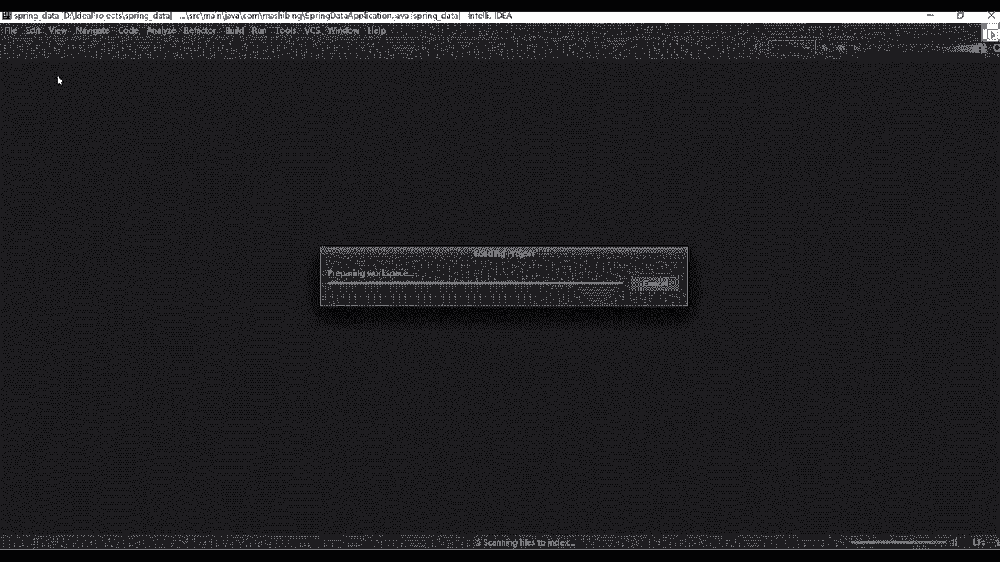
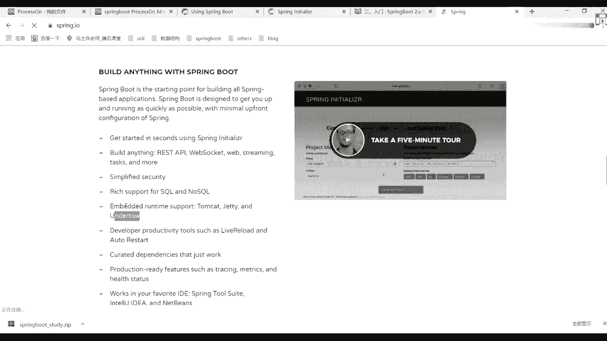
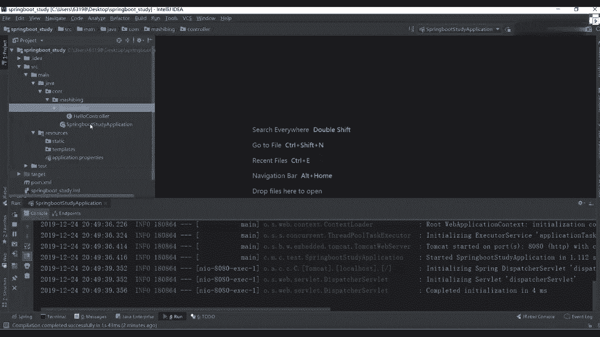

# 马士兵教育MCA4.0架构师课程 - P57：57、第一个springboot程序 - 马士兵学堂 - BV1E34y1w773

长时间了。

下面我们正式进入到spring boot的一个学习，怎么学啊，很多同学又懵了，老师一涉及到知识点学就慌了，如果后面再出来一个spring po。

我要怎么学习啊，非常简单，官网我一直在强调这件事的重要性，包括之前讲讲课的时候，MYSQL也是一样，我是不是带你看官网，你们要看好吧，叫spring boot，我们现在讲课用什么用，最新版本是2。2。

2好，2。2。2也有可能我们spring boot还没讲完，他就更新了，spring boot更新啊是比较快的好，但没关系，基本的核心点应该是不会变的，懂我意思吧，基本的核心点不会变。

然后这有个reference document，你可以从这儿进行一个查看啊，进行一个查看，里面包含很多个组件，先点开之后挨个看就行了，挨个看就行了，懂我意思吧，这块一定要看，那老师我不行。

我看英文之后头疼头疼怎么办，你知道老师翻译啊，没用好吧，翻译出来之后，可能意思跟你想要的意思就不一样了，我怎么做也非常简单，我这给大家分享一个也是别人写好的博客好吧。

叫gatebook git books，这里面有spring boot2点X1个中文文档，好，大家看一下这个中文档里面有详细的一个介绍，好详细的介绍，他说了，六一时间，基于spring boot2。1。

5的官方文档进行了翻译，注意了，这是2。1。5，我们现在用多少，2。2。1吧，但我错过了这个小版本的更新的话，其实呃有些点可能会变化了，但是能帮助我们对应做一个复习。

所以这块我还是希望你们能看一下中文档，看不懂英文，我们看中文总可以吧，但是官网这个学习道路你一定要注意了，一定要秉持下去，这是我我强调过这件事情，我觉得别别的老师也强调过啊。

你不要说老师所有东西等着我喂给你的意义，在之后你看官网其实能学到很多东西，这里面导航栏你直接看就可以了，其实我错了，如果我不讲，我不讲，你也应该能学会啊，只不过说这东西怎么学的一个方式。

所以这样我会带着你说，告诉你这块应该怎么学，老师可以把这些app放到相关笔记里面吗，可以可以啊，一会我会把这个SM的文档分享分享出去，一会儿我会把相应的一些笔记，给大家都补充到里面去，下课后再补充吧。

我们上课不浪费时间了，好一会我把这个图分享出去，你们从图里面直接看就行了，懂我意思吧，一会来做啊，这个忙忘忘了往里面进行整理了，好了，来往这看吧，上面的都是一堆废话。

告诉你说我要怎么进行构建之类的东西啊，我们这儿不看了，这块他翻译还没翻译完好吧，还没翻译完，但是这些东西已经够我们进行一个使用了好吧，第一个先看入门。

如果说里面对spring boot做了一个基本的介绍，他说实用boot可以很容易地构建出直接运行的，独立的生产级别的，基于spring的一个应用，我们对spring平台和第三方类库有自己的考虑。

因此您可以从最基本的开始，大多数人不同应用只需要很少的spring配置对吧，然后说你可以使用spring boot，来创建一个可以使用java杠站的命令来运行，或基于传统的外包部署的应用程序。

还提供了一个什么叫运行spring s script，的一个命令行工具吧，有多种样一个方式，把后面告诉你目标是啥，这块用看了你知道他运行完成，或者你写完代码之后。

我可以通过java炸的一个命令来进行运行就够了，所以所以当你写完代码之后，你看到的应该是什么，是不是应该是一个完整的炸文件对吧，这样更炸这东西所有人都知道啊，所有人都知道这块不用多说了。

OK下面有什么有系统的一个要求，现在一般情况下你们的电脑可能都满足了它，现在系统什么意思，告诉你说我用什么样的一个web容器好吧，server的版本是多少，以及我们的JDK的版本是多少。

现在一共多少八吧，所有人应该都用八了吧，没人再用六和七了吧，如果你公司里面还在用，就无所谓啊，但是说了，虽然您可以在java6java上运行不好，但是我们强烈推荐你使用java8，懂我意思吧。

一定要使用我们java8这样一个版本，告诉你如何进行一个安装好吧，告诉你后面一堆的安装方式，这不再多说了好吧，这里面有这样的一个机构的一个配置是啥，问问吧，你们对maven熟吗。

我来问一下现在听课的学生，有没有不会问问的，有没有不会问问的，不会的扣一好吧，应该有一些基础班的学生啊，不过没关系，之后基础班的时候我会讲maven，这东西怎么算会呢，你知道可把我把我把我问住了。

基本的操作吧，基本操作吧，这门课和架构一般的spring课是重复的吗，呃有一部分内容会重复，但是这边的话可能讲的更加，那个就一期的时候教大家更多是些使用，这边的话会使用加原理都讲，把使用家里面都讲了。

懂我意思吧，来往下看吧，这边告诉你maven gradle好吧，安装FRAMEBOOTCLL这块我们都不用好吧，所以对于你们没有东西不用管它往哪看，11叫开发第一个spring boot应用程序。

把spring boot应用程序啥意思告诉你，我如何来进行一个最基本的创建过程，非常简单，第一步先在电脑里面安装maven，我这儿已经安装了，大家看到我电脑的C盘里面已经有了一个maven。

但是版本比较低啊，比较低无所谓，这里面我希望大家改一个东西啊，改什么东西啊，改一个settings XML文件，这个文件里面做了一些相关的一个配置，其实有两个非常重要的配置，哪两个。

第一个是我们本地的一个仓库路径，你设置好好吧，第二个是你要参考的一个镜像地址，来看这我要用谁的，是不是阿里云的，是不是阿里云的，你这块可以自己做切换，无所谓好无所谓，但是我建议你换阿里云的。

因为有可能你访问国外的话，可能速度会比较慢一点，有可能我们现在班会比较多啊，阿里云的话可能速度更快一点，所以这块做一个推荐好作为推荐，当然你可以如果你对比较熟的话，你看自己心情想要什么英雄就可以了。

对于初学者，一会我会把这个配置文件发出来，发完之后你按照我的文件改就完事了，懂我意思吧，不要在这个配置上面浪费太多的时间，懂我意思吧，就这块，这是我之前配的，这是我之前配的，我不知道地址改了没有。

反正现在还能用，现在还能用，OK地址变了，不是应该是吧，就这个吧，反正我现在还能用啊，我不知道他有没有改地址，因为基本上改完之后没动过它，没动过它好了，不再管它了，不再管它了，你下去之后自己配就行了。

反正我就一直用这个配置，不管它了，然后第二个要创建pom文件，就是你把刚刚的配置粘过来就完事了，好这样可以选对应的一个版本。

这个配置class的一个依赖，是不是分别分了N多个步骤，然后告诉你说如何进行一个编码操作。

然后使用Rest controller和request mapping注解，然后把CONFIER注解。

然后命名方法是一对的样例了好吧，这块我们来运行一下，看下应该怎么做。

好，看一下应该怎么做，其实非常简单，我说了，这是第一种方式，你可以用我们的idea来做，除此之外你可以用这样的一个工具来做，当然你在自己学的时候用它没问题好，因为它没问题。

但如果在公司里面肯定没人这么干，太麻烦了啊，怎么说呢，这可以选一个maven project，然后选择一个编程语言叫java，第三个选一个版本，我们是不是2。2。2。

就这个版本下面什么叫project match date，这可以选什么，选上你对应的一个group，这个group一般是你公司域名的一个告，写了怎么写com点把生命对吧。

这可以写一个叫spring boot下键study，这有一个options是详细的一些选择，比如package name Python，把它删掉到点到com点马士兵就够了，然后是一个炸包。

这第一个版本是八，这都可以做一个选择，除此之外好吧，除此之外，这页面里面提供了我们各种加载的一个工具，好比如说上一个什么呢，叫d EV toys，是不是进行热部署的，第二个NOBO。

是不是进行那个那个实体类的那个set get方法，进行一个填充，填充的是不是只需要加注解就可以了，包括我们的web可以配置上我们对应一个容器，现在有我们的template是模板。

比如后面我们用sim对吧，security有spring security对吧，OS2。0是不是有各种各样的版本，然后circle我们用JDBC好，或者用spring data jdbc都行。

更上版本你可以选择自己需要的东西好吧，需要什么加成就可以了，暂时我们是不是就是原生的原声的话，我就搞一个什么最基本的，比如web项目吧，大家都选上勾，选完之后拿去吧，这边告诉你说一个flat。

然后把它合起来好吧，别东西不要了，点开它合不起来吗，我看这是不是可以写一个叫spring web，然后写完之后搞定了，别的东西不需要加，你不用管它了，然后再选一个按这个按钮，它就是下载一个站文件。

对我把这文件拿出来，这很快啊，这很快啊。

CTRLC2V拿过来，拿过来之后直接解压，他就是一个项目，然后用我们的idea进行打开，呃之前群里面有人问啊，说idea过期了怎么办，你过期了，你就从淘宝买一个，或者淘宝上搜一个。

我一会可以给你分享一个，就是免就是到2099年的一个东西啊，一个注册码，你自己需要做一个配置，很麻烦，你要不想麻烦的话，你就你就搞一下啊。

这个东西很基础啊，这不再浪费时间了，你们应该都会了，呃这spring源码我再带你们看源码东西呃，我现在给大家说一下，后续的话我们会讲spring源码，spm boot源码。

很多同学可能觉得那个老师spring boot源码，就是我看起来很麻烦，很麻烦，呃这块给大家说一下，我会给大家写写笔记，写写笔记啊，呃这我几乎整理了一些，大家没整理完，后续的话会给他加东西的。

就是你在入口的时候写的东西，应该加什么样的组件，这块注释啊，我都会给大家写的啊，都给大家写的懂我意思吧。

所以希望你们很多人看源码看不懂，或者说看完之后就忘原因在哪，你很少去做一些注释或做一些笔记，你把这东西做完之后，你回头再看的时候都会感觉比较清晰，OK2099年那个工具破解完之后，就是2099年的啊。

所以你们如果需要的话，我就给你们，你们需要吗，需要的话，一会我分享一下，这没啥难的啊，这很简单的东西，需要就给你们无所谓，要啥你也要啥，你们什么你们都想要，That cost project。

这样可以选什么，选哪个有import，有open吧好吧，交易版可以用，打开我们的，desktop选他，Ok，那就这样会有一个maven的一个构建好，maven的构建啊，等一下是不是构建好了。

构建好了之后，这块可给大家说一下，你可以把几个，如果你看到这个目录比较多的话，可以把这东西删掉，这东西没用推删了，反正我每次删掉他，我感觉没啥用，OK这就来一个SRC。

然后人家s min java里面有什么com，然后呢马士兵里面有个boot study application producation，就是我们对应整个程序启动的一个入口了，明白意思吧好吧。

这块就有这东西了，所以这之后你就可以怎么样直接运行，当然我们现在运行之后没有任何效果，因为我现在是什么都没写，什么都没写吧，这几个是啥啥是啥，开启源码输入啊，现在讲到源码啊，现在讲源码已经懵了。

他不知道怎么样，现在这样直接运行了，运行完之后能开启，我们能运行，我们对应的一个东西，删了几个是啥，一个是git的，一个是那个呃，maven的一些相关配置文件都无所谓，直接删就行了，你这个id留下。

把其他东西无所谓，好现在我现在这种东西无所谓啊，然后看完了之后。

事件是不是启动好了，我们现在没法访问，因为你什么都没写，什么都没写，没意义，那怎么做非常简单，先看一个文件叫pom文件，pop文件跟我们刚刚那个spring boot是相呃。

跟我们那个maven是相互关联的，大家看一下里面有什么样的一个东西，好吧，往下找，刚开始上面写一个parent，是不是我们父母的东西，或者说一个副项目里面的东西。

还有个东西叫spring boot starter parent，这样可以点进去好吧，点击之后就看到有parent，是不是各种各样的依赖的spring boot dependency。

后面有各种各样的东西，过滤过滤器啊之类的相关相关属性配置，你这还可以往里面再接点点，点完之后往下翻插这块的吧，这块属性我希望给你们看一下，因为我们之后再加载我们spring boot的一些相关的。

一些依赖的时候，我们很少去写版本好，为什么写版本，因为在他的父亲的父亲的这个配置文件里面，已经帮我们加了各种各样的一个版本了，这里面有一套配套的，所以一般版本这件事情我们就不会搬了，我们不加了。

不加了也没啥意义，好吧，这也帮我们定义了很多东西啊，很多东西这直接导入就行了，懂我意思吧，哇这里面这个配置啊，下载之后可以详细看一下，之后将原版的时候我会带你们详细看啊，这是我们这个父亲里面的东西。

再来看是对于我们当前这个项目的，然后告诉你说这节课的版本是1。8，这有个dependency是我们的依赖，依赖里面包含两个东西，一个叫web，一个叫test，这块希望大家注意一件事，什么东西呢。

在我们的spring boot里面，它定义的这些依赖都是非常非常规范的，什么东西上面全部叫o r g spring framework。

点bot下面的都是spring boot杠start开头的后面是一个web，其实这个start就告诉你了，尤其其之后意味着什么，如果我想加一些其他额外的组件的话，只需要加载对应的一个依赖就行了。

这东西怎么加啊，也非常简单。

来往下看，我们来找一下吧，还是一样去官网找啊，知道在哪吗，官网我看英文官网在哪找，你选这个叫uzring boot，点了之后你往下看看这有个哪去了，往上看。

在这块什么东西叫spring boot application star，只有一堆的启动器对吧，Rt mq a m q p，然后呢a OP，然后呢有bench catch，是不是各种各样的组件好吧。

你后面需要用什么dj b AD DB c dj pa好吧，LDAPMONGO对吧，你有后缀REDIS是什么都有，直接点开我们的pom看一下，在泡沫之后会有一个对应的依赖，你把下面的一些加进来就可以了。

我加进来就可以了，直接粘非常方便的一个方式啊，所以官网里面都帮我们定义好了，拿过来之后直接往上粘搞定。

懂我意思吧，那么现在我们已经把当前项目给导进来了，导完之后再怎么做。

是要测试一下当前项目能不能运行啊，首先因为我导入了一个web模块，导入一个test模块，test不用说了，这是个test包里面你可以直接进行一个运行，这非常简单的一个方式啊。

里面是有一个context loader里面写就行了，主要是我们这个web，也就是说我可以把当前项目当成一个web，项目进行运行，但是你看一下，我这有部署任何跟tomcat相关的东西吗，没部署吧。

因为刚刚看到一个东西叫什么叫内建的，看官网首页，在官网里面是不是有一句话，找一下，玩法，什么东西叫内建的一个运行时的一个支持吧，例如tomcat gt and the road undertow。

是不是各种各样的一些组件，所以这块它本身里面就有了把内置的啊。

内建的这样的东西，所以我们这不需要做任何的事情了，这块所以我刚才为什么你读那块东西，你读完之后你能获得很多启示，现在现在怎么做呀，非常简单了，现在运行的时候，这你有一个package。

当同学老师写control，肯定的很多人都这么干对吧，写完control之后，new一个吧，这个class叫hello，Control，OK写完之后里面能写的东西啊。

我在左上写一个方法叫public string hello括号，然后里面写一个，比如return hello，这样写完之后本身非常非常简单好吧，写这块的时候需要你具备一个基础知识。

就是spring mvc，好像MVC当然我说过了，有些同学可能没之前没有接触过，之前没接触过，没关系，这样你按照我的写就可以了，那这块要加注解了吧，之前我们加注解怎么加的。

这是不是写个东西叫at controller，搞定了吧，是不是搞定了，然后呢这块是不是要写写什么，是写一个at叫re quest mein main，写一个对应发送的要求，发送一个请求叫杠。

比如写一个hello，是不是写他写他之后按照我们之前说的，除此之外你还要写什么东西，这个叫at response body，是不是写这样的东西，那我先这样写，先这样先这样写。

一会儿再说rase control的事，是不是先这样写，这样写完之后，我们现在该写什么了，这是不是有一个main函数，是不是有个main方法对吧，一会儿我们直接把3年项目重启，等下重启啊，现在要重启。

报错了吗，没有吧，开启端口多少是8080，端口端口开启了。

那个时候我可以打开我的浏览器进行访问，The local host8080，然后加一个叫杠hello，请求到了吗，是直接返回，就是我们的hello，这个大我们，我写一个local。

HELO这边请求到了对吧，这是一种方式，除此之外，刚刚同学说了，老师可以用一下Rest controller，什么意思，在我们刚刚这个代码里面，一定是已经发送了一个对应的请求。

请完之后，我这是不是返回去一个合格的字符串，你这可以做一个修改word，然后重新启动。

修完之后一定能看到对应效果。

改了吗，改了吧，是不是就我们刚刚写代码，其实就没问题了，当然很多同学在使用的时候，他不太喜欢用这样的方式，他应该怎么写啊，老师我要这样写，把东西干掉，不要了，然后上面这块我要改另外一个注解。

叫什么叫Rest control，打开包，等下来吧，打完之后我重新启动，让他再进行一个访问走能用吗。

刷新先缓存，刷新没问题吧。

是不是也能访问到，所以两种方式你在写的时候都行好，你喜欢用哪种就用哪种，这无所谓啊，这个东西没有什么版本的限制，说我必须要怎么样啊，这东西没有什么限制的，懂我意思吧，所以写的时候直接写就可以了。

这是一个最基本的程序，大家看到了，我刚刚运行的时候有什么区别，rise control相当于是我们的control加上我们的response，帮助他返回的时候，只能返回一个字符串，返回字符串啊。

这东西后面会讲的，不用担心好吧，这个是不是有一个这还有个control，刚刚在我们的官网里面。

官网里面看，这是不是也给了一个建议，找一下返回叫格林斯，哪去了，刚才是不是给了一个叫start，这个只要不说你第一个spring boot的一个项目吧，项目完了之后往下走，这边你说我要写什么东西。

看这这写什么东西吧好吧，官网里面是不是推荐我们这样做的，所以你写的时候也可以这样做好，也可以这样做，直接把这个写成它就可以了，刚学的时候还是那句话，在初学的时候，你就按照他的配置写就行了。

他怎么写你怎么写。

你粘过来就搞定了，懂我意思吧，在这块我希望仅提醒一件事好吧，特别是对于我们队的一个初学者，这点非常非常重要和非常非常关键，很多同学在创建我们当前这个包的时候，不太注意啊，不太注意真不太注意啊，高老师。

我这个spring boot study application，还是我们对应的整一个应用程序的一个启动器，这个启动器我能随便放位置吗，我能随便换位置吗，比如举个例子，这块我在里面在这里面吧。

再创建一个package，这写一个test，写完之后我把刚刚那个移到我们test里面去，也去了吧，移完之后，这块我是不是又可以运行我们的程序运行走。

看看这是不是已经没问题，启动好了吧，当你启动好这东西之后啊，那怎么办，我是不是可以进行访问了，还是一样，同样的请求地址告诉你说错误页面对吧，我们路过扫描不到好吧。

修改一下扫描包路径，OK所以这块你要改变你当前这个包路径的话，上面要加一个配置项吧，什么配置项叫auto a，哎哪去了，sca computer代码好吧，后面加一个组件加什么。

不加上我们对应的一个the com，第二啊，士兵看着我加加加加一个这样的组件好，加这个组件加完之后，我再重新启动。

然后呢我现在在刷新，请到了吗，请到了吧。

这是不是请到了，大家发现了，原来我默认情况下，如果我没移动之前，它默认扫描是什么，是不是看马士兵下来的包好，但有些同学当然一般是没人去动它的，这肯定没问题，但是很多初学者在建包的时候，他不注意。

不注意之后，他把这个报告位置随便都是乱放，之前我记得咱们班有一个学生，谁问我来着，就这个问题，他把包位置移动了，发现我扫描扫描不到对应的包，所以此时报错了，这个时候一般情况下最好不要动，为什么不要动。

因为在我们的这个注释里面啊，注释里面它有一堆的一些自动的一注解吧，好吧，这个注解也很重要好吧，注意这个注解也很重要好，这边讲究相关的一些相关信息，这注解一会儿我们再聊这事，但要知道如果你改变了。

你要加上我们这个干，告诉你说你扫描的包到底在哪个路径，然后把对应路径给加上，加上这个路径之后，它就能进行扫描了，但一般我们没人干这事，所以你把它给移出来好，一般不要去动它好，一般不去动它，弄弄弄错了吧。

老板点，我会把它删掉，就你发现错误之后，咱们是刚学习嘛，发完错误之后，你要知道在什么地方能做一个对应的修改，好遇到什么问题怎么解决，它就搞定了，懂我意思吧好吧。

这是我们刚开始spring boot的一个基本讲解，大家看到了难吗，不难吧好吧，非常非常简单的一些东西，一些配置啊，很简单的一些东西，后面这个resource里面有什么东西，一会我来，我来说好吧。

我们通过源码且能看到很多的一个配置，懂我意思吧，注解我问一下呃，咱们同学有人自定义过注解吗，有人自定义过注解吗，都自动过是吧，想想自行注解没好了，在这块我希望大家明确一件事，明确一件什么事情呢。

注解其实是一个非常重要的东西，而且非常怎么说，非常非常好玩的点，一会儿如果大家没接触过的话，一会我来讲一下自定义注解，在我们的JDK里面，它默认提供了14个叫圆柱解，叫圆柱解好吧，什么叫圆柱解啊。

一会儿来解释，OK我们休息一下，10分钟之后，我们回来讲一下注解相关东西之后，你再看注解的时候，你就不蒙了。

懂我意思吧，别看到这个注解之后，我看源码的时候，看这个注解干嘛呢，不知道好一会我来讲这个东西，你知道了好吧，一会再聊，所以10分钟10分钟回来之后，我们再接着讲好吧，这人就不多说了。

