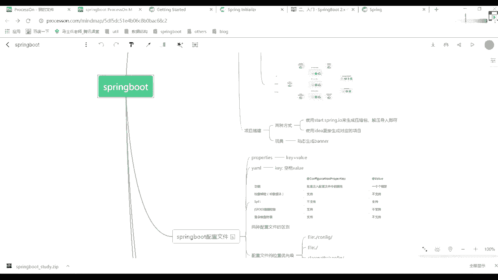
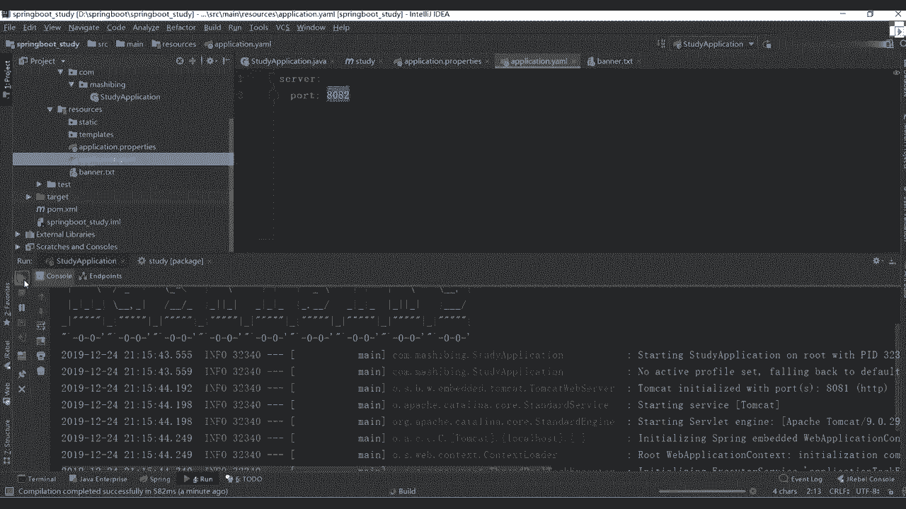
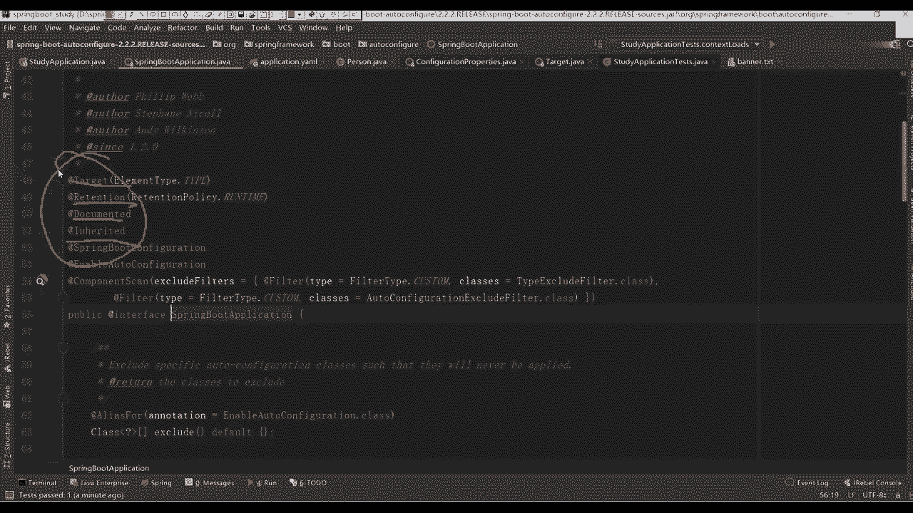

# 马士兵教育MCA4.0架构师课程 - P58：58、springboot配置文件及区别 - 马士兵学堂 - BV1E34y1w773

好了多余废话，咱们不多说了，再多说了，咱们就聊这么多吧，下面我们开始正式讲课程，来韩在同学扣波一，大家记住一点，还是那句话呃，因为咱们机构啊说实话成立时间并不是特别长，所以可能有很多点。

可能给大家做的不是特别到位，所以如果你对哪个点有疑惑啊，或者说那个资料找不全，这些东西你及时联系班主任，班主任老师会协调我们这边给大家补上的啊，这大家不用担心啊，该有东西都会有的，Ok。

我们后面会做的越来越好，但是希望大家如果有哪些地方找不到，不要着急好吧，就是联系班主任或者联系老师都行好了。

来我们下面正接着讲我们的spring boot，刚刚呢我们是创建了一个项目，当然这个项目在进行创建的时候，我们是从官网里面下载一个包好，下载一个炸包压缩包，然后解压之后运行的在公司里面好。

在公司里面一般没人这么干，太low了，我也说过了，在我们的idea里面，它本身自动集成了我们这样的东西，所以怎么做非常简单，我们把当前项目给close掉，我们看一下在idea里面。

idea里面怎么进行一个创建，然后给干掉，创建一个新的项目，注意在这里面你直接选择这个spring in suler，初始化的一个东西，写完之后选择默认的一个网址，点next上面写的时候也一样。

先写上我们对于一名com点发视频，再写一个study，大家看到了，跟我们刚刚那个东西几乎一模一样，然后下面呢把这个包改一下，把SD干掉掉啊，别的东西就没有了，然后点next，这样可以选择我们需要的组件。

假如说你需要web，选web，把第一个给选上，假如你需要一个开发者工具，比如说long box，再比如说这个热部署，你勾选上就可以了啊，这直接勾，不需要进行任何的一个搜索好吧，那再往下看next。

然后可以选择我们对应项目的一个目录吧，这个目录我们这改一下，我给你们单独成立了一个目录啊，这有一个spring boot。

今天尽量别拖堂了，好怕化了，今天肯定不拖堂好吧，十点钟我们准时下课，下课之后，你们该去宾馆去宾馆，该气旅店去旅店好吧，该干自己的事干自己事，哈哈不浪费大家时间啊，2123看到了。

把这些GMV这些项目都给删掉，我没用啊，他说我有时候看他难受，我就把它删掉，你们不想删也没关系，不想删也没关系，OK好了，下面创建的时候跟我们刚刚是一模一样的，大家看到这个目录的结构。

目录的结构跟我们刚看到一模一样，所以这块你直接拿过来用就行了啊，非常简单一个东西，非常简单的东西好了，下面呢我们再接着往下讲。

对应的知识点讲什么呢，刚刚我们简单部署了一个web上面的一个项目，把web上面的一个项目建完之后再说了，有两种部署的一个方式，一个是three start spring IO来生成压缩包。

解压即可导入第二个使用idea来进行运程好吧，第三个，这有一个小玩具啊，什么叫动态生成我们队的一个banner，这东西啊是一个小工具。

我们这可以做一个基本的演示，比如这块你看了之后，你每次启动的时候，这会输出一个什么呢，叫spring boot这样一个东西，如果你想改变的话，也非常简单，官网里面告诉我们了，我们这应该怎么做，往上翻。

是不是这样的东西，你看他难受。

没关系，你可以做一个更改，这块在哪啊，很简单，我们找一下官网里面的东西，还是从官网里面找，返回返回找一个un spring boot设置东西搬哪，我们找一下搬哪哪去了，没有吗，找不到了啊，这这这这有啊。

我找一下这个banner吧，Nya banner banner，诶怎么没有了，看到这里有个自定义搬哪，这是自定义banner，你点它之后，它会出来告诉你说你要仔细便说。

可以通过在class pass里面加一个banner txt的文件，然后呢，或者说把这个位置指向我们对应的一个文件。

你就可以进行一个更改了，非常简单的一个方式，我们来简单做一下，打开resource，这里面创建一个file叫banner，点TT学民歌是吧，刚才说说学民歌这块该怎么做呢，非常简单，这给大家两个网站。

这样网站你都可以直接进来进行一个生成，bot里面这个叫spring boot banner，直接写，这可以写什么呢，这是不是有些东西生成是不是对这样的图标，你把这图标直接粘过来。

CTRLC粘粘在我们这个文件里面来，粘完之后我们再重新启动，看到了吗，是不是能看到对应效果了，接下来之后你可以做自己定制化的一个manner，一个小玩具而已，如果不需要就算了，一般没人搞这东西。

反正我觉得这个东西如果初学者的话，可能觉得挺好玩，你可以试试啊，你可以试试这东西啊，没没没多大价值。

这是一个网站而已，把这网站给大家从百度直接搜就行了，这个网站，然后除此之外，除了这个网站之外，还有另外一个网站，这东西这玩意里面也能进行一个搜索，比如说叫那是不是有点东西啊。

你设置完之后拿过来之后直接改就行了，不也是一样的，明白了吧，佛祖保佑永无bug可以改啊，你可以自己去改，我们这不浪费时间了，你知道有这样的东西就行了是吧，能做一个对应的一个修改哇，非常简单。

一个小工具啊，你把它用一下就行了，所以给大家简单说一下，看完之后往下看看，这个东西叫spring boot配置文件好吧，终于到我们的配置文件了，配置文件这块其实非常简单，刚刚我们开启了一个web项目。

你可以直接进行一个运行，进行一个部署方面的东西。

我说了，它可以生成一个对应的炸包含情的吗，是对炸包打开我们的pom文件，破文件下面这呢有一个东西，是不是一个plug in，你通过plug in点开我们的maven project。

在里面有一个left cle，这有个东西叫package，你的成判决之后，它会自动进行一个打包，打包之后这个包就可以进行运行了，大家看一下这个效果，最终你们如果写完spring boot程序之后。

你可以放到我们对应一个服务器运行，运行的时候，用我们java运行就可以了，这样可以把它给是不是这样的，包好把账号拿过来，受音pro是这包。

然后呢SEVD。

这直接java杠J，回车看过吧。

它可以直接运行的，这不能报错了。

808是不是已经被占用了，因为我这是不是已经启动好了，好，嗯一样的啊，你把它运行那个炸包也可以直接进行运行，随时开启了一个8。8的端口，好运行之后能出来，我们对应效果就这东西。

所以呢你可以在我们的idea里面运行，也可以放到我们对应的一个服务器里运行，运行方式变得非常简单了，包括我们现在官网也好，还是我们对应的视频网站也好，我们在运行项目的时候都是用spring boot。

直接打大包运行的，下载之后知道怎么部署就行了，非常简单一个小点哎。

再往再往返看一下我们对应的一个配置文件，之前我们见过各种各样的配置文件。

在我们当前这个resource，resources这个资源目录下面，你可以填写我们对应的一个配置文件，这个配置文件我要写成配置文件，其实也非常简单，刚开始的时候有个东西叫什么。

叫obligation properties，这个properties你在写的时候，它有自己的一个固定格式吧，什么格式叫K等于value，是必须这么写，这样写本身也没啥问题。

但是在spring boot里面好吧，他给我们推荐了另外一种比较好的一个方式，叫YML或YML好吧，有两种这样的一个配置文件来简化我们配置，很多同学说，老师我在用那个压缩文件进行配置的时候。

发现他有很多坑，好看的，有很多坑这个坑啊，只不过说你对这个当前配置文件，不太熟悉的原因，如果你对这个文件足够熟悉的话，这块是没有问题的好吧，而且写起来是比较简单的，懂我意思吧。

那我现在怎么做这件事情，来看一下他怎么写啊，还要他说了配置文件点，他这有一个对应的文档吗，我把文档地址拿过来，怕怕自己找不到，转过来走，转过来再告诉你说，Loading y ml。

是不是使用我们这样的一个，亚马逊的一个配置文件了，告诉你了，环境里面有DV，有production，是不是开发环境有生产环境，你这都可以进行相关的一个配置，如果你不用这种方式的话会怎么办。

用我们的properties这样的方式，properties的话就是我们的K等于value，而且我们用YM的时候，前面是不是冒号，冒号冒号是不是K冒号为这样的方式，只不过前面如果你有很多重复的好吧。

如果你有很多重复的一些数据的话，这是不用重复写了，比如这个东西叫environment，那看是不是只写一遍，所以呢这块推荐大家使这东西好，使用这样的方式，如果你觉得不太习惯，如果你觉得不太习惯。

你就还用properties，没关系，好也没关系的，这块反正都一样啊，都一样啊，配置文件嘛只是为了加载我们某些的一个属性，你只要把这些属性应用对了，这块是不会有什么问题的，懂我意思吧，这也说了两种方式。

一个叫K等于V，一个叫K冒号，然后空格value好吧。

这块注意了，一定要加我们的空格，那我们要怎么写啊，来先写一个最基本的一个配置，写什么叫server，是不是有个回车，看看这是不是可以直接等于号，比如说8080，你这样在运行的时候把它关掉啊，声音响。

你在这不行，多少号，这是我们的properties这样的一个文件来运行，是不是8080，如果不指定，默认是8080啊，你这可以改8。81，再重新运行，你这样看到这个信息，更改8081吧。

好这是其中一种配置文件的方式，与此同时，我可以在这下面再建另外一个配置文件，file叫什么，Application，点YAM是这样方式，这里面怎么写，叫server，依然有提示回车，他看到了吧。

8082看到了server冒号，然后加上我们的port冒号，加上8082，那这个时候大家想想，如果我两个配置文件都在的话，我会用哪个，可以都在吗，可以吧，来运行看看效果。

多少看这个值8081吧好吧，那你怎么办，把这个文件删掉删掉删随便删这项目改，不知道看多少，8082了吧，这是不是改过来了，所以此时你在写的时候好吧，谢谢大家，反正我个人啊，我个人喜欢用这样猫。

好像音频歌词又不喜欢那个properties，这无所谓啊，这无所谓，你这写的时候你习惯的那种风格就是风格，如果你之前用properties习惯，你就用它好，如果你用YAML习惯。

你用它这东西没有什么习特殊点，不管你用properties也好，还是用我们的ml文件也好，这块都有相关的一个提示吧，比如说three dimvc点是不是可以加很多相关的。

比如data format是不是对应对应格式，特别data source是不是可以配置，我们对应source源，这username password什么的东西都有啊，都有好吧，这一定要注意了。

所以这块属性写的时候，它会有对应的一个提示，但这块注意啊，你在写具体值的时候，如果把中间这个空格给删掉，把空格给删掉，这块是不能识别的，所以建议大家把这个空格一定要加，一定要加个空格，大家看到了。

前面的字体是不是也你是不是也改变了啊，这是变成那个橙色的了，懂我意思吧，怎么配这两个数据源这个东西啊，咱们讲数据源，咱们再说好，暂时涉及不到啊，暂时涉及不到，OK就这样一个方式加一个boss ram。

在boss上发，这只是一个简单的一个配置文件好吧，简单的一个配置文件，就大家知道这个东西怎么配就行了，只不过在我们当前这个配置文件里面好吧，它会有多种多样的一个属性吧，你根据我们的属性去加就行了。

然后这边给你列出来了，说我在使用这样的方式的时候好吧，它有什么样的对应的一个区别好吧，两种配置文件的区别，这给大家写出来了，好配置属性的一个数据，啥意思呢。

这有个东西叫configuration properties，是不是提到我们的注解了，这个东西叫at value，是干嘛的啊，这干嘛的好，是不是有功能，有什么送餐绑定SPEL，然后呢。

JS2303复杂类型的一个封装，是从网上抄了一个图，网上抄了一个图，这图里面标志说，哪个配置文件支持哪些相关的一个信息啊，哪个配置文件支持哪些相关信息，这块怎么验证啊，其实也非常简单。

我们这儿可以来写一下，写什么，刚刚的配置文件是我们直接加载的。

什么是我们spring boot里面默认的一个配置，与此同时，网易同时我这其实可以定义自己的一些配置，比如说一个person冒号换写一个name冒号，张三好吧，edge冒号12。

然后呢再写一个cs冒号冒号，再写一个男，OK再写一个，还有啥呀，多少次冒号再写一个，知道一些boss了，还有什么类型政策，已经类型都都都都用到了，还有一个list吧，比如写一个叫LEX冒号。

再写一个book，看到了，如果你现在想想写一个list怎么办，写个list的这怎么写啊，写的方式也非常简单好吧，回车后面加一个杠，加一个叫gm o v i e杠，这写一个go可以吧。

是不是写这样的方式好吧，你把这些东西定义好，当你定义好之后，我可以怎么写了，在我们当前这个包下面定一个东西，定义一个，class别了，定一个包吧，page这是一个叫entity。

里面就有一个part文件，然后呢定义好之后，里面可以写了private string name，然后private integer这写一个，然后private，String sex。

然后再往下写private list，全部都是我们对应的一个私有属性，当你这块定义完之后，还要怎么写，一样的把他的一个方法生成一下，OK同样的生成一下我们对应的一个构造方法，下面再生成一个吐司。

不搞定了，好吧，是对，这样一类，现在我想做一件事情，什么事情，我想把我当前这类的属性都加载过来，你告诉我怎么做，就说我现在这些属性是不是没有值，没有值的话，我想在这个类里面把这些属性值都给付过去。

我怎么付，你们知道吗，怎么写at value，对不对，怎么写，这写一个上面写at，value l u e这样写吧，后面写上我们对应属性值是这样写吗，要写一个person，点name，这样写吗，好吧。

这样写的太麻烦了，这样太麻烦了，你是不是每个属性都要加，如果有100个属性怎么办，好吧，刚刚同学说了，按E此生上面加一个叫at，Config c o n f i g，properties加他。

然后后面加一个前缀叫perfect，好吧，后面等于什么，是一个六，大家看一下我这是不是喜欢他了，我是喜欢他了，当我写完这个属性之后，我现在是测一下我怎么测它的啊，怎么测它，现在就能把它注注注入进来了吗。

就能把这些水拿过来了吗，你需要做测试，这里面是本身提供了一个测试的一个包，对不对，这是测试类测试里面我要定义一个东西叫PO，再写一个at ow，这里面写一个属性写啥，写一个叫SOUT，报错的。

Could not weather，do not wear吗，没啊，这少写东西，上面写个啥，At，P o r e n t s o n component，写错了吗，com啊，这对吧。

写完之后这样有问题吗，没了吧，那这块的话，我是不是可以加一个对应的一个测试了，好运行一下，看看这边打印的一个属性值往下翻注进来了吗，这写的name等于张三，等于十十二。

size等于男less等于book movie girls，是不是把对应的属性都加载进来了，也就是说这样的一个属性配置文件好吧，我除了可以加载我们spring配置属性之外。

我自己的属性是不是也可以往里面定义，是不是可以这样的方式啊，这个文件是不是比较好好，你是可以直接往里面加这个对应属性了，这东西啊你们之前应该是接触过的，或者说应该是了解过东西的，这东西啊比较简单。

但关键点在于什么呢，在于说我刚刚加了个啥呀，第一个把它设置成一个组件才能进行扫描，到了第二个呢叫configuration properties之后，我会带你们看源码的话，大家注意了。

我要看到N多个什么什么properties的相关属性，好比如这可以做一个搜索嗯，诶怎么出不来，这source，怎么重重写了，看着是不是有个东西叫data source properties，对不对。

你会看到一堆的properties这样的配置文件，好吧，这配置文件就是用来加载我们对应的这个，YM里面的一个配置属性了，通过这些属性，我能够直接把相关的一些信息加进来，所以大家发现了其实最关键的点在哪。

在于我们的注解吧，好那么问题来了，注解这块是不是要讲一下啊，有多少同学了解一下我们这个注解啊，你们之前说了，海洋老师讲课的时候讲过那个自定义注解好，先注意了，注解是对于我们的JJDK里面自带的。

它里面有四个叫圆注解好，叫圆注解的东西，好吧，我不知道你们怎么去理解它，也就是说我们在定义注解的时候，如果你打开任意一个注解，打完之后看到了是一个public，然后叫at interface。

写一个东西好，它本身包含四个对应的一个属性，这四个属性分别表示不同的意思，来我这看吧，找到我们最开始的一个主类spring bot，你往上翻有什么呢。

target retention document和inherited，这四个属性干嘛的，41干嘛呢。

你是不是要做一个分别的解释了，之前在基础班的时候，其实我讲过这些注解的相关属性，给他找一下哦，原来没觉得东西特别难啊。

那可能对这个东西不太了解，我看叫资金注解，之前讲话说什么叫注解说，annotation是java5开始引入新特征啊，中文名字叫注解就不用说了吧，他说他提供了一种安全的，类似于注释的一个机制。

用来将任何的信息和原数据，与程序元素进行一个关联，为程序的元素加上更直观更明了的一个说明，这说明信息是与程序的业务逻辑无关的，并且供指令的工具和框架进行使用，也就是说。

如果你之后自己公司里面可能要封装这些框架，当你自己在封装框架的时候，你一定要自己定义自己的一些注解吧，是不是这意思，刚才说了，ANEDUCATION是一种修饰符，现在修饰符一样可用于包类型。

各个方法方法，成员变量参数以及本地变量的一些声明语句中，java注解是附加在代码中的一些原信息，用一些工具在编译运行时进行解析和使用，起到说明和配置的一个作用，注解也不会。

不会也不能影响代码的一个实际逻辑吧，仅仅起到一个辅助作用，包含在java runotation这个包中，正常相关的一些解释，看着有什么意义好吧，最关键的是什么呢，是下面这块往上翻，说注解的作用。

第一生成文档是最常用的好吧，比如说java最开始的一个注解，常用的有at pat return，你在定义好一个方法之后，你在生成注释的时候里面是不是有些属性，第一个参数，第二个返回值都见过吧。

好看源码的时候都看过这些相关信息啊，看打开看这块是不是return是吧，这没有没有PARAMSPARAMS吗，找一个你找一个有参数的方法就看到了好吧。

有的东西这些东西啊都是我们刚才说的，要注解是不是跟踪代码的一个依赖性，实现替代配置文件的一个功能，在编译时会进行一些格式检查，如ADWORRIDE放在方法之前，如果你这个方法并不是覆盖的，超越方法之后。

则编译时就能检查出来，是不是它对应的一些作用了，这些文字性说明啊，你稍微看看就行了，你要注意注解，最根本的或者最本质的原理是什么，是反射好反射这块有人知道吗，都会吧，没有人不会反射吧，不会反射。

同学给我扣个一，有不会的吗，会的扣一不会扣二有不会的吗，没有吧，聊到反射这块，我补一个额外的知识，补一个额外的知识呃，第一次你们在接触反射的时候在哪，接触的是在我们的GDBC里面，接触的应该是GDBC。

在GDC环节的时候，第一步我们要做一件事情，叫什么叫class，然后呢点for name，后面写一个com，点mysql driver是这时候用的好吧，这时候有一个问题就是为什么啊，为什么。

因为你这样写，做完这个这个呃，根据这个字符串找到这个对应类之后，你会发现它会生成一个大写C的一个class文件，但你下面用的时候用什么叫driver manager gala。

我的jy manager是怎么知道这个类的，这里面会延伸出来另外一个机制，不知道有没有听说过叫SPI，有人知道吗，有没有听过这个东西，Spi，有人听过是吧，OK啊还是有不少同学听过的。

就你可以4double用了，OK是我们学的比较好啊，忘了基础课听过，对我基础课讲过，我基础课讲了基础课讲过这东西了，你说你要讲我讲过这东西了好吧，这块如果大家不了解的话。

你可以看一下我基础课里面的一个笔记，你从边上直接下载啊，java s e这有一个O的笔记吗，SPI呢哎没在这讲了啊，在oracle是讲的AO讲了SPI，这叫java spi。

这样机制叫service provider interface，Provide interface，好吧，是JDK内置的一种服务发现啊，服务提供发现机制，SPI是一种动态替换发现的机制，比如有接口。

小心是动态的给它添加实现，你只需要添加一个时间就搞，我们经常遇到的就是什么呢，java SQL driver好吧，其他不同的厂商针对同一接口不多，不同的实现MYSQLPOS改造的不同的实现机制。

提供用户，而java的SPI机制可以为某个接口提供服务，实现好吧，所以这块下载之后可以看看，我这边带着在那个JDK源码大家看的，所以这个文档下载之后，你可以好好了解一下啊，就产生自己实验，确实是这样的。

这为什么你加载过来的，看起来是一个MYSQL或是一个oracle的一个driver，为什么driver manager的时候在用时能找到好，这边到里面，我觉得我这个注释写的比较详细了，下周可以看看。

刚看到了很多同学对这都不了解，如果面试问到了，这就是个坑啊，现在啊在学习过程中，就是一个消除坑的一个环节，所以这块大家如果不了解，那个数据库里面我讲这东西了，我稍微提一下这个东西进去之后可以好好看看。

就被皇上说流氓那个东西也不要管他，流氓不流氓啊，不管流氓不流氓，但这东西很重要好，因为很多地方其实都用到了，SPI这样的一个实现，好希望大家能够了解他老师这个文档，大家发一下吧，可以一会我给你共享出来。

共享共享出来，这还是一样，你现在学习一下，其实就是一个查漏补缺的过程，如果这个东西你没听到过，那很明显你是要学一下了，懂我意思吧。

所以大家看到了那个基础课里面，我讲的东西还是比较多的，虽然说这个基础上其实不那么基础，不基础，没听过，图片总是找不到还是一样，你下载过来top图图片之后，你把对应那个仓库都下过来，这些所有的图片。

我都放到某一个指定目录里面了，你需要把那个路径做一个自己的修改，改成你自己本地路径就可以了，好没有设置一个统一的网上图片路径，因为有些同学网不太好，你加网网网不是特别好，所以可能现在比较慢。

我骗人我骗你啥了，我没讲的东西吗，Spi，讲了吧，你，这都不基础，我再讲一遍基础课就没意义了，再讲基础课没意义了，所以里面很多深点会大家挖的比较深，所以大家如果有基础课权限的同学。

我还是建议把这个课好好听，听的好吧，我下拉姆表达式了，stream API了，我都讲的比较多对吧，好听听，OK好了，废话少，到此为止，往下看是内置注解，在我们的那个JJK里面，他提供一些内置注解。

比如all right，好吧，呃DISPICATED，然后呢，super warning这东西你们都见过啊，之前一直在用好吧，但关键是不知道在哪儿呢，在这儿在原著解说，原著解的注意作作用是干嘛呢。

说负责注释其他注释，然而负责注解其他注解，java中定义了四个标准的一个注解，它们被用来提供对其他annotation类型的一个说明，好吧，这类型和他们所支持的类在java点乱点。

notation点这个包装有什么东西，第一个at target，target表示的是用来描述注解的使用范围，也就是说你可以看一下当前这个注解，它用在哪个地方，是类上方法上还是变量上好吧。

所以刚刚你看到一个相关信息，比如找一个点开，它点开之后往上看，这是TT告诉你说element type等于type，你点上type里面有什么，有type，有failed，有method。

有pm parameter，Constructor local web，然后呢annotation type，还有我们的package，是不是告诉你说我可以用在不同的地方对吧，type是什么意思。

叫class interface好吧，Including annotation type of annual description，是不告诉你是这样的一些相关信息啊。

比如说我这可以定义在类里面接口上面对吧，都可以进行定义，这是我们type类型，刚刚你看到了这个属性，把这个这个注解是不是就放在我们的类上面了，是不是这个spring boot mtt上面对。

他也是一个自行注解了，这是第一个点，第二个叫什么叫retention，Reaction，这个属性很重要，它表示什么是不同的一个范围，大家说reaction表示需要在什么级别保存。

该注解信息描述注解的一个生命周期，有source表示源文件，有class表示我们进化文件，还有一个叫wrong time，刚刚你看到了我们刚刚那个注意在哪，这叫run time。

表示运行时环境还依然要有它，你点开刚刚这个类，你会看到有source有class有wrong time吗，是不是三个属性值，所以你在定义自定义注解的时候，你可以自己做一个合理的选择。

我应该把这个注解让它在什么时候，或者说在什么阶段进行一个生效，全部由你自己来控制啊，一个是源码阶段，一个是卡卡子建阶段，一个是我们的整个环境的一个运行周期，你自己做一个衡量就够了，懂我意思吧，好吧。

这块的一个配置再回返，第三个叫documentation，这不用说了吧，得明白什么意思啊，是不是文档说说明应该注解被包含在java doc中，是否在java DC中展示出来，就这意思好看。

第四个叫inherit，啥意思，是不是说说明子类可以继承父类中的一个，该组件，父类子类能不能进行一个继承关系，所以刚刚你通过这个圆柱体的说明之后，你这儿能够发现什么信息，target是我们的type。

可以定在line上接口上面或者自定义注解里面，然后呢，这边是范围在运行时环境还有文档，是不是生成文档会进会进行一个呃，DOC里加，DOC里面会不会有最后一个叫是否有继承，这边有了你点开任何一个注解之后。

这都有显示1234啊，这有三个啊，这这这这这个地方是不是不是不能被继承啊，对吧，再点开第三遍，这个地方是不是12344属性吧，几乎所有的属性都一样，明白了吗，所以以后如果你需要去自定义注解的时候。

你也可以用这样的一个方式，好进行这样的一个编写，这东西容易吧，来听的同学给老师扣波一，就说你要知道这些属性是干嘛的啊，这些属性的我们这儿其实可以做测试，把做什么测试来，我来写一个啊。

大家做一个测试试试啊，呃在哪写啊，定一个吧，你们都不知道我们做一个测试啊，知道容易用，简单不难，来往下看吧，这里面我定义的时候，这主意写了，要改一下，叫at interface。

interface写完了，写完之后，上面写一个at，第一个叫什么来着，第一个叫啥就四个吧，target吧，是不是告诉你他好吧，后面写text之后，你注意你看下它类型叫element type吧。

先过来哎，哪去了，Vistation2 v，然后呢点我要写个东西，比如说写在field上面可以吧，第二个写完之后可以写一个A，啥叫r r e tension，好吧，这一样的。

它也有对应的一个类型叫reaction propose，点run run tap对吧，第三个叫at dotvt，是不是他不继承，没关系，你写完了之后可以怎么写的，比如说这定义好这个注解。

我先来定义一个类，Class test，这几个para，string name定义好吧，我再加一个叫at，my audition能加吗，那么再写一个public void，叫呵呵。

括号at这写一个my annotation，是不是效果，这是报错了，为什么报错，因为你作业是不是没包含我们method的，这怎么再怎么写，逗号element type，还报错吗，不错了，这是INFD。

是不是加一个method的，你加max之后，这还有错误吗，是不是没错误，就这么自由，很简单，所以你定义好是什么，你通过这四个圆柱也能定义好，我们对应一些相关属性，用完之后拿回来之后直接就行了。

就这个意思，虽然用起来并没有很麻烦，关键是你敢不敢用它，你现在啊，很多同学在公司里面可能用的都是别人，怎么说呢，就是现成的，特别是在一些大公司里面，用的是别人现成的封装好的框架，拿这些注意之后拿过来用。

因为有一些文档有些说明文档，如果你需要自己去开发一些项目的时候，这东西必须要用，我这是不是写的简单案例，你说什么都可以不写对吧，这个自己注意有啥用啊，我是检验是一个案例嘛，简单案例嘛。

你看一下这里面写什么东西，你这边是不是可以定义，我们对着一个属性值对吧，是不是可以定义我们对应的一个方法都有了，好想定义啥就定义啥就行了，再比如说你们在写的时候，一般写注解的时候。

比如你自行注解后面那是有个括号，这是对应的括号，括号里面应该写什么呢，写一个叫，V value v a l u e，再写一个，public string name向量属性吧。

这写完之后大家发现了是报错报错，这是什么东西，说变量name might not have been insult，没有进行一个初始化操作吧，因为一般情况下我们这是不是有个默认值是吧，这默认怎么解决。

等于一个，张三是不是写的，当你写完专栏之后，意味着我每次在使用注解的时候，我这里面有个属性叫name name的话，就可以把它复制叫张三，而一般我们在自定义注解写完之后，再给我写一个at呃，叫什么。

要不是标题这ADMOUNDATION，这可以写一个什么数据，比如说括号这写一个name等于，写一个合格，是不是想这样一个属性值，有说老师这不对啊，他好像没有这样的一个方法名称。

所以下面你要提供一个与之对应，一个公共的方法，什么方法，你在不会写的时候怎么办，你看这里面的东西啊，我们找一个方法看有没有方法，看一下，看着，拿过来，Default，这写一个值吧，张三。

代表哎这怎么没有啊，这写成string，看效果了吗，它默认情况下，默认情况下是不是我们的一个张三，这个值保证粘完之后，我是不是可以改给他改属性，你们在使用注解的时候，是不是也是改里面的属性。

这是不是就可以直接定义了，就这意思啊，就这意思好，就这样一个方式应用这块，如果大家还有疑问的话，我们差不多讲10分钟了，这就够了啊，如果大家对这块还有疑问的话，怎么办，也非常简单呃。

我在基础班的时候讲过这样一段代码。

大家看一下啊，这应该有一个叫lambda，Annotation，还有annotation的一个注解，一个一个代码下之后可以好好看看，可以好好看看好吧。

这里面讲的比较清楚，包括之前那个记录完视频可以好好看看，这东西不难啊，你下去自己搜一下也能解决掉，只不过很多同学不太喜欢写这些东西，仅此而已，懂我意思吧，好了，这个资金注解能过吗，能过同学扣一，不能过。

同学扣二，这很简单啊，你下自己自己自己练一下好吧，我不说了，我基础班讲过了，如果这块有问题的话，我把那个基础班视频拿出来，还是不知道怎么写，那我要怎么办，我让你想个需求再写一下，没必要啊，没必要。

我还是那句话，你自己封装封装框架的时候可能需要好吧，所以说不封装的话就没必要用了，你关键是什么，你要能看懂这些注解是干嘛的好，现在你能看懂这些注意就行了啊，你能看懂这些注意就行了，这是什么意思。

非常能作用在什么地方好吧，还有别的用处吗，你想想你，你你这样定义这有什么用，你是不是定义一个spring application，这个spring application，它是不是在它的基础之上。

又定义了我们的spring boot configuration，你点开它点开之后，他是不是告诉你他是一个注解对方这些属性吗，那意味着我就可以用了，点开再点开再点开，到这之后是不是到头了。

这里面定义什么东西了吗，没定义吧，是不是啥都没写，跟我刚写一样，是空的，懂我意思吧，上面有对应的解释，告诉你说这个注解是用来形成什么样的作用的，比如意义的一个实现，就这意思啊。

我不知道自己还能还能还能还能怎么点啊，还能怎么讲好，现在就自己看看，如果是有疑惑的话，我们再聊好吧，本来不太浪费时间了啊，主要还是反射，肯定是反射，我刚才说了嘛，本来就是反射。

他们想看解解析器就要看里面的源码了，好解析器就要看源码了，那这东西讲完讲讲完啊，就这样，有时间的话，我专门拿专门录一个视频好不好，有时间我专门录一个视频，我们讲一下这个解析器啊，讲一下这个解析器。

我不浪费时间了好吧，这个这个这个我没想到一个注解，你们会有这么多问题啊，真的是哎。

这应该是他自己定义的注解吧，是不是发出来了，是不是有些属性值你可以自己进行一些定义。

就这东西哇，行了，下去之后看几个案例，看应长久就行了，OK好吧，删掉了啊，别打了行了，这是我们刚刚说的那个自定义注解，这个多写多写就好，对，就是多写，你写多了就知道什么意思了，这这个一点难。

真真真的一点难度都没有，没有啥意义，还是一样，在什么应用场景里面需要怎么用就可以了，好吧，这块你也不了解很深好吧，刚看到我们刚刚加一个什么，就叫at configuration properties。

点之后来看一下吧，找到我们这一类，它加载这样一个属性，加属性之后你发现了它定义一些注解好吧，这里面读一些事情叫values叫什么东西，然后呢告诉你说string perfect是啥。

这个string perfect是啥意思，promise是不是我刚刚定义列属性的时候，是不是加了一个PROVISE前缀，如果你后面这不写名称的话，我再强调一点，如果你这不写名称好，不写名称。

有可能你是不是直接写个双引号，如果你直接双引号里面写值的话，它默认读取的是我们这个values这个方法啊，是这个values的一个方法，懂我意思吧，是value的方法，所以它会往这个value里面注入。

我们对应你需要写的一些属性值，现在也一样，定义的是不是四个推荐图的方法好吧，有默认值，有初始值，OK读完之后就搞定了好吧，它有一个解析器。

当我读取到相应的一个configuration properties的时候，我要做什么样的一个处理，读取完对应处理之后，我要做什么事情，是把我们对应这个配置文件里面的，一个相关属性值给加载进来。

加载之后，加载到我们当前这个属性的变量里面去，就两个方式解析器，如果有兴趣的话，打下来之后可以自己看一下，好可以自己看一下，同学又发了个啥。

这是不是也写的，这是不是也写，也是一个应用案例，这都是大家之前应该写项目里面的东西啊。

写项目里的东西，OK所以这注意这个配置就行了，如果你没有加这样的一个属性配置的话，如果你用的是那个proper配置文件的话，你要怎么办，是不是必须要写一个东西，ADD values再写一下，再写一下吧。

value写完at value之后，这是不是也是一个注解，我是不是可以点开这个注解，你看到里面有什么，是不是有个value，那我写的时候该怎么写了，括号里面写了一个字符串，什么类型叫person。

点name吧，然后再写括号at，Value，再写一个冒号叫person点，然后写一个GEY的大写，是不是写两个，写完之后，我们来测一下吧，来运行一下，把这个注释注注注了，周周来打开。

我们刚刚看到这个测试文件，右击走，报错了，报错之后，你往上翻什么东西，他说，Integer，String require，Integer，写错了吗，没写错吧，这写的没，这没写上吗，找一下啊。

我们这写的是啥，不12吗，这不读读读进来了吗，这为啥不行啊，他说不能解决我们的依赖，通过我们的field吧，这写的是啥哦，这应该加东西啊，这样行吗，忘怎么写了，来看一下，看看属性值降下来了吗。

是不是张32都有了吧，是都有了，有了之后后面两只是空，没赋值吗，没本事变成空了，所以大家想一下，如果你的属性比较多的话，你如果用value的方式的话，你是不是每个属性都要往这边写，太麻烦了。

而如果你上面用完这个配置属性之后，你可以直接进行一个完全的一个加载，好，完全的一加载就这意思啊，所以这块并不是特别难啊，特别特别难，你注意有这样的一个属性值，你知道如何加载就够了。

好这是我们这样一个属性的配置，这我这也列出来了，说两种配置属性有什么样的一个区别，第一个叫ADD configuration properties，说批量注入配置文件中的一个属性。

ADD value是一个至今指定，还有一个叫松散绑定，这个松散绑定是什么意思啊。

所以绑定也非常好理解，这来举一个例子，比如说我在写这样的东西叫name，这写一个叫last下划线内，其他其他之后我在定义名称的时候该不要了，先把注注起来，这第一个名称叫，Name。

那把下面这些属性值都改一下，我C，就默认包含了一个就跟同学说的，下划线和中划线的一个转换，我来重新算一下，把这个属性给放开，怎么报错了，不支持吗，诶那是name set，写错了，改了吧，我哦没改。

get last time set l大写，所以同样标识一定要注意了啊，get大写走，还不行吗，Last name，你写错了，有个boss吧，哈哈这改的比较麻烦吧，这样把他干掉，不要看着我，罗马不要了。

干掉那下面这个四零开方法也干掉，写完之后再重新生成一下，CDT都要下面也是一样的，加一个TOSJ，现在没问题了，看着吧，这是读进来了，是不能把这个值读进来对吧，这是通关绑定的意思。

而如果你写一个value的话，这边是不能够进行识别的。

是它们之间的区别，好给大家演示这样的情况，再来看看什么叫SPE，L是一个表达式的一个支持和表达式，也是现在不支持的，而JS23031个数据校验，就是说我这加入之后，我会进行一些校验规则。

比如说邮箱验证对啊，邮箱是不是验证符合我们对应的规则。

那这块你可以加这样的一个属性值，比如说我这没写邮箱，我给他写邮箱之后，你上面可以加一个属性值或者加一下试试，大家可以看看at，看这块了吧，我加s email之后，这个格式必须要符合我们的email格式。

如果不符合的话，这就会报一个错误来试一下吧，再验证一下，但是这些属性不对应啊，你可以看一下对应效果就行了，稍微报个错误，没报错吗，少了一个东西，大家看一下，我再加一个email之后，这个属性是没起作用。

没起作用，为什么没起作用，为什么没起作用啊，啊为什么起作用，对这少了一个对应的一个组件at，呃value这个不行，所以大家看到了这些组件啊，几乎用的时候都是配对来进行一个使用的，是来进行使用的。

搞错了吧，往下翻，这应该有一个中文提示吧，诶你中文提示呢，看过了看着他说，这是不是一个合法的电子邮件地址吧，是不是告诉你这有提示对吧，所以就说这里面可以用一个自己的交易规则，原来是我们在前端那块。

如果你JS写的比较好的话，JS是不是可以做一个验证，只不过它把它截成到后端里面了，写了一个框架啊，写了一个那个注解，通过我们的注解来进行这样验证，就这样的方式啊，你就是你知道就行了，你知道就行了。

有这样的方式，你知道就行了，这东西都是很小的一些细节点，对于一些初学者，这可能比较重要好吧，所以你在工作中这东西也也用的不多，因为一般校验的时候我们都会放到前端，都放前端，后端这块我们其实很少做验证。

但你要知道它提供这样一个规则方式。

最后一个什么呢，叫复杂类型的一个封装，一个是支持。

