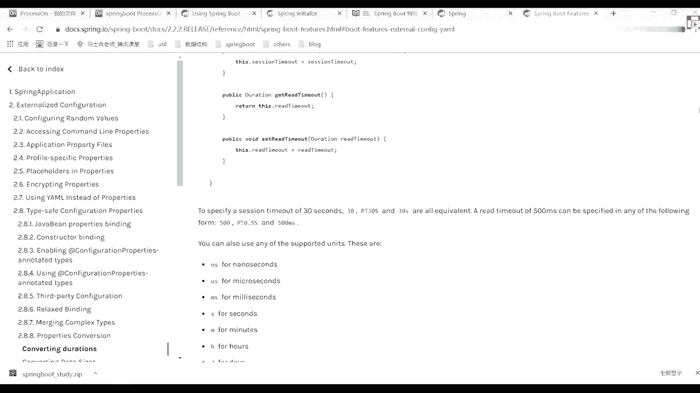

# 马士兵教育MCA4.0架构师课程 - P59：59、配置文件位置的优先级 - 马士兵学堂 - BV1E34y1w773

打开了解就行了，OK再来看还有什么呢，叫配置文件的一个优先级，也就是说当我们在写完我们的配置文件之后，配置文件之后，其实我N多个目录都可以放我们的配置文件，这个没配置文件怎么放啊，来往上看。

前后的作表演一般没必要啊，一般没必要，前端只要做好，做好调研之后，后端一般没必要，一般你的规则都是一模一样的好吧，除非你的一些接口文档说明的不太清楚的话，可能都需要懂吧。

然后再看我这写出来四个对应的一个，配置文件目录，这四个配置文件的目录不是我这随便写的，是官网里面给我们展出来的，官网里面有这样一个展示目录，我再找一下，嗯找一下官网里面给出我们这样一个配置，文件路径。

就是说你在指定我们的YM文件的时候好吧，它可以有多个路径进行配置，在多个文件路径配置的时候，你可以都都都写，没关系，但它有一个优先级的概念，也就是说你配的时候不能说我随便瞎配，这不合适哪儿去了。

又没了算了不找了。

找一下不找了，大家看一下，我这已经给他写好了，我们从这图上看吧。

就说在这块它有四个配置文件的一个路径好吧，前两天这样配置文件的路径路径里面有什么呢，叫file冒号，然后呢叫点杠CONFIG杠，还有一个file封号，什么叫点杠，还有class pass。

Configure，class pass杠，大家看一下。

我刚刚写好的这个配置文件，它是在哪个对应的一个目录啊，刚配件放哪了，是放到我们这个result里面了，result下面是不是相当于是我们的class pass，这样一个资源路径，那我可以怎么做。

来往上看，这做一个验证啊，把这些属性都给干掉，不要都删掉了是吧，删完之后来做一下验证试一下吧。

在这块写的时候，第一个第一个是在哪来着，刚刚写的这是不是有一个CONFIG。

下面fail指的是我们当前这个文件的路径，这样可以创建一个directory叫CONFIG，我这里面我可以建一个配置文件叫application，点YAM写完之后，这可以写一个server冒号TT括号。

再写一个808080818081。

这第一个我们要定义一个配置文件路径，第二个是什么呢。

叫file杠，然后在这个当前目录下面，我们也可以建一个文件叫application，第2ATION点YAML这边写一个server冒号，冒号，再写一个80821样的。

在我们这个src class pass resource下面，在这下面里面依然可以接一个CONFIG吧，这写一个右击定一个directory config，在CONFIG里面也可以写一个fail。

叫application，点y a m server冒号port符号8083，然后最下面是不是，这里面再定义一个叫8084，可以吧，当你这四个端口都定义好之后，我现在重启我们当前应用程序，把它关掉。

不要搜选择应用程序来右击走，晕一下，看一下，现在可以越过去，我来看这个端口多少8081吧，是80818081的话，大家看到哪个地方配的8081来着，是不是这里面写的是8081。

可能意味着我们的CONFIG，这个的优先级是比较高的，优先级是比较高的，然后这时候你把它给删掉，别掉，上完之后，第二个是谁，是我们在外面也配了一个YML新启动运行。

多少8082了吧，他是不是也比较高，右击再把它删掉，走上完之后来再看，再次运行走，808383在哪，是不是在我们这个CONFIG里面是8083，把这东西也删掉，delete看看再运行走。

现在是不是应该变成8084了，对不对，大家看到了，我们刚刚通过这个端口号的演示，已经看到了它所对应的一个配置文件的优先级，所以你在指定的时候，你要做一个查看好吧，也就是说在这四个资源路径下面。

你都可以配置我们的demo配置文件，问题是哪个优先级更高，哪个优先级更低，但一般情况下我们推荐好吧，大家放到这里面好吧，这边的话如果你的配置文件比较多，你可以放到CONFIG里面去，它原先就会变高。

如果配置文件不太多的话，就直接扔到外面好吧，直接写到一个配置文件里去去就够了，所以这是我们对应文件的优先级，好吧，这块有问题吗，来文理同学扣个一，很简单吧，好像这些东西啊，在我们的官方网站里面。

都是有对应的一个配置的，这东西并不是特别麻烦好并不是特别麻烦，OK这样搞完之后再来看初始属性，不用说了吧，表达式表达式是什么意思啊。

这表达式是什么意思，比如说我在写的时候，刚刚写的是什么，是具体的一个值吧，找一下这块再说写它，我只能写这个值，一加哎，1+2能这样写吗，这个值能不能这样写，来我们试试就知道了，你打开刚刚那个测试类。

走啊，拿错了，呃不是这样啊，不是这样写，这写错了，不不不，这两项不是这里面写，写好这个值，而在我们外层这写的时候可以这么写啊，12找到我们的person这个类分类里面，我这可怎么写啊。

就说我这应该怎么使用我们对应的一个表达式，这样一个注释方式，假如说你们用这样的方式，不要用，它，不是自动输入这块写的时候就用它，这可以写一个1+2，我来再运行一下，哪去了这个，嗯还报错吗，什么意思啊。

哦H是把它给注掉了，好吧，这已经注定了我inject，COSVALUE诶，不是这么写的吗，是这么写的吧，井号吗，写清楚了，大家试一下吧，好吧，现在是好了，就用符号，你这是写成减号就可以了。

在这里面也可以用，我们对一个表达式这样的方式，但一般没人把它写成表达式好。

他只不过是不支持了这样一个简单用法，仅此而已，好吧，教练刚刚说过了，我都说了，最后一个叫多环境的一个配置，这个多环境配置是什么意思啊，也就是说在我们的生产环境里面好吧，在我们的那个开发环境。

在我们的实际工作环境里面。

你可能会有开发环境对吧，可能会有测试环境，可能会有生产环境，是不是更大的环境，这时候怎么办呢，啊这个怎么办，也非常简单，在当前当前这个resource目录下面，你可以创建N多个我们对应的一个配置文件。

这个问题是你要怎么建，右击念一个fail，这写一个application，写什么叫杠，比如说DEV点YAM，这写一个server冒号port，再写一个8080是吧。

然后再写一个new一个file application gu test，点YAM，这是一个server port，201是不是两个测试环境了，在这里面我可以指定这样的一个属性，这不它叫什么spring。

哎不对，这active诶叫什么来着，我忘了叫什么了，Spring profile active，对他好吧，这样可以指定我们对应属性，比如说DEV定位是多少啊，我来看是8080，现在我们重新启动一下。

我们对应用程序走，看来测试啊，8080吧，现在我把这些属性值给做一个更改，这改成哪去了，这，test来再重新运行。

多少了，8081吧，也就是说你在生产环境里面，你可以配置多套我们不同的配置文件，然后呢在做切换的时候，上线的时候换成我们DEV好吧，自己练呃，开发的时候换成第一杯，测试的时候换成test。

是多种不同配置，把这配置文件的作用，当然你也可以把它切换成properties，都一样的，一模一样东西好，所以大家发现了这样ml文件啊，其实里面做的事情很多啊，推荐我推荐大家使用这样的方式。

因为spring里面也是这么推荐的，当然你说老师我用的文件用的确实非常麻烦，我就不喜欢用它，那也没关系啊，你就用你的properties都是一样的，这些属性值有直播间里面换成什么呢。

冒号冒号这样的方式的，而其他地方你用properties的话，换成是K等于value展示方式，所以合理选择就够了，懂我意思吧，好吧，在下去之后，可以把我们spring官网里面。

关于我们的压缩文件的一个配置，这块好好详细看一看，里面竟然包含很多的一个知识点，这样我们再不再详细详细说了啊，这东西啊其实不那么重要，或者说这个东西不需要我来讲，你看官网有能力啊，把它给学会。

懂我意思吧，好了，这块来文文同学扣波一，问题啊，今天的东西算是比较基础的呃，我们基础课大概讲个三节课左右吧，三节课左右，简单带你们过一下这个知识点就够了，好就够了，下节课我们讲web相关的一个开发。

然后之后我们就主要看底层的一些，源码的讲解了，懂我意思吧，所以很多同学可能觉得这东西比较基础，比较简单哇，那你可以选择暂时不听好吧，后面的话我们会先暂时讲了，懂我意思吧行了，今天晚上咱们就不吐槽了。

大概就聊这么多呃，该过平安夜的过平安夜，该过圣诞节的过圣诞节好吧，希望你们今天晚上玩的开心，还是周二周四周日是的，周二周四周日，平安夜不平安，牧马人太太调皮了，呃，希望你们今天晚上玩的开心吧。

OK那今天咱们就聊这么多，刚刚的话就是把刚才承诺给大家发资料，一会整理一下发上去，好吧好了，同学们早点休息，拜拜同学们拜拜，试讲咱们中间插一下，这东西增删改查有必要写吗，到时候再说吧好吧。

下节课我们再说，OK好了，下课了，还book htbook。

