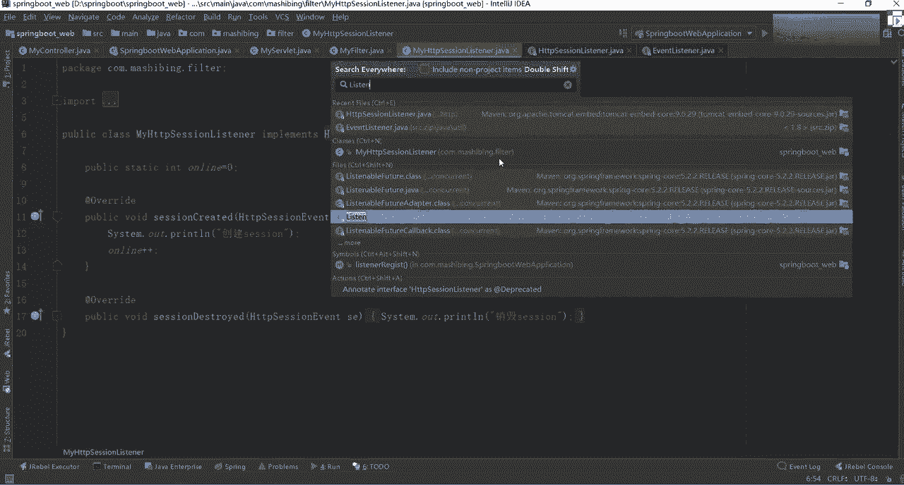

# 系列 5：P61：61、SpringBoot整合Servlet - 马士兵学堂 - BV1E34y1w773

下面要干嘛呢，我们聊一个东西叫web，也就是说现在我们用spring boot搭建我们项目的时候，他在开发一个web项目的时候是比较容易的，因为在官网首页里面告诉你了。

说spring boot里面内建了一个什么像tomcat啊，真理这样的一些容器，对不对，是不是容器我们不需要再把它打成一个外包，然后直接运行了，我们可以以一个炸包的方式直接进去运行。

运行的时候java到炸就搞定了，但是在运行这些web项目的时候，我希望你能注意一些细节点，为什么在官网里面，对这块其实描述的也是比较详细的，你往下翻这个东西叫开发web应用程序。

说spring boot非常适用于开发web应用程序，你可以使用嵌入式tom tom cat，这题好吧，来创建一个独立的HTP服务器。

大多数web应用程序使用spring boot starter的杠外吧，这是我们什么，是不是它使用的启动器模块来加速呃，来加速搭建和运行，也可以使用这个web fluence好吧。

来搭建响应式的一个web应用程序，但不管怎么样，你要知道一点，用它来搭建web的时候非常容易，因为我们在创建一个普通web项目的时候，只需要勾选一个模块就够了好吧，至于说为什么要勾选这东西之后。

我给大家说还是一样，我们可以通过源码层面来说，其实啊很多同学应该都知道，spring boot里面，它底层最核心的，和原版里面最核心的介绍是什么。

叫自动装配原理，对不对，我不知道你们到底在项目里面，是否留意过我们这里面的一些包，好吧，在我们导入这些maven包里面，有一个非常非常核心的包，三下下去之后可以自己先看一下。

叫auto configauto，Config，Sto configure，往下走，这有一个spring factory，在这个factory里面，你往下翻看这块什么东西呢。

叫enable auto configuration，里面有一堆以auto configuration结尾为这些文，这些类这类干嘛的，最终就为了帮助我们完成一件事，就是自动装配好。

就是自动装配这样一个原理，这个原理后续的时候我会告诉你，他一步一步是怎么来的，但是你要有这样的一个意识，所以你需要哪个组件，直接把哪个组件直接以一个泡沫文件形式，大家加加进来就可以了，我说老师。

这里面你看一下有这么多的一些auto configre，我每次启动程序的时候都需要进行加载吗，谁能确定加载吗，不是的好，为什么，不是你可以往上翻点，随便点开一个，点开一个之后，你会看到很多的一些标签。

有两个非常显著的标签叫什么呢，叫conditional，什么东西，conditional什么东西是啥意思，什么叫condition，表示条件的意思，比如说他会进行一堆条件的判断，如果你没有引入的话。

大家看到了，这是不是爆爆了一个红，那意味着此时它是不会进行自动装配的，就说你导入对应的配置文件之后，也是我们的pom依赖之后，它才会进行相应的一个导入哇，这块先有一个基本常识。

这是为什么告诉你们说每次在开启项目之前。

先把我们的pom文件配置好，配置好之后导入对应的一个依赖，原因就在这好吧，那OK这块先聊这么多，再往下看，说spring web mvc框架对吧，告诉你说MVC是个什么东西。

应该怎么做一个最基本配置这种东西啊，其实之前我们已经讲过了，或者聊聊聊聊的已经比较多了，这块我希望提一件事，你想一下，很多同学在我不知道你们在学习的时候，特别是年龄比较小的同学。

有没有接触过这样一个东西，有接触过的东西吗，什么叫server呀，叫server lie吧，是不是一个服务的一个小程序，把它本身是这样的一个意义啊，很多记住了MVC或者说一些web的一些框架。

几乎都是用于我们的sweet来来开发出来的啊，JSPS对的，这是比较老气的一个版本好吧，其实它有一个过渡的过程啊，刚开始是JSP，然后呢加so late，后来呢切换成SSH，后来到SSM。

到现在又变成spring boot，是不是还有这样的一个历程好吧，我不知道你们这块有同学接触过没有，然后最近打电话发现有好几个同学，他们公司里面还在用SSH struts to和HARBN。

很多同学可能都没有经历过这块，这块环节也没关系啊，全经历了S刚学的时候最好都学一下，反正我认为最好学一下，因为学完之后你会感受到这些框架的升级，它带来的便利之处啊，这天带来的便利之处。

你会发现你的开发越来越简单了，包括我们之后很多的框架，很多框架又为什么要进行框架，一个迭代，原因也在这个地方，就在于说他让人或者开发人员变得越来越呃懒，或者越来越简单，开发过程能够加快一点，懂我意思吧。

那这块我们要学一个东西，说什么呢，第一个点先学一个叫server late相关的一个点，你说老师为什么要学好，为什么要学server还是一样，因为我们的spring boot里面可以集成。

我们可以集成我们的SURRATE好吧，它里面有对应的相关配置。

给大家找一下，这叫内嵌service的容器好吧，支持这东西有什么用处啊，用处非常非常多，给大家说一下，就比如说我们后面啊，今天我应该会讲到数据源这个层面啊，就是data source，大家注意啊。

你在公司里面可能在用的时候可直接获取，用GDBC现在已经没人用了，更多可能要建立我们的数据库连接，然后再写下我们的database，好行啊，data source database啊。

要写下data source，在选择data source的时候，大家想一下现在用的最多的，好用最多的一个是什么叫黑carry，是spring bot里面自带的对吧，除此之外还有什么叫德鲁伊。

这是阿里巴巴开源出来一个框架，而且大家应该知道德鲁伊他是什么，叫专门为监控而生，还记得吗，是不是监控而生，也就是说，你要想实现德鲁伊，它对应的一个监控的一个性能的话，它需要你内嵌SD进去。

所以这块要作为我们第一个优先学的点，说STBOOT包含了对这些服务器的一些支持，大部分开发人员只需要简单对应的starter来完，获取完整的配置实力，默认情况下监听8080上的HTTP请求。

这块我们已经讲过了吧，来再写个代码试试，怎么做呢，非常简单，new一个project zu，等一下com，这把是不这样写一个spring，bot下划线叫web2把拿走，刚next这要勾选了吗。

第一个勾选上我们的spring web这样一个框架啊，把它给勾选上，其他东西你可以自己去加，把自己家这里面透露出来，另外一个东西好，另外一个东西叫spring boot dev toys，这是啥呀。

这是一个开发者工具，这些笔记我说一下啊，打断一下这些笔记，我最终都会上传的。

上传什么地方啊，咱们有这样一个地址，可能喜欢的新来啊，再说一遍，在B包马士兵这里面有一个internet architect，在这里面这里面我建了一个单独的目录，叫spring boot啊。

第一天第二天讲什么东西，我这都会往里面写好吧，就拿过来之后，你直接从这下载就行了好吧，直接下载就可以了，OK这不都说了，刚刚看到一个东西叫dev toys。

叫热部署用的，很可能都知道，除此之外还有一个什么东西叫JIO吧，好吧，这俩东西我不知道你们在公司里面好吧，哪个地方用的更多一点好吧，这块我们一会都说一下，都用过是吧。

如果你要用dv twice的话怎么办，你直接加载一个maven依赖就可以了，而如果你要用我们的driver的话，这块你可能需要进行额外的一些配置，我也感觉这包好用一点啊。

直播好用一点好吧，怎么做也很简单，告诉你官网里面哪个地方有，非常简单，你往上翻往上翻，这儿有一个开发者工具，在开发者工具里面他说了，spring boot包含一套工具，你可以使你的开发体验更快。

Spring boot devtools，然后呢模块可包含在任何项目中，以提供额外的开发时的一些功能，需要支持的话，把一模块加进去好吧，加完之后告诉你说应该怎么用，下面有一堆配置文档。

解释下之后直接看就行了，但是我说啊这个dv twice我们这不介绍了，不详细介绍了，没啥用好吧，我们现在重点来说一下我们的driver，driver也非常非常简单。

我这给大家写了一个markdown文档，好markdown的一个文档，这个文档里面我写的比较清楚了好吧，第一步安装在我们在idea里面。

File setting plug in brother respect，我在里面写入我们driver driver之后，找到able for int all，弄好之后，然后重启就行了。

但是它需要进行一个激活，而这个激活的时候大家注意了，这儿有一个激活的步骤，你按照这个激活步骤去进行操作好吧，最好你自己能做一个反向代理的一个服务器，自己搭建的话，不用担心失效，而如果你不自己搭建的话。

可能需要失效，之前明哥应该也说过这东西啊，之前明哥说的时候应该是在那个eclipse里面讲过的，我这是idea里面的，所以这块都有了，下之后按照这个文档来做操作就行了。

这不演示了，我在这个ID里面已经集成好了，来看看这个这个图标了吧，只有支付宝里面的一个图标，非常简单，如果谁在安装过程中遇到问题了，私聊我好吧，很简单的东西了，这不说了好了。

刚刚我是不是选择好一个web的一个窗口了，选完之后点next，这样改一下spring boot，Spring boot web，我改我改，我改一下这个目录啊，我直接给你们上传上去。

给RETONIGHT嗯，这怎么没有，老板还没同步啊，没同步换一个吧，这写的brain boot放这里吧，杠划分时K，直接打开就行了，打开之后如果你想配置一个web项目的话，就变得非常非常简单，怎么做呀。

直接在我们把这个东西先删掉，这东西想删删不删无所谓啊，我看着难受就删掉了，SRC选择min，然后java得到我们底层的包，在这里面可以建一个control n t r o l e r，Control。

完之后，在里面可以随便写一个东西，java叫my controller，创建好之后，前面加一个at叫renrest controller，只要解除Rest control吧，它什么意思。

然后public string hello，这是我们之前写的东西啊，还是一样，Return hello，spring boot来返回上面呢，加一个at request VIP，加一个hello。

看见了吧，写完之后直接运行，我们当前这个应用程序启动一下嗯，启动好之后。

这是默认在8080端口进行一个启动，所以此时我们可以直接进行一个访问，叫local host，8080杠走，是不是告诉你返回，Hello，Spring boot，大家想一下。

这是不是就是一个web项目了，导致我们之前说的搭建非常非常简单好吧，最简单的一种方式，除此之外我说了，它可以集成我们对应的一个SL，后续的时候我们会对它进行一个使用，所以这块我希望大家能够了解。

然后在这块集成的时候注意了，他说了一点啊，你往下翻这块说什么东西，说spring boot包含了这些东西的一些支持，然后呢在使用so late的时候，你可以配什么，第一个配so late。

第二个配filter，第三个配listener好吧，此外就不用说了，就是我们实际处理的一个业务逻辑类，然后呢filter是什么东西，是过滤器吧，然后listener呢是不是我们对应的一个监听器。

这块你都可以做一个最实际的一个操作，他说了，使用它的时候，可以使用spring bean或扫描方式来注入SRT好吧，然后呢说将这些东西要干嘛，要注册到内嵌的容器中，如果你想使用这里面值的话。

这样可能会更方便一点，后面告诉你说我应该怎么加入这些过滤器，是不是写了一堆参数代码，解释一下案例吧，然后包含一些sweet上下文的一个初始化等等东西，这块我们直接来演示我们的案例，代码还是一样啊。

我这儿给大家写了一个非常重要的一个文档，web开发，大家看一下第一个smode web开发，说第一个叫整合我们的SOLI好吧，整个都进行整合，第一个你要先写一个threat好吧，先写一个threat。

这块是不是有原生代码，我直接把它拿过来了。

正好没浪费时间了，没啥没啥意思啊，来直接打开我们的代码，加完之后这是用的是sweet333。0吧，是不是直接用我们的注解就可以了，注解配的时候写什么东西，第一个叫web server late。

第二个写一个名称，第二第三个写一个叫url pattern，好吧，这两个东西什么意思啊，你们都卡吗，我这没卡，大家看到这丢包就丢了，2048K包没丢包啊，所以应该是不卡的啊，如果卡的话。

可能是你自己网络的问题，不是我这的问题是吧，自己重新调一下网络，OK来往下看，当我们导进来我们对应的一个server之后，他首先需要继承一个叫HTTP server，这必须要继承啊，介绍完了之后。

上面写了一个东西叫web servlet，表示说这是一个service的实体类，如果原来你没有用注解的话，你怎么办，你想一下你在之前搭建项目的时候，是不是都有个东西叫web xm对吧。

那这时候你需要配置什么，server name等于什么东西，server class等于什么东西，还有东西，You are pattern，pattern里面是不是写上一些呃。

mapping映射这些东西好很麻烦很麻烦好吧，所以这块再做一个简化，然后这第一个是我们的名称，你要写一个名称，第二个写上你对应请求匹配的类，把它写上就行了，写完之后把这些对应的包都引进来。

听起来嗯很麻烦，还有很多的包，那个包完之后没事了吧，就注意了，这块我们其实并没有写全，为什么，因为这里面除了一个do get之外，还能有另外一个叫do post哦，叫do post，这块其实都有用的。

比如这块你可以写一下，看到了吗，这是个do post的好，一般写的时候就说你匹配到你对应的一个get，和post post这样一个请求方式，仅此而已，我们这儿只有我们的get请求，不用管它了。

这里面我的处理逻辑啊非常简单，没处理，这就直接写了一个A1，只要能打印就够了好吧，很多老师这个C位的整合用的不多吧不多，但是我说了，我们后面会有一个应用场景好，会有一个应用场景。

什么场景就是我们在配置德鲁伊监控的时候，我们需要自己来写一个service，那时候也需要自己写好吧，其实引用sweet的东西都是一模一样的，你这块需要稍微看一看，需要理解其中的一个最基本的一个原理。

只要稍微看看就行了好吧。

说完它之后没完还要干嘛呢，说在启动类上添加如下的一个配置，这个配置才是最核心的一个点，就是说你这只是定义了一个sweet，我怎么知道，或者spring boot怎么知道你当前这个slate应该生效。

或者说什么时候生效呢，这就意味着你要在你的启动类里面好吧。

加一个东西，第一个找到我们启动类这块儿加什么东西，叫at server l component scan，是告诉你说slate它自动扫描了一个包，之前我们点击看过。

这里面是不是也包含一个叫component scan，的一个包，一个注解吧，好把它给装载进去，它会有一个自动扫描这样的过程，大概加上加完之后里面没完，你需要把你对应的那个service。

注册为我们当前spring boot容器里面的一个ban。

好吧，这块怎么注册，他写了一堆代码。

我们把这个病直接拿过来，大家看一下，这个病其实非常简单，做事情也不是特别麻烦，你注意了啊，你在写代码的时候，你没必要说老师我每个代码都是手写嘛，没必要来看看这个逻辑吧。

这边有什么东西叫get server late register bean，什么意思，获取server late注册的一个并对象吧，然后这首先创建一个东西叫serrate registration b。

然后后面告诉你说你有一个这样，并把我们当前这个server对象给放进去，放开之后，这有个东西叫b set load on startup，很多同学如果你配置过web XML的话。

应该有这样的一个呃记忆这玩意儿干嘛的，这设置我们当前server Lt它装载了一个呃，什么时候进行启动，什么时候配置我们当前这个类好，这个属性我们这配置成一了，然后配置完之后把这个并返回去。

此时就意味着我当前这个病已经加载进去了，好加进去了，那这怎么办啊，直接进行一个重新启动，之前我们中学怎么起的，是不是用我们这个直接键启动的不太好啊，我们这换成我们的JBL，启动之后的话。

我们这就不用管它了，好吧，等一下吧，给他几刀啊。

没报错吧，此时我们可以发送我们对应的一个请求了，这是什么东西，叫杠杠SRV吧，回车诶，怎么有东西啊。

看着看这个信息打印出来了吗，打印出来了吧好吧，这个大家是不是已经看到了，我刚刚写MYSQL里面，是不是打印了一个111这个请求，这是不是已经打印出来我们对应的一个结果了，懂我意思吧。

所以这个配置非常简单，只需要说我自定义实现一个server，一个类实现完了之后，然后直接把当前server类注入到我们的spring boot里面，就搞定了啊，这配置难吗，不难吧。

当然刚刚那个风声也说了，老师这个Sol单独用的话，是不是用的很少，事实确实是这样的，几乎没人用啊，但是但是你要知道一件事，什么事情呢，我在进行这样的一个呃配置的时候，我怎么把我们对应server l。

给注入到我们当前这个容器里面，也就是说在我们当前这个启动类里面，这行代码或者几行代码非常重要的好，我再写一下这个注释吧，将service，添加到，我知道好吧，除此之外注意了，这后面还可以写东西。

它这还包含了一个最基本的参数，叫什么叫u r r making，好，什么意思，这可以加一个叫杠，这写一个S2吧，随便写的东西啊，杠S2好，随便写东西，写完之后，这块你必须要重启，我们再来发一个请求。

叫S2回车。

是不是这页面没效果吧，因为我们这没有返回任何东西了，看这这返回对应结果了吗，是不是返回了返回我们对应结果了吧，好这会大家要注意了好吧，把我们当前这个结果你返回来，意味着这也能调动成功，就这意思好吧。

容器是指spring容器吗，是的，LC容器就是我们自动装配这个对象是LC，是这样的。

好这话听明白了吧，它呀并不难好它并不难，你让文档里面直接写就行了，好吧，我要说的不是这个东西，要说的是什么，是我们S2生效了。

SRV还有一还有生效吗，你就按生效吗，我把它干掉。

来配一下2V搜。

看下后台效果，答应吗，打印吧，为什么一次请求有两个打印，这块来给大家说一下这块在请求的时候，为什么会有两次打印的一个结果，他在请求我们对应的method late的时候。

这是不是按道理说是不是只打印一次就够了，是不是这样EC够了，你想一下他是怎么样的一个轮转过程，如果你的do get就是这service里面的东西啊，如果你的请求没有请示，没有请求到的话。

他还有一个icon的一个请请求，icon的一个请求再看一下啊。

很多人可能已经已经已经很少，很少有人看这东西了，我打开看一下，大家知道了，找一下我们对应的一个更多工具开发者工具诶，你看一下我们的network这块，我们来刷一下页面，大家看一下，这请求了几次。

这什么玩意儿，怎么这么多请求啊，Date image png base，诶，这啥玩意儿怎么出来，是这样的，来SVG家char trs r，注意啊，这块有点问题啊，我这怎么做的过滤啊，我想想就你这块。

你看你的XS2在哪呢，下面这块是吧，这俩东西吗，反正这块我给大家说一下原因，我给大家说一下原因是啥啊，在这块是吧，先刷一下，这没有啊，这行不，JS2的，这不发生任何请求啊。

嗯我重启一下。

好吧，清掉清完之后我们再重新刷新刷，说完之后大家看到这怎么没打印好了，现在我们来请求一个东西叫S2回车，这边依然是我们的error配置对吧。

解决完了之后，你往这儿看后台是不是打印了诶，变成一色的吗，小学事故，这不大家试过之前给大家说一下吧，呃之前的时候如果你写过策略的话，大家应该知道，当我们在发请求的时候，因为我现在过滤器什么都没写。

所以他除了会发送我们当前这个请求之外，还有一个艾克艾肯的一个请求，那ax请求如果你不过滤的话，如果你不过滤的话，它依然会发一次请求，请到我们这个地方，所以此时的话会打印两个一，现在看到了。

我这还有两个一吗，没有了吧，没有原因是啥，你现在在发送我们这个SRVRV的请求的话。

走，你往后看。

这样写不到吗，已经起不到了，因为什么，因为刚刚我在这块是不是已经配过杠S，杠S2了，当你配置好之后好吧，后面前面之前那个配置就不生效了，这可以写一下，高配置是u r map之后server d。

自己的配置，就不会生效好吧，所以这块你只能请什么请求，我们的S2这块我们再来试一下吧，刷新一下是吧。

看后台有打印吗，没有吧，我现在换一个请求，换成我们的S2走。

然后这时候来再往下看，是不是请求了这个请求是不正常了，懂我意思吧好吧，这块大家一定要注意了，OK折叠器说老师不用加到容器里面也能响一把，Server server component scan。

那可以配置包，它可以配置我们对应的一个包，但这块我相当于什么，我把它注册到我们对应一个bean里面了，好吧，这就是这意思啊，如果这块我后面加一个包，这边有个属性来着，叫base package吧。

是不是还有个package，你后面可以加一个随便的一个路径，com点马士兵点，然后加一个SERVLET，它是不是也可以自动扫描，但是你这如果要进行一个自动扫描的话，那意味着你在你对应的method里面。

这是生命，因为它了web serv，这也可以生效，但是啊最好你把它注入进来好，这样写的方式比较好的。

为什么这么说，这官网里面给我们推荐的方式给大家找一下，可以看一下我们这个server late，我找了一类啊，你看这块就知道了，这里面有这样一个东西嗯，看这他说了，默认情况下，如果上下文只包含单词。

但意识到杠多个SB的时候，变的运作前缀filter过滤到更新，如果基于约定配置的映射不够灵活，您可以使用什么呢，叫registration bean filter。

registration bean和他的东西类来进行一个完全控制，这里面告诉你说，你可以使用这样的方式来进行配置，所以我在演示的时候，就直接演示这样一个配置方式，懂我意思吗，周子姐。

那多个sweet不是得多个病吗，是这样的，一般我说了，刚刚那个风声也说了，sweet其实用的很少，关键是什么东西，关键是我们要看一下，下面要讲的这个过滤器和过滤器和监听器，过滤器监禁用的比较多。

像这块用的比较少，这种配置可以写路径还是一样。

你这个配置你后面是不是要加一个base包，你这是加一个包名啊，就跟什么一样，就跟你在boot里面，你可以加一个at component scan，这是不是也可以写一个属性，比如说写一个。

叫base package default，这写一个com点马士兵之前我是不是也这样写过，好吧，但是但是你注意了，我们现在为什么不写它，原因非常简单。

它会因为你声明了spring boot application这样一个注解，但是声明好之后，它会自动加载当前类所在目录下面的所有文件，这是为什么，刚刚开始在讲boot之前，我给你讲一个要求。

说最好你启动好这个类之后，主程序不要随便改变目录，如果你改变目录了，就意味着你要改变你当前加载路径了，是不是意思，之前是说过的东西好吧，要是重要，要是用注解有顺序吗，什么什么顺序，说说说的是哪块顺序。

你说这个上下顺序啊，这无所谓啊，这个是无所谓的，这个无所谓啊，这个无所谓啊，这无所谓的，好吧好了，这是我们surreal里面最基本的一个点。

好吧，这块用的不多，下面我们来看另外一个东西好吧，看什么呢，看看我们的过滤器，大家想一下过滤器有用吗，有用吗，你想想如果你要做一个网站，你做一个网站，做完网站之后，我们是不是要过滤掉某些请求。

比如说如果这个用户没登录，我让他进行登录，如果不能不登录的话，这块是没法进行使用的，是不是要写一个过滤，对应的一个过滤器的过滤器也非常简单，大家可以看一下这块。

一个代码是跟SERVLET里面写的一模一样，没有任何变化，还是一个web filter加filter name，加一个请求，加一个请求，后面写了一个need，有个destroy。

还有一个do filter，这啥意思啊，告诉你说我什么时候要启动，或者说初始化我们的过滤器什么时候执行，我们的过滤器，什么时候销毁我们的过滤器，这块在做的时候，我希望你注意一件事，注意什么事呢。

在我们的filter这个里面有个东西叫filter chain，它是什么，它是一个链链条，好吧，什么意思，你这可以包含N多个过滤器吧，是可以包含N度过滤器，它会沿着一个顺序。

接着每个过滤器都挨个往下进行一个执行，所以应该写的时候必须要加什么叫T点，Do filter，当你做到最里面之后，如果没有出路了怎么办，它就相当于意思这样的意思啊，比如刚开始这是filter1F一。

然后这里面可以是F2，后面是F3，然后里面才是我们对应的一个SERVLET，当你的server处理完之后，再回来F3F2，然后F1是这样一个执行顺序，好这块大家知道就行了，看你们看到视频模式是吧。

就责任练练模式这块稍微注意下就行了，就这块一样，我们把它直接给拿进来，cc拿完之后一样的吧。

在我们当前代码里面建一个目录，写完之后CTRLV粘过来导一下这里面配置的包，哎呀好麻烦，先写好就好了，好了，这就是我们对这个filter好吧，有初始化，有我们的执行，由我们对应的一个串。

当你把它配置好之后要干嘛，这是不是也要过滤我们对应的请求，所以一会我请求filter的时候，请filter的时候，你会看到这个打印这个filter对象，此时虽然你不用重启，但是我建议你重启一下，为什么。

因为重启的时候你能看到对应的一个效果，往这看什么效果。

往上看看这个东西，看这东西，这有啥，in it吧，是不是意味着当我在重新启动，我们当前这个服务器的时候，它已经完成了我们整体这样的一个初始化工作，是完成初始化工作了。

然后现在他没有执行这个filter吧，为什么没执行，我这可以发一个请求，叫杠filter走。

当你加载完杠filter之后往下翻，有filter了吗，有filter了吧，是不是已经有filter了，是不是意味着我已经执行好了啊，它会一直往里面进行执行。

但因为我们没有对应与filter啊匹配的SERVLET，所以这不就不会有任何的一个显示，不会有任何一个显示，那现在你可以干嘛把它给关掉，把它关掉，我这直接关了，所以他不会打印DIY。

如果你是一个正常结束的话，会把这个DROY也给你打印出来啊，就这样一个顺序，所以以后你可以在我们这个filter里面，添加任何的一个数据代码，比如说加什么东西，if我不可以做一个匹配，好吧。

叫request啊，不对，叫什么request get，Contest sorry，contest点get，比如session嗯，没有吗，request get哎，怎么写来着。

Get recontest，点get session，get session这块注意了，你可以设置到我们获取到我们对应的一个强转，是吧，哦这是一个哦，这是一个service contest。

这样强转一下，强转完之后你会获取到我们的C，获取到我们三人对象，如果你的三连对象里面没有包含你的user，是不是可以把跳转到我们的首页登录里面，是不是可以过渡到我们某些对应一个请求。

这是我们过滤器它最常用的应用场景，除此之外还要干嘛，比如说你的JS请求对吧，再比如说你对应的CSS请求，像这些请求就不要发送我们对应请求，直接把我们计算资源返回去就可以了，是不是也可以添加这样过滤好吧。

特别是在进行登录页面设置的时候，这块几乎是必须要做的，所以这是过滤器，你知道怎么做就行了啊，知道怎么做就可可以了，过滤器镜头是这样的，OK这块的一个相关配置配置完了之后，除此之外还有啥来着。

刚刚说的吧，刚刚我们在官网里面看到这样一个属性，叫啥叫filter registration beans了，你是不是也可以通过它来往里面注册成一个bean，这是不是也可以好吧，但之前啊我没有写啊。

这是不是写他了，OK那所有页面都要写一个filter吗，还是一样的，filter里面在写的时候，你注意一件事。

这是不是有个东西叫you are pattern，他会设置说我发送什么请求的时候，才会进行一个匹配，如果你的匹请求不匹配的话，好这就不会进来啊。

这不会进来的，比如说你这样写一个，我随便发个请求啊，刚刚那不是写了一个很好，还记得吗。

把这请求给删掉，打开我们的run哎，随便启动一下。

走了八删掉，我这发一个hello。

HERO走翻译合作之后，大家看一下这块会打印PUTER吗，不会吧，不会不会吧，你可以进行这你可以进行这样一个设置，一般我们设置怎么设，如果是首页登录的话，写个杠星对吧，你写完doc之后意味着啥。

你所有的请求都会进行一个过渡到，这个没没没没起作用，发送请叫。

我写作业吗，杠杠行吗，应该不一样，杠星啊，这不对吧，不能直接写杠杠新了，应该是怎么不管用了，我们配的配置纸质宝，这应该可以啊，初始化是不是好了，来刷一下，刷新是不是filter了，重启一下就好了吧。

这重启一下就好了，然后现在然后现在的话我们怎么做，你现在再发送另外一个，比如说发送一个ABCD随便写，你虽然请不到这边是不是有filter，是不是有filter，好这块大家注意就行了。

OK如果一个页面一二，要是match多个filter呢，URL会怎么处理，你卖的多贵也无所谓啊，我说过了，你的filter它是一个什么，以一个链式的消防车往前走的，都filter之后。

它会跳到我们下一个filter，一直往filter里面进行一个跳转，好进行一个跳转，所以还得往里面跳的，这你不用担心，好好的老师，那这个filter的顺序我应该怎么定义了。

如果你现在如果你现在写filter的时候，写filter的时候，你如果直接像我们这样写，直接写一个类别的东西不配的，那此时的话有什么顺序吗，是不是加载到哪一类，你扫描哪个类，而如果你用了。

我们刚刚在官网里面看到那个方法叫filter。

Register ban，你是不是可以设置我们对应注册的一个类。

怎么做，是不是跟我们刚刚那个service一样，你挨个往里面new对象就行了吧，也是一样的吧，ok filter可以设置不拦截某个请求吗，这应该不可以啊，这我还没写过啊，这应该不可以啊，好一般情况下。

如果你要是想设置拦截和不拦截的话，有什么有include和exclude，我不知道里面有没有这样的属性，我不知道有没有这样一个属性啊，反正有include和include，不应该有这样一个配置。

但是里面怎么配，我忘了怎么配的啊，你稍微注意一下就行了好吧，差数是这东西是吧，在上面可以加一个order，一个属性，order这个值可以指定，比如一可以指定一好吧，它的值值越高，值越高意味着什么值越小。

是不是意味着越优先执行，是不是这意思啊，这是order是顺序啊，这是顺序，要求越小越优先吧，数数数越小越先执行，这是顺序，我们可以看一下里面的属性啊，点下注解，找一下里面的东西。

Display name fname，Icon sername，You are pattern，这好像没有啊，这边好像没有对应的一个属性啊，这应该是没法控制的，这没法控制啊。

反正请求里面是不是没法做的好，如果你直接在里面加参数的话，是没法做的，in the seta叫什么叫拦截器，不叫过滤器，过滤器和拦截器还是有区别的，过滤器和拦截器还是有区别的，好吧，加逻辑自己放过去啊。

这可以这可以做操作啊，搞混了。

这是我们对应的一个过滤器，过滤器完了之后发现最后一个啊，什么叫监听器，很多同学一直搞不懂，说老师这个监听器是干嘛的，非常简单，说监听器也是service规范定义的一个特殊类，用于监听不等于监听，什么呢。

叫sweet contest，Tv session service，request等于对象的创建和消费事件，然而监听与对象的属性发生修改的一些事件，用于在事件发生前发生后做一些必要处理。

一般可以用哪些方面，第一个叫统计人数好吧，第二个加载初始化信息，第三个网站访问量，第四个用户路径访问，访问路径是不是都可以做，我找人写的好吧，来把它拿过来，当然方式都比较简单的代码都比较简单。

我直接给他粘了。

把我们的坑写到哪，我直接写filter了这些这些里面去了计算机之后，大家看到了，这是不是有一个继承了一个HTTP session listener，继承完之后定了一个正变量，online等于零。

然后告诉你说每次session创建的时候，这会创建一个三人对象，打一句话，同时online加一销毁的时候，是不是告诉你说销毁这个session对吧，这块我们不用做那么严格啊，不用做那么严格，这要怎么做。

注意了，这必须要创建好我们对应的一个3D对象，所以此时这里面没有加任何的一个注解的配置。

那此时怎么办，非常简单，你这是不是要写这样一个属性了，是不是还是把它注入进来。

LC加到我们的这个配置里面去，Ctrl v，叫server late listener，region beans吧，是不是也往里面创建好我们对应的一个对象，把对象给放到我们这个listener里面去。

翻完之后就搞定了，好吧，这东西并不是特别难，那怎么做一样，我们重新启动一下嗯，接着吧，先启动，看效果，你看看效果就知道了。

ok listener是不是启动了，启动好之后，我这是不是可以进行一些配置了，这配置的时候大家注意一件事，在我们的listener里面，这是有个session，这是打印一句话，同时哦，这还没不没占完。

还有东西，注意了，这还要加一个什么，加一个控制层的一个代码，就告诉你说我的control我要加什么样的一个信息，把拿过来找到我们的control这块，不要它了，不要rise control。

哎不加保底了，这跟我刚才写的不一样，还加了CTRL，写完之后，这是不是有这样一个值，把这导进来，告诉你说在线数多少人，是不是请求online就可以了，那现在我们把它干掉，现在来请求一下行啊，出来走。

大家看到了，我现在在线中多少，是不是零人对吧，走走走走，老师，这为什么总是零个人啊，这不太对啊，为什么。

原因非常简单，你注意你刚刚写的这个监听器，你到底是怎么写的，你写的时候是什么，是创建三层对象之后，是不是才会给他加加，但你想一下，刚刚我发了个请求的时候，有任何session对象的一个请求吗，没有吧。

那怎么做也非常简单，在里面是不是有一个hello在hello里面的时候，我这加一个信息，加一个什么叫HTTP session，这里写一个什么叫session，点set attribute，加一个东西吧。

AA逗号AA，假如我加这样一个属性，这可以吧，是不是可以往上面加一个随便一个值，这个值无所谓，我反正也不用，我们反正也不用，然后现在干嘛呢，还是一样的程序清空清空完了之后，哎这怎么又有页面页面打开。

刷完之后刷新，现在是零人，然后现在做一件事情，叫local host冒号走，是不是请求回来了，此时你再刷新变成一个了吧，然后现在我再换另外一个浏览器，你再试一下，你打不开打开了，这还是一样。

Local host，然后呢，这写一个hello走，是不是也挺有意思，这个时候你再来刷新一下，变成二了吧，我现在在请求再刷新诶，这里面有有有有有有那个session session是不是同一个。

那现在怎么办，只能换浏览器了吧，是不是只能换浏览器了，这块是不是已经看到这个值已经在变化了。

也就是说你监听器里面你监听的是什么数据啊，监听是什么数据，这块就会进行一个增长，每次这时是不是有session create，有session destroy，是不是有很多这样的一个属性值配置。

下载之后，我刚才说了，在文档里面写的比较清楚啊，我说了，你可以监听我们的session好吧，也可以建设我们的service contest。

也可以进行service service request等域对象，这对象你都可以做一个对应监控，只要里面的值发生更改了，拿过来之后直接用就行了啊，你如果实在说老师，我还想看一下到底有哪些监听器怎么办。

很简单，打开它，打开之后你看一下当前接口里面是不是有session create，是session de，是不是有两个方法好吧，这下你再往下翻，这个没有了，就这个接口啊，还有其他一些接口啊。

比如说TP session，找一下ttp server late contest，Pl，啊那，就这个类似的吗，这块儿啊。

你看一下这块怎么办，也非常简单，之前我讲过这东西很早了，大家找一下，之前我在讲那个sorry的时候，之前录过一次sorry的视频啊，找一下找哎，哪去了，找不到了，之前我录过一次那个java的一个视频。

在那个java视频里面讲了各种各样的监听器，好，Server request，JASON对，就这样，监听器每个监听器里面。

它有自己实现的一个方法，所以你把这些方法拿过来之后，直接继承过来实现一下就行了，好像不同这样一个分类，但是如果有兴趣的话，看，可以回过头来看一下sweet好，看一下SURRE这块我们看了没啥意思。

没啥意思啊，反正你知道监听器，过滤器这些东西应该如何配置就够了。

相当于回顾了一下我们之前那个thread，相关的一个知识，你下来之后自己也可以做一个演示，好自己可以做一个演示，明白了吧，OK这块大家还有问题吗，来个女同学扣个一，这非常简单啊，这不用多说了啊。

非常简单的东西啊，现在之后拿着这个笔记好好看一下，我笔记写的是比较写详细的，一般该写的都写了好了，这是第一点，第二点该看看看什么了，看一下我们对应的一个静态资源的一个配置。

刚刚是集成了我们的SERVLET，但其实大家发现了service其实写起来并不方便。

而在我们刚刚你创建好，我们对应的一个数据目录之后，和项目录之后，你发现了在我们的com下面有一个resource，在这个resource下面有一个static，有个template。

这里面是可以放置我们对应的一个静态资源的，对吧，SA里面放什么，他们里面放什么，我怎么去读取里面的一个数据文件啊，这块应该怎么做，是不是涉及到静态文件的一个资源加载过程了。

这要说了，默认情况下spring boot会在class pass或者server contest根目录下，从名为static，然后呢这有个public resource，然后呢。

resources目录的目录中，开始读取我们的精彩内容，它使用了spring mc叫resource，HTTP request handler是吧，因此你可以添加什么东西，来编写这样的一个行为。

这啥意思，告诉你，我们写页面的时候可能写了很多HTML对吧，可能写了很多JS文件，可能写了很多cs文件，可能写了很多image这样的一个图片，对于这样的一些请求好吧，我是不是要把它放在哪个地方。

原首你是有个web root啊，Web in fi，web in fi里面是不是可以随便往里面扔，但现在没有这东西了，没有这东西了，那我怎么做，我只能把它带到我们某一个静态资源的。

一个目录里面，所有人都知道说老师我应该往resource里面放，那谁能告诉我为什么要往result里面放好吧，或者说result里面还可以建什么东西，因为你们在公司里面，如果是不是自己开发项目。

如果是拿别人项目的话，你看到有些人可能到这样，我就public对不对，还有一些人可能在这里面又建了一个DET，叫resource，有人见过这项目录吗，public resources有人见过吗。

你刚建好目录的时候，是不是只有static对吧，那为什么public和resources他要创建好，他怎么把这些文件给读进来的，有人想过这东西吗，其实这东西还是一样，我们要看哪。

看到我们对应的一个源码自动装配置的吧，是这样的，你告诉我从哪找啊，下载之后我们可以来看这样一个类，什么类呢，叫web，还在单元码，Web m v c auto。

A u t o com configuration，这有了，点一下这类好吧，这一类里面就包含了我们spring vc里面好吧，包含很多的一个配置项，好，各种auto configure是这样的。

在里面你要找一下我们对应的一个资源目录，好吧，你看一下他在哪，指定了那些静态文件的配置目录，我怎么去里面查看，OK下来之后，我们进入10分钟，10分钟时间里，你看一下这个源码。

自己打开自己看看看能不能找到。

这里面肯定有你认识的东西行吧，OK那行，那我们就先休息10分钟，你们找一下这个目录。