# 马士兵教育MCA4.0架构师课程 - P62：62、SpringBoot资源配置源码分析 - 马士兵学堂 - BV1E34y1w773

后来还在同学扣波一还扣波一，我们完完讲源码了，带你们看一下源码，很多老觉得这东西简单，我们给大家点不简单的东西啊，刚刚我说了，我们都知道我们在写页面的时候要加载很多CSS，JS等这样的一些静态文件。

在官网里面告诉你了，说我们写静态文件的时候可以干嘛呢，把class pass下面的这些目录的东西给导进去啊，为什么可以导，这告诉你了。

说你可以添加叫web mvc configuration adaptor，并重启里面的as resource hader来修改此行为。

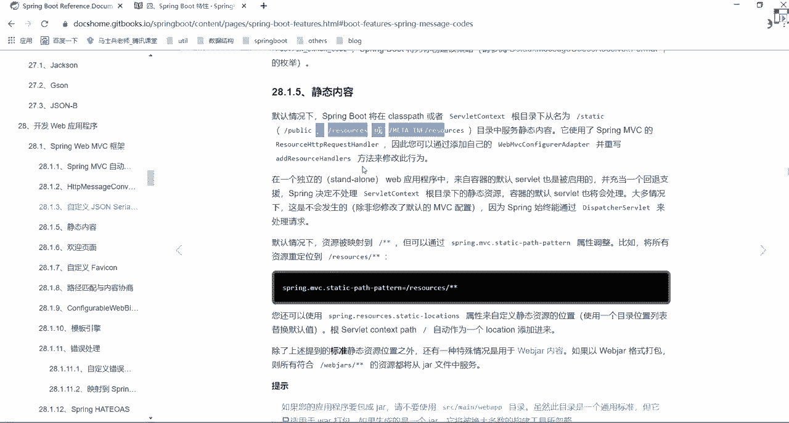

那么刚刚通过查找之后，你应该已经发现了，怎么找来着，先打开web vc of configuration，你点开了之后找到里面的一个东西叫web mvc。

Auto configuration adaptor，在里面有一个方法叫ADRESOURCEHLER，在这里面他告诉你了，我应该如何进行一个相关配置，怎么配啊，说if什么东西，然后呢这个if什么东西。

if什么东西，是不是做了三个最基本的逻辑判断，这块我们挨个来看，他说了，This resource properties is all at mapping，比如说他会判断你是否修改了自己。

对应的一个资源目录，如果你自己这已经做了一个添加，那不好意思好吧，这块就不会做一个任何，就你原来配置东西就可能不会生效了，只有这个result properties，这是不是有这样一类。

第一类你看一下哪个哪个目录叫spring resources，然后呢往里面翻，里面是不是有很多一些属性，像这些属性值，你就可以直接在我们的配置文件里面，进行一个直接的编写好，直接进行一个编写。

就这块东西好吧，但你要知道这个前缀是啥，你们之前写代码的时候，很多人写的都直接写，比如说spin点啊冒号，然后呢MVC，然后冒号后面可以加各种各样的属性，为什么要加这样的前缀，在哪，标识的。

就在于我们刚刚那个properties里面有个perfect，在这perfect里面告诉你说这块是哪个东西，懂我意思吧，这都会有一个对应的标识，回过来我们刚刚看的地方，刚刚看完之后。

你发现了它有一个东西叫爱的result handler，第一个是判断它是否等于空，这样的信息，判断完之后，第二个叫什么呢，叫多什么东西，不用看，往下看，这个东西叫什么，叫web js，这玩意儿。

我不知道你们在公司里面，是否有人用脑袋被炸死了，比如说我们在写前端页面的时候，可能需要导入很多的一些web框架，比如说JQUERY等等相关信息，而web js就指的是我们对应的一个JQUERY。

里面的相关信息，这怎么找啊，非常简单，不止可以用这块啊，你说只有这块是有这个问题的。

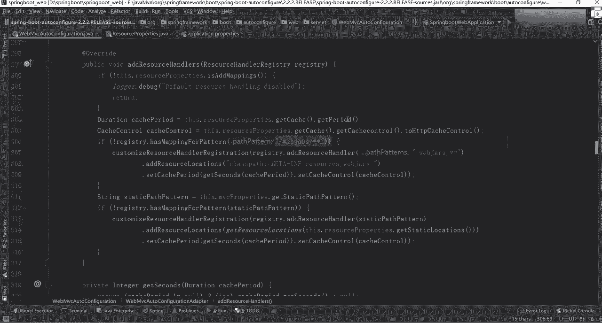

可以干嘛，在百度里面，你直接做一个搜索搜查搜web j a r s，他把这些静态文件，静态文件也打成了我们对应的一个，pom文件的方式，比如第一个。

这是JQUERY是不是npm bot rap swagger对吧，第三点，JS是不是有很多JS的一些文件拿过来之后好吧，你可以把里面比如说我们选1JQUERY吧，选择我们的maven，把这块东西拿过来。

按住C拿完之后，可以加载到我们当前这个项目路径里面。

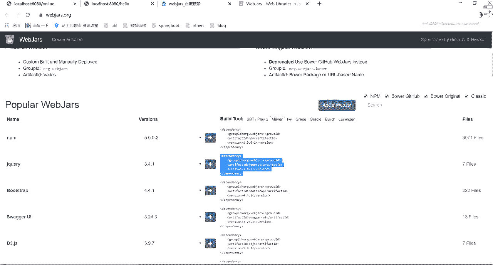

找到我们的pom文件，把依赖加进去，CVOK加完之后打开我们的依赖包。

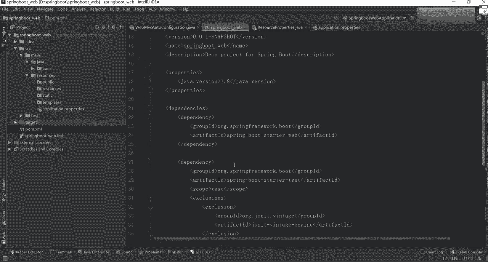

往下找一下，这是不是多了一个JQUERY，在JQUERY里面，你往下翻，因为刚刚在原版上做了个标识，哪个目录啊，往下翻是不是在web js星星，它可以读取这个资源目录。

同时有个class pass m e t a app，然后呢resource，然后web js，所以我们在看的时候点开它，点开里面的resource，点开里面的web js，再点开里面的JQUERY。

点开里面的版本号，点开里面的JQUERY的JS，这意味着什么事儿啊，有什么事，意味着，当前这个项目我其实可以进行一个直接访问了，怎么访问，选择它，第一个叫web，这是访问过，直接访问过了吧，回车嗯来吧。

JZ走，请求不到，重新重新重启一下，重启动下，前端框架都被炸死吗，不一定看你自己的需要，拿完之后来写一下，请发送一下，看这请到了吗，是不是请到当前这个文件了，这边是谁，是不是。

就相当于是我们的文包里面某一个的一个依赖。

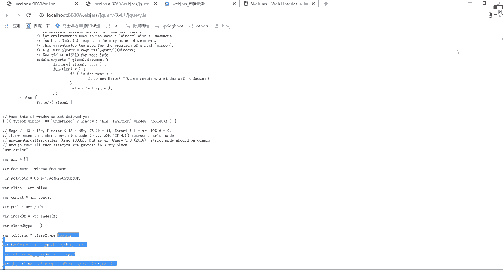

也就是说我这可以自动设置为它，读取我们web js里面的一些相关配置信息，是不是这这这这里面的衣服，也就是说你到底是否参与这样的配置，占完了之后，第三个什么东西呢。

叫static pass pattern是啥玩意儿啊，是不是叫静态路径的一个匹配，或者说静态资源的一个匹配，那句话怎么找这个东西叫this mvc properties。

Get static passpider，点进去，点完之后你发现这有个this pass Python，点进去叫杠星星啊，这杠星星指向什么地方，这其实已经跳过了，跳到哪了。

看这叫web mvc properties，是这个文件里面了，在这个文件里面，你往上翻翻，翻哪去了，这有一个resource来着，找一个resource啊，这没有啊。

我搜一下叫resource properties，在这个文件里面，大家看到有什么东西叫class pass，Source locations，是不是指定几个目录，第一个叫resource。

第二个呢叫resource class a下面的resource，第二呢叫class a的static，第二个呢叫ss pas的public，是不是意味着里面有很多的一个目录结构。

这是the static locations等于class resource locations，是不是就指向了我们刚刚那个目录，所以我每次在进行资源查找的时候。

为什么在你的resource这个资源目录下面，有人写public，有人写resource，有人写static，有人写TEMPL，他们这写什么是模板。

主要是上面三个public resource和static里面，其实按道理来说都可以放，我们对应的一个静态资源这块，其实我们都可以进行一个请求，怎么请求来右击又一个file，这写一个一点JS。

写一个呵呵，叫什么东西，static吧，然后再放一个东西，你有一个fail，这依然叫一点JS里面写一个叫resource，他们那个里面也一样，我也可以放一个file，再写一个一点JS，大家看到了。

这写一个public，大家看到了这三个文件名称是不是一模一样，几乎没有任何变化吧，名称虽然一样，但是我在发送请求的时候，它都会从我们当前这个资源路径里面，是不是查找我们对一个一个目录啊，刚刚看到了吧。

哪来的叫m web mvc of configuration，在里面找一个东西叫resource properties，是不是三个目录，1233个目录，那你告诉我，我现在如果发送一个请求叫一点JS的话。

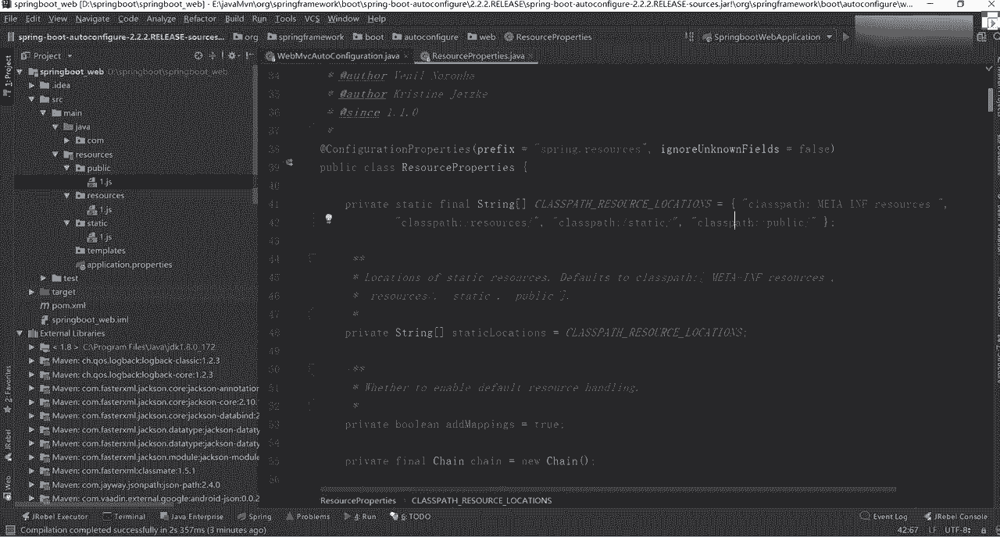

他会先请求哪个显示哪个哪个东西，或者显示哪个目录下面的东西，你觉得刚刚是不是在三个目录里面都创建了。

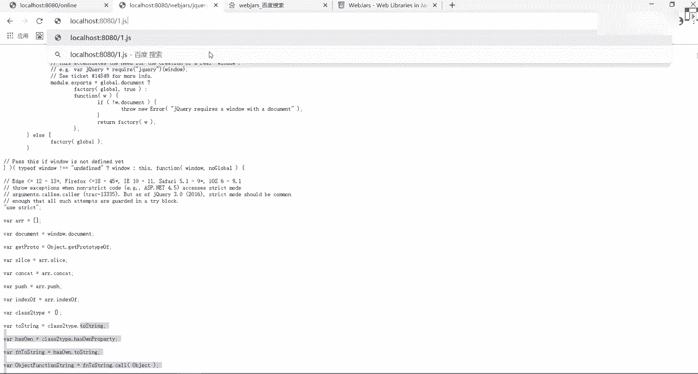

Public resource static，先启用谁后请用谁static是吧，来我们验证一下对应的情况。

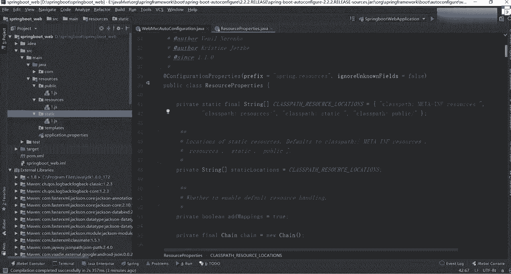

推车现在谁选谁，resource吧，好吧，然后呢，现在我在做一件事情，什么事情呢，把resource里面的东西给干掉。

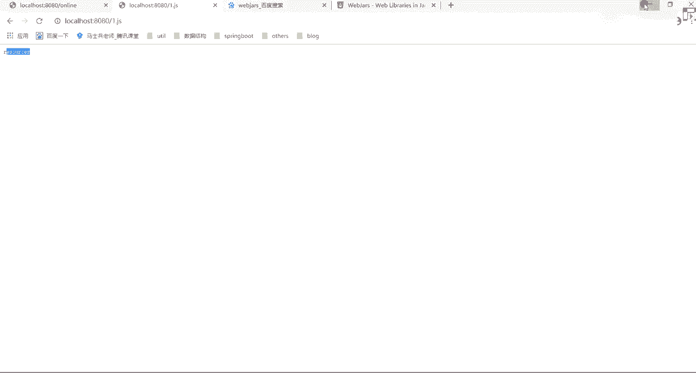

delete掉，OKD了。

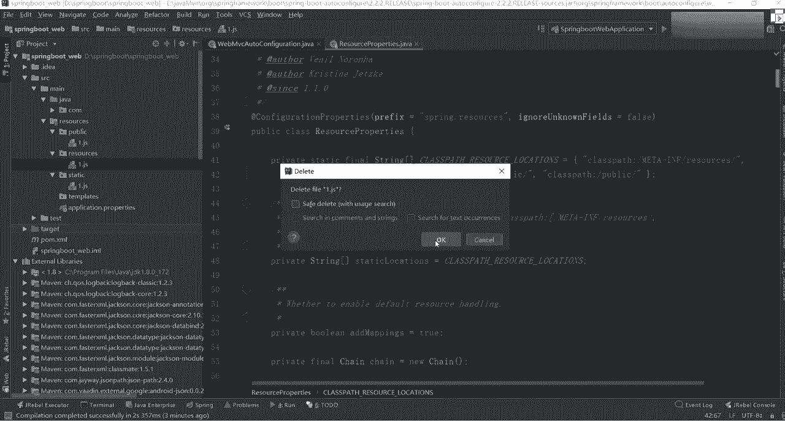

完了之后，我现在在同样发请求刷哎呀，这个这个到哪了，是不是到static了，不到static，static完了之后。

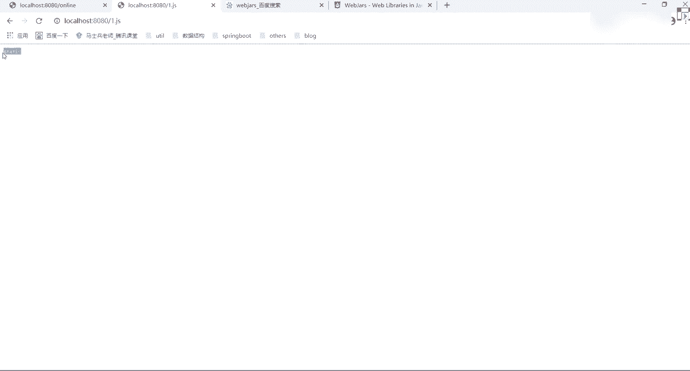

我可以再把我们的static也给进行一个删除delete。

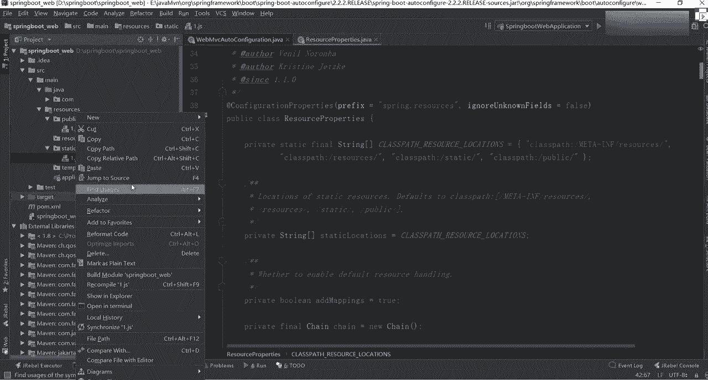

然后现在我再发送一个请求到哪了，public吧，所以大家看到了，这里面是有对应的一个顺序，也就是说，我可以包含N多个同名的一个数据文件。

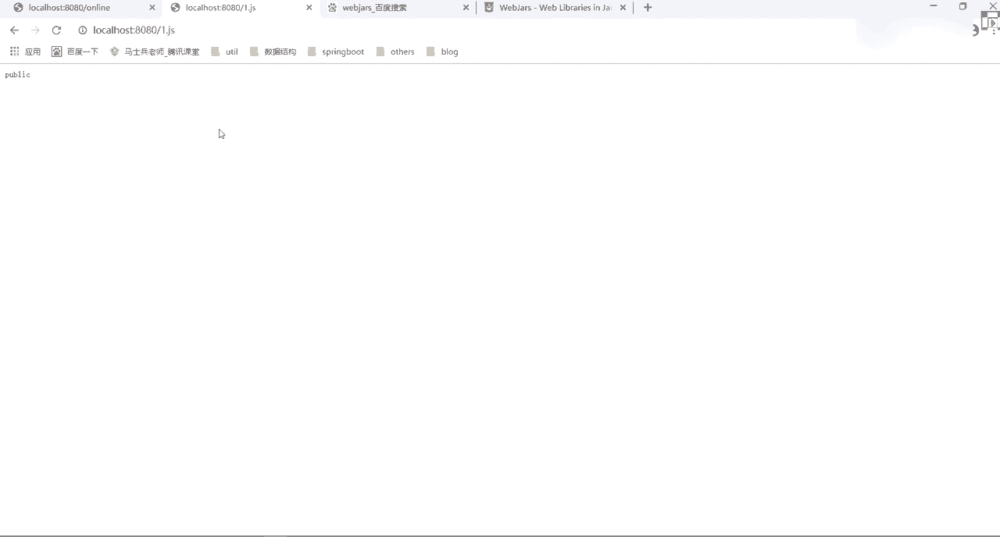

但是它有一个加载顺序，而那个加载的顺序是不是刚刚好，跟我们这块写的一模一样，第一个叫resources，第二个叫static，第三个叫public，这里面是不是标注好了，我加载数据。

所以以后你在写资源的时候，我加你进来进来资源文件的时候，不要随便乱放好吧，谁的怨气更大，你往前放怨气更小，往后放，这样的话他不会进行随便乱覆盖，使得你的样式就乱了，懂我意思吧。

当然一般情况下也没人写那种同名的，一般也没人写同名的，如果写同名的，你要知道它对应的一个加载顺序是啥啊，加载顺序是啥，第四个是44吗，雷第四个这个吗，tap里面放的是我们对应的一个TML，页面的模板啊。

这是模板引擎里面的东西，肯定不如关，跟这个目录无关，跟这没关系，就是上面三个目录啊，上面三个目录如果不放这的话，你往哪放，是不是META杠info resource，刚想想刚刚那个web炸死你放哪了。

是不是放在我们的m e t a info，然后里面是不是有resource，Resource，下面是不是有web js jquery3。4。1，什么东西是从这儿进行下载的。

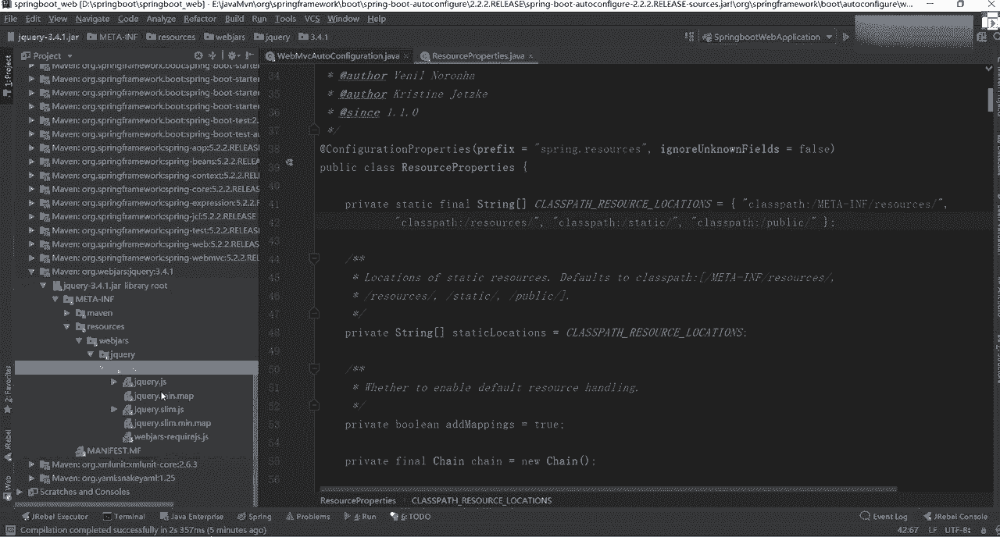

好吧，刚刚我们写静态文件，不算是这样的一个配置目录，所以此时的话只有这三个，所以你要知道他们对应的一个单顺序，第一次找的时候先去找我们这个m e t a info。

然后resource里面第二个找resources，第三个找static，第四个找public啊，这块我们那里面都给大家写了啊，web web js怎么做，加上现在资源的时候。

它的路径是杠新星会去我们的resource properties，这个类里面看到对应的资源目录就是四个，然后呢，下面固定的说，可以看到自然目录一共有如下几个resources。

Static public，它们的顺序就是这样一个顺序，所以你直接拿过来看就行了，听明白了吗，知道怎么加载了吗，这是我们的资源，所以放的时候不要随便乱放好吧，但是一般情况下，其实你们在做的时候。

可能就有一个static public和resource，你们可能没有自己没有创建过，没创建过，你不用管它了，所有的CSS文件，JS文件都直接把我们SD里面扔就完事，但是你最好把它给分好目录。

听明白了吧，OK这个静态资源的加载，听明白同学来扣个一，还是这样，你通过源码里面是不是能验证到很多东西啊，这都源码里面的信息好吧，说实话，第二个什么叫加载，下面一个叫首页资源的一个配置。

这个首页配置在哪啊，一样的，在官网里面有帮我们做了一个东西叫呃，欢迎页面，是不是有展示说spring boot支持静态和文化迎面，你首先在配置静态内容是找到index tm。

如果找不到就找index的模板好吧，如果找到其中任何一个，它能自动用用作什么应用程序的页面，是啥意思啊，也非常简单，每次写的时候都写index，为什么呀，好或者说凭什么写就是index啊。

凭什么index就是我们对应一个欢迎页面，原因也非常简单。

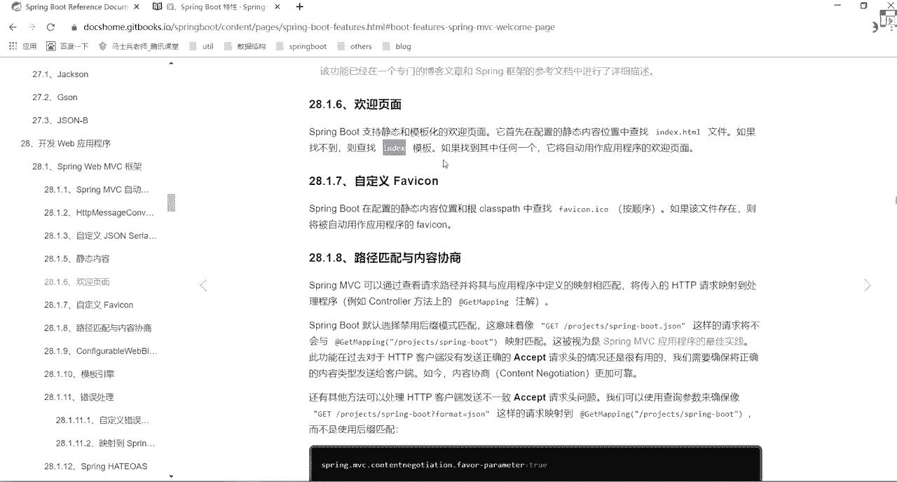

还是一样，找哪儿是找源码，从哪开始找啊，别忘了我刚刚说的东西好吧，还是在我们的web mvc of configuration里面。

在web vc of configuration里面找到我们的ADAPTOR，在DOTA里面我们拍下去，这边我们来找另外一个东西，找啥呀，找一个东西啊，看这这有什么信息，哎。

别走别跑过来看什么叫welcome page handler met，不要看那个get index啊，是不是看到这块了对吧，这里面怎么做的呀，你往里面翻，他说啊，这都参数啊。

说new一个welcome page handler mapping，然后new完之后呢，里面做了一件事情，说new了一个template provider，什么什么东西。

然后从里面获取的时候怎么获取的，叫get welcome page，这里面是不是掉我们的get welcome配置，你点进去是不是在下面的方法里面，这告诉你了，说get resources。

Rest resource什么的，叫get study location，是依然从我们目录里面找好吧，整完之后，这里面有一个方法叫什么呢，叫this冒号，Get index html。

这种写法大家见过吗，见过吧，这希望大家见过吧，什么时候见过拉姆达表达式对，所以如果拉玛表达式不会的话，看一下，我之前在基础班讲浪漫表达式，那个地方讲的比较清，比较比较比较清楚好吧。

方法有这东西讲的比较多，好冒冒，这样的方式加完之后，我们往下看，这个方法是掉哪了，是不是调到我们的get index HTML，到这之后往上看，说什么呢，叫location。

加上一个东西叫index htm，是不是告诉你说我默认在进行调用的时候，就会找我们的index HTML，所以这个地方是标注出来我的欢迎页面，就是我们的index HTML是不是要标注出来了。

所以思维这块，你是不是可以自己进行一个自我定制了，懂我意思吧，所以你把这个原版看完之后，你会发现很多相关的信息，你能找到说OK他是从哪来的，从哪来的，你要给别人能把这个东西给说清楚，说明白。

百度说明白就够了，听懂我意思吧，把这东西难吗，不难吧，来这块听明白，同学扣个一。

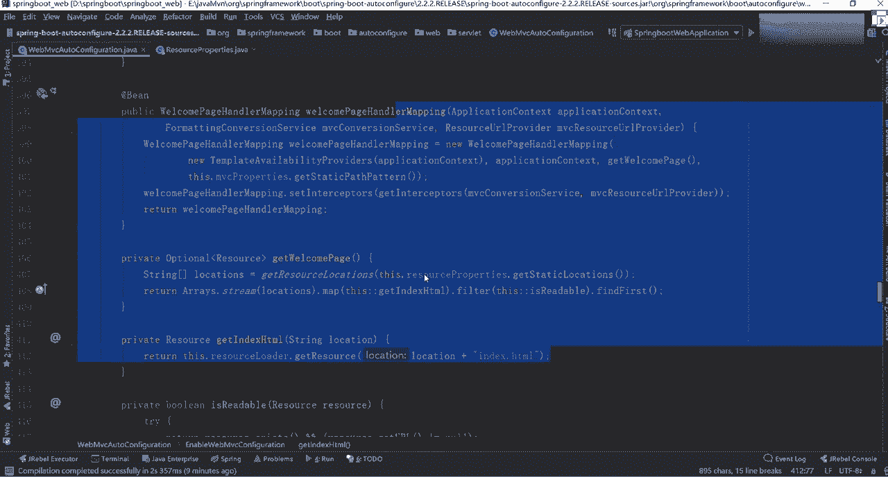

是不是你能看到很多关键的信息啊，这为什么让你看源码，源码里面都有，大家看一下这个源码难不难不难吧，我个人感觉spring boot源码相对而言还是比较简单的，但现在啊怎么说呢。

就是你们现在还没还没梳理出来框架，等咱下周开始吧，下周开始我给你讲源码的时候，我先帮你梳理出来一个整体的脉络图，根据那个脉络的图，我们再一步一步进去找找对应的实现类，你就知道哦，原来是这么回事。

明白了吧，好了，好像这块的相关信息，所以配首页配置怎么做，你应该知道了，我文档里面我这里都写了。

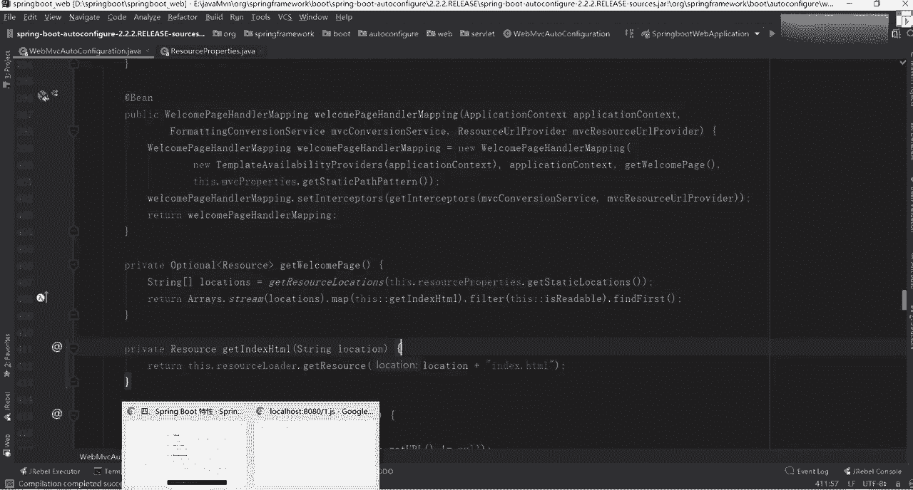

通过哪个类找过来，找过来之后找哪个方法，它都有展示行吧，好了。

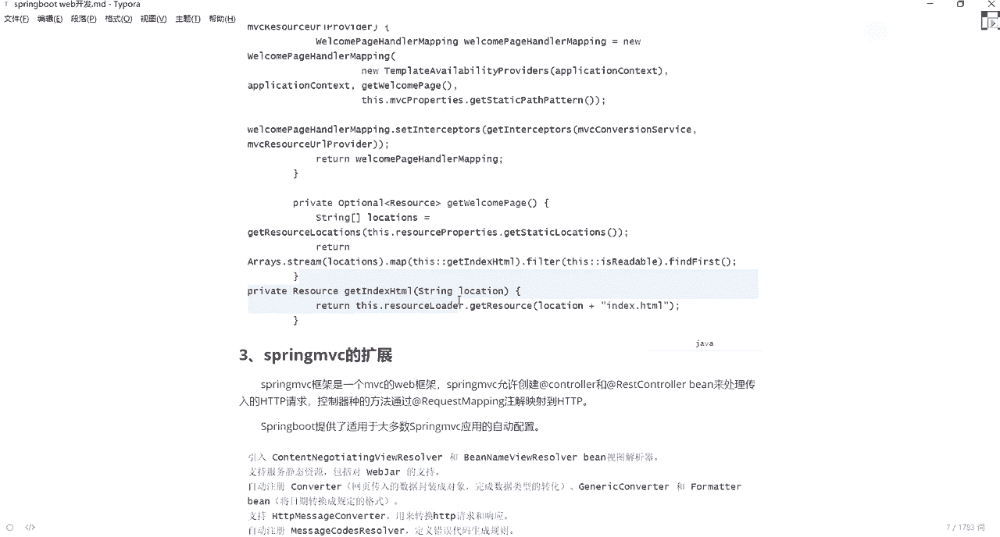