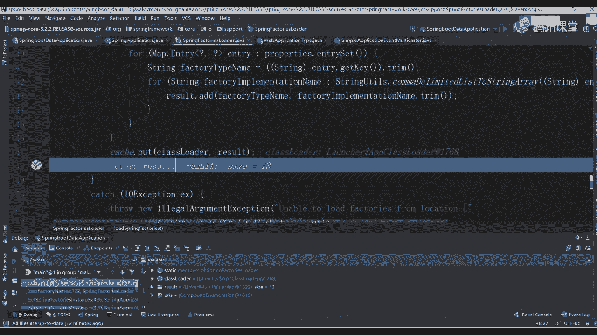
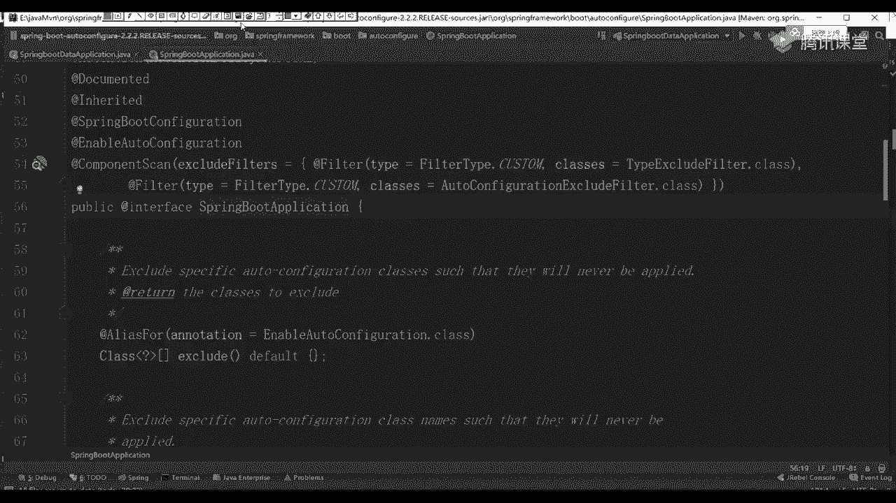

# 马士兵教育MCA4.0架构师课程 - P65：65、springboot启动源码解析一 - 马士兵学堂 - BV1E34y1w773

🎼。🎼喵遥听话。🎼我只说这一次错过就找不到我这样的天。🎼我就是。🎼想要跟。

🎼一起从此以后，我要握紧你。😊，🎼陪你。🎼真的很犀利，第一眼看到你。😊，🎼刻拿下了我的心。😊，🎼眼里都是你。🎼现在的风景。🎼永远。🎼是你。🎼可技的美丽，轻易就让人入迷，什么道理都没关系，不妨碍，我爱你。

😊，🎼我想要见你。😊，🎼那你。🎼去看繁星。🎼夜空下。🎼新鲜伴着。🎼让愿望都实现。😊，🎼随时随地逃你。😊，🎼爱你想微笑。

Yeah。🎼People say that good。🎼为你right塞 by塞。🎼世界な为た。🎼日と セ が咲。🎼咖啡等一分吹。🎼何去努力看待洁白。🎼我然で。🎼Fly。

🎼When you name me。🎼关注你。🎼太可怕。🎼代て。🎼The味道太哥。🎼The天。🎼可 you know we。🎼多人的。🎼When you连。🎼When you。🎼N。🎼回家。Oh。

🎼Whenever I。🎼えて？🎼可最的。🎼也白。🎼爱越。🎼Will you hold the line。

Every want a Thanksgiving enough in tell me and this house of mine。

🎼Nothing never comes set of once once， tell me where this doesn't lie。

What happens that been with a safe woman saying Will this house of mine stands strong。

🎼That's the price you pay。🎼to。🎼Yesす。🎼the job。🎼Pray。Yes。🎼You敢。🎼You敢。🎼我算白 day。

🎼I me see the in of doctor shot ran without that the name。

🎼feel the glass find the wrong within the boss， knowing we are。

🎼hold to the place not work that place space be that the truth。🎼是。🎼月色。🎼你的爱。🎼face。🎼勇敢。🎼就 make it。🎼这个。

🎼You敢。🎼Yeah you。🎼you a story before it still to say。🎼Re。🎼We all got expectations。

 and sometimes they go wrong。🎼把那挽里。🎼The面 so外。🎼でさ。🎼最 tell me。🎼With my head。🎼なぜて。🎼怎么切？🎼かてで。🎼えま。🎼S。

🎼不觉得 why。🎼I want if it really is。🎼Then they don't know。🎼What this feeling is like。🎼Yeah耶耶。🎼Yeah夜。

🎼Yeah。ええ？🎼黑夜。🎼Sry。🎼最。あつ。🎼く。🎼Your friend。🎼哦到最。🎼年 and。🎼我去岁。🎼人你眼的。🎼Deeaation， So with my。🎼They tell me。

🎼With my head。🎼啡平 in mycha。🎼カフで。🎼でまね。🎼Sign。🎼不雪得外。🎼one。🎼Re， it's。🎼They don't know。🎼Yeah。好了，同学们。

咱们开始准备上课了。好吧，能听到我声音同学来扣个一。呃，这节课啊咱们开始讲那个sringboard原版了。🤧贾孙傅我点宝。人有点少啊，咋回事？你把我赶这周赶到哪个房间了，正好是有自己单独的房间，好吧。

雅佳儿O。😊，好了，今天呢我们开始讲对应的一个源码课程。呃，讲原码的时候啊，我刚刚说过了内容容容易引起极度不适。很多同学啊不管自己看也好，还是听原码课也好，听都非常头疼啊，听的非常头疼。呃。

原因非常简单，大家可能很多基础知识呃不具备啊，不具备。所以可能呢呃看的时候非常非常难受，非常难受O没事啊，该去听大数据，听听听听大数据，你选择你感兴趣就可以了，这无所谓啊，只要你听课就好了。行吧？呃。

咱们现在开始讲一下sringbo的一个原码课程。呃，之前啊你们应该听过很多原码课了。问一个问题，大家觉得我应该以什么样的一个方式来看源码啊，这样的话效率更效率更好啊。呃，我不开车啊，我上课很少开车的O。

😊，就是你们有没有自己的一套原原码的一个学习方法，到底应该到底应该怎么做？😡，官网呃官网上看源码就就就看不到啥了。好吧，先流程。O好奇来给大家说一下，其实如果你作为一个初学者。

或者说你作为一个只是应用的一个应用者的话，好吧，你其实对bo这块东西可能不太了解。当我们知道它是什么，是不是另面定义了一堆启动器，所以第一件事先入手的时候，你应该知道了一些基本的配置。先想一下。

每次当我们想运行一个bo程序的时候，都是通过这样一个密函数来启动的。师透这方式来进行启动的。这个启动方式，大家看到了非常非常之简单好吧，感觉跟什么都是什么都没写一样。那我们怎么做还是一样。

在后续看的时候，跟着源码进去进行一个debug，你要看一下每句换的一个代码，好吧，到底传了什么样一个参数进去，一定要bug不 debug之后，到后面就懵了，我看我也懵懂我意思吧。大家这看到了。

我们刚开始调用是一个 application点ro的一个方法。所以你先点到ro方案里面，这打一个断点，我到这边打了。😊，你这儿直打半点，然后我们一步往里边跟好吧，老师带我们写一个责bo嘛。

不带你们写没意义啊，没意义啊。😊，第bu个启动呃，太太说，第一次上课，老师自我介绍一下呗，我姓连大连的连有啥自我介绍的，官网都有。好吧，也许循华去官网看一下。好了，我们刚刚已经打了一个最基本端点了。

现在来右击第bug开始进行启动。大家看到？这块会卡住往回卡住，同时从第一行已经跳到我们这里面的一个ro方法了。方法之后里面又是一个run方法还是一样一次一次往里边点点到里面去之后。

这大家发现了有个什么东西叫new application吧这是创建了一个对象。刚刚我们在主函数里面写的时候，我并没有创建对象嘛，是不是直接以这样一个三数来进行写的，是不是调用它进态方法，但此时你注意了。

除了这样写之外，其实很多地方你可以这样来写的叫。😊，啊，不对，s么被。SA等于另一个 application它是可以创建我们的对象的。创完对象之后。

SA点叫set banner model是不是这里面包含很多参数，你通过这个参数对象也可以进行一个直接调用说这里你可以设置自己的一个参数这块在后面码的时候。

你能看到具体的一个环节体一过稍微了解一下可了之后跳到我们的 application里上翻我强烈大家建议大家一件事干什么，每次再看源码的时候，先把它的一个最基本的注释给看了啊，最基本一个注释看了。

他说了这个class干呢？叫 to引导好吧，并且启动一个spring应用程序对于一个java主函通过va主我一个应程是啥意思说它可能会经过下面的几个步骤引导你启当前你的一个应用程序。😊，分了三个步骤。

第一个叫什么叫创建一个什么东西，叫instance吧，是不是一个实力对象，对吧？哪个实力对象叫application contest又看到当前这个上下文对象了吧。

你上下文么解释你们开始就已经开始接触我们的下文对象了就表示你可以把它理解为一个容器，可以把它理解容器解我上下文这个环境里所包含的一些值都会有一个上下文会放到里面去，这是第一点第二点什么呢？

叫reg说它要注册一个什么呢？叫com line source是命令行的一个属性参数吧对吧后就你可以启动的时候指定一命令行参数我的叫杠杠指号是这方式三种方式叫ref application重新刷新我们对应一个con上下文环吧loading a single是不加载所有的单的。

😊，bes这不用说了吧？然后再往下看叫tbes是不是触发所有的病s啊。所以所以这里面告诉你了，我大概就通过这几个步骤。然后下面告诉你说你有几种请求方式。第一种应应该怎么做，是不是写了一个主要程序。

第二种后面告诉你说了，你可以这样自己进行一个设置，先创建对象再进行设置，两种方式都是可以的。然后下面有一堆的解释，下看一下就行了。我们这不再挨个读了。完正我就我就给一个建议。

每次在写的时候一定要去看这个注释，这注释里面虽然比较少，虽然比较少，但是呃描述事情描述的还是比较清楚的，一定要去看好吧，看完之后来，我们再重新看吧？看到刚刚那个弱方法这。😊。

刚刚那个上面那个解释看懂了吧？应该稍微看懂点吧。OK来往下看热方法，然后完之后，先看它拗了一个对象，用对象的时候，一定要做一件事情干嘛，是不是点进去再点进去，是不是这样有一个主函数的，那一样的。

我们刚刚因为已经选择debug这样的一个方式了，所以你可以一步一步往后点，哎，到哪去了？到这儿了。😊，等会儿啊，我把这些断点给干掉。来干掉啊。重启一下。Yeah。好到这一行，然后呢往里边点点F7对吧？

再进到F7里面再进去加这之后，看到了它就到它的一个主函数里面了。在当前这个构造方法里面，构造方案里面做什么事。第一个叫this二个是一个断言第叫初始一方最后有一个命他发现了里面一共做这几件事。

这几件事很重要，你必须要提前把它进行一个初始好，同时在当前类上面还定义了很多的一些参数值吧，这参数值当你在创建对象的时候。

一定会进行一个创建什是不一定会执行要不要执行怎么判断一样挨这行创建走是把这些前面的一些成员变量值都给你上跳到这一行第一步等于空空空着二步断言也不管第步步关键。😊，这干嘛的？

叫primary source了，这东西怎么翻译啊？😡，啊，主要资源吧，是不是主要资源后面给了一个值说ase at least primary source primary source是谁是我们刚刚传递过来的。

就是我们刚刚写好的那个主类，听白了吗？主类，你刚刚在外面写个啥是screenringbo data application所以当前那个主类就是这里面的东西，直接拿过来。

你可那看一下是不是有一个name叫唉叫ringbo application是不我刚刚好的那个启动类能看这步吧，看完之后这第一步骤，先把它付给一个集合对象，第二步干嘛呢？

叫web aP application点deuce from pass这个是干嘛的，注意了，在翻法里面，这东西很关键，你先听我说，你不用在意说也不要做笔记，我这给你大家写好一个文档大家看一下。😊。

这文章里面怎么做的，能写注释的地方，我几乎都帮写注释了，懂我意思吧？所以你现在先跟着我的思路去走，他是怎么做的，做什么事情。😡，OK所以这个文档一会儿下课之后我会发现大家，你下周自己看啊。

这个东西我们不不不管它了啊。O一样这个文档写的比较多啊，内容大家看镜条很多的啊，能帮你们占的地方我都帮你们占了。所以现在跟着我的思路去走，不要去做笔记没有意义好吧，这干了？

刚同学说了叫解析we类型是MVC还是we就是说我们用的是最基本的点击看一下吧，一个啊，或者是我们的显示式布局或者或者是not它这儿有三个对应的参数，你可以往里边点。

同时也可以怎么做返回直接跳到我们当前一个通法里面去进去交完之后，这是不该判断了，这一个啥意思。😊。

好，后面还有什么 present什么意思？这要做一个解析，这前面都是我们对应的一个常量值。其实这里面你注意了，有个东西叫什么叫dipatcher是有这样一个常量值。

其实它表示是某一个类的完全性名包名到类名，是整体这过程然后这里面也是做一个判断，判断完之后，如果符合里面对应条件的时候，把它设置为什么叫reactive是不是响应式的一个东西。如果它不符合的话。

是不是跳到下面这地方，这返回是n一个类型。如果这两个都不满足的话，最终会返回一个东西这块就一个意义什么意义来设置我们当前这个应用程序，它是什么类型，有三个默认的值，第一个是serv。第二个是响应式的。

第三个就是我们的我们这完之后你可以往下看哪去了，是不便利了，这参数值啊，下自看我们这不做判断了，进来之后是不直接到最后一个所以这返回的值就是我们对应的一个。😊，听明白我意思吗？所以这块大家记住了。

永远记住这个we locationt等于serv late。因为之后我们在环境在上下文的时候，会有很多地方都用到这样的一个参数值好吧，这是第一个步骤啊吧，这个关键比这个点比较重要，这是第一块。

这块做完之后该看第2块了。哎，到这目前为止，能听懂的同学来扣个一，能听懂吗？😊，你知道的东西干在在干在在干嘛吧。😡，就这参数设置好吧，我现在没跟你说那个架子啊，没有意义。你现在说架子也也也不了解。

你就想一下，如果你是初学者看源码的时候，我应该怎么一步往里边跟。😡，上面其实就是一些参数值的判断。因为我现在要创建一个spring application的一个对象了，这样一个对象。

所以此时我要调查构造方法，在构造方法里面，我做了一些参数值的赋值，然后这儿做了一个当前应用程序类型的一个判断。做完之后这下面有个什么东西叫set initial。

然后呢有东西叫getspring factor instance很多同学在公司里面用spring。你对这个方法是不是应该很熟悉了，这什么东西。😊，干嘛的叫获取spring的工厂实力对吧？

这个获取工厂实力是干嘛的呀啊是干嘛的？后面这传了一个类叫plication applicationplication然后呢contex是不是相当于是我们当前上下文的一个初始化的一个类这个类注意不要小瞧它它作用非常非常之大我们可以干嘛呢？

先跳到这里面进去里面去之后往看叫get factor instance是是这样的方法里面再往里边走，这第一步先获取一个器这没问题吧。载完之后第二步往下走，是不是创建一个集合，这个集合干嘛的。

不知道但后面一注释叫us names and ensuresure un to protect againstmin是去除的一个操作。

所以里又是什么是一个et然后往后看者说这一段都是做资源加载的前置校验可以这样理解吗？不太准确，它更多是为了加载资源，没有校验的东西，就加加载资源往下看啊，这里面传一个。😊。

叫springfactor load点loadfactor names这块也一样往里边点，这个t不用我说了吧，是不是刚刚都是传过来的一个参数。

什么参数叫application context吧是传过来了，就刚刚写好那class对象刚写个那个类对象点完之后往里边依次往里边走走到这之后，这有一个名称这个名称也很简单，看到了吧？

看这吧什么plication吧，这其实你看不出来啥，它为什么要定义这样一个类啊。我知道很多同学之前其实你自己可能看过一些帖子那里面说了每次当你在进行加载资源的时候。

它会去我们当前你加载的账包里面读取一个文件，哪个文件呢？叫spring。😊。

然后第二factorory。呃，factortteries有人叫我这个东西吗？😊，应该都见过吧，是不是这样的东西，它是个啥？它可以理解为类似于是一个proper一个配置文件。

在当前这个配置文件里面定义了很多外部或者内部的一些资源来供我们进行加载。那这东西我应该如何进行查看，也非常简单。

往里边找找账包这账包找一个东西叫springbo第一行点这块再往里边点点点到这有个什么东西是不是叫spring factory。你看一下里面定义点啥。

叫ORGring framework eNper load里面是不是定义两个类的一个完全性的名，然后有个spring application listener是不是鉴听器。

再往下看exception report叫异常报告器。再往下看这个东西熟不熟。😊，收了吧，是不是跟我们刚刚你所看到那个application contest，你说la是一样的东西啊，是不是一样东西。

那类边一样的。所以它会去读取当前我们这个文件，把文件里面相当于前面是K，而后面这几行是我们的value值，它会把这些value值给你取出来，这东西也不是我瞎说的？老李同志老师。

你怎么知道它会去里面找这东西啊，你可以把你对应的一个炸包挨个打开。这个spring点 factor一个文件只在两个炸包里面有。第一个就这个spring boot好吧。第二个在哪呢？在autoconfi。

😊。

它有一个同名文件，只有这两个文件里面啊或者这两个账包里面包含这些文件，其他里面是没有的啊，其他里面没有了，你顺便点开一个第3个。😊，有吗？你再点。有吗？没有了吧，是不没有。

所以这里面我需要把这两个文件里面东西给你加载进来。好，大家看到了里面都是什么，就是一些类。好吧，已看到了这些类里面都是什么报名加类名。你看到这个东西之后，有没有一个条件反射，它要干嘛？😊。

我要去读取当前配置文件，读完之后，我根据我们的K值是能取出来一个value的。而后我的value取完之后，一定是一个字符串，对不对？那我根据这个符串，我要生成类的话，O刚才说了反射。对。

其实里面后面我们会看到有很多反射应用地方，它把这些对象都进行一个实例化，怎么实例化，是不是有东西叫class pass，对不对？那个class要 for内。

放内完了之后是不是有东西叫inst这些实例化就搞定了。好吧，但你要知道它是哪从哪来的，应该怎么进行一个最基本的读取，这块也不知是我瞎说的，我们可以来进行一个验证，我关掉了啊，两个文件没啥用。😊。

关之后往这边走，看第一个方法，往里边点点进去之后再走，是不是下面点下面这完了之后，上面告诉你了说这是一个什么东西，是不是一个map结构。😊，把你自己调大一点吧，看不清楚吗？调大一点儿。🤧放着。🤧嗯。

这样好了吗？现在好点了吧。没关系啊，大眼么大点无所谓啊。来往里边看做什么事情。我刚刚说了，这得到的一个名称是什么？叫application application contest对吧？

进来之后通过调这个方法，这个方法之后往下看，这先创建一个map结构，创建完当前map结构之后把它放大创建完那map结构之后干嘛呢？先判断一下这个结果是否不等于空，如果不等于空的话。

直接返回等于空话不做了第二步干嘛呢？叫nU这个东西是啥？一个枚举类是不是一枚举类，这东西大家应该都认识。

然后通过叫class load点ge resource从哪ge resource resource，点进去看到参数了吗？是不是META杠INF。😊。

他会去我们当前的class pass这个路径下面查找当前具备相同名文件的一个名称，找这个文件名称之后，会把里面的东西给你取出来啊，给你获取出来干嘛下面也是一样get system是不通过两个资源路径。

把这西读进来。读完之后没完然这刚告诉你说了你有另外的一个结构是我们的reult了。完之后开始挨个进行便利。因为我们当前所依赖的环境里面有两个文件嘛文件嘛。

以这时候它是一个集合要进行一个迭代迭代完了之后挨个把里面的值都取出来好吧，注意啊，根据什么取是把里面所有的K等于V这样的方式的值全部都拿回来刚我给大家粘出来了啊，这出来看我把那两个文件东西全部粘出来。

好，上面这块就是我们的K值，面就是value把这些K和value的值全部都获取出来，这块就是获取的一个操作获取完了之后没完它要干嘛呢？叫catch点put什么东西。😊。

啥意思？因为你后续的时候啊，需要不停的去加载一些，比如说监频器类。比如说初始化类。如果每次我都去文件里面进行读取的话，这个效率可能会比较低。所以在这一步的时候，我做件事情。

我提前把所有的配置文件都读取进来，然后放到我们的缓存里面之后，当我需要哪个类的时候，我直接去缓存里面读就行了，而不需要从文件里面再进行读取了，懂我意思吧？所以这就是这一步骤的一个操作。

最终会把我们的reult给反应回去。reult就是一个map结构。😊，听白了吧？这个过程应该能听明白完了之后大家看到了是不是到这一步了，这步是完成了。完成之后。

第二步叫get or default获取或者是呃获取或者是个什么一个默认值吧，叫factory type name记这个名字叫什么叫application context，然后in了，把这名字给我记住。

这是不是有这是不是有好，所以我们可以往里边走一下F7进到这里面，然后往下走一个走到做。😊，这是不一个循环结构，我也先面打打断你啊，直接跳直接跳过去啊。😊，走它会进行N次循环。

大家看到了里边多少个是不是有13个我们对应的一个结果集了，是13个吗？是不是13个很好判断，怎么判断？你打开刚刚我们粘出来这个文件，你搜一下里面有多少个K，你搜完之后你会发现里面应该我没记错的话。

应该是15个K因为什么？因为里面是连接两个文件，这两个文件里面某些K的值是重复的。比如说我举个例子，第一个叫plication看吧你往下翻，这是是还有一个再比如说 listener往上翻。

这上还有一个它有一些重复的K的值重复K值会把所有的个value值都放到一起，所这你看到只有13个懂意思了吧？往下走。😊。

回来回来之后，该从里面获取了吧。实际上在此处获取我们参数配置的时候，它从哪读的是从缓存里面读的。记住了，缓存里面读的。所以我们这进去之后，可以看一下吧，点F7进去。呃，退出来，不是这儿再点进去。

看这是不是它这开词容里面叫V等于get什么东西，然后呢，contl k什么东西，然后把我们对应的一个值直接返回回去就可以了。当你这儿返回回去之后，因为你刚刚匹配过来是啥？😊。

是哪个东西叫application context，已经什la吧。所以这时候我们可以做一件事儿，什么事儿，你数一下当前这配置里面几个几个类啊，123455个吧，你往下翻，12一共几个是不是7个。

是不是应该是7个？那意味着我当前这个集合类里面，它返回例子集合就应该是7个。😊。

这没毛病吧，所下面我们可以往里边走走，到这之后往下走一步。😡，来往上看看这names多少？是7吗？你把这个弹出框调大一点，是不是7个对应类，你可以跟我们刚刚这边做一个验证，做一个匹配，放哪儿放这儿吧。

看后缀就行了啊。看后两个第一个叫sing met data什么东西，然后呢肯定是到什么东西，后两个一样吗？一样吗？那意味着我是不是从当前配置文件里面把这个值给取出来了。

而且刚刚好跟我们的数据是不是一模一样的，所以刚刚完成什么操作？😊。

完成么操作是不是就完成了我们整体从里面获取我们数据文件的一个操作。但其实刚刚啊刚刚这块注意了，只是把那个东西给取出来了，取出来类子集合。现在有进行任何实例化操作吗？听我的问题啊，有进行任何实例化操作吗？

😊，哎。😊，怎么怎怎么没说话，没有吧，你没看到吗？是不是没看到，没看到你往下搂，这是什么东西，叫create spring factory instance。这儿告诉你说。

我要开始创建当前对象的一个实力了，它是不是也返回一个集合，折叠集合是一个实力的一个集合。点到上面集合不一样的，下面只有内，下面是跟我们的集合了。所以你依然往里边点进去之后该到这一步。😊。

这边要做什么事情，你看一下这里面是不是我说的反射啊。第一步，先把我们这个names放到里面去，先创一个空制集合TT类型。因为类型嘛你的类型都都不一样，所以这写了一个T战位符，然后开始循环便利。

我们当前names循环之后，第一步叫class点有il什么点 for name吧。一看到for name肯定是啥反射了吧，你点击看一下。😊，往下走找一下啊。拿出来。看这是不是全部都是for name。

是不是告诉你说这内部star位置什么东西，然后找一个 for name好，我们之前用过这个东西吧，class for name直接进行一个反射的一个操作，对吧？获取完之后只是什么？

找到我们当前这个大写卡斯对象，然后呢，获取它什么该构造器的吧，是不是告诉你声明它的一个构造器是啥？有了构造器之后，我再进行什么？是不是实力化类。😊，好吧，所以当你这识理完之后。

这已经变成一个instance了。此时把insance再放到我们刚刚定义好那个历子集合里面。大家想一下，当我这个步骤，如果我已经完成了，我做了什么事儿，是不是相当于我实力化了，呃。

实力画好7个已经存在的对象，是这意思吧，你得把它走一下啊，我们编一下试试吧。第一个先取出来一个值，class等于什么东西，是不是取出第一个取完之后这下下下下来看这inst。😊，有一个知道吗？

是不是已经有一个结果了，因为你现在完成一次了嘛，下面也一样7次，所以要循环7次循环。我们这不看了，我一样的把它直接跳过去了，走跳这这这一行。😊，等一下有点慢啊。嗯，走这么慢吗？诶。😊，就这么慢。

所以这块大家注意了，当你看完之后，你会发现它完成了7个类的一个识别化断点无效。不是吧。算了停了停了松送来，没事。出来声。来往下走。

看是到这一个实化多少是不是7个是不是7个这已经知到我们对应7个的一个值了。所以此时我可以把我这个值直接返回回去。当前返回去之后。

你这已经发现了干嘛了是不是已经有了7个对应值你下拉一下成现都是我什实际的对象了，是都是我们对象。这已得到对象。当这些对象是干嘛的，你现在还不知道啊。

我也不知道你看一下对应什么西就是一堆初始化的一些值地什么confi warning叫配置警告的一个初始化一个初始东西什么西往下看下面什么叫么什么什么东西就有很多这方面一些值啊我知道很同学对这些值我不知道这个干嘛没关系没关系。

我刚刚我了我在这个文件里面给你们写了一。😊。

找起来。咱们来看。刚刚我说了，这里面是什么？是一些contest的一些初始化设置。第一个叫报告spring容器的一些常见错误配置，这是第一个它的作用。

第二个叫使用呃配置那个spring上下文的一些ID的一个值，然后指定初始化器进行初始化的一些规则，设置到什么U门的环境里面去，能给大家写东西，我都给大家写好了。所以你现在先不要管这几个类是干嘛的。

因为运行的时候我也不知道，懂我意思吧。来到目前为止，能听懂的同学扣个一。😊。

你听懂吗？好，没问题。粘完了之后来再接着往上跟跟什么东西，到这之后再做一个操作，叫allocation where order compare，不知道它干嘛了？没关系，这有s shot什么意思？排序嘛。

好吧，我这要进行一个排序操作排下序，排完序之后，把当前这个结果直接返回去。你不要问老师排序干嘛的，我也不知道好，我也没看下这个排序干嘛的。但最反正最终得到一个结果，什么结果，我现在已经把它排好去了。

并且能把我当前这个实力对象都返回回去了。所以一层一层你可以往回走，到这了吧。这样做完之后注意了，只是里面东西，一会儿我们来画图，一会我们来画图好，先看这里面做做做做什么东西，一会儿来画图，好，别慌啊。

会会给你们画图的啊，别慌。😊，好，这做完之后，咱往下看是不是刚刚只是调到里面的方法，里面调完之后该掉外面了吧，是不是该设置到我们当前这个初始化器里面去了。所以往里边依次进行一个点哎呀，调过去了。

也错了来往下看这面做什么事是把你刚刚设理好那些类对象，直接放到一个集合里面去搞定了。这里面其实没做啥啊，其实没做啥，非常简单，就直接放到我们这里面去了好，这是刚刚写好那个那个步骤，来再往下看回过来。

这是做这样一件事情，你放下面这个代码的时候，你看到了跟上面是不是一样，也是get three factory instance，然后呢，plication listener这两东西是不是一模一样。

你看到lister之后是不是一样的去我们配置文件里面要找我们的lister了。几个。😊，1234567891010个吧，你再往下找，这是不是有一个，一共是不是11个我们的说法器啊。

所以你往下找也是一样的，点进去。就是就到这儿了，往回返多少个是11个吗？😡，设是一个意味着我把这个类呃监程器也给创建好了，然后往回走啊，往回走。OK然后再定到我们的lister里面，直接创造一个集合。

好吧，这是我们这个操作做完之后，上面东西都做完了啊，就完成一些参数设置。做完之后再到这儿叫this their main application class，这干嘛的？😊。

是不是找一下我们当前应用程序的一个主类啊，或者一个主函数，对不对？主函数它用的一个方法叫什么dduce命 application class这干嘛的？一个方法，你可以点到方法里面去。

这里面打印了一什么呢？叫new run time exception。然后呢点get，你看到这个方法熟不熟熟吧，你之接前代码的时候，当你看到异常信息的时候，是不是都是通过叫一点，获取到跟踪信息。

所以此时在这里面我们也能获取到我们整体这一类的一个异常对战信息。😊，好，就是说你这个代码是一步一步怎么走的。因为我要找到你的主函数嘛，这里面取到一个集合之后，你也发现了这有个什么叫if命点什么东西。

是不是找到我们的密函数，找密函数之后叫class点 for name，又开始跟踪我们当前这个类来进行当前类的一个初始化操作，或者一个呃当前类的一个什么反射操作，获取到一个大选C的一个class对象。

好吧，来点进试一下吧。😊，过完之后，你往上看后调有什么，是me application contest呃 application class吧，做完之后往后翻是啥？

是我们自己写好的com码是b点thbo data vacation吗？是吧？是不是看到这步骤了。所以这块你应该能看到很多的一个相关信息，相关信息。那这个东西来我们画下图。😊。

来看一下刚刚那个步骤，讲了这么多代码，我们做件什么事情啊，找塞桑。😊，先波它。请简刘龙图。来往们来看吧，它进去之后，第一步骤我干嘛呢？是当前。😊，哎，这咋回事儿？脚启动。当前。也有。程序怎么启动的？

是不是找到我们对应的一个密函数，在这个密函数里面，我包了一层东西。加上一包的啥？是叫spring。😊，对塔。Application。第二啊不对啊。叫苏瑞他呀。嗯。😊，第二。run方法吧，是叫run方法。

调状方法之后，最终你会看到一件事儿往后走。这里面做了什么东西？是扭了一个spring。アプリケーション。就对象嘛，是不是先救他是不是先救他，你要对象之后，你要知道在当前对象里面，我一共做了几件事情啊。

做件事情想一下。做这件事情，我们这写一下。第一步叫一。配置什么叫ressource。loader当然这个值啊刚开始的时候是空的，刚开始的时候是空的，这没关系，你就先小这，这是第一步，第二步叫判断。

什么呢？当前应用。程序的类型，这类型有三种，分别是slate。reactiveative，然后呢还有n，一共包含这三个对应值。证明问题吧？这是第二个步骤。第三个步骤在干嘛？哎，3这个吗？是不是初始化。

或者说获取初始化。气的实力。对象第四步，获取监听器的实例。对象。第五步找到。当前类的。呃，当前应用程序的主类。开始。就行。想一下，这是我们刚刚那个构造函数里面做的这几件事吗？是明有吗用吧？

所有人能看到吗？我刚刚就带你们看这这点东西啊，别的东西还没开始看呢。我说一下再说一下第一个是是他吧，第二个，第三个第四个是不是一共这么多步骤，你把它记住就行了。呃，这个哎没必要记啊，你把它理解到就行了。

当你做完这件事情之后，这块到目前为止能听懂同学来扣个一。😊，能听懂吗？你先按照这样流程去做，这样流程去去做啊，这样这样他。好了，当你剪完它之后，到第二步了。😡，干嘛了？我对象创建好之后。

这个步骤会执行一个run方法。转号码这号表什么意思？启动。😡，嗯。怎么老唠叨？启动。好，因为大家想一下，每次当你在运行，为啥从run time的异常对战信息里面找到主类啊。

来，这你看一下，知道了。是这号法里面。😊，我俩打打锻点试试啊。呃，我找一下。走。漏的走走走7个。进到里面去往下走，这是一个什么叫new timeex什么？这有一个叫get。你往那看，这get干嘛的。

你点看一下，里面有01234567，对不对？你看一下后面它都关的什么，跟你当前类里面所在的那个代码里面多多少行吧。现在多少行，279行，你找一下279是我们这一行。😊，对吧你往上翻叫274，270在哪？

你往上找，是不是刚刚你调过来的方法，你调过来之后，你往上翻253，你往上找。😡，是不是刚刚是从这行调过来的，253完之后，是不是有1226，你往下翻，一步一步找到之后，找到最后一行。

是不是有东西随便背了第十一行，第十一行找一下。😊，是我们当前一类主函数吗？是不是找他了？😡，这就直直直接找到了，所找到主函数时候，意味着我现在可以开始执行了，就这样步骤。好，所以你刚刚看到程序里面。

它会一步一步往里面接着往上走吧，挨个匹配。如果是命的话，如果是命的话，他就可以直接返回去。看这返回去之后，他找道这个单线类了，然后把当前类进行一个持际化操作。

因为我们并并没有创建这个类的一个几那个对象啊，所以这直接进行一个class，然后返回去就行了。就这样步骤啊，这我啥很难理解嘛。😊，好吧。异常在那这样就是这样的，这有啥可看的，对吧？好了。

操作完之后来往下看现在我是不是这个对象创建好了，创建好之后，我这是不会掉一个状方啊？当然后面要传一个al参数，你们在写设计程序的时候，有写过这个X参数吧，这都写什么？比如说叫杠杠，然后加一个叫ser。

😊，点port等于8081，是不是也指定我端口号，以及其他的一些参数配置，是不是都可以用杠杠的方式进行写。对吧？到现在啊我们这程序里面什么参数没写没写没写没关系。点F7进到我们当前这个ro函数没去。

到这里面这才是我们整个应用程序启动的一个过程。这个过程给大家说一下，是非常非常之麻烦的。好吧，里面涉及到很多的一些点，这些点我要挨个来说，你好好听，这才是我们的核心。😊。

第一个参数这是空，不用管它了，以后我们都直接忽略我们三数要做事儿。第一步干嘛呢？叫star stop watch，是啥东西啊？什么叫stop watch啊？😊，我可能不知道它干嘛的。但是你想一下。

你作为一个应用呃的一个应用程序，你每次启动完之后，你看到都是什么先打印一个banner，对不对？打印完我们对应的一个banner之后，后呢我打印一些异常信息正常日志信息。

打开日志信息之后会给你一个时间嘛，这一个时间就是用来计算我们当前时间的，你点进去你会发现非常简单，这this往里边点这是它出现好对象了，好吧。

就给了一个this这是一个什么空的字符串I值是空字符串完了之后这东西叫一下这个东西叫star吧，点击star这是star点进去你看都什this name不等于空当是不是空字符串空字符串并不是空好也不一样的。

如果是空的话，包抛一个异常不是空的话，计算一下告诉你说当前任务的名称是啥同告诉你说开始的时间是什么时间叫s是统计好我们当前应用程序的一搞定了是不是这样一个值。😊，因为它要计算什么？

计算你当前整个应用程序，你在启动的时候，它所浪费的一个时间啊，所浪费的一个时间，或者说所耗费的一个时间。这儿大家注意一下就行了啊，注意一下就行先生，就是一个时间东西，别东西倒没啥啊。

它为什么计算时间不用说了吧，看一下你启动东西用花多长时间嘛，对吧？完之后往下看这这样步骤很简单啊，不多说了。再往下看第三个这干嘛的。

叫configurationable application contest等于啥，这其实干嘛的，就设置是我们当前这个the应用程序的一个什么上下文环境。当然是现在的上下文环境依然是等于空的，也等于空。

什么都没有做设置啊，任何事都没做，不用管它。然后往下看第二个什么呢？叫。😊，大家叫exception reporter是个异常报告信息啊，所有人应家都知道，每次你在启动你的用程序的时候，有可能会成功。

有可能会失败。而失败的时候，我们是要把这些信息给汇总回来，所以当前这个report里面啊包含的就是你在程序启动过程中啊，启动过程中，你报的一个错误，会放到里面去，所以它出现一个什么创建一个集合。

当然现在只是new了一个ra，你别用管它如果你启动不 to的话，这对象没有用了啊，没有用了，懂我意思吧？这是这一步再按上第三步什么呢？叫config properties，这个东西也很没用啊。

几乎一点用都没有，它干嘛的？它作用也非常非常简单，你往里边点一下试试啊，走看它作什么事叫system点 set properties，然后呢，这给了一个参数值叫java点AWT点。😊，然后呢。

做完之后再来看第三个叫sytem点ge properties，也是这样的一个值。比是说我现在要设置这样的一个参数值，把当前这样参数值设置为什么？设置为t。在我们的windows环境里面是不需要的。

但是如果你在你的link环境里面，因为大家知道link环境的时候，你有对应的键盘吗？有对应的屏幕吗？有这些东西吗？😊，是没有这样的一些外部设备，是没有这样的外部设备。你说老师有啊，我自己可以连啊。

你连是通过远程进行访问的，并不是这些设备里面直接包含的懂吗？你在你服务器上装过显示器吗？😡，涛同学。你不去装我显示器啊。😡，没有吧。好吧，所以这里面只是说我在绘的，因为他用的什么，用的是AWT吧。

AW大家应该很熟了，现在可能没人学了，但这个东西大家应该很熟，是不是在Java里面又做了一个图形化一些东西。所以这块做这样一个参数的一个设置，目的就告诉你说，服务器里面啊，如果没有那种呃鼠标了。

屏幕啊这样一些外部设备的时候，我可以进行一些图像的绘制，就这意思好，所以这块我给大家做解释了啊，大家能他看一下吧。你找一下。😊。

23。找一下。看这儿。这设置系统属性啊叫java点AWT list的值默认为tro，用于运行ha list服务器是进行简单的图像处理啊，都应于什么？叫缺少显示器，然后呢键盘和鼠标识的一个系统配置。

很多监控工具如Jconl啊，需要的话把这个值设置为t就完事了。它对我们当前这个应用程序其实没有多大影响，它就是只设了一个系统参数而已。所以这你稍微记一下就可了啊，稍微过一下可以可以了。

O这个程不用说了吧。😊，不用说了吧，到这儿为止，来能听的同学扣个一，是不是相在就是一个前置准备环节，我们再来画一下图吧。😊，想要做一件什么事，装技能之后。😡，这28左一下。第一步骤叫设置。我是记录。一。

我这个键盘咋回事？设置启动时的。启动时。的时间值。时间。吃底又不着。然后呢，做完它之后。第二个。想一下刚第二做什做做什么事，就设置一下我们当前这个康t词对象，或者说创建。这怎这怎么事啊？好麻烦。

这个突然是这样。那。设置叫contest。应用。上下问啊，这都比较简单，这是第二个步骤啊，这是第二个步骤。然后第三个步骤干嘛呢？是设置一下我们的异常报告器。3。这是一常。泡高器。第四个步骤。

是这刚刚是不是上面这第四步是是不是它？然咱往家看干嘛了，是设置一个第四。我疯掉了。设置。java点儿AWT点儿。他的list系统参数。啊，喂处。cttrolM可以切换。没有啊，好，不管他了。

这是我们前面这四步要做的事情，对不对？这四步啊做的事情都比较简单，都从那挨个练下来的。😊，然后画一下。第二步。OK这是四步骤，前四步做起来还是比较简单的，好吧，或者说它几乎没设的啥。

但是从下面这步骤开始就比较麻烦了。好吧，这个步骤相当相当麻烦。其实我们看一下之后也非常容易看到说什么呢？

叫spring application wrong listener listener等于get wrong listener，你看完它之后感觉没什么感受，干嘛呢？

说获取我们的run listener这样东西，这个run listener是什么是什么是什么玩意儿啊？啊，这东西怎么看到呀？😊。

啊，分判断。怎么做这个东西吧，先想一下它有什么样的一个意义啊。其实你非常简单，我们可以做一些什么事情。你可以看一下，刚刚你看到前面这个类，它是干嘛的，点进去他说了叫 collection of什么呢？

叫spring application listener这就是一个运行时监器点到这个监听器里面这告诉你解释说lister什么呢？

 for the method是不是告诉你说我要监听我们当前这个sp这样一个应用程序，对吧？然后说了这个spring application listener是一个什么呢？叫加载，通过什么呢？

叫spring factory来进行加载，并且应该被声明为成一个什么呢？叫公共的构造方法，然后呢允许接收一个什么呢？实例，并且有一些什么ring型的一个参数，就告诉你说它就是用来干嘛呢？进行监听的。

只不过前面加了个S之后它变成一个对应的集合了，变成一个集合了，这是一个集合，里面放了什么放就是单一的一个视例对象所以这块明确。😊，而且这个类里面也明确告诉你了，干嘛呢？

他说这个类必须声明介绍一个什么叫s application的一个实例，同时有一个sptrain的一个构造参数，把这块稍微记一下啊，稍不稍微稍微听一下，就刚点开这儿啊，你找一下里面多个方法，我们找一下啊。

😊，可以来看一下。呃，哪去了啊？它是个接口是吧？这儿没有是吧？它这个它它它是个接口啊，这个往往回返往回返。后面这是有个方法叫什么叫get listener run listener吧，点进去点完之后。

这就告诉你说返回这样的一个集合。这个集合啊其实也比较简单啊，其实比较简单。但是上面这不简单了，看下传参数。

第一个叫spring application class第二个叫str点 class这我们刚刚说的吧？它接受一个spring application的一个类一个class对象。

同时接受一个 string参数，这前面说东西往下看看始new了这个new这非常非常麻烦啊，非常非常麻烦啊，为什么说它非常非常麻烦啊，原因非常简单。

里面有一个new spring application run listener这样一个对象，同时还有一个什么叫get spring factory instance。

你是不是又看到这东西了你看到这东西，你觉得你熟不熟？😊，啊，这能熟吗？在刚刚我们所看的原码里面，你有没有见过类似这样的东西？😡，你见过吗？😡，有印象没？啊。😮，没有。见过吧。

哪见过我们在创建当前这个spring application对象的时候，你再往里边注入我们的初始化器和我们刚刚那个lister的时候，是不是看过这东西，他调的方法是不是都是同一个方法？

所以你告诉我这个步骤是在干嘛的？😡，又要干嘛呢？😡，对，7加11净音数字7加117个表示说我们的初始化器11个表示我们的监听器对象是不是这么东西？那这儿又用到它了。那很明显。

我又要从我们刚刚那个spring factor文件里面，是不是加载某一个类进来了，怎么加载是不是等于叫spring application wrong listener找它了，一样。

你去我们刚刚配置文件里面，你找一下有这个run什么东西吗？往上看是不是叫spring application wrong listener，然后这里面它是我们的K嘛，它返回的value值等于什么？

等于叫event publish，然后呢run listener。😡，是不是相当于一个什么叫事件发布的一个运行时监听器。那很明显，我们这拿过来之后，我所得到的一个对象。

哪个对象是不是刚刚说好了一个对象叫什么叫even精值啊，叫even listener是得到它得它之后这又干嘛首我们当前这样一个对象了。所以此时你点进去看这个方里面做成，首先把er forloger。

第二个是把我们的lister给放过来，这看完之后又蒙了。老师这个lister是啥listerlister是不是就你刚刚传进来一个对象，就刚一个eventprun listener吧。

把那类直接给他传进来，传完之后他又构建了一个什么叫spring application listener的一个对象，是不是通过它来做做这件事情了？你大家想一下。

刚刚这个方法里面我到底做了一件什么的一个事情。😊，把什么样的事情？😡，想一想。是不是就告诉你说我创建了一个spring application装 listen的一个对象，好吧。

这个对象里面它包含了一个监听器对象，那个监对象叫什么？叫evenvent。😊，Publishing。然后呢，叫啥来着？啥啥啥啥技术啊。

找一下。是不是叫pubationronner，是不是只要当当前这个这个对这个这个这个监定器了，这个监听器它有什么样的一个用处啊啊，它有什么样的用处啊？注意了这个监定器的用处其实非常非常重要啊。

非常非常重要。为什么这么说？我们可以依次来往这边走走一下试试啊，刚刚底八到哪儿啊。😊。

这哪儿啊？哎呀，这还在哪儿呢？

看这儿是到这一步了，到这儿了吧，当刚是不是获取到这个对象，这个时候它获取完之后，它有且仅有我们这样一个值。然后要点点我们的这块往里边走完之后往下翻，看你listtener，它返回的值是多少值。

找一下我们listtener，listteners。😊，感谢。几个值。一结果值叫evenvent listen吧是不这个步骤里面要做要做这样的事。我就说我把刚刚那个天天器也放到里面去了。

这放完之后没完没完，因为你放进去没啥意义，它就是一个对象，问题是我要把当前这个对象进行一个star了。你一看到staring学们就知道老师我很明确它就是用来干嘛的，用来进行一个启动的吧，是启动的？

那他要如果进行一个启动的话，我应该怎么找它呀，非常简单，点一下我们的staring往这边走啊。F7大家之后大家看到了这是一个什么操作。😊。

里面是个东西叫for for循环吧，是要循环我们刚刚写好那个list their listener吧，这个lister是谁呀？😊，listener，你看上面这它上面这个类是哪个类。

这叫th application wrong listeners。我刚刚说了，这里面有两个对象，一个叫th application wrong listener，还有叫listers，是不是加一个S。

这是一个集合。那个集合里面现在包含几个元素，是不是且仅包含一个叫疑问的pub wrong listener今天开始进行一个循环操作，往走。😊，一循环取到第一个值。

even publishublish run是不是取它取环之后，这又有啥东西，是不又开始进行一个整体的启动过程了，是不是启动了，这启动怎么启动一样，点进去到这儿了，到这一步之后，很多同学懵了。

老师这是个啥，我压根完全看不懂这样一套东西，这儿如果看不懂的话，我来问一个问题，在我们的spring里面不是spring book啊，在spring不在spring里面有没有一个事件监听机制啊。

有人知道吗？😊，有没有听过这东西？😡，对，事件发布机制行。事件发布机制在sp里面有听过吗？😡，听过吧，对吧它是什么样一个套路啊，或者说它底层到底用了什么样一个方式啊。😡，又什么东西？

是不是就用了一个最基本的设计模式，叫什么设计模式，叫观察者模式吧。哎，有有人这样的东西吗？观察者模式有人听过吗？😡，听过吧。你们应该听过这东西啊。😡，来知道扣一，不知道扣2。😡，是前置通知这些东西吗？

大部同学啊，你如果之前了解过或看过的一些源码的话，应该是知道这个东西的。里面就是观察者模式。如果大家对观察者个模式不太熟的话，回调对，就是回调，就是回掉之持。大家如果对这块不太熟的话，下去之后。

把马老师之前讲那个设计模式这个东西，好好看一下。如果你觉得还不太舒服的话，怎么办？我这给大家推荐一本书啊，这之前我在基础班的时候给给大家发一本书叫设计模式。呃，这本书啊叫设计模式之缠。

但是比呃外面卖了一个书要好很多。为什么每一个设计模式里面都给你举了一个例子，然后里面有代码有类图，他通过这样方式来给你进行解释的，告诉你这块东西干嘛的，然正我觉得这本书啊还挺好玩的，为什么？

因为里面举的例子特别好，他这观察模式干嘛的，说了一个韩非，然后韩说一个韩非子说一个李斯好吧？说几个人通过这样方式怎么一步步进行迭代，迭代完之后达到什么样效果，有代码的一个最基本实现。听白了吧？

下去之后我一会把这个书共享出来，你们可以给大家好好看看，好好看一下这东西。😊。

呃，设计模式其实说白了我们平常写代码的时候可能用的比较少一点。但是你在看原码的时候，你会发现很多原码里面都用到了我们设计模式。你如果混内设计模式的话，你的理解会非常怎么说呢？非常轻松。😊，懂我意思吧？

如果你模式你模式可能看起来稍微有点难受。headd voice怎么样？那本书挺好的，哪一系列书都挺好的，哪一书挺，那个书就是里面有配图啊，有什么东西，我觉得还还差不多。😊，啊，大化设计模式没必要。

你就看我这本书啊，这这个书也不也不多，363页里面就一些设计模式，主要代码占了很多的一个，你可以看一下，每个里面都是一个小小故事，策略模式刘备要娶回家能回娶老婆了。

走之前诸葛亮给赵云三个匹能妙计说是什么什么东西，然后呢告诉你三个魔戒是啥，然后告诉你代理模式是什么东西，代理模式举一个说西门庆找潘金莲，潘金莲不好意思答复来咋办？找王婆子代理，然后先程序这样的。

定一个woman什没个爱子为子们，happy with子们，对不对？这里面都是个小故事，就通过这个小故事能非常轻松，非常简单的告诉你说这个设计模式有什么意义。😊，啊，单立模式多立模式每个地方都是一样的。

比如说看那个丹利，告诉你说皇帝是不是这样的案例，再比如说工厂模式告诉你说女娲补天。你懂历史干嘛？谁让你懂历史了，你去看看里面人我就举举这样的例子啊，工商模是怎么做的，是不是创创建实力对象。

女娲补天女娲造人怎么造人？第一次考，你这滋字熟了，往地上一扔标一个白凳上没考熟。第二次。😡，考过头了，变成黑人。第三次，然后呢正正好黄种人是不是这样个案例？对吧所以下去正好把这个东西好好看一下。

然后我觉得这这书还挺好的啊，基本上每个地方都是一些案例，每个小案例，然后直接拿进去看一下啊，晚上躲被窝抽偷看。😊，可以，你要有这个兴趣，你就偷偷看吧，行吧？呃，一会儿我把这个书给大家共享出来。

你下周我把这个设计模式好看看。呃，如果有时间的话，最好还是把马老师那个视频再翻翻啊，再翻一翻。行吧？好了，我们刚刚讲这块了啊，刚讲哪了，是不讲这块了啊。😊。

🎼一会儿我上传到我们gtthub，上传git upub。所以你要把实体模式东西好好看一下，一定要看。不管你现在工作多少年，如果你想看原码的话，这块一定要一定要看看了都忘了，原因就在于你这些案例记忆不牢。

如果你把潘金量这个东西看了之后，你一定不会忘的，行吧。😊，好了，我们刚刚看到这块啊是要进行一个监听器的一个启动了啊，这块我们稍微休息一下。好吧，生钟回来之后，我们再接着讲整体这个启动过程。

把整体启动过程OK。😊，快睡一觉。Yes。看爷们看到现在感觉怎样懵吗？😊，本身还由于涉黄被封，先丢群瞅瞅。行。

怎么事现。

好，你们瞅一下吧。呃，我在一步一步带你看啊，但现在就是带你看的时候，你会有一种感受，什么感受呢？我每一个步骤好像能看懂，但是我整体串不起来啊，我是故意这么讲的，我是注故意这么讲的。呃，讲的原因非常简单？

大家可以看到我在这个pro2上其实给大家之前画了一张图，就整体这个流程图，其实我是有画的，每个里面做什么事情？我是有画这样图的，为什么没给你们先看这样一个东西，😊。

好，为什么先看？因为这东西只有你看了源码之后，你才能把它给画出来啊，你才能把它给画出来。但是我觉得作为一个初学者，你在刚开始学的时候，你一定没有这样能力，没有这样能力。所以你先捋原码。

等我把这个流程捋完之后，我们再回过头来画那个图的时候，你就感觉哦，原来这么回事。然后你再去看一遍源码，你就知道这东西是这么搞的，你就清晰了，懂了吗？没有人上来的时候，我再看原码的时候，我刚才啥都不知道。

我一啪啪给你画个流程图出来，这不可能。😊，懂我意思吧？所以我来给你讲什么，讲我在看原本的时候，我是怎么看的，我有什么样的一个方式，我希望你们把这个方式给学会了。这个东西呃。

以后比如说你要看其他样码的时候，也是这样的套路，懂我意思吧？😊，北京市内不是不允许抽烟吗？我们办公室允许。然要不允许抽烟的话，我跟周老师就别活了。这这日子没法过了，就。🤧嗯。老婆跟香烟，你选哪个。

那肯定选老婆呀，你疯了。现在现在娶个媳妇多难啊，对不对？那就别抽了。我媳妇不管我抽烟。我媳妇不管我了。前天看周老师头发长出来了。你开玩笑吧。为了宝宝还是少抽少抽点吧。呵你们开始劝我这个事了，是吧？😊。

我媳妇儿怀孕之前戒了半年烟。后来就就又又又又又又抽了。老师，权限管理数据权限管理系统数据库怎么设计好？这个现在是这样的啊，如果你要做权限管理的话，最logo一种方式，RBC3张表功能角色什么之类的好。

复杂一点的话，可以用一下s signature或者用一下sro。这个这个现在不是什么难点啊。你要大学生的话，你要想在学校做项目的时候，用那个全员管理的话，就设及个东西叫RBAC。

有那有RBS你可以搜一下。但是现在生产环境里面没人那么用，好吧。这是我的毕业设计企业课题。呃。之前那个在一期架构一期的时候，明哥做那个无质化办公系统的时候，里面就有RBAC啊。

你看一下那个视频之前讲过的。这三个一般适合做权限这块东西。Yeah。安全框架是不是也是这样涉及数据库表，这不一定啊这不一定啊，这要根据你公司的业务来决定啊。🤧嗯。这些框架我知道，但是自己设计数据库会。

你就这样创建。首先你有一张用户表，然后有一张角色表，然后建一张第三张表里面存两个字段，一个是用户ID，一个是角色ID每次只要操到这个关联表就行了。其他表不用设计，是最low的一种方式叫RBACC。啊。

这个东西你要想用ser或用ssp city的话，就可能稍微复杂一点。要像token这样东西。啊，这你有问题的话，下课我们单聊吧，先感叹号好吧。

过来还在的同学扣个一，我们接马讲啊。😊，うん。营化东西还是比较多的啊，一化东西比较多。好来，刚刚我们看到这波了，这播干嘛呢？是不是要进行一个监听器的一个启动，哪个监听器大家还记得吗？😊，还记得吗？

哪个监听器是不是有是不是有一个东西，有一个东西叫什么叫event。😊，然后呢，叫呃publish。然后呢叫 listener吧我们刚刚传过来是不是这样一个东西好，传过来这样一个参数好吧，你记住就行了。

先把这个参数记住。当你传过来这样一个参数之后，然后往里面看这样个东西叫什么叫this什东，后什西我看干嘛的但你发现你可以里进行一个点击这里面创建一个什象叫new又看到了第二个东西叫 event是不示说开启事件或者开始事件这个事件干嘛的。

我还不知道我还不知道事件干嘛的。但是我先记住了，它先创建好了这样的一个对象，你可以把这个对象点进去看一下，它要掉了一个最基本的一个构造方法，学往点是不是就设了一个参数，这东西都没有了。

就这块其实没有什么核心的一个含量，就告诉你说我创建好这样一个对象，创建对象之后关键是什么，在这个方法里面你可以调这个方法点进去看一下这里又开往里边掉。😊，这是是处理一个什么叫re啊，处理的一个类型啊。

后处理类型这别用管它啊，这不重要点进去你可以往这边走，是不是到下面的方法里面去了。到下面这个方案里面去之后，这有一个t类型。

说我刚刚通过这一个参数来进行一个最基本设置设置之后这有个东西叫下面之后这是不是有参数告诉你类类一个叫plication event是你刚刚创建好一对象吧刚刚创建对象告诉你了哪个even叫plication event。

后面告诉你说是不是还是我们的一个对吧？你先告诉你现在要记两个对象了啊，第一个同学们说的ub类似哪第二个叫application starting event就是有监听器像有监我们监器一个事件。

这已经有一个事件叫plication说完之后你往下走好吧这什么执行器好像没做任何事情你可以看一下有东西吗？这是不是等于空，所以他现在回来之后，这个就等于空的等于空之往这看。😊。

get application listener这东西见过吗？😡，有没有见过这个get ofplication listener，有没有见过这样东西？😡，见过没？那老师，我没见过呀，没见过吗？你想一下。

刚刚在我们那个spring啊，spring那个plication这里面的时候，我们在调那个run方法的时候，你有没有见过类似这样的东西？记住啊这多少行，134行吧，这134行，你可以往上翻译一下。

我们找一下。😊，刚刚写了一个宾语，看这儿这里有类似的叫get wrong listener了，是不是这有类类似那似？刚刚134行是不是也是获取到我们刚刚现在类类似于这样的一个间间器东西。哎。

134行哪去了？好在这儿。😊，134号哎，哪去了，找到了。看说这块这不也是一个get什么？er？直不过这又换成什么了？换成get application listeners不是在这里面这个时候问题来了。

它返回的时候一定是一个什么是一个lister的一个集合要然话要不的话不会用我们对应一个循环的那问题了，这个集合获取完之后它应该是个玩意，应该是个什么东西这块我又应该怎么做一个最基本的判断啊。

怎么做判断能做判断？去判断也非常非常简单，非常简单关键就是说你要看一下当前这一个方法里面做什么里面做什可往点下试试F点进去你发现了这什么西even获取到我们的些资源后看啊啥是不还是plication还是当的even没有关系没关系下走点看下是不告诉这没啥变化下走这告诉你说当前这样一个对象之。

😊，啊，往下走，它代表是不是还是我们的一个类型，这都没变化。这个东西来了，叫listener catch k catchK等于什么呢？

你有一个listener catch K是不是一个缓存的一个监定器的一个K的一个值。这个值是用来干嘛的呀？😊，法院干嘛的？😡，大家想一下。

我们刚刚其实在很多地方已经建成建到我们的listen listener了吧。刚刚有1个11个lister，然后呢，除这11个之外，我在里面我又放了一些其他东西。比如说第一个叫even。

刚刚才们看到了里面有一个事件叫application starting event，是至是我们这条这样一个一条路线嘛。来在application呃。

spring application这个对象里面有11个监听器，同时我在进行运行的时候，我又创建了一个什么叫evenent publishublishing，然后run listener，对吧？

在这里面有建行了一个事件，叫spring。😊，然后呢不是叫application starting event，这是事件，那是监听器。就现在我们现在一共多少个监听器了。

一共有12个11加刚刚外面的一个一共有12个监听器。同时有一个事件叫spring呃，叫application starting event把这个名称先给我记住啊，先给我记住，一定要记住啊。

因为不记得的话，你后面跟着跟着可能就跟乱了啊，可定跟乱了，懂我意思吧？那跟完之后，我们下面再要做什么事情啊，其实就是下面这段要处理的一个核心代码，是不核心代码。

这儿创建了一个lister catch key，它是一个集合，扭出来一个集合。这个集合啊，不是不是不集合，念出来一个对象啊，念出来一个对象，当这个对象有了之后，我现在在干嘛了？叫this点什么什么东西。

点get。😊，我说该get了，你要想get一定是干嘛？是从某一个地方开始取，这东西是啥呀？😡，这什么东西是啥？叫retri catch什么？你哈希 map是一个哈希 map吧。我看到了它是一个集合。

那意味着它是不是相当于是一个缓存。我要从我们当前这个集合里面来获取到我们刚才的数据，但是这个集合里面数据是我什么时候来进行创建的呀，或者说我什么时候往里面放我们具体值的，这个怎么看，很好看啊。

你点下第bug找一下我们刚刚这个对象，this叫retrive catch，看里面现在东西吗？😊，里边有什么东西没有吗？因为我们在执行过程中，你从来没有执行到任何一个步骤给它付这个值嘛，刚开一定空嘛。

既然是空的话，我可以挨个往下走啊，挨个往下走走到这之后能取到这个值吗？肯定取不到，所等于空等于空判断不等于空，回去了那我等于空我还能吗？不能了吧。

就下面要做一些判断判断this点 load等于空然后呢 catch save什么东西然后呢什么什么什么意思ca save什么东西是就是一个逻辑判断啊，刚刚我们这面等于空下面这块判断的时候一定要能进去吧。

是这是一定等于处的等于出完之后是是一个 single东干嘛呢？不知道啊，但我这知道有什么什西这是一个什么斥锁吧是互斥的一个锁这单词应该见过啊。

应该见过为什么这要加锁我们先不管管什么加锁下走叫this点 catch我还那句话，里面有东西吗？😊，没有吧往下走，这时候你看看看到了这个reserve这个值多少麻烦啊。😊，这个。看那是不是还是空子值。

那意味着我现在还没取出来，没取出来，没关系，再往下挨个走，从这之后你有一个listener什么东西，是不是开始你就这样一个集合了，当我这样啊你这样对象。

当我你了这样一个对象之后没完你只是说我把当前这个对象给我创建出来了。但是当前对象里面我到底要放啥呀，还不知道吧，你不知道放啥没关系，这个参数你看在哪用了，是像这用了，像用的时候怎么用？

 listener什么东西，是不是开从里面开始加载我们对应一个数据了，所以往边走这之后点F进去进去到这之后往下lister等于什么东西吧。

一个集合之后有er listener又是ign下看lister等于什么。😊，等于什么东西等于newlink的 hasy set没有毛病吗？没问题吧？这就是新思集合。这个集合完了之后。

你往后看叫this点default retriever。这个defaultr是谁？你帮找一下this default，这里面有东西吗？😊。

找一下第二application listeners往你们看这个东西熟不熟。往上翻，你看里面这东西这啥12345670。123456789111，这11到西收不熟收吧？十1是在哪呢？

是我们在刚刚那个application。😡，里面我是往里边注入11个这样的一个监那个监听器，这是我刚开始创对象的时候，第一步是家来的。

所以此时是意味着我把我这11对象放到我们当前这个lister里面去了。那同样list就把些对象也放到里面去了。

这没问题吧是没问题完之我开始接着往下进行一个查找完之后你往下翻这是不是开始进行便利了list等于是不相当于是我们的11个监听器对象。

然后呢便利的时候这又做了一个最基本的判断逻辑什么说if就我是否支持这样东第一个已经取出来了udud什么监我不知道干没关系下这开始进行一个支持了吧？你可以点个port里面看一下这里边干嘛的。😊，干嘛呢？

他是不要进行一个判断了，是吧lister一of等于他，然后listener等于返回他，要不要返回他。所以此时我们最先或者说最应该要看的是一个什么东西啊？😊。

我要不要看一下当前这个类里面的一个最基本的继承关系，我能看一下吗？能看吧？是吧，这继承关系我该怎么看？你找谁，你告诉我。😡，你找谁？先找到我们刚刚我定义好的那个类，刚我定义好是不是这样的东西。

是不是这个类啊？对，然后呢，这时候你右击这有一个受。diagram看这这往上继成什么叫aler的，然后有东西叫thre an application run listener，这不是它有一个继承关系。

😡，这这这情况能看能看明白吧？这种传过来的一个事件嘛，对吧？传过来这个事件之后，你再往回返。😡，我反反到这儿到之后，每次是要把我们当前那个lister对象给你传出来，是不是传出来，成型之后。

我都要做一个最基本判断。所以第一个传关是啥？叫c found，我们找一下CLOUD。😊，是不是当前这样一类这样一个这一个哎。等一下，往后看这里面有一个东西啊cloud found什么东西。

procesor，对吧？你可以点到我们当前这个类里面，在这儿这块完了之后，你又可以看一下我们当前这个类的一个集成关系，关系有了吗？😊，有了吗？往这看啊，这个类它继承于谁？

首先继承一个order是个排序的东西，不用管，然后继成谁叫post processor，这不用管往这看，这儿有个啥。😊，这啥叫application listener嘛。

是不是你终于看到一个lister这样一个东西了，它是不是也是继承于它上面定义好了一个接口嘛。所以此时当我来回跳的时候，我会做一个最基本的判断。也就是说这里面要支持一下，点进去这判断判断一下。

我刚刚传过来一个lister，它是否是归属于这样一个对象了。如果你是的话，怎么样，是不是把似返回。如果你不是的话，我是不是要创建一个新的这样对象，然后把它给放进去放完之后，这是不是做一个判断。

判断完了之后，把我们当前这个值给返回去吧。所以这块只做一个最基础逻逻辑判断，这看说了懂呃这是这怎怎么过来叫决定是否给定的监监持器，然后呢支持给定的事件。

比就说我要判断一下那11个监定器里面因为我传一个什么事件，还记得吗？叫plication。😊，然后呢starting，然后呢even问他们还记得事件不？😡，哎，这个事情还记得吗？来这同学扣1，还记得吗？

是。记得吧？对吧，那我现在要干嘛？我是不是验证一下，我现在这个这这1这11个接听器里面有哪些接听器是符合这样的一个规则的，或者说能监听这样一个事件吧。所以此时是不是做这样一个最基本的判断，对吧？

你往回反反反这块来后走第一个运行支持吗？不支持吧？往回翻走第二个进来之后一判断支持吗？也不支持，第二次，第三次不支持第四次看这儿支持了吗？支持了吧？

这接来有什么东西叫loin application listener这不是当前这个类似er，那现在看一下这个list似er。😊，叫老给。appplication为什么？点去之后，我们这儿可以看一下。

这儿有一个判断，叫even instance application starting event是不是会判断一下我当前这个事件它到底归属于什么样的一个类型。如果你是这类型我是支持的。

大家看application eventpre event applicationplication prepare event，然后还有什么呢？叫contests的clo event。

大家看到了这里面是不是有很多事件的一个类型。我到时候做判断了，所以刚刚你通过你的验证之后，你能发现那11个监器里面，在我们当前这个步骤的时候，它不一定都满足我们所有的需要。

所以相当于我要把握的11个监帧器，在这儿做一次过滤吧，我过滤到能监听even starting能监听application那个star event这样事件的过滤器，这把它留下来。😊。

刚刚说那句话能听明白吗？😡，啊，就那句话能听吗？同学来给老师扣个一。😊，跟着我搜索啊，还是需要跟我搜索。你现在如果不跟着我搜索，一会儿自己看的时候更懵。😡，来捋一下思路。

刚刚我们刚开始的时候有11个监听器，这11个监听器，因为我开启了一个事件啊，因为你要监听你的事件嘛，对不对？那个事件并不是说我所有监辑器里面都能满足的，所以此时我要把这些监听器做一次过滤，验证一下。

说你到底是否符合我对应的一个这个事件监事件监听吧，所以这是这做一个判断，所它不等于空之后，是不是叫 listen往里面加东西了，这刚加了往下走，我们下干嘛判断走加进来了吧？

加完之后把 listeners点I是不是加进来，这是第一个往下走，这样判断之后能进来吗？进不来。😊，两个了吧，是不今天两个了，没有走三个吧。😊，四个吧。okK大家看到了？

我刚刚当我执行完刚刚上面的步骤之后，我一共走了几步。😊，是不是意味着我11个事件里面，我只剩下了4个，也就是说只有4个能对我们这个staring疑问的事件做一个监听，其他监听器是不符合规则的。

我是不是相当于这个地方我提前做了一次过滤的一个操作，听白了吗？好，就是这个步骤，你要做的一个事情。当你做完之后往上翻到哪儿去了？跑哪儿了？刚才这给判断的，是不刚这这是这个点复循环，循环完了之后。

这儿判断一下说当前类似的变是否是不等不等于空的，这刚刚没执行，直接跳过去了。跳完之后往下走到这步了吧，这步完了之后，判断一下你当前这个对象是否是等于空的。然后呢，判断一下它的PK变子是否等于空的。

所以这做完之后，你可以看一下我们当前这个对象，还有对象，那没没有变啊，找一下我们的哪去了。它。😊，来看一下，经过我们验证，我发现了里面剩几个是不是有且仅剩了4个我们对应的一个监听器。

把这四个监听器是不是要留下来，11个过滤完之后，只剩下这4个了。但是这11个取的时候，我是不是都是从我们的缓存里面取的？因为我说过了，你的那些监听器啊，你不一定什么时候用啊，固一定什么时候用。

但是呢我要把这些事件的东西给你判断下来或者留下来，所这留了4个对应东西，没问题吧，判断完之后往这走走清空掉，然后把它所有的东西加加进来，把这个哦 listeners给它返回回去，翻回去之后。

一共是不是只有4个，听白意思吧？所以当你完成这个步骤之后，你发现了你的listers只有几个。😊，这几个找一下let似那哎。看他类啊，有类似了是吗？那就没有了。有听人过来吗？这哪没有对象，没什么事。

不管他了，大家看到了，这里面listeners是不是有只有4个，这次个是我们反回回来的。然后完了之后往下走，叫this点 catch等于点put。想一下，这东西是我们刚刚上面创建好的一个空的一个集合。

是不是那一个缓存对象，马上走哪去了？😊，有事玩开。这怎没有了。现在是把这个东西给放进去了，放哪啊，是不是收er里面去了，呃放我们的开开K里面去了吧，是不是我们开K。😊，对吧把它给我们的直接放进去。

放完之后，把这个listers直接给他返回去。就当你返回完了之后，你想一下这个集合在变利的时候变利几次。😊，是不是只需要便利4次就可以了，是不是变离4次，便利4次之后，关键是下面干嘛的？

因为刚刚这个exq执行器是等于空的。下面监听器完了之后，我已经可以监定我们的事件了。所以此时我看一下它应该怎么进行执行了，你不能说我定义好监听器之后，定义好事件之后，我这放着没用，不可能。既然是监听器。

我一定要发生我对应的一个作用的。所以此时开始进行一个便异操作，取出其中的次条，然上走第一个等于空吗？等于空吧，所以第一个不走不走的话走第二个叫invoke listenervoke干嘛呢？

是不是进行一个执行操作，所以点F7进去。😊，然这个ever handler不管它好，这等于空的然后呢不不能空的话往下走，叫do invoke listener往下走。

是不是这块到这之后再进去接住这个lister on application event知道这一步了，到这步之后，每一个监听器里面它都有方法的它都有什么呢？一个对应方法的实现。所以我们可以干嘛呢？

再往里边进行一个点击7进去进完之后，第一个哪个类叫loin application listeners listener进下去之后是不是第一个叫什么application starting event吧。

是不是这是它它之后往下走进到叫this点 login system等于loin system点ge然后this log system你告诉我这样步是干嘛的。😊，我可能看不懂。

但你猜一下那句花蛋买干嘛干嘛的？😡，你告诉我。对，就是完善我们当前的一个日志系统。听白了吗？你想一下，每次我在操作的时候，我正常情况下启动一个sringbo呃项目的时候，刚开始先打印我们的banner。

banner打印完之后，我一定会输出一些正常的日志信息。但整个步骤里面我是不是一定要进行一个日志系统初始化。而这个日志系统的一个初始化，是就在这个步骤里完成的。由我们当前这个监听器来完成我们对应操作。

也就是说我刚开始启动的时候，我要打印哪些正常日志信息，把日志信息我打出来。😡，懂意思了吧？往下看这个event点get screen application是获得的ban对象。

然后再get class order获取完理类类对象，那不用管它点完之后，这时候有个get方法，点到get方法里面去。

这get这有个stem properties叫loading system点get class点get内就告诉你说我要混取到当前这样的一个类了啊，有这样一类的一个参数。好吧，我往回点啊，我点开看看吧。

😊，我们走一下F7。😊，这是获取到刚才那个plicationge sauce，就是我们的spring，那就是我们那个spring vacation。😊，啊，你可以看一下啊。嗯拿去了。

看看这是不是那个get application啊，就就就就这样一个值啊，能看到吗？这。是。我来找去找一下。我来看是不是spification里面是包含到这个这个这个这个这个这个三数值了。

有了这个spification之后，是吧，那这get看搜索获取我们的内加代器，不用管它，那再往下走走。😊，哎呀，点过去了啊，不好意思啊，这点过去了啊，点去之后不管它了，反正你知道这混取到一个什么。

获取到一个日志系统吧，日志系统吧，注意了，这儿有一句话说detect什么呢？and return the log system usesport log back and java logging。

啥意思啊？😊，啥意思？是不是它可以支持我们log back，同时也支持我们java的一个log的方式。完下判断这有个这样一个操作。好吧，告诉你说这儿你应该支持什么样的一个方式，它默认情况下支持什么？

是log back这样的一个方式，就log back来记录我们当前的一个日志跳看，你记住就行了。就是我们初始化我们的日志系统初始化完之后这要进行一个叫befo吧，就执行这个方法。

点击之后这开始获取我们cont内容，然后呢就进行支支持，然后呢设置一些过滤器的一些参数值这些东西，你别管它了，就是详细的日志系统里面要包含的一些具体操作了。所以大家看到了？当我初始化一个监辑器之后。

我是不是要做这样一件事走完。😊，走完，是不是第一步做完了，做完之后往回返往回返。😊，到哪了？wifi。嗯，没有啊，到哪一步骤，我看一下。返回来返回来。走，刚刚是不是执行完第一个了，执行完第一个之后。

我刚刚取的什么叫login什么什么东西好吧，看第二个第二个往下走。😊，是不是该取第二个了？第二个什么叫background，什么东西吧，是不是又是一个这样这样一个东西，点完之后也一样的。

我们可以看一下我们单前参数，点进去是不是到这了，抓之后点F7进来之后你往下走走到这一步，然后呢，点进去叫listener点plication event。

然后再往里边进行一个点击走是不是这样完成这件事情了。大家看到了？同样的方法名称都叫什么啊application event，但是它完成的事点是不一样的。这都什么事。😊。

点进去看一下参数叫spring background什么什么，一个闹啊，什么忽略什么东西，不管它，然后然后呢这要做一个验证了，先判断它是否是这样一个t或者fo的一个类型。

然后呢也就判断even instance是不是等于这样一个值。如果是的话，下面是不该做下样一的事情了。走走走到这儿吧，到这完之后往下走，这是不是开启了一个set线程，看一下我们的状况法。唉，star。

😊，哎哪去了？我看不到啊，我直直接自己自己点了，这看吧没关系啊，我们找一下这个方法。走点完之后，这是不是叫叫rung simply叫conversion service inizer validationation inizer messagess converter inizerjason inizer叉 set inizer。

你告诉我这四个东西干嘛的？😊，现在能看懂了吗？😡，他发生什么事儿？😡，对，各种的初始化。比如说第一个叫转化服务的一个初始化，验证服务的初始化，消息转化的一个初始化。jason格式的一个初始化。

以及我们字符级的初始化。是不是告诉你说你所有这些事件其实都是在我们间N器完成的，只不过说你什么时候去启动你的GN器什么时候开始进行执行的，是不是就这样一个操作。😊，现在你想一下。

你是不是已经看到两个监视器，它大概做什么样一个事，是不是搞明白了，已经两个了吧，对不对？就第一个叫什么叫login application listener，他告诉你说，我默认使用什么样的一个日志系统。

它有东西叫什么叫log然后呢就是干嘛的？是完成一些初始化的一些东西并计行弱状方法吧，里面是不是有什么转化器了，验验验证器了，jason啊是乎级了，是不是断样转换方式。所以这块你通过这个代码。

你能看到的啊，完成对应的一些基本功能啊，login日志系统。对。😊，往回反啊，到这儿吧到这儿往下往往下走啊，我们不看这儿了，往回走往回走往回走往回走，是不是到这儿了，是不是又在循环了？😊，啊。

时间系动可以做很多事情。是的，刚刚我们说过了这4个，所以你这只需要判断这四个要干什么事就行了。往下走到第三个叫dation什么东西往下走，就到这儿吧。

点进去往下走走点进去叫lister什么然后点进去到这了吧，说evenvent instance是这个事件吗？不是吧不是做不了到这儿看一下它这个值是不是等于空啊，等于空吧，对空之后，这不管了，返回去。

大发现了刚刚那个监听器，它做什么事了吗？是不是什么事情都没做，是什么事情没做，没有没关系，往下走第四个叫le base什么什么东西往下走到这儿点进去走走点进去。😊，点进去这样吧。

叫class you two点exper走走。😊，你看这儿能跳进去吗？是不是跳不进去，那意味着当前类型也不匹配，所以此时也就过去了。😡，好吧，大家刚刚我们验证完之后，你发现了，虽然我们只有4个啊监听器。

但这4个监器里面其实只有两个做事的，其他两个什么时候没做。第一个做事是log要要完成日志系统。第二个叫bground是完成我们的某些转化器了，对吧？验证器了，然后我们字符级的一些测试器的。

他做一些事情这完之后是不是搞定了懂我意思吧？也就说你刚刚初始化的时候，很多老师那11个监器干嘛的，我不知道，但是我已经用了其中4个了，并且这四个监器里面，某些东西已经完成了一些初始化功能。

这总体都是为我们当年这个所提供的一些服务所提供支持的啊文说的初始化许多service的一些服务支持系统就是这样的好，这大家要注意了好吧，做完之后往回返走。😊，来再往回吧。是不是这一款执行完了。

这sing是不是执行完了，早往回翻。😊。

放完之后，大家看一下刚刚那个步骤做完了吗？😡，做完了吧，是不是做完了，刚刚那步骤就已经做完了，所以一共就完成了这么多事情。这儿大家要注意的。好，来捋一下这做什么事情啊，这儿做什么事情，想一下做什么事儿。

这块啊很多同学可能已经跟懵了。来，现在还清楚同学扣一，不清楚同学扣2。😊，😀2。😊，这么多2是吧。WC刚刚这么大会儿才staring。所以我说这个里面做事情后面还有很多呢，后面写多少呢？😊，好吧，来。

我们现在总结一下后面那块大概做了什么样一个事情，啊，做什么样的事情来往下看。😊，这我标注一下啊，这个先11个对象。这这这这怎么调一下这个。原素选项。中文。已已经有了。这这这这。现在是不是好了？好了没？

刚刚啊再初始话11个对象啊，11个对象。😊，好了，现在好了好了来，来看好屏幕。刚刚我们在第一步的时候，我知道楚叔啊是一个对象，好吧，刚刚上面一节操稿我不说了啊，都非常简单。然后这一步的时候我喂。😊。

第五步。

第五个步骤，第五个步骤，你还一样回到我们代码这，你想要做什么事？我这个东西叫get run listeners点进去，点进去之后。

这创建了一个什么叫pe application run listener好吧？其实就是说我创建了这样一个对象。😊，好这啊。

六步。还不行。有再说吧，创建。监听器对象。位是不这样一个值好，这样值它指向或者说从。配置文文件中。读取到。把刚才站过来，遇到谁了？是不叫疑问的publish谁端了在哪儿？😊。

获取到这样一个对象。好吧，拿过来当前这个对象之后，是不是意味着我已经完成当前对的这样一个购造方法了。然后点了一个什么呢？叫return返回去。返回去之后，你再样回想。

这是不是意味着我当前已经获取到这样对象了，然后开始干嘛呢？进行一个启动，当我在启动的时候，这儿我要说一件事儿。其实刚刚我们忽略了一个步骤，你们也没人提问好。因为正常情况下，如果你跟着我走的话。

你会有一个疑问。老师，我刚刚在那个发布pre event，没到哪儿呢，没到哪没到哪呢啊，没到那个发布pre event的，没到那个地方。😊，来我来看，当我刚刚在做这件事情的时候。

我是从11个里面获取了4个，对不对？你告诉我，我这11个是归属于谁的，归属于我们的spring application的，没问题吧。但是你刚刚在进行实际操作的时候，你什么时候看到它往里边赋值了呀？😡。

啊，啥意思？你点sting，点完之后点这个starting，点sting之后，点它点完这之后，大家看啊这是有这样对象，那后从里面进行一个实际操作，操作完之后点进去点到这之后。

这是进行一个循环变利的一个过程啊，是进行循环变利过程。但此时在这个方法里面，我就开始取对应值了。你看一下当前这个类是我们的spring application吗？😊，是死way不吗？😡，不是吧，是不是。

那不是意味着什么？意味着一定在某一个环节里面，我做了这样一件事儿，或者说把我们里面原来的对象给他复制过来了，是不是给他复制过来了，set的对，确实这样东西。什么叫set，你想一下。😡，什么set的？

其实set的过程非常非常简单啊非常的简单。我这儿需要大家注意一件事儿，刚刚有一个步骤我们是直接跳过去的，哪个步骤跳过去了，往回反啊。😊，把原文捋捋捋捋系了，好吧，点这点这之后。

我刚刚是通过什么叫get spring factor instance。我说这个步骤大家都见过了啊，见过之后我们知道了就完成了一个实例化操作好吧，然后哪个东西实际化操作呀。

你点进去大开之后是获取到我们刚刚那个叫什么叫even publishublishing但是你别忘了一个操作什么操作，这除了获取到我们当前这个名字之外，如果我刚刚读过来的话，你会发现从这取的话。

只能取下一个参数，取完一个参数之后，我是要把当前一个参数执行实例化。你点这个方法的时候，这里面有个什么操作叫instance class。

而且有个东西叫什么叫get declare construct是要设置构造器，那意味着我是不是要完成整体的一个创建对象操作，但是我们刚看的时候，我带你看这个步骤了吗？没有吧。

所以首先你要看什么东西叫even然呢publishing然 listener。😊，Public。是ro类的，是不是这类？点进类之后，你要找什么？找一下我们当前这个方法的构造方法，找构造方法。😡。

那是不是这个东西？在这个方案里面，第一个叫this点application等于application，是把alplication给到它了，这第一步骤吧。你想一想刚怎么做的？😊，然一打。

是不是这步骤来操操作这是不是这个步骤来操操作的，是不是进行一个时间化操作。好吧，时间化完了之后，我们找到我们刚刚那个类。😊，一问他一问他哪去了？这这了之后，我们找一下他当前这个方法的构造方法。

走到了之后，把ap给到他是第一步骤。对吧第第之后第二步叫什么叫X，对不对？第三步往这看，这儿做一件事情。很关键事情叫this点你手什么东西，然后呢你有一个什么东西，这时候发现了你你有一个基本操作啊。

这个new基本操作什么干干了件什么事情啊，是不是给他一些新对象，你刚刚下面在调的时候，是不是都是通过this点什么东西在调的，刚调的时候，所以大家想一下这里面是不是也是指向一个对象。

所以这里面我就干嘛看一下这个里面他所支持的哪些对应的一个对象，你看到了有东西吗？没有吧，这熟都没有没有，不管他啊，就调一个创现对象。

然后往里面走走什么叫叫lister样的application点get listenersplication点get listeners，这个东西你熟不熟。😊，什吧ba是谁？

这就是我们的Sp vacation11个吧。然后从里面是不是获取到我们当前这个listers，把里面11个东西不加过来。再完之后挨一个循环循环的时候往我们当前这个对象里面是不要加东西了，点它。😡。

点完之后，这是是一个锁东西，锁完之后看这个操作叫this点defaretriver点 applicationplication listener点首不是先remoremo完之后，这是不有个ad。

这是不是艾的？所以大家想一想在哪做的？是不是在我们创建当前对象的时候，我已经把我application。

那里面的11个构造器是不是给到了我们的default retriever这里面去点 applicationplication里面去。所以刚刚你在查找的时候，从11个里面找的时候。

你是不是才能从里面取出4个来。如果你没有这个操作，你告诉我这11个凭什么能给到它连上了吗？😡，连按着操作了吗？😡，来这块听明白同学扣一太复杂了，不要这样想这件事情。就是。你在看原码的时候。

你知道最忌讳的啥吗？😡，有些东西就是可能会在判断的时候，就是我咋说呢？就是我在看这东西的时候，我是怎么看的？其实我刚开始点的时候，我第一次看在点点东西的时候，我也没往里么点没往什么点。

当我点到最后的时候，到从11个里面开始获取了4个东西的时候，我懵了，我说他们哪来的这11个构造这个监身器啊，从哪开始钻进来的，哪给他赋值的，这时候往回反，我发现哦，你要进行实例化，既然进行实例化。

那我现在是不是要看一下这个实例化里面，这个构造方案里面做什么事，我一看他的方案做事情哦，原来在构造方案里面把plication里面的1个11个监身器给到他了。然后我从这11个里面是取出了4个出来。😡。

明白了吧？所以你要想这个流程明白吗？你到底想这件事情，如果你不想的话，你就跟着源码像我一样，跟着源码啪过一遍，一点用都没有。好，你要去琢磨这件事情，懂我意思吧？😡，啊。

所以你发现了这儿是不是完成了我们刚刚那个复制操作，所以这里面其实很重要啊，其实很重要啊，一定要记住了。来，我们这写一下吧。😊。

呃，很重同西来写一下。这是干嘛呢？让我知道他咋写啊，没法写了。这是。叫创建。你问呢。好利谁。软。你似。那对象。并且好吧创建。创。创建出什么东西还记得吗？刚那个类是创建出这样一个对象。

这个类吧，然后呢，当我创建完成这个类之后。在干嘛是将。So application。的11个。监听器给到了当前对象。啊，此时。才能方便我们从中。获取出啥东西。或者啥叫符合监听视镜。的几个监听。好。

这个流程捋清楚了，一定要记住了啊，这这样的一个步骤。就选出选出了4个，就听那么一点。来往上看啊，我再说一件事，这块啊可能跟大家那个基本的一个知识是就是说呃海尔sp这块吧，大家可能稍微有点有点问题。好。

稍稍微有点问题啊，我来给大家说一下，这有什么问题啊，就是我再重新换一个图啊。🤧嗯。首先我这有一对监听器。😊，随便话啊一定间间隙。这个监听器你们应该知道是干嘛的，是吧？你想一下这块如果你不知道话。

你可想一件事儿，什么事儿。我们当时在讲那个serv late的时候，servry还记得吧？serv里面是不是可以配一个东西叫过滤器来过滤我们的请求。同时是不是可以配置我们的监听器，对吧？

当时之前我也讲th项目的时候，我还专门给你们讲一个什么？是不是一个serv一个那个监听器啊，讲那个案例，还记得吗？😊，我估计估计多忘了。找一下。卖吧哪去了。我不知道你们有没有看这文档啊，在这块的时候。

我给你们讲的个东西叫监听器啊，拿去了。😊，这监听器我们来统计什么呢？统计当前这个网站在线人数还记得吧？这个监听器东西类似哪？有类似那之后，它可以干嘛？

是不是可以监听我们的s contest而 sessions request是不是有这样的一些对象的一些监控，或者我们这些预对象一个监控这块在监控的时候。

那意味着你要想实现这样的监控功能必须要实现里面的方法了？而这些方法是不是意味着都是某一个具体的监听事件，听白了吗？😊，好，这里我再写上。这是监听器放上来吧。所有。的监听器。在运行的过程中。需要先听某些。

事件好吧，各种。不同的监听器。监听的事件是不一样的。这句话能不能看懂？😊，来这句话看懂同学扣个一。能看到吗？好了，如果你这句话能看懂的话，你想一下，刚刚我们那个类里面我是不是就完成了一件事儿。

我是不是完成了11个监听器，放到我们的就完成它的一个实例化操作。但这11个接听器一定是满足我们所有的需求吗？或者说这个事件是满足我们所有需求吗？不是吧，它是不是并不是满足我们所有需求的。

所以此时你想一下，我这儿做了一件什么事情，来往回倒我啊，刚刚那句话你先记住了，刚那句话你前记住了啊，记住完之后往回返反反。😡。

到这一步，这里面还还从这从从从这开始看啊，第二点它点它之后，你会发现这里面首先我创建这样一个呃这这这个东西吧，这没问题吧。好，文件完了之后往这边找，找一个东西叫扭这个对象，哎，不在这儿。😊，点哪去了？

别在这儿啊。找一下大家别别别别别慌啊。点一下。加个类似的点它。很那。看这儿这里面传过来的什么东西？😡，窗为啥？比如说刚刚我在海洋海那图里面啊。

赢了，所有建都运行过程中经历某些事件的。好吧呃，在。😊，是写的不太舒服啊。小点吧。在。3e。靠，这个这个输入法真的是。在the a vacation。对象创建。到时候好吧，然后呢创建。这11个。天天气。

啊，但是这是一个。监听器。的功能。是。不同的。换句话说。就是监听的事件。世件。是不同的。啊，当开始。便利。监听器的时候，或者车开始启动监听器的时候。干嘛呢？要。判断。当前类或者当前。监听器是否能监听？

该。事件如果可以正常启动。如果不可以。直接。抛弃。来，刚刚我写这段文字。放大点儿。来先将这个文字文文字描述。所有监线器在运行过程中都监每个事件这没有问题了。好吧，每个间接间事件不一样的。

然后随以说我刚开始的时候创建10个监听器，但是10个监线器完成任务肯定不一样。好吧？但是我们刚刚在进行starting的时候，也就是说我在刚刚完成启动事情的时候，你发现了这里面我扭了一个新的事件。

叫plication starting event，是不是事件？那此时你想要我要第一件要做要要做什么事，我要看一下我那11个监线器里面有几个可以监听当前事件。如果能监听把你留下来。如果我监听不了。

我就把你抛抛弃，是不是这意思？所以下面你在做这个方法的时候，调调性方法的时候，明白走。😊。

这里面首先我要做一个过滤，什么过滤，往上看叫get application listeners吧，这边怎么过滤的？点进去。😊，点完之后，这是不是开始做一个判断了？我刚给你给你们判那个判断条件了吧。

哪去了，找一下。😡，哪儿去了？哎，怎么没有了？张价，re是开的K没在这。Schronized get。一千碗一车碗。这没人没法看啊。呃，找一下我们疑问他吧，看疑问哪用啊。🤧。呃，以问。

看这块啊就这儿会有一个条件的一个判断好，条件判断。然后从里面要进行一个整体的筛选。筛选的时候是通过这个地方来进行筛选的。这里面是不是有条件判断。呃，找找这块吧，是不是东叫sport。

这是个sport点这个sport，这里面是不是有条件判断。我要判断一下说我当前这天辑是否是属于我们当前类。如果属于的话，我可以把你留下来。如果不属于的话，把你移走，这这是不是一个整体的条件条件判断。😊。

是不是这意思啊？是吧？刚刚这个点儿同学总结说，就是从11个监听器里面把可以监听application starting event的事件监听呃监听器拿出来，拿家之并启动，就这意思。😊，啊，就这意思。

所以刚刚大家也该也应该已经发现了，好吧，我们刚刚创创建的时候，这儿过滤完之后，只剩下了其中4个，剩下完这其中4个之后，然后我把这四个要分别进行一个整体的启动过程，而启动的时候，虽然有4个，但启动的时候。

大家发现了是不是只有两个有用，一个是我们的log log有用好吧，第二第二个是我们的白有用。而其他两个里面什么事情都没有做，是不是过去了。所以大家想一下，就相当于我现在毕竟还是run的一个初始阶段啊。

初始阶段，现在什么事还没做呢，只是说我要把前提之后需要用到的某些服务提前给你准备好好，准备好，因为只有准备好这些服务之后，我后面用的时候，我才能够顺序调用，就这样过程听懂了吧。😊，好，是这样一个步骤啊。

呃，如果没听懂，没关系，下去之后你再好好自己再捋一下啊，自己捋一下。刚刚我们刚看哪是不是刚刚看到我们的listener点 starting，是不是在刚看这个地方？😊。

啊，看懂了吧？好，这大家一定要注意了好一定要注意了。来，这块现在没问题的同学或者稍微清晰一点同学给我扣个6好，我扣个一也行，扣一吧。😊，🤧行不行？😊，下去之后，我还是那句话啊。

你下去之后一定要自己去点一下debug，自己去跟一下，一定要去跟，一定要去跟。因为你不跟的话，你光听我说，我觉得怎么说呢？我会了，但你会不会这还两说的啊，这时候很多同学为什么看页板的时候，他他接不上。

你知道吗？我不知道你们看页面有这种感受啊，我前面看一节，后面看一节，我突然发现两个月合不起来，但是你通过我们刚刚的讲解之后，你有这种感觉，我前期做这些准备工作都是有用的。

并且某个时间点虽然发现突然发现就上业什么呢？有一段桥突间有段缺失了，我再往回找的时候，我们把缺失的东西给你找回来，有这种感觉吗？😊，有吧啊，这儿很重要啊，这很重要，一定要做这件事情。啊吧。

所以我在给你干干什么，我再告诉你一种学习方法，还是看原版的方法。这原版方法学的时候啊一定就是很很很很很关键。因为我现在批判我给你讲明白了，讲明白之后，你不懂学习方法之后。

你要看spring call的言码的时候你怎么看？在等老师给你讲吗？但虽然我们后面也会讲啊，但是最主要还是什么？你要有这样的一个自学能力，懂我意思吧？好吧，这一定要注意了啊，😊，瞅烟，这喊得我嗓子疼了。

😊，这得练多少年？不用练多少年，你不要把它想的太难。😡，不要往想想想想想想太难啊，就是那个整理的速，就你在看样板的时候，你定要知道你在干嘛，这很重要这很重要，懂我意思吧？😡，就我刚刚说的啊。

我一上来之后，我并没有给你看这样一个图，为什么没看这样图，因为我就看这样图没有没有意义或者不重要，为什么不重要？因为你在刚开始第一次看原码的时候，第一次看原码的时候，你根本没有这样一个感觉。

就是我能看照这个图去看吗？不可能，你一定是从刚开始初始方法开始，我一步一步的么往下走，走到哪步的时候做什么事情，我要知道了，知道完了之后，你才能判断出来，懂我意思吧？所以我现在没带你们直接直接看这个图。

原因就在这儿原因在这儿。😡，O。😊，一眼就懵了，别懵别蒙，慢慢捋。呃，我相信啊你听完我讲这个原码课之后，你应该会给你一种我我我我所希望的吧，我希望是给你一种启发，什么启发，就看原码的一个启发。

我上来之后，我也没有跟你说，来，咱们先今天就讲自动装配的源码，没意义。你刚开始找的时候你找自动装配源码，你根本找不到。😡，我我我资料一定共享，你放心，资料肯定共享，这这这这这没问题。😡。

但是你重要是什么？学学习思路，学习习惯，学习学习方法，这才是最重要的。行吧？好了，废话不多说了，这个点啊就过去了，同实看圆门的勇气，一定要去看，你不看，没人帮得了，你真的。😊。

我给你灌输东西没有意义。好吧，行了，这东西啊就过了啊，我们到哪了？是不是到监器这块了。来这块我们总结一下总结一下这块做什么事。到这一步完成之后，我从11个间辑器里面。

我取出来4个间信器完成了我们日志系统的一个功能，并且完成了一些转化器，好吧，以验证器以及我们的呃那个字符集它的一些基本基本设施服务知到这就完事了。好吧，这块大家注意了啊，就到这块完事了。完事完了之后。

我们下面来再接着往下看做什么事儿，到第二步叫application arguments arguments什么东西，这干嘛的。😊，你一看还是很懵啊，b arguments叫应用程序的一个参数吧。

是不是意味着我要开始解析我们参数了。但一般我们写代码的时候，其实很少去呃看我们对应参数，但有没有有没有写的？有吧？就比如说不是黄金变量啊，不是黄金变量。就比如说你们之前写代码的时候。

我不知道你们有这样启动过java杠这样，然后写一个，就比如说hello。😊，点这想完这，我这写一个杠杠死人部的同学啊，杠杠service。😊，刚刚s点port。port等于8081，比如这样写过吧。

是不是写过这样东西，是不是意味着我在运行的时候，命令行里面带了我们对应参数了。😡，如果你带参数的话，你就意味着啊，那就意味着此时这个X就不能等于空了啊，这做了什么事情？把X封装到某一个对象里面去了。

我对象经去了点一下。看下做什么事，叫assert no no是不是叫断言，对吧？第一个叫this点 source等于new source，这个new source干嘛的，不知道，点进去看一下。

这就是一个最基本的一个静态类吧。什么new source好吧，往里面传递我们这样一个参数，并且把我们的ar给加加进去，加完之后点 full类。

是不是叫new一个叫simple command line argumentspresser点presser看见代码了吗？😊，嗯。😊，做什么事？我刚才是不是说了，在命令行启动的时候。

你是可以加我们对应参数的，这怎么做判断的？就告诉你说我要你一个简单的命令行的一个参数解析器，对吧？你点击去看一下吧，做什么事有造方法吗？看一下有没有方法，没有吧？没有意味着什么？

它自身本身自带一个无参的，能创建我们对象当你创建完当前对象之后，第二步骤该干嘛了，是不是该叫刚刚在调的时候也是一样的，返回是不是调把就传进去吧，点它点它之后怎么传的 arguments等于什么？

你有一个对象完之后开始便利我们这样一个数组调完之后说了叫star位杠杠你传参数的时候，是不是以杠杠的方式来传递的，为什么这是不原里面告诉你了是就以杠杠方传递的，传之后没完，你看里面参数解析啊。

等于 sub是不是开始截串了，解什么串第二个字母开始截，后面。😊，不来。是不这样方式？😡，对吧那进完之后取一个名称取一个值，然后呢用对号做一个分割，内部就是前面的Y6，就是后面的。对不对？

当你把这些参数都解析完成了，解完成了，干嘛？是要把它放到我们某一个对象里面去，哪个对象叫commonline arguments，是不是这里面？你通过这，你是不是看到这个具体解析过程了？😡，🤧嗯。

杠Dserv泡serv点泡的点。8080也在里面吗？是的，所有的命令行参数都会在这里面进行解析。它如果不在里面解析的话，你怎么你怎么传递过去啊？😊，懂了吗？这时候验证出来了。

就好比你们写的时候为什么是杠杠，就没人有疑问吗？我为什么写一个杠不行，为什么写两个杠。当然它这是指定指定好的。但家想一下你如果你写了一个普通的gavava代码就写你参的候是空格分割，你没有指定杠杠嘛？

在建议的时候都指定杠或者杠杠等于方式，包括你在我们的环境里面，你想一下你在myl的时候，mycle杠U root然后呢杠P呃123456是不是这样写，它一定有一个解析过程嘛。

而这个解析过程你能看到的懂我意思吧？😊，你就想吧，你要设计一个应用程序，让别人用你不指定这个参数方式，你怎么做啊吧，详细代码啊不带你们看了，不带你们看了。好吧。

你下去之后自己来看一下杠D是一个比较特殊的一个参数指定方式啊，杠D是比较特殊的。😊，杠定是比较特殊的啊，这块大家注意说一下，呃，就是你指定好一个opplication，就是sbook应用程序之后。

你在运行的时候，你是不是可以选择杠杠service呃，不是serv点port这样一个方式。😊，对吧他解完之后，他会做一个匹配，把P把这个K和value拿出来，拿完之后还没完，拿完之后还没完。为什么？

我来说一件事，你这解析完之后，这儿只是得到这样一个对象，这对象里面放了啥，你看这儿。😊，看他放什么什么东西。换啥map optionlist non option是不是有我们这样两个集合。

那意味着你解完之后，其实对象里面也是一个对应的一个集合对象。通过集合对象之后，你把它给拿过来往回返往回返往回返反完之后是不是得到这样一个类型，是到这样一类。在这个当前类里面点去。

这类里面是不是有很多一项一些这样的一个参参数值了，有了这样的一个参数值之后，后面是干嘛的？后面是一定要对我们当前这个参数值做一个引用的，什么时候引用，往后面看，看下面一行代码该干嘛了？

叫application arguments。😊，都这了吧。这是哪来的？是不是刚刚写设示好了一个参数，对吧？然后干嘛？叫prepare environment，又懵了，完了，这干嘛了？

叫prepare environment叫准备我们的环境。这个环境指是啥？啊，什么叫环境？这个怎么解释？😊，你想一下，其实你猜能猜到，你知道吗？为什么说能猜猜到。

你想一下所谓的环境应该需要的某些参数或某些依赖一个支持啊吧，而本身这里面又传来一个 argumentsguments的一个对象。你想一下arguments里面不就指定我们参数格式吗？

是不是这个意思好吧不给你的YY吗？对，就是这样东西。所以此时你要判断了，这里面我到底做了什么样一个事情，怎么判断？往下走。😊，这这个这个不在里面看了啊，直接跨过去了啊，点进去，然后到F7到里面之后。

你就懵了，我的天哪，里面这么多东西啊吧，东西多别慌，东西多别慌。你一步往里面看什么东西，叫create and confi the environment，叫创建或者配置我们的环境环境是啥，不知道好吧。

但这里面有什么什什么操作，叫get or create environment是一个方法，你可以点到当前的方法里面去点进去点完之后我来做判断。😊，点一下往里边点F7啊，走进行之后，这就判断了吧。

说类似点 environment不等于空之前做操作的时候，你有做过任何跟环境相关东西吗？从来没有，是不是从来没有没有没关系，那没有的话值可能可以等于空了，不等于空直接返回等于空的话，往下走，到这了吧？

到这之后，你看这个参数值，你熟不熟，叫类似点web application type熟不熟。😊，说么。当时我在讲那个创建 application对象的时候，里面是不是有这样的参数。

我说了有3个是不是3个，第一个，要不然值是n，要不然只是rereactive，要不然那个值是serv late吧。我说这个东西很重要吧，后面很多地方都会对它进行一个引用，是不是就关联上了，强制关联上了。

我们那个值构是serv late这servlate的话，我这做一个cases case嘛。然后走到这儿到家之后能进来吧。

返回一个什么东西叫返回一个staring server late environment。😊，告诉你了，我要创建好一个最基本的叫标准环境这样东西吧，什么叫标准环境啊？啊，这个怎么解释？解释依然很懵。

很多学不知老师，我不知道干啥的，不知道没关系啊，不知道没关系。然后这个时候我们可以往里边进行一个最基本的查看啊，最基本查看怎么看？点一下当前对象是不就对象了。那个时候你发现了它没有指向我们这个构造方法。

没指向构造方法意味着什么？😊，它是不就是一个误餐的，午餐完了之后，你右击看一下当前这个目录的一个最基本结构。最下面是我们的标准serv的一个环境。上面它的负类是谁？

负类是一个叫stand environment的一个值，叫标准环境嘛。再往下看还有什么呢？有抽象环境好吧，再往上看，这儿关键点来了，看这些值，看这些值，你看这些值，你再往上面看这些值。😊。

有没有点感觉，这干嘛呢？这些东西。😡，看名字啊，这名字起的非常好啊，你看名字这干嘛的？😊，对，叫配置解析。你看到这个confiration这东西了吗？这东西不是随便乱加的，好吧，不是说我想加就加了。

不对，这不严谨好吧，它名字起的时候一定是有具体含义的。但有一单词我们不认识没关系，但我通过我判断出来了，原来这是一个配置的一个东西，既配置的话，它最开始类叫是吧既然后。

那ok我们也可以做这样件事往上翻是不是有个好吧？在里面的时候我们可以来做一个最基本的啊，最基本查看啊，来往回返怎么看返回来哎是点之后是不是该点它点它点来之后再点它到这步之后它是一个抽象的类对不？

不抽象类抽象类也没关系，抽象类没关系，在里面你想一下，你每次是不是要了，是不是要了，你在的时候或者再进行一个实例化的时候，它会怎么做你找一下当前类里面有我们对应的构造方法吗？😊。

有没有多少方法有吧？副类里面是不有多少方法叫abtract environment，但它本身是一个抽象类。😡，是不是上称到类。那大家想一下，你再点到那方案里面去点有东西吗？有东西吗？没有吧？没有是空的。

空的话意味着我的子类里面必须要对它进行一个实现，对不对？是不是子类实现？所以这时候你点一下子类，我们叫什么来着？哪个叫stand server environment这样东西，是不是它？😡，对不对？

我们点开点它点开之后，你往这看，这儿好东西来了，宝贵的东西来了，看到什么东西了。第一步骤叫property source，这啥点进去，是不是就是一个这样一个参数值啊，我还不知道干嘛的，点下看这类吧。

它的有有有解释吗？说the default of the interface，然后呢lo什么东西。😊，看这context property source吧，是我们的属性的一些资源，是不是一些属性资源。

好，不管它先先不看它了，往回反到这后它要加东西了，加什么东西。第一个叫ad last at last new一个什么东西，你一个什么东西，这两个是干嘛的呀，不知道，关键是什么？

你看这些参数点它叫s late confiit per，第一个参数值先记得第二参数值叫s late contest initial initial呃 initial initial一个叫slate contest。

一个serv config。如果你还对slate有印象的话，这两东西很重要吧，是不是servlate里面用到的时候两个最宝贵的对象，你应该还记得。😊，是不是这东西？😡，好吧，约它之后来再往回转。😊。

这样往下看干嘛呢？是不是JNDI的这个店里有没有？如果有的话，也把它给加进去啊吧，然后把这样调出是super的一个方呃，一个一个一个一个参数的一个值啊。啊，只要往里边加我们对应的一个参数值就搞定了。

你知道了我指定了两个最基本的一个参数这没问题吧，好，但是你看一下这是不是还有个具体对象了啊，是不是具体对象，你可以点一下是不是就这样点super。😊，往里面加我们这应参数值就可以了。

把name个source给大家给复制回去。这块其实没啥可看的没啥可看的。你这样稍微注意一下就行了。其实啊你可以看一个东西啊，看一下什么东西，你看一下当前这个类的一个具体继成关系，我们来看一下吧。

受都要关。😊。

是不是他呃。这样找一下找一下它实现了一个子类，受音频的子。这么多吗？呃，怎么看他的职位啊？哪去了？那不对啊。要看什么，看一下它这里面的一个最基本的继承关系好，继行关系不继承关系啊。

算了，看不了吧，看不了，不看了。它继承了看这啊继成一个property resource的一个值啊，它是一个什么抽象类吧，抽类里面意味着它里面必然有很多子接口，再看一下它的de纲。能看吗？算了。

不看了找不到啊，找到算了找到不带你看了啊，所以在里面可以获取我们各种各样的一些呃系统的一个值啊，系统的一个值。这里面你是能够进行一个最近查的，就是说来解析我们对应的一个配置文件啊，解析我们对应配置文件。

好了，这刚刚我看到一步往回返返返返返回来。😊，大家看一下，我虽然刚刚只是拗了最基本的一个环境，但其实在new这个最基本环境的时候，我是不是意味着我可以读取一些系统的一些参数了啊吧，那个参数什么来着？

一个叫serv context的 initial，一个serv config把正两个值，你先给我记住啊，先给我记住OK当你记完它之后，进完它之后，我们现在往回返大家走啊走。😊，呃，到哪儿了？

是到第一步了，这是不是意味着我当前环境是不是已经有了好吧，有环境之后，我们看一下当前的环境里面的东西。😊。

右外面头。看到没啊，de。蓝牙3。往上看刚刚我看到什么东西，第一个叫sate config per吧，s contest initial吧？除了之外，刚想想找什么。

就找这个还有个stem properties，还有一个叫stem environment，就这些参数值，你应该是都能找到的啊，刚才我没点出来啊，没点出来。

但你要知道这里面是有对应对应东西的有对应东西之后，意味着我可以读取这里面的某些配置参数了。啊，这第一步你要记住了好，希望大都记住这记住完之后来，我们现在再往下挨个看，这干嘛了？

第二步叫config environment。这干嘛的。😊，来，刚刚第一步创建环境，P麦同学来给我扣波一。😡，能看懂吧？🤧就是说我现在可以读取我们servor里面一些配置参数。

以及我们的互环系统里面一些呃配置参数了啊，这第一步。第二步第一步换上A盘之后，第二步是不是。😊，🤧是不是该配置我们的环境了，自么配置点进去。点完之后，这里面又做了很多事儿，做事做什么事儿，往上看第一个。

叫if at conversion service这个东西什么时候见过见过吗？有没有什么时候见过？😊，你想一下，我刚刚在看一个东西的时候，哎，哪去了？看一下啊，看一什么东西叫ba。😊。

groundund它。在里面的时候，我点这里面的一个方法的时候，看这块是不是东西叫conmerci serviceconmerci service看到东西了吗？😊，还记个东西吧。

刚刚是不是大家看过这个东西了好，你要记它，你要记它啊。你你看过东西你别忘了，好吧，看过东西别忘了，用它之后再判断一下它当前这个值到底是否是 truerue还是 falsese。这边告诉你啊。

这个值当前值是true，好吧，既然处e的话，我点一下。😊，嗯，什么东西？点下这触值走点完之后到第一步走进去进去之后con service等于applicationcon service点get share instance往下走ment叫 set是把我们这个服务给设置到当前这个环境里面去是设置一个操作。

这个操作非常非常简单了，就完成一个最基本的设操作这块你击看下你看一下把里面东西给获取出来啊，这个没啥可看的，没啥可看的。

它错了return啊什么呢叫share的然defa application instance是返回一个共享的plication的一个实例是不这意思吧la building one它被使用的时候是懒加载的告诉东西就是说所有的我们当前应用应用程序里面。

它设参数用的是同一个这块别了懂意思吧？面还问了，直接淘汰了。你把这些东西记住你好歹留印象对不对？你留印象留印象之后你就可以很多事，懂我意思吧？😊，当然啊还是要熟悉还是要熟悉啊。家再往看它做完之后。

是不是获取到我们当前这样一个对象，往回卡啊，不要看。他做完之后，把我们刚刚的service给它设置到我们的环境里面去，点F去试试吧。走。

是不是叫property resolve点et conversion service吧。这时候你来看一下this点。😊，property resource这里面有什么东西，你点一下看看啊。

是不是只有4个参数，刚刚我们读到了一个叫sorate，然后呢config呃 initials contest initial system，然后呢stem environment是不是这一个参数值。

当你执行完刚刚这个代码之后，大家看到吧？是告诉你说property resource点set是不是又加了一个conver service这样一个服务，大家给我们建进去了吧。往那看对象里面是不是有值了。

对样里面是不是加了这样一个参数值，这里面包含什么东西啊，你可以看一下，我们可以看一下啊，点开这个converers。😊，conver来看。开始操作了吗？看操作什么东西。

java long number转什么东西，然后呢叫str number string number什么一堆东西，这有一堆的一个集合，这边都是啥？是都是我们对应全部的一个转化器这样的操作。

是不是cons好这个哪来的？是不是就刚刚上面这个步骤里面，我把它给加进来了，就我那个服务嘛？服务完了之后把它给直接加再加进来，加之后，我把它设置给我们的环境变量，就这意思。😊，好吧。

这上面的东西是不是完成了。就刚刚你只是创建好我们对应一个实力初始化了。但是你的应用程序想要执行的话，它是需要一个环境依赖的。而我们这个环境依赖啊，环境依赖就在于在这儿给大家是刺进去的。

但这步我大家给大家说一下，呃，我这用的版本是2。2。2，是比较新的版本。如果在老版本的时候，它不是在这完成的。老老板是没有这句话的，同是在完成的。所以每个版本的这个源码啊变还是有一些变化的。

所以你要看一下具体东西，懂我意思了吧。😊，好了，非常多嗦了，再往下再往下看啊，第三步干嘛呢？叫config property source，这步是干嘛的？

很明显是配置我们的properties的一些资源，对不对？是吧？那这块我应该怎么进行一个最基本查看啊，还是一样点进去F7进去之后。

叫evenment叫get property resource这在进行get的时候，你想一下我怎么get的，是不是从ment里面拿拿拿东西，我这里面有东西吗？有吧，是不是已经有4个对应的默认配置文件了。

even。😊，per resource是不是有4个？刚说你说过了好，先把它给拿过来，拿来之后这要做一个基本的判断，拿走。😡，说this default可放到谁点进去有值吗？没准是空。

它不等于空就道具操作，是不是等于空，等于空，不管它往下走。😡，它第二种叫this点艾 command line propertiesand x点 lens大于0，这干嘛的？😡，想样。

是不是我们命令行对应的一个参数，你是如何玩加的加载的？此时我们有参数吗？没参数吧，那没参数的话，我怎么办？😡，是不是直接跳过去了，是不是跳过去返回去了？😡，所以此时想一下这干嘛的？

是不是就用来设置我们具体的一个参数就搞定了，把，这这个具体的一个步骤啊，把它再加进去就行了啊。返回这步骤完了，把这步骤完了这步骤。😊，这个部分能听懂吗？

是不是就配置我们的property resource呃那个property source对吧？到第二个什么呢？叫configprofi是是该我们的profi这样的一个文件了。那一样的。

你也可以把它给点进去，点进去之后，这有个setprofi等于 new一个另的另这里面是表示什么呢？我要创建当前的一个集合类，把它当前一个集合类。当我创建完当前这个集合类之后哇，我还要干嘛？😊，啊。

还要干嘛？这怎么做？是不是这里面点它。组值吗？是对于空的集合，空的集合吧，你别管它往下走走这步叫profils点at all，然后呢叫environment点get active profile。

这个属性熟不熟？😊，什么。这个属性熟吗？熟吧，是不是叫spring点profi点active是不是有DEV环境test环境pro这个环境是不是可以读取这个配置文件。来点击看一下，是不是就转一个这样值。

点进去是不是active碰到下这个属性值，点进去是这个属性值吗？😊，是不是属性这是不是可以做一个最基本判断，判断一下你用的是哪个环节里面的一个配置参数吧，是把它转过来了。😡。

对吧OK整完之后来再接着往下看它什么东西，叫叫s profile。你刚刚已经把这个属性值给你加进来了，加完之后，你是不要设置成这样一个属性值，把这个pros，然后呢进行一个转换。

转换完之后把它设到我们当前这个环境里面去，环境里面去设置完之后一个就O了啊就OK了，我往下走一下。😊，这这不看了啊，联络判断。走，这样上完上完之后返回返回。大家看一下。

刚刚第一个配置一个property source，第二个看到一个配置profi吧。所以这就是我们这个配置这个步骤要做的一个事情，要做一个事情，听白了吗？😊，好，到这为止，来还能听懂同学给我扣个一。😊。

🤧嗯。你。你给我注意一件事注意一件事。现在这个地方只是为了读取我们的property source和我们对应的一个呃proper文件。你你们刚刚提到那个y玛尔和property文件，我们现在看到了吗？

😊，看到了吗？还没啊还没呢，就是说他什么时候加载我们的y，什么时候加载我们的pro文件还没开始呢，还没到那个步骤呢是吧，你要接着往下看，才能看到具体的一个相关信息和，具体相关信息还往下看吗？😡。

接下来开始解析文件了吗？对，下面开始解决文件还看吗？😊，啊。老师，再见，别呀，你你干嘛呢？😡，休息休息。这样那那个什么来，我现在带你们快速的遛一遍，快速溜一遍。遛完之后，我们下节课上来之后。

我们再接着讲，我们再接着讲。好吧，重新再过一遍。我现在现在想待什么呢？你们先看一下，就是你们想看什么呢？

那个application点Y applicationplication点 properties那个文件到底是在什么时候进行加载的，你要看到那个东西，你心里就舒服了，懂我意思吧？😊，来来看啊。

到一步这有个东西叫confiration properties点 attach，是不是加at，这是干嘛的？贴上去的意思好吧，这样点进去，这里面就做了一些判断。

accept是不是confiration这里面就加另外的一个参数值叫confiation properties。

你不用管它这步骤不重要拿走点完之后你可以看一下我们的vironment看这刚刚你看到的时候，这是不是还是4个，现在变成5个了，多了什么东西就多了一个confiation properties啊。

加一个自己的一个配置文件，加这样东西，加完之后，这这个步骤不重要不重要好吧，往下看这个步骤，这个步骤就好玩了，是不是又看到什么东西了，又看到listers了吧？好，鉴听器又是我们所熟悉的东西。

非常喜欢这玩意，对不对？喜欢的话怎么办？而一样往里边点它点进去走。😊，走点上去之后，这个干嘛呢？说spring application wrong listener， listener等于什么呢？

叫this点lister。你告诉我这个this点 listener是谁？😡，是谁？哎，给点回应好不好？谁呀？😊，来看一下是不是叫eventping wrong listener。

是不是还是他说了他这贯穿整个这个整个过程里面的，还是他让它之后往里边走，取出来它嘛，是不是把它取出来，然后点进去走到了之后，你又看到这个方案了吗？是不是类似点什么东西，点什么东西。

此时你这个监听事件换了没？😡，刚刚叫什么？刚刚叫application，然后呢starting event，现在呢叫application environmentprepar event看到吗？

事件是不是换了，那你告诉我事件换了之后，我下一步骤该干嘛了？😡，对我要准备一下你有哪些对应的一个监听器吧，是不是哪些监监听器，这个监听器才是非常非常关非常非常重要，非常非常关关键一件事儿。好吧。

来往上边点一下吧，点一下走。到这了吧，是不是创越好直接这样一个对象往下走走不管他走到这之后，是不是又该执行这个方法了，点进去到这一步点进去，然后呢，这是不是执行这个方法过去点进去就到这儿了吧。

到这之后往下走往下走又到这步了吗？是不是开始说get making listener，是不是又开始在这里面找了，找着来点进去。😊，往下走走走走，是不是跟刚刚那个重复的过程是一模一样的，是不是一模一样？

往下走走走，走到这块是不是到这儿了，到这儿之后来再点进去，是不是又到这块进行一个便利了，里边都是初始11个值啊，看这值数是11个从1一里面又要开始取值了吧？来，我们数下取多少个。😊，一个没过吧。😡。

进去一个吧，叫什么obstruct application event第一个进去了。😊，第二个接清楚吧。第3个。第4个。第5个。第6个。越过了吧。7个。几个7个吧，这儿又进不来，7个完了之后。

是不是把它给加进去，再返回回来。所以此时这里面一共有几个东西，是不是又有7个集合，有7个集合的话，那想想我是不是又该从这7个里面进行挨个的一个便利，看一下这些电力的时候在干什么事儿，是不是在干什么事儿。

对吧？来看一下干什么事儿，好吧，挨个取走。😊，第一个连曲叫什么叫config fail。然后呢，application listener，你一看这东西你应该很熟，或者说很欣慰，为什么很欣慰？

看到一个自己认识的单词吧，哪个单词叫configfa叫配置文件，对不对？这明确是不是已经告诉你了，我这就是一个配置文件。既然是配置文件的话，那O我们该往里边走了吧，点进去走到这了吧？

vo点进去往下走走点进去是不是叫类似的两个evenvent，又开始往里边进行一个点击了吧，点进去了呃，点进去。😡，看这儿even叫application。

然后呢enronment preparedpar，然后它往里边走，点进去到这了吧？叫lister呃叫post post processor等于load processor吧，是不是该到这里面去了。

对不对？到这里面去之后怎么办？😊，怎么看一样的，我可以是不是看一下这个当前这个方法，来看一下这个方法啊，点进去。😊，叫spring factory loader，叫loadfactor。

叫environment post processor，看它了吧，这干嘛了，不知道不知道来找我们参数，叫event。哪去了，啥名来着？eventp processor。找一下。

是不是这块1234是不是有对应的4个对应的一个对象，是不是把这四个对象给取出来，就是就搞定了。好吧，在这儿不看了啊，往这边过往回返叫proces艾 this是不是把它给加进来。

是不是里面有4个四个完了之后往下走，是不是又该循环我们这四个了，循环之后往这边走点进去那this次不管它。😊，不不不的方法啊，再点。也不这风吧。点去说到这儿了。

叫s name等于standard event，点什么东西点它。大家知道这是什么叫stem eRV吧，是我们刚刚设置好的一个参数，测试完之后叫even叫gege是从里面把那些参数值都给取出来。

取来之后这进行一个整体的替换啊，替换听完之后把它返回返回返回这是不是又有循环，一共有4个嘛，挨个进行一个循环好，你把它循环完之后，你就能看到对应的一个值啊。这块我们不往里面看了。

我这说一下大家所关心的东西，关键什么？老师我想看到我们的这个文件我应该从哪开始进行查看查看的时候，其实也非常非常简单非常简单，你只需要找具体的一个属性值就行了啊，哪个属性值。😊，啊哪种置。

我们这儿其实可以看一个对应的一个呃一个类图，一个类图。刚开始是哪个？第一个有environment processor哪哪去了，往回去找一下，是不是它是不是这有这样一类，对吧？

点开这类之后来点进去点开这后我们可以看一下当前这个类的一个类图，它上面是谁叫方al interface吧。呃，不是不是想看看，这类图我怎么今天都找不到了，找不到今天的类图啊，😊，回大之后我们再看一下。

在这个processor里面，我来找一个东西。给他。然后这这儿有一个。有一个什么。看这啊，这就有这样一个属性值叫system in呃pro source environment post processor这类啊非常非常长啊非常非常长长没关系啊长没关系。

然后呢，往里边进行一个点击查看。😊，这儿有一个值，不是这个值啊。这怎么没有了，不是这只啊呃想找东西没在这儿没在这儿。我们再再找一下刚刚那个你是不是。不是这，我们找另外一个东西啊，找他找这东西。找等西啊。

叫哪类人的？看一下。叫config fail啊，confi file一定要读这个类啊，config failconfi fail之后，我们可以点到这个当前类里边。得到这个类之后。

我们可以往里边看当前这个方法艾这有什么东西叫random value property source。这个random value property source熟不熟熟吧？你想一下，你想一下。

你在进行处理的时候，你的压巴文件里面我找一下。😊，我们的压码文件。source这里面你这他写的时候，你是不是可以写很的东西，写什么，比他写一个。😊，比如说AAA冒号，这写的东西写什么呢？😊，哎，错了。

B哔币。然后。random第二。怎没有啊。哎明包这样写吗？我记错了，没有吧。上一级词由吧，大家想一下，我们刚才写的时候，这里面是不是可以生成一个随机数的一个值，你记得吗？是不是写成一个随机数。

就random下什么东西，你是不是可以直接取了，没取出来呀？等一下我再试一下，可以取来的啊。😊，我应该我应该不我应该不会记错了。叫AAA冒号后面起一个dollar。看这看东西了吗？是random点浪。

 randomdom点 value random点 int为什么这可以用这redom对象好吧，原因就在于哪儿？就在于刚刚我们看到的这个属性值，它是通过这个属性往里边加我们对应的一个方法的，看这。

然后呢什t uUID通过这些前缀匹配，我能够就识别识别我们对这个random这个函数了。懂我意思吧？好，这是我要说的东西啊，就这儿加一个random类，这是第一个这开完之后眉完，又用了一个什么东西。

new了一个东西叫loaderload什么意思？加类了。好，没关系，点它点loader点load之后，你往这看又看到一些非常熟悉的东西。😊。

打开啊，evenment等1ment不用管它好吧，pperty sourcepre hold resolve不用管它往这看找一东西叫load factory，收不熟？😊。

叫springfactor loader点load factories熟吗？好像有几分熟悉，对不对？如果它你比较熟的话，你想一下又有个种东西叫property source loader，又看它了吧。

你看完之后找我们那文件里面找一下，往上翻这个东西叫property source load，看了吗？你看完这类之后，你应该知道它读取过注这两个文件。

一个叫proper propertiesperty source loader，一个叫mer，然后property source loader，这看两这这这两个类，你看完两类之后。

你是不是又可以进行一个加载了，点一下啊，点点点里面去啊。😊。

再开始取取一下我们的factor type，取完的t之后，往里边开始找，是不是叫loading factor name，从你把它取一个值吧，取完之后再返完是一个例子的值，这个例子的值取的时候。

一定是取两个对应的文件，哪两个文件，第一个叫pro list把它拿过来。😊。

搜咖烧杯。好，是不是有对应的点叉码是不是叫点p，是不是ch码，这里面是不是有对应参数值的，是不是看到这个点hold缀的名字啊好，这是第一个。第二个还有啥，把那个名字粘粘出来。😊，咖C。可走。🤧看到了吗？

后缀名是谁，是不是讲YM2和YAM2是不是又看到东西了，是不是正是因为这样的东西，所以你才能把配置文件给读过来。老师那个application在什么地方啊？😊，啊，obvation是另外的一个名称。

它这只是补的后缀啊，只是补的后缀懂我意思吧？啊，所以这块就能找到这个文件了。就是说你把这个文件给读进来之后，我才能够解析我们对应的一个配置参数。如果读到这个文件，这个配置参数解解析不到了。懂我意思吧？

好，这大家要注意了。O。😊，好了，到目前为止来，还能听麦同学扣个一。😊，Yeah。都听懵了吧。😊，天。没关系，环境这块啊，我下节课我会接着讲，下节课我会接着讲的，不用担心啊不用担心啊。刚才问老师。

banner是什么时候加载的？banner它加载过程再往回找找一下。😊，斑点是个比较特殊东西啊啊斑点是个特特特殊特殊东西啊，往外找。😊，太多了。找到找到我们这搜一下吧。upplication多。

在这里面有一个。还没在这儿。做的方法有个东西叫撞。🤧嗯。看这块了吗？这是我们这个banner，这是我们班ner读取的地方。就当你的环境准备好之后，你的配置三数读读取好之后，你这样才会执行。

你这样才会执行。我们这儿其实可以做一个验证，好吧，我给大家验证一下。😊，好，太麻烦了啊。我找一下，我把这戴眼这这这这这直接打过来啊。他这り不了。好了，到这儿了吧，到这之后意味着我好你准备好了。然后呢。

你往下走。😊，看控制台看控制台，现在控制台还是空货，对不对？当你执行完下目步骤之后，走，看到了吗？这儿才会打印我们这个spring这个 banner这个文件啊，这一步骤才是完成我们具体的一个操作地方。

这东西啊我们下一个再说，现在再说，这个不说了好，这些不说了啊来这个。😊，老老师之前读出来的环境配置信息还和配置文件内容结合有吗？是的。因为注意啊，你读出来那些文件，你想象读出来都都是啥。

它这里面大家大家注意啊，你读出来啥一个是serv late，然后contexest然后加一个config，这样呢叫servlate configpy呃permal，还有什么东西叫sstem然后呃per。

还有一个是什么呢？叫stemENVpymal那些属性跟我们配置文件并不冲突啊并不冲突，这没有什么冲突的地方。😊，懂我意思吧？还有一种东学叫configuration properties，一共有5个。

一共有5个。你说那5个，这那一个配置人家没没没没还没还没关联上。等你把环节准备好之后，你开始读取数据了之后，才会把里面的参数给读过来。现在还没开始读呢，还没开始读呢。懂我意思吧。现在没开始图呢。好了。

刚刚呢我们讲了这样复杂的一个过程，相信啊很朋已经听懵了啊。呃，原码这课啊，我觉得就是不管谁讲都会懵，什么时候讲refresh。😊，如非手不大敢讲。😡，预见能好refsh不太难讲呃。

refresh它不算是我们的spring book里面的东西，它更多的应该换算谁，算是我们spring里面的东西。spring东西。因为你往里面看reflesh点进去，点完之后点进去。

这是谁啊不 contest里面的refresh好吧，这spring里面它做了N多个步骤，我要把这些步骤给你说完了，我的天哪，我就又得又得好几小时，又得好几个小时。😊，懂思？这是sp里面技术工西。

其说不太懂的话，sp里面可以好好回去看一下，好好回去看一下，懂我意思吧？好吧，这里面参数啊，现场五件java杠炸叉叉叉叉炸叉叉叉叉是啥东西？你再说，你说配置参数吗？😊，配参数刚刚不是说了嘛？

有个common line嘛，com line对象可以杜取的参数吗？是这意思吗？刚刚是不是看到了com online line里面有东西啊。😡，来来来。😊，就该执行执行呗。你你张号杠栈的时候。

也是找到我们的面函数，找到们面函数之后，也是按照我们的顺序，一行一行往里边走，只不过它会解析后面的一个杠杠杠叉杠杠OO杠杠OO的这这东西OO叉叉的东西。当你解析完之后，它就有个命令行的东西可以直接解析。

😊，看都都都懵了，回头把代码点一点，好吧，自己去点一点，自己去捋一捋你就知道了。😡，明白意思吧？来，我们总结一下，今天今天晚上这节约霸课我讲点啥？😊。

老师没看到spring application这个注解的作用呢。注解我给大家说一下，注解东西我现在会不聊为什么？因为在注解里面。😡，你们来来来聊一下注这边我跟大家说件事儿，你聊到注解的时候。

你可以点它是不是点它你点完它之后，其实在里面你最主要要看的是什么？第一个东西叫springbo configuration。第二叫enable auto configuration。第三叫comp干。

这里面最重要是谁是enable auto configuration。这是在自动装配里面讲的，我们还没到自动装配内部，还没到这个步骤，现在只是完成了一个初始化的一个基本功能，还没到那步骤，所以别慌。

纯折年代，别慌，后面的时候我会单独把这个自动装备，再给大家重新讲一下啊，我我东西都写好了，这这个一定会讲的。😊。

嗯。自动配置原理我我笔笔记笔记都写了啊吧，应该怎么做，每如怎么怎么找过来的，我都说书都写好了。好，后面一定会讲的，别慌啊，还没到那步，你先把整体这个启动化的过程，先把启动过程先搞明白了。

这才是比较重要的。先把它搞明白，再说别的。好吧，来想一下，今天晚上我们讲点啥。😊。

其实。其实讲东西不是特别难好吧，不是特别难。好吧，讲东西来，我们写一下第一步。

哎，然后是谁是吧？第一步我告诉你了，先要调一个种方法，对不对？然后在里面我们会创建一个spring application的一个对象。😊，对吧再创建好我们的spring呃sp。😊。

我不在这写啊。

放这块儿就在这块吧，想一下，刚刚我们调一个幂函数，调并函数之后调这个弱方法，然后创建一个对象。调换对象之后，我们会有一个状方法的一个启动。在启动的时候，我们设置启动时间，记录启动时间。

然后设置运行上下盘是空的，然后设置一常报告器，也是一个集合空的。现大家做我们设置这样一个的一个参数，没啥用，好吧，然后呢开始读取我们对应的一个是创建好我们对应一个间间梯对象了，对吧？在阶梯对象。

这个地方好吧，但现在发现了一共有11个，我会挨个进行一个整体的过滤过程，好吧，过滤完之后，我们要获取到一些对应的一个参数值，是这些步骤，这读完之后，你想一想还做啥了。😊，等一下啊，我们找一下东西啊。

写一下sp是application。PP那我来 get了。嗯。

找好里面的一个run网方法。这步骤前他步骤是不是都比较简单？好吧，这步骤只是干嘛的？完成一些储始化功能。制做完之后该干嘛了？该设置我们的命令行参数，然后准备我们的环境，就这给大家写一下。😊。

我这样画到这边吧。第六步。这输入法正绝了。第六步叫装配。命令。好，参数。O。撤作完之后，第七步。叫准备。是，呃系应用程序。运行的环境。好吧，然后环境里面我们做了很多的一个事情。

这环境这块我下一节课来了之后，我会重新说的。所以你们要做的事情非常简单，把从这儿开始，然后挨个步道第六个步骤之前东西你要看懂好吧，在来之后自己去挨个点一下试试，看一下能不能把这块东西给点明白，懂了吗？

😊，好吧，加当你没啥了，我就把它图给大共共共共共享出来。你回去之后好好点一下，自己点点试试。你看一下那些参数到底干嘛的，你多看几遍，你就知道什么意思了，懂了吗？🤧好吧。好了。

这就是咱们那个第一节的一个原版课啊。呃原版课程啊确实是比较麻烦，确实比较累的这东西谁都有共识。像你们自己看的时候，可能更懵更懵。但是啊我觉得怎么说呢？呃，我在给你们准备了很多东西，我在给你们讲这件事情。

而且我在把我看原码的一些习惯或者一些方法来告诉你们。下以之后一定要自己去点啊，一定要自己去看。呃，你把其实这个东西啊就是我我怎么说呢？我刚刚给你带你们看那个步骤就是我当时第一次看的时候，我的步骤。

我的过程，一点瑕疵都没有我刚看的时候你发现了中间漏很多东西，我都回过头来在接着找的，我带你们也是一样的，回过头来接着找。😊，你不可能一口气把它看看全了，一口气看全了。

其实看原版这块其实没有什么小白不小白啊，你只么可能把一个东西的原版给看完了啊，你就有自己的思路了，你就知道哦，原来是这么回事啊，原来是这么回事。😡，懂我意思吗？很多同学是欠记忆中什么情况，今天看了两眼。

看了几页之后，感觉我操，看下去就疯了，没什么成就感，不看了。😊，好，看两天不看了看两天不看了，你永远坚持不下去，你就咬着牙啊，咬着牙把一个东西看完。好吧，你看完之后，你再看原码的时候。

看其他关键原码的时候，你就不慌了，你就不慌了。如果你不看你你没办法，好吧。😡，对，就是硬肯。你想一下啊，你现在我现在带着你讲，你都听的很懵。如果你自己去看的话，你会怎么样？😊，懂我意思吧？呃。

原码只能啃只能啃，然后就是什么呃，自己自己在画的时候，自己在点源码的时候，可以就看一下题坝里面内容，好吧，同时呢做一下相应的一些小笔记。比如说你之前调哪一类，现在调哪一类，不用很认真的话。

拿篇废纸写上去就行了。😊，啊，保证你的顺序不会乱，保证你的顺序不会乱，这就够了。所以那个泪量会掉的时候，你可能看到很懵，懂意思吧？你要说有啥捷径，我跟你说没有没有什么捷径。😡，明碗东西怎么说呢？

就跟你在公司上班一样，你接手别人一个项目，你问他有什么捷径，有捷径吗？没有的，你只能硬看。啊。因为我点支烟，直接真难办。😊，呃，没有啊，就是呃之前没有给大家讲过原马课啊，你想一下，之前黄师傅讲过原马课。

然后周老师讲过原版课，我还是没讲原版课，是第一次给大家讲。呃，就是你反应不过来，或者说你你理解不了，我认为这是很正常的事情。所以你发现刚刚我给你讲的时候，很多东西我会重复很多遍，呃，不要怕我不怕有疑问。

也不怕大家不会，你慢慢听，等你把这个东西坚持下来之后，你就会感觉哦，原来是这么回事。😊，懂我意思了吧？其实今天讲的课里面，你下去之后补一个东西，补一什么东西，就是spring里面的事件发布机制。

你把这个东西补起来了，你现在在看的时候就会很容易很多就会容易很多。呃，我在讲的时候，我尽量真的是呃用我能达到一个最最最最牛的一个一个方式来给你们讲的东西啊，或者最简单的一种方式给你们讲了。啊。

所以呃如果还听不懂，你就多听两遍，多跟着多看看。好吧，如果谁还有疑问，咱们私下里边交再交流，行吧。好吧，多余的废话咱们就不多说了啊不说了啊。呃，今天咱们就聊这么多，然后周周日的时候咱们再接着聊。😊，呃。

不用管其他老师准备不准啊，我这边呃该写的笔记，该写的东西我都给你准备好了，一会儿我会共享出来。刚刚写的东西啊比较全，你下来之后把这块东西好好自己再捋一下，自己再看看啊。

有些注释啊可能写的呃不太不太不太不太详细，但是我觉得你自己可以进行补充。好吧，周六看这个课吗？不上周日，咱们周日两节，周日两节，周日下午跟周日晚上。因为周日周二的时候咱们没上课嘛，哦。

咱们周末的时候把这个课给大家补起来，给大家补补上来，行吧？🤧嗯。😊，好了，这东西咱们就聊这么多。OK呃，咱们就下课了，朋学们。😊，好吧，晚上回去好好捋一下啊。对，周末两周周末两节。😊，我去我确定啊。

周二不是没上课吗，所以给大家补吗。不补的话，这这这笔记放在gih上面，你们一会儿直接从d上geh上面下载就可以了。你是来劝退的，我这还叫劝退啊，我的天哪。😡，は。呵。好吧。😊，行，下休息了，妹们。😊。

🤧크。林老师潘电照，别忘了忘不了。😊，好了，同学们再见，拜拜。😊，嗯拜拜。

