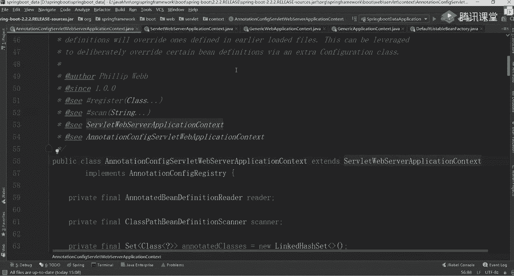

# 系列 5：P66：66、springboot启动源码解析二 - 马士兵学堂 - BV1E34y1w773

🎼这世界有很多爱你。🎼And那。🎼温柔啊。🎼别想他。😔，🎼是否值得你这样牵挂？🎼就放手吧。🎼别想他，我也放下过就好何必要苦苦挣扎。😔，🎼就放手吧。🎼别想他。😔，🎼把所有一切都当做是一个笑话。😔。

🎼你害が大吗？🎼是不是还留断头发？😔，Oh。🎼特别。🎼爱着爱情的童话。😔，🎼你害怕的。🎼我还记得。🎼最分手那天风很大。😔，🎼但再想不起。😔，🎼那时候。🎼的花。🎼若不是你的人闯去我生活。

我怎会把死守的寂寞放任。😔，🎼爱我的话，你都说，爱我的事你不做。😔。

う。🎼可是我。🎼一个距。🎼窗外的。🎼的风。🎼别的爱。🎼た。🎼就是在。🎼因为最。🎼你会。🎼我笑了你。🎼回到熟人眼前，回忆就在眼前，你戴着帽子而我样子，戴着腼腆，不可第一次的见面你说你有衔见，我的鲜贴。

必须难过，我能有偏见，都到着天真。🎼挂肩前轮。🎼不想成你的人。😔，🎼能力别人不是为了赚了有钱绊，我为我的成唱，希望我写的歌里面有更好的和想章谢。😔，🎼别二起。🎼说这些里。🎼你爱我。🎼第一次发长面就一骂。

大是从此在大场面，我不在站旁边我是真的感且佩服你的眼界，怎么想到和一直在度刺痛的完结。😊，🎼我只看着你一起慢慢头发，欲望巨差，惩罚价值慢慢，反岔发的失望让我。😊，🎼的心。🎼可是我。🎼终于来。🎼いな？

🎼一个去。🎼窗外不。🎼别的爱。🎼我的天。🎼お。🎼大这。🎼微笑。🎼あな？🎼谢谢你。🎼你还记。🎼说是谁。🎼Yeah害。🎼年对。🎼你说我是个商品，没有你们就不可以。这些扭曲的真理差点毁掉我的自信。

如今的我已觉醒，如今我不再哭泣，再不怕坚持自己做你没做对的决定，你知道吗？这一片。😊，🎼别操作这情人。🎼天空白的。🎼总会慢慢长，哪怕却我没法拥。😊，🎼你结话的傻瓜。🎼愛た。🎼一个圈。🎼We也。🎼问题。

🎼的挣扎。🎼我们都。🎼愛到い。🎼多少年你，多少遍离。🎼多少挫局，多少甜你。🎼太过去喝就不再介意，完真的靠心里把从的伤了却都忘记。🎼我心春了全部回忆。🎼可能觉得是你。🎼希望你偶尔也会相信。

就让我真心真意把歌唱望重新开始。🎼你还记得。🎼说出心。🎼你还来。🎼。🎼偏偏停嘱夜有。😔，🎼午夜星辰似奔走之有。😔，🎼爱你每个结痂伤口，酿成的陈年烈酒。😔，🎼入喉尚算可口。😔，🎼怎么泪水还偶尔失收？😔。

🎼要你是个心中缺口。🎼梦中留存。🎼温柔。🎼此时已莺为草场爱的人正在路上，我知道风雨兼程不今日暮。🎼不上。🎼一个人。🎼只为与你相拥。😔，🎼皓月当空，爱的人手捧星光，我知他乘风破浪去了黑暗一趟。

🎼总伸手给你救赎热。🎼还要你感受，让星光加了一点彩虹。🎼像樱花偷偷吻你耳。🎼让世界美好。🎼与你环环巷扣。😔，🎼此时已莺飞草长来的人正在路上。🎼着大鹏雨兼程的情人。🎼不常。🎼穿越人。🎼只为与你相拥。😔。

🎼这个。🎼皓月当空来流人手捧星光，我知他乘风破浪去了黑暗一趟。🎼同身手。🎼给你救赎肉。🎼此时已莺起早上来的人正在路上，我知道风雨兼程途经。🎼不上。🎼长绵人。🎼只为与你相拥。😔。

🎼此刻以皓月当空来的人手捧星光，我知他乘风破浪去了黑暗隐藏。🎼感同身受。🎼给你救赎了。🎼知道你不能还要你感受，让星光加了一点彩虹。😔，🎼当樱花开得纷纷扬扬，当世间美好。😔，🎼与你缓缓相。😔，可。

🎼Yeah。

🎼沿着路灯，一个人。😔。

🎼走回家。😔，🎼的老朋友。😔。

🎼电花。🎼你那里天气好吗？😔，🎼有什么新闻可以当做笑话？😔，🎼回忆与我都不爱。😔，🎼说话。🎼偶尔我会。😔，🎼心里有一些牵挂。😔，🎼有些爱却不得。🎼的暗天。🎼在夜深人静的时候。😔，🎼想起他。😔。

🎼送的那些花。🎼还说过一些私心。😔，🎼裂飞的情。🎼赌一把幸福的。😊，🎼筹码在人来人。🎼的街头。🎼想起。🎼他现在。🎼可我没有能。😔，🎼对你想要的回答，可是你一定要。😔，🎼幸福啊。好，同学们能听到我声音吗？

能听到话来扣个一。🤧我准备上课了。呃，今天讲什么讲s文bo的源码。放下孙叔的羊马。大家想听原马课吗？😀呵呵。😊，这个原码课啊听起来确实是比较无聊的啊，不太行。呃，原码课听起来确实比较无聊。

然后上次我讲课的时候，很多同学可能已经听懵了啊，可能已经听懵了呃，然后呢就是不知道你下课之后自己有没有啊，虽然痛但是爽呃，这个过程啊，你必须要经历。等你完完整整的把一个项目的原码如果呃听完了啊。

听完了之后然后的话你再看新原码的时候，你会有一种非常舒服的感觉。最主要就找那种感觉，有种感觉之后，你学习会变得非常顺利啊，反正原码啊之后怎么着都是要听的啊，或者怎么着都是要自己看的。你不看的话。

面试不知到怎么办，很麻烦，好吧。😊，呃，前两天的课原码课没听，今天能听懂吗？呃，估计有点够呛啊，估计有点够呛。呃，但你可以先过一遍，先听一听，先听一听呃，什么时候讲网约车。

等咱们所谓bo的原码讲完之后呃，来讲网页车项目，好，讲网约车项目啊，呃不用担心。微服务熔断没听完空难不。这块没关系啊，这个跟V服熔断那块没没有关系。我们就看一下它里面的一些实现机制。

其实像sringbo源码在问的时候啊，可能自动装配问的比较多。所以我现在在考虑说这个源码大概讲到哪哪一个层次呃，这样没想好。那最起码我们这个启动过程是要讲完的，讲完启动过程之后。

第二个就是讲一下我们对应自动装配的一个原理啊。第三个我准备讲一下我们那个star它这个整体的启动过程啊，因为我们知道每次你再搭建一ring呃 boot项目的时候，有些web这这些东西，star讲一下呃。

其他的一些细点，比如说s boot一些环境方面的东西，对吧？呃，再比如说。😊，像后面的一些自定义的东西，我们这儿就不讲了，或者第一期暂时先不讲了，我怕讲完之后很多同学就懵了。

所以我们这儿呢先讲讲一些简单的，或者说面试中经常被问到的，好吧。😊，好了，别的废话，我们这就不多说了啊，周末的人比较少啊。😊，什么时候讲完四五节课就讲完了。好吧，大概还有四节课左右吧。😊。

🤧如果跟不上的话，可以先不跟。好吧，先看那些基础东西OK。好了，来看我这个项目啊，我们还是一样先回顾一下上节课我们大概讲点什么东西。我说了，每次我们的springbo项目在启动的时候。

必须要指定我们这个run方法。然后你往里边依次进行点击的时候，你发现了它创建了一个spring application的一个对象，在这个对象里面大还记得做什么事吗？应该还有印象吧。

首先它创建了一些资源的一些管理器，但这个只是空的。第二指定了我们这个程序启动的主类是谁？叫primary source。第三个指定了我们当前应用程序，它是什么样一个类型。第四个往里边设置了一堆的什么？

是不是初始化器和我们这样的一些监听器。这些监听器和初始化器这些文件是不是在一个叫springfactor文件里面，大家应该有指有有印象吧？是在账包里面，当时我跟你们说了，我说只有两个账里面包含这个文件。

其它账号是没有的哪两个你再看一下找一下我们的spring第一个在spring里面有一堆的配置吧，这是第一个文件。第二个。😊，有auware在这里面也有一个ring这两个文件就会进行自动一个加加载。

而且它加载完之后，因为后续的源码里面会不停的从这个文件里面取对应的一个类好取对应一类文件。所以这希望大家注意一件事，注意什么事呢？它首先加载过来之后会把文件里面的全部顺序啊，全部顺序。

然后直接读取到我们的全部内容都一都堆到我们的缓存里面，以后再取的时候，就会直接从我们的缓存里面进行一个获取。懂我意思吧？好，所以这块大家注意了。

刚刚那个换换线说账包里面也有我们这说的是什么是spring里面东西啊，sp码你们之前已经讲过了，我这不再重复了，懂我意思吧ring只有两个里面有spring肯定要依赖我们的sp嘛，懂我意思吧？

O这块稍微注意下行了。😊。

就这些东西。然后呢，最后面一个找到我们当前这个应用程序，它所执行的一个主函数好，找找这是主函数，它是有一个对对战的一个路径嘛，依次往上找能找到我们对应一个主函数。就是当前这个类在创建对象的时候。

它所做的一些事情好，所做的一些事情。大家执行完成之后还要干嘛，是不是该进行整体的一个启动环节了。我们上节课也大概有讲到这个启动环节了。大家想一下。这个启动环节前期他做哪些准备工作？

第一个设置了一个stopport的一个对象，这对象里面非常简单，就给了一个名称，给了一个时间。记录一下我当前程序启动了多长时间。这是第一个第二个右建了一个上下文的一个对象。当然此时对象还是空的啊。

此时对象还是空的之后才会给它进行一个创建。第三步，我们定义了一个异常的报告器，它是一个rease，第四个配置一个什么叫javaW这样的一个属性，把加我们的系统属性里面去了。

又一个是加载了一些监听器的内容，对吧是一些监听器啊，监器我给你们说过了，首先我们会从那11个监听器里面来进行一个数据的获取，取完之后，并不是说所有东西都能进行适配的。它要干嘛？根据我们的事件来进行匹配。

刚开始你第一次刚进去的时候，这有个什么东西找一下是把我们这个呢都给获取到，当你获取到之后，第二步开始进行一个starting一点staring里面会出现一个对应的事件吧。

你点一下看看有什么东西叫plication starting第一次的时候会将这里面也是说我会从那些过滤器里面进行一个匹配，能匹配到当前事件处理的。😊，间监听器留下来，不能匹配的，直接过滤掉。

然后呢把那些监听器分别进行一个整体的处理环节。这是第一个我们讲的一个事件。后面的时候啊还有很多。然后这块我跟大家说了，我们在取的时候，是不是有这样一个这样一个数这样一个对象值。

这样对象值是在当前这个类进行呃初始化的时候，或者创入对象的时候，这里面进行了一些复制操作，这东西啊之前已经带你们看过了，好吧，是反过头来带你们直接看的所以这块要留一个印象。然后当这些间定器都启动好之后。

下一步骤是干嘛了，是不是解析我们对应的一个参数值，而当前的参数值是从哪来的，是从我们的命令行来的了，应该还记得解析了我们命令行的一个参数，然后带你们看了，是以杠杠开头K等于V这样的一个方式来指定的。

它后面会有一系列的一个匹配过程，匹配到之后，直接把它带到我们的呃那个。😊，这个配置配置参数里面来参数里面来，这是我们上节课讲的东西。然后这节课我们讲什么？主要讲一下我们当前这个环境好吧。

也就说我们spring程序想运行的时候，它是需要依托于环境的，叫converable吧，是是叫配置环境因为我们都知道啊，你虽然可以从我们的或者说plication里面读取我们的配置参数。

除此之外啊除此之外，在很多的类的上面其实你定义的一些注解吧。那些注解里面是不是也包含了部分的一个参数块一定要总结到我们对应一个什么环境里面去，所以这主要是准备环境。还记得吧？那从这开始进行一个讲解了。

这个方法，上节课大概带你们看了一下可能因为下课的原因吧，可能时间比较长原因可能同听到就已经蒙了我们今天把这个东西重重新重复讲一下来到这个环节为止，上面东西还有点印象，或者能记个大概的同学一。😊，好了。

都没问题啊。没问题的话，我们来开始执行程序。记住我说过了，每次运习的时候，第bu个来进行执行，嗯，错了。😊，这会进行一个跳转啊，往下走走走走走。说到这步骤了，好吧。

到了之后F7进到我们当前这个环境里面来，进到里面去之后，你能看到很多相关的一个呃语句啊，看下语句干嘛呢？你通过名字，你能做一个判断。第一个叫get or create environment。

先创建一个环境对象，这是第一步骤。第二步骤是进行一个合理的配置吧。第三个叫attach很同学看到tuch之后蒙了，然这个什么意思？你把它理解为什么贴上，就是说它会往这个环境里面再加载一些对应的属性值。

第四个是进行一些节身器的一些启动准备工作吧。第五个把我们当前这个环境绑定到我们的 applicationlic里面去，第六个做一个类型的一个判断，环境变量，对环境对象是否是符合我们的类型的。

不符合再进行一个转换。第七步也是往里边加一些其他属性，因此而已。听了吧。我们挨个来看一下，第一个叫创建或者说获取一个环境。大家想一下，到目前为止，我们在之前的操作里面有做过任何跟环境相关的事情嘛。

没有吧。所以此时你在进去之后。😊，这是什么？是不是一定是我们要进行一个创建工作，而不是一个获取工作。自点去看一下刚开始Ement是不是等于空，等于空的话不走这儿。然后这个位进行什么？

根据我们当前应用程序的一个类型来做一个判断，这说了什么类型？😊，叫slate吧，是不是叫solate。因为之前说过了，有三种种类型，一个是n，一个servlate，一个是reactive三种式的东西。

之前它会根据一些参数进行一个判断啊，进行一个判断。为什么要 touchuch两次，你看一会儿我要会回来再说啊，回来再说，一会再讲讲这个东西啊，回来再说。😊，来我来看这是一个servate的东西。

所以呢往下走的时候，往下走走，是不是匹配到这了，叫standard server environment吧。这个方法我希望大家能够注意一下，非常关键。为什么它这儿实际上是创建了一个对象。

而在我们当前这个对象里面，对象里面，你们可以看一下它的一个类的一个结构图啊。😊，收大家过认，看到这个层次依赖关系了吗？它的上面是谁叫stand environment。

stand environment上面是谁叫abstract environment。为什么要带大家看这样的一个依赖关系图啊？上面这个接口不用看啊，接口不用看啊，先放一边。

我们主要看它对应类的一个继承关系。因为当你创建完成当前对象之后，它默认情况下需要做一些准备工作的，什么工作来回来我们看一下。😊。

如果按我刚刚的说法的话，点赞儿。😡，点它点它之后，是不是找到了构造方法，你看一下当前这方法里面有购造方法吗？😡，有没有这考方法没有吧没有老师，那我就单单创建这样对象就行了嘛？很简单嘛？不对。

你这样看样板的时候，很容易漏到一些关键的属性值。为什么？我说了它有一个继承关系，在子类创建我们对象的时候，负类对象是不是也要进行一个创建。所以此时你要往上翻，听白我意思吧？一定要往上翻。

你看一下副类里面大概做了什么样的一个事情，大家做什么样一个事情，往上走点负类负类时候，你看一下当前这个负类里面有对应的各个方法吗？是不是也没有没有的话，再往负类里面找，它是一个什么类叫抽象类吧。

虽然是抽象类，但是当前抽象类里面，它有一个什么是不是也有一个对应的各个方法，各个方法里面它掉了一个什么，是不是这样的一个方法值，所以你发现了当你的子类对象在创建的时候，它依然是不是也会掉这个方法。

而这个方法里面做了很多的事情，做很多事情，我们这可以点一下看看点它点完之后，这是不是一空实线。空实线的话一定要找什么，是不是找具体子类的一个实现了。刚刚我们看。😊，什么叫standard server。

然后呢environment点它这里有两个选哪个下面这个吧，点下面这个点完之后，这儿告诉你一个道理，或者说这告诉你一个信息。

叫property source点ad last点ad last这个property source是什么东西啊？😊，你猜一下应该知道吧，它这边就是一个放置我们属性资源的一个对象，或者是一个集合。

点家看一下是不是传过来一个这样一个呃不可变的一个集合对象。有了它之后，往里边叫ad last，往里面边最后进行添加嘛。

加的时候new了一个什么叫STO B propertyperty source这个per source，这是一个对象，这无所谓，关键是看后面的参数值，哪个地方叫s late configper。😊，好。

init啥意思？是serv里面配置的一些初始化参数值，这是第一个。第二个再点一下，这什么叫serv lake contextt，一个是confi，一个是cont。

如果你对你的serv lake印象还比较深的话，这是serv里面两个非常非常重要的对象吧，或者会是之前的时候，如果serv的话，会从我们的外边上班里面是读取一些参数配置。😊，好，这样的话。

是不是把这个参数值也帮你给加载过来，是不是完成这样一个基本工作。所以前面做这样一件事儿，这要记住了好，这要记住了，一定要记住它。这做完之后没完啊，没完，还要做什么事。

下面这儿还有一个叫JNDIJNDI东西啊，你们一般用不到，所以不用管它好，往上看这儿有一个super点什么东西一键看到super的，一定要掉负类的，你点一下负类，下面有什么东西。😊。

是不是跟刚刚的代码一模一样，直播现在变成什么了？变成了叫property点什么东西？ssem in environment表什么东西？你点开这两个产量值。

你看到了谁是不是表示我们的系统属性是不是系统属性，对吧？你再点下面这个叫什么，是不是也是我们的系统环境。😊，看明这意思吗？所以大家能看到，刚刚我们完成那个操作之后。

实际上它是往我们的property source里面加载了4个默认的一个配置资源。啊，你想一下，你要想运行你的应用程序。当时我们在那个。😊，JDK刚刚讲deva的时候，老师让给你配环境变量。

环境变量里面是不是指定了很多的一个路径，像那些路径是不是都属于我们当前的一个系统环境了？所以那些系统环境的参数值它都会被加载进来。一会儿我们可以看一下，听白意思吧？

所以一定要看一下当前类这里面的一个继承关系。你比要说老师我就你有一个对象就完事了，那样看的话是不完整的。我说了，你会丢掉很多关键的一些属性值，所以这块是不是直接创建了，往下走了啊。

那个东西不带你们看了啊，不带你们看了，直接往回走。😊，收到了？这个时候是不是已经得到一个最基本的环境对象了，对吧？来看一下这个环境吧。

来拉一下environment找到我们的property source吧，是不是有4个，分别是serv late confi in paramal然servlate contest in para systemem systemem properties。

然后呢system environment。😊，能看到四个属形值了吗？现在是不是应该知道说哦，原来四个属性值是通过这样的方式给加来进来的。来这个点听白同学扣个一。😊，能看懂吧。😡，嗯。就是我们之后啊。

在不管在配置文件里面也好，还是在那些呃系统变量里面和也好，配置的这些值都会降到里面去。这个时候你可以看一个东西啊，叫environment systemy environmentment。

点开我们的source，你往上看这些属性值。😊，能看这东西吗？他有没有把这些东西加加载过来，是不是指定好一些路径啊。再比如说你点开上面这个叫system properties，点开你看这东西了吗？

java点呃VM version等于谁好吧，java呃javaVM什么东西，然后一堆参数看见参数了吗？😊，能看到吧，是不是能看到具体一些相关信息。所以这些信息都已经被我们给加载进来了。

如果之后的程序里面我需要用的话，是不是拿过来之后直接用就行了？懂我意思了吧？所以这块你能看到很多相关的一些参数值的，它不是说我白加载的一定是存在具体的一个意义的那上面这块东西吗？没有吧。

因为现在你还没往里边处理任何东西，以现在还没有任何的艺属性。但之后我们会往里边加载很多的一些其他属性值，这是第一步骤，先创建当前的一个环境，环境完了之后。

第二步该往当前这个环境里面进行相关参数的一个具体值的配置了吧。那这个配置其实也非常简单啊，也非常简单，你可以点一下这个参数值这方案里面去是不在这儿在这儿的时候，这儿需要大家注意一件事。

我们都知道在写ring这些程序的时候，它里面其实包含了很多转化的一些类吧。比如说转对吧？再比如说date日期转字符串字符转日期，是不是涉到很多相关的一些转化工作，而那些。😊。

转化工作最终会在这个步骤里面完成。当然啊呃这个东西啊是根据你不同那个存播的版本不一样而决定的。呃，在老期子里里面，版本里面是没有这个东西的，这是新加的。因为我讲的是2。2。2，最新的版本，听白意思吧？

这句块看做什么事？第一个谁属性指是处，所以肯定能进去，进去之后我们这来做一个判断。😊，往下走啊，注意判断。

他说了叫opplication conversion service点get shared instance，这get shared instance干嘛的？😊，不知道吧，好吧。

你们有没有印象有之前好像似曾相识过这样一个东西啊。😡，叫share的什么东西？😡，没有没有算了没有算了没有算法没没有没关系，好吧，没有的话，我们接着往里边进行点击。点完之后，这里面告诉你了。

说是一个share instance的一个值吧。这是不是有定义了这样一个属性，你往下走，刚开始这个属性值有值吗？没有吧，是不是空的，空了之后，它往里边一直往里边走走，现在还是空的啊。

一直往里边空到这块的时候，你看一下这做件什么事，是不是又开始创建我们当前这个对象了，来点进去走。😊，走在这里面做个什么事。看这块了吧？我们挨着往上看吧，挨个往上看，来走第一值等于空吗？等于空嘛。

是不跳下面这块，这有个config，你点到这个config方法里面去，第一个叫default conversion service点at default converters converters熟不熟？

什么叫converers？😊，啊，见过吧，之前是不是也自定义过一些对应的一些转化器，你自定义过实现过吗？😡，哎，还记得东西吗？double check clock不要管这个锁的事好吧。

你先理大概的一个思路，行吗？先别管连个锁的事，你先理一个大概思路，你先把这个流程给捋捋清楚了，是不是叫转化器，这个时候你可以往里边进行一个点击，走看里面做什么事。第一个叫ad什么什么东西。

点进去看里面做什么叫number to number convert然后呢，str to number objectject to string string to差 a character objectject to string然后number to a character一堆一堆看到西了吗？

这是不是我们之前看到一些相应的一些转化器东西了。😊，能看到了吗？是不是相当于在我们配置环境的时候，他已经把这些对象直接帮我们给注册进去了。这样能看懂吧？好，能看懂，我直接往上跳了啊，一行要走。😡。

这里面就是一些对象，这没啥，好吧，就些对象的一些处理过程，这个很简单，没啥，没啥可看的啊，往上走走走走。😊，东西很多啊，点进去。完之后第二个什么呢？

叫ad connections convert是集合的一些转化器的，你点进去一样的array to collection collection to array array to array然后呢col collection map to map是一堆转化器也是一样的啊一样的都完搞完之后下面还有别的什么呢？

叫 string to time to time呃time ID to time to什么什么一堆东西是不还是一堆转化器，因这里面定义了N多个的一个实体的对象，这没问题吧。这第一步要做的事情。

第二步叫什么呢？叫ad default for什么。😊，啥玩意儿格式化器吧，是不是格式化器，然后点进去依然看一下。

是不是可以加一个叫number format education format factory，什么东西，对吧？我这不不往里边点了，不往里边点了，你挨个往下走，是不是这做一个判断，判断完了之后。

这有一个叫datatime format register，对吧？后面还有一堆的一些逻辑判断，有个date format register，是不是有很多这样的一个格式化器了，就要转换完就完事了。

再来来看第三个叫at application format，把刚刚那个转化器是不是加进来，点进去。😊。

叫叉 array format address formatO of set format是不是列值再往边 string to to string number to好吧，以这大家看到了。

这里面包含了很多具体的一个我们这不用管。但我知道了整体上来说这块一共完成了一件什把我们很多的一些转换器格式化器对象都已经提前创建好创建好之后加载到我们当前这个con service了。

而这个version service最终是不是还要给到我们的ronment里所以它有一个层次递进的一个关系O来往下这时对象。

这个值是不是已经有值了后把个值回去回去之后叫ronment conversion service是把它加载到我们当前这个ment里加之后你可以看一下bug里面的一些值来找一下我们的vironment找完之后找一下刚看到着？

😊。

哥大啊。Environment。哎，哪去了？看这conver service吧，点完之后这儿有一个converers点进去。😊，conver连续多少个。多少个？一共134个吧。

这是不是意味着把我们所有这些转化器的这些工作是不是都已经加到里面去了。那这块之后在做的时候，还用我们操心吗？不用们，你在写代码的时候，他是不是有些情况下自动也会帮我们进行转化。

如果说它转换那种格式不太符合我们需求的话，我自己是不是也可以进行自定义。自定的时候，它也会进行整体的一个装载工作，加载工作也能够进行一个生效，就这块东西。所以这样啊都比较简单，来。

到到为止能听明白同学扣个一。😊，你最起码要知道说他这一步骤做什么事儿，做什么事儿，你平常用的时候看起来好像很舒服的样子，好后没不知道什么是做的。但其实在初始化的时候，或者在创建这个应用程序的时候。

他已经把这些基本工作都帮我们做好了。做完了之后往下看下面两个东西就非常非常关键了。第一个叫配置property source。第二呢叫配置pros。这个profis到底指的是啥呀？

proper source不用说了吧。😊，就我们参数的一些属性值，对不对？这proper值是啥呀？😡，有人知道吗？对spring你想一下，你在配置的时候是不是指定过多个环境。比如说有生产环境。

有测试环境，有各种各样环境，它指定一个属性叫spring点pro点active。你可以指定说我可以在多环境里面进行直接的一个切换，就是多个多个配置这块就这样一个意思来挨往里边看挨往里看好吧。

先看第一个叫config这里面做事情也比较简单，刚刚我们看到了，在我们当前这个ment里面，它所谓的pro一共有4个值，对不对？

是不是拥有4个把它4个参数直后记住 config呃 contest systems properties system把它四个值直播记住。因为这现在它要往里边加东西了，加东西了，来点一下往下走。

这时候告诉你，这是一个里面一共包含4个属性值这没吗？有吧。😊，看看看第八个里面参数值吧。点下去，这有一个sce，是不是4个，还是刚刚那四个，这个没没有变化。然这儿会做一个判断，判断的时候会干嘛？

它会往里边重新创建一个叫default properties的东西，就默认的一些参数值的配置啊，默认参数值的配置会往面加这样一个属性。但大家都知道我们现在里面包含这样一个值吗？包吗？不包吧？

所以这第一个步是什么？叫不等于空，并且什么不等于 empty的时候会进去连进去能进去吗？进不去吧，进不去没关系，往下走这this点 command大于我们这有参数吗？参数吧。

参数会跨过去参数会跨过去大家看到了这个里面好像没做什么吧？我做完这个步骤之后，它依然还是我们四个参数属性值但你要知道它后续的时候为刚刚在这个方法里面。

它指定了一个de虽然现在没有之后是不是也一定会往里边进行一个具体的添加工作，只不过在这步里面没有进行一个完成工作，那后面肯定会完成嘛，现就这样一个悬念，看一下它什么时候做这件事情呢好吧，第步干嘛叫。

是不这里面你能看到很多你认东西来看第一个你一个现在集合吧这个值现在是空的，现在是空的集合进行一个重操作这。😊，第二种往下走叫inronment的get active profile。你想一下。

我们现在我们现在有指定任何配置文件吗？没有吧，大家可以看一下我这个配置文件啊，几乎都没写，找一下我们的这一面有写东西吗？😊，没有吧，是没有哈，没有没关系，我们往里边走一下。

点进去叫getdo get X profile吧。然后再往里边点，到了之后，你看下这个属性值。😊，呃，不是不是。是这个东西。看这个名字你瞅不瞅？😡。

叫spring点perfuse点active看这名字了吗？这名字熟吧。是不是有感觉了哦，原来是读取我们当前这样的一个参数值，这东西你在生产环境里面肯定会用的，一定是多环境的配置，测试环境了，开发环境了。

对吧？包括那个上线上环境肯定肯定有这样的配置啊，这一定是有的，所以回跃之后，这里面就干嘛做这样一个参数值的一个判断完之因我面都没有没直接返回就了。们没配，以是返回但你要知道它完成了这样的一个基本工作。

如果它有的话加回来，没有的话，那这个值还是空了，是不是还是空的，什么都没有大家看干嘛，把我们刚刚设置好的这个活跃文件加载到我们当前这个ment里面来。😊，是不是加进来了？

当然这个ID profile是什么？空的嘛？我说了，我没指定任何值，所以这时候是空的。😊。

空空了吧无所谓啊，无所谓啊。回来这时候再往后走。大家看一下刚刚那步骤是完成了。所以这里面你看到了，它除了这里面其实做两件事。第一，加一个什么，或者判断一下有没有defa。

让那个pro样一个参数值第二个加一下叫就加两个东不加大家注意下行了，注意下。第三个叫configurationcon source点 attach很多刚了老师这一个at面是不是还有一个att你看完这块的一个逻辑后。

你就知道为什么这里面要包含这样一个参数值了，其实非常简单都是把什么加进去，中间只不过经这样环节做一个转换器，他怕你转换过程中里面丢失了，所以后面重新加了一次仅此而啊，试一下吧。

击看下什事第一个是断言不管它吧第二个往下走是不是获取到我们当前这proper source这里面还有几个个吧看一下是不还是4个没任何变化，没。😊。

然后呢往里边点，这儿有s点ge。😊，看那儿看上了吗？是不是叫configuration purpose。我们现在这里面有这个configuration purpose吗？😊，有没有没有了？

所以下面要做一个判断了。如果它不等于空方法怎么做？如果等于空的话怎么做？是不是我们要看一下什么，看一下这个等于空的时候，他做什么事，对不对？在当前这个等于空的时候，它跳到里面去，还是往s里面加东西。

这里面加东西就非常非常关键了啊，非常非常关键了，为什么这么说为什么这么说，一会儿往里边看一下，你知道大概是什么样的一个意思了好，往里走一下啊。😊，来看一下，点一下这个F7走。

第一个创建一个呃是不是一个构造方法，这个造方法非常简单啊，不管它了。走走走。然后第二个看这个参数值是不是还是那 configurationration properties。

第二个叫new spring configuration properties source，点这个对象。😊，点完之后点速，点完速号之后，呃，这儿也是它是吧？看刚一个属性值是吧？这点还是放死。在这儿。

往里面看站出来这个值了，刚刚取过来一个属性值，是不是叫configurationproperpro完了之后，会把把它加到我们这个property source list的集合里面去。

所以这样可以完成这样的一个基本工作，往下走走，你走完之后，你再看一下当前这个值几个了，12345了吧，是不是相当于我加一个值，而且加那个值会放到整体的最上面吧。

叫configuration propertiesper。所以它现在你看到几个了，12345个吧，是不是包含5个参数了，这5个参数是什么时候加载的，你必须要知道。😊，刚才过程我已经带你看过了。

你必须要知道它到底什么时候加载的，听白我意思吧？好吧，做完之后来回来，是不是这步做完了，做完了吗？😡，知道这个函还是干嘛了吧？就是忙主判断一下，我有没有con是proper。如果有的话加进去呃。

没有的话就加进去，有的话就不管它了。懂我意思吧？就这块的一个基本工作好了，来，到这块到目前为止能听明白的同学扣个一。😊，谁让你记他了？😡，你记得干啥？😡，这个原码不是让你去记的啊。

你要说老师我把原文背下来，我也背不住。但是里面关键的某些步骤，你把它能说清楚就行了啊，这比较重要这比较重要。OK好了，这块判断完之后，下面又到这个环境叫thisers。

然呢第vironment prepared一看到这个方法好像有点似曾相识的感觉，有这种感觉吗？😡，有没有种感觉之前是不是也见过一个listers叫什么东西？

这不之前叫什么叫listers点starting嘛，是不是startings，现在换了吧，换了叫warpre呃prepa。就说我们环境准备，刚刚是应用程序的启动，现在是环境准备，往里边点自己回头写一个。

你写一个干嘛？😡，不要重复造轮子啊，没意义，好吧，点进去点完之后看这个环境了吗？是不是又该进行一个listerer了，你告诉我还记得这个listers是谁吗？😡，这真测之前还有印象吗？

我现在不带你看那个值。😡，有没有同学记得上节课讲的叫eventp，然后呢run listeners吧？

是吧记得这个东西来往里边看一下是不是这个值even publish listener是不是还是它整个我们这个程序启动的环节里面，唯一的只有这这只有这个对象。但这里面还包含很多其他的值好还包含什么？

我们之前说的那是1个鉴听器吧，然后再往里边进行点击走点进去之后又到这了吧，这个时候看到一个新的对象了。

原来叫application starting现在呢叫applicationpre event是不是相当于我多了这样一个对象值看到了吧。这块处理逻辑啊，调度同一方法。

基本上是一没法点这是创建我们那一个对象，你往里边看一下也没啥完走，是不是就记住一个时间这没啥值好，没啥值不用管它就创建这样一个对象，完之后往里边走，走这行是不是看到它了，点走走到这方法里面去。

到这之后又熟了吧，嘛呢？往下走走到这值。😊，空的空怎么办？这样有一个方法叫get application listeners。它是一样。

我要通过干嘛从那11个对应的一个参数里面值把它取出来符合我们规则的吧。什么规则叫applicationenvironment什么？😡，application environment。

然后呢prepared吧，还记了一个疑问的事件吧，把那个事件给我记住了，我那看看这是不是有个疑问，看那叫application environmentpre疑问，把这三种值给我记住。

然后进来之后往下走走走。😊，这有一个哪去了？这样吧是不是检检索我们对应里面信息值往下走listener，这有个判断，这是从缓存里面直接把这值给读取来把它读取出来。读完之后。

这有一个叫sports events吧。我们都知道刚刚这个s这个lister有多少个。😊，看下里那是多少个。list似点list的事有吗？多少个11个吧，是吧？还是11个，所以我还是一样。

要同是1一给你们做一个筛选了吧，来走。😡，第一个你不不不符合吧，好吧，走走第二个是不是进来了，进来正好往里边进行一个添加工作，叫struct不even什么的东西这还是一样。

最终要往里边进行一个整体添加工作。但是这儿我希望能带你们好好看一下，因为他这把这个鉴定事件加进去之后，并不是说我加就完事了，不是这样的，他还是要做一些最基本的一些工作的把最基本的一些工作的连系看一下吧。

这儿先先过滤吧，先过滤好吧，一个了啊，刚家看到了，这这是第一个。😊，第二个吧。啊这边哥走走走走走，你不要说了，一会儿看，我直接看结果就行了。😊，这就是一个循环工作。OK循环完了吧。

循环之后来看底下的一些参数。😊，找一下 listeners有几个1234567，是不是包含了一共有7个参数的一个值，是不是共7个对吧？记住记住这个参数值好吧。

记住参数值同时还有一个什么叫this点还往这里面也加了一份加值多少，是不是还是7个这只是一模一样的，还是这7个都没有什么变化。你把这个值记住行了。好吧。

知这里面放这样一个对象放完之后还是一样挨个往下走吧，这里面干嘛的获取并对象，然后获取不了往下走走走把它加进来，加完之后返回我们这个值一共有7个7个围了之后往回走走走这时返回7个返回7个之后。

这开始具体的一个执行工作了。这个步骤我们看的因为之前想一下，第一次我们看那个事件的时候，是不是一共有4个我不知道你们还记得没，当然是成4个事件。那4个呃是不是有4个er个里面是只做两件事。

第一个叫log system是不是日志系统的一个初始配置。😊。

还记得吗？第二个是什么？是配置了很多转换器、格式化器等等等等很多操作参数。还有另外两个是什么做作媒体。那这块在执行的时候依然是一模一样的。我们还是要挨个进行一个最基本判断。走，第一个叫什么？😊。

叫config fail application listeners，你一看这个名字就知道这两个东西一定是有用的啊，一定是有用的。为什么说一定是有用的呀？😡，老诉啊，这个有用吗？😡。

也用啊这块可能会往里边跟的比较深，跟的比较深。因为你看到这配置文件，我们最主要处理其实就是配置文件。这个地方可能会跟的比较深。我希望这块你能够好好听，好好听听这块东西啊，来往这边走，😊，对。

就它listers往后走点进去开始执行吧，点进去走走do invoke listeners点进去点完之后，这儿有一个lister on application event。

再点进去点完之后这时候做一个判断了，判断一下当前这个事件是不是application environment event是它吗？是吧？是的话就往里边走了，再点进去是不是整体的一个处理环节。

在这个处理环节的时候，这有东西叫什么叫load post processor，这都西干嘛的。😊，啊，是干嘛呢？叫pose process吧。😡，是我们在注spplay里面，你们见过这个东西吗？😡。

在我们注入并对象的时候，它相当于是不是一个构造函数一样这样的东西。那这块大家应该知道啊，在词里面经常见到这样这样这样单词，你就把它理解为一个处语类就行了，扩展处语类就行了啊，也没什么特别难的。

然后点点去到下面了吧，这有一个东西叫springfactor loader点load。😊，唉，点点点点错了啊，不管没关系，好家看点击方法做断了吧。😊，嗯。

到这方码叫spring factory loader loadfactor这个东西搜不熟？😡，是不是还要告诉你说，我要从我们刚开始那个spring点factories这个文件里面开始加载一些具体类名了。

加什么类名？这名称告诉你了叫event post processor。来点开我们那个配置文件，我说了啊，我都提前给大家给粘出来了啊，往下再往上翻。😡，找一下叫evenvent，找一下看这儿。

是不是叫environment post processor，你点这个地方，第一个叫cloudary什么呃cloud found found什么东西。第二呢，th application什么东西？

第三个system ENV property source environment postpro。第四个叫debug agent environment post processor。😊，之前几个值。

一共。😡，我有有几个是不是一共包含4个具体的一个值，所以我这儿加载回来之后，是不是4个一定是吧，来往下走。啊，这这这这这已经过去了啊，过去之后我们看一下这个值吧，刚刚点快了，过去了，包子抛在这。

怎么5个啊。😊。

下面还有吗？看下下面还有没有了。别玩我们的pospo。没有了。没事，应该四个怎么5个呀，看这五这是啥啊，第一个这有第二个、第三个、第四个看这儿，这加了什么东西。看这加个什么东西，叫艾 at this吧。

是把自己本身也加进去了，所以是不是一共5个对着呢对着没没说错啊，是不是有共5个用过之后这 compare short是把它进行一个排序操作，当你排完序之后，这你要注意了，注意什么事。

在这里面开始进行一个for循环操作，而这个for循环操作里面叫post是不是开始往里面加这个东西了，好吧，挨个来变一下试试。第一个先取出来叫什么叫sstem是不是先读取来是这样一个重性值。

这里面它做一个什么事，你可以往里面点一下一个get environment告诉你了，是这这不管第二个数是get这就是我们当天一个主动一个程序。😊，来看一下英文配程程程程序啊。

找一下找一下这even问是这个英问的。唉，到了没有啊？没看到啊。点个单看一下吧。even问他get spring。

看看是不是我们之前说的spring datasring data application包含了我们当前这个类啊，这类是不变的啊，就是我们的一个主类主启动类，然后再往里边进行点击。

叫post process，这里面就很关键了。点一下这个参数什么值。😊，叫system environment吧，还记得我们之前那个source properties里面是不是有加两一样东西。

就现在我先把它给获取到，获取到完了之后，第二步叫environmentge process叫get，通过这个名字把它拿过来，拿完之后等于空吗？不等于空吗？不等于空。这做了整体的一个替换工作。

叫replace property source，点击看一下。😊，干嘛呢？把这些值取出来，取完之后放到一个mac结构里面，放完之后，他把刚刚那个配置参数值是不是转成什么了？

叫origin aware的stem environment property source这就做这样这样一个对换对象转换，其他操作都没做。

我到现在我也没猜测到说他为什么要把这个对象给转换成这样我不知道好，我只知道说它里面做这样事，但是我没猜到它为什么要这样干你懂我意思吧？好吧，反正不管你记住一件事，它这个操作非常简单。

就是把我们刚刚那个呃系统参数的一个值sstem是不是做了一个对象转换除了这对象转之后转换之外，其他东西都没做懂我意思吧？好，这是第一个我们要做一个事。来这块听明白同学扣个一。😡，你听我说啥吧。😡。

就是我们在读取参数的时候，有一个sstem environment这样一个对象，但那个对象拿过来之后，好吧，他在里面做一件事儿，把那个对象转成另外一个类型。但现在我也没猜到他为什么要把它转成这个类型。

还不知道如果谁有那个研究过的话，跟我说一下，我没猜到为什么这么干你懂我意思吧？好吧，没关系，来自接着往下看其他的拿循环循环。第二个叫什么叫spring application jason是什么东西。

你一看到spring jason的话是干嘛的。😊，肯定是要处理我们对应些站线数据了吧，点一下走这都不用管它啊，点进去到这块了吧。这里面你看到这样一个操作，点一下这个波包的操作于谁？😊，看一下。

是不是configuration source里面是不是传了这样一些参数值好吧？这值啊很多了，我们点看一下吧，叫property source是不是一共有对应的5个值，是不是有5个值，就这5个值。

这5个值拿过来之后，它变成一个什么是不是一个集合对象有后点是JK1。8之后，它保留出来一个流处理或者说函数成吧？songe什么 filterter过滤器吧，然后放找到第一个，然后判断一下这个值。

然后priceson是不是能处理我们对应的一个son一个对象了。😊，是这意思吧？好，它能处理整体的一个战对象，你往这里面做一下。😊，你点完之后，你发现了又了一个什么。😡，看这块儿。

是不是你了一个东西叫jason propertyty source啊，你点进去是不是就加了这样一个值，叫applicationation，叫jason嘛，这三个值说吗？😊，之前有人见过吗？😡。

来见过同学扣个一，有没有人见过？是不是就有他说哎，这东西见过吗？没见过。😡，这个参数值你们都没设过是吧？😡，就是说允许我们对应的一个参数值，它以jason的格式啊，进行一个呃数据传入啊。

就这个意思没别的东西啊。啊正就是jajason，如果没见过没关系，但你要知道说他这里面做了这样一个基本操作。😡，你把这基本操度操作给记住了，是吧？记完之后往回返，我不看它了，那我就不看它了。😊。

这接着往下处理吧，往下处理走走走做完了吧，是不是第二个过虑做完了，做完之后就相当于说我这只是说允许了一个真场的一个基本操作。别的东西没有了。来再往家看该第三个吧，往下走走，第三个是谁？

叫cloud放 found什么东西一看到cloud肯定是云下面的一些东西啊，我们这里面有涉及到云上面东西吗？没有吧。所以你方这个点之后，你会发现它里面好像什么事都没做一样，点进去，这是有一服判案走。😊。

有做任何事吗？没做没做就不管它好，这是第三个事件了。来看大家看第四个事件叫confi fail application。你看到这个值，很同学应该知道了哦，原来这看到它了吧，这里面做的事情就比较多了。

做什么事，就比如说很多老师老师我们在读取配置文件的时候，可以是application点 properties也可以是什么叫M点 properties了。那东西我怎么看的？我怎么知道它有这样一个东西的。

从这儿你就能看到，你就能看到我们来看一下吧，好不好？😊，来点下试试吧。第一个获角当前环境，不管它，第二个还是application，不管它点第三个。

然后呢再点这块叫application点get resource loader，它是不是就获取了一个resourceult loader的一个值，对吧？点一下试试吧，看一下这个返回一个值值是空的。

不管它。第四个叫ad property source，该加载我们proper这些 source资源了吧。然后往里边点点完之后。

第一个叫random value property source点ad to environment，这干嘛了。😊，re value随机值吧，你想一下之前你在你的配置参数里面有没有见过随机值这样的东西。

应该见过吧。😡，大家见过吗？就这样就这样这样写法，我们有没写过，我来写我随便写一个，就这个就这块东西，是不是到了pro加一个run点。😊，是不是int对吧？是不是还有浪是不是这样类型值上一个见过了。

对吧？O这块就注意啊，就它里面加这样一个属性值，仅此而已。所以这块你不用管它这边加完之后，我们可以往回看，看里面做了什么什么处理啊，点进去点完之后这有一个ment吧完之后这一个ad after。

然后这有一个参数的一个系统值，是不是叫sment当前系统的一个环境，加完之后，第三个叫newrandom value property source，random source name是redom。

告诉你说你可以redom进行一个开头，下面告诉你了，这是一个前缀是redom点，后面呢这里面提供了很多的一个哪去了。😊。

没在这儿啊，是不是get nice in什么range这些值，反正都是返回我们这样乱转那么一个值啊，来慢走一下试试吧，点一下，这是获取到我们的property source。😊，听到。

那再往下走ad up是不是往里边进行一个调用，是uper往里边点this都是往里边一直往里边加加东西就行了，这好不用看它了，最重要会会会。然后呢往这边走到这儿吧，叫艾 after吧。

是不是开始往里面加我们这东西了，叫ad at index是一，然后property source，是不是把我们这个值给它给加进去，是不是给它加进去，加进去之后。

意味着你当前环境里面已经允许允许我们出现random这样的东西了。这个东西怎么看也非常简单，点开我们的debug。😊，点开我们debug，debug之后往里边找，找荧光问。

找property source，看它有没有多一个东西。多了吗？说个啥？是多了一个run怎吗？这样东西。😡，啊，看这儿最后一个专代膜刚刚第一行执行完之后，是不是就是专弹膜之前是不是没见过这东西。

之前一直说是5个嘛，现在是不是6个了？😡，对吧，所以这块儿你能看到具体的一个职业情况。这做完之后没完，这东西还是比较简单的，ra道什么？我可能在工作中可能压根不用它。

因为我没有那么多的一个随机值的一些情况，下面这行代码就非常非常重要了，叫newloader点loader。😊，这个你有lologgo是干嘛的呀？😡，就是用来读取我们之前说那些配置文件的东西。

来点一下试试。new loader往走啊，这里面开始开始开始操作了啊，比较关心了。就第一个哎这是对对象啊，穿理完第一个enment等ment还是我们的标准serv一个环境。

不管它第二个叫new呃proper，然后呢s这不用管它走走到这块之后，这有个东西叫load factories这种西应该比较熟吧，是不是又看到这句话了，之前已经不止一次，是不是见到过这句话了。

就是用来配置匹配什么？匹配我们spring点factor里面的文件，这类面叫什么？叫property source点 loader，是不是它点一下往上翻。

最上面是不是叫property source loader。😊。

看东西了吗？它取完之后是不是应该取回来是两个具体的一个类，一个叫什么叫properties呃，pperty，然后s loader。第二个呢叫EMR propertyperty source load。

是把这两个文件给你加载过来。当然这是两个具体的类，把这两个具体的一个类，具类完了之后，还要干嘛？我们看一下这个logofactor啊。😊，嗯都忘了走不管他，这卡手都不要他。各father，你往下翻。

找一个东西啊。啊，走走一下吧。看这儿第一个是获取到我们这样的一个factorory实现的一个名称吧。我们可看一下这个名称是啥，找一下这两个看两个类是两类吗？😊，是吧有了两泪之后没完没完，还要干什么事。

叫呃在往找找找找这东西这干嘛的？int什么东西吧？一看到int很明显，它就是为了进行一个具体的实例化操作吧。来找一下试试吧，大家走一下到这我们走一下。第一个加载过来是什么？

叫ORG吧不第一个这加载之后点下搜是不是进行一个实化操作实际化就是我们反射叫reflerele有点什么con获取到当前一个构造吧建完之后点艾是不是把当前的类再带过来大家想一下。

你要想完成这个类的一个注册的话，你必须要干嘛？是不是看一下当前类的一个构造号TIES。😊，是不是找他是不是当前情况下，我们这个类看下这个类啊。😊，是一位老袋点开lo袋。哎。😊，PROPRTIES。啊。

LPTY source logo。是刚才这一类这里面告诉你啥了，是不是有一个东西叫点叉2同时告诉你呢叫get file extensions叫application啊，不是pro点叉2吧。

是看看是不是两个一个是proper，一个是叉2，是不是两种配置文件方式都可以进行一个整体加载，是不是这样一个方式啊？OK这是第一个第二个还有什么东西来着？叫2吧，哎，是不是来了么？😊，YA。唉。

叫啥来着？看看纸啊，把纸拿过来。大记不住啊这边告诉你了，后里面是啥，是不是YMR和YAMR那意味着此时当你完成之后，我应该就完成了具体两个类的一个实例化工作。

对不对结果回去结果里面一定两个里是是这个个pro load个叫 load加回去样就这直接返回返回完之后这就有了有了之后后面别忘了还有什么方法叫load方法吧，是方法。

你可以点一下我们当前这个方法方法里面它做事情其实也比较简单也比较简单ment里进行一个直接资源的加载这里做的bu不好g是什么我对应式里面一些西表式不太熟，块不明白但你要知道一件事。

这里就完成一件把我们当前的一个配置文件里。😊，你的一些相关属性值给你完成一个整体的加载工作。所以当你这儿完成之后，拉走拉走拉走。

哪去了？okK是不是完成了，完成好之后，你往上翻看我们刚才的绘画，找一下我们的environment。😊，唉，我给玩问去了。

点它点下我们的sourceproper source点它多了一个没多了吧，是不是多了一个什么东西叫application这样亚M啊。如果你这配的是properties的话，你改觉变成proper了。

如果你这配的是YIM2的话，就变成YIM了。所以这能够把我们当前这个文件是不是读取过来。所以又看到了你当前这些属性值加载的时候，一共是从这7个地方进行加载的，就是刚开始你整体这个加加载的过程。😊。

听白了吗？来到这儿能听白同学扣个一。能听到。刚才是不是也懵了？所以你会看到这个环境，你的环境啊吧，这里面东西都会把你给读过来。这一启动，要把那两个门件中的所有的都实例化吗？呃，需要用的实例化。

不需要用的不实例化哇，需要用的实例化，不需要用呃，不要用就不实例化了，这啥意思啊？😊，也就说刚刚给大家看那个东西啊，这里面是有很多的类，它是以K杯的形式存在的。而每次在取K杯的时候是get什么？

getfactor是不是这样的方式来读取的？你读取过来之后，读取过来之后，我会进行一个有实例化就实例化，没实例化，我就不实例化了。看你句代码怎么写。😊，明白了吗？呃，就说需要哪个用哪一个到目前为止。

我们看到哪些。第一个它是加载过了。第二个它是不是加载过了。好吧，第三个这块会一会儿就看到它加加载了。第四个初始化加载过了吧，la似是不是加载过了？好，proor是不是加加载过了？它这个暂时还没用到。

一会儿会用到它好，再往下看还有什么东西。😊，这个一会儿有用也也也会用到啊，inter用过了，用过了listener这个这这个还没有用到，一会儿一会儿用到了，一会儿用到它了。好吧，再来看这个也没用到。

这非这是那个自动导入口会用的，下面都是自动导入会会用到的东西。😊，听白吧？也就是说你需用的时候会进下来，基本上所有对象都会给你加进来，好吧，基本上都是这样的。如果有多个配置文件呢。

你多个配置文件也没关系，我说了，它会把你当前炸包路径下面的classs pass路径下面的所有sp文件都读过来。刚刚这个地方其实就是两个配置文件里面东西，就是两个配置文件呢，不是不是一个。

我只不过把两个东西合到一块合合合到一起的。我这可以看一下吧。😊，来给你看一下啊，这第一个spring boot里面的一个东西，你点开之后，你发一下最后箱都到哪到C10let reporter吧，点一下。

😊，呃，reporter reporter。拿去了？说到这到这结束了，从下面这开始都属于第二配置文件的啊，都属于第二配置文件的啊吧，它不管你有多少配置文件，它都会进行加载的啊吧。

在刚开始的时候就进行加载，而且会把它放到我们的缓存里面。你把上节课那个视频听一下就知道了。我上节课讲过这东西啊，都是聊过这东西了。好吧，这要关了啊，不管它了，不看它了。😊，所以大家看到了？

刚刚我已经把我们对应的一个配置都加进来了，加进之后，这个循环还没完还没完，还要往下走，让大家走一下走。第四个是不是又看一个post了，这叫啥？叫debug呃ag environment形式东西。

是不是这玩意儿，这玩意干嘛的呀？😊，啊，往下走看试一下吧，这是debug里面要用用到一个东西啊，走一下。往边走看看就跳好判断是不是什么都没做，这什么都没做，直接跳过去了，哪走走还有吗？没了吧。

是不是我们一共找了5个对应的一个popo的procesor，但这5个里面5个里面其实最重要是谁？是confi application listener啊。

是这里面的一些procesor一些一些相关相关相相关的一些处理，其他东西几乎都没用，懂我意思吧？这做完之后往回返好吧，往回返反到这之后，说到这呃哪哪去了？往下走走走走。😊，走走到这了吧。

是不是又该变离我们的lister了，还记得刚刚几个lister吗，是不是有7个是不是7个往上走。第二个我再往哪走。第二个叫什么叫ANSIoutput application什么东西？

这东西啊我们不往往不往里边看了，没啥用，就设置ANSI的一个输出。有人知道什么叫ANSI吗？😊，知道吧。这东西应应应该知道吧，什么时候知道他，给我举个例子。😊，不知道啊。天哪，来往那看。

你点开它是不是打APPS文件，你选文件并存为这上面你选一个东西叫ANS，看到了吗？😊，是不就是编码格式就编码格式而已，看这块了吗？默认是不是选右右编和是不是可以NNSI就编码格式这块不用管它好吧呃。

对我们的影响也不是特别大啊，就这样东西好了，这块不往里面看了，再往走。第个in application什么东西这个log application这个东西见过吗？之前我们是完成了一个初始化日志系统功能。

这块也一样的啊，也一样的往这走了，好吧，再往下走第三个叫class pass login什么东西点一下吧，我点下不舒服，点一下走能做什么事了吗？没做吧，这什都没做来没做往回这再往下走。

第五个叫background什么什么东西这个background什做什么事了吗？走点进去。😊，点进去走走看这儿是不是全部全部都没有，对吧？是什么什什么什候没做没做，再往下走。

叫digationPK什么东西，这边也一样往下走。你自己玩烦玩点点试试吧，好吧，反正几乎大部分东西啊，这时候做了。😊，这就是一个获取到一个list似的一个对象，获取完之后做一个return。

战时这接return了啊。如果这个短于空，直接return回去，所以相当于跟什么事儿也没做一样，什么事也没做一样。好吧，来后走。😊，再往回返。第四个叫fill en口点，这不用说了吧。

这也是一样指定我们对应的一个什么文件编码格式吧。这不看了啊，向下走还有吗？没了吧。刚刚大家想一下，我是把完成的7个具体的一个呃list型的一个操作做完了，做完之后往回返往回返往回返往回返往回返。😊。

是不是到这一波是不是刚刚看到这波，下面是不是还有呢？是不是下面还有好吧，但这步你要知道了，上面其实干嘛就是创建了一个最基本的环境。然后呢，往环境里面多加了一些配置参参数，仅此而已，别的东西就没有了。😊。

听白我意思吧？所以大家想一下，我们花一小时时间就讲这买东西多吗？😡，不多吧，来到目前有点没听明白，同学扣个一。多呀。😊，1。5。呃，多也要看多也要看，你就想了我现在带着你看我不带着你看你往里边走的时候。

你走多少走多深都很麻烦都很麻烦。懂吧？你现在能听多少，能听多少，能进记多少记多少，自己下课之后多迪拜了，都往里边点点试试，多看看你知道哦，原来这么回事哦，原来这么简单，你会有这样感受的。

很多同学现在没这样感受，原因是啥，是因为你们之前没自己看过，没有一个自主思维，或者说我应该看到你的层次就结束了，你没有这样感知。像我之前第一次看的时候也一样我我我怎么看也是一样。

先把整体东西能看懂的就先看过去，看不懂方法，不管了，都往里边不往里边深究。因为你的方法如果一层一层一直往里边点的话，点完之后你就疯了啊，点完之后就疯了。好吧，今天早上看到这里的，像我就听得听得懂点。好。

能听懂就好。😊，啊，不知道在干嘛。😡，配置环境啊准备我们的环境啊。😊，就是想一下，你现在如果想允许你的GDK想允许你的GDK你GDK的话需不需要一个环境？😡，需要吧。那同样的。

你要想运行你的spacebo的一个应用程序，它不需要一个环境吗？需要吧？就说在这个环境里面，我需要做哪些对应的一个准备工作，仅此而已。😡，O。😊，好了，把刚刚讲的东西啊先放一下，我们休息10分钟。

10分钟回来之后我们再接着讲。好吧啊，放酸脑子抽根烟，上个厕所，喝杯咖啡，好吧，放松一下OK。😊，🤧嗯。Yes。压力山大。呃，想一件事儿，家看他是好事儿，你看懂了，别人没看懂，你面试是不是沾光了？

别人随便的人都能看懂的话，你面试的时候没有什么优势啊，对不对？😡，补补图。呃，这个东西啊跟我们的park不太一样。park不太一样。像sk的时候，我们之前画过很多的一些图给大家画一个东西。

但为它里面有一些，比如说组件statement excuse这些对象里面干什么事？这东西都是一层一层嵌套的。我在这儿debug看的时候，往里边找的时候，我自己都找不到，有时候自己都找不到。😊，啊。

他因为他这个对象的一个嵌套功程太太麻太复杂，太麻烦了。😊，懂我意思吧。等我们把整个启动过程完了之后，给你们画图，画画整体图，行吧。我这个这个笔记你们看了吗？😡，这东西你们看了吗？😡，有有人看这东西吗？

😡，没人看啊。我在你我在这个笔记写的时候，我把我能写的东西，我基本上都给你们写进去了。只不过有些方法有些方法只不没有点那么深，因为都往里边粘的话太麻烦了。然后我其实刚开始的时候。

我设想是我要自己编一个呃s2。2的一个源码给大家看一下。其实我也编译好了，但是不能用，就很麻烦。😊。

大家看一下啊，我之前真的想在那个圆码里面自己来做这件事情的。😊，给你们看一下吧。现在这个笔记跟那个注释啊都是分离的，我原来是想往这里面写的，原来写的时候，我其实写了一部分，但写完之后发现它跳不过去。

给大家看一下。😊。

喂。大家看这里面我写一些东西，我写东西写完之后，我发现我点的时候我。😊，看东见吗？呃，不对，不是这找一个东西啊，找一个。还有这个类啊跳一个类啊。这。上边吧，看这个地方，你点完之后。

这里面它跳的还是mve里面东西，还是没法在里边直接直接直接改。而且这里面还有还有一些错误的东西。反正这我上网搜些帖子，他们都说这个2。2里面有一些bug啊，反正跑不起来。😊，低版本好像能跑起来。

但高版本跑不起来，所以我就没没没往里边写写写写注释。呃，确实跑不起来，2。2确实跑不起来。呃，低板本是能跑起来，2。2确实跑跑不起来，我试了好久，真跑不起来。所以没办法，我只能帮你们写笔记。

帮你们写笔记。呃，我觉得我的笔记写的还是足够全了，足够多了。现在之后自己看啊，慢慢看讲呃，看多了，自然而然就知道啥意思，就就知道啥啥问题了，应该怎么看了。老师面试的时候，都原板都问哪些东西。

一般问的就是启动过程，包括我们的自动装配，这样东西问的比较多。如果再问的话，就是我们的starer下面的相关东西了。所以我说了这次原码我我本来打算讲讲讲比较深，后来想想算了吧。呃。

我们讲一下这个启动的过程，讲一下那个自动装备的一些原理。然后再讲一下。😊。

那个什么还有啥，还有一那个starker就就完事了啊，不跟你们讲太深了。呃，后面如果还需要的话，我们往二期里面加二期里面往里边加呃，不是二期啊，以后课程里面往里边加加东西，更新东西不讲太深了。

我感觉你们听的也好难受。😊，不难受啊。不难受就好。对，讲一步步流程，你把每一个环节能把它给捋清楚。对清楚就行了，好吧。你把每些关键步骤记就行，没让你都记啊，都记了干嘛没意义啊。我还那句话。

你看完这个原码之后，你自己捋一个流程线出来，每一步做什么事儿啊，面试的时候，如果问到这些点了，你能把它给说出来就够了就够了。千万不要千万千万不要像我跟周老师这样开眼板。我跟周像我跟周老师这样开眼板的话。

看完之后就疯了。呃，讲完这个启动过程之后，我会画我会画的，我会说的我会说的。去。等会拿拿杯水拿杯水回来，我们接着讲啊。Yeah。是。好来，还在的同学扣个一，我们见马奖。🤧嗯。呃，你看原码的时候啊。

千万注意一件事儿，不要想着把所有东西都搞明白。就我刚刚跟你说的那个一样，那些对象为什么在外面再包一层或转换下类型，我到现在都没想明白。但是它不影响我们整体大局上面的一个查看，懂我意思吧？

这样也是一样的啊，再往上走吧。好，往下看呃，刚刚我们看到这个准备环境这个监身器里面做哪些事情，下面再往看什么呢？叫boce to application。这个很明显发现过干嘛呢？

往我们的spring application里面绑定我们对应的一个这样一个对象吧，意思？这个时你外面看的时候你会发现一件就是比较神奇的事情，看点这里面有一个东西等于空吧？当他执行完这个代码之后。

你可以外面看一下，我看完之后我也没搞明它里面想干啥，往下走走，那很简单，一点都不难，做完之后，你发现了它虽然名字叫这样名字，但是它实际上这个值还是空的吧。像这地方我又懵了。

我到我也不知道他为什么做这样一件事，我现在我也没想明白你懂我意思吧。所以这块想明白，我们先放放，先不管它，反正不会影响我们后面的一个整体思路的，这块得先往后扔一边你懂我意思吧？

所以你也别老师把全部都看明白，太不太可能正我做不到那那那一点。😊，因为你毕竟不是作者，你不知道他怎么想的，你只能说根据他写的代码，你去大概去猜，但有些东西能验证出来，有些验证不出来，不知道干嘛的。

懂我意思吧？这大家要注意了。好了，我们接着往来看吧，刚刚是一个绑定的过程，绑定逻辑也非常简单，但是我发现没绑定成功，不知道为什么原根看了看完之也没得一个结论。

不管了吧看第三个这什么东西这做一个基本判断说is customer做了一个基本判断这个值默认值是for完以点击看一下这个是for。

刚开始就是for完之后这做一个判断感叹号区反就是进去这做一个执行执行后这个过程也非常简单，干什么叫new一个是不是做了一个类型的一个转换器转换完之后，这里面有一个方法，这个方法也比较重要什么呢？

叫duce。😊，这个方法有没有见过，或者有没有一种似曾相识的感觉？😡，有吗？来点击看一下啊。这是在这个不用管他。走点这get卡点不管它走。这是一万面的卡ver塔也不管他到哪去了。看是不是题就方法了。

在这方法里面词方法里面也非常一样，是判断一下我们当前这个应用程序的一个类型。吧它返回的具体的一个值跟我们之前一样。

还是standard environment为判断判断完后这样一个对象创建一个转换如必要的话，把进行一个转换转换完之后就还是我们对象这里面事就说会判断一下你当前这个环境是什么环境。如果不符合规则的话。

会再做一下这个事情啊，把它转成我们的环境到上上面一模一样一模一样的话，它里面执行的具体逻辑也是一模一样的，没有任何的一个变化。所以这块看下就行说了只是说转换环境的时候。

它会里面再做一次验证如果里面没们对应加话个事最我个ment进行一操作所此时相当于。😊，我们这个环境已经准备好了已经准备好了，就是这个环境准备。其他发现了环境里面我们噼里啪啦说这么多东西。

其实最最最最核心的还是啥？是不就是我们的配置文件要做的一些事情。如何读取配置文件，如果将来我们的配置文件这个东西好，这块记住就行了。好吧，这是环境这块环境完了之后。

再往下看下面一行叫config一个no并 inform这干嘛呢？这行代码。😊，这样代码也非常非常简单啊吧，它其实一点都不难。其实你通过名字也能够把它给猜出来它到底完成了一具体的一件什么样的一个事情啊。

什么样的事情。其实说白了干嘛了？😊，啊，干嘛了？就说这里面设置了一个系统的一个属性值，用来忽略我们某些的一些病啊，你点进去你能发现这样一个值啊，点一下嗯走下然后点F大家之后我看看这一个什么属性。

叫ring点 for点个吧。就说我忽略哪些对应的一个属性值，这样会做一个最基本的判断。如果等于空的话往下走，是不是这样获制到这样一个bo类型的值，把这个布类型的值放哪。

是不是sstem点 set properties里面，所以这块你看完之后，当它把整体的逻辑执行完了，你在我们当前这个属性里面，你能看到这样一个值ment。😊。

Ppery sauce。往下走，找到我们的stem environmentment systemem哪去了？在里面找一个s，找一下我们刚刚设置好那个值啊，叫什么？哎，没有吗？一起涨价。

叫spring点儿。你没在这里面。在这儿在sstem properties there里面。找一下spring一个什么东西。唉，没有吗？值是不是叫spring点就把那个属性给加进来啊，别东西没做了。

所以说只是说我可以读取这样的一个属性值来后面做这个并判断的时候，做一个这样一个判断啊，是否可以忽略我某些就这块西就这代码其实无所谓其实无所谓就是一个系统属性的一判断值看该干嘛了ban banner等于print banner什么东西这样是干嘛的。

很明显大家知道就是用来读取我们对应当我的代码执行到现在之后，你会发现控制台几乎什么都没打印什么都没打印一会我是打印一下我们那个sp那个那个图标了那个样式的。

就在这里面进行完成的所这里面我们也可以详细来查看一下。其实这块看不看问题不大，看看问题不大，最好看看吧，我们带你带进去过一下，这里面东西比较简单了。

点进去告诉你说 banner在 banner里你可以一个判断 model等于啥 model是我们之前进行一个设置的，就说你创建完这个对象之后。😊，不知道你们还有没有印象啊，我们再来试试吧。😡。

之之前我给你们写过这样一东西。酒不。就是你创订单对象之后，比如说你有一个。😡，Spring application。然后点set banner modelel，这里面有个model是吧？然后model。

第二。第二是不是有ofconl log有一一堆的值，这是不是可以把这些值做一个基本判断。所以刚刚第一步骤的时候就是用来把这个参数值做了一个小的一判断而已。好，所以这块也没啥啊，你没事的话。

默认是什么默认是是们这里面等于它吗？不等于不等等直接跨过去了那第二步干嘛叫re load什么东西是不还是用来加载我们当前这个re一个资源。

那这值是空的往看这现在是有了你了一个什么叫defa resource loader吧，还是一样创建这样一个默认资源的一个加载器里面就是一个对象啊，什么都没有什么都没有不管它了。

这做完之后一样的到DJ步这波比较有意思什么呢？叫spring application print是不是也是构造了这样一个对象这象里面也非简单叫JIFN等。😊，是啥东西。我们之前在放我们对应图片的时候。

客户是不是可以是我们这样的一个格式啊，再往走。向对象之后再判断这个模式是啥好，往下走到这步了，叫banner print是不是刚创建好对象对象完之后叫什么叫print environment class什么。

后 out进行一个输出这点进去看一下叫ban等于ge还是获取到们前样一个值注意了现在我们的控台里面依然是么输出都没有是为了获取我们这样对象点进去是用了一个完之后判断一下这个get banner是否能读取到我们当前这个图下个这个属性是这个图片吗？

是不是叫spring banner点loc你是不是可以指下这个属性，直接属性之后可以把我们对应一个图片移动到不同的一个位置。但现在loc是什么空的空完之后往下这判断了吧。

来看这步干嘛的叫spring e叫干嘛的我们的扩展名FPG和NG这三种文件格式慢走。😊，点完之后来获取走ase没有ase没有ase没有就没有的话，是不是都反反问空。

也就说我们现在并没有自定义我们对应的一个banner图片往下走叫get test banner是不是获取一下我们图片没有了。那ok文本就可以了吧。

点进去也一样的ban location是不是还是这个值叫sp banner点loc样的一模一样东西再点它叫 banner location是不是叫ban点 tST之前你要想替换ban的话，呃。

之前讲过的东西吧，是是放到我们的reult资源目录下面就可以了，它会进行直接的一个读取。那后读完之后，这是什么是不是也应该是我们具体的一个banner点 tST文件，读完之后。

然后呢ressource等于get resource是不是把这个文件给你读进来看一下吧往走走。😊，走locationstar位置，然后呢后往下走，这是不是有个location告诉你它在哪好吧。

然后读取我们当前这样的一个文件，把它给读进来啊，读进来。soexist往下走，是不是还是返回空，因为我现在也没指定嘛，所以直接返回空了，翻完之后往下走走，都是逻辑判断都返回不了。

所以还是我们的默认banner默认完之后到这儿的时候开始进行整体的一个打印工作，打印工作，怎么打印，注意啊，你看起来是一个图像，但是我希望你注意，实际上它本身看起来就是一个字符t，明白了吗？

来看一下对应效果，点进去点完之后是不是有个banner点进去，你看下就行了吗？😊，这边是啥？😡，字符串吧，字符串吧，是不是后面是不是也也都是字符串，是不是全部都是字符串。你现在看起来好像是乱的。

但是你把它的格式排列好之后，它就是一个正常的一个banner的一个图片。所以此时该干嘛了？该循环我们当前这样一个banner好，循环一下，来往这边走走第一行空的嘛？第二行看打印了吗？第一行吧。

再循环说不出来这一部分了，再循环再循环再循环。😊，再循环看这化信息了吗？我是不是经过N次的一个循环之后，我就把这个图片给打印出来了，是不是打印出来了啊，我说了啊，它本本身就有个字符串嘛。

你看见来之后就打印出来了，其实并不难也没啥难的，就打印这样一个东西。打印完之后还回回来这样获取一个 book的一个version告诉你多少2。22release让version等于它如果不等于空的话。

做一个转换。为什么东西做一个格格格式化转换转换完成之后，你有一个 builder，然后呢往里面进行循环添加了一个空格。😊，加空格。加括格之后，看那这是冒号冒号thringbo冒号。

然后后面加一个这样的空格，空完之后是括号V2。2。2rele大盘输出吧。输出完之后回车往往往回走往回走，再往回走，再往回走，是不是返回了？此时这个banner输出档打印出来了啊，可以自定义的肯定可以啊。

s定义的时候你可以放一个图片嘛，对不对？是不是也可以放一个天性文档，之前我在第一节课的时候，加thringbo的时候，是不是就放了一个banner点TSD。😊，好吧。

作者为什么给一个班长设置都设置这么多逻辑扩展性扩展性。你发现了，刚刚里面虽然看起来好像很复杂样子，但其实都是在干嘛，读取一下有没有图片的配置，好吧，有没有你自定化的一个配置，对吧？如果都没有的话。

我只能用默认配置啊，默认配置就是一些字符串，那别的了。😊，啊，只不过扩展性好一点，就是你自己可以呃定制自己画呃自己的一些东西，仅此而已。😊，这东西啊没上难的啊，听一下行，也不是特别关键。行吧。好了。

这个不是banner听白同学来扣个一。😊，这块比较简单吧，彩蛋没啥彩蛋啊，就是非常漏的一种实验方式而已。😊，但扩展性好一点，就是他考虑到各种各样的情况，你可以往里边放图片，也可以往里边放一个传文文档啊。

放什么都行。所以这个东西你往往里边点点试试，你会发现它并不难。😊，不low，看样码都不low，扁都很好。你看完之后，你觉得实现没没没没没没没多大那个那个意义，好吧，搞个小电影想多了吧。😊，好了。

这样搞完之后这样搞完之后，感悟说放什么图片都可以吗？放图片必须是什么JBGJFPNG吧，但一般你就知道这是干啥啊，你这是干啥，没意义，好吧，对，跟面试官讲ban点讲究能干啥没人用，没啥用。

没没没啥用处啊。😊，好了，不多聊了，我们下看这块下面东西比较重要了。好吧，这个东西是我们今天要讲的一个最核心的一个点，最核心的一个点就是我们的application contest。

刚刚准备的是什么叫environment，对不对？😊，是不是叫环境，环境完了之后还要干嘛？还是不是还应该有一个上下文的一个对象。之前我们上面其实见过了。

有一个东西叫confitable application contest，是不是这样一个类。但这个类是空的一个值。而现在相当于干嘛？给这个空的值附上我们具体的一个对象，给他一个给给给他一个对象，对。

所要怎么做的？叫create的application contest。😊，好了，别扯了啊，手往回这往上往下看啊，这步骤很关键，很核心很核心。然后来看过干一些什么事情，这里面一样的啊。

它也有各种各样不同的一个类型。所以点的时候给您看一下。😊，又看到了吧，这干嘛呢？你看这东西之候，是不是有点似曾相识的感觉？😊，之前我在讲那个spring application这个构造方法的时候。

我说了，永远不要小看这个应用程序的类型。因为后面在很多地方是不是都用到我们的应用程序类型。第一个我们的环境对象创建的时候是不是根据类型来判断的。第二个你的contest也是根据我们应用程序类型来判断的。

所以这个值一定要注意了。吧，来看吧。第一个会制到值应该是空的，因为我们没做过负值嘛，空的话没关系，这有一个switch的一个判断，判断类型是serv如果的话匹配到第一个第一个指向是某一个类。

哪个类叫annotation confi呃configserv web server application contest名字非常长非常长。😊，唱吧？为什么剑民之义嘛，是吧？名字写的非常长。

大家知道他读取的是这样一个类，然后他通过什么，通过我们对应的一个class表 for name干嘛了？是是把它变成一个大写的一个class的一个对象。它对象完了之后，最后面还有一步是一个什么步骤。

来走一下。😊，大家走到这行是不是叫bin有点，in什么class吧，是进行一个初始化的一个呃，不是进行实力化的一个工作。刚刚只是class对象，现在要完成一个对象创建了啊，整理下这样过程。

所以你往这边点了话，这个不点了啊，连之后就是一个实力化工作，这有一个什么来着？找一下。😊，一个注解的一个东西，看这return一个女称class class点什么东西会叫多导器。然往里边点的话。

一定有一个什么叫classown，找一下。😊，拿是吧。有一个instance，就反正就是通过反射来进行一个生成的。接下来自己看吧，找不到了啊，反正就通过反射来，你看到了是吧？

有有 new instancestance吗？😊，我咋没找到啊。啊，这是不是这有个newin，是不是这就进行一个是对象创建了啊，就这样一个过程啊，所以这块都不难，也没必要往里边面看看很身东西。

知道就行了。那执现完之后往回返回。此时对象有了吗？对象有了，但是你打开当前这个对象之后，你会发现打开我们的contds。😊，这个当前康泰斯里面哪去了？对面。机构错有值都是空的吧，是不是机构所有值是空的。

有些对象有些对象好吧，那大部分值是不是都是空的，是不是都是空的一些值之后就干嘛了？是不是该往我们这个contest上下文对象里面放一堆东西了，是不是放一堆东西？所以放东西，这就会成为我们的一个重点。

当然错之外这中间夹了一个步骤叫什么？叫exception reporter，这个exception reporter大家记得吗？😊，原来是因为这块不难，就创越对象了，就有一个对象的事就不难啊。

看这地方我们之前是不是也创越个对象了，干嘛的？是在启动过程中，如果报异常了，这样会有一个异常的一个数据器。同样的，你看完代码之后叫getspring factor instance。

一看到这个方法很明显干嘛了？是不是还是从我们的spring factor文件里面来进行数据的读取。像什么类spring boot exception reporter往上翻。😊。

找一下sboexception report吧。好吧，除了这些东西外，后面还有吗？😊，明白了吧，是不是意味着我就读到了当前这样的一个类，并且把它进行实例化。

哪个类叫fairair and ladder就这样对象啊，这样的一个对象。所以你读完之后，我们可以看一下这个集合里面的一个值啊，不往里面看了啊，打开我们的exception reporter。😊。

是不是这个来到这个对象是不就有它你拿这就够了，之后其中异常报错的时候，这里面都会给他放进去，都会放进去啊，哪用到它了呀？暂时这块还还没用到还没用到这东西吧，往后面看吧。

这是抛异常这个账号才会有不抛异常的话，这用没用啊，来再往下看干嘛，我说了刚刚只是创建到我们的创这样一个对象，但对象里面很多属性值还没复呢，所以剩下时间最主要的就是往里面进行一些最基本的复值操作啊。

复值操作，这可能看起来稍微有一点点麻烦，有点麻烦啊，但是呃怎么说呢？看多了，就知道咋回事。这东西啊也不是特别难。但是在讲这个操作之前我希望大家先看一些东西什么东西呢？就是这些类，他们之间的关系。

我们都知道源码里面包含了N多个类。你如果就之前详细了解过s源码的话，其实你看会比较容易一点。如果你之前源码一点都没看过的话，你看。😊，课程确实比较麻烦。

它里面其实很多地方都用到了我们spring一些东西。啊，这是肯定的，懂我意思吧？好吧，所以这儿大家一定要一定要一定要注意了。大家注意了，然后呢往上看。😊，叫prepare content对吧？好吧。

点进去这类里面还记得刚刚16好16款好那个那个那个那个类是哪个哪哪个类吗？😊，记得吗？记不住我大家点一下看看。大家记住了啊，annotation confi，我先把这打开吧。😊，あの。Tation。哎。

没有吗？LTTY。你怎能没有吧。有啊，是不是这个类好吧，你一定记住我们当时上下的环境就是这样一类，它里面是不有构造方法啊，构造方法吧，构造方法这块我们先留先停到这儿，先停到这块。

先停到这一块这块看完之后，这块看完之后，这里面两个对象很重要，一个是rander，一个是scanner之后我们都会要两个对象。😊。

啊，都要找对象就是说你现在要往里边放东西了，放对象的时候，首先要创建好这样一个对象，对不对？这个东西大家应该是没没有疑问的。但没疑问之后，我希望大家你可以打开当前这个类。

看一下这个类的一个关系这个很重要我为什么上课因为你发现你后找某些属性值找不到其实在里面它帮你完成了整体的一个负值或说初始化的一个工作初始化工作最看起来可能会稍微有那么一丢的一个难受难受要接着看要接着看看这里较要把每一个类都看完之后。

你就疯了。但有一些类你们应该是知道的比如东叫知吧对这是最开始是最中间一但你看个蓝我看是什么最底下面有什还。😊。

这样默认的一层继承关系了，是不叫样继承关系？在继承关系里面，我希望大家注意一件事儿，什么事呢？呃，spring的时候，你们不是看过这个东西？😊，哎，在sp你看过这个东西吗？看过来扣一，没看过来扣2。

看过是吧，看过就好了啊。😡，没感判。一定要去看好，没敢看，一定要去看。那这块我就简单来说一下，简单来说一下做什么事情，做什么事情。你看到蓝色这条线了，蓝色这条线表示它整体的一个继承路线的关系。

这些对象你不要觉得它无所谓，你看起来好像我只创建这样一个对象就完事了，不对，你也看一下他父子之间的一个继承关系。因为在这些继承关系里面，它依然有很多非常重要的属性会帮你进行加载。

比如第一个叫default resource load，这里面干嘛了。😊，干嘛呢？是不是为了获取我们默认的一个类加载的一个器，对吧？获取一下上下文类加载器，这是第一个方法，要做成一个事情。

第二个叫什么呢？叫abtract不是 contest年称翻译过来叫什么？叫抽象的一个应用上下文，这是我们翻译过来一个东西，好吧？但其实但其实你注意的，这里面用到很多东西，或者说有很多东西。

比如说比叫resource pattern，有人知道吗？😊，听了东西没。😡，我给大敲一下啊。呃，resource。呃，patter这样的resserver。这东西有人知道吗？

是不是资源模式的一个解析器是不是资源模式解析器啊，没听过算了，没听过，就现在有个印象。好吧，就这里面注意一下它会完成很多事情，还有很多事情。就说为什么你在配置加载一些配置文件的时候，是通过什么呢？

叫class pass唉。😊，通过classpass这个路径写完之后，冒号，后面可以直接给我们的文件名称，它也能读取到原因在这个地方，它会完成很多这方面一些工作。把这个称压里面完成的。好吧。

包下面有个什么叫通用的一个上下文对象。😊，这里面也很重要也很重要。而且在这个通用的上下文对象里面啊，这个类里面除了之外，它还包含了很多东西，什么东西？我们可以来看一下这个呃咋说呢？看看看下这个类吧。😊。

呃，这类怎么造？想让你们看一下啊，想让你们看一下，我们找一下这个继承关系啊，sate。

Computerrate。点开之后，这里面有一个非常非常重要的一个对象，好吧，叫befactor叫default这这个东西defaultablefactor之后我们在很多地方都会看到这样的一个属性值样属性值大家看到了？

对象是不是在我们副类的构造方里面定义好的不是是在里面构到好的，所以你点开这对象，你看下当前对象这个类图也一样的看例用户里面也依然表明了一个继承的一个关系。这继承关系这其实在里面面应该会接触到的。

有一个de是最层的上面有什么叫obstruct comparablefactorstruct beingfactorfactor sport然后呢default singlespleory是不是看到很多这样一个类关系它里面依然有一个继承关系你在的时候依然会一层一层一层一层往里面进行创建其实通过这些类的名称。

我们大概能做一个最基本的一个猜测是。😊。

个叫simple alliance什么东西？这啥？😡，叫简单别名吧，你想想你注册并的时候有没有写写别名可以吧，是不是注册别别名注册器，对吧？再往下看这是什么东西。

叫default single bin什么叫单立并的一个注册器吧，是不是这意思？再往下看还有什么呢？叫factorory是不是工厂并注册的一个什么是不是注册一个方法，提供这样一个支持，对不对？

再往下看abtract binfactorory抽象工厂类，这不用说了吧，对吧？还有什么呢？呃obtractcompfactor是不抽象的有自动装配功能的一个并工厂，是不是自动装配的一个功能了。

是不是这块东西，再往一下最后一个才是我们这个默认的一个最基本的实现。😊，对吧所以刚刚啊就是为什么很多同学在看源码的时候看不懂。其实更多的还是因为这个点就是你在你有一个对象的候。

你看到源码里面你有很多对象，但是很少有人去说我一层一层往上看一下它里面到底卖生什么事儿。😊，啊吧你把这些事情的脉络如果都捋的非常非常清楚了，你再看这块的时候，其实就觉得哦原来这么回事啊。

原来并没有那么难。如果你前期的一个基础建设没有的话，你后面看的时候肯定会越来越难越来越麻烦啊，这点我希望大家能认能认认同啊，这块要注意一定要注意了。😊，这个虚线实线蓝色线是什么意思？

这这个类图里面表示具具体的一个继承关系了。大家看一下这个来自于什么？是我们具体的一个class之间继承关系。😊，好吧，这应该有一个徒弟来着，我我找一下啊。这没有是吧？这儿有一个具体图例啊。

就这块它其实表示就是一个继承和实现的一个呃，就就就你看到啊，这时候有C有II表示是我们的接口啊，I表示我们的接口。然后呢，C表示我们的类类跟A类之间的继承关系有蓝色来表示的啊，接口之间的实践。

大家看是不是用绿色线表示的就这样的关系啊，这这这没啥，这没啥这有啥好看的吗？😊，同学都说了，什是实线实线是类，虚线，虚线是接口，接口都是虚线，就这东西啊，没看过这东西是吗？😊，如果没看的话。

下一周一定要先细看一下啊，这块一定要看。呃，所以啊大家发现了。😊，呃，包括你之后，如果你要看一些，比如说像sring cloud这样源码的时候，经常看的时候，其实大们都是依托一sp的。

前能把spring原码好好听一下，好好看一下，真的很重要。啊，不要觉得这个东西难或听不懂，我就不听了。呃，硬着头皮咬着牙，一定要去看。因为你看完这东西之后，你再回来听的时候会感觉容易一点。

或者说最起码有那点感觉，有点印象，有点印象。如果都没有的话，你就看起来很麻烦。😊，绿色的实现是啥？一个是表示继承，一个是表示是我们的一个实现接口能不能继成接口，接口是不是能实现接口。

能不能继承接口也可以吧，就这两个区分。它表示是继承的关系，它表示是实现的关系，就接口之间的一个继承。你接口之间是不是可以用exense，是不是也可以用in那个imperments。这好了好了。

这没没没关系啊，不知道说这个这个没必要。😊，看右没啊。这个呃看一遍之后，你知道你记住就行了，这没啥哈，这个没啥可学的，懂我意思吧？现在四坑黄什么的spction呃，最好去看一下，最好去看一下，一定要看。

呃，看完之后你你的感受是不一样的。包括你对整理解整体的一个架构都是不一样的，懂我意思吧？😊，好了，这个不看了不看了，再不看了再不看了再不看了。😊。

，这问题咱们聊这么多，加回反啊烦。😊，该看哪了？啊，看这个这个类类类肋托是吧？

刚刚是不是讲了我们的rate application contest对吧？看完这块之后，看完这块之后，下面是什么呢？叫generate web application。

然后呢la那个 application contest吧？是不是到这块了这块也一样的，这是通用什么叫通用的应用程序上下文叫通用的web应用程序上下文也是一样。

这里面只提供一个方面的一个支持方面一个支持仅此而已下面还有什么呢叫serv web server application吧？

这里面是啥叫serv web应用程序的一个上下文 web应用程序上下文仅此而已。下面这下面是什么是我体是annotation里面的一个东西notation里面东西是我自己是上的下文对象。

你知道这样成关系把每个里面要包含的一些实现看一下因为之后啊你会看到很多bereoryory这样东西你如果这块东西不了解的话。

你听起来很懵这东西我也没法给你做一个就非常简短的一个解释说我一句话把说明白说明白。😊，听白了吧？下来之后好好看一下，最好好好看一下好吧，呃，看完之后你会有一个整体的感知的很重要行吧？好了，呃。

别的东西废话，我这就不多说了，不多说了。来回来再看看什么东西，还是看到我们刚刚的这个类啊，这类还是要看的来看这类这个类刚刚我们是在完成一个那个实例化当实例化的时候，我是直接跳过去了。

但其实你会发现在整个实力化的一个环节，它又创建了两个对象，一个叫this点read，一个叫this scanner这块东西看不懂，没关系，你往那看他说创建了一个新的这东西，然后需要干嘛呢？

叫popular through cause and then呃什么reflash，这干嘛它需要被进行调调体，并且呢需要被进行refsh，是不是进行一个刷新操作。那这个thisread是干嘛的？好吧。

上面这有明有解释啊，找一下。😊。

没解释啊。read，你翻译过来什么？是不是读取scaner是不是进行一个扫描，对吧？它干嘛呢？用于干嘛呢？用于完成我们对一些病的一些注册功能，并的一些注册功能。比如说我们之前在那个写代码的时候。

你们经常用一些，比如说像卡蒙德干。😊，啊，包括像serv service对吧？啊，不是像component，然后呢像service，对吧？还有那个呃respoory仓库那个东西，你在进行并实例的时候。

其实都是通过我们当前那个readread对象来完成的啊，都通过对象来完成的。包括后面这个scannerner它是干嘛的scanner其实它也比较简单好吧，它就是定义的一个扫描器，用来扫描我们这个地方。

它符合我们对应规则的一些并对象。因为你只有扫描通过之后，才能把我们的并注册到我们对应的一个上下环环境里面。此时在后面用的时候，你才能够完成对应的一个调取的功能。如果没有调操作的话，你是调不了的。

懂我意思吧？好吧，所以这样大家要注意了O。😊，好了，来，我们再接着往下看。呃，在这个对象里面创建的时候也非常简单，就是一个咱点进去this的一个操作吧。在这个操作里面。

我还是希望大家注意一个注意一个东西，稍微注意一下啊，你稍微留个印象也行啊，哪怕留个印象，有这样一个东西。😊，这东西不知道家有没有留意过这干嘛的？😡，有人留意过这这个东西吗？😡。

叫condition elevator是干嘛的？来，谁给我解查，这这这这东西干啥的？😡，什么叫cond？😡，啊。对，条件。我们后面在进行自动装配的时候，自动装配的时候，你会看到有很多的一个限制条件。

比如说我来举一个例子。我们来看一个类啊，看类就知道了。点。在A宝。S。这没有是吧？这没有条件吗？应该有条件来着。She。

呃，找一个吧，叫。往外吧。MVC。C二分口就行。这有没有艾特肯定是看那。有什么叫conditional，然后呢呃1on web applicationconditional on class。

然后呢conditional on missing bin然后conditional order呃，不对啊。

上面这4个是不是conditional on web application on class on missing bin是不是什么东西看错了啊，不是1啊onon web application好吧。

然后呢on class on missing bin是不是都是我们这些条件的一个判断好吧，这东西啊，你不明白，没关系，不没关系，到后面的时候我会在呃那个自动装配的时候，我会讲这个东西。

其实就是一个条件的一个判断。啊，看错了，也有点晕刚翻过来有点晕啊。😊，所以你注意啊，里面会注册这样一个条件的一个判断一个器啊，这我给大家写了啊，我给大家找一下自动装配的一个运行原理啊。上写了很多笔记啊。

为了方便你们所理解，还没在这儿。它这块它大概有这么多扩展的一个属性，就是说我必须要满足什么样一个条件，才能进行一个生效。就这块东西啊，这块的东西听白了吧？这些东西啊咱们后面聊到时候再再讲，先不管它。

你现在有这样一个印象，就是这里面会加一些条件判断的一个计算器啊，有了这个东西之后呃，我们能做很多一些条件上的判断了。这时候是比较舒服的你懂我意思了吧？啊，这块你稍微注意下就行了，稍微注意一下就行了。

好了，这是我们你有这样一个run一个对象，要有run对象。😊。

然后回来回来回来，除了这个run之外，还有一个什么，还有一个scanner吧，你点一个scanner，点进去点进去。😊，呃，再点。这个就是非常简单吧，做什么事叫呃呃先注册加油这样个注册器。

收集完了之后叫reger before filter，是获取我们默认的一些过滤器了啊，获取我们的环境，获取我们对应一个资源加载器。我说了它毕竟是完成是一个什么，完成了一个扫描包的一个功能。他说了吧。

是不是componentory service controllert，是不是会检测这方面的一些注解。有了这些注解之后，我会把你扫描起来。如果没有这些注解的话，我就不给你扫描了。😊，啊，所以整体上来说。

这个上下文环境是非常非常重要的一个对象。包括这里面你所看到的两个对象也是很重要的啊吧，这块先留一个印象，因为后面的时候我们大概会用到它，你先留印象，有到印象的时候，我们后面讲的时，我们再详细说这些东西。

行吧，好吧，这东西啊我们这就不再浪费时间了，别浪费时间了啊。呃，重点来我们再讲吧再再再再往下看。😊，再往看看什么东西啊，刚刚只是我们当前这个上下文环境的一个准备。除了这个上下文环境之外。

还有什么东西来着？是不是还要往里边添加一些对应的一个参数了，来慢回反啊到哪儿了？OK在这儿。还能跟上吧。还知道还知道我我在我我在说啥吧。😡，经常那个map爆红跟这个有关吗？呃，没关系。

那爆红是因为你没有买引入mer的一个依赖，你们没有引入克的一个注解，引了那注解之后就给我爆红了。刚才上面是写了只有4个注解，或者扫描这4个注解里面，它是否会作为一个并对象。

把它给呃自动呃那个什么角头腕进来，凹头外进来啊。😊，好了，刚刚只是我们这样一个contests的一个对象的一个解释。里面其实大家发现了包含了很多很多东西，在之后把里面包含的东西好好看看，好好看看很重要。

好了，这一步骤完成之后该到这儿了，叫prepare contest是吧？这一步骤啊？这步骤很关键啊很关键啊，这才是我们整体完成的一个核心。来往这边扫。

我们看一下完成到底它里面到底做了一件什么样的一个事情啊，什么样的事情。呃，其实是怎么说呢？难道并不难难道并不难？关键是你要知道。😊，他干嘛了？好吧，来走一下吧。

第一个叫contest两 set environmentment干嘛的？😊，是往我们的contest里面设置我们对应一个当当前对象一个环境，给您看一下走叫super点 set environment。

是是把环境对象给设进来，这是第一个第二个叫this点read点 set environment。第二个叫this点scanner set environment。

是不除了给我们当前这个对象做一个最基本的设置之外，还要往哪往我们read属性里面设一个，往我们的scanner属性里面再设一个，是不是要设很多东西。😊，对吧把sin一定要把它给设进来，把，这块很重要。

因为后面啊会用到我们这个环境里面的一些属性值，一些东据具体操作，就这样往下走就行了。不往里边看了，唯E啊，就是一个设设置的一个属性，看一下吧，是不是就往里边把in时加进来就行了，用了几个新增对象。

就础块一个操作啊，不管它了。😊，好了，这做完之后第三个叫什么呢？叫post呃 process application contest，又看这个问题了吧，这东西难吗？并不难。好吧。

一来看一下往里边到底做什么样的一个事情。走，这儿是先做一个叫Bing name generator的一个判断，这什么东西？😊，叫并的名称的一个生成器，对不对？这值刚开始是什么？因为你没做过任何操作。

所以刚开始的话一定是等于空的吧，那空没关系第一进来。第二个呢叫res等于空吗？等于空往下走。到第三步叫this conversion service这个不熟熟吧，是不是之前已经见过它了，是不是见过它了。

还是一样来用来添加我们很多这方面的一些转化化呢，包括一些格式化的，它所对应的一些服务。这不往里面看了啊，之前我们带你们带带带你们看过了，拿走走走。😊，做完之后，这步就完成了。

关键是你要看一下这个这个方法，好吧，叫apply initializer，这干嘛的？叫应用我们的初始化的一些呃初始化器，对不对？你想一下，刚开始我们在创建对象的时候，我有没有往里边读取我们一些初始化器。

有吧？还记得多少个吗？😊，记不记得？😡，啊，还记得吗？这个springfactor里面对，7个好吧，记得很清楚啊。对，就是7个。现在开始要对这7个东西进行相关的一个处理工作了，进行处理工作了。

这个处理工作记录了非常非常关键，而且非常非常重要。😊，啊，你们可多同学一直在聊老师后面那个自动装没怎么聊，面试官人学怎么答，其实就用到了这里面的某些点，某些点来看一下吧，往些点啊，点进去，点之后。

这是不是一共有7个拿家走，我们看一下这个这个这集合啊，能看到集合吗？😊，啊，看不到看不到算了，没关系啊，这get in出来点哦，我点点一下这方法试试试试啊。走，这有个东西点进去。😊，这样这这这没有是吧？

看不到this there来，看这是不是有7个7个吧，就我们从那个类文件里面直接载过来的这些呃数始化器已经输入进来了，这这一共有7个，第一个叫什么？😊。

de application content之前做什么事，不知道啊，不知道没关系，你可以接着往下看，注建一个class对象。

然后呢也是一个application content一 class照片往下然下走到这步这步是最核心的啊最核心的干嘛呢？是完成我们这样的一个初始功能，走完了点一下试试啊。

看一下第一个叫get environment是涉及我们当前的一个环金变量，往边走走不等于空。看这。😊，拿走是不是进不来进不来之后，这里面是不是相当于什么事没做，只是获取了一下我们当前一个对象。

所以这个方法什么都没做。往拿走。第二个叫shaed met dataread。然后呢，这有一个东西叫factory contest这个方法很重要很重要。这里面其他东西叫什么叫就我们的原数据。

这里面它会往里边放一个metcaching met的一个postpro的一个类往里面看一下吧，还一样里面点进去第二到这了吧，叫at bfactor post processor，你用了一个什么对象。

叫caching met datareadfactor post processor。😊，啊，这个类很重要，好吧，你记住了，它是不是往里放这样一个类类类类类的一一个对象，点一下可通构造方法，什么没有。

还一样，在副类里面，我们这不往里边看看，然后点完之后往下走走。😊，哎，这啥东西？走收加里面去了，叫at binfactor post processoror，慢慢走。

叫this beingfactor post processoror的ad是把刚才方案给加进来，加完之后也一样就是一个对象，添加集合。加完之后你可以看一下，找一下我们对应东西啊，op contest。

😊，你这个东西啊很重要，呃，找一下叫beanfactor。这儿里面有叫post processor。找一下啊。看到了吗？Pot post。想看我眼程啊。你看到了吗？我怎么没看到呢？不是这东西。

Bme processor。看到了？Post processor。哦，这个地方是这样吗？并poprocessor。这好这边没有呢。没看错吧，给你翻腿。bef变 power processor这个没有呢？

应该应该有一个对象啊。这方法是吧？拿走吧，不管他了。contest。好，在这这有了吧，看这是不是已经进来了，看错地方了，看错地方了，看错地方了。大家看这边加什么？

是不是叫catching met datareadfactor processor之后要用它，所以我这强调一下，好这加这样对象，别的东西没做拿走。

第三个叫contest ID application什么东西，依然往边走点击之这不是有个get contesttest ID啊，这contest ID是什么东西，还记得吗？😊。

这是我们刚才那个s边走获到一个ID值ID值就是谁叫compas ID然后是我们刚才进行那个初始化的一个初始化器往初器往下走，也是往里面进行设置，设置完了之后注册一个单立的一个对象。

注册单对象注册完之后就搞定了啊，这个西不用管它来看第三个叫configuration warning什么东西，这个类也很重要，往下走走到这点进去，是不是又加一个对象。

叫configuration warning是不是相当于另外一个东西的，也是往里面加另外一个对象，加之后返回来看第三个叫什么东西下走。😊，加一个什么？是加一个新的lister啊。

这是我们这儿往里边需要添加的东西。大家注意了，它是往我们那个呃posts processorer里面加吗？不是啊，它是往哪儿往我们的application listener里面加啊，加对象是不一样的啊。

加地址不一样的拿走走第四个叫servverport inform什么东西好吧，咱们走。😊，再往走这东西判断不等于空 listener是把 listener给加进来好吧 listener把 listen listener加进来加完之后就搞定了叫port然后呢 contest来加之后再往还有ditional是不也是条件的一个最基判断依次也一样。

它每次都调一个初始方法完之后我们对应的一些初始化功能，是不是也是往这个里面注册一个 listener东西之后啊，像这些lister我们都是要用的啊，都是要用的啊好再往没了吧。

是不是这7个初始化器在这个地方几乎都得完成了完成好之后往这看看一些进行属性值这里面有两个类有两个具体类这两类后面会要用到除之外还有什么呢还有个叫listers找一下。😊。

那application listen是吧有什么东西s inform condition到什么东西，是不是有包含这三个具体的一个实计操作了？把这对象给我记住，后面我们要用的时候，你要知道啊。

原来在这进行了一个最基本的赋值操作，在这完成了啊，完之后我来往回返大家看一下刚刚那个初始化就完成了吧。所以那些初始化器，在这些步骤里面，要不然我注册成一个类似的了，要不然我注册成一个什么呢？

叫post processor。😊。

不管也好，还是pospocent也好，那就说白了，最终都是为了给我们后面的一些操作做准备工作的。现在你还不知道什么用。没关系，我这给你强调到了，强好之后，你先把它留下来，等我们后面看的时候。

你要知道是干嘛用的就行了。好吧。好了，这样看完之后，听懂的同学来扣个一。😊，听懵了吧。还有千醒同学吗？0。75。好了。好了，这玩没问题之后，我们再往下看看这行列法。你看到这行之后。

是不是又会变得非常非常熟悉啊？😊，是不是似曾相识，叫laziness点contest preparedpar就看这句话了吧。那一样的要完成我们相应的一些具体功能了吧，往边走连续。😊，连击之后啊。

这时候又该始循环list似er了，lister注意了，永远只有一个，但这里面是不是又包含了11个对应的一个监持器对象，往下走走点进去，连进之后。

是不是叫你有一个叫application contest你数ize environment。来，到目前为止，告诉我，你现在见到几个evenent了。😊，几个一分钟。三个吧。

第一个叫什么oblig starting event。第二呢。😡，叫environmentprepared什么 event吧，是不是三个。

这是不是第三个叫obplication contest你称la event。你大家想一下，不管是多少个event，最终它所对应的一个处理的一个环节，或者说处理的一个流程一样不一样一样的，是不是一模一样。

它几乎注意的没有完几乎没有一些任何多余的一个操作，任何多余的一个操作。所以这儿大家应定要注意的啊，一定要注意的。😊，好了，这个没问题之后，我们下面来接着往下看，看这块来干嘛的呢？慢慢走吧，点一下试试吧。

走创建这样对象，不管它。😊，走到里面去点点进去呃。点进去到家之后又该进行处理了吧，还是一样，判断一下它是否格式是一样的。不是判断判断一下它是否呃哪些静电器符合我们的规则，你点进看一下吧，点进去。😊。

知道这块来走走走走走走，大家看一下这个代码处理逻辑啊都是一模一样，没有什么变化。同一套代码把同条代码YY个进行便利，哪个符合条件，哪个不符合条件这这边结结束了吧。

所以这第一个叫什么叫background，然后呢往边走，点进去，往走走走执行执行判断判断是不什么什么都没做，一样什么都没做完，下面来看第二个走叫deigation什么di什么东西，来往走点进去。😊。

看没判断？第二个也是依然什么都没做啊，你还一样进行X次的一个循环就可以了啊，验完之后往下走，大家发现了一共有两个间器留下，那这样监器几乎好像什么都没做，是什么没做，什么没做，什么都没做，不管它好。

不管它，然后接着往下进行便利走。😊，我说。结束了吧好，结完之后，这个准备工作就算是完成了。所以大家看到了，当我完成这个最基本的准备工作之后，相当于什么？是不跟什么都没做一样啊。

其实它对应的就是一个最基本的空时线啊，然里面留下两个器，但两个依然什么都没做，别管它了懂我意思吧？这块的一个基本操作完之后来再往下看该到这块叫什么呢？叫this点 log four它是什么？

它是一个最基本的属性值叫什么处吧，是不是一处值出完之后这一定是能进来的，一能进来当你这进来之后叫log什么东西什么东西你看到这两个方法也没有点熟悉的感觉你之前再启动我们当前这个ring程序的时候。

到这步没完吧，是不是里面还要打印多余的几行的一个日志而那些日志信息的一个打印，就是在这完成的。😊，啊，对，启动日志就这东西。所以我们可以怎么样呢？往里边看一下，第一个叫log start info。

看里面做什么事儿啊。😊，走，这片让他不管它。点进去好吧，他说判断一下是否是root是吧，然后点进去，这是不是你有一个叫start up in for log专业对象。

来log start点一个对象创建对象，不用管它了，这是这个对象创建啊，再往下走叫。😊，趴这走走这get他ap log吧。走。走再点看这叫application点呃log点in message什么呢？

叫this点get starting message吧，怎么get their message呢？往这看strring builder message等于什么东西。

然后呢mesent starting说吧application message name等于啥？然后呢，append version等于什么东西，appent on什么东西，opent pID什么东西。

appent content什么东西，return一个messageme谁是不是我们str builder。所以当你把这个代码执行完成之后，看这输出了吗？😊。

是不是叫starting什么spring boot呃，spring boot date application on rootot with PID等于谁？这个目录在哪？然后start by root。

然后in哪个目录，是不是刚刚我们看到这些相关信息啊，这是不是就直接进行输出了？😊，啊，这是我们启动日志。完了之后第二步什么呢？叫application点log点 debug啊。

log message of什么get running message点进去是不是叫running with start呃 springring boat，那加上一个s呃 class一个类名称。

加上一个喷的一个spring，然后后面加一个mesage也一样，直接把它返回吧。我们这直接运行了。😊，走。看看刚刚没输出吧，为什么没输出啊，没出原因是这这是什么级别第bu呃，是不是第bu个级别。

不是我们log个级别啊，不是我们一会级，所以这没这这没进行输出吧。呃，这应该输出吧。😡，哎，这怎么没输出啊？等一下啊，我看一下啊。Message。Lo个 message off。没一什 message。

这没输出啊，默认infer是吧？不管它了，没输没输出，变向大局啊。这第一个是不是告诉你说我启动一些信息，告诉你什么时候启动的对吧？这这块信息打印。再来看第二个什么呢？

叫logstar up profile in，是不是告诉你说我使用是哪个profi的一个文件，连续之走，这是我们的log对象，别管它往下走。😊。

str I profile等cont点get environment叫get I profile这个地方我们有指定吗？没有吧，没有的话，这有一个是不是一个空的一个值，拿走ex empty嘛，做什么事。

然后log in。😊，大家走走走看这什么东西叫no active profile set呃， for a back to default profile default是不是使用就是我们默认的一个日志。

这是不会打印。是是这情情况了，往要走。走，刚才两行这不执行完了，就是一个启动日志信息的一个打印工作。所以这块大家应该能看懂，不难吧。所以你看到了你把它每一步骤每一步骤都分解开的话。

它并不难每一步骤完成的一些事情，就是我们眼见所能看到东西。听白了吧？好来，到目前为止能看懂同学给他扣个一。还能看懂吗？😊，好了，这块如果没问题之后，下面东西就比较复杂了。我们5分钟讲完了。好吧。

大家说一下，你其实大家可以看一下，叫ed spy single beanss干完了，你看它这行的一个注释，你来告诉我他完成了一件什么样的一个事情。😊，做啥事情。

叫ad boat specific singleton beans。是添加里面指定的那些单例的病啊，是不是这意思？这个非常简单？首先获取我们的factorory，然后呢注册一下我们当前这个s个友吧。

谁是我们的spring application argument是是我们当前在初始化的时设置的那个参数个对象，把那个参数对象给你加进来就注册了这样一个并对象懂意思了吧？

记住样样样东注册完之后打印我们的对不对？然后呢告诉你说B对象属于哪个并对象，然后呢允许怎样进行一个设置，是否是加载的吧？再往下进行一些相关设置，后什么东西，然后东西这个东西，我们上再讲好吧，现在不讲了。

讲完了啊，记住到哪了我们上再接着往下打个你想下刚刚我们所看到完成的一个具体的一个过程，我们这讲讲讲点啥？😊，啊，想一下。接下给加点什么东西啊？来找一下。找一下我们的入网方法。找方法。

在当前这个弱方案里面run方案里面，首先我们讲一下这个环境的一个基本配置，对吧？是不是讲一下这个环境配置对吧？这个环境做哪些事情啊，做哪些准备工作，然后呢忽略哪些病，然后呢我们banner怎么打印的。

创建了我们的contest这样一个对象，对象里面我们又往里面做了什么事，是不是就这步完成的。其实这些东西啊呃说难吧，也不是特别难，也不是特别难。但关键在哪，其实刚刚看方法里面你留个意。

今天晚上我们重点会看里面的一个病的东西啊，不是这这个漏的一个东西，就记住了个banner。😊，但是但是比较简单是吧？😊，但是比较简单啊。哎呀，你把那个整体的流程给记住了，这个漏的方法。

我希望大家下去之后能自己先看一下漏的方法非常非常重要。漏的方法非常重要。好吧，非常非常重要。因为我们之后用到一些核心操作，其实都是在这个漏的方案里面完成的，的方案里完成的这东西啊，我们晚上再聊。

其实啊呃源代码看到现在我不知道有没有种感觉，很多类我们可能不知道是干嘛的，对吧？但是大致的流程我是能梳理出来的，我是梳理出来的。同时你会发现了里面重复的代码多不多。😊。

都懂很多吧。比如说从spring呃ring呃那个spring factor文件里面读取文件，对吧？再比如说像刚刚那个监震器那一块东西一模一样吧，只不过说我的事件换了一下而已。其他东西都一模一样。

所以我只要在这里面定义不同方法，调用不同事件就搞定了，就这意思。所以啊它并不难，你们也不要把原版想着说老师这个东西是不是特别复杂或怎么怎么样没必要啊，这还是一样，他们都只招火，慢慢往下看。

哪个地方看不懂，先跳过去，只要不影响你整体的一个布局就完事了啊，这块希望大家能够注意到啊。呃今天晚上吧，我今天晚上尽量把这个。😊，早十年我们也写出来了，别吹牛逼好吧，别吹牛别别吹牛逼啊，这个。😊。

早十年你写写不出来啊。😊，你要你要想你要想实现出来，这个太太麻烦了。所以我说我不讲了，好吧，呃，你们现在吧一会儿之后把今天刚刚讲的东西啊好好消化一下，梳理一下。然后晚上的时候我们再接着讲，呃。

我尽量在今天晚上的时间，我们把这个呃这个启动这个过程说完，启动过程说完，呃，人家说完的话其实很麻烦。因为我后面要讲的东西啊，还是比较多的，我还要讲一下自动装配，然后讲一下starer。😊，呃。

听这东西对你有帮助吗？感觉有帮助的同学扣个一。😡，慢慢讲呃，不是慢慢讲的事儿。呃，怎么说呢？还一样，我在讲课的时候，经在带你们一步一步去看，呃，按照顺序去看，原因非常简单，想教给你们这样一个学习方法。

懂我意思吧？呃，这种西啊迟早慢慢看，还等你怎不看呢。😊，我真想讲他们看的，我看到你们这这个这个这个这个这个东西我觉得讲他们看你们不一定能看的，他们看估计能能能容易点能容易点儿。😊，讲到我们就飞了。

加课呃，加课你不加了啊。呃，还是一样，我把我计划东西讲完，这个没讲的东西到后期的话，呃，我们再更新，我们再更新讲讲太多，我们一讲两节课。今天晚上就三节课，如果再讲三节课，估计你们就懵了，你们就疯了。

咱家慢慢讲，好吧，希望你们把整个流程给捋清楚了，好吧。😊，呃，他们看大家可能要等到等到年后了，年前就就没有了。野马完了是什么？野马完了是网易车网易车项目。😊，我计划计划不算今天的课，还有2到3节。

就我说东西啊，第一把启动功程讲完，第二，把自动装配讲完是吧？第三，再讲一下这个starer。就是你你想一下那个ser东西，就是我们配置的时候，你们都都都star吧，这个sta怎么用的。

如何自定义的starer这些个原理应该怎么写？这原因底底层原码是怎么走的，讲了三个点，这三个点讲完之后就就别的东西不聊了。当然除了这三点这边还有什么？比如说像呃环境的一些东西，好吧，自定义的一些东西。

其实很很麻烦。😊，好吧，呃慢慢讲吧，好吧，慢慢还一样能面最主要是什么？能在面试中帮到你们。过年讲不讲课，过年讲不讲课，听老马看老马的安排，不知道老马让不让讲。😊，行吧，好了，废话不多说了啊，呃。

利用这里3个小时时间尽快消化一下。然后呢，我们晚上8点准时再见。好，朋学们OK拜拜。😊。