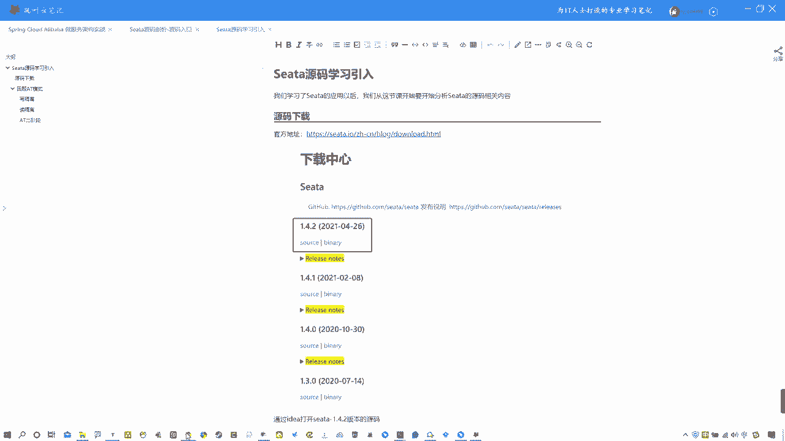
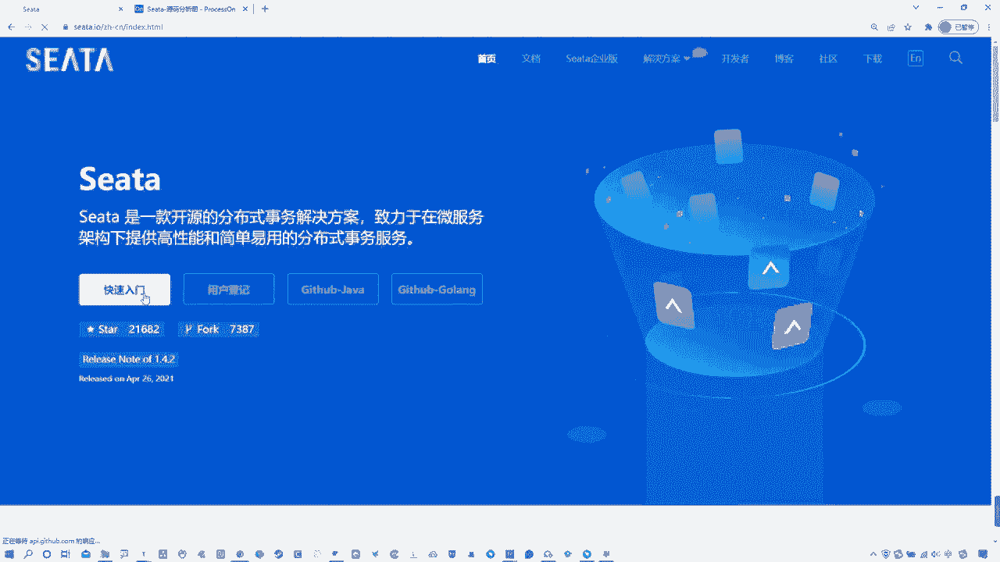
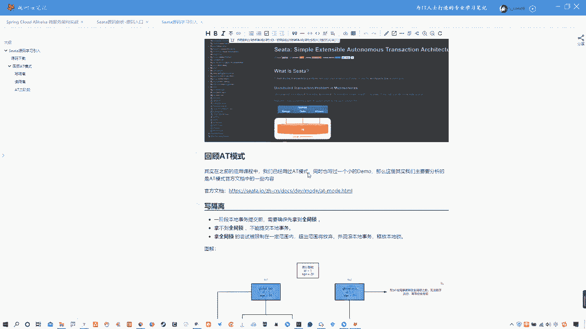
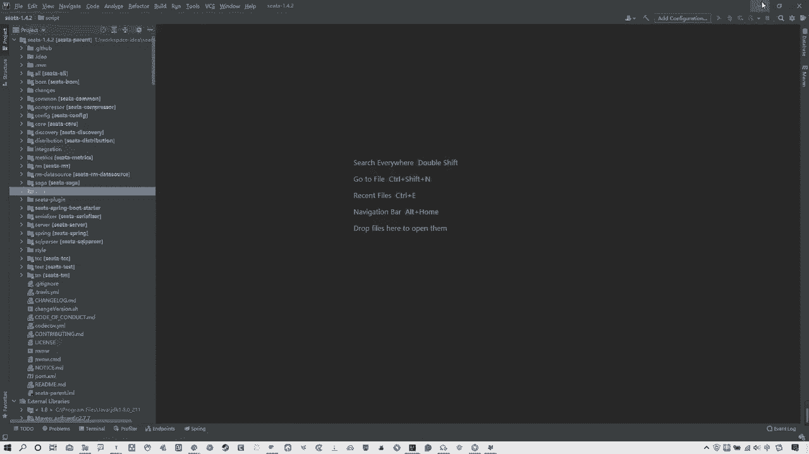
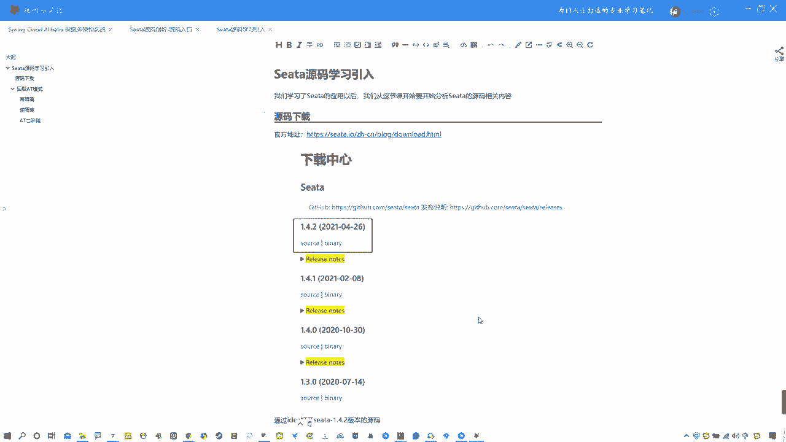

# 马士兵教育MCA4.0架构师课程 - P68：68、Seata源码学习引入 - 马士兵学堂 - BV1E34y1w773

各位同学们大家好啊，那么从这节课开始，我们要开始讲解theta的源码部分，我们在之前啊学习了theta的应用，包括它的一些售模式啊，包括一些他的一些高高可用的部署对吧。

包括通过NUO作为注册中心配置中心啊，包括使用dB模式等等这些吧，啊什么CA的各种事物模式，什么ATTC啊这些模式，那么在学完了这些以后啊，大家一定会产生疑问，就是说这个theta的源码。

它是怎么去实现这些功能的，那么我们还是要去强调一句话，就是theta它本身啊，80%以上的分布式事务问题，通过theta的AT模式都可以去进行解决，而且T模式也是sea主推的啊。

这么一个分布式事务解决方案。

我们可以从哪可以看到，从它的官方官方网站都可以看到。

映入眼帘的，直接就告诉你有这么几个模式，然后上来就是AT模式对吧，它主要是针对AT模式做的一些讲解，那么是这样的，各位啊，呃我们源码部分，实际上也是主要是针对AT模式进行展开啊。

这样的话把这个给大家分析清楚了，其实在你的面试中，包括在你后续的一些工作中就足够使用了，好吧，各位好好，那么这节课是一个theta的源码的学习引入，那么说白了就是我们需要去啊，对源码学习前做一些准备啊。

呃呃首先啊第一件事情嘛我们先说一下，那就是说源码的下载，那么theta的源码下载地址在这给大家提供好了，我们可以打开一下来，其实在哪就可以看到啊，在这有个下载啊，SA的官网中下载点啊。

然后在这就是对应的下载中心啊，这就是我笔记里给大家截图的位置，当前我们使用的版本是这个1。4。2，就这个版本，所以你跟这儿就可以进行下载好吧，OK这就不多说了，这个对于你们来说比较简单了啊。

OK然后再接着说一下啊，那么再去正式讲之前啊，我先多说几句呃，因为我们都知道，包括我们学习NUOINO啊等等这些吧，在学习源码的时候，我们都跟我跟大家说过一个概念。

就是尽量我们去啊静态学会静态的去阅读源码，因为你必须要去掌握这种，能够去静态阅读源码的能力啊，这样的话你再碰到一些框架的源码，包括你在工作中想去阅读源码的时候会很方便，好吧，各位啊，而且我再说一下。

再强调一下，学习源码，不要去纠结于细节啊，这个在我在讲NUO源码的时候就跟大家讲过啊，源码课程不要去纠结细节啊，比如说某些细小的逻辑啊，某些细小的一种特别特别小的小逻辑，不要去陷入其中。

这样的话你的学习会很慢，而且效率很差，我说白了你真这么学就学不下去了，好吧啊，所以我们要关注源码的，不是说这源码到底是每个细节怎么写的，而是它整体的思路是什么样，核心点在哪，对啊，所以我们去学习源码。

包括老师去讲，也是从大面去给大家去讲啊，从整体的这个设计角度去给大家讲好吧，OK啊，那么我们去下载好了这个theta以后，回到正题，下载好了theta源码以后啊。

我们只需要去通过idea啊进行打开就可以了。

我可以给大家看一下，我现在这个位置已经下好了，我这是这个OK啊，theta的源码啊，在这里啊，包括theta的所有的相关的这个项目都有啊，那么可以很明显的发现，theta其实它也是一个。

类似于NUO的这种spring boot项目对吧，那既然是spring boot项目，那就好办了对吧，这个我熟啊，OK好，那接着说。

我们再去正式去讲这个CA源码之前啊，我想带大家去回顾一下AT模式，当然不光是回顾AT模式啊，在这其中啊，啊我们还要去把AT模式，我们之前没有给大家讲到的，像写隔离，读隔离啊，这个分布式锁啊。

不是分布式锁，就是全局锁的这些概念去给大家去讲清楚，因为这个是官网提供的，这个我们当时在应用的时候，只是为了让大让大家快速上手，所以我没有去详细的去讲，包括这个写隔离啊，包括这个读隔离以及这个读音。

这个应该知道啊，包括这个位置有一个叫做全局所的概念，这个我没有跟大家说说去细说啊，只是简单提了一嘴，而这节课的话简单的去把这回顾，然后呢我们还要把这详细分析一下，好吧，OK啊，那么咱们就开始啊。

先说一下啊，我们在之前讲AT模式应用的时候啊，其实我们已经通过一个特别小的案例来啊，尝试去完成这种分布式事务的一个应用啊，尤其是T模式，那么这个我们当时讲这个demo也比较简单啊，我给大家找找那张图啊。

啊这是咱们后续要看这张图啊，那个图在哪，T模式在这，这是我们当时去讲那个T模式，当然实际上我们还通过一个案例去给大家去，分析了一下，我看那个案例还在不在啊，好像，哦执行模型saga的执行应该就是这个啊。

他就是这个啊，这二阶段提交，啊这个不是讲原理的，就是它那就是它这张图啊，我们可以再看一眼，再回顾一下我们当时讲的那个案例，是一个订单，一个库存，那么去订单发起的这种全局事务啊，或者叫做分布式事务。

全局事务，那么实际上就是它有几个角色，我们一定要清楚啊，在这其中一个是TC啊，一个是TM一个是RM RM相当于事物的参与者，TM是那个啊这个这个这个可以是一个项目，它也可以是一个这个RM啊。

它既可以是T4TM啊，也可以是RM啊，那么TM相当于这个事物的发起者，说白了就是啊，那么TC就是那个socket server啊，不是socket server，去了那个theta server啊。

说错了口误啊，Sea server，那这个概念的话，如果各位还不是很清楚的话，一定要把它区分清楚啊，在SA的官网的术语这个位置啊，TC是什么啊，事务协调者对吧，TM是什么事务管理器。

他们负责的是开启全局事务，提交或者回滚全局事务啊，那么RM的话就是资源管理器，那么说白了就是事物的参与者，OK好了，最后说一遍，不再说了，那么我们之前那个案例就是说白了通过订单啊，这个位置去。

首先啊开启选举事务对吧，然后呢，他这个位置会注册相关自己的一些，开启全局事务以后，那么他会去调用我的啊库存去减库存，订单这个位置生成订单库存这个位置去减库存，这其中会必然产生分布式事务问题。

那么我们的解决方案是通过AT模式啊，在呃订单调取这个库存的时候开启全局事务啊，然后呢呃首先全局事务中的这种什么事务，参与者去进行单独执行，本地事务或者叫分支事务。

同时要记录undo log和redo log，也就是执行前的数据和执行后的数据，记录在这个undo log这个表中啊，这是一个快照，可以理解为啊，那么记录他的一个前进向和后镜像。

这个前镜像就是之前的数据和，更改之后的数据啊，叫后镜像，OK把这个数据记录完以后，那么如果当前都没有问题啊，比如说订单也增加了，库存也减少了，OK没有产生分布式数问题，那好全局提交。

OK这是之前正常思路，但如果一旦出现问题，那么就会进行回滚啊，回滚的话可能就是具体的某一个分支事务，进行回滚，比如说库存减一的时候没有减成功，那好他就通过之前所记录的undo log，来进行一个回滚。

一个补偿型的回滚啊，这是补偿性事物对吧，OK这是我们之前讲的概念，那么这个都比较简单啊，我也不用多说，简单说两句你们就能懂了，那么在这其中啊，涉及到点东西什么东西，AT模式我们都知道是一个基于2PC。

就是二阶段提交，这么演变过来的这么一个协议对吧，那么在这其中其实还涉及到一些问题，就是写隔离和读隔离的问题，看官网上包括我笔记中有啊，笔记中有在这写个离和读个离，我们先看官网，好吧啊，在官网这个位置啊。

他告诉大家说这个整体阶段一阶段，二阶段不多说了啊，OK那么写隔离是什么，毒隔离又是什么，这两点我给大家说清楚，首先写个例，我们看概念，说一阶段本地事务提交前，需要先确保拿到全局所。

拿不到全局所不能提交本地事务，那么拿全局所的啊，拿全局所的尝试被限制在一定范围内，超出范围则放弃并回滚本地事务，释放本地所，什么意思呢，这个东西我们可以通过一个案例，来给大家去说清楚啊。

当然官方这个位置也提供了案例，而这个案例的话嗯，我觉得稍微晦涩一些，所以呢我就通过了我自己的方式啊，去给大家去画两张图，让咱能好理解一些啊，咱们先说这个血隔离，其实这个所谓的血隔离。

他其实就是去避免这种脏血的问题发生啊，脏血是什么，大家应该都知道，举个例子来说，当前假如说这个位置我有一条默认数据啊，ID为一值，是值为20啊，这是个默认数据，那么当前是两个选两个全局事务啊。

T 1t2 k，T1在开启全局事务的时候，首先第一件事情他需要去啊，也就是在一阶段的时候，他需要去拿到什么这个啊稍微放大一点，global啥玩意，全局他需要去拿到全局所，拿到全局所之后。

然后呢再进行具体的commit和ROBIKE啊，那么在这个commit和ROBIKE之前，这个全局锁是一直被TX1去掌握的啊，这是事务一去掌握的，那么只有整个这个全局，事务一在执行之后才会释放本地锁啊。

不是释放全局所说错了啊，释放全局所懂吗，那么这样的话T2才能进行执行，什么意思，它为什么能防止脏写呢，其实如果说啊我们没有这个全局组的概念，假如说现在当前IDV1的值是30，那么T1在执行的时候。

当前值为30，那么TS2在执行的时候呢，他呢把这个数据加一了，变成31了啊，那么就会出现脏写，假如说T1在执行以后啊，30好，它调用服务B了啊，这时候值就是30。

但是他如果一旦出现这种问题进行回滚的时候，OK那么值会变成20，那这头现在是在你去正常执行T1事务的时候，它也可以执行去拿到这个age的值啊，去做一些事物的改变，比如说把值变成31了，那好了。

那这个时候这个值就不对了啊，就直接变成一个脏血的情况了，那么如何去防止这种情况呢，其实很简单，他在T1这个位置加了一个全局锁，加上这个全局锁的目的，就是在TS1这个全局事务执行的期间啊。

只要他没有执行完，你的T2就不能拿到这个全局锁，你依旧不能对这个age的值进行改变，所以我这写了一下，说在TS1全局事务释放全局锁之前，无法向下执行，需要等待全局锁，那也就说白了在这个位置啊。

我现在想把这个值改成31啊，但是我没有拿到全限速，所以这个位置我只能去重视他，这个重试的时候，有个细节就会释放自己的本地食物啊，然后释放之后呢，再回过来重视啊，如果还有没有还没拿到啊，再回头释放。

再重试，再回过头来重试，他会一直重试重试重试在这，直到你的TS1全局事务结束以后，那么真正的这个位置拿到了全局锁，第二个是全局事务，TS2拿到全局事务以后啊，全局全局，所以后啊，他才能去正常的去执行。

他自己对应的这么一个啊，15这是当前的写隔离，说白了就是去防止这种是吧啊，脏写的情况出现，包括我们这说完了可以看一下他的官网，哎这啊他这也说了，说他也是举个事例来说啊，分别有两个TSETS2。

然后对当前的这个IDVM啊，id为一的这个M值1000啊，进行一个更改，你看TS1开始先开启本地事务，拿到本地所，这是正常的，本地所就不用多说啊，然后更新操作变成900了，那么本地事务在提交前。

先拿到该记录的什么全局所，本地提交释放本地所，那TS2开始后啊，开启本地事务，拿到本地所，更新操作由原来的900-100变成800，在本地事务提交前，他需要先拿到全局所，也就说白了你不管这边怎么操作。

如果说你的TS大拿不到全局锁，那么他就无法执行，所以在TS1全局提交前，该记录全局所被T1直有啊，也就是说全局事务TS1它持有全局锁，那么TS2就需要重视等待全锁，你看它这个图就在这个位置呃。

获取选举所，OK获取不到怎么办，就重试重试重试等着什么时候，TS1执行完了，他释放了全局锁，他拿到了才能去执行他TS2的本地事务，去把当前的这个呃900再减100，等于800啊，这是什么情况。

OK那么如果说TS1的二阶段选举提交好看啊，TS12阶段全局提交释放全局锁啊，TS2拿到全局所提交本级事故啊，这是刚才我说的那块啊，这我说的那块，这是他正常提交的情况下，那如果说T1的二阶段是全局回滚。

则TS1需要重新获取该数据的本地所，进行反向补偿操作啊，实现分支回滚，这是我们正常的AT模式啊，它的一个操作流程，但是如果说全局锁情况下啊，就是T2在T1在全局回滚以后，TS2取必须等待该数据的清理所。

同时持有本地所，说白了就是这个意思，咱就不用看这个了，就是看着有点蒙啊，简单理解吧，不管你TS1是整体提交还是整体的去回滚，只要你的全局锁在没有释放的时候，你的TS2是无法操作的。

他只能在这个位置获取全局锁，获取不到回滚本地事务，然后再来重试，如果还拿不到回滚啊，在等着什么时候拿到全局锁，什么时候才能做，你TS2的一个全局事务的后续操作，这就是啊写隔离，他其实你看这写的说。

因为整个过程全局锁啊，在T1结束前是一直被T1持有的，那么T2就无法进行擦的操作吗，所以这样的话就会避免脏写的问题的发生啊，这就是所谓的我们AT模式的血隔离，其实就是去防止这种脏血的问题发生。

OK啊这是写个离说清楚了，OK那么还有一点就是独隔离，这个独隔离是什么呢，呃我们可以看一下啊，它这个有一个概念，就是说在数据库本地事务隔离级别啊，足以提交或以上基础，theta的AT模式。

默认全局的隔离级别是读未提交，大家可能会对这个读语提交和独立提交，这两个情况，这个隔离级别啊可能不太了解，我简单说一下吧，好吧，我们这个也是看图啊，我要把这个图都画好了，有一个独隔离，OK看这张图啊。

他这个所谓的读隔离是个什么样的意思啊，他这个我这个图跟上一个没什么区别啊，都是一样的，默认数据为20啊，然后呢你们要注意一句话的事啊，咱们先看这啊，他这句话你要注意，就是他这个位置说独隔离是说啊。

如果应用在特定场景场景下，必须需要全局足以提交这种隔离级别，那么目前theta的方式是通过这种代理，select for update语句，说白了就是加航速啊，OK那么什么叫独已提交读未提交呢。

我们来看图啊，哪去了，这个图中当前默认数据为20，然后呢TS1这个位置一样，改成30T2这个事务二啊，全局失误二啊，这个位置不是30，我就变成31好吧，我忘改了，OK好啊，他也是这么一个情况。

那么他现在什么叫读未提交呢，假如说当前T1执行事务以后，这个值变成30了啊，这个值变成30了，但是它现在是一个呃未提交状态啊，他现在是一个未提交状态，也就是说没有走到这个全局commit。

你这个时候如果是读未提交的隔离级别，当前的TS在当前这个位置，他就获取这个get的时候，它是能够读到这个30的啊啊这不是31对，他是能够读到这个30的，这是读未提交啊，也就是说白了如果是读未提交的话。

没开，当前我这头把这个数据更改为30了，但是并没有去执行全局提交的时候，我这头T2去获取这个值的值，它是可以读到这个30的，这是读未提交隔离级别啊，什么叫读已提交呢，读已提交就是指当前的T1啊。

把这个值改成30以后必须执行的commit，本地事务提交commit，真正的把这个值全部提交以后，我这头才能读到这个30，这叫做读已提交隔离级别，读未提交，就是他没有真正提交，我也能读到，读未提交。

就是他必须真正提交以后，我才能读到，就这么点区别好吧，那么这个读未提交读未提交啊，我在这给大家写了对吧，在保证在T2中能够读到TS1的H30读，已提交，是在T2中读不到数据，等待全局锁，什么意思呢。

它这其中就涉及到一个全局锁，这也是我们当前官网中给大家提供的一个概念，就是说好在这这个他代理的select for update语句，会申请全局所，如果全局所被其他事物占有，则释放本地所回滚啊，并重试。

其实跟上面那个是一样的，他这个过程中是被一个block处阻塞的，所以直到全局所达到即读取的相关数据，是已提交才返回，这说白了就是去CAT模式针对的这种说，必须做到读已提交模式的这么一个做法。

回到我们这案例中说啊，他的意思是指当前这个位置位置值为30，如果当前他是读已提交的级别啊，读已提交级别，那么在TS2这个位置，他通过这个语句去读的时候啊，他会申请拿到全局所，但是我们之前讲过。

如果当前你的全局事务一，没有完成整体操作的时候，那么这个全局锁就一直在这啊，这个锁就一直在这，那么你的T2去通过这个语句，申请全局锁的时候，由TS1持持有的全局锁，他是拿不到的，那怎么办呢。

那他就需要在这儿等回滚本地事务，并且从事，直到把这个全局锁TS1释放以后，他拿到了，他才能继续向下走，这就说白了啊，这是我们这个theta的AT模式的，读已提交模式啊，独以提交这个级别的隔离是这么做的。

但它默认记住啊，他是独立提交好吧，如果你非得做到独立提交，那就得这么做好吧，各位OK啊，这是之前没有去给大家去讲的这两个过程，所以这个位置简单去啊，不能说简单就详细把这个事给大家讲清楚了。

也就是说CAT模式的一个写隔离和读隔离啊，说白了就是去防止这种脏荼脏写脏读脏写好吧，OK那么其他的话这个位置我就不看图，不看官网了，看笔记，在笔记这个位置，我把AT的二阶段模式啊给大家去。

再详细的把流程列了一遍，那么如果你忘了的话，你可以看这个，当然啊我这个位置没有人，官网写的全，我这是摘摘抄官网的，只是我精简了一下官网的这个位置，如果你忘了是两阶段，那么AT模式的一阶段和二阶段。

在这里写的非常详细好吧，那么我在这给大家简单过一下，因为咱们都现在起码现在美貌，OK1阶段是指的说解析SQL啊，AT模式的一阶段是解析circle，得到对应的circle类型，update啊，什么语句。

说白了就是等相关信息，然后查询前进向，这个所谓的查询前进项就是第二步，就指的是改变之前的数据，假如说我们订单那个扣库存，在扣库存之前记录一个数据，就叫做前进项啊，然后根据解析得到的这种条件语句是啊。

条件信息来生成查询语句，定位数据，然后执行业务circle啊，比如说库存减一，OK那么在库存减一以后，它会生成一个后镜像，就是改变后的数据库存，真正减以后的数据叫做后定向，它是通过主线来定位数据的。

OK然后第五步啊，这还是一阶段啊，一阶段第五步会插入回滚日志，也就是说把这个ando log，说白了就是啊前后镜像以及业务业务，circle相关的信息统一啊。

成一条回滚的日志记录插入到undo log表中啊，插入到ado log表中，那么这表就是用于补偿回滚的对吧，OK啊，那么在提交前向TC注册分支，申请选举所啊，在本地事务提交之前向TC去注册分支。

而且告诉你这状态我现在要申请申请本地所，那么本地事务已经提交O申请之后，本地授经提交，那么业务数据的更新，和前面的步骤生成的analog1并提交，然后最后一阶段，最后一步就是将本地事务提交的结果啊。

上报给TC，你是成功了还是失败了，就这意思，就是说你的库存是减成功了还是减失败了，最后告诉TC，如果说你是失败了，那么就走到了二阶段的回滚，失败的时候，二阶段回滚是收到TC的分支回滚请求。

那么开启一个本地事务，执行如下操作，通过XID啊，XD是什么，知道吧，跟大家说一下这个东西，我在之前几节课跟大家聊过了，XID是指的是我们啊如何确定一些分支事务，是在我当前这一个全局分布式事务中的。

这么一个唯一的编号，说白了你这个订单本地事务和你的库存，本地事务啊，包括整个这个分布式系统的本地事务啊，不是本地事务，全局事务他们有个统一的id，就是XID，通过这个XID来确定这个全局事务中。

所包含的本地事务或者叫分支事务，然后呢这个是具体的分支事务id啊，通过XID先找到整个的全局事务，然后呢，通过具体的这个子或者叫做分支，这个这个事物的id来查询对应的这种日志记录。

然后根据这个对应的undo log，前进项进行补偿回滚，把修改之后的数据回滚回去，这是补偿回滚对吧，OK然后提交本地事务，并且把本地事务的执行结果上报给TC，就是回滚成功失败，这是回滚啊。

但如果二阶段提交的话就比较简单了，那么收到TC的分支提交请求啊，把请求放到一个异步队列中，马上返回，提交成功给TC，那么异步任务阶段分支提交请求，将异步和批量的删除相应的undo log。

也就是说你如果整整个的这个，比如说库存也减成功了，订单也没有问题，Ok，那这个时候会把相对应的，之前的所有的资源释放掉，包括安do log记录也会删除掉，这个事我们在最开始给大家演示过了。

然后最后整个的进行提交就完成了，好啊，那么这是我简单领大家去回顾了一下AT模式，以及我们之前的案例，包括源码的一些开篇啊，像源码的下载以及T模式，我们之前没有讲的多个例写个例，所以这节课就先讲到这。

这是为了我们后续讲源码做一个铺垫，下节课开始。

