# 马士兵教育MCA4.0架构师课程 - P71：71、Seata源码分析-数据源代理 - 马士兵学堂 - BV1E34y1w773

OK同志们啊，那咱们这节课来继续讲解theta源码啊，那我们这几块要分析的实际上就是CA源码的，数据源代理相关内容啊，上节课的话我们分析到了说这个theta t模式。

整个的2PC或者叫两阶段的这个执行流程，这节课的话我们要分析的就是，AT模式中的另外一个关键点叫做数据源代理，首先咱们来回顾一下说AT模式的核心点在哪，AT模式有两个点，一个是说获取全局锁。

开启全局事务，另外一个点就是解析circle，并且写入undo log啊，这个用于回滚的这么一个日志快照对吧，OK那么上节课分析的很清楚，整个2PC的阶段，我们分析明白了。

它实际上就是通过这个global transitional scanner，这个类型去继承一些抽象类，包括接口，实现一些接口来对应的一些方法来解决的问题。

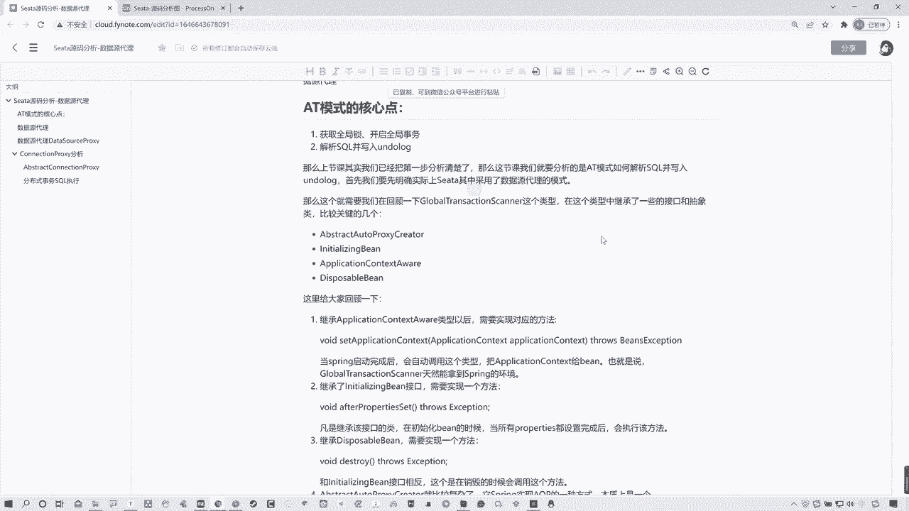

所以我们可以简单回顾一下啊，给大家找一下这个啊，先来看一下啊，我们都知道这个global transitional scanner，那它是一个啥，它是一个叫做全局事务扫描器啊，所有的事物都从这里开始的。

他其实简单来说就是去扫描你对应并组件上面，那个global transactional注解，然后呢你可以看这啊，它有几个比较关键的点，在这我给大家写了。

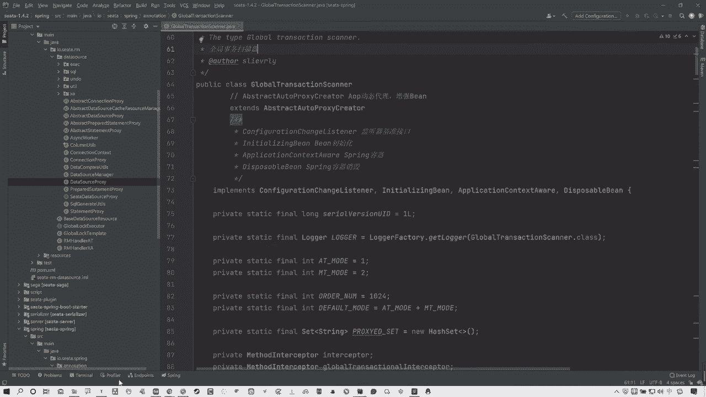

包括笔记录给大家写了啊，看下笔记本来有这么几个关键的啊，就是一个是继承了这么一个凹凸proxy creator，这么一个抽象类啊，这是a OP的对吧，包括initializing bean。

Application，context of war和这个呃disappoint able这个B啊。

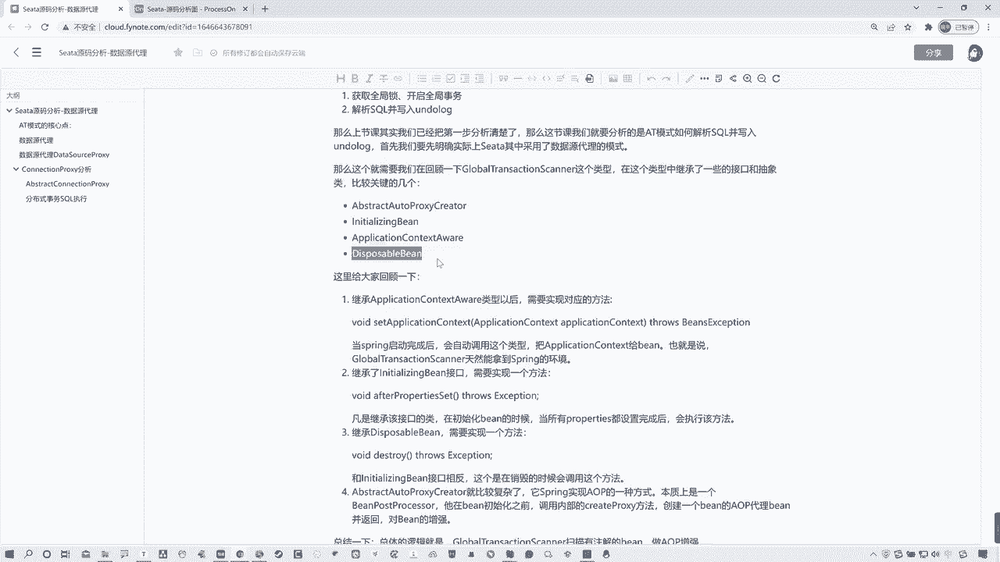

那么这么几个东西实际上简单来理解吧，这个位置其实特别简单啊，这个咱们先不说，先看这个application contest awar是啥呀，这实际上就是spring嘛。

所以你通过这一点你可以很清楚的知道，就是当spring启动完成以后啊，就是会自动去调用这个类型对吧，那么会把这个application contest去交给这个B。

也就是说当前global transitional scanner，它是天然就能拿到一个spring环境的，然后对应的这个initializing bean，和这个D就这两个啊，其实也非常简单。

它其实就是一个销毁啊，一个是开启，一个是销毁，这是之前after props啊，这个这个properties啊，set这什么意思，他说白了就是去，凡是继承或者叫实现这个接口的类型。

在初始化bean的时候，那么当所有的purpose都设置完成以后，它就会执行该方法，OK那么还有就是对应的有一个销毁方法，整个生命周期完成以后会有一个销毁，销毁方法叫做destroy啊。

这个方法就是由当前的这个，当前这个就叫disapable bin这个类型来提供了，那这是什么呀，这不就是对应着你这spring的一个生命周期的一个，感觉嘛，对吧，所以啊就是凡是去继承啊。

凡是实现这个接口并且重写对应方法的，那么它就是说白了，这个接口跟这个接口是个相反的关系啊，在销毁的时候会调用这个，这是在初始化的时候会调用它，销毁的时候会调用它，所以这个比较好理解。

这里可能唯一比较复杂的就是这个类型啊，Abstract auto proxy creator，当然这个上节课我们也讲过了啊，这个就是对应的一些整个的a OP的代理啊，自我AP增强的做AOP增强的。

那么其实总结来说吧，就这global transitional scanner，他就是去扫描你当前啊，这个bean类型上面是否有那个global transactional注解，如果有。

那么他就会做进行代理增强来做一系列的操作，完成整个RPC操作，整体流程的话，在这我上节课给大家分析过了啊，这就是我们这东西从开始从哪儿去扫描的，自动装配，扫描到以后，然后干了什么啊对吧。

整个的从这开始说有业务发起请求以后啊，触发全局事务以后干了什么，全局事务的人工流程等等等等等等啊，这全部都分析过了对吧，OK这块就不详细说了啊，那么其实我们这节课要分析的是数据代理。

所以其实我们还需要去回到，这个自动装配的这个位置，那么我还是去拿我之前这个案例，来给大家举个例子啊，关一关啊，我们正常来说的话，去找这个开头啊，分析源码开头的话，他会我们会从这找去，他找了找他引入的包。

然后呢最近找他一个自动装配类型spring boot的对吧，那在这里可以看到有个叫做sat auto configuration，那么我们之前所看到的对应的那个叫做global。

Transactional scanner，是在这对吧，那么这节课我们要看的是什么呢，看的是这个叫做sa data source bean post proxy，在这儿他对数据进行了一些代理。

拿到数据源对象以后来做代理，来做一系列的操作，所以关键点在这，我们要从这儿去看起，所以说白了你要知道就是关于数据源代理，这里啊，我们是在全局事务拦截成功之后，那么他最终是一定要执行他的业务方法的。

而且我们theta是对数据源做代理的，所以SQL的解析也好，包括安DOLOG入库，这些操作全部是由数据源代理来完成的，那么这些数据源代理在哪又给大家找啊，咱们先去找这个对应类型，你可以先看一下。

咱们进来啊，进来以后你会发现在这里面啊有这么一个方法，包括在这有这么一些方法，你可以看看，先看这来看来先看这个类型啊，它首先继承了一个接啊，不能叫继承啊。

实现了一个接口叫做bean post process，这个接口相对相呃，感觉大家或者说对于你们来说应该是很熟悉了，这是什么呀，从这图中啊，尾字在这啊，也给大家去列出了，它是spring的拓展接口。

相信大家对spring没有问题的话，这个都能知道，那么所有的bean对象再去进到这里以后，都会去执行这两个方法，哪两个方法，一个是post方法和一个before方法。

那么这两个方法都是由这个接口所提供的啊，在这啊，这对吧，这两个方法很浅显，很显而易之，就是在初始化的时候啊，首先会执行什么啊，这个比如啊在什么之前，然后执行after，在什么之后对吧。

所以说我们从这开始分析，在他执行什么什么，在在他这个初始化的时候之前所做的这个事，看看before啊，before这里面其实并没有做什么操作，哦整个都在这儿啊，你看before这我没标什么对吧。

before这里并没有做什么操作，他只是说对当前的bean组件啊类型做对比，看一下是不是这个代理对象授权代理对象对吧，所以这其实并没有什么可看头的，关键点在于哪，在这方法在方法中你可以看这个判断啊。

说并当前并列并并这个对象啊，我们所有的这个bean对象，bean对象进来以后都会走这两个方法，那么走到这的时候，会判断当前你这个B是不是data source，也就是不是数据源，如果是K好看，第二头。

这不是一个与或非的那个雨吗，对吧好，第二头头是什么，这头就是说那个啊，并判断是不是代理对象类型取反了，那说白了这里的判断是不是就指你当前的对象，是不是一个数据源，这是啥玩意啊，不用管他是不是数据源对吧。

如果是数据源的话，如果是数据源的话，他是不是这个这个这个data source，这个proxy代理对象类型啊，如果不是好，那么这个位置它调用了一个方法。

Return policy data source ban，把ban传进去，这个方法做了什么，Data source process desource pro，去掉对应的方法。

把你的这个data source传入，说白了它最后返回的对象类型，不就是一个数据源代理对象吗，那也就是拿到你的ban这个这个数据源的bean，bean类型啊，对它进行一个代理。

所以其实这里我们要分析的关键点就在于，data source process啊。

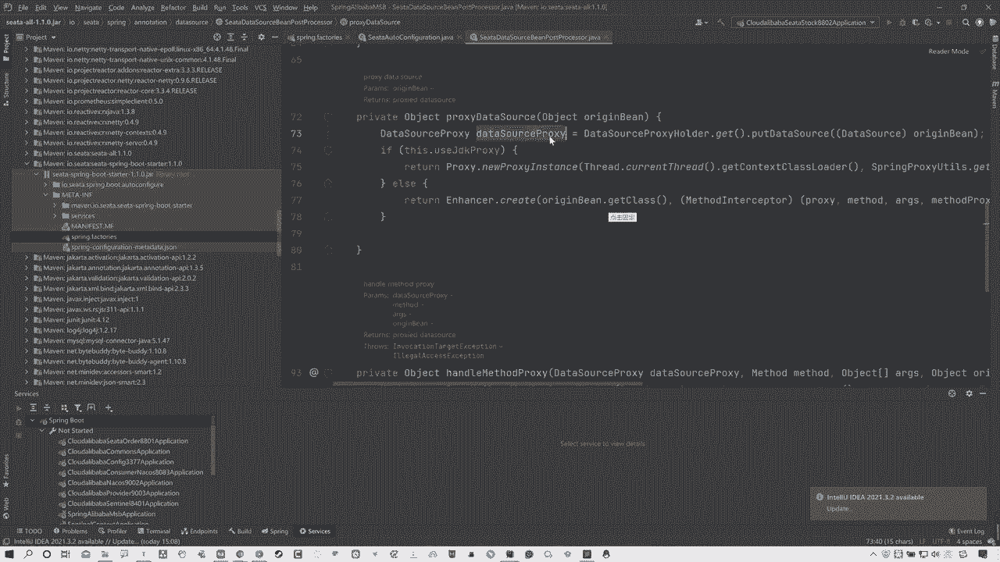

要分析它，OK这些整个流程我在这在这给大家标注了。

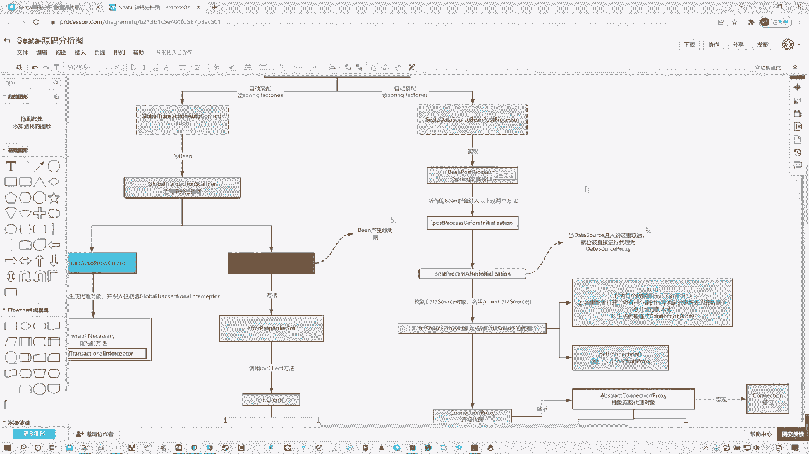

你可以看到说有拓展接口实现两个方法，在这个方法这个位置，当data source进入到这里以后，就会被直接代理成data source proxy，OK所以其实在这我们就要去分析这个东西了。

那么分析谁啊，分析的就是这个叫做data source proxy代理对象，OK那么我们找到入口了，那么咱们现在就看源码，OK我在这给大家找一下啊，data source来定位一下。

首先啊大家先来看这儿看这儿，这个data source process啊，它存在于这个包中，你会发现啊，嗯诶不对，我看一下啊，不对不对不对，点错了啊，找他找他啊，我点错了，Sorry，找的是啊。

我这边找错了，Sorry，再找一下啊，不对劲，不是这HLER啊，不是这HLER直接找这个啊，Data source process，嘿data source process啊，OK然后我们再定位一下。

我们来看这里啊，你会发现这里不光是有这个数据源代理对象，还有connection policy，Statement process，Prepared statement policy。

首先我们都知道data source是干啥，数据源connection是什么，连接对吧，连接对象，然后statement包括prepared statement，他们都是SQL语句的执行对象。

那也就是说白了这些关于数据源代理连接对象，执行SQL语句的这些组件，他们全部都被ca进行了代理，那么为什么要被theta进行代理，代理后的目的就是为了去执行你C，它的对应的逻辑。

就是AT模式里面这些逻辑生成undo log呀，全局事务开启啊等等这些东西，执行SQL语句，解析SQL语句等等，这些全部在这里面去执行了，所以这个位置授权代理，我们应该去从哪分析呢。

就是从这个data source process开始，也是从这开始的，而且笔记中啊，我给大家记录了一些内容，不是这。

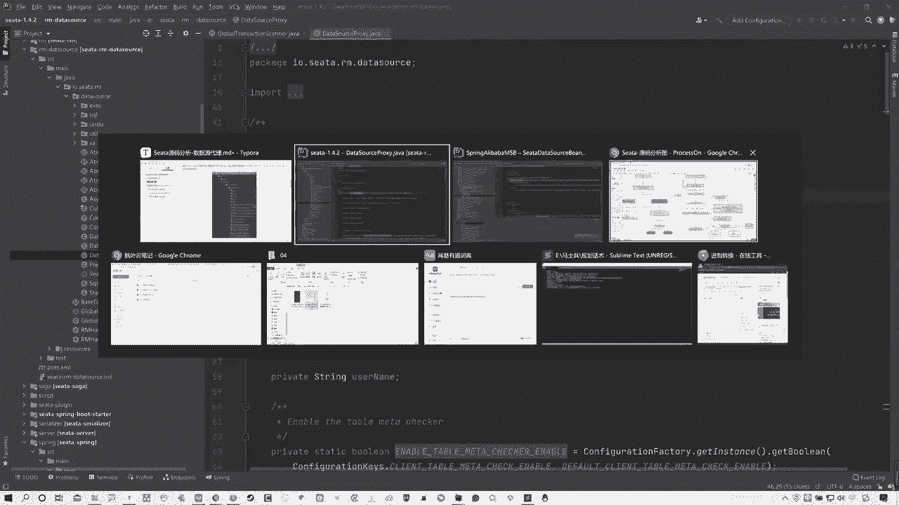

这点我都标出来了啊，然后你看啊，数据源代理是个非常重要的环节，我们知道在分布式事务运行过程中，undo log等记录资源锁定等都是用户无感知的，那这些操作实际上都在数据源代理中完成了。

这刚才说过O所以数据源代理对象他这个位置，Data source proxy，它主要分成了三个功能，而且其中有非常关键的方法，叫做引力的方法，初始化方法啊，一会儿给大家去看，咱们先看这三个功能是什么。

它实际上是为为第一点，为每个数据源标识着资源组id，就是数据源，不同的数据源有不同id啊，都不不同的资源组id啊，那么同时有一个配置，如果这个配置打开的话，会对整个的定时线程池进行更新原数据。

并且把信息缓存到本地，这个实际上就是去说白了你当前呃，比如说我们之前所做的业务订单和库存那个啊，那么他需要去拿到你对应的一些呃，表里面的数据嘛对吧，库存表的数据，包括你订单表的数据。

那么他在时时刻刻的应该没记错，是一分钟一一更新，一分钟一更新，却拿到你准确的这个数据信息缓存到本地，为什么要缓存过来呢，是因为缓存的操作要快对吧，OK啊，然后最后一点就是生成代理。

连接对象就是connection proxy，所以这个位置，我们就先来去分析它的初始化方法，INIT方法，OK那这就不看了，我们直接看代码。

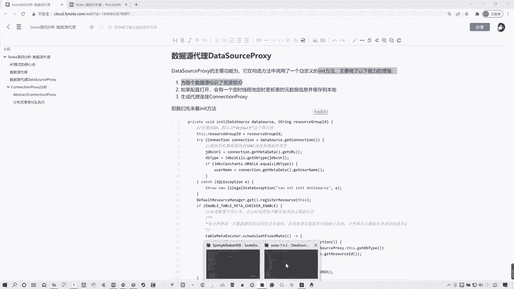

音译的方法实际上是在它构造方法这个位置，调用构造方法以后，那么他这个位置会传入资源，做id完了是对应的一个data source对吧，然后在这调用的方法，OK所以咱们来看这个方法，它的前两点。

其它的前两点其实比较好理解啊，就是一个是资源组id，当前这个id覆盖id只是比较比较简单啊，然后呃通过原始的这种数据源，得到GDBC连接和数据库类型。

你看g DB c u l d d DB type数据源，数据源类型对吧，这都不用说，然后主要是我们看这个类型啊，如果配置打开会在定时啊，会定时呃，啊应该少写个字儿啊，会在。

会定时在数这个线程池不断的更新，表着原数据信息缓存到本地，什么意思啊，这个位置其实这么看不太好理解，但咱们先理解答面啊，我先跟大家说意思，这个意思其实就是说白了你在业务开启的时候，你在有业务发生的时候。

有这种数据，这种分布式事物出现以后，它会把对应相关的表的数据缓存到本地，为什么要缓存到本地呢，其原因就是在于缓存到本地以后，它的速度快，因为它在缓存中他可以去节省一些查。

因为你数据库查询这个时间是比较长的，如果你每次都查询的话，会浪费时间啊，会时间变长，所以他每次都缓存到本地，你从本地缓存拿数据去比你查肯定要快对吧，所以就这个意思啊。

其实所以所以所以说白了这个音译的方法中，只做了这三点增强，只做这三点增强。

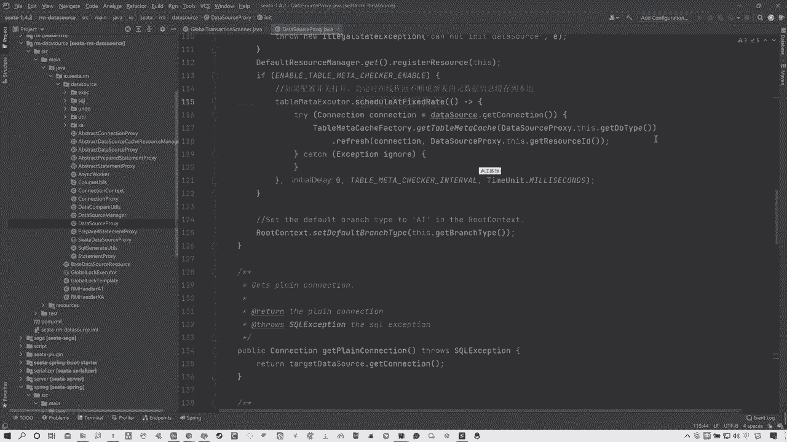

所以这就比较好理解了，OK那么这里说完之后，我们再往下看，他第一件事情是有INIT，那么刚才说过了，还有一点就是说去创建一个连接代理对象。

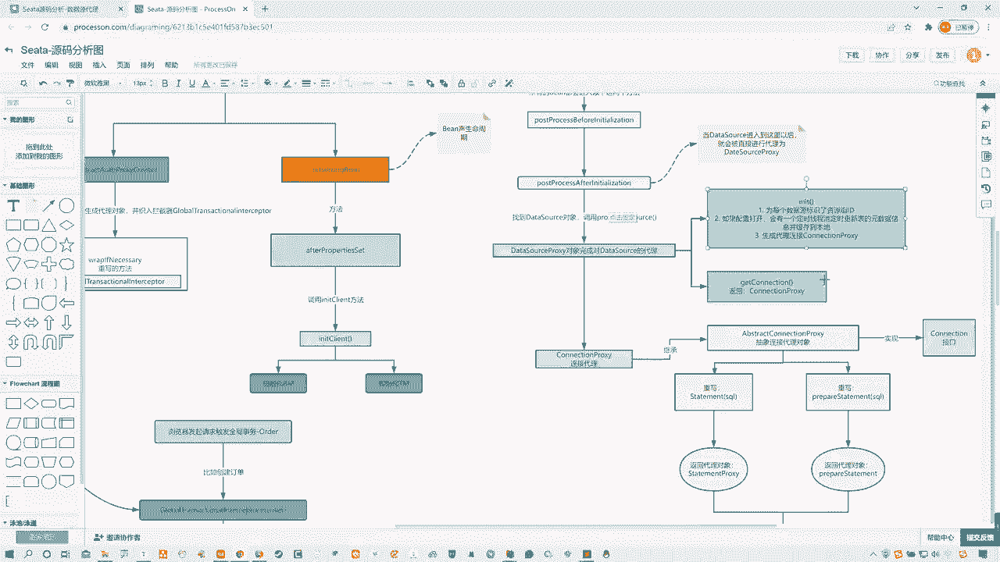

那么这个所谓的连接代理对象在哪啊，你们可以注意看一下一个东西，就是他继承了一个abstract data source propose，数据连接对象啊，数学这个抽象的这么一个数学代理对象对吧。

在这其中有很多很多方法，这个咱们先不关注，其中我们要关注的点在哪啊，有一个方法，给大家找找哪去了啊，这get connection，这是什么连接，获取数据连接对吗，获取数据连接，那包括这有很多啊。

你看这也是一个，这是一个无参数，一个是有参数的，应该啊对是你看get get connection，Get connection，这是那个有那个用户名和密码的那个，所以说白了这个位置，他的第二件事情。

就是对整个的这个连接对象做了个代理，因为你可以看到他最后return new connection proxy，这也是一个连接对象的数据代理对吧，证明哪儿它是用哪啊，用的是这个咳啊。

所以说过了SA最开始我说过了，他整个球全部都是用的这个数据代理，那么你的数据源对象被代理以后，那么建立的连接也是通过啊，连接对象来这个这个代理对象来完成的，所以到这我们再来看这两点，我分析明白了对吧。

一个是说这个整个的数据源加D，然后去打开配置定时更新，然后生成连接对象，通过的是get connection这个方法来返回的，get connection connection proxy啊。

pose不是方法，是一个代理啊，这这个连接代理，所以现在这没什么可分析的，我们主要看这个连接连接代理对象又干什么了，走往下走啊，这就是那个connection proxy继承了一个abstract。

connection proxy又是个什么性类啊。

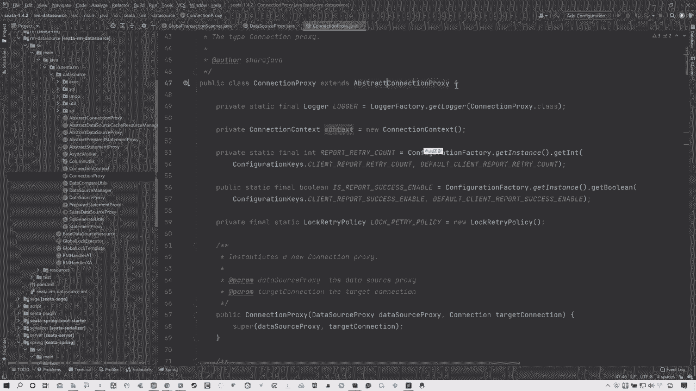

实际上在这个里面啊，我先跟大家说一下，看笔记，啊这我还提一嘴啊，就是在这个增增强里面，这三个其实就前两个比较容易，第三个是最重要的AT模式里面会自动记录，undo log和资源锁定等等。

其实都是通过这个connection policy完成的，所以其实我们主要去分析的话，就是这个connection policy分析啊，那么你们可以看一下啊，Connection py。

它继承了一个叫做abstract connection py，那么一般看到abstract，我们都知道他的工作是啊，父类封装了很多通用的工作。

而且它的父类里面还使用了prepared statement，policy和statement prose，包括还有data source prose，这一点的话，我们这有一个类图，大家可以看一下。

放大一下abstract开始，首先他这个实现这个里面，然后包括引用了对应的三个类型啊，那么现在我们主要分析的话。

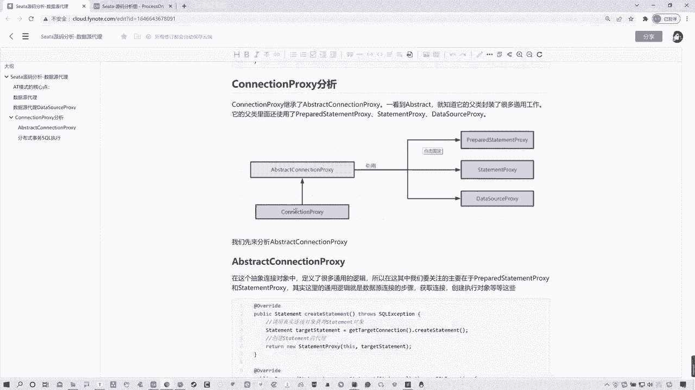

就不能去分析当前它了，看的应该是这个父类，因为这里封装了一些通用方法，所以我们先来搂一眼啊，来看，那么这里大家可以看一下我为什么说啊，有这几个东西，你看data source proxy是不是用了对吧。

然后还有啊往下来看，说白了这个步骤你们可以简单这么理解啊，就是我们再去用普通的这种数据源的时候，去操作SQL语句的时候啊，我们都知道有数据源连接对象啊，数据源代理数据源对象，然后有连接对象。

有具体执行SQL语句的对象，就是statement prepared statement对吧，所以这里我们可以看到数据源有了连接对象，也有了对吧，然后现在我们要看的是。

它连接对象所定义的一些针对数据库SQL语句，操作的对应类型，可以看到这有一个statement，Create three statement，创建这个执行SQL语句的这么一个对象。

包括有防SQL注入的一个prepared statement，这里都有啊，那你们可以看到这两个方法中，比较关键的点在于哪呢，statement和prepared statement。

不管他俩是谁用的是哪一个，他最终都会返回一个prepared statement，proxy和statement policy都是数据源代理啊，不是都是这个执行对象代理，执行SQL语句对象代理。

它并不是用的原声的，原声的statement和prepared statement，所以这个位置我们要往下分析的话。

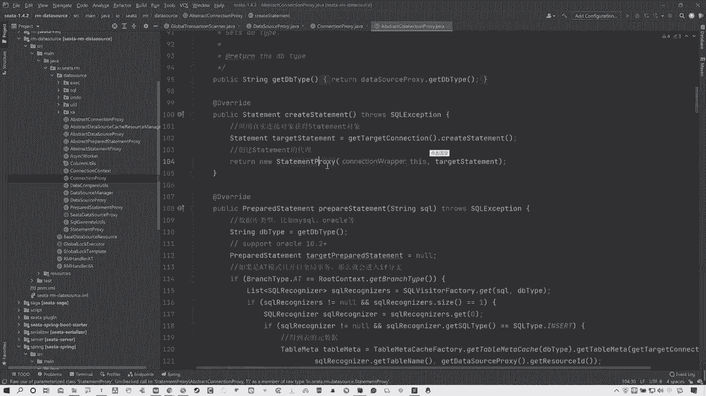

分析应该是这对吧，你看我在这给大家标出来了啊，呃所以这里我们需要关注的是prepared statement，proxy和这个statement proxy，其实这里通用逻辑啊。

就是数据源连接步骤获取连接，然后执行对象等等，这些明白了吧啊就是这样，这就是步骤是一样的，只不过每一个步骤SA他都做了代理啊，然后啊我们可以分析一下这两个方法。

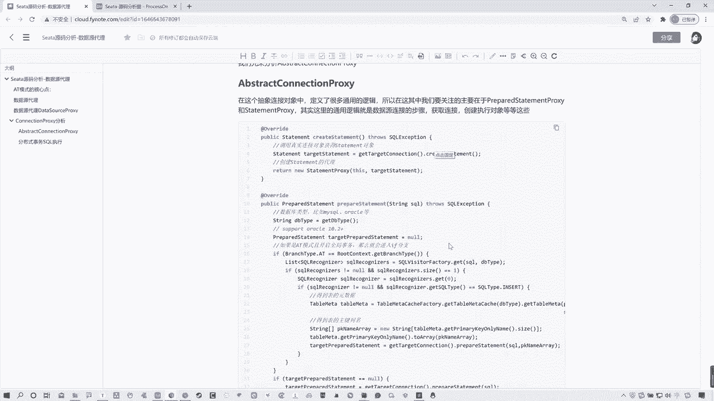

先看一下这两个方法，在这两个方法中，首先statement没什么好说的，他就是获取连接对象，然后最后返回的是一个代理对象，然后呢这个里面可以看一下，它实际上就是上来先获取数据库类型。

比如说你是MYSQL或oracle，有一个模式的判断，如果当前你是T模式啊，那么就开启全局事务，当然默认走就是AT模式啊，然后会进入到if分支，那if分支这里其实就不用多说了，就是得到原数据。

然后获取表的一些主键名，然后通过它对应的一个这个prepare statement，这个方法传SQL语句和对应的一些参数就完了啊，这都是基础操作了，不多说啊，然后最终关键点资源在这啊。

他会去创建prepared statement，proxy代理啊，所以可以现在发现，不管是这个prepared statement还是statement，它都是通过代理对象来执行。

那我们就来看一下这个代理对象，它里面的一些具体执行方法啊，在这其中其实你会发现有三个比较关键的方法，就这就这仨看到result set不用做体啊，这有一个or query，Execute。

Execute，Execute，Execute update，还有一个execute方法，这三个方法实际上就是具体执行SQL语句的，三个方法，你可以可以看到啊，这里拿就是SQL语句。

拿完SQL语句以后呢，他通过这个叫做execute template，execute方法，都是这个方法，看到吗，都是这个类型对应这个方法，而这个execute template它是啥。

它实际上你可以理解为是一个这种，不同类型的一个处理器啊，他来执行不同的这种SQL语句，通过不同的代理，那么这个咱们一会分析啊，先不说它，主要是你来看一下这个当前是statement prepared。

这个代理对象，关键点在于这方法，那么其实你可以看到，不光是他啊，这两个执行逻辑差不多，你看这个prepared statement proce，他的非常关键的方法也是这三个，看到了吗啊，Execute。

Execute，query和execute update也是这三个方法，同时你会发现这里他们所使用的都是这个，Execute template，通过它来完成的来调用的。

对应的excuse方法来完成一些操作的，所以这个位置各位啊，现在应该知道关键点在于哪呢对吧，所以啊各位回到笔记中，这里我都给大家分析清楚了，这个数据连接对象啊，有对应的一个abstract。

那么实际上它实现的接口啊，我可以我可以告诉大家，它所实现的呃，这个啊它所实现的接口就是connection连接对象对吧，所以在这里面实际上就是设计了一些通用方法，只不过说你在最后执行SQL语句的时候。

你是选择这个statement还是prepared statement，并且都是代理对象执行啊，然后啊然后往下重写对应方法返回代理对象，然后执行SQL语句，通过的都是这三个方法来执行，说过了。

然后实际上是不同的SQL语句类型来执行，不同的SQL语句类型的执行模板就是谁，就这玩意儿为什么说他呢，你看这底下插入的修改的，删除的，这是我之前说过的，开启开启全局锁ect update对吧。

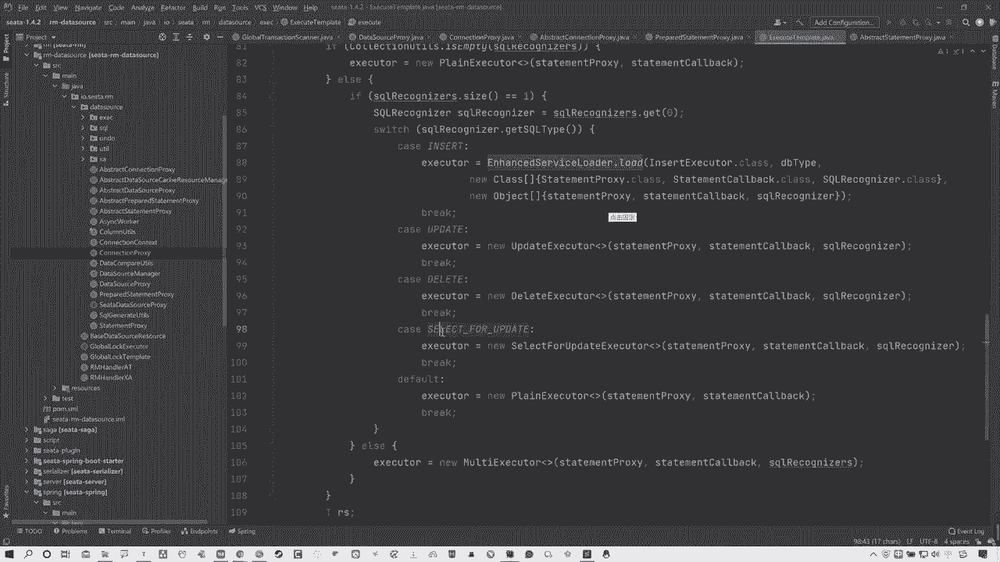

OK那这些我们一会儿来分析，现在我们分析到就是找到了这个数据源，代理对象，整个的入口和找到了一些关键的代理对象，那么还有一些什么生成ando log这些东西，这些东西怎么来的呢。

这些东西我们留到下节课分析，我们先把这个整体的大流程先分析出来，好吧，各位OK啊。