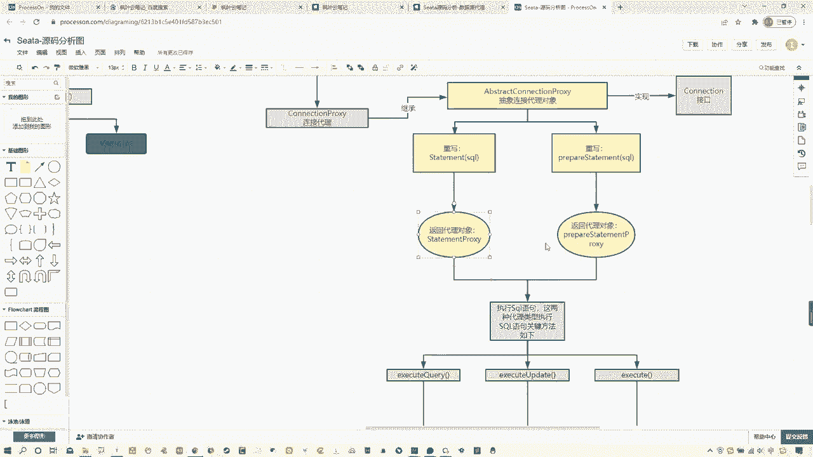
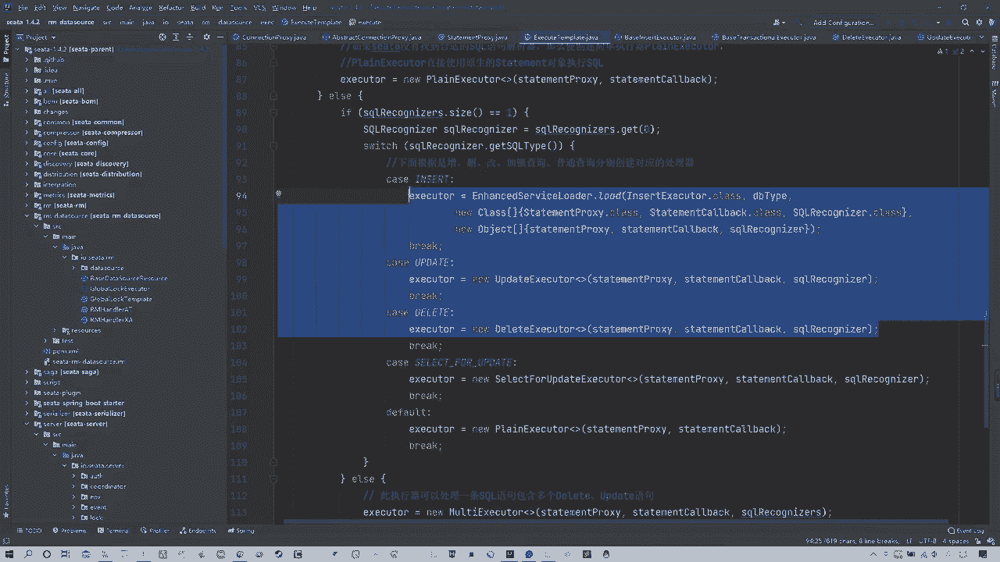
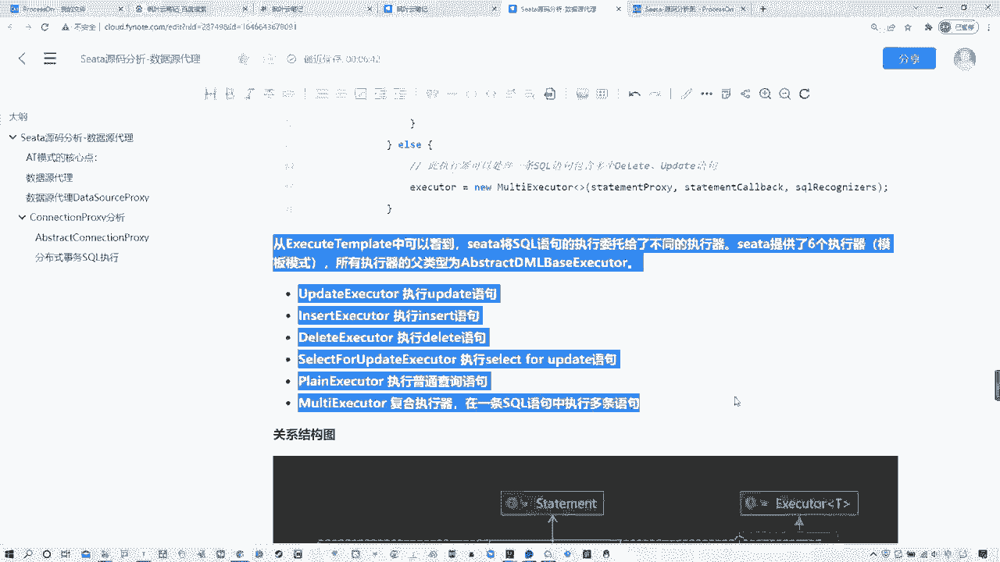
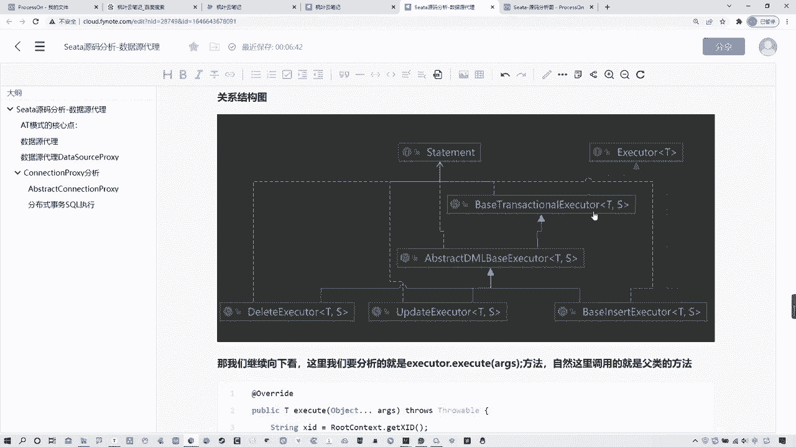
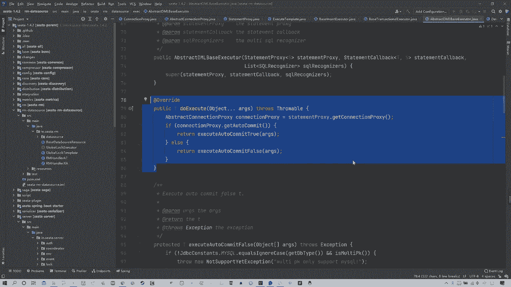
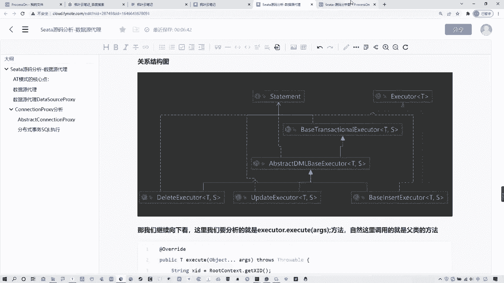
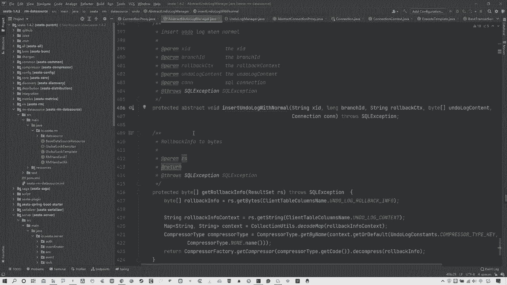
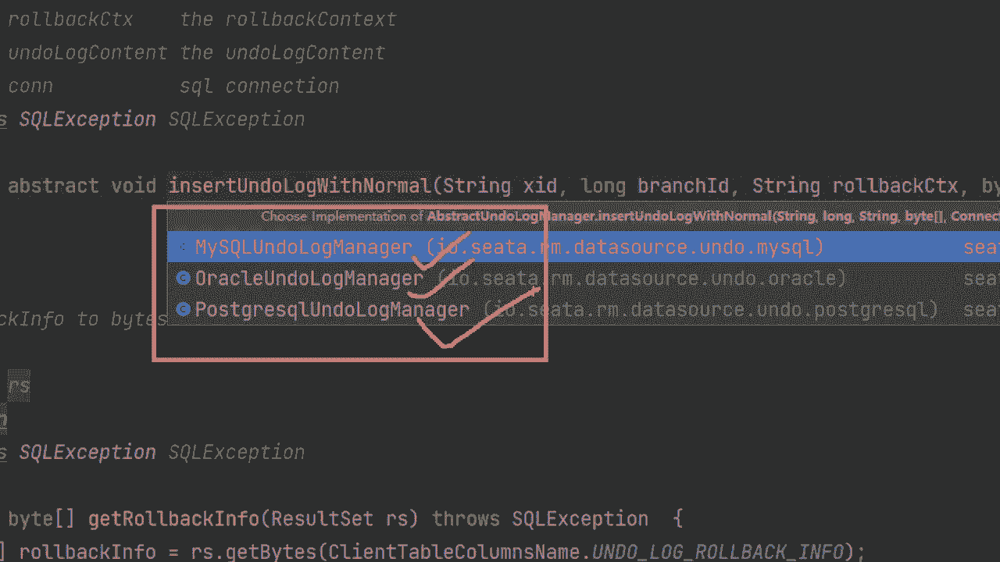
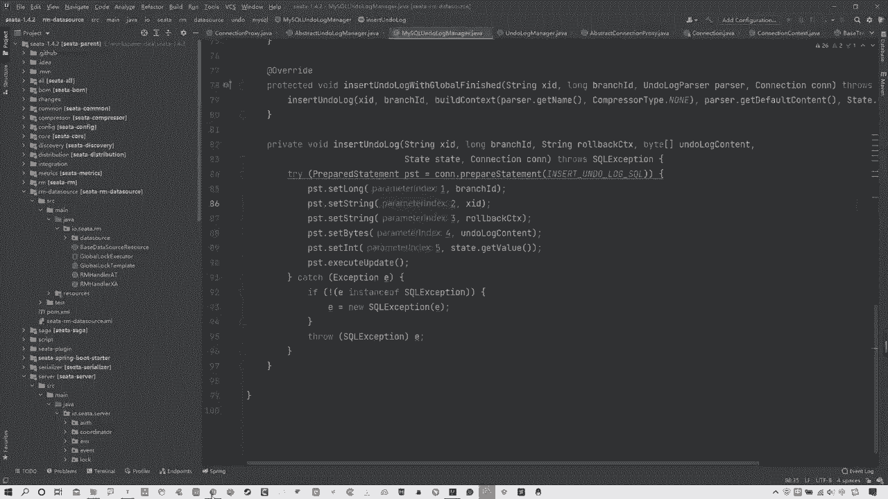
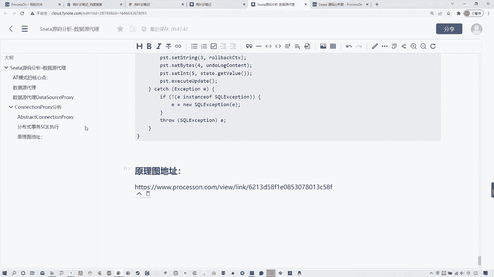

# 马士兵教育MCA4.0架构师课程 - P72：72、Seata源码分析-数据源代理-undoLog生成 - 马士兵学堂 - BV1E34y1w773

好了同学们啊，我们这节课来接着去分析这个theta的，数据源代理相关内容啊，那这节课的话我们就要去找一找它当前对应的，比如说你数据源代理，他怎么去生成的这些ando log相关内容啊。

OK那么先来看一下吧，啊那么在这啊，我们上节课就分析到了一个类型，叫做abstract connection policy啊，这个父类的抽象，父类的一个代理，在这其中啊。

他有对应的创建了create statement，Prepared statement，那么他最终这两个创建的类型，都是一个代理类型啊，是prepared statement proxy。

包括这个statement policy对吧，OK我们可以看上节课这个图啊，在这首先abstract重写这两个方法，重写的实际上是这个接口所对应的这两个方法，然后返回的是一个代理对象。

那么在这两个代理对象中，就对应执行SQL语句的方法啊，这也是人生的方法，我们可以看一眼来，就咱们就拿statement prepared啊，这个PROPOXY啊，说错了来举个例子。

你看这其中啊是不是有对应的，你看query update execute对吧，那其实这就是我们主要去看的对应方法对吧，它的对应所有的执行其实都是这样的，你不光是statement policy。

你包括prepared，Statement policy，它的执行方法也是这三个，这是最关键的对吧，OK那么不管是prepared还是sement statement来举例子，你看这里面。

他这最终所执行的是一个叫做execute template，点上execute方法啊，是通过这个timing的模板去调的这个execute方法，所以这是核心关键，我们就需要去看一下这个EXO的方法。

他具体做什么了，可以先看图，在这我给大家标出来了，其实这个叫做executor template，这个模板，它是根据你不同的SQL语句的类型来生成，不同的执行模板有哪些呢。

在这儿你像有update insert delete，包括还有这个seleful update是加锁的对吧，包括有个叫做ploying excel execute啊，这是执行普通的查询SQL语句。

这是原生的，包括还有一个复合的，那这里实际上我们比较关注的就是这三个update，insert和delete，所以这啊各位你们要记住，还有一点，就是实际上这个位置它应用的一个模式，叫做模板模式。

就是这是他具体生成的执行器，根据不同SQL语句类型，那么这些不同的这种执行的一个类型来说的话，他们有个共同的父类，就这个abstract dml base executor，这是那个模板模式啊。

这上节课我没提过的，从这开始是新东西对吧，所以现在我们就可以看一眼啊，首先我们先进到这个execute方法中，那return execute zk，首先核心方法就在这儿，那么这个方法上来。

首先会判断说当前有没有全局锁，而且是不是AT模式，这个不用多解释啊，再往下来说得到数据库类型，当前一定是MYSQL类型，然后注意看这个啊这个circle这个类型啊，我跟大家说一下。

你可以把它姑且理解为circle的语句解析器，那么它可以执行这个这个获得执行circle，通过它呀，还可以去获得对应的一些SQL语句的表明，相关的列名以及类型等信息，最后解析出对应的SQL表达式。

相信大家都知道，我们在讲这个AT模式的时候，说过它对应的这个什么呢，它对应的这种呃SQL语句在这个二阶段提交中，它是需要解析的，那么怎么解析的，就在这解析的啊，然后往下可以具体来看，在这啊。

比较关键的在哪，如果说这个位置啊，你看他没有找到对应合适的SQL语句解析器，那么它就会执行这个对应这个解析器，那这个解析器，实际上就是直接通过原生对象来执行，所以这个不用我多看。

主要是看else里面来看这啊，它有一个switch这么一个东西，它去判断你当前circle的类型，如果你当前是增删改查任何一项，包括这种枷锁查询等等啊，包括普通查询等等啊，那么只要任何一项。

他就会对应去生成一个执行器啊，可以看到这个insert啊，execute查询这音色插入的啊，还有update，还有delete，还有这个枷锁的，包括这种普通的默认的，默认就是普通的这种原声的执行。

OK包括最后他可以去处理多条语句，就是多语句SQL的，那么各位我们刚才为什么说它是模板模式呢，其实啊比如说我们可以看一下，你就看任何一个，比如说update这个你看啊他这个位置它的父类是谁。

abstract dml base executor啊，OK然后你再来看啊，还有什么delete，你看他是不是继承的父类一，就是这个啊，包括这个insert，这，他首先这个位置还有一个贝斯继承啊。

你看他是不是还是长，所以这个位置各位啊，要知道就是这些所有的我们关注的是这三个，insert delete啊，这个update这三个这三个对应的执行器，他们的这种父类型，不光是他们仨。

就是所有的执行器所对应的父类型。

都是那个abstract，也就从图中可以看到这个，嗯哪去了，Abstract dml base execute，他就是最大的，那有了这个模板，我们就很清楚的知道，也就是说当前我这些对应执行器里面。

所执行的语句，那么有一些共同的方法都在这个模板类型中，OK那我们就可以往下继续来看啊，当然我说的这些在我的笔记中都有体现在哪呢，给大家露一眼啊，或者你们复习好，复习啊，就在这看到吗啊那这不多说了。

然后在这啊给大家看一眼笔记中，我给大家去找一个关系图，就是当前我们整个的这块一个类型的关系图，你可以看到啊，Statement，这是最大，上面包括还有个ECUTOR。

那么你这个位置你可以看到delete update，是不是都从哪来的，base instant base呃，这个这个insert execute是不是也从这来的对吧。

OK然后这个abstract还有一个上级，就是这个base transitional execute。

所以各位要知道这个关系，那么现在我们就可以往下继续观看这个代码啊，它最终执行是在哪，是在这，那也就是说白了当前这个executor点上，execute方法，这个方法就是你具体选择，比如说是插入。

比如insert，OK咱拿他举例子，当前你语句类型为insert，那么找的就是一个insert execute，那么就是通过这个具体的插入执行器，来调它的execute方法好。

那么现在我们来找一下这个位置，调的就是负极帮八，当然啊他这个位置调的是最大的那个负极base，这个啊走看一眼，在这其中他做了什么事呢，往下看啊，在这个位置execute进来以后。

你看首先他去拿到对应的XD，这是个全局id对吧，OK然后获取XD这个位置statement proxy，我们现在不用它执行了对吧好stephen proxy。

等点上get connection proxy啊，点上BD去绑定当前的这个叉id，也就是说把这个全局事务id给他绑上，然后再来去设置全局锁，那么就证明你当前的这个全局事务加上了对吧。

这是个标识嘛对吧OK好，那么全局事务这些关键的东西加好以后，这个位置有个叫做do execute方法，这个方法就是我们比较关键的一个方法啊，可以往下继续看，但但但在这之前我跟大家说一个事儿哦。

大家一定会发现一个问题，就是如果你看过spring源码啊，你会发现什么execute啊，Do execute，包括后续我们可以看到commit有do commit，这个方式跟spring非常像。

所以我建议大家，如果说你之前没有看过源码，你最好是把spring的源码看一遍，把它理解透了以后，你再看这些源码的话，其实大同小异好吧，OK啊，那么可能说它的意思一般都代表说。

你这个execute是一些具体操作前的设置，到do这个位置是具体执行这个do，这个位置具体执行找的是谁呢，你可以看他是个抽象方法，那么当前这是个最大的分类，这个抽象方法是由谁来实现呢。

就是刚才我所说的一个模板，Abstract dm base executor，OK找的就是他，所以来看在这就是我们这个具体的执行方法，看到了吗，嗯然后在这个位置各位注意看啊。

我先给大家看图啊，到哪一步我先跟大家说啊。

到图中的哪一步啊，你看首先绑这个execute，绑定id，设计设置全局锁啊，就此方法是用来判断当前要执行的SQL语句，那么执行哪个具体的执行器啊，然后子类重写。

这个子类重写是不是我们的abstract啊，然后这我要问大家一个问题，这是关键了啊，注意看你们要知道当前我们这种啊数据库，就是MYSQL，它是自动提交事务，是自动提交，或者说我们写语句的时候是自动提交。

还是手动提交，这一点相信大家应该都知道，我们MYSQL举个例子来说，我们再写一条查询语句，或者写一条insert或update语句的时候，是不需要在我们就是我们写完，比如说写个select语句。

没开放大镜稍等啊，比如说我们写一个select语句以后啊，S e l e c t，这应该都知道吧，这是比较基础的东西，我们是不需要自己写的，Commit，我只要回车就能看见我查询结果。

比如说insert就能看到我插入的结果对吧，所以说白了从这我们应该就很清楚的知道，这也是比较基础的内容，就是MYSQL这个位置他都是自动提交的，所以你可以看当前这个具体执行的方法。

在这是不是有个return executor，auto commit true和commit force把参数传进来，那你想我们当前是自动提交，那是不是应该走的就是这个commit true。

OK所以在这我们进到这里，方法好，进到这了，那我们可以看一下到哪了，现在现在走到这自动提交这对吧，走到自动提交日了，OK那么现在我们就可以观察，在这个自动提交的这个位置，他具体做了哪些内容啊。

我们仔细来看啊，首先在这儿啊，在这之前我先说清楚，各位你要知道，我们这2PC阶段是在第一阶段与这个数据库，就不配与这个TC交互以后，那么他再去提交的时候，最开始最开始这个事物是没有直接提交的。

所以他需要做一些相关在提交前的一些准备，比如说啊啊记录信息，这些乱七八糟的东西都包括在第一阶段的时候，你本身在提交以后，你需要去得到一个具体执行结果，你去把这个结果去告诉这个TC，然后由TC来通知你。

你是具体的一个执行还是回滚的，提交还是回滚对吧，所以当前这个位置你要知道，在这儿他并没有真正的去做执行啊，去做这个这个提交，为什么这么说呢，你上来第一句话，Connection policy。

点上auto commit，我们可以看一下这个auto commit是干什么的，这个不用管它，就来这个set auto commit，你看他传了个false。

相信大家应该都知道这个set auto commit什么意思，我们可以看一下来看这这是原生的connection，原生的给的一个方法，这个方法，说白了意思不就是是否开启自动提交吗，对吧。

如果你这个位置传的是个false，那你回过来看这啊，哎回哪去啊，回到这儿啊，你看他这个位置传过来的值为false，那是不是证明，说白了把当前的自动提交模式，改为了手动提交模式，为什么这么改呢。

是因为这个位置，我们先不让他真正的去完成提交对吧，OK那么改完真正的提交模式啊，不是改完手动提交模式以后，再往下来看看，这关键点在这啊，调用手动提交方法得到分支的业务最终结果，你看这方法是什么。

executor auto啊，Commit false，那这个方法的话，你看他干了什么，也就是说在你真正去提交前，他做了一些事情，首先你看before image是不是快照的意思啊。

这个快照就是我们那个前镜像，就是执行SQL语句之前的前进向啊，就是那个undo log中所记录的那个前镜像，用于回滚的，那么还有一个after image，这是后镜像，而这句话result等于什么塞啊。

这个这个statement call back，点上这个这个这个呃iterator这个位置，我可以跟大家说啊，他就是来具体执行业务了啊，这个位置就是具体执行业务了，哎具体执行业务了，这就不用多说了吧。

啊，执行执行我们具体的业务不是业余啊，业务打错了，OK然后还有就是这一句话，就是呃prepared undo log，看到了吗，然后把before image和after image传过去。

可以看一下它是什么，他这个位置这个prepare它实际上是把它存到了，你看before哦，我看一下不是空啊，这是判断它实际上是把它存下来的，啊先不看这吧，这个回头咱们后面看，后面看不着急不到这啊。

你就记住他这个位置实际上是暂存，安卓logo是不在commit的时候再去提到数据库，他把目前的这个数据先保存下来，前进向和后镜像，我先给你保存下来，暂存好吧，OK啊那咱们接着说。

那现在我们就找到关键点了，哎什么关键点，首先在这个位置的时候，我先把它改为手动提交，然后调的是一个什么手动交方式，把前镜像和后镜像要搞出来啊，但是这个语句最终还没有真正提交呢，真正提交在哪儿。

是在这儿的，Connection proxy or commit，这是真正提交对吧，OK啊，所以说我们可以看图总结一下，在这个图中给大家画出来了，在这儿上来，比如说我们这首先啊你看啊。

这个这个这个到这都是把自动提交，这然后呢把当前的自动提交改为手动提交模式，然后这个位置他做了几件事情，就刚才咱们看的那儿啊，手动交方法，这首先生成了前镜像，然后具体执行啊，执行具体业务，然后生成后镜像。

然后暂时储存镜像，为了后续真正写入数据库，就是把你的undo log中的一些前镜像，后镜像就两个快照去写入到你的那个数据库中，所以这个最终目的是为了得到执行结果啊，得到一个执行结果。

就是说你SQL业务执行完以后，你就是那个本地的那个分支事务的执行结果，OK那么现在把这个执行结果完，完事以后再回到这，我们下来接着看，再往下看的就是这个connection policy commit。

这个connection policy commit到哪，这才是真正的去执行提交啊，这才是那个真正的去执行提交，我们可以再往下来看啊，直接进到这个拷贝的方法中，现在前进向后定向是不是找的对吧，好啊。

没关系，一会会找他车怎么写，咱们先往下看it走，然后你来看啊，进入到这个commit方法中，在这还有一个do commit，那这个就是跟spring源码的方式就非常类似了啊，如果你阅读过的话。

你应该很清楚的知道，所以很明显就直接往这里进do commit，看他干什么了，OK来看这进入到这个读卡密的方法中，首先他判断你是否存在全局事务，你看in global transactional。

他这个就是在这啊，说白了判断有没有查id，如果你插id不为空，就全局事故对吧，OK那很明显，我们现在走的就是这proxy global transactional，这个这个这个commit再往里进走好。

然后进入到这个方法，我们先来通过看一眼，进入到的是这是这个方法对吧，OK这个方法它实际上干了三个事，第一个是注册分支事务，生成分支id啊，说白了这个位置就是真正去注册分支事务了，去生成一些分支id。

然后第二点还做了一件事，就是去真正的写入这个undo log，然后最后才是执行提交，也就是告诉结果是把这个数据真正提交起来啊，OK所以咱们可以先看一下搁哪啊，第一件事情在这呢，REJECTOR走。

你看他干什么了，logo这个不知道是这个id，它代表的就是分支，然后他通过这个default result manager点get点by rejector，这个方法就是注册分支id。

注册有哪些模式相关的这个代理，以及这种资源id等等一系列的相关内容，他把当前的这个分支id给他注册进去了，OK这是注册方法好，再回来往下有一个写入数据库，写什么，把undo log真正的去写进去。

可以看核心方法在这fish and log啊，然后最后你看这执行原生提交，这不就是一阶段提交吗，对吧，你看这target这个connection是谁，就是原生的connection。

然后呢在这调了一个方法叫commit，commit是谁，原生的commit，提交方法是不是在这是真正的提交啊对吗，OK那么现在我们要关注的是数据源这一块，那么数据源他最后要写入那个analog前镜像。

后镜像，所以在这我们要关注的就是这个flash方法，Flash undo logs，走往里看看这个方法干什么了啊，当然这个位置是一个接口，还有实现类，那么对应的实现类就找到他。

在这flash undo log，我们可以通过这看一眼来，在这flash undo log，然后再往下找找哪个方法啊，首先咱们先去先看一眼，在这个方法中，你看首先干啥了，都上来string xd啊。

Connection content，获取叉id，分支id等等相关的一些信息，看到了吗，相关的一些信息，undo log set什么什么什么什么undo log，怎么着呢，是不是拿到相关信息啊。

然后这些啊拿到以后真正写入数据库的位置，在这有一个insert up啊，这个这个undo log with啊，这个方法有没有方法，那你可以看啊，超级参数，什么XDBD啊等等这些东西。

那你可以看一下这方法怎么写的啊，当然也可以看到这是个抽象方法。

它也需要具体的实现类，那你来看这仨实现类都是啥，My circle oracle，还有这个不同的对应的你的这个数据源。

你是MYSQL的类型的数据库，还是oracle的还是什么的，当然这个位置很明显，我们目前用的就是MYSQL，所以直接去找mysql undo log manager就行了。

然后你再看这个insert方法，其中调用了一个叫做insert undo log方法走，你来看这干啥了，这是不是就是最终去写入相关的那个XD，不是那个undo log，那个那个写入方法。

就真正去往数据库里写的那个范儿对吗，所以在这个位置，是不是就把相关的所有的这个undo logo中的表，中的数据写入进来了对吧，这个这个这个很熟吧，这个不能说不认识了对吧，OK好，所以分析到这里。

我们就很清楚的知道这个数据是咋回事，这个数据最终是怎么写去的，OK我们就全分析清楚了，可以看图再总结一下啊。

来这个数据这个位置我们最开始是从这过来的，然后呢绑定元素以后都这个啊，不是绑定元素，绑定XD以后进来子类重写，然后自动提交，自动提交这个位置改为手动提交，就说白了先不让他提交。

然后把对应的这个调用手动提交方法，首先生成前进项去执行具体业务，生成后进项，那么这个时候生成前进下，是为了保留这个之前的数据，执行这个具体业务就是执行你当前分支事务。

那个具体业务生成后镜像就是更改之后的数据，然后暂时去储存这个镜像啊，去为了后续真正去写入到你的数据库里面去，所以这个位置再往下再走，真正的一个提交执行，找到do commit，写入原声啊。

写入这个undo log，然后并且执行原声的提交，首先注册分支，然后通过对应的这个方法，这个fish方法来写入，写入完以后真正的去执行commit提交啊，这个时候commit提交以后。

就会有对应的结果去告诉服务端，成功还是失败对吧，然后这个位置往下怎么写入呢，走的是flag这个flash这个方法执行，具体SQL我给大家看的是通过MYSQL实现的那块对吧，OK这就是我们数据源啊。

theta数据源源码的整个的分析，那就分析到这里好吧，各位各位这张图发给大家啊，我现在就发给大家分享，OK那么都在我这个笔记中的，最后都在这个笔记中的，最后我这样给大家写一下啊。

在这个风云笔记啊写一个原嘿漂亮原理图行了，原理图地址，OK在这好吧，你们直接去打开这个链接就能看到，我给大家画一张图，通过那个自己再捋一捋就可以了，好吧，各位OK啊，那咱们这节课啊。

SA的这个数据源代理。

