# 系列 5：P73：73、Seata源码分析- Seata服务端（TC）源码解读 - 马士兵学堂 - BV1E34y1w773

Hello，同志们啊，我们这节课来继续讲解这个theta的源码啊，稍等一下，我把它调一调，OK啊，嗯这节课的话给大家讲一讲，我们这个theta的服务端，也就是TC相关的一个源码的一个阅读呃。

因为这段时间各位我们一直在讲，他客户端相关内容啊，包括我们从最开始的这个稍微缩小一点啊。

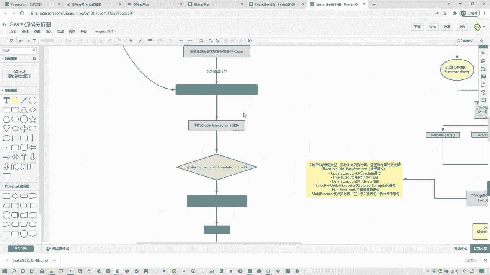

从最开始的哪儿呢，这个它对应的一个自动装配，找到这个全局扫描的注解，然后包括这个什么abstract out to prosecreator，然后它的一个重写的方法，然后再去程序启动的时候呃。

事物发起时所调用的一个invoke方法啊，然后到解析注解以及对应的处理，当我们找到这个啊这个execute方法，最终执行我们这个整个核心的几个步骤，全局事务的几个步骤，包括获取这种事务信息。

然后他的一些操作，包括执行全局事务和他的一些操作对吧啊，去什么发起与TMTC发起请求等等这些，然后呢包括这个呃这个commit，整体的这个全局回滚或提交对吧，然后呢啊全局回滚到最后的提交以及清除资源。

这个位置，是我们之前所看到的整个非常核心的一块内容，什么内容呢，就是我们的呃全局事务提交整个流程，那么之前我在这讲过说在第四部commit的时候，他需要跟theta server端进行一个调用。

那么调用以后呢，我们需要去找到sea server端相关的一些内容啊，就是说呃，这节课我们要分析的就是去开启这个全局事务，提交以后，如在theta server端，它是如何进行调用的，还干了什么事啊。

这是我们这节课主要分析内容好吧，那么废话不多说，我们就来实际分析啊，当然我们可以先找一下哪个类型啊，先找一下，我们先看一下，来找这个handler，这个啊我们来到源码这啊，搜索一下，OK好。

然后我们来看一下之前给大家讲过这个过程，什么invoke，从这开始对吧，OK然后呢到他整个执行全局事务，从这开始，Handler transactional，然后进来啊，然后再具体的步骤我来看一下啊啊。

合理去聊，超时时间，然后这是最开始的构建信息执行一场，哎不是我哪去了，我来看一下啊啊啊在这在这看错了啊啊，Hler global transactional，这找cute方法，从这进去。

OK然后呢我们可以看到它整体的执行流程，第一步去获取事物信息，然后这是第一步相关的操作对吧，这个我们都讲过了啊，然后到哪第二步呢到的是1。3，第二这个位置开始执行全局事务，然后第三步发生异常。

全局回滚对吧，然后进行安do log的补偿，包括最后的第四部提交资源啊，全局提交啊，然后以及最后的清除资源啊，当然这个位置，我们其实实际是从这儿可以去看到，从这儿开始提交全局事务去调用我的服务端。

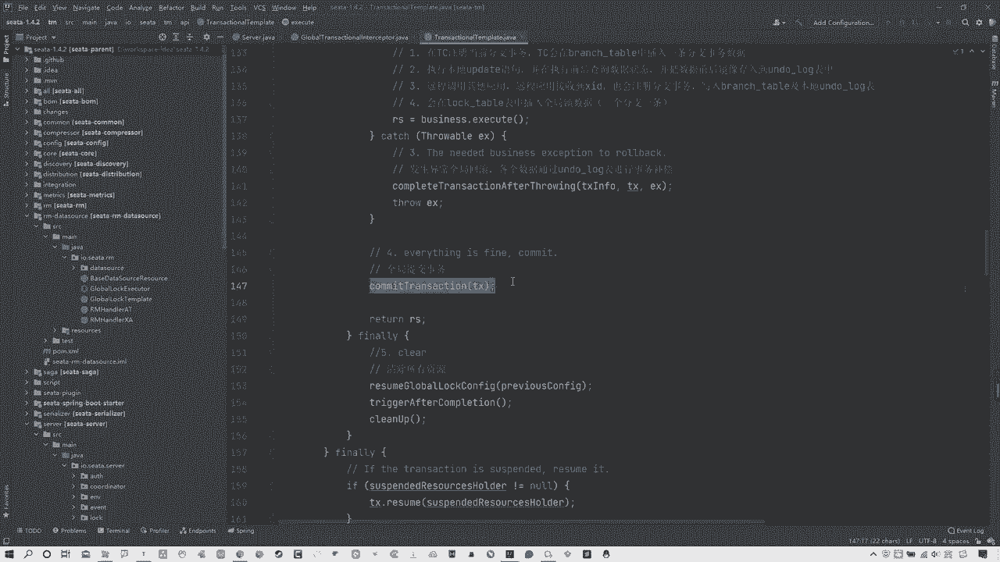

那么服务端的话，各位从图上来看怎么去找啊，实际上它的服务端是这样的，呃，我们这个服务端，是我们在这个我们自己电脑上配置的，那个theta server端对吧，这个应该都知道我们之前装过啊。

带大家去应用的时候，大家去讲过sa sub端，那么这个C的搜索端，它实际上本质上它也是个项目，它也是个spring项目，而且各位你们要知道一点，关键就是不管任何看笔记啊，就是我这写过了，说就是我先说啊。

不管任何的这种牛逼的项目或者牛逼的框架，它的这个都是java项目，java项目的主体动类肯定是灭啊，幂函数，所以一会我们去找就找这个函数啊，所以这点不要着急，我们一起来看一下啊。

然后现在我这还要解释一个事，就是我们服务端所做的一些事情，那这个位置的话，我需要把我的数据库开一下，我先解释一下这个位置，有一点啊，有几点我需要跟大家说一下啊，稍等一下哟，哦这个不要不要不要着急啊。

我那个服务掉了，这个电脑内存有点不太够使，稍等一下啊，服务我来找一下我的MYSQL应该是关了关了，把服务器下好了，然后咱们回到回到数据库，这回到数据库，这再点一下好。

我们之前去构建这个theta server的时候，去创建过一个表，一个库就叫theta，在这个theta中有三个表，靠这来啊，brush这个这个table global table，还有LOTABLE。

这三个是什么东西，各位还记得吗啊可能同学忘了啊，所以我给大家回忆一下，这三张表，实际上是我们sea server端所用到的三张表，在这给大家看一下，在我的笔重啊，在这第一个实际上它是分支事务表。

也是它进行存储你的分支事务相关信息，第2global table是什么全局事务表啊，还有一个就是logo全局锁表，所以这是这三张表的作用，也就是说白了我们全局事务在开启的时候，它是需要对这三张表。

进行相关的一些信息的填写的，前提是你使用的是dB模式，也是数据库模式，当然各位应该都知道，我们之前讲过theta是分为这种呃文件模式嗯，还有dB模式，数据库模式好像还有个release模式。

我们目前用的是数据库模式对吧，所以这张三张表是我们自己构建的，OK那么我们现在说完这点了，刚才也说过，就是任何java工程的启动程序都是主函数命，所以现在我们就要从这入手，去看一下整个的构建过程。

其实我们今天主要看就是个全局表，好吧啊，来那我们就找一下啊，这个我就不给大家去现找了。

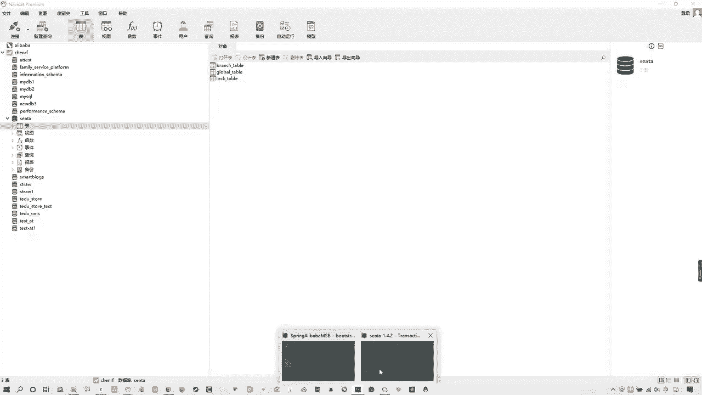

就是你们全局这个暴力搜索一下，搜索找到这个密方法，它实际上是在server在这里面的，type server在这里面啊，在这里你可以看到方法在这对吧，main方法在这，然后在这其中我们要找一个关键点啊。

在这他就是那个关键点，默认的调用者不能叫调用者，叫默认的协调者DEFCONVERDINATOR啊，那么这个东西的话是我们就可以从这儿去进行。

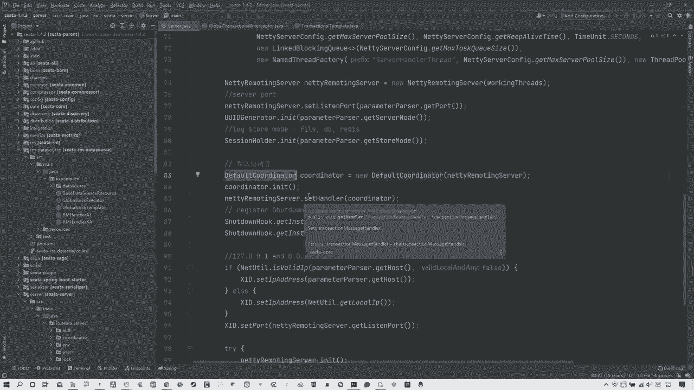

去查看啊，包括从我的这个图中，你可以看到这标出来了啊。

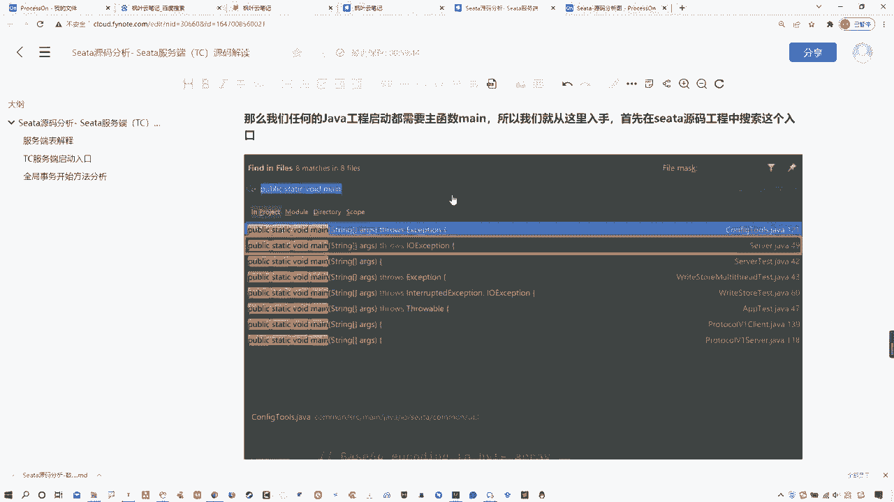

不是这个图啊，从这个图中可以看到啊，到c c a Sol端，找到这个默认的协调者，然后去找这么个方法，叫做do global begin，你可以往下来看啊，在哪儿啊。

在这在这个默认协调者中有一个叫做do global begin，从这开始是一个处理全局事务的开始，那我们首先看一下这个方法里面具体做什么了，第一件事情你看响应客户端查看到了吗。

response点set x i d去把对应的XD响应过去，哎那实际上关键点就在于哪啊，咱们先不着急看啊，先看这个，这是个do global begin，还有什么，Do global commit。

全局事务提交，还有什么do global roll back，全球事务回滚，包括全球事务的一些状态等等一些其他信息，这三个是我们比较关注的对吧，当然今天我们主要关注这啊全局事务的开启，他怎么去做的。

我们往下来瞅啊，所以在这首先啊你可以看这有一个靠点begin，核心begin，从这开始，我们从这看来走，OK看到这个begin方法啊，在这个begin方法中，他做了哪些事情呢，我们一点点来分析。

我们一点来分析，那么你看这个比例方法中啊，上来第一件事，global session session等于global session，点create global session，这干啥呀。

实际上它是创建了一个叫做全局session，从图中我们可以看到就在这啊创建了一个begin，在构建一个全局session，这是第一件事情，那么第二件事在这还有session ADD session。

listener是什么东西啊，那么各位要注意中间这个词什么意思，Life cycle at session，life cycles listener是啥呀，首先这是一个添加一个监听。

而且这是个观察者的设计模式，同时这个位置life cycle它代表的意思是什么，生命周期session at session，Lifecycle listener，说白了是干什么，就是给他去添加监听嘛。

那么还有就是一件事，再往下看啊，全局事务开启session点begin，这是一个全局事务开启，那么这这三件事儿啊，我分别在这个图中给大家列出来了，这也是我们主要分析的三件事。

第一件事情构建全局session，我们看到了，这不用多说，很简单的事，然后第二点就是为全局session去添加监听，那么第三点是调用调用全局session点begin方法，来开始对应的一些具体处理。

所以啊第一步不需要分析，我们先来分析，第二步就是为全局session监听他干了什么事，所以从这开始啊，从这开始at这开始，OK啊，那我们从这开始对吧，OK啊，那么在这之前我们还是先看一下吧。

这个固定全局session啊，其实他所谓这个固定全局session就是把金刚application id，包括transactional service group group分组。

包括name time out，把一些相关的信息传去，它，构建全球session的目的，就是为了相互能够去进行一个啊，session的目的是什么，相互有个信息的互通对吧，OK所以这不用多解释。

再往下来看看这啊，那么session点i session啊，leaf这个东西，listener我们可以看这啊，他是他在这个位置去干了什么啊，其实啊在这儿我们可以看它session holder点上啊。

get root session manager这个位置他做了些什么事情，他实际上是获得了一个全局的session管理器，那么各位可以注意到的是，他虽然说这写的是获得了一个全局的session管理器。

这个session管理器到底是谁呢，这有个常量root session manager，我们可以看一下，是常量啊，你看它的默认值是session manager，这是个啥，这是个接口对吧。

OK那么它是怎么去构建的，是谁的，具体这个session管理器是谁呢，其实可以往下来看看它的初始化方法的方法，那么在引力的方法中往下来搂一眼啊，看来他上来这都不用管啊，你就看这来啊。

这个是一个模式的判断，这是个模式的model model，其实这个位置他是去读取你的配置文件，来获取你当前的一个什么sat的模式，而很明显我们当前的SA就是个dB模式，所以说你看当前这个模式。

如果是dB，那好我们现在这个位置是equals嘛对吧，如果是dB模式的话，那就走相关这个位置啊，如果是其他的file模式，走的是file相关的，那么还有如果是REDIS，那走REDIS的，看到了吧。

它是根据这个模式去读取对应的文件，然后来拿到你具体的那个真正的什么session的，一个全局的这么一个管理器，OK所以很明显当前我们是dB模式，那我们就看这，然后你看啊。

我们要找的那个常量值叫做root session manager，然后他这是读取了一个叫做session manager class啊，如果是dB模式获取名字，他这个位置实际上如果各位你们自己来看的话。

其实你们应该能看出来，它实际上采用了SPI的机制，却读取了对应的接口实现类，那么它读取的是哪里，它实际上读取的是哪啊，读取的是当前这个resource中，对应的这个文件下的。

一个叫做dB模式的这么一个文件，在这看到了吗，啊他读取的是他，所以咱可以看一下走啊，在这其中你就可以看到哎我看一下啊，是不是这个文件，哦不对，Sorry，看错了，不是他啊，不是他啊，他读取的是这个。

看错了，这是这是data source provider啊，这不是他啊，看来他读取的是这个session server，Session。

session manager在这里面所记录的对应它的一些专门的类，不同类型的一个实现类，你看啊有failed文件的实现类型，session manager有database，数据库类型的。

还有REDIS，很明显这个位置我们是database对吧，所以当前这个位置我们再回来回到哪啊，回到就是他在往下翻找了个哪来着，这个这个这个这个INIT往下，算了看别推进了啊。

就这啊这个方法这个root是谁啊，那不就是我们看到的这个对应的配置文件中，这个吗，是不是database session manager，OK所以在这我给大家去记录了，说去添加全全局这个监听以后。

那么然后呢，这个位置啊，还要去通过SPI的机制去读取对应的session，的一个持有者，这个session的持有者，实际上就是我们读取到的这个文件。

也就是dB模式返回的是他database session manager，所以当前我们这个管理者就是他，所以当前第一步构建了全局事务id，第二步干什么，获取了一个啊。

这个这个去为这个当这是个观察者设计模式啊，去添加了一个对应的创建了一个database session manager啊，添加监听，同时找了这么一个管理者对吧。

全局session根据你的这个类型去管理的，我当前数据库也行，所以找的是database，然后再来就是全局事故的开启，那么就再关注这往下走啊，session点begin走。

OK那么进到begin这个方法以后，你看他干了什么，这个方法首先声明全局事务开始，为什么这么说呢，你看当前全局事务状态，你看global status，点begin begin，实际上就是个开始状态。

OK他是个开始状态，然后当前的开始时间以及激活全局事务，active状态为true啊，然后将当前的这个session manager去放到这个集合中，去调用它的什么on begin方法啊。

去掉它的on begin方法，所以这个位置啊，我们现在就来看一下这个begin方法啊，需要去进入到哪，进入到这个on begin方法，这是关键走，当然这个位置啊掉的是谁啊。

这个位置有个父类叫做abstract session manager啊，这个abstract session manager就是它相关的一些session manager的父类，所以我们现在就找到他啊。

on begin有个叫做EGLOBAL3神啊，那么现在我们可以看一下这个at global session，在这又干了什么，往下看往下看啊，当然这个位置啊，其实如果你直接进的话，它是负类的。

那么这个位置你要想刚才我是不是说过了啊，在这个位置哪去了，哎哪去了，回来回来回来回来就在这啊，我是不是在这搞了一个叫做什么那个，这个东西data database session manager吧。

找到他，所以当前我们在abstract session manager中去调用，这个at global session方法，它应该是谁，是不是就是我的database这个而不是fire或REDIS。

因为当前是database模式，数据库模式嘛对吧，所以找他在这进去，在这实际上真正去执行的方法是这个。

也就是我的database session manager所执行的这个at global session方法啊，添加这个方法，那么这个方法它具体干什么呢，首先第一件事情写入session啊。

写入相关session在这right session对吧，OK然后关键点就在于这，我们走看这个RELEASESSION啊，当然这也是一个需要去找他的一个实现类啊，也是这个database的啊。

一定是database的，因为现在数据库模式就是它好走，这那么你走到这个写入方法以后，来看他干了什么，当前这个位置他判断说啊，你这个是否是啊，第一次写入，如果你当前我们一定是第一次写入，因为刚开始调嘛。

如果你当前是第一次写入的话，你看他一定是走的insert啊，如果你你如果不是的话，可能是有修改，有删除，有其他的，但当前我们第一次进来。

一定是insert global transactional d o走，这对吧，那再往下看，我就看看这个sert global transacd是干啥的，当然这个位置还是需要对应的时间来看一下。

看这干啥呢，这个东西是不是就很明显很直接了，他是不是就是去真正的写文件了，写什么往数据库里写东西了，那么它往哪个数据库里写啊，有对应的一个类型，Global transactional dio。

看一下这个类型，string child l啊，这个这个transactional id，Status，application id等等这些，你看看这些跟他是不是一样的。

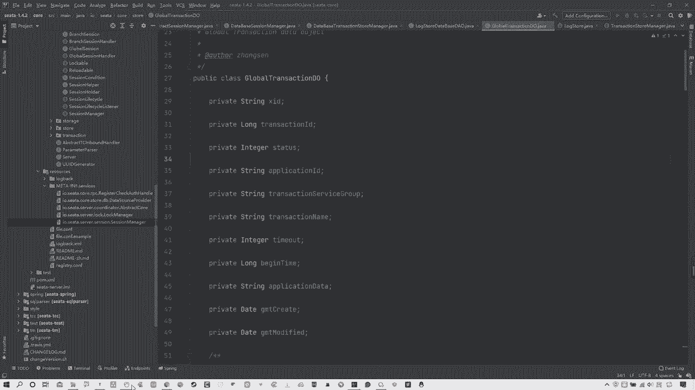

跟他是不一样的，前四个是不是对上了。

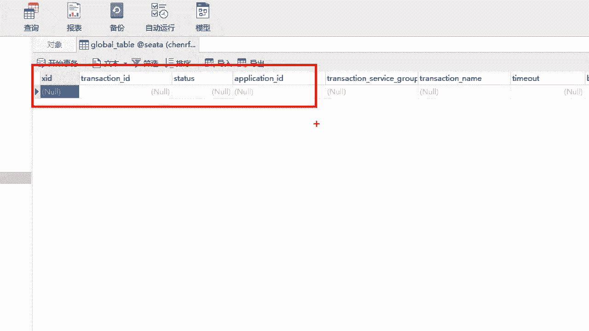

包括后面service group是什么对应的transitional name。

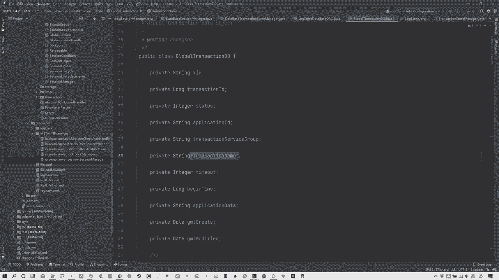

是不是对，所以分析到这，各位明白咋回事了吧，啊咱们看图来说啊，这个位置调用全局session，实际上就是调用负极的on begin，然后走的是database session manager啊。

是我们那个dB模式的，然后进入到dB的储存模式的这个write写方法，第一次进来一定是向当前这个音色去写入数据，写的就是你这个global table表中的数据，也就是去记录一个当前的全局事务。

所以这就是我们这个位置，全局事务提交的时候干的事，就是在你当前的这三张表中，哪三张表啊，刚才课本笔记中说过，这三张表中在全局事务表中去记录一条数据，证明当前有一个全局事务进来了。

这就是这个位置的交互相关内容，当然今天我们主要分析的就是这个global table。

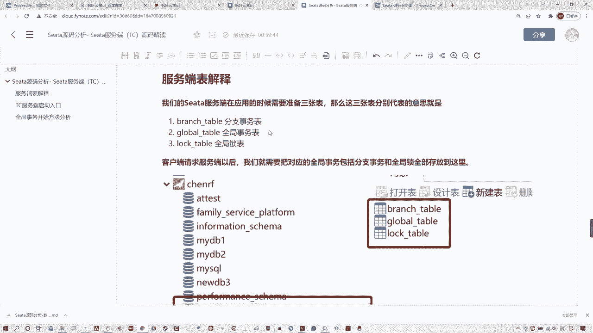

这张表能理解了吗，各位OK，那么讲到这的话。

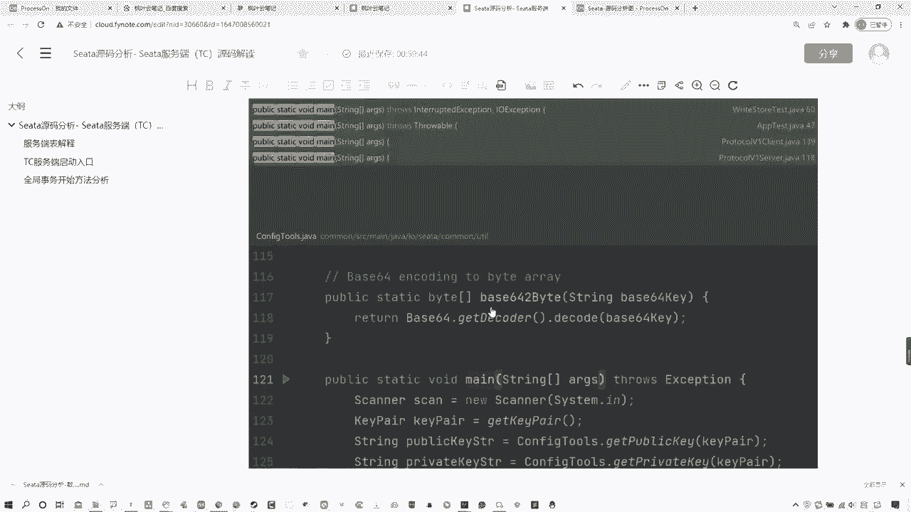

其实这个事我基本说完了，整个流程我在这个笔记中都有记录，你们可以去按照这个笔记再过一遍，包括这个图也会给大家啊，它其实非常简单，就是服务端开启以后找这个默认的。

然后去找这个do global开启全局事务，然后对应的begin方法做了三件事，构建全局session，为全局session添加添加一个监听，那么这个位置实际上找的就是一个叫做database。

什么session manager这么一个呃数据库模式的一个manager，然后再去调用全局session的时候，它调用的方式，其实最终的最终干的事，就是去向DB模式储存全局事务的那个表中。

去写入一条数据，证明当前有一个全局事务，当然你们要知道是这个东西在最后写入完以后，为什么我们在这个表中看不到相关的内容啊，就是我们这个数据库的表中，为什么看不到相关内容，是因为他每一次执行完成之后。

会把当前这个表中所有内容清除掉，他也就是一个记录的事，好吧各位啊，当然其他的这两张表道理其实差不多啊，就是其他这两张表，一个是，分支15，一个全局锁，这两个其实差不太多，道理都一样。

所以这里就不详细分析了，我们主要分析就是这个全局事务表明白了，各位啊，这就是服务端交互，这个时候啊。

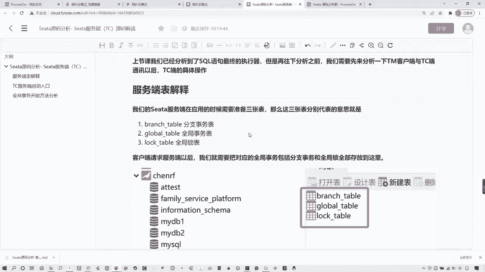

尤其是服务端交互这个位置，他所干的事就是全局，全局事务提交以后，他干的事就这些好吧，各位啊。