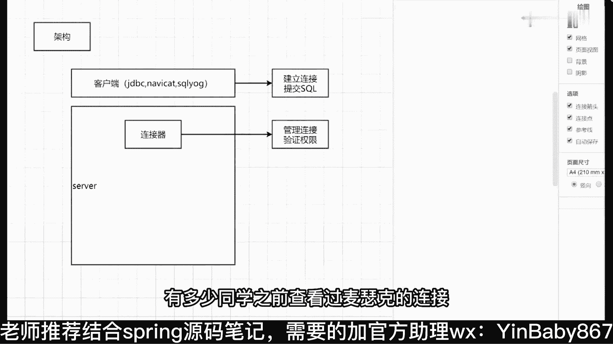
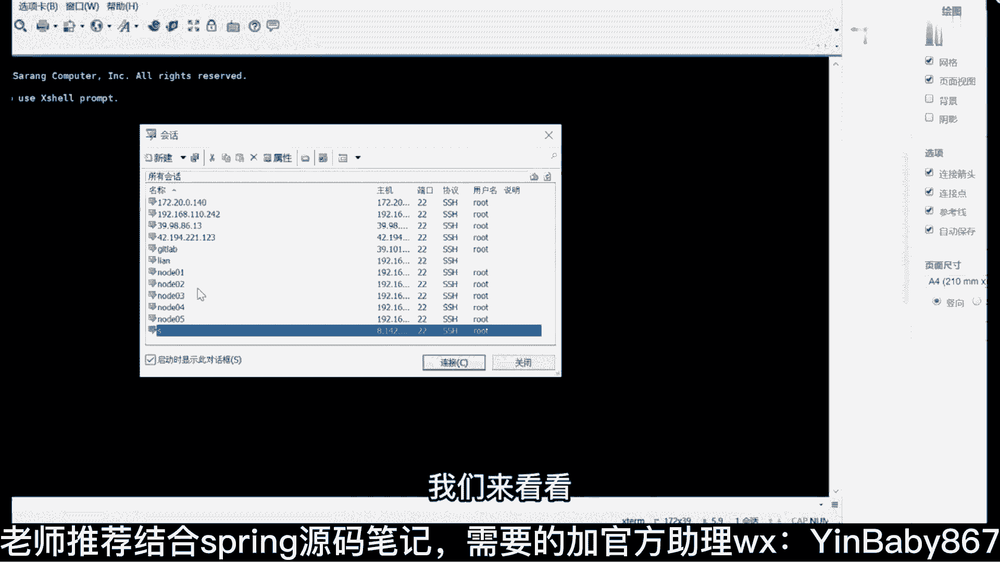
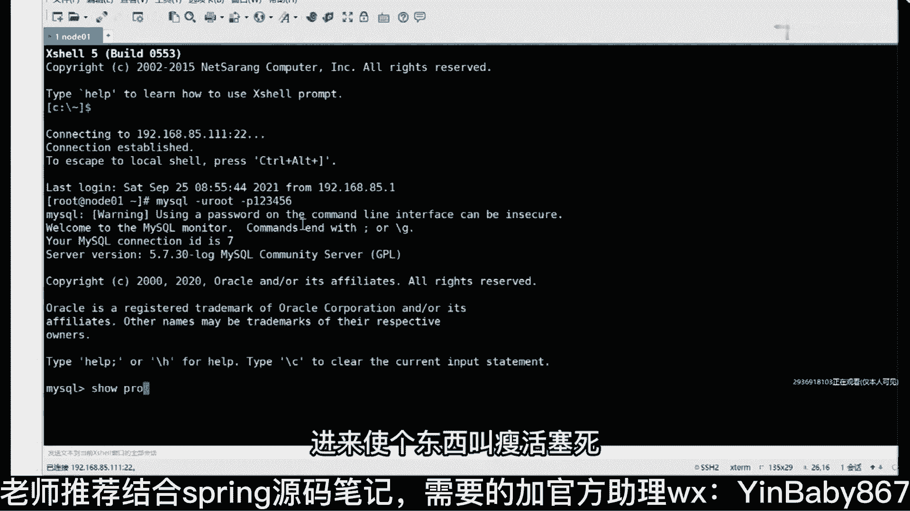
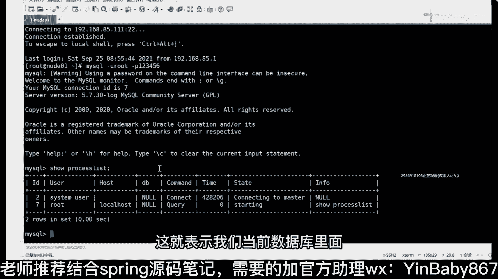
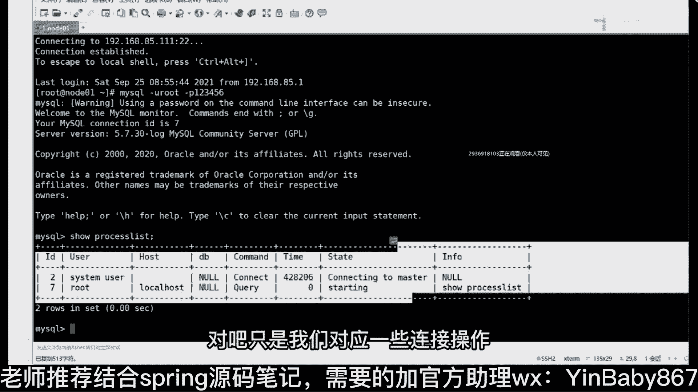
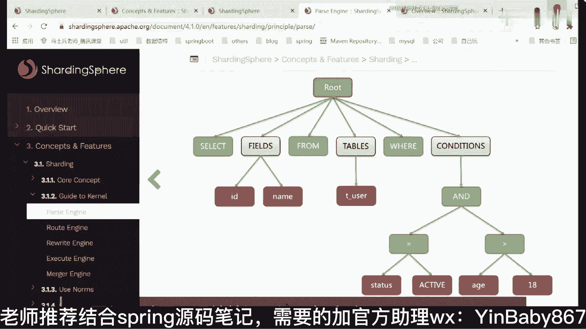
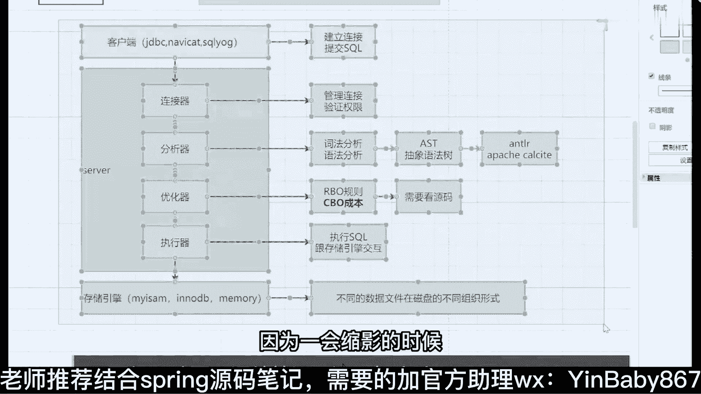

# 马士兵教育MCA4.0架构师课程 - P74：74、深入剖析MySQLl背后的架构设计，带你充分了解MySQL的架构设计 - 马士兵学堂 - BV1E34y1w773

呃这个东西啊，我先说一下，你连了他之后，对你对于MYSQL调优也好，还是对MYSQL的深入理解也好，都是有帮助的好吧，那我们在划分的时候，基本上会划分为三个层次，第一个层次我们经常称之为叫客户端。

客户端，什么叫客户端，就比如说我们自己写的代码，像JDBC的对吧，比如说你们自己之前用过的一些工具，NAVCAT对吧，再比如说用的SQL这些东西全部都属于客户端，客户端它存在的意义和价值是什么，注意的。

只是为了提交SQL语句就建立连接，提交搜索，明白意思吧，把这件事你要先搞明白了，叫建立连接，提交SQL第一个步骤，当客户端完了之后，客户端是向谁fast连接，并且建立连接呢。

在下面第二部分包含了第二个组件，叫做server，server是什么意思，指的是MYSQL的服务，这东西啊怎么去理解它，很明显，假如说你想运行你当前的MYSQL的话。

那么意味着你必须要先开启MYSQL的服务吧，比如打开你的电脑里面一定有一个MYSQL5。7，显示的是正在运行，它表示的是MYSQL在运行的这个进程，运行的进程，如果你想正确的正常的连接MYSQL。

这东西必须要有的，如果你在LINUX服务器里面，比如service mysql d start，它也属于启动MYSQL的服务服务，必须要正常，但大家看到了，我在服务端这块我画了很大很大的一个框。

为什么很大原因很简单，这里面其实也包含了非常非常多的组件好吧，什么组件，第一部分听好了，第一部分叫做连接器，这个连接器代表什么意思，就其中一个组件一个部分好吧，它主要承担的功能也非常简单，叫做管理连接。

管理连接，第二个叫验证权限，每次在进行数据库的访问的时候，必然是需要输入用户名密码，它会进行权限的一个验证之类的，好吧，这是这块的一个基本操作，而且我们是可以查看我们MSL对应连接的。

我问一下有多少同学之前查看过MYSQL的链接。

看过吗，有一个很简单的命令啊，我们来看看。

比如说我这先登录NGO杠u root杠P123456，进来使个东西叫show process list。

看了吗，这就表示我们当前数据库里面正在建立的连接。

有几个，有两个正在访问我们当前的一个数据库，The connector to master，还有一个叫starting对吧，只是我们对应的一些连接操作。

你知道这玩意儿就可以了，就是这个连接器我们一般很少关注于这个模块，我是第一部分，第一部分连接器，当我连接成功建立之后，第二个步骤叫什么叫分析器，这个分析器是个什么玩意呢，什么叫分析器啊，其实非常简单诶。

怎么连连连连跑了，这分析非常简单，其实大家注意了啊，什么叫分析器，我们的SQL语句，最终是要提交给mysql server来开始执行的，但是SQL语句是个啥呀，其实在我本人看来，你写的一个SQL语句。

比如最简单的select星from table，这句足够简单吧，你在公司里面也可能写一个上百行的SQL语句，它可能会变得非常非常复杂，但不管是简单还是复杂，你都要搞明白一件事，他说白了就是一堆的字符串。

而我的server拿到这一系列字符串之后，我是需要对当前的字符串进行，某些简单的解析操作的，有些同学应该听过一个名词，我不知道有没有听过啊，叫AST，你们听过吗，什么叫asp，它的全称叫做抽象，语法术。

最终一个简单的SQL语句，不管多简单多复杂，SQL语句都会转变成一个树形的结构，有人见过这个抽象语法树长什么样子吗，见过的扣一，没见过的扣二见过吗，好吧，很多同学没见过，今天我来带你看一下。

其实啊树长什么样子，它又长什么样子，这东西啊，你善于去看官网，我要打开一个官网，有一个组件叫sd sphere，它是一个分库分表的一个组件，在当前这个组件的官网里面，他给我们展示了一张图。

图里面展示的就是抽象语法树这样一个结构，比如说不管你的语句，SQL语句什么样子，他都会帮我们进行一个转换，明白吗，来中文这个网站，有中文网站拿过来之后可以直接进行查看的，什么情况都这么慢，四点X。

这咋了，是我网络问题吗，来打开concept，这太慢了，4。1。0，可能因为我同时开了两个直播间，所以有点有点卡，哎呀这看不了帖子，重新连接一下，我搭上梯子之后，你们就这个客户端听课，这东西就断掉了。

什么情况，这是，取出来了，算了有点慢，咱们慢慢开着吧，咱慢慢开着，开完之后我们再说，这不是公司网速的问题啊，老师笔记本什么配置，我怕说出来吓死你好吧，懂了吗，一会我带你看，然后慢慢打开的。

那这里面会进行两个最基本的操作，一个叫死法分析，你找语法分析，但不管你怎么进行词法分析还是进行语法分析，最终都会转换成一个抽象语法树，而我们SQL语句在进行正常执行的时候。

都是按照这样的一个树形结构来执行的，当然有很多同学可能会对这个呃，分析这个工具啊，或者分析这个插件有感比有比较感兴趣，我再给大家说一下，一般情况下SQL语句进行语法解析的时候。

重点或者用的比较多的有两个组件，第一个组件叫ANTL2，这是第一个，第二个是阿帕奇的，这东西我也不知道怎么读好吧，我就不给大家读了，这样东西用的是比较多的，如果谁不清楚的话，也很简单。

你可以百度搜一下ANTLR，想了解可以详细了解一下，就告诉你了，说这东西是可以根据输入自动生成语法数，并可视化的显示出来的，开源语法分析，这是第一个好吧，除了他之外，还有第二个叫阿帕奇。

这东西它也是一个开源的SQL解析工具，可以将各种SQL语句解析成抽象语法树，明白意思吧，就这么两个玩意儿，如果你在公司里面需要去开发，或者说需要去自研啊，自研一些呃SQL语句的一些中间件的话。

这个时候可能会涉及到Sol的语法解析工作，如果不需要的话，那这块是没是没必要了解的，可以不了解哈，好吧，来找一下sharing cos，官网又变了，这这盖子做宽敞内核内核的一个引导。

这边有个pass engine叫解析引擎，在当前解析引擎里面有这样一个东西，来看好了，出来了啊，往上看这个SQL语句，没有人不熟吧，Sit name from the oder。

where this等于active and age大于18，我们从这里面能够发现什么信息，像这里面的slide from where and，这些东西是不是都是我们对应的关键字。

但是像id name table名称加上我们的字段，加上我们对应的一个值，这些东西都是可变的吧，所以它会把你当前的这个思路语句，转成一个这样的树形结构，整成这样数据结构，看到了吗，最上面是root节点。

下面绿色的表示我们对应的关键字，这里面叫做token标识token，然后有files属性，有id和name好吧，有tables告诉你，User clections，有条件，首先里面有and等于大于。

这都是我们的脱困关键字，下面是我们具体的一些变量值，它都会填充到这个地方，所以不管你写的SQL语句，Sl，SL语句多么复杂，都会转成这样一个数据结构，按照这样的一个数据结构来进行，具体Sol的解释工作。

来这个东西了解的话，给老师扣个一，看到了吧，就这样子好吧，就这样子，当然你不需要不需要详细去了解这个过程，没意义，好吧小子，你说这是录播吗，对是录播，你就回答非常正确啊。

好了，这是第二部分核心的一个组件，两个色吧，再加个色，总感觉很丑的样子，剪完色之后效果立马就不一样了，好吧，OK这是第二部分，然后呢第三部分除了分析器之外，下面还有一个东西叫什么呢，叫做优化器。

优化优化什么意思，我们经常说我要进行SQL语句的调用了，其实在my SQL内部里面，他已经要进行相关的一些优化调整了，刘老师，这需要进行什么优化调整吗，比如说我举个例子吧。

我们经常写一个SQL语句叫flat，星from T1，然后join t22T一T2D是等于T2点D，我问一下，对于这样的一个SQL语句，它是先读取T1这张表，还是先读取T2这张表啊，先读取哪个。

你知道吗，这个时候一定有人会告诉老师，先读取驱动表，然后再读取另外一张表，你告诉我什么叫驱动表，他每次一定是都先读T1或都先读T2吗，不是吧，对不对，这是不一定的，所以对于先读T1还是先读T2。

这个时候就是由我们对应的一个优化器来选择，执行的优化，选择执行，而优化器跟大家说一下，优化器在进行优化的时候，主要依据于两个标准，第一个标准叫RBO，第二个第二名叫CBO，什么叫RBO。

所谓的RBO表示叫基于规则的优化，CPU要基于成本的优化，在现在的主流数据库里面，像这个CPU用的是比较多的，RBO用的是比较少的，但是你不要说老师，你能给我说一下，具体的优化器有哪些优化规则吗。

如果你想看优化规则，不好意思，需要看源码这块，我也没有怎么看过，我虽然没看过MYSQL关于樱花树方面的一个解释，但是我看过一个框架叫做have，有人知道吗，你知道这玩意儿吗，还有有人知道这个东西吗。

gave数仓应税仓库哇，去仓库里面在进行思路解析的时候，它也需要一个优化器，在have里面我看过have源码，看源码里面我那是2。1。1。2版本，1。1。2版本，在这个版本的时候。

它里面大概包含了134个优化器，134个，就根据你不同的SQL语句的情况，来判断说我到底使用什么样的一个优化规则，是这样的方式，而MYSQL里面有多少个，我具体我也不确定。

原MYSQL源码是用C语言写的，我看C语言虽然能看，但有点困难，所以这块儿了解比他少，所以你大概知道两个东西就可以了，如果你想详细看的话，这东西也是有地方可以查的，你就送一个东西，一个MSLCPU。

别动，看到了吗，MSCPU和什么体系什么之类的，SQL优化器CPU或RBO分别代表什么意思，里面有一堆的解析工作，把CPU也是cost r b o早期作基于规则的优化器，和基于代价或基于成本的优化器。

就这意思好吧，我还以为是直播呢，不是直播，是录播好吧，RB基本团队现在主用的就是CPURBU，现在进入的很少了，所以大概知道两个概念就够了，这是第三个组件，包含这三个组件之后。

下面还有第四个组件叫什么叫做执行器，时间线有什么有什么作用呢，它的意义在什么地方，其实也非常简单，它的作用是，执行circle跟执行circle，跟存储引擎，交互组织已经进行交互，这句话是什么意思呢。

其实非常简单，朋友们，比如说我们现在换了客户端了，我们下面画了中间的server层，其实在这两层的下面还有一个层次，这个层次这个层次干嘛呢，我们叫做存储引擎好吧，什么叫存储引擎。

就是你们之前说的一些东西，像my sam对吧，像英伦dB对吧，像memory，对吧，这三个东西都是指我们存储引擎，那最终我们的执行器是需要跟我们的存储引擎，进行交互的。

它需要从存储引擎里面把数据给查询出来，并且返回给我们具体的一个客户端，明白意思吧，来我画这张图能看明白，同学给老师扣一自信点把吧，去掉这些东西好吧，当然很多同学啊一直对于存储引擎的概念。

可能理解的并不是特别清楚，我想问一下什么叫存储引擎啊，这东西到底怎么去理解它，谁能告诉我，我们怎么理解存储引擎，先问一下MYSQL的数据文件存在磁盘还是存在内存，知道吗，在我们看到文件的时候。

其实说白了它就是一个一个单独的数据文件，但是你注意了，你在换不同的存储引擎的时候，他们在磁盘上面的存储形式是不一样的，也就是说叫不同的数据文件，在磁盘的不同组织组织，形式好吧。

我们给他们起了一个统一的描述，或者统一的概述，叫做存储引擎，我举一个例子，你就明白了，很多同学啊可能经常看的是表，通过可视化工具直接看表了，你其实很少了解过这些对应的数据文件，那么在这样的数据文件里面。

我们可以看一下，打开我的电脑好，选择C盘，找到program date，找到mysql max，5。7找到date，我打开随便打开一个库，比如demo在这个库里面，或者在这个目录文件里面。

大家可以看到同名的文件，是不是有两个A就是同名的文件，一个是f RM，一个是IDDFRM表示什么意思，它表示存储的是表结构相关的一些元数据信息，而ABD表示什么意思，它表示存放的是我们的数据文件。

以及对应的索引文件，所以当你看到这样的一些东西的时候，就表示说当前AA这张表，我所使用的存储引擎用的是什么，叫in low dB这种存储引擎，明白意思吧好吧，同样的我可以换另外的一个目录。

比如打开MYSQL这个目录，这个时候你同样看同名的文件，包含几个三个吧好吧，后缀名名名称不一样，f RM还是表示我们对应的表结构，而MYD表示是my sum的date文件state。

而MYI表示存储是my suindex文件，大家看到了，在windows dB存储引擎里面，数据跟索引是放在一块的，而在我们当前的这个呃，怎么说这个max sum里面。

你的数据文件和所有文件就是分开存储的，这是他们区别的，也就是说你在使用不同存储引擎的时候，他们在磁盘里面实际存储的时候是不一样的，虽然都是以文件的方式来进行存储，但是不好意思，他们是不一样的。

明白意思吧，来刚刚讲的东西能听懂，同学给老师扣一，哇这是整个体系的一个架构，当然有很多同学可能还会知道一个东西，说老师MYSQL里面不是还应该包含另外一个组件吗，什么组件在这块儿。

这里面是不是还包含另外一个东西，叫做查询缓存啊，什么叫查询缓存，这东西怎么去理解，非常简单啊，比如说我从数据库里面查到一堆数据，查完之后，我下次有可能还会再次查询，那这个时候我是不是。

如果能够在缓存里面放好数据的话，直接从缓存里面取就行了，是这意思啊，注意啊，这我说明一件事，在以前的版本的时候，MYSQL确实有这样的一个查询缓存，这样的一个组件，但是注意了，8。0以上版本，取消。

所以这就没换了，为什么，因为它的数据命中率非常非常低，好吧，需要经常的更新里面的数据，所以这个东西被删掉了，直接给干掉了，所以大家也现在不需要去记这么个玩意儿，你大概了解有这么个东西就可以了好吧。

旭东说，老师你画出的什么笔记叫分页云笔记，那个process on给大家说一下，之前我也用process on，但那个如果你不注册会员的话，只能画几张图片，有些东西叫分页云笔记，你可以用一下。

这东西跟POS是一样的，它里面也支持在线买一个客户端，你可以在里面画图，跟PC上几乎一模一样，可以拿它来进行一个画图，好吧，是这样的东西啊，这个小工具你们可以用它不限制图片的个数，不限制图片的个数。

而且没有那种呃对应的一些充值的一些需要，这个没有啊，所以踏实的放开用就行了，OK好了，就刚刚我讲的一些MYSQL整体的一个架构，你把这东西首先要理解清楚了，当你把这东西理解清楚之后，它有什么好处啊。

好处就在于，我们可以在各个层次或在各个级别的时候，对MYSQL的一些东西进行举进行基本的了解，比如说同学们经常要在面试中被问到，优化的问题，当被问到优化问题的时候，大部分同学会条件反射出来说。

老师我要通过添加索引的方式来进行优化，那么我在想问的时候，所以是怎么存储的，你不了解这样架构的时候，其实对于索引仪式很难理解的，再比如说刚刚我看到有个同学问我一个问题啊，说老师方便的时候。

一会儿讲了一个东西叫什么，对索引下推和索引覆盖它们两个之间的区别，那叫signal还叫什么，那叫signal吧，同学们的索引下推，所以我把那个索引覆盖的区别，你了解完这个架构之后。

你就会了解说什么叫覆盖，什么叫下推，好一会我都会讲，你这张图是一个预先了解的一个知识图，因为一会索引的时候。

我们会用到对应的一个知识点，好吧，这是这些相关的东西啊，我是小白，不管你白不白。