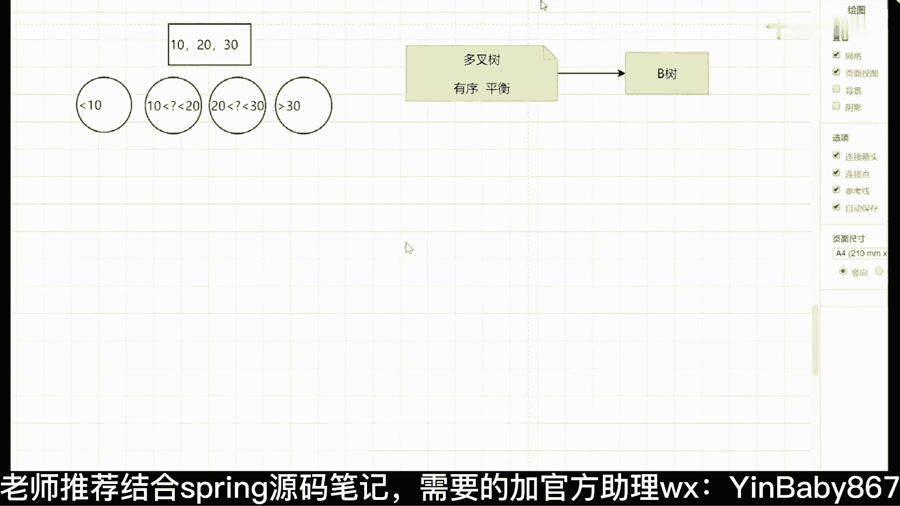
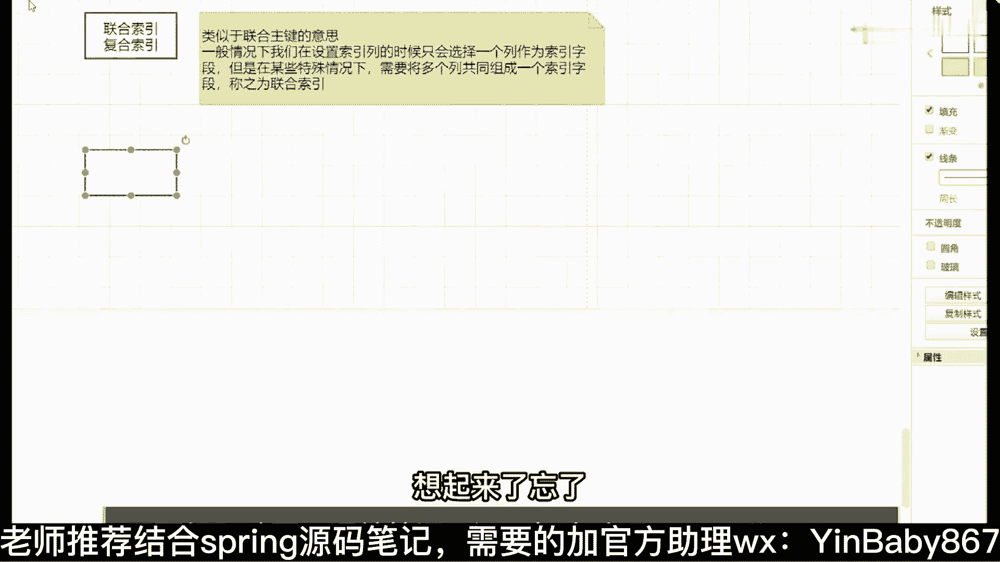

# 马士兵教育MCA4.0架构师课程 - P75：75、聚簇索引、二级索引和联合索引具备哪些特点 - 马士兵学堂 - BV1E34y1w773

咱们就过了，过了之后来聊下一个话题是吗，说剧组索引。

二级索引和联合索引，它们具备什么样的一些特点，什么叫剧组索引，什么叫联合索引，什么叫二级索引，记住，对，二级，所以还有一个叫联合索引，哇这三个对应的点，抽根烟抽根，MYSQL普通表行记录大行记录大的话。

插入上亿数据会失败吗，失败应该不会啊，失败应该不会，但是数量越大的话，你的查询效率肯定会降低的好吧，来我们来解释几个概念给大家，你算了，不给时间，给他一分钟时间吧，给你们一分钟时间，我点根烟。

你们上个厕所好不好，现在是二十八两分钟吧，我们09：30接着讲，上厕所去好吧，上厕所去一会儿，我们接着讲下一个话题啊，叶子节点包含了完整的行记录，对叶子节点包含了完整的行记录，是的，袁老师有回放吗。

我也不知道有没有啊，我，这没录啊，就确定对等等，没问题好吧，是包含的，但是这东西啊你要说你要说完全包含，也也不能说完全对，为什么一会儿我讲到这个二级索引的时候，你就知道了。

二级索引和普及索引它是有区别的，像二级索引里面就不一定不一定好吧，一会儿来解释啊，算了算了，李老师，这回放我都不敢二倍速，我这个人语速比较快啊，所以那个二倍速可能倍速不了，倍速干啥对吧。

主键字节我就随便指了一个数据嘛，假设嘛对吧，假设，好了09：30了，我们接着往下讲，有问题的话，我们会专门答疑好吧，一会儿答疑来，我接着往下说，这东西第一个句子索引，什么叫句子索引。

像这哎还在同学出门一，我们接着往下讲了，来聊剧索引的事，什么意思，想了解剧索引，你需要知道一个最基本的概念是什么概念，注意啊，我这有指定的条件，叫音动dB存储引擎中数据在进行插入的时候，好吧。

数据必须跟某一个索引列绑定在一起，如果表中有主键，那么跟主键绑定，如果没有主键，那么跟唯一键绑定，如果没有唯一键，那么选择一个六字节ROID，进行绑定这东西啊，它是一个墨守成规的一个前提。

刚刚在讲课之前，我给大家看了inno dB的存储文件，还记得吧，在ino dB这种存储引擎里面，你看到了你的数据和你的索引，都放在ABD这样的一个文件里面去，里面既有数据又有索引。

所以印度DV存储引擎在实际的数据插入的时候，是必须要跟我们的，所以绑定在一起的，那么它就会有一个选择的过程，逐渐有就用主线，没主线我们就用唯一键，没有唯一性的话。

我们就用六字节的ROID来进行实际的数据存储，这句话能理解的，给老师扣个一，能理解吗，能吧，所以这就会有一个问题，那到底什么叫聚素索引，什么叫非剧组索引呢，记住了，听好了，叫数据。

跟索引放在一起的叫做聚簇索引数据跟索引，分开存储的叫做非巨富，所以明白意思吧，所以把两个东西你要分清楚了，你要分清楚了，六字节的ROID是什么，就是一个随机字符，六字节的一个随机字符串被绑定到一起。

绑定在一起，所以这里面与生俱来的会有另外的一个问题，垂直着的说，所以my su是非激素，非常正确，记住了叫my sum中，只有非剧组，所以因为你的数据文件，你的数据文件和你的索引文件是分开存放的。

全加存放的好吧，按你自己说，如果表中没有六字节的呢，他那个64年ROID是隐藏的，你是看不到的，跟你表有名字字段没关系，它是一个隐藏字段，明白说的非常对啊，它是一个隐藏字段，你是看不到的。

在我们实际的MYSQL的数据行里面，其实包含了非常多的隐藏字段，比如说有什么流动性当中啊，这个叫RODB下划线肉下划线id隐藏字段，还有dB下划线肉下划线PT2对吧，还有dB下划线TRX下划线id。

还有还有delete，相信D它有很多对应的隐藏字段，这些隐藏字段你是看报道，你怎么看都看不到，怎么看不到，除非你看源码明白了吗，是类似于oracle rememb跟Z好像不太一样，是有可能显示查出来的。

而MYSQL是绝对查不出来的，明白意思吧，绝对查不出来啊，这些东西，所以下面还有一个问题是什么，刚刚说了，my son是结果非去索引，那么in NO dB中有没有技术作业。

有吧有句索引有没有非聚簇索引呢，有没有非技术索引，转移，NO bb g支持句速索引，也支持，叫非居住，所以这时候肯定有很多同学就会有问题，它其实是跟我们下面的二级索引，要产生关联的一个核心点。

关于一个核心点，我一样，再给大家个问题来讲完，现在能听懂的同学给老师扣个一，能听懂吗，问题吧，下面来聊几个问题，什么问题，我们就来解释，首先第一个一个表可以有几个索引，记住，无限三个可以吧。

第二个每一个索引都是一颗B加速，还是所有的索引供应共共用，BB加数，关键是独立的独立啊，独立也就是说是一个表中会存在多颗一加数，明白了，第三个数据，数据表中数据存储几份。

我们都知道叶子烟里面存的是数据行，存几份，记住一份，如果存一份的话，就会存在一个问题，同学们什么问题，我一个表里面会包含N多个B加数，如果你的数据只存储实际的一份的话。

那么其他的B加数的叶子间里面存储什么数据，什么数据，所以记住一句话，同学们记住我下面写这句话，数据是只存储一份的，是存储一份好吧，其他的非聚簇索引的叶子节点中，存储的是什么计数索引的K值叫K值。

能理解意思吧，所以，电动GB中也包含了，非句错，所以吧能听明白了吗，也包含了非技术索引，它放的是AB值，这一样给大家举一个例子吧，比如说看这张图表里面这个表有三个字段，Id name age。

一共有三个对应的数据列，三个序列之后，我现在id是主键，内部是一颗普通索引，那么id主键的索引建成之后是这样子，下面啊空间有限，所以只自动没写，这是我们对应的这个剧组索引，而name也是一颗B加速的话。

name这个里面存的是什么，看到了吗，名字对应下来之后，最底下放的是什么，放的是我们对应的id值，所以像内部这颗B加树，它就是一颗非聚素索引，而id这个B加树它就是一颗巨树索引，明白了吗。

同学们听明白了吗，来这块听明白，同学给老师扣个一吧，能不能听懂，啊把这东西啊你要搞清楚了，所以什么叫二级索引呀，或者说什么叫辅助索引，表示意思一样的是吧，引导dB中的非聚簇。

所以都可以称之为叫二级索引或者辅助，明白吧，这是它最基本的一个概念，我希望同学们把这个概念可以了解清楚了，OK就这块的一个基本讲解，这块的基本讲解啊，来这东西能过的，来给老师扣个一，能够吗，两个概念。

二级索引跟回表没关系，回表描述是一个过程，所以描述是一个具体的物理结构，看还是不一样的，一会儿我来解释回表的事情，一会儿我来解释回表的事情好吧，二级作业那个没有很多，举举个例子吧，举例来说没有。

文章表里面有id逗号，Name，逗号逗号tender，四个列，这四个列里面id是主键，name是普通索引，好吧，那我问一下在查询的时候，数据跟谁绑定在一块，数据跟id绑定在一起对吧。

name对应的B加数叶子节点中存储的什么值，id吧哇40，Name，就叫做辅助索引或者二级，所以就这意思明白了吗，它是用来帮助辅助查询的，那加索引就这意思明白了吗，好吧，如何来确定哪个索引是二级索引。

你非剧组索引都是R级索引，就这么简单好吧，没有任何唯一建和主键的表，是建立的第一个索引吗，没有任何主见，没有任何文件的话，他会选择六六字节的ROID，作为你的技术索引存在，作为你的基础逻辑存在。

就是我刚刚说的顺序是优先主键，主键，没有唯一键，唯一键没有的话，会生成一个六字节的rod，这是我们的顺序，把顺序要记清楚了好吧，就这一块啊，小孟说优先pk嘛，什么意思，没懂，来下面来解释多个链接。

所以呢不管你有多少个列，非句索引，都是我们对应的辅助索引或者二级索引，明白了吗，不管有多少个列好吧，但是你的表里面可能出现这种情况，主线可能只有一个，但是唯一件有多个，如果存在多个唯一键的话。

那么这个时候表里面又没有主见，那么你的剧组索引，会按照你唯一键指定的顺序来，比如ABC3个列都是唯一键，A在前就选择AB在前，选择BC在前，选择C好吧，V4C指针吗，要要，没有任何唯一件和组件的表。

多个列建索引呢，哪个是主线六字节的ROID，明白了吗，六字节的ROID，六字节的ROID公布，V4C指令吗，要要没指定的话，就是ID了好吧，来下面解释下一个概念叫联合索引，这还有个概念叫符合。

所以这什么意思。

很简单好吧，类似于联合主键的意思，一般情况下我们在设置索引列，所以列的时候只会选择一个列作为索引字段，好吧，但是在某些特殊情况下，需要将多个列共同组成一个索引字段，把称之为叫句啊，所以这个叫联合。

所以就相当于原来是一个列，现在变成了多个列，仅此而已，仅此而已好吧，这能听明白吗，这个联合索引，联合主键和联合组有啥区别，他俩能在一块比，这俩能在一块比吗，他俩没有什么可比性，明白了吗。

my sum中索引都是辅助索引吗，可以这么理解，因为它没有去索引，只有非去索引，所以他都是辅助来进行查询的，来点亮个索引，明白了吗，明白了，给老师扣个一，所以你就查找标记嘛，是你查找的字段吗。

用你的字段来判断吧，是这意思好吧好了，这是这几个存在的最基本的概念，我觉得你应该了解了吧好吧，来再往下看，说第四个在进行索引优化的时候。

需要注意什么问题，我刚刚已经展示了非常非常多的索引相关的，一些信息了，你告诉我根据上面学的东西，我们如何来进行索引优化呢，可以说my sum里面存的是什么，存的是地址，存的是地址，看好了。

上面已经讲了这么多点了，下一个问题是，啥东西来着。

