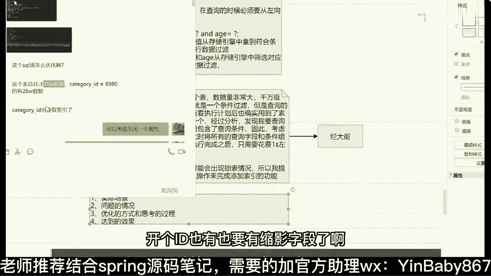
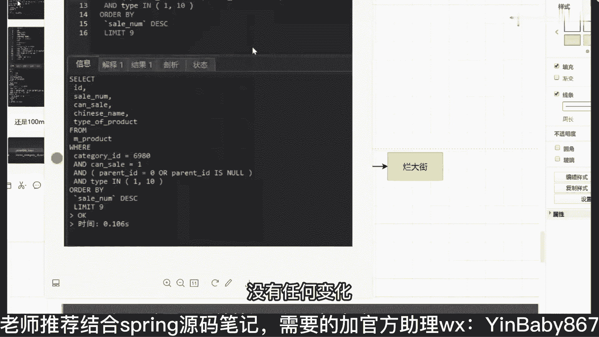

# 马士兵教育MCA4.0架构师课程 - P77：77、什么情况下会导致索引失效？ - 马士兵学堂 - BV1E34y1w773

在比较数据的时候，你要先比较第一个才能比较第二个，只有第一个相同了，我才能比较第二个的，可能如果第一个不一样，第二个没必要比较了，就这么简单好吧，来啊下面最后一个我们来讲一个索引。

下推优化器后会不会走索引，首先优化器会不会走索引，它优化完成之后，会把你这两个条件的顺序换一下，换完之后不就符合内部和值了吗，他就会走啊，会走啊，汇总好吧，为什么一定要在前。

因为你在创建对应的B加数的时候，大家看好了，我们刚刚给大家展示的，找一下刚给大家展示这个索引结构的时候，它这个key是不是只有一个值，当你是一个组合索引的时候，它就变成两个值了。

比如张三和28会放在一起，李四和39会放到一起，所以我在匹配的时候，它相当于是一个二元组，明白吗，XY2元组我必须要先比较X才能比较Y，如果X不一样，我就连Y比较的意义都没有了，Y就永远不可能比到。

只有X相同的时候，我才可能才可能会比较Y，就这意思好吧，就这意思来你最后面一个话题吧，叫三能行吗，三行啊，三可以啊，我刚刚说话吗，国木三可以的，虽然可以啊，虽然没用，但是name的符合那个顺序嘛。

所以是可以用的，来聊最后一个东西叫索引下推，什么叫索引下推，其实它也非常好理解啊，非常好理解什么意思，还是当前这样一个情况，我来写一个色素语句吧，slide行from。

where name等于根号and等于根号，就这样的一个普通思路语句，在没有，所以下推之前它是怎么处理的呢，处理原则非常非常简，单，是先根据name的值从存储，引擎中拿到符合条件的数据。

然后什么在server中对age进行数据过滤，这没有索引，开始之前有了，索引下推之后怎么做的，直接，根据name和age，从存储引擎中筛选对应的数据返回给server，不需要，做数据过滤，明白意思吧。

就这意思不要数据过滤好吧，这个叫索引下推，所以你把这东西想到之后，你再联想一下，刚刚最上面我给你画了个图，它下推是现在的什么的，下推，这是什么是下推是吧，原来在server层。

我要对age做的下推挪到了哪，挪到了存储引擎层，明白意思吧，从server层度到存储引擎层，什么叫有了，什么叫没有，在MYSQL5。6还是5。7之前，是不包含索引下推这个东西的，是5。6还是5。78。

我忘了一个版本了，忘了这个版本之后，它才具备了索引下推这个功能。

当然这个功能是不需要用户开启的，它默认是开启的，有一个属性。

叫啥来着，叫。

Switch，我来看啊，有一个东西叫索引下推，这个叫index，肯定是不知道它默认是开启的。

默认是开启了，在5。7之后默认就开启了，所以你不需要管这些东西，你大概知道，所以下跌是什么意思就可以了，明白意思了吧，这叫顺应下退，没别的意思，来直接点看学校的同学给老师扣个一，能看懂吗，没问题吧。

好了，当这些东西都没问题之前都都没问题之后。

下面我们要说一个东西了，说啥最后一个问题，刚刚讲了这么多，讲这么多是吧，如有有啥用来告诉我索引下载有用吗。

所以下载有用吗哈，它的数据量是一个级别吗，你只匹配内是把所有name匹配的数据返回回去了，还没做数据筛选，你把name和age两个东西一起数据筛选，看筛选完数据是不是少了，你IO量有多少，少了吧，好吧。

好了聊完这东西之后，下面我们来聊最后一个东西，这个东西什么东西，所以优化我刚刚讲那多东西了，讲那么多东西了，我们在回答索引优化问题的时候，我到底应该怎么去回答，你不要上来之后。

你不要上来之后就给面试官说，我通过判断之后发现我们的索引，我们索引那个我没，所以没有失效，所以我加了个索引字段，你这样去描述是没有意义的，你告诉我这个，所以这个优化问题我应该怎么去回答。

没有你所学的知识能回答吗，能不能回答，大家永远记住啊，你在回答优化问题的时候，你要给人的感觉是什么，是你真真正正的你做过优化，而不是说我从网上随便看了个帖子，我就能把优化的问题给大家说出来，不是这样的。

你要怎么去判断这件事情，非常简单，来听好了，这样的方式回答在之前，做叉叉项目的时候，我们有一个表，数据量非常大哇，千万级别，千元级别好吧，写了一个非常简单的SQL语句，就是一个条件，过滤好吧。

但是查询的效果非常差，花费了十几秒，通过分析之后，我发现通过查看执行计划后，也确实用到了索引是吧，而且查询条件非常简单，只有一个，怎么办，只有一个，怎么定义优化，能优化吗，啊怎么做。

利用前面所学的知识组合索引对覆盖话费，剃头说的非常对，现在可以说一下，只有一个经过分析发现我要查询的字段，字段用四个字段好吧，但是这四个字段啊，而且这四个字段包含了查询的某一个查。

包含了查询的包含查询条件，因此不考虑减少回表，因此考虑在查询过程中出现了大量的回表好吧，此时将所有的查询的字段，和条件是组成了组合，所以是达到了优化效果是执行完成之后，只需要。

花费一秒左右就可以完成查询，你这么说吗，开始说绝对录播了，今天我看过对，是录播，我不是一直说录播吗，一直说录播吗，看到吗，你能这样说吗，好同学们能能不能这样说，谁说就能扣一，不能扣二能吗，不严谨。

那不严谨吗，我上课临时写了吗，你觉得哪编辑不能自己去优化，能不能自己再编一下，能不能带上你自己的业务量，带上你自己的数据量可以吗，可以吧，我这没问题吧，好吧，哦1000万数据加索引要DBA来。

要DBA1来没关系，你后面可以再加一个补充大量数据，添加索引字段信息的时候，可能会出现锁表情况，所以我跟那个那个，所以我提出建议使用什么，MYSQL提供的在线DDL操作，来完成添加索引的功能，行不行。

可以吗，这有漏洞对吧，给你补上了吧，有什么东西吗，可能都不知道，这东西在线DDLMYSQL，5。6版本之后出现了一个在线dd2，你可以给它进行索引的一个添加，没关系的，这个具体的东西下去自己看明白了吗。

这可以了吧对吧，你黑马加嘛，我只是给了大家一个案例，我我并不是想把这个例子交给你们好吧，因为我既然公开课上讲到这玩意了，这玩意儿就烂大街了，明白吗，很多人都会抄走，很多人都会有这个东西。

所以这东西不是你的加分项，加分项在什么地方是这样的描述方式，你在写的时候一定要突出什么几个点，同学们记清楚了，第一个叫实际场景，你需要进行切换，第二个第一个是场景，第二个是什么是问题的情况。

第三个是优化的方式，和你和思考思考的过程好吧，第四个是达到的效果，能懂我意思吗，这是你在回答对应的优化问题的时候，你整体的思路，你要以这样的方式去回答，而不是上来之后不要用三星，再用索引。

不要这么去描述，能听懂我想教给你的是啥吗，来听一下同学给个一，能不能听懂，所以你把这种方式画出技巧，学会了，套用上你之前项目里面的案例不就完了吗，我不记得你们项目里面没有对应的SQL优化案例。

不可能没有吧，光我现在学生问到我了，我给你看一个实际的案例好吧，一个学生之前问我的，它实际公司里面的应用场景出现了问题，这数据量消耗比较慢，我给你看一下这个这个太太多了好吧，再往下看叶学生问我的。

李老师打扰你一下。

来看一下干什么事，这个学生他的情况也非常简单，这是对应查询语句，SD什么cell number cancel，什么什么chinese name，Type of，Type of product，这不多吧。

这句能看懂吗，能看懂吧，我觉得这一句已经非常简单了，执行完成之后，他花费的时间是多少，0。104秒，我问一下这个0。104秒是快还是慢，快还是慢，大哥们负点责任，你们在说快说慢的时候。

能不能问一嘴数据量，他过亿的数据量还还卖吗，别上来就慢慢快，你问一下数据量吗。

对不对，所以下次问一个问题，他说打扰你一下，他说这个表总共才35万，数据category id等于6980，有26万条好看的id。

也要有索引字段了，好吧，我发完之后，他给我发了什么，发现它对应的执行计划，杜老师，你看这个真心话，这样的这个字段明显用到了索引，不是没有索引。

用到了用到索引了，但是效率依然很低，不太能满足我们的业务需要怎么办。

我看完他之后，我说我可以OK，你可以考虑关闭一个属性叫index merge，我我刚开始怀疑啊，他可能触发了一些索引合并，所以导致他出现了一些问题。

好吧，做完之后他说老师运行完了还是100多秒，没有任何变化。

0。106反而还慢了一点，我觉得这个这东西肯定不行了对吧，再给他进行优化，我说这有组合索引吗，可是没有组合索引，我说你创一个组合索引试试是吧，我创建完之后，他说还不行，我说把排序再去掉试试。

看是不是排序的问题是吧，做了一堆，做了一堆检测完啊，都不行，还是一样，这东西是要慢慢去调整的，这次是0。1118秒，还是很慢好吧，再优化再优化。

我说你加上这个东西，再加上排序，加完之后，这是它对应的结果，再看看效果什么效果，我们除一下吧，0。106÷0。006，快了17倍。

看明白了吗，就快了，这么多，自己都自己都惊讶了，明白了吗，这是对应的数据吗，所以你要想明白说我要在哪些地方去进行优化，我要去调整哪些地方，你别两眼一抹黑，硬猜，我最怕什么东西，你知道吗。

很多VIP同学找到我说，梁老师，你帮我看一下这个色素语怎么优化，你发给我，我也懵逼，真懵逼，我根本不知道怎么做，你想你发给我一个那么复杂的SQL语句，然后你让我说，老师你帮我优化一下，我咋能给你优化呢。

我是个人，我又不是个神，你懂我意思吗，这经常说的一个一个很重要的一个问题，好吧，等下我给你找一下午一个同学，今天下午一个学生刚给我发的呃，找一下，就这个，我等会儿等会儿我们看这个SQL语句啊，我跟你说。

看完四个句，我自己心态都崩了，还没翻到，等一下看这个，这是他给我发了一个SQL语句，从select开始往下走走走走走，你去看这个SQL语句，你去看，这最后一句，来你告诉我这样的语句，你告诉我。

你让我去怎么优化我，我我打电话，你告诉我怎么做，一枪就一枪没完，你告诉我能优化吗，我又挂不了。

我是个人，我不是个神，好不好，所以你们要搞清楚这个东西明白了，所以不同的案例你要去分析它，说到底哪出现了问题，应该怎么去做，这些东西应该以怎样的方式进行优化，这才是最关键和最核心的点，明白了吗。

啪啪都打结了，不是打结了，这个东西展开了，微信里面可能看的比较长，微信里面看的比较长，打开之后大概几十几百行，但是依然很很麻烦，是不是，不是故意难为我，我在公司里面见过最长的一个一个搜索页，搜500行。

