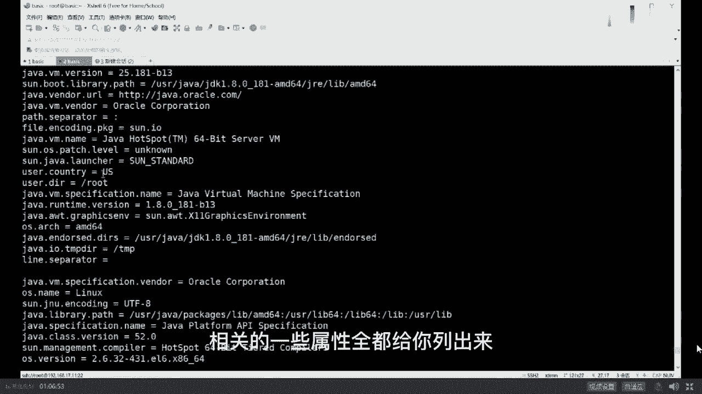
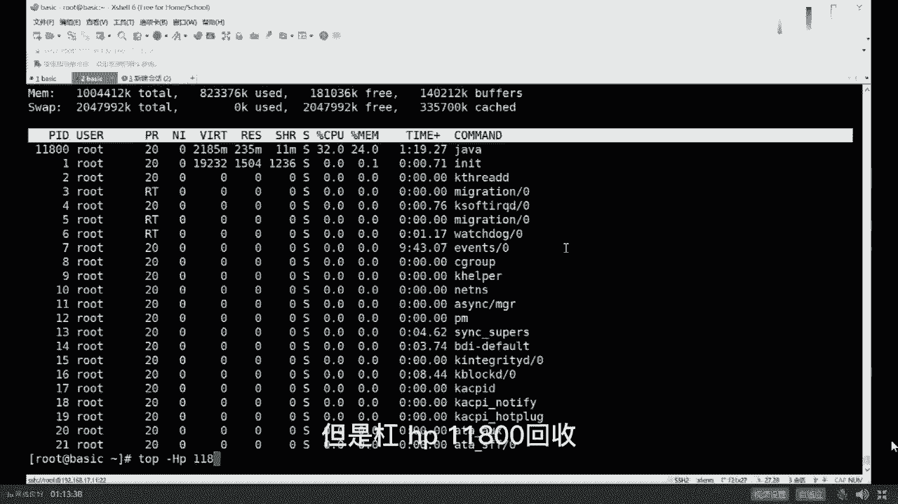
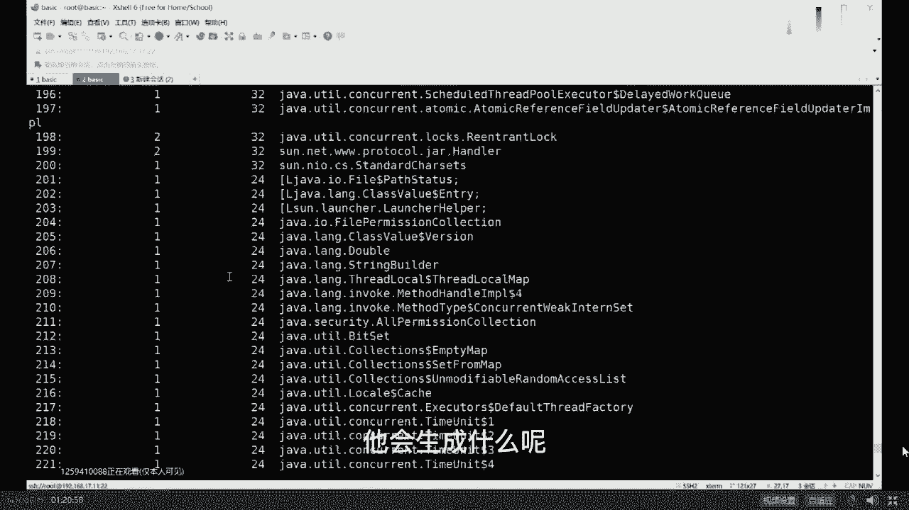
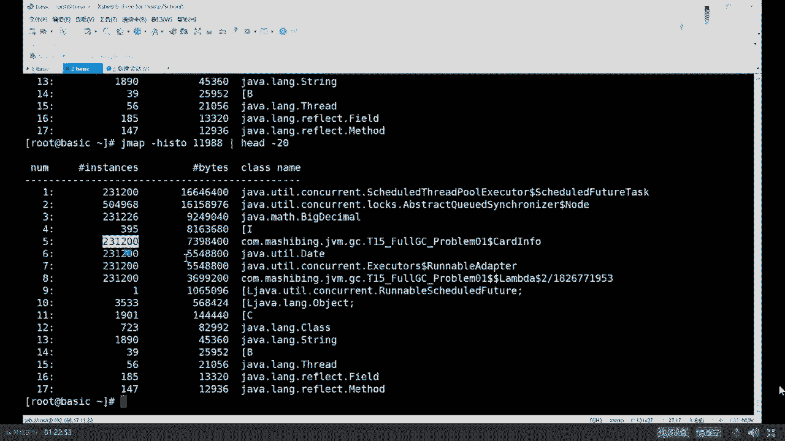

# 马士兵教育MCA4.0架构师课程 - P7：7、JVM调优实战（上） - 马士兵学堂 - BV1E34y1w773

首先讲一点小小的概念性的东西，到底什么叫调优，我跟你说调优这个词啊，用的太烂了，所有东西都叫调优嗯，随便动点什么参数也叫调优，调这个词实际上是如果严格意义上来讲呢，它包括好几部分，什么叫调优呢。

从JVM角度，它包括三大部分，第一大部分是根据你的需求，进行这版本的规划和预调优，这是什么意思，比方说我规划之中，我要每天支撑100万的下单量好，我这时候要用什么样的机器，用多少内存。

这东西呢我们可以叫预规划，也可以叫预调用，第二个是优化运行的运行环境，比如说你现在运行环境运行特别慢，卡顿好，这个时候你需要定位到一个系统的瓶颈，来进行调优，定位一个系统瓶瓶颈呢基本上要进行压测。

要进行全链路压测，那么如果是单机的话呢，你只要通过方法进行跟踪就可以，那么如果是分布式的话，你需要用zip king呢，SKYWALKING啊，这一类的进行全链路压测，来找出来到底哪个服务特别慢。

然后再进行调优，好这块我解释的不知道大家还能不能跟得上，能跟上老师扣一英文叫ching yes，你说的太对了，英文太好了嗯，来我们继续，还有一种调优呢是面试中问特别多的。

就是解决这方面运行过程中出现的各种问题，什么问题呢，比方说memory leak，比方说om，om的全称叫out of memory，内存溢出内存报表这个意思，今天呢我用一个小例子来教大家解决这类问题。

你会用到哪些工具和它们怎么具体的使用，好好听我说，如果说调优你需要理解很多很多东西的，你需要理解怎么去设设定日子的参数，你需要理解呢，怎么啊，这个日志日志怎么去解读它，呃今天呢我给大家略过一些细节。

就像昨天我说的，希望各位小伙伴们先学最粗犷的东西，然后树干再学树枝，再慢慢去抠每一片叶子，你才会变得越来越牛，关于日志这块呢其实还是挺复杂的，每一个日志你怎么去解读它，我们暂时先略过它。

今天也用不太上用到的地方，我大概跟大家说一下，另外呢在工业生产环境之中，一个java程序应该设置什么样的参数，这块也特别重要，有一些参数很多人从书上得来的，实际人家工业环境不可能这么设。

比方说你设置日志文件就设一个，这不可能的好吗，一个日志文件你很快硬盘占满了，所以这根本不可行，必须是循环的好多个日志文件不断循环。

比方说你根本就不设heap dump on out of memory error，就是说如果说他om之后，你不把堆导出来，那你完蛋，你定位不了问题，所以这个也不行，呃这块呢我们暂时先把它略过。

作为我来说呢，我用一个具体的例子来给大家来讲，大家看这里啊，我们那有个小程序，这个小程序呢业务逻辑上我大致解释一下，这个小程序是这样一个业务逻辑，小程序来源于实际。

我们有一个小伙伴在工作之中的一个问题的，模拟JVM调优这一类问题，比较麻烦的问题在于，我很难跟你模拟真实环境，因为真实的环境很可能一个月才出一次，我给你模拟一个月，然后为了出这个问题太累了。

所以我只能用模拟的环境，用最快的速度让它fell over叫快速，so fast是吧，快速的让它展现出来它的bug之所在，所以这个小程序是模拟的，虽然是模拟的实际场景之中，它就是这样的，你好好听看。

是不是大致能理解好，这个小程序模拟了什么场景呢，这个场景是在银行体系或者是互联网金融体系，里头进行风控的这样一个模型，风控简单说我要给一个哥们放贷款，这哥们叫泊船玉，他们家有祖传的玉石，藏在柏树里头。

OK说明这哥们信誉比较高，信用额度比较高，我可以给他带100万好换，另外一个哥们，这哥们叫RIST，啊这哥们的名字起的太怪异，他的信用度很低，我只能给他带1000块钱哦，这东西怎么算出来的。

是根据每个人过去的一些信用情况，信用卡还还还还款的这种及时性啊，借了多少钱，有没有其他的债务啊，是怎么消除的，以前也没有接待过等等，有没有借债不还的好，根据这些算出来的，这叫做风险控制模型。

风险控制这个小程序就是模拟了，从数据库里面取出每一个人的个人信息，来套用一个风险控制模型来计算出来，他到底可以给不给他的贷款，或者说他的贷款额度到底给多少啊，这个背景大家听明白的，给老师扣个一。

去找找一下那个叔叔的叔，把你送出去啊，拜拜嗯嗯，好嘞我们继续啊，看大家看这里这个小程序呢，每一个人的个人信息呢，我用了一个cat effor来模拟它，只读了信用卡信息，实际当中比这复杂好多。

信用卡呢包括他的信用卡额度，包括他的名字，包括他的年龄啊，包括他的生日等等，然后我们用一个，有一个方法，他呢每次都从数据库里面读出100条数据来，读出100条数据来之后呢。

加入到我们的test list里面，加入到我们的任务列表里，我们起了一个线程池，线程池呢叫schedule spread to executor，这你学过的话，你就学过，没学过的话，大致理解就行了。

它是固定时长，固定频率的来执行任务的这样一个线程池，在这个线程池里面有50个线程，然后每隔100ms执行一次任务，在这个任务里面以固定的频率，拿出每一条数据来，每一条数据拿出来来进行计算。

大概就是这么一个模型好，这个程序呢你理解也行，不理解也可，无所谓，我现在给你把这个程序运行起来，我直接告诉你这个程序里头有毛病有bug，我举个例子稍微复杂一些，我不想举那种特别简单的。

你比如说拿一个list不断的往里扔对象，然后一会儿就内存溢出了，这个太简单了，你要跟面试官说，你说我有实际当中调优经验，面试官肯定会问你啊，你实际什么情况下需要调优，遇见什么问题呢，你跟人家说说。

有一程序员反正不是，我写了个list不断往里扔，从来不往外取，很快om了，脸书官肯定拿大嘴巴子抽你，这也太简单了，好意思拿出来说吗，可是即便是这样，确实在实际生产环境之中，真的有人犯这种错误。

由于业务逻辑混杂在其中的时候，程序就会显得特别复杂。

就有可能会产生这种错误，就没招了，但你尽量不要说这个太low，太low了，好我刚才讲这段能跟上吗，能跟上给老师扣一来，你不要太low啊。

thread local内存泄漏，那个太高大上了，我觉得你未必能cover得住，你做什么，写了thread local，它怎么产生的内存泄漏，这个你未必能cover住。

好大家看这里。

我先把这个程序跑起来，这小程序呢我加了几个参数，看看能不能认识啊，第一参数呢叫杠XM最小堆大小，第二个呢叫杠XMX叫最大对大小，print gc运行过程之中，把我们垃圾回收器的日志输出打印出来。

最后是我们的程序，这里问大家一个问题，为什么我设最小堆和最大堆设成同一个，都设200兆，最小跟最大不一般的情况下不设成一样的吗，为什么，晨晨前面没听着，太遗憾了，没关系，不耽误后面听，不用扩容没错。

防止内存抖动，既然你明确知道，我的应用程序会占到200兆内存，直接给它分配200，不要让它没事，涨来涨去啊，长一点长一点长一点，长到最大之后，如果用不着了，又往回缩，缩，完了之后又往回涨，还消耗资源。

ok get到这点之后，我们敲回车这个应用程序啊，我们的java这个进程就开始跑起来了，下面呢我开始教大家纯实战的内容，嗯排列一下嗯，好我们排列一下啊，这样我们看的会更加清楚一些呃。

我们最右边的窗口里头是我们呃，现在正在运行那个程序，这个小程序呢时间一长，它会出各种各样的问题，目前为止还没出问题，目前呢它只是展现出来了，说我产生了一次GC，这次疑似GC，这是什么意思呢。

这应该是怎么给它放到最大了。

哇。

我把这窗口呢还是，垂直排列，水平排列合并所有吧，这样我切切一切吧，让大家伙看的更加清楚一些啊。

重新运行一下这小程序，为中，回车重新运行小程序啊，这个排成三个窗口，不能把信息信息显示完全，看上去很别扭，当我们运行起来这些小程序之后呢，你会观察它的小程序呢会产生一些日志输出。

这些日志呢你看大概大概是能看明白，我稍微解释一下，这个输出日志输出的是比较粗的日志，并没有输出很详细的，如果输出很详细的，我需要跟你解释半天，还是那句话，我们先略过一些细节，大家看这里。

它产生了一次GC，GC产生的原因叫allocation failure，什么意思啊，分配失败，那意思就是说我有一块内存被占满了，好这个这个DC y DC在年轻代DC，然后这次回收产生什么效果呢。

原来我的年轻代占了54兆，接下来回收一次之后，回收成为一兆，说明回收了53兆哇，这次回收的效果很明显啊，然后我们总的GC的总的堆大小是20兆，200兆sorry，200兆时长是多少。

这块我大概说明白了吧，有没有谁在这块有疑问的，没问题吧，没问题，给老师扣一啊，嗯来我们继续，我教大家一些最基本的一些常用的命令，先作为java来说，最常用最常用的命令当然就是java是吧。

好我们下面来聊一下java的参数，java回车你会看到作为一个java命令。

它后面可以跟哪些参数，我先说第一点，就是当我们一敲java的一个命令的时候，它就会启动一个java虚拟机，以前老同学在这里头犯糊涂，说，老师我起了一个java T1，又写了一个java t2。

这是几个虚拟机啊，两个只要你敲一个java命令，就会起一个JVM，这个JVM专门给他服务，这个JVM专门给他服务，你调优的时候不能两个混在一起调啊，这件事很难很难理解吗，很容易啊，好大家看这里。

作为java来说，它本身有一堆的参数，这种以横杠开头的叫标准参数，标准参数没有多少。

看上去也并不太难理解，但是你不要忘了，这里还有一个杠X开头的，这叫什么，N standard nonstandard，非标参数非标准的。

所以你敲java杠X回车的时候，他会把非标参数全都给你列出来。

像刚x mixed，刚s interpreter，这个我在VIP课里讲过，像什么diagnostic non class DC啊等等等等，这些杠log DC这都是设置你的GC的文件的等等。

杠XMXMX我们都设过了。

好听我讲这个叫非标参数。

像这些参数都是可以用于调优的，但是真正调要用到的东西是以杠xx开头的。

但是很不幸的是，这个杠XXX开头的这些参数，它是没有一个专门的文档给你列出来，如果你想知道这些参数到底包括哪些，用这个东西，Print flags，Final，Print flash final。

叫打印所有的参数的最终值，我们后面不跟class文件名。

直接敲1conversion，我们看它有多少呢，当然你是不知道他有多少，来试一下这个杠xx开头的参数非常多。

OK大概是有这么多屏。

到底有多少呢，WC杠L回车好。

一共有728行，扣除我们这些特殊的信息，大概有700个参数左右，公会内拉知道为什么java调优比较值钱了吧，不过呢你们也不用心慌。

作为老师这么体贴的男人，肯定会告诉你到底有哪些个常用的，常用的就这么多，几十个而已，parallel常用的参数又有哪些，CMS常用的参数又有哪些，g one常用的参数又有哪些。

所以加起来呢也就几十个而已，不用担心。

比今天可以发吗，可以啊，没问题啊，皮在哪聊聊小姐姐就知道了，好我们可以继续了吗，可以继续，老师扣一来好玩啊，我跟你说，实战的东西还是比较简单又比较好玩的，太多了，我就给你700个参数里头。

我就摘了几十个出来还多，你还要怎么你还要怎么着，好，你看程序呢已经开始慢慢的在不断的产生GC了，由于它不断分配对象，所以它不断的产生GC，好下面呢我教大家一些呃常见常用的命令。

用来跟踪我们java的进程呢，到底有没有什么毛病和bug，第一个命令叫做GPS，同学们，你们呢也不用记。

作为老师这么体贴的男人，你猜我给你记下来了吗，一定是记下来了，所以不用挤了，常用的工具我都给你记下来了。

好吧好吧。

好我们先聊第一个工具，第一个命令叫做GPS，这资料可以领啊，没问题啊，第一个工具叫GPS，GPS全称叫java processes，什么意思呢，就是你给我列出来整个系统里面java的那些进程。

我们这儿有两个进程，第一个就是GPS本身，第二个是11800的T15福利，就是我们的程序就是他好，这是第一个命令，第二个命令是什么，第二个命令是JINFER，你看一眼他的名字叫java的info。

很容易就能理解这东西是个啥呢，这东西是java进程的一些相关信息。

后面当然要跟我们进程的名称11800回，这他会把11800。

这个进程相关的一些属性全都给你列出来嗯。

比如说separator是什么，比如说那个我们的java虚拟机是谁来提供的啊。

等等等等吧，其他的比如说我们的boot class。

path里面包括了哪些站文件等等等等吧，比如说我们它的默认的这种启动的参数是什么，command line的参数是什么，OK这一份这个通过这些信息呢，你可以定位一下你你的程序到底哪有问题啊。

这两个命令非常简单，我就快速过了，OK下面呢我来教大家另外一个命令，这个命令的叫j state。

this state state的嗯，statistics叫做叫做java的统计信息啊，或者叫java的数据的跟踪信息，This date，最常用的，你要跟参数，JDGGC就是跟踪他的GC的一些信息。

后面跟11800，这是什么东西呢，跟上我们的进程号，然后回车好，你会看到它会把内存里面的每一块区域，占有的大小全部给你列出来，当然这些区域呢其实它代表的什么意思，上网一搜你就知道。

但是这个东西呢读起来特别的特别的不爽，不顺啊，这东西读起来特别抽象呃，这个命令还有一个参数可以跟后面跟一个500，指的是什么呢，每500ms刷新一次，你能观察到你内存的动态的变化。

这个命令在不装我们后面，我要讲的超级的工具，之前这个东西呢完全是有用的啊，你可以用它来跟踪你内存的增长过程，你注意看这块内存它会不断的往上增长，中间这块这块从二七直到313233，当然你跟踪了之后。

你就会知道哦，原来我的程序已经在不断吃内存了，会产生这样这样的一个直观的认识，好听我说啊，就是这里面的每一个参，每一个名字代表什么，我就不给你解释了，因为后面的我会教大家，在实际当中能够用起来的。

工业级的特别棒的一个工具，阿里开源的阿尔萨斯，好吧，OK你知道人为命令就行，这些命令都是JVM自带的，JDK自带直接拿来用就行好，除了这个之外呢，我教大家另外一个命令，这个命令是什么呢。

This de clear jazz stack，这也是一个非常重要的命令，JSTACK的意思，stack叫战，这是谁来拥有来着，还有印象吗，是不是县城啊，县城才会拥有这样。

所以JDK就是用来跟踪现成的11800。

他干一件事会把11800里面所有的线程，所有的线程啊，a more吧，一瓶两瓶，三瓶四瓶，你就会看出来他会把所有的线程，线程名的线程编号，现成的优先级，操作系统级别的优先级线程的状态啊，这是现成的状态。

包括现成的调用堆栈，Stack trees，就是这个方法调了哪个方法，这个方法又掉了哪个方法，A方法调了B方法，B方法调了C方法调用栈，把这个调用栈给你打印出来，这有很重要的作用。

比如说你观察到某一个线程或者某几个线程，一直是waiting在某一个锁上面啊，这个condition看到了吗，这个线程一直是waiting on condition。

如果很多线程一直wait在某一把锁上面，那么这时候是有可能是说，你的你的程序产生了死锁，还有在面试官问问题的时候，有一个经典的问题，这个经典的问题是同学，如果你的JVMCPU爆了。

请你告诉我怎么去查这个问题，怎么追查这个问题，如果你的JVMCPU爆了，比如说你JVM90%的CPU持续居高不下，怎么查，有谁遇到过这个问题吗，面试的时候，面试官问你有遇到过吗，你看打小打小就遇到过。

因为他打小长大的向死而生，他遇到的问题比较多，Top gun hp，top gun hp呢是说你已经知道这个JVM已经占据，占据占据比较高的CPU了，他问你呢是知道你的JVM已经占据很高的CPU。

你怎么去查他呢，怎么去定位问题呢，飞火牛羊，马老师别闹，马老师什么时闹了，马老师作为中国正经老师，number one严肃课程，number one的老师怎么能闹呢，一般是某个线程在发傻。

如果一个线程在发傻，它在weight，它是不需要消耗CPU的，大哥采样分析，最后是加密算法问题小结，前两天咱们联系过是吧，好听我说，好听我说CPU标高拿什么看，其实你得去查这个线程。

它呃就是什么样的线程在占用CPU，那么这东西怎么查呢，教大家系统级的命令，所谓系统级的命令指的是听我说，所谓系统级的命令，指的是LINUX系统提供的下一个命令，top规则，当我们一条top回车的时候。

它会给我显示出来当前系统里头的哪个进程，占的CPU是多少，占的内存是多少，如果你top多观察几次的话，你就会发现它的内存会不断增长，他的CPU呢有可能是忽高忽低，这是我们程序产生的问题。

当然如果你只是观察top这个命令的话，你只能观察到某个进程占的CPU比较高，如果你想知道这个进程里面，哪个线程占的CPU比较高，小伙伴们，你得用另一个命令，这命令叫top依然是top。

但是杠hp11800回车。

他就会把你这个县城里面的，你这个进程里面的所有的线程给你列出来，然后他的CPU可以列出来，所以如果你要是玩这个的话，怎么办呢，得是这么办，得这么干，你仔细听我讲啊，就这块儿呢，如果不采用先进工具的话。

你得这么改，首先top找出来哪个进程占CPU比较高，接下来top跟hp，找出来这个进程里面哪个线程占CPU比较高，然后根据这个线程编号，用JDK对照JDK执行的结果。

JDK大家知道这会跟踪出来好多好多线程，把这个线程编号跟JDK结果对应上，看看这个县城到底是哪个，一般来说我讲到这还能跟上吗，能跟上老师扣一了可以吗，这块不难啊，就是一些思路和工具的运用。

很简单很简单啊，你放心啊，再难的问题在老师这都是很简单，So easy，看这里找到这个县城之后，需要定位这个县城有两种情况，第一种情况，这哥们是vm thread，一般就是GC垃圾回收线程。

这哥们是业务线程，那这二话不说，去看这个业务线程里调了哪些方法，是哪个方法不断的循环占CPU呢，这就是业务进程，你怎么去查，这跟业务相关，假如你定位的是GC，那么它一定是在频繁的GC不断的GC。

所以它的CPU才不会不断飙高，这时候去干嘛读GC的日志，看看日志里面是不是在频繁GC，原因是什么，有可能压力突然间爆表了，双11正好赶到12点，那那那那那一秒哗来了一大波流量报表啊，这是正常的。

你应该能撑住，撑不住的话，你扩机器还有一种内存回收，来回收去总是回收不掉，那么这种情况就是有内存泄漏，这个过程我说清楚了吗，听明白同学老师扣一了，你看他现在CPU已经占93。9%了，看到了吗。

我们看这里，当我们看这个程序的输出的时候，你会发现它已经在不断的FDC了，注意看最关键的是呢，我们来读它的这个输出信息啊，你看一眼他的输出信息呢会明确的显示出来，这哥们呢FGC的过程是这样子的。

它每次的回收内存是从20秒开始，回收198015，回收结束之后还占多少内存，198098009就回收了6K，我们总的大小198016，回收一次就回收了6K哎，这哥们儿还特别的坚持，他们也不爆啊。

内存也不报，每次就回收个6K哈哈哈，好那说明什么，说明我的内存里头一定有有人在不断的占内存，而且我回收不掉它，再说一遍，当你看到频繁FGC的时候，这个呢就叫频繁FGC，一秒钟好多次。

或者你内存比较大的时候，几秒钟一次，十几秒一次都可以认为是比较频繁，好好听我讲，频繁FGC怎么定位，这个也是面试官经常会问的，频繁FTC怎么定位，观察你频繁FGC的每次回收过程是不是正常。

比如说你这里显示的是，从每次都从200兆回收到20兆，Good，这个是正常好吗，这是normal，是正常，没毛病，不要给人家吃药，他频繁的原因，你的前端的压力太大了，他的那个负载太重了，它必须得处理。

这个很正常，但是如果是说像我这种的，每次200兆回收完还是200兆，那么你想想看他发生了什么问题啊，一定是在我的内存里头，有谁把这内存全给占住，而且呢都有引用指向，垃圾回收不掉，没问题吧，听听懂。

听懂我的意思了吗，我们可以继续吗，可以继续，老师扣一这小程序，牛叉就牛叉在他那是不断的产生毛病，他还不报哈哈，他偶尔会报，偶尔不报，就是这么个流程，clear我们再把程序跑起来，不然我没法定位呢，好了。

下面我教大家在这个小程序里面是由谁在调用，在占用我们内存，谁在占用我们内存呢，教大家另外一个命令，这个命令叫做，Come on baby，好这个命令叫做，著名的j map gmap呢。

这个命令有两大作用，第一大作用是帮我查一下堆内存里头，哪些个对象占用的情况，就是不同的类的对象占用内存的比重，占用的情况，这是第一个，第二一个呢叫产生堆转储文件，啥意思呢，什么叫堆转储文件呢。

当你怀疑这个JVM的内存里面有bug的时候，你用这个命令可以让整个的这块内存导出来，存到硬盘上，存成一个文件，然后你可以把这个文件拿出来分析，大家听明白这意思了吗，来再说一遍，这map两大作用。

我一个一个给你演示，我们先说第一大作用，j map的第一大作用，histogram生成对象，图四六，我们我们得看那个进程号是什么啊，GPS的进程号是12049，Sorry，不是11988。

说明进账号j map gun，HISTORM跟进程号11988回，它会生成什么呢。

它会当前你在正在运行的这个JVM里面，它会对你进行一个整体的分析。

从头给你分析到尾，哪种类型的class里边有多少个对应的对象。

我们看脑袋就知道了。

看这里来注意看有这种类型的对象。

333个占了这么多字节，有这种类型的对象。

什么类型的叫scatter future task，还有一个叫big decimal de，还有个叫cut info，这是我刚才读代码的时候，读到过它有多少个对象呢，这个类有多少个对象呢。

11万个占了多少个字节呢，这么多个字节，然后呢他是从大到小排列，大家看懂我的意思了。

当然其实大多数的时候，我只需要观察前面的部分就行了，取取取前20行就行了啊，我不需要观察下面这些，就只有一个对象的，他一定是占不了多少内存，他不会说让我回收不掉的。

回正好从这你就能看到，这个是目前为止在我们整个的JPM里面，最占内存的那些对象就产生了，这是j map的巨大的作用，不知道大家get到没有，所以同学们你们想想，有一些东西我回收不掉。

我执行完j map之后做个对比。

比如说就拿这个big decimal的对象来说。

big decimal对象你的前面是18万个。

我又执行一次就变成20万个没回收啊，来再继续变成22万个没回收啊。

变成哈依然是22万多，23万个，不知大家观察到没有。

有一些类的对象在不断的产生，而且回收不掉。

所以会产生什么问题啊。

你是不是get到了我的内存被占用，回收不掉。

就是由这些对象引起的。

好这块还能跟上吗。

能跟上，给老师扣一，这是int数组，char数组，BT类型数组，这种的一般都比较正常，不会出大毛病，那这事是不是就简单了。

既然你知道哦，原来是我的scattered filter task。

或者是node，或者是big animal，或者更有甚者是cut info。

是由这些类的对象不断的产生，而且回收不掉造成的，那怎么办，简单你去查你的业务逻辑吗。

你去查你业务逻辑不就完了吗，很简单啊。

查业务逻辑，好这作业留给大家吧。

我告诉你，我教你定位的东西超级简单。

他再难在老师这也是小菜，一碟豆芽都长一房高，他也是根菜，想咋吃咋吃，但是呢真正在业务环境里面，就算你定位到是由于CD info这个类不断产生对象，吃内存造成的，可是它的原因是什么。

你能知道你试试看我这小程序给你，你们自己去调，看看能不能把这bug给调出来，我告诉你，如果你不懂线程池完蛋，你还是调不出来，就算你懂线程池，你也未必知道问题出在哪，更何况在你实际工作环境之中。

这些毛病啊，你的业务逻辑呢是分布在很多特别复杂，代码比这个要长好多的那些文件里面，所以定位问题并不难，解决问题才是真正的难，好我们稍微的复习一下。

我今天呢给大家讲了几个常用的命令。

回顾一下，这个叫top，第2top gun hp好。

第二个叫GPS，很简单，这info列出信息来。

第三个继续啊，叫JDKJD，OK还有一个呢叫j map gmap的一个作用，把里面的每一个最常用的，最多的这些个类列出来，所以当面试官问你的时候，你就可以说了啊，我实际当中写了这么一个程序风险普查模型。

然后它产生了内存的泄漏，我们频繁频繁GC，但是回收不掉，后来我一定位，我发现了卡里info，经过我的努力，修正了袁成云的bug，搞定，听清楚了吗，嗯来跟上来老师扣个一，面试官问你当时什么情形。

你就像我这样噼里啪啦说一遍搞定，当然怎么改怎么改，你自己去自己去找，当然你这么说完呢，估计面试官会一个大嘴巴子抽上来，告诉我你生产环境之中，难道可以随便执行j map命令吗，如果你告诉面试官说。

我gm命令是在生产环境之中执行的，面试官估计就是要请你出门右转，拜拜还有为啥嘞，关键是怎么搞定的，哈德森还搁那纠结呢，怎么搞定的，是你的业务逻辑问题，大哥我今天给你讲的是JVM的调优。

你的业务逻辑出了问题，别人能知道吗，只有你自己知道，K就是说就是说这map，这个命令会产生一个很严重的后果，产生什么后果呢，我们现在内存啊就200兆，真正运行起来了之后，就中间我开始运行了。

估计就占了几十兆的时候，我就开始把它运行了，这map会让整个JVM卡死，卡死在某一个状态，Stop the world，然后把里面的对象全都输出出来，Very good，真正生产环境能让你卡死吗。

大哥懂吗，能不能，你现在双11正搁那秒杀呢，上来一个，你这map啊，连连连续掉十遍哇，卡死十次，关键人家内存还特别大，128G傻了一个GMAP命令两个小时以上，所以大哥别这么玩，别这么说。

这是一定有问题的，跟面试官聊的时候怎么说呢，我先卖个关子，你听我讲。

我先把j map的另外一个作用讲出来，还能跟上吗，不能强制停止吗，你看super king多牛那边双11正在秒杀呢，直接把电源给拔了，牛刀佩服，你猜马云会不会拿大鞭子抽你。

上次不是说办业执行吗，可以啊，没错，半夜执行是一种说法啊，这个没问题啊，就是你是在半夜的时候执行的，可是半夜执行他万一不是FDC特别频繁呢，是吧嗯嗯总而言之呢，要说的你要跟面试官聊，这些一定是要聊的。

