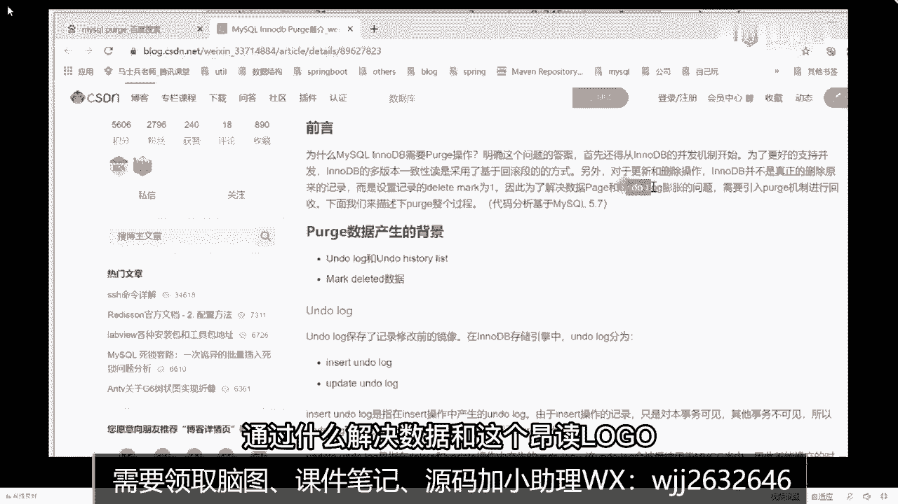

# 系列 5：P81：81、什么是二阶段提交，如何保证宕机时数据的一致性？ - 马士兵学堂 - BV1E34y1w773

好如果没有显示，主线说话就会多一个隐藏主线去抓下，就是说我们在创建完一张表之后，创建一张表之后。

比如说我建一张表，里面有以下几个字段啊，看好了，比如说有id先复制吧，比如创建表里面有什么，有name好吧，有age有真的有这四个属性，除了这三也是三个属性，除了三个属性之外。

在这个行程记录后面还会包含这三个字段，只不过这三个字段是人为看不到的，或者说你肉眼看不到的，不管你怎么查，你都是查询不到的，实际数据就变成这样子，好的需要注意了，如果我插入条记录之后，就变成了内幕。

写个字张三，比如age12tender man，然后DBTRSID表示什么意思来着，表示创建这条记录，或者说最后一次修改该记录的id值，这里面有一个情况，我需要说明一下，在事务操作里面。

在事务操作的时候，事物id的值是递增的，新增的，所以我们才刚开始的时候，假设他现在是新增的操作，那么我这个值给它写成一，还有个东西叫DBOPT2，表示上一个历史版本的状态，那我现在是没有历史版本。

所以这个值现在是N，如果有历史版本，你就指向历史版本，还有一个ZVOPT2，我这个表里面是没有主见的，所以这里面可以给一个值，如果有主见的话，他会写上我们对应默认的主键，它是有区别的，能明白这意思吗。

好来这个东西能看明白的同学给老师扣个一，能听懂吗，实际上你的数据还在存储的时候，除了这三个字段之外，还会包含三个隐藏字段，这是最开始的一个状态，最开始状态有一行记录，所表示的一个最基本的状态。

这是第一部分叫隐藏字段，好吧，除了隐藏字段之外，第二部分，所以呢我们之前说到这个东西，就是刚刚说的on dolog，啥意思，on the log表示来着叫回滚日志吗，对不对，它里面记录是什么。

记录的是数据的历史版本，是不是这意思，历史版本吗，所以像刚刚那有一个dB rop t2，它是不会指向历史版本，那指向的历史版本在哪，就在我们的on log里面，那如果直接这么说的话。

很多同学可能没有具象的一个感知或认知，我们来模拟一个数据，插入一个场景来看一下到底什么效果，我来举个例子，比如说现在第一次来了一个11行不行，事务一好吧，插入一条记录，当我的事物一开始插入记录的时候。

干什么事非常简单，不就是刚开始的数据的状态吗，是不是只有一个这东西，所以在最开始你进行数据插入的时候，它就是我们对应的最新结果，没有对应任何历史的数据，它就是最新的，来这东西能听明白的，扣一，没问题吧。

那现在我来了一些其他事物，什么事物来了一个事务，22，我要做一个操作失误二更新什么name等于第四，如果我要更新name等于李四的话，我是不是需要去改变我们对应数据结果值了，把它拿过来放到这块。

我要改了，首先name值改成李四，除了这个内幕值改成李四之外，我还需要去改变什么东西，还要改别的吗，想想需不需要，哪些东西，这个字要不要改啊，刚刚说了DBPTR是这个TR，SD是啥意思来着。

表示说我新增这条记录的事务id，或者说最后一次修改的事务id的值了，我现在是不是十五二D修改了，这是票改成二对吧，改成二之后，dB rop t r什么意思叫回滚指针。

我是不是要指向上一个历史数据的版本状态，上一个文章在哪，不就这个记录吗，我把它拿下来放下来可以吧，放下来放完之后，这改一个地址，0x123，我随便写个地址，这个地址随便写的无所谓。

它就指向了当前的数据版本好吧，同时注意了，我要拿一个框把这部分内容给框住。

这最后，当我框住之后好吧，下面这个框里面表示的东西是个啥，就是我们之前说的叫undo vlog，能听明白吗，这就是我们说的UNLOG，它是不是存储了我们对应历史数据的版本状态，此时它是最新。

结果那你告诉我这里面存的是啥什么东西，历史结果吧，这个存在是历史记录吗，来这儿能听懂，同学给老师扣一，能懂吗，好了，这是第二个，那同样的我们可以进行第三个事物来进行操作，我第三个事务也来了。

干什么事儿叫事故三更新，H等于21可以改吧。

那是不是一样道理，我只需要把这个结果挪下来，改变我们的数据，把它改成21，他是不是要改地址变成几了，别着急，三嘛，他地址是不是要改0X比如说345随便写的，然后我要把下面这部分数据也拿过来放下来。

放完之后呢干一件事，这部分的东西都要往下挪。

为什么往下挪，因为现在你多了一个新的历史版本状态，这是他。

把它混到这个地方，这个箭头要指向它，指向它，然后它指向他，能看明白吗。

再说这个时候下面的它属于历史结果，这东西它属于最新结果。

来这个图能看懂的，扣一，没问题吧，这是对应的状态。

比如说最后我们其实可以得到一个结论，最终undo log里面存储的是什么东西，帮助log中会形成一个链表吧，啊练手是最新的旧记录好吧，列维是最旧的旧记录，是不是意思练手练尾有对应的具体数据，这是第一块。

这时候会有一个问题，老师那on board里面不是会一直变大吗，你就想一个数据可能会无限增大吗，同学们，他可能一直膨胀下去吗，可能不可能啊，他可能一直无限涨下去吗，不可能吧，肯定不会的。

肯定不会无限涨上去的是吧，如果不会无限转下去的话，那怎么办，所以在这个里面它会有一个东西下来之后。

你们自己去查，目前面试中还没人问到这个东西，有一个后台的线程叫PORGE，线程会清除数据，清除，数据不说清除没用的数据啊，这改成三会清楚什么清除没用的数据，明白意思吗，这东西是啥，你们自己去查吧。

我这边不讲了，因为目前还没还没有，面试官问到mysql o RGE perch。

有运动定律是一个破值，什么意思，移动并发机制开始为了更好支持并发，基于回滚蛋的一个方式，nod b真正删除记录这个记录标志来的，通过什么解决数据和这个undo log文档的问题。

需要引入或者机制来进行回收啊，POS机的回收背景是如下所示，下载之后详细了解一下，它也是完整的一个知识体系，明白意思吧，所以我们不提这L不提这L下载之后，有需要的同学下去之后自己聊。

OK这是第二部分，我们记录的on the wall，来这听明白，同学扣一能听懂吗。

问题吧是第二部分，这东西还不是最主要的，最主要的东西应该是第三部分组件。

第三部分是什么，有一个新的东西记住了，它叫啥呢，叫random view，review这玩意儿怎么怎么翻译啊，或者怎么理解什么叫review，啊你翻译过来叫什么。

叫不是图嘛对吧，但这里面有一个明确定义，叫什么叫事物进行快照读，操作的时候好吧，是产生的读视图，如果只是这么去理解的话，会这么去看这个概念的话，很多同学依然是一脸懵逼，根本不知道咋回事。

根本不知道啥情况，其实非常好理解，在review里面它叫读视图，在当前的读视图里面，读视图里面包含什么信息，它包含的就是三个关键的字段，你只需要把这三个字段搞清楚就完事了好吧。

那三个字段呢老师说老师是453。

不应该改不动吗，什么改不动，真要改啊，因为你是453更新吗。

这肯定要改好吧，我先来下啊，你这个六里面，它其实包含了包含了三个对应的结果吧，我们三个对应的字段，哪三个字段呢，第一个叫t rs下划线list代表什么意思呢，它表示的意思是这样的。

记住了表示reveal生存时刻，好吧，当前系统活跃的事务id，注意啊，它是一个列表，它不是一个值，它是一个列表，然后dB肉体这个地方下面之后还有第二个字，叫什么叫up下划线，limit下划线id。

代表什么意思呢，也非常简单，代表的意思是活页，列表中是最小的事物IP值，除了这个字段，这还有第三个字段叫low下划线，limit下划线IP，这个表示什么意思啊，它表示系统，尚未分配的下一个事务id的值。

来这三个字段能不能记住，不需要理解了吗，记住能不能记住来，能记住的，给老师扣一，能不能，这个小不点说老师为什么app是最小，漏成下一个，没有啥就这么规定的，他就这么规定的，我没写错啊，我没写错。

他就这么规定的，没办法好吧，这东西是需要你是需要是需要你掌握的，哎给点回应给点回应，大哥们能能记住不，我不要你理解啊，能不能记住就记住就完了好吧，其实这些东西都是死的，固定的概念，固定的概念好吧。

这东西都不是核心重要的点啊，重要点在什么地方，重点是当我在生成一个review的时候，他会把这些字段里面的值给进行一个填充，当填充完成之后，在下面这个环节里面会有一个东西叫什么，叫做可见性算法。

也就是说当我生成read view之后，会根据可定性算法生成的review，会根据可见性算法来判断是否，可以读取到对应的历史对应的数据结果，如果你记不住，没关系，多听两遍理解，多讲点理解。

因为第一遍听我没办法要求你们都理解的，都理解到，但你把这东西给我记住就完了，那可见性算法是什么呢，它就是一段非常复杂且沉重的文字描述，文字描述啊，有点恶心的文字描述啊，这个不需要大家记。

我每次我也没记过，我都是讲课之前放到桌面上，我都直接给你粘过来，我也没记过这玩意儿，你这玩意儿太费脑子了，估计就放过来完事，然后一会儿，我们需要进行可执行算法的一个判断，因为我们要判断原则。

那下面当这些东西我都聊完了之后，我们要干一件事，干点什么事情，我们要去做一个最基本的判断，什么判断，把我们刚刚的例子来做一个复线好吧，刚上来有时候做了个例子，根据我们刚刚那个案例，我们来进行一个复线。

来看一下对应的效果到底是什么样子，来我给大家写具体情况啊，这么多，这是时刻，不要说掉头发的事好吧，你你不要去抱怨这东西没意义，别人会的，你要你要不要会，你要会调整这东西10克，比如T10克，T20克。

T30克，这样事物一十五二十五三，然后这个时候呢干什么事，刚开始的时候三个事物里面都是一个begin状态，begin1面，然后在施工的时候，我执行了一个update操作，然后我commit掉了对吧。

然后在T3时刻，我这进行了一个select的一个查询，刚刚的问题是什么来着，问题是当我这块进行select操作的时候，能否，读取到修改之后的结果吧，来告诉我结果是什么，结论是什么。

能不能读取到在当前这个flag操作的时候，能不能读取到数据，结果能还是不能，还有人说不能啊，我刚刚设置都已经演示过了，我刚设置都已经演示过了，演示的时候能还不能，能吗，那为什么能啊，他是怎么做的呀。

非常简单，我们来做一个判断，做一个判断，什么判断，把刚刚我们要填充的字段给拿过来，这是我们在生成review的时候要生成的东西，刚刚也说过了，什么时候生成review来着。

在进行快照读操作的时候会产生平视图，那什么叫快照读，是不是刚才也解释过了，所谓的快照读就只是select操作，我们在刚刚T3时刻，我是不是执行了一个select操作，所以此时是不是要进行一个快照读了。

那现在我只需要去填充好对应的字段信息。

就完了，来告诉我，当我在T3时刻执行快照读的时候，我现在当前系统的活跃事务列表有几个，这个值是几，十几，就不能多说全了吗，一三嘛是不是一和三，这没问题吧，一和三第二个最小的活跃列表里面有二吗。

这边有二吗，同学们，什么叫活页，你事务已经提交到了，这还叫活力吗，已经提交了还叫活跃吗，同学们不能了吧，就一个三两个好吧，没有二，因为我已经提交了，第二个，当前活力列表里面最小的事务id是几一码。

对不对，毫无疑问，下一个系统尚未分配的下一个事务id是几几，四好了，把这些数据都写完整，然后除了这几个字段之外，你还要再多一个字段信息，叫什么叫DB下划线，TRX下划线D8加进来。

它也是需要进行条件判断的，这个值是几，是一吗，想想是一吗，是三吗，哎呀还四啊，什么叫DBTSID啊，要创建这条记录，或最后一次修改该记录的事务id，我现在谁修改了，数二数改了吧，知几，对不对。

其实是二好吧，来把这几个值我都已经写完整了，当我把这几个值写完整之后，下一步干什么事，我需要按照这个表，针对于我们当前的可见性算法，我要去做一个判断，判断一下我能不能看到对应的结果，然后来看第一个。

首先比较dB t s d知识节，二小于up limit id等于几等于一，二小于一吗，说如果小于，则当前事故能看到所在这记录，我们现在小于不小于不小于吧，二是大于等于一的，对不对，如果大于等于怎么办。

进入到下一个判断环节里面去，所以再接着来判断db7236等于几等于二，LLB加X等于几等于四说如果大于等于，则表代表DBTICID所在的记录，在review生成之后才出现，那么对于当前事物肯定不可见。

我们现在二是小于四的，如果小于，则进入下一判断，它依然往下走，这样看看dB t s i d2是否在活跃事务中在吗，在不在，二有没有在活跃列表里面不在吗，如果在，则代表巴拉巴拉巴拉巴拉巴拉巴拉，如果不在。

则说明这个事物在review生成之前，就已经开始commit了，那么修改的结果是能够看见的，所以我们的结论是能跟我们的实际情况，能否匹配上，能不能匹配上，能吧，这就是最终最终结果吗，结果就是这样的。

就是这样的，来下面再演示情况，我们把第二次我做那个操作，我也画成图来演示出来什么图，第二次画成图的时候变成亮的效果了。

再改成T4，这没有。