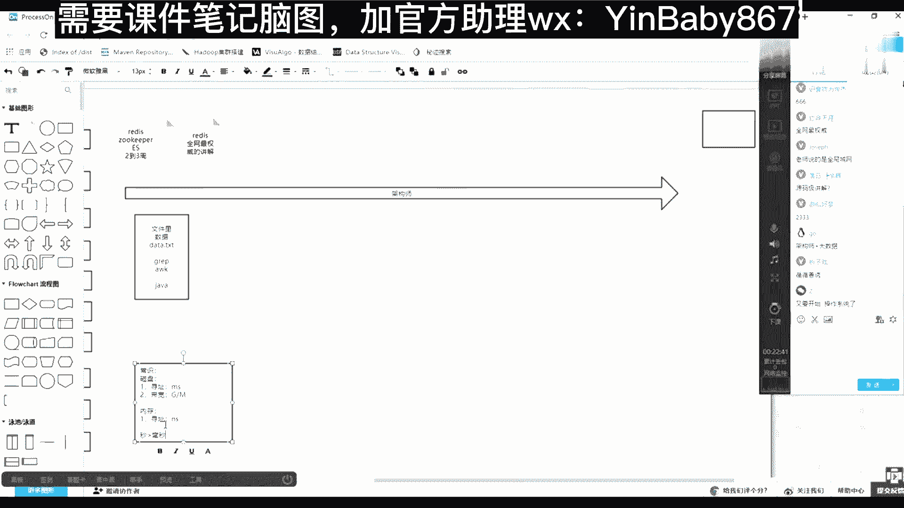
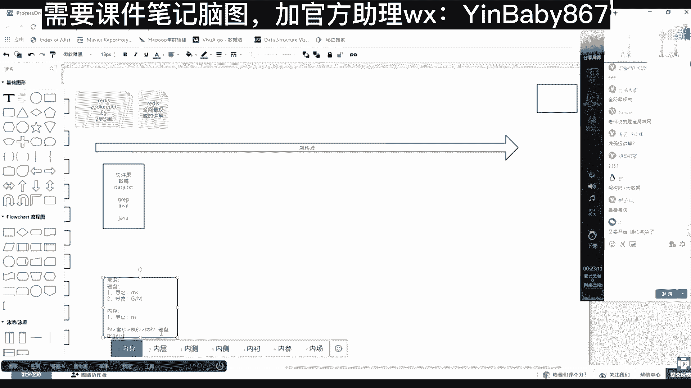
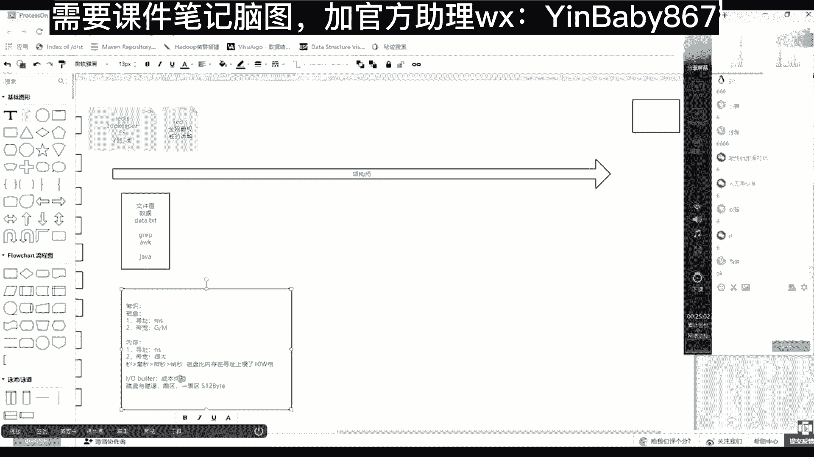
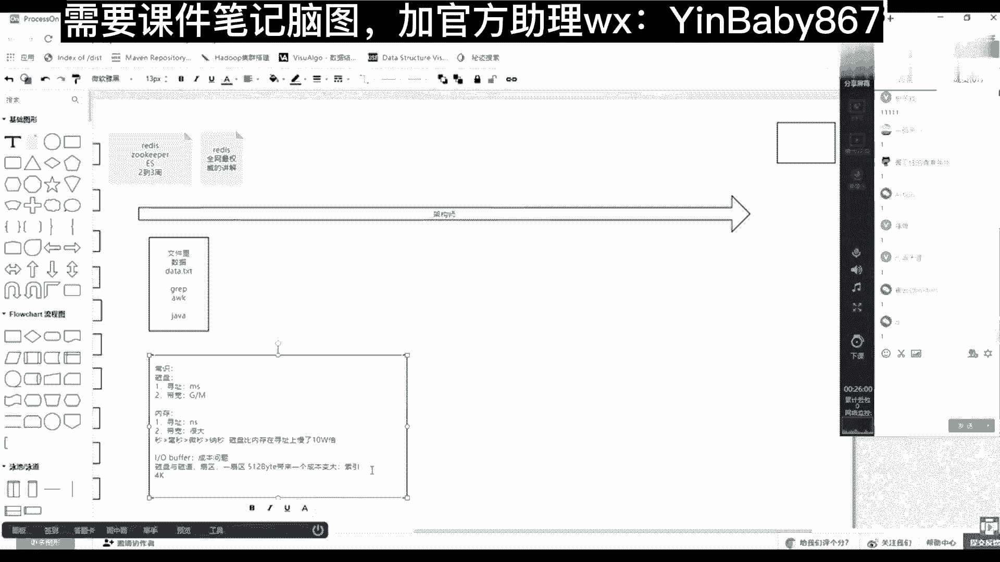

# 马士兵教育MCA4.0架构师课程 - P84：84、常识介绍--磁盘、内存、IO - 马士兵学堂 - BV1E34y1w773

有一些常识。

常识常识是什么意思，常识不是你该炫耀的知识点，常识你必须要知道的。

但是在这呢我们统一来说一下这个常识，就是首先在计算机当中。

数据是存在磁盘，数据在磁盘里的。

那么以磁盘的维度，它有两个指标，第一个是寻址。

寻址的速度是毫秒级的，然后第二一个是带宽。

也就是说单位时间可以有多少个字节流过去。

多大的力量流过去，然后基本上是G或者照这种级别啊。

就是多少G或多少兆，几百兆或者12G这么这样一个一个带宽速度。

这是磁盘带来这样的一个一个基础知识。

另外一个就是内存，内存它有一个寻址。

它的寻址是纳秒。

十纳秒，那么秒这个时间单位里边秒。

然后再往下小是毫秒，然后再往下小是微秒。

微秒，再往下小是纳秒。

这应该都知道。

所以你现在得出一个基本的常识，就是磁盘在磁盘中获取数据的时候。

它是毫米级很慢，然后但是在那个数据如果在内存里的话。

找到它，把它放到C盘计算，一定会很快就进了一个常识。

磁盘比内存慢了10万倍，在选址上。

慢了10万倍。

大家注意啊，是寻址，寻址上是寻址上慢了10万倍。

后面还会出一个小的知识点，然后内存的带宽。

内存里面数据完走这个带宽一定会很高，就是它的带宽。

带宽多大，我忘了。

但是一定会很大很大，因为内存就直接怼到我们这个CPU去计算，他直接走的那个数据的CPU的前端总线。

所以他无论怎么样，内存各种数据只在内存里。

各种优势是优于我们磁盘的，然后还有一个小常识没有讲过的小常识。

还有一个小常识就是I/O buffer。

I/O buffer是什么意思，我就用了一个buffer。

我就用了一个buffer，首先其实这是一个成本问题，什么叫成本问题。

磁盘有扇区。

磁道和扇区磁道磁道。

和扇区。

那么移山区一扇区多少字节。

是不是512个字节。

这应该是基础常识，这都是基础常识，那么这个时候注意有一个成本问题。

什么叫成本问题，如果我们访问一个硬盘，这个硬件的时候都是最小力度。

以一个扇区一个512来找。

那么一块硬盘是不是1T2T，是不是会有很多512，那么每一个512在哪呢。

我的数据在哪，一个512的那个里面放着呢。

那么这样你要明白一个点，就是如果容器就是一个区域足够小。

那么它一定带来一个成本。

成本变大，什么成本变大。

索引，也就是你如果用，如果一个1T里面都是512。

这么一个一个一个小格子，小格子小格子的话。

那么你上你上层操作系统当中的准备一个索引，这个索引就不是四个字节了。

可能得八个字节或者很多个字节，它一个能表示一个很很大的一个数的一个区间。

才能索引出这么多的512个小格子。

所以成本会变大，所以会变大，这所以造造就了一个东西。

就是在我们格式化磁盘的时候有一个4K对齐，对不对，是不是会有一个4K对齐。

也就是硬件的时候，并不是按照512个字节为一次读写量。

他会把这个变得更大一点，你读一个字节。

读百一十二，读1K他给到硬盘了，硬盘都是咣当给你返回4K。

它是如果你看512跟4K就差了很大，它俩大小就不一样了，那么一个硬盘512很多小点点。

4K可能点会变少，那么这时候其实索引的体量大小就会随着变化。

所以一般磁盘都是4K为，默认我们格式化4K操作系统。

操作系统。

无论你。

读多少都是最少4K。

从磁盘哪都是最早从从磁盘拿这个这个这个事。

这个知识点。