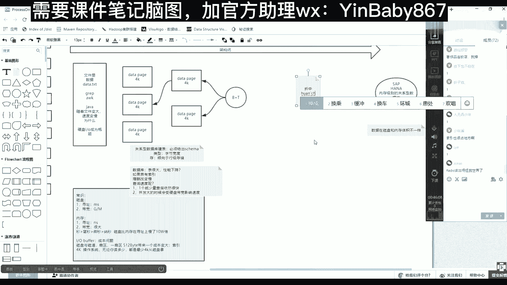

# 马士兵教育MCA4.0架构师课程 - P85：85、数据存储发展进程 - 马士兵学堂 - BV1E34y1w773

好数据可以存在文件里。

然后数据如果存在文件里的话，如果我们要查询这个文件里面有马士兵，要怎么怎么怎么去查啊，一个文件里面有数据，比如说什么data，点TT可以怎么去查，LINUX当中有grape，有AWK等等的这样的命令。

你还可以用java语言等语言写个程序，然后做一个基于这个文件的IO流读取。

查找数据就放在文件里的话，然后你用相同命令去查的话，随着文件的变大，它就一定会查询速度变慢，对不对。

是不是这么一个结论。

随着文件变大。

速度变慢，那么为什么为什么呀，是因为文件如果变大的话，这时候访问硬件的时候，访问硬盘的时候会受到硬盘的瓶颈的影响，对不对，硬盘成为瓶颈，换言之，也就是IO成为瓶颈，这是计算机目前不可逾越的，对不对好吧。

这是第一个时间点，这是一个基础知识啊，这个基础知识当中带出这些常识，那么随着时间的发展，如果数据都这么放的话，肯定节奏特别慢，如果让它变快呢，数据库是不是出现了，当时数据库出现出现的时候。

他做了一件什么事情，注意数据库这最基本的两到三点可以去描述。

第一有了一个data配置，data配置概念。

它的dd配置大小多大呢，是4K，现在如果再跟你说数据库里面，如果你有一张表，你建一张表，表里面那么多行存档存到磁盘的时候，他其实在里面物理存的时候，好像用了很多很多4K这样的一个小格子。

那么这个4K刚好和谁一样，是不是刚好和我们硬件的这个磁盘子里边，那个4K这样能对上，能理解什么意思吧。

所以这时候如果我们的数据库准备很多，这样的4K。

也就是曾经数据就在一个文件里面线性，它虽然到底层的时候还是4K，但是这批文件混在了一起，这个4K连起来了，不能把他们隔开，找不到他们在那，但是如果现在在在在在我上面软件里边，先定义出一个4K。

然后每个4K有自己的id0号一号2号，且这个4K啊，读取这个，这个你要读这个4K里面，某某一个某要读它的时候，正好符合你磁盘那一次的IO，符合一次IO也没有浪费的一个IO，没有吧，你可以把它变得更小。

比如变成变成1K，但你会发现你你你上层软件，这个数据库想读1K的时候，硬盘是不是还是读4K，索性你还不知怎么样，直接上面是4K，反正你你要查什么东西的时候，从我上面就掉某某一个某一个DVD了。

底层就咣当就把这个拿出来了，然后比他大可以，比如我定义成8K16K可不可以定义，小了会有浪费，定义大了无所谓，定义大了是无所谓的吧，就是这个可以往大数调一点，但是调小的话其实浪费了。

因为你独一K底层还是抖4K没必要啊，那么这样的话注意这是第一个知识点，它会分成很多小小格子，那么曾经这个文件里面可能1万行，10万行就散在了这么多的小格子里边，但是这个时候。

如果光有这个4K的那种小格子的话，其实你查找数据的，数据的成本复杂度还是和前面一样，为什么，因为你还是要从第一个4K先读到内存，然后再读到内存这种挨挨个去找，所以他走的还是全量。

IO跟前面IO量是一样的，所以他一定会很慢，那么数据库怎么样可以让它变快，也就是建表，如果你使用数据库只是建表了，没有去建索引的话，其实那时候根本用这个任何提速。

这个这个不可能出现的速度一定会会会会很慢，所以数据库的时候。

另外一个东西就是索引，索引其实也是使用的4K这种存储模型。

是对应模型，无非就是前面那个4K格子里面放的，就是我一行一行的数据，然后这里边4K里面放的是什么呀，是我内行里边你面向某一个列。

比如身份证那一列，我就把身份证那列数据拿到这边4K里边。

然后每一个身份证号指向的是哪一个，data配置有一个指向关系，这就是水的索引，那么这个索引随你数据变大的话，那么你这个索引肯定也会很多，能看懂，同学们这块能理解吧。

唉就是一定要明白一个概念，数据是用4K4K去存的，然后你的你的数据如果没有索引的话，速度会查，查询速度还是很慢，如果想提升这个速度，你就必须有一套索引系统，索引系统其实变相来说它也是一笔数据。

然后还有一个知识点，就是在我们建关系型数据库表的时候，在建表的时候，就是关系数据库一般是用什么作用方式。

在见面的时候必须给出什么呀，必须给出，什么叫必须给他cheer，就必须给出这个表的啊，一共有多少个列，每个列它的类型是啥，就是约束是啥，那么这里边的每一个列的类型，类型其实是什么呀，字节宽度。

比如我第一列是watch21，第一列未来就是上线开开辟，一定会开辟20个字节，那么当一个表，为什么在使用之前要先给出schemer，只要scheme给出类型都给出之后。

那么这个表里边的每一行的数据的宽度，就已经定死了，能明白什么意思吧，那么这样的话，未来如果你像这张表插入了一行，假设这一行有十个字段，有十个字段，你只给出第一个和第七个，剩下的字段都没有给。

但是像这个data配置里去放的时候，第一个和第七个以及其他那些没有知道，那些字节都会就会用零去开辟，用空的东西去补充那些字节，那么这样会有什么好处，注意听啊，首先表里有这个概念。

然后存的时候更倾向于行级存储。

就是以行为单位来存，为什么，如果你给出schemer了，给出宽度了，那么我这一行假设有十个字段，每个字段都是四的话，就40个，即便你只给了其中一个字段有值，那么剩下的那个30多个我也会占空。

把这一行位置占出来，占位占位，这样一个好处就是未来你的增删改，你比如在向其他地方补充的时候，你不用移动数据，直接拿你新的数据在那个位置复写就可以了。

也就是数据库关系，数据库表是行迹存储的，然后呢数据是数据，索引是数据，但是这时候如果有了这个索引之后。

其实还差一个东西，为什么你还要注意一点，就是数据和索引其实都是存储在硬盘当中的。

都是存储在硬盘，然后就是真正查的时候是要用到一个东西。

就是在内存里面准备一个B加数，内存是速度最快的地方，所以在内存里面准备了一个B数，什么B加数，B加数，所有的叶子就是这些4K小格子，B加数，其实树干是在内存里的，也就是所有的区间和偏移。

然后这个时候如果用户想查，只要命中索引了，那么这个查询在B加树会走树干，最终找到某一个叶子，比如你的身份证号，那个号刚好在那个叶子代表这个区间里。

那么把它会读到从磁盘读到内存，把它解析完之后，最最最笨的话，便利完了之后，可以知道应该下一次把哪个data的配置放到。

放到内存里面读进来，那么就可以找到什么呀，找到我们那个类比记录了最简单的B加数。

如果复杂的话，你就选二叉树，中间如果是八的话，左边是小于八的，右边是大于八的，如果你要查查22的话，是不是一定走右边那条路，所以树干的话，一定会沿着一个这个最小的方向去找，最终找到一个叶子。

叶子里边可能给定区间是，比如说从那个9~30，那你阿法一定出现出现在里边，但是9~30，这些明细记录是在这个磁盘的那个小格子里的。

你需要从磁盘读到内存，如果把这些索引再堆到内存里的话。

你的内存不够，存不下这些索引，所以索引和数据都放在磁盘内存里，只存一个树干，只存一些区间，就这么想就可以了，这样的话是充分利用了各自的能力，磁盘能存很多东西，然后呢内存速度快。

然后呢用一种数据结构可以加快你的便利，这个查找的速度，然后从而呢又数据又是分而治之的存储，所以这时候你获取数据速度极快，最终的目的是为了什么，减少IO的流量，就是磁盘有这么多缺点。

那么我就不让它发生大量的IO，以及减少和寻址，这个过程明白了吧。

那么这是我们所谓的数据库这块应该很好理解。

当这个理解之后注意，那么随着这个数据量的变大，假设这张表这张表我不止这几个data的配置了，这张表本身涨到几千一行，几万一行啊，或者几百万行，数据量变大的时候变成一T2T了。

那么这时候你都应该听过这么这样的一句描述，就是数据库的表如果很大，检测速度一定会变低，也不是检索，就是这个性能一定会变低，对不对，那么这句话如果没什么问题的话，应该怎么去打，怎么去打，这个知道不知道。

就是如果是U的表里不行，很多性能就会就会降低，对不对，那么这句话在回答的时候，你要小心了，我把这个笔记都给你做下。

表示很大的时候速度就性能下降。

那么这句话描述的对不对。

首先增删改，如果表有索引。

如果没有索引的话，然后增删改变慢，因为你要增删改数据，修改里面数据的话，这个数据你见过多少索引，都会找这个索引列索引，这批数据去修改这个索引，调整它的位置，对没错。

就是维护索引会让你的增删增删增删改变慢，但是查询速度呢，查询速度会不会变慢呢，查询速度会不会变慢，增删改一定会慢慢，查询速度会不满，那么这个时候你要两把，第一把有两个打法，这两个渠道出来，第一个。

假设我这个表100个T硬盘内存装下100个T，然后内存也刚把所有这个这个批注的书干，能都能存下，然后呢哪儿都没有溢出，哪都没有没有问题，那么这时候注意来了一个人的一条简单SQL查询。

且他VR条件能够命中索引，那么这时候如果少量。

它就是一个或少量一个或少量查询依然很快。

问六是什么意思吧，就是一个查询进来之后，因为你VR条件走的还是内存，必数走的还是一个索引块，这个块到到到内存依然走的是一个配置，他并没有说你数据量变大，我未来会把别的位置也也要带到内存里面去。

但是什么时候会查询的时候，速度速度会变慢，也就是说当并发很多人到达了，很多的查询都到达了，或者一个复杂的思路到达了，那么这时候查询的时候不是要获取一个data配置。

当内存了，有可能要获取。

因为你数量变大，数据量越大，能够被很多查询命中的几率，被不同命中的几率就会很大，所以这个时候会受什么病，发大的时候，受刚才不是说了一个常识吗。

也就是说硬盘的带宽对不对，受硬盘带宽影响速度。

也就是说假设来了1万个查询，每个查询查一个4K，就每个人查那边的条件都不一样，刚好是又散在不同4K上，那么这1万个人查询官网进入到这条服务器，服务器之后，那么这1万个人的每个4K是留着。

挨个的向我们这个内存去走的，差一个你走查一个，你走查一个，你走查一个走，那么这时候其实有一部分就会等待，前面那个4K他们走完之后能轮到自己，能听懂什么意思吧，我刚才假设他是B数，不会受到影响。

对存还可以，这块是梁庆同学，就这句话很重要，因为你一定要明白硬盘的慢，除了寻址慢，是不是还得带宽，是不是还有一个带宽。

所以这两点你都要说出来，说把哪个少说了，其实都是少覆盖的范围。

OK吗。

好嘞，那么接着聊。

那么数据库先简单聊这么多分库分表啊，分制分布式那个事情相互去描述它。

那么如果说数据库已经使用磁盘了，那么这个时候其实尤其到后边这个查询，这也发现了，如果数据量特别大的时候，他就一定会对增删改查，尤其在并发下的时候，查的速度都会同等下降，都会变慢。

那么这个时候如何去解决这个问题呢，那么首先看一个极端。

也就是如果发展到最最最顶头的话，会一个极端。

这个极端是sap这家公司有一个HANA数据库，这家公司有没有听说过这个HANA数据库，我没听说过这个sap hana数据库是一个什么，数据库。

是一个内存级别的，内存级别的关系型数据库在这一个小常识啊。

这个故事我相信你在哪都听说过。

但是这有一个小常识，就是数据在内存和磁盘体积不一样，数据在磁盘和内存体积不一样。

这句话能不能找找找找找到这个点，什么叫数据在磁盘和内存体积不一样，什么意思，你要明白，在磁盘当中是没有所谓的指针的概念的，数据是不可能出现什么呀，出现一个所谓像我们对象一样，我队里就一个对象。

我可以不同的县城里边，或者不同的地方有不同的引用，如果数据想出现在索引，那么比如身份证号就在这一定会出现，然后他原原本这还得有一个身份证号，所以这个数据一定会长出，一定会涨出，但是同等。

如果关于数据库使用磁盘存存了2T数据，那么如果迁移到ha数据库的话，到内存里面的不是2T，可能1T多一点，因为你这边不可能建一套索引，而且它可以启动一些压缩优化的策略，好吧好吧。

那么这个时候注意两个极端。

有了这片有这么一个使用磁盘的数据库了，这边有一个基于内存了。

这边我们大家都买不起，这边呢我们的数据量又会变大，然后性能又会变低，咋办咋办，然后在企业架构当中，如果你现在给公司在维护着一个web一个架构，那么这个系统一定会越来越大。

里面的页面里面的数据一定会越来越多，然后这个时候如果这个东西，你们公司肯定买不起，就甭想这个速度了，那么这边的话你肯定使用的是关于数据库。

那么关于数据库，数据变大的时候，增删改查都会相应变慢，尤其并发到这个这个这个出现的时候。

所以这个时候什么概念出现了，那么有人说有没有折中。

折中的方案，这个折中的方案就是缓存。

这个过渡的过程有点快，但是能知道我为什么要说这个事了吧，明白吗，就是说我还因为没有办法，这个内存级的我买不起。

然后呢，我还得使用磁盘机的，但是我磁盘机又特别慢，那么我就用少一点的内存把一些数据牵出来。

放到这个位置，那么缓存的概念就被提出了，缓存里的记录有很多。

然后还有我们今天要讲的主角REDIS这样的技术，好吧，这就是今天要讲的东西，就把它带出来，那么你就想成这个MAREDIS，其实就目前来说什么呀，目前来说没有办法，所有的it信息系统都这么多年了。

从194几年到现在，1966几年还是4年，到现在4年应该是第一个这个计算机出现，有两个最基本的常识，两个基础设施，一个是缝。

索诺依曼体系的。

硬件制约一个什么呀，以太网和TCPIP的网络，这是所有目前的所有信息系统，两个最基本的基础设施，这两个基础设施没有办法，所以REDIS才能出现，如果现在硬件不是一般体系，什么量子计算机出现了。

然后所有的硬盘IO带宽的问题都解决了，那么估计就没有人再用REDIS，用MCD做缓存这个事了，另外一个以太网，TCP网络这种网络潜潜台词就是不稳定，所所以这个时候如果你曾经用一个技术。

现在要整合多个技术的时候，那么就一定会带来一些问题，数据一致，双写等等很多很多问题。

所以这时候后边知识讲的时候。