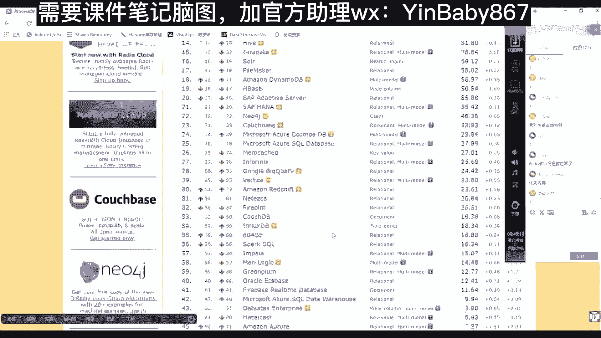
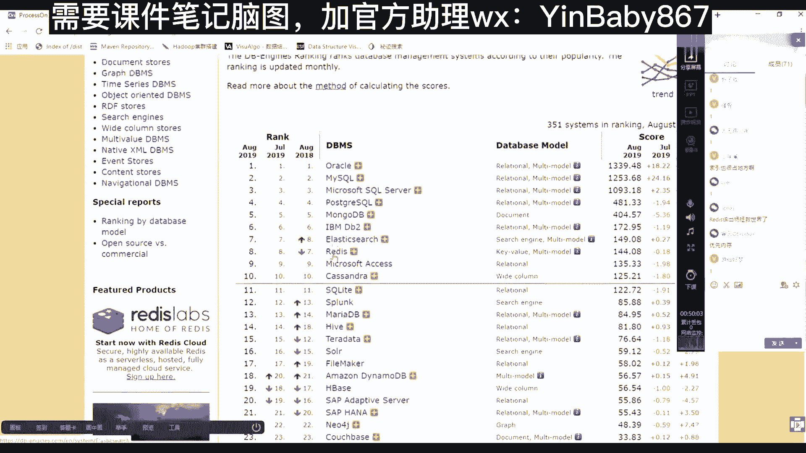
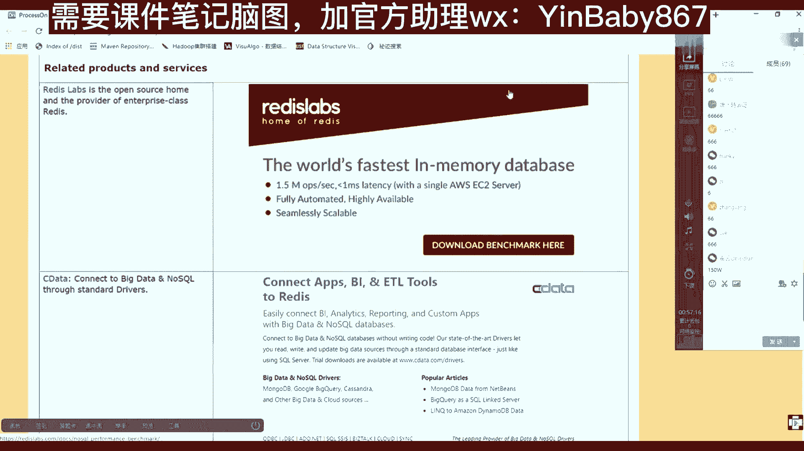
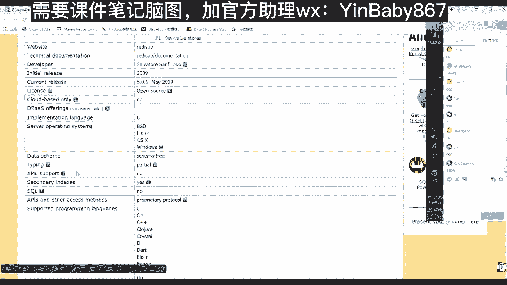

# 马士兵教育MCA4.0架构师课程 - P86：86、数据库引擎介绍 - 马士兵学堂 - BV1E34y1w773

有这么一个网址是dB的engines，就是引擎数据库引擎点com啊。

你现在可以随时在你身边，如果富余电脑，你可以看一眼啊，然后打开这个网站，上面有这么几个，一个是排名数据库引擎的排名，一个是数据库系统有哪些系统，每个系统它是干什么用的，以及什么特征，一个是相应的百科。

现在百科我们先来看一下排名点他。

那么会得到一个很多的很多的数据库。

数据库这块有很多东西。

首先你明白我为什么要讲他还是话，大家都是架构师，未来你都是架构师，无论你是你是真的架构还是剧的，你都是架构师，架构师必须有一个能力，就是技术选型和这个技术的对比，就是你一定要给公司做出一个正确的选型。

你选对了，选对了，那就用这个数据库吧，就用这个了，那么你公司可能就上市了啊，你选错了一堆人跟着你往下走，那么公司可能破产了，就这么一个最基本的一个概念，架构师可以把一家公司带到上市。

才有可能把一家公司带到破产。

这并不是跟你说笑，能理解吧，那么来看这个排名，在排名当中都是我们数据库。

看第一名的是谁，是oracle，这是关于数据库，对不对，注意后面的每行描述，它是一个relational的一个关于数据库，第二名MYSQL，那么也是一个关于数据库第三名微软的sl server。

然后等等，巴拉巴拉IPNDB2到第七名的时候也来search，注意这个时候这个MONGODB是什么呀，是document文档型的，然后呢原来third的时候是搜索搜索引擎的，然后到第七名的时候。

REDIS出现了，但是注意他什么呀，他是k value型的，基于内存的，那么这个数据库的排名你可以往下多看一看。

但在这儿要注意点啊，他的排名是全部的排名，大家注意看左边是不是有很多的分类，对不对，那么这里面关系型数据库排名，你可以单看关系型数据库的排名都是关系的，这里面也会出现我们刚才说的SAP的HANA。

看了吧，这个数据库也是有的。

然后你可以再看KV的，KV的数据库，第一名是谁，是REDIS队的，而且是基于内存的速度很快的，这时候你就知道为什么，现在所有出去面试的时候，如果达到二三十万年薪以上了。

REDIS这个词汇一定会出现在什么呀，他那么一点点区域里面必须要写些话，描述要招什么人，但是大部分的企业，BT等等都会把这几个字母放进去，就是它的地位很重要，别急，再往下走，这个网站有很多可以学的地方。

你先去把每个分类排名都去看一看，看看之后，其实这些分类如果因为咱们肯定还有一些小白。

然后从事之前没有怎么从事过这个行业的，除了排名这个这个这个区域还有一个systems。

这里面会列出所有的，比如说我们拿两个最基本的关了啊，哪两个最基本的，拿一个今天要学的REDISREDIS吗，然后再拿一个，我们好像是应该会用的什么呀，My circle，好像我们大家都应该会用的呗。

那么找到架构师的感觉。

这俩刚才也给你演示了，一个是基于磁盘存储的关系型数据库，一个是今天讲的REDIS内存就缓存，你现在看MYSQL的时候，他会给出很多的评价，这个这个很多维度的一个一个一个一个统计，比如说官网。

然后呢第一年什么时候，第一个稳定版什么时间，当前的码是多少，然后开源开源否，然后等等的下边，然后这个operating system操作系统，然后以及下边的API，然后以及客户端语言。

你可以分析出他有没有什么优势，如果你你企当中有有一部分人使用某种语言，但是这个这个这个数据库您不支持的话，可能就有风险了，或者你要么让你团队接受它，要么是换另外一种引擎等等的。

然后下边还有什么这种分布式的方式，可谓知识分布式可谓之主从复制副本啊，主主复制主从复制是MYSQL可以支持的，他很多功能都可以支持，事务是否支持一致性是什么，一致性不强，一致性还是最终一致性。

你可以在这不用去搜任何的百度，在这块的可以拿到所有维度，对对这个产品的描述，未来如果写标书或者和项目组开会的时候，就拿这个东西往往外释放输出就可以了。

而且除了这些往下，还有一些相关的评价和一些别的东西可以去看。

那么除了他再来看REDISREDIS一样，我们多出来REDISREDIS呢，它的网站是哪，REDIS点I这是他的网站，走起后面就可以关了，再来回来，然后他的初始版本稳定版是09年，现在19年是5。

0的版本，5。0版本，然后它下边是这个可以用的操作系统，然后呢最主要往下看SQL与否是NO circle，不支持SQL语言的查询，也不是关系的，因为它是KV型的，前边看到MYSQL的时候，SQL哪去了。

买SL的时候，他SQL为一定是一个SQL，明白吧，然后再往下看，客户端语言很多很多也就是它的生命力，其实我们的REDIS为什么火，这点也很重要，因为它可以和很多的项目，很多的语言去集成。

然后再往下还有它的分布式情况，集群集群模型是沙丁分片的，是沙丁分片集群，然后呢像MYSQL一般就是会做分桶啊，这边这个分库分表之类的，像REDIS的话，后边给你讲到他的集群的时候，是一种上次分片。

也就是把你公司的数据切成几个几个片，然后存在不同的节点里边，然后还有一个复制主动复制啊，然后再往下它的一致性，这块是一种最终一致性，最终一致性并不是一个特别强的，因为其使用REDIS的时候。

你要做技术选型，对他的评价就是我为什么用它，就是因为它速度快，但是如果其他的维度去影响它的速度快的话，那么这时候你可以降低不用它，而用一个更强大更稳定的其他的引擎，所以这时候什么叫架构师。

你不能破坏一个技术它的特征，你破坏了它的特征的时候，其实它可能降级成别的别的别的产品了，能理解吧，所以他这块他自己的时候就没有使用强一致性，而使用的最终一致性，然后事务这块也是他自己做的一个链式事务。

In memory yes。

然后往下看，有一些描述，最最重要，往下看，有这么一段描述。

哎这页面哪去了，我刷新一下，有一个东西得看一眼。

嗯在这其实很多知识你都不用去刻意的去找，你看，看到这儿的时候有这么一个描述，Redis in memory database，Fastest in memory database。

然后注意OPS每秒每秒的那个操作的数量，是1。5M兆，那么这是多少次，每秒多少多少操作，MK是三个零，M是六个零，1×6个零是10万，对不对，不是150万，哥不是150万是15万。

接近每秒钟15万笔操作，那么15万其实说白了就是什么呀，毫秒级的约等于小号，小于毫秒级的操作，其实一般听到就是REDIS可以达到什么呀，秒级10万操作这个东西，这个速度性能是远超过什么呀。

我们我们的观影数据库的，关于这数据库的话，如果一般的话，它千级别就差不多了，千级别已经差不多了啊好吧。

你看就是你很多的知识都不需要老师，你只需要知道一些域名，你根本就看一看，出去面试的时候和别人聊的时候都都还OK，对不对。

