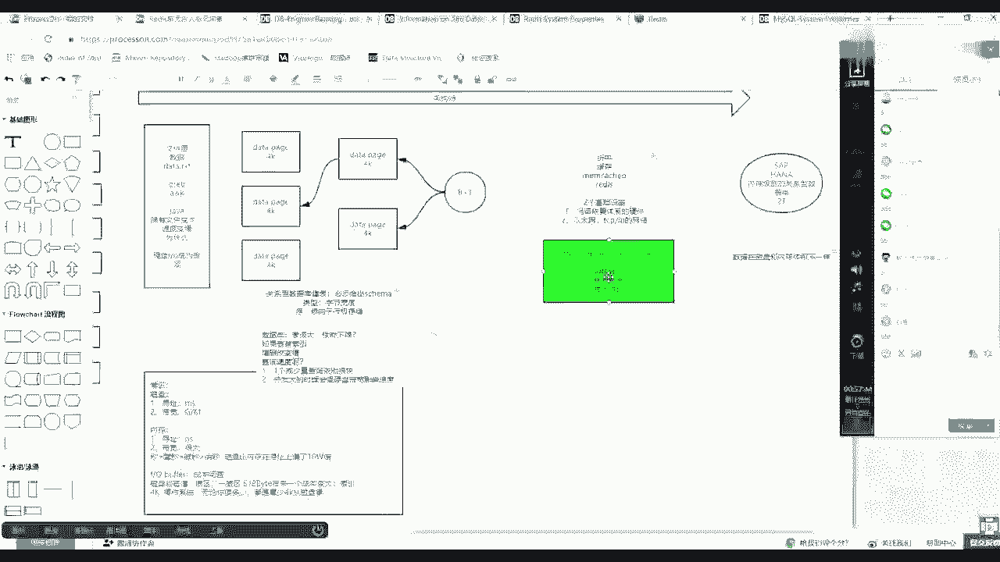
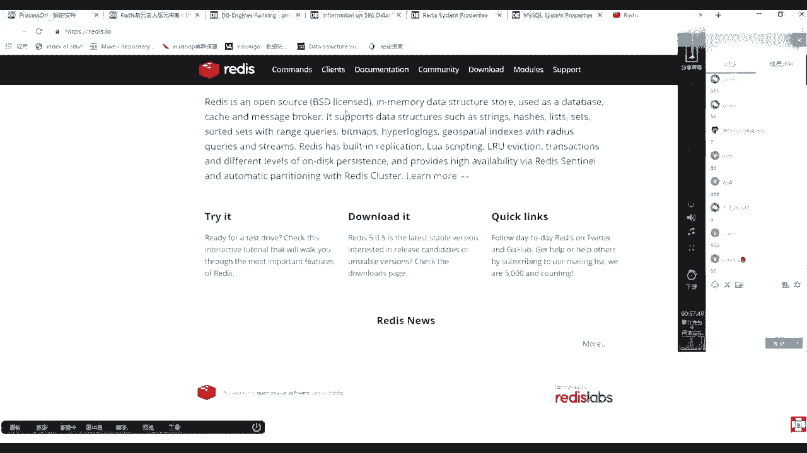
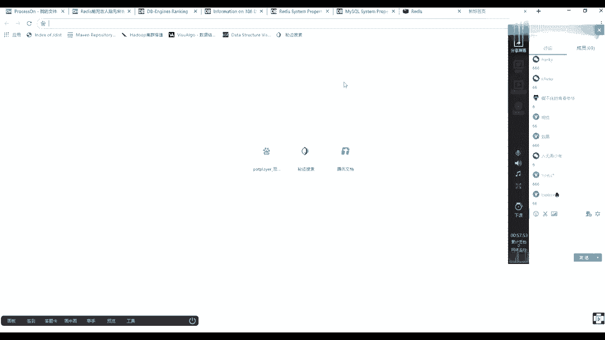
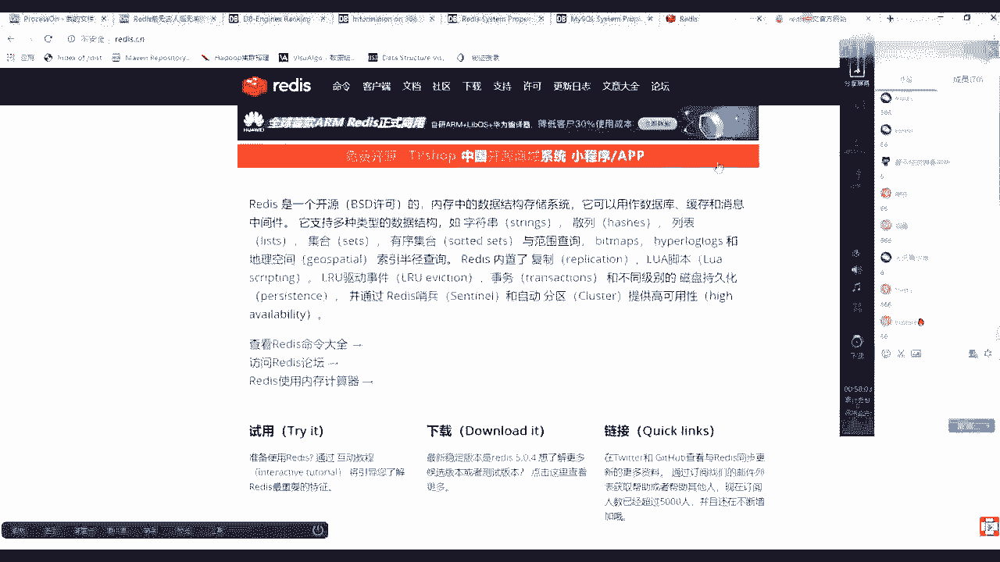
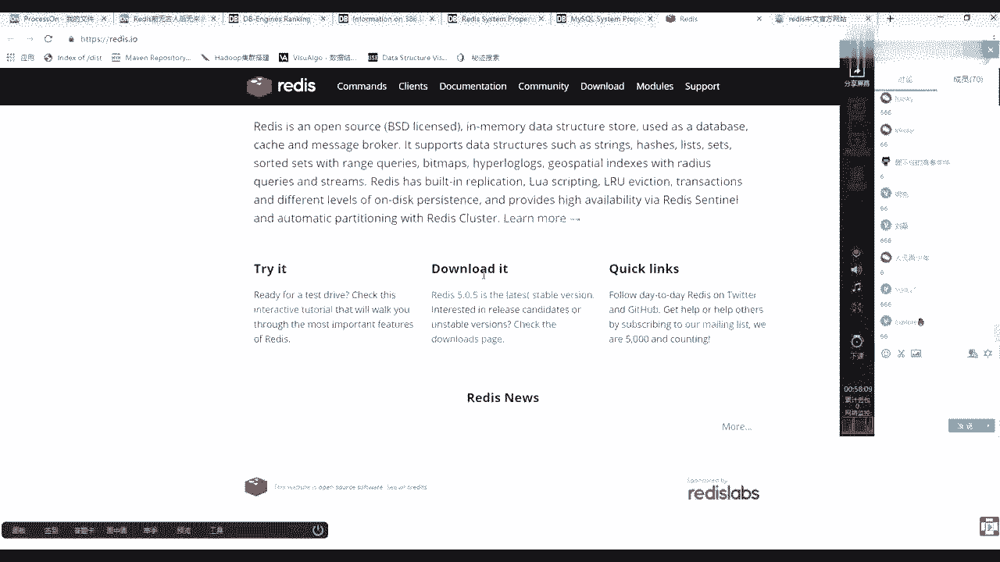
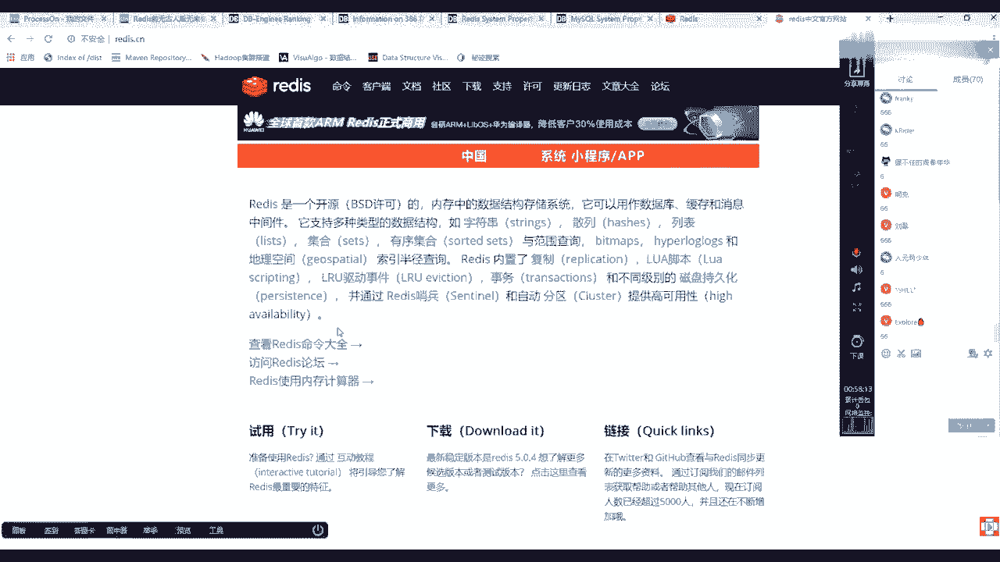
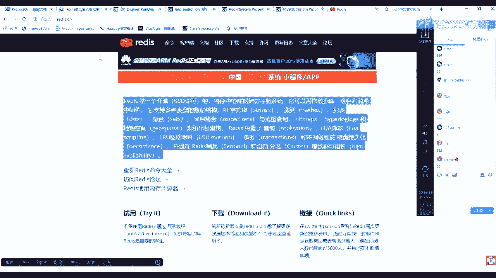
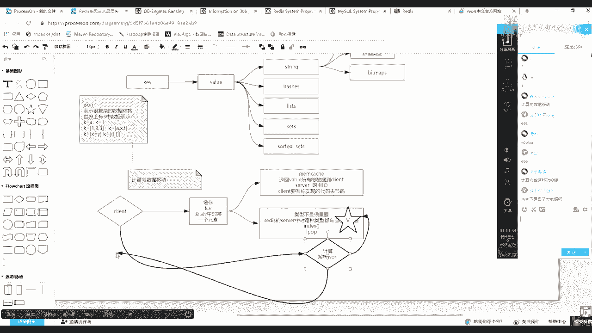
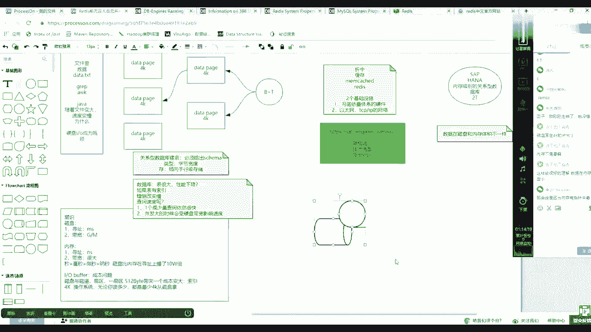

# 马士兵教育MCA4.0架构师课程 - P87：87、 redis简单介绍 - 马士兵学堂 - BV1E34y1w773

这个听懂之后，然后最后来到他的官方主页。

工作主页是英文的，然后呢，现在我们的市面上会有很多的关于中文的。

像REDISCN好吧，这是他英文的主页官方的，然后呢也会有国内会有很多中文的。

我那个英文水平其实不是特别高啊，所以这块你知道他在哪儿。

在哪儿去找他英文英文官方，然后多数看看这个中文就可以了，在中文里的话。

我们把这几个点拿一下，技能介绍他这个特征，你看现在教你的是学习方法。

所有的学习过程都是可以完全达到自主学习，不需要老师的，但是需要我什么东西需要，那就是要找到这种学习方法和条件反射的过程，以及基础知识积攒，当我把这些东西教教会你之后，未来你学新的技术的时候就变得容易了。

这是他的一个官方的一个描述，REDIS是一个大一点，REDIS是一个开源的，然后内存中的数据结构存储系统，它可以用作数据库缓存和消息中间件，然后这是前面第一句，第二句它支持多种的数据结构类型。

它支持多种数据类型，也就是如字符串等等，但是这要强调一点，REDIS的模型是，它首先是建立对的，有K，有歪了，那么一定要在这注意，REDIS里面的K和value才代表他是一个键值对，然后像这句话。

它支持多种类型的数据结构，如字串跟这几个这几个类型啊，说的是value的类型，也就是第一个，还有一个所谓的string，像建筑队这个非常好理解，因为你通过键可以找到这个value。

这个value类型有string类型，然后相应的还有一个，String，然后哈希，类型的，这是一个学习的过程，如果你们来学习新的知识的时候，也像这样去学习，然后还有list，最基本的是五大类型。

然后后面我会给每个类型给你讲，然后主要讲的场景和如何使用，然后还有set，那么现在你其实要回忆拉回了，你在做编程的时候，你离得开吗，这些在在你做普通编程的时候，是不是也会用到数据。

数据类型的概念和数据结构，对不对，因为程序等于算法加上数据结构，还有一个词汇，这已经是够五个了，然后向下延伸出来的还有一个beat max，这个知识点也很重要，它是完全用内存里面的二进制位来进内存。

存储空间，但是可以解决很多重要的事情，然后string其实后面会给你讲，它既是string，也就是可以用字符串操作字符类型，然后也有整形整数类型操作或者数值类型，你为我写了个max版，写出来就是类型。

嗯然后等等，其他的后面先不用写，有这么多，然后这是这一句，然后待会总结REDIS内置了复制，然后落脚本LRU这种驱动事件，也就是过期等事物和不同级别的磁磁盘持久化，并通过REDIS哨兵和自动分区提供高。

这个提供高可用性就可以，它有集群class，然后也有一种主从复制的东西，那么以上这里面先过多的先不说，过多的先不说，首先回到圆脸上，把它露出来之后，要去聊一个什么事情，在缓存。

就是现在你读完一个技术之后啊，你给他简单画一个像，画出像了之后，你必须做类比，其实在这个世界上，在专业之前已经有一个技术，这个技术叫做MAD catch，或者你不知道他不知道他。

但是你应该能找到这种感觉，就是键值对的，他也是对的，KV的，都是KV的，那么REDIS是KV的，然后呢MCAT是KV的，那么ready出来之后，反而还渐渐取代Mac生存的地位。

那么为什么为什么他会取代这个map CD，那么如果稍微一查资料，就会知道mp中它的value没有类型的概念，value没有类型的概念，但是redis value就有类型的概念了，这是两个最本质的区别。

你随便上网一搜就可以搜到这样一个结论，那么这时候你要正确的根据条件反射，你学过什么知识，或者你活这么大的时候，如果看到这样的一个区别，你能给出怎样的一个结论，这就是知识，你要善于动脑，找到条件反射。

能理解什么意思吧，首先你要明白一点，如果曾经我在第一次学这个字的时候，我上了一搜RASE，说他有value有类型，然后我们开始没有类型，然后当时我大脑条件反射第一个东西是啥，跟着我的思路走啊。

跟着我的思路走，为什么条件反射JASON这个东西，因为肯定开始没有REDIS，那么如果假设世界上只有这种这个段，然后外面没有类型，那么我们使用这个技术的时候，可不可以存一些复杂的东西。

那么这时候你的条件反射是JASON，对不对，JASON它可以表示很复杂的对数据结构，那么还有一句话，这是在我曾经第一次接触杰森的时候，我随便上个苏思量，我忘了什么地方，有这么一句话，就是说世界上。

三种数据表示，比如说K等于A或者K等于一，然后这是第一种，或者是K等于一，二三或者是K等于，然后ax f也就是上面这个等号，后边上边单元素或者线性元素或者是K等于，然后一个X，然后等于Y就是建队。

或者你再可以整合出K等于复杂的这种应用，比如1K等于一个数组，数组里边又是对象，嗯没毛病吧，这个你面试的时候都可以聊这个事情，为什么要聊他，其实这里面这就是为什么REDIS。

它这个类型会优于我们的来看的，首先如果你条件反射想起这个知识，那么你会得出一个间接结论，也就是说你value有没有类型无所谓，好像好像是不是无所谓，因为我们开始只要有建筑队了。

我的value是不是也可以放一个JASON，然后来代表肯有有数组，这边你有list，我这边是不是也可以，也可以用JS表示一个list，你这边有这种hash set high table这种建筑队的。

我这边是不是也可以放这个这个理论，能不能听明白，听懂同学来刷波一，好吧，当这个理论你明白之后，也就是说其实我可以不用REDIS，我用Mac catch的，它的value也可以存很复杂的东西。

但是但是注意了，你要再逆推一件事情，那么他们的成本，这个value的类型的意义是什么，因为你上多了，他有这个类型，那么它的类型的意义在哪，如果注意听下面一个很重要的一句话描述。

你就知道为什么你要学REDIS，如果我的客户端，客户端想通过一个缓存系统，而且是KV的缓存系统当中取回，取回这个value当中的取回，value中的某一个元素，取出value当中的某一个因素。

也就是这个麦片当中Y里面存了一个一个数组，然后呢你用原力的value当中存了一个list，那么这时候如果想取回其中的这个，它的JS里面的某一个元素和直接，如果他有类型这个例子某一个元素的话。

那么成本就不一样了，那么相对MCARE来说的话，MCD怎么做的，你需要返回所有的，返回value所有的数据到client端，那么慢慢开始台服务器，如果很多人都这么获取的话，网卡那个IO就是最大的瓶颈。

而且这是第一个要访问的客户端，第一个就是服务server网卡，卡IO，第二个就是client端，要有你实现的代码去这个编码或者解码，解码解码你的JSJS数据解码出来，也就是说只有两个复杂度。

但是如果换成release的话，因为它有类型了，类型是什么意思，类型其实并不是太重要的，面试一定要跟面试官说，类型其实不是很重要，重要的什么，重要的是redis server。

中对每种类型都有自己的方法，也就是说其实他可能给你提供了一个基于index，让你给出一个索引下标或者l pop怎么样，也就是你的客户端只需要向对方调一个，我取那个value的某一个元素。

或者左边或者右边弹出一个元素，那么这个时候其实它就规避了上面的问题，你客户端不需要写很多的，因为它不需要把全量数据取走，你RESERVER网卡就OK，然后你客户端的代码也比较轻盈，好吧。

诶这个图为什么不往下扩展呢，本质是解耦，那么在这个如果学过大数据的话，应该能给出一个词，这个词叫什么词，学过大数据的话，应该可以给出一个词来描述这个过程，优势其实没计算向数据移动，计算是向数据移动的。

因为你的客户端不是把数据拿回来，在这方计算，而是说调用它的方法，你的计算方法是在这边发生的，数据直接回来了，好吧，OK那么粗略的这么一个介绍，粗略的介绍，从开始这个位置到这个位置的一个演变的过程。

先做一个简单介绍，一会计算向数据移动，没懂是什么意思，很好解释啊，Memory catch，你是不是要把数据你的计算在哪，在使用的时候，你的计算是在这个位置，这个计算是什么，就是解析，JS字符串。

你的数据是不是一定会存在你的MC里面那个value，然后你的客户端是不是一定要盖的那个K，然后把这个六是不是要通过他的网卡，然后是不是要回到你客户端，然后走这个计算，这计算对不对，规矩就。

然后但是如果是REDIS的话，这个计算是不是REDIS中针对这个value类型，是不是会有一个计算，然后这个阶段就在这等着，然后其实只等着你的调用了，如果你客户端说掉了一个一个计算。

这个计算并给出的是某一个K对应的value，那么这个计算就会在服务端发生这个过程，然后发射完之后计算的小量的结果会返回给你。

磁盘固定4K大小，这是不一定的，磁盘其实有缓冲区啊，就是其实其实硬件都有缓冲，你硬盘上面会有一个缓冲区，也是基于芯片的，而且现在不止有缓冲了，还有一个这个加加速，就是固固态机械混合这种混合版，然后呢。

你的磁盘可以格式化成4K大小的一个格子，或者格式成更大，为什么，因为取决于你上层应用访问数据的量，就是我掉你一次可能要多少，一般操作系统4K大小合适，不怎么浪费，然后呢也能支持你存一些小的文件。

小念不怎么太浪费，然后基本上中职的文件就可以了，但是如果你买了一台服务器，想做视频录像，就你又买了几个摄像头，记得这台机器上买了一个采集卡，那么这个时候其实你未来你想你把你写的数据。

和你监控上面播放的那些数据，对磁盘的话就不是很小很小的访问了，那么这时候你磁盘4K其实就有点得不偿失，因为寻址带来的时间这个碎片化太太太大了，你磁头绕来绕去的，还不如把4K变得更大一点。

让你的磁头飘到某一磁道上，直接读出更多的东西，就减少磁头空难中去寻址的时间，就把寻址再降低，也就是说其实硬盘这个格子大小是4K呢，还是更大呢，其实取决于你上层应用，对于IO的这个熊量，就是想怎么用它。

我是想更多地读它，就是IO密集型的。

