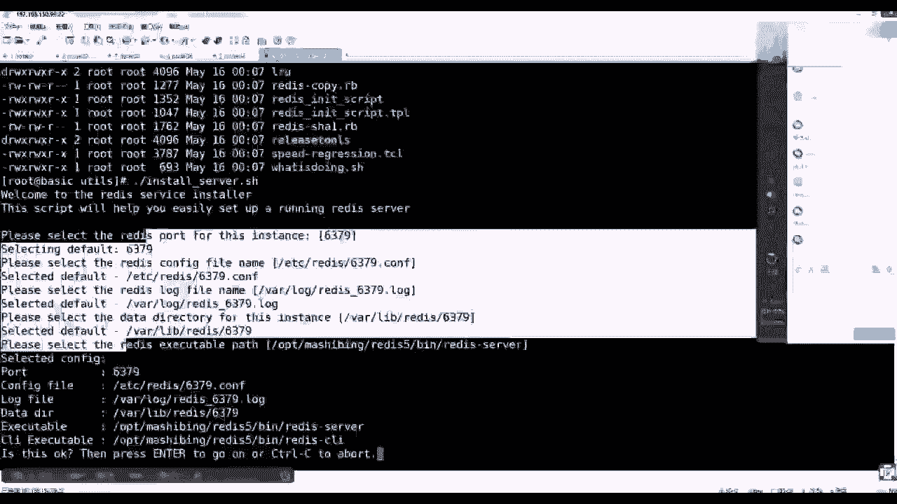

# 马士兵教育MCA4.0架构师课程 - P88：88、 redis安装实操 - 马士兵学堂 - BV1E34y1w773

首先要安装，要去做的话，我来介绍一下我这个环境啊，Snoos，这是一个LINUX操作系统，我用的是六点叉的版本，六点差的版本，然后呢，我们安装REDIS就直接从官网拿最新就可以了。

因为虽然版本变化可能从曾经的二点差，三点差，4。05点差，其实里边最核心的东西变化不是特别大啊，直接官网，啊这现在有点长。

这个环境，然后呢，我的计算机在上课之前已经重置了一台，非常干净的，比如在你们实操的时候也最好做一件事情，就随便拿了一台机器，然后呢给他拍了一个快照，然后拿了一个原始出装那个状态给他转到。

然后拿到了一个非常干净，那么现在我运行这个状态就是没有任何配置。

等于系统刚装完能解，什么意思吧，得到了这样一个系统非常干净。

什么都没有装过，然后根据刚才看你可以看中网，可以看应用网，它都提供了一个download，然后呢让你下载的是5。0这个版本，把鼠标挪过去之后，看左下角那个状态提示，就是一个踏实地压缩包。

所以你直接复制复制链接地址，在这做一个复制链接，然后可以给你粘过来啊，最好最好你们还是养成一个习惯，就是少去抄，然后能记住这个步骤和原理，你会发现这就是一个app的一个一个，一个资源的地址。

那么拿到它之后，可以在当中怎么做，使用w get，然后后面接了个地址就可以把它下载下载，所以但是这个命令没有啊，因为是新系统，该系统你要装一下这个w get这个命令，现在他先跟这个仓库同步一下。

这个稍微延迟一小会，等他一下，他家目录，随便建一个目录也是干净一点，CD到soft里，然后w get把你刚才那个地址粘过来。

条条大路通罗马，并不这种方法并不是唯一的方法，有可能公司里边根本连外网访问不了，所以你还得使用一些插TV等终端上传，无所谓的，咳咳咳，然后清完之后，你会发现压缩包有了这个之前的知识。

应该两边的两边学院的同学都有过记载，就是他JZ的压缩包怎么解压，是不是看XF直接REDIS解，因为它的源码体量很小，其实他才1。9兆，他自己才1。9兆，它源码嘛很小，然后解完之后，这个目录这是源码目录。

进入REDIS，那么这是一个常识，基本是源码，LINUX当中呢要按的程序都是C语言开发的，基本上都是C语，然后呢像源码安装的时候基本都是一个套路，什么套路，源码安装上来看的第一个东西叫做read me。

你在GITHUB上面去访问那些java开发的代码的时候，他进去之后，GITHUB任何项目的也是那个页面也是read me，就是无论你未来安装啥，就先看read me就可以了回车，然后你可以细读。

也可以粗看，基本上他会告诉你，这个REDIS的编译build在编译这个REDIS怎么去编译的，他说it's as simple as就是make命令就可以了，执行make命令就可以编译。

你还可以强调它编译成二十二十四，32位或64位，还有test还要清除make，后面加DILEAN就可以清除你之前编译，如果编译出错的话，再往下找，除了编译过程，下面应该还有一些关于安装的。

编译完其实好像可以直接使用，但是后面会教你编译完之后run redis，你直接在它的源码里边，就可以找到那些编译完的可执行程序，就可以把它跑起来了，这是一种方式，还可以把它装到你的这个系统里。

这是如何去使用它，启动它的客户端就可以使用，所以这时候其实根本就不需要老师，你们需要的是学习方法和一些套路，然后installing redis，如果把它装在系统里面。

是直接执行make install，或者是接上一个你想安装的位置，就修改它的位置，因为它默认位置装在什么，User local bin，这个这个是它的默认的目录，你可以更改它的安装目录。

就是在make install中间加上这么一个perfect，这个环境变量的定义，但是这个环境变量是随着这个命令执行是有效，命，令执行完这个变量就失效了。

然后他的UTILS这个目录下还有一个install server，点SH执行这个脚本，可以交互式的完成既有后端服务脚本，又有配置文件等等一系列的输出，完成这种服务器的安装，以上听不听得懂，但是你知道了。

要上来看，Read me，这句话听懂同学来刷一波六，好吧，但是你要注意了，你们都是用java语言，对不对，java语言编译的时候是不可能缺少什么编译环境，就是编译器对，那么这个时候你看我们无非就做了它。

让我们执行在这个目录下执行make，但是在这多说一句，其实make的原理make是make和我们的源码没有关系，make是编译命令，它是我们LINUX操作系统带的。

它是LINUX操作系带的，它是一个编译工具，但是他并不知道你不同的下载不同的源码包。

应该怎么编译，它不知道它需要跟随一个文件，叫做就必须找到一个文件，就是make f，你之前index的时候是没有make file，所以你要先执行CONFIG。

CONFIG完了之后会生成make file文件，你可以回去再试一把，打开你index那个源码，然后它里面是没有make file的，你所以你看他read me，他告诉你先执行CONFIG。

看完之后会有make file文件，然后那么其实make命令直接如果回回身拍的话，他是要读这个make file，我们先简单看一下这个文件，max max其实就是一个文件，一个编译脚本。

然后这里面会说了哎default or，然后什么还有一个title install，然后里面会怎么去，如果你什么都不输出的话，make后面什么参数都不带，那么走，他走的其实是让他要CD到SRC。

然后下边然后再去执行make命令，一旦你的参数，如果你install的话，如果你make后面带着install，刚才看安装的时候是不是可以make install，对不对。

你make后面install并不是make命令，install是你make file文件里面的那个title，你把它换成圈圈叉叉，那么你就要安装的话，就make军事圈就会触发这一行，明白啥意思吧。

所以这时候其实你会发现这个源码根目录下的，MAMAFILE文件就是一个跳远，它会跳到某一个目录下，然后那里边会真实的去执行你的Mac命令，一旦一个参数，所以真实的代码真身并不是他真身。

是在RC目录目录下，我们来看一下VVISRC哎，别别别别别，VN是CDCD的SRC的源码目录，这是我多讲一点，因为你们之前肯定是对电系统用的人，不是特别多的，不然后在这里面你会找会有一个真身文件。

Make file，是不是在SNSRC目录下，是不是也有一个file文件，然后这时候vi make file文件打开，这才是真正的一个文件里面写了很多了，所有的编译的环节细节怎么去编译。

以及你可以杠这个斜线，然后install so，未来是不是他make后面可以带一个36install，那个INO会间接的从外面的make file让你掉到里面，那个SRCM下INTEL参数还会带过来。

所以打开这个文件之后，他也会找install，找到开头这个title，那么上面是编译的过程，下面就是安装的过程。

那么你看软件什么叫编译程序，安装编译就是拿着源码变成那些可执行程序。

安卓的安装其实就是一些什么拷贝的过程，拷贝过程，那么这里面会用到一个东西，就是有一个，找不到哪去了，有一个release install redis server name install b。

有一个perfect，来回忆一下，把这个推到文件上面，然后在这会找到一个，Thanks，是不是在使用make命令的时候可以接install，是不是里边还可以再让你设置一个perfect。

然后这时候他你看他，他如果这个这个变量他没有找到的话，那user local如果找找找到你设置的话，那么就会使使用你设置那个能理解什么意思吧，然后给你演示一遍，就知道先把这个记住啊。

所以这个时候真正干活的回退，你还要回到这个源码，因为原文件会有一个make file，他让我们执行Mac，但是注意他还缺一个编译器，但是他让我们怎么做，你就完全按着read me的流程去走。

他让我们怎么做，我们就怎么做走，然后这时候他一定会报错，Cc command not found，cc是什么意思，C就是C语言的编译器，对不对，是不是C语言编译器没有。

那么这时候条件反射基于LINUX的话，一般都装什么，是装GCC，In all，因为我们的LINUX是gal linux，这个D是gal那个开源组织的意思，所以装的是GCC回车能听懂吗，同学们能跟上吧。

你看我们装的是GCZ，而且使用样的方式，它会装很多的依赖以及该升级的东西，同意走，先把编译环境给他，给他装起来，条理清晰吗，听得清楚吗，同学们，稍等一下把它装完，好了装完之后，因为你不是神。

你肯定不知道未来会发生什么事，但是你知道read me让你干啥了，所以你就干啥，make还是make，而而而且这你要回忆刚才关键的知识点，make后面是不是任何参数都没带，任何参数没带。

就是make里面那个default，就是要跳进去执行编译的环节，所以make命令如果一般来说通俗来说make直接执行，就是拿着make file去做编译，回车就报错了，报了个啥错，Depend。

我们来切一下，make点c t this cream，因为刚才执行一次编辑的时候报错了，所以你要清一下刚才那个编译，编译报错，那那那那个临时文件，而且这个命令并不是我从哪学来的。

是不是reading mei给我们提供的，比如你编译刚才是不是你只要通读一遍，read me里面是不是告诉你了，有那么一个make this is clean，没毛病吧，所以我也不是神，对不对。

有笔记后边都我先给你带一带，那个流程先跟着思路走，然后到时候把笔记给你写到图上去，好了装完了，他说it's a good idea to run make test，可以做一下测试。

但是一般我们都比较懒，这不就就不去做了，因为它的消耗时间太多，但是到公司的时候，你肯定是要编译的时候要测一下，看看是不是编译有有有这个有bug漏洞等问题，好吧，那么清收刚才做了什么事情了。

是不是就执行一个make，缺什么补什么，缺这资就补这资金，然后执行make时出错的时候该清清，清完只make之后成功了，make完注意分几个阶段，make完之后去你的SRC目录下。

就有了一些可执行程序了，比如redis server和redis CLI client就有了，那么一般你在这，比如在这个录下，我就可以REDIS，然后server让它跑起来了，回车他就一定能跑起来。

明白吧，但是这个时候其实你到公司的时候，你的软件的启动不可能每次都人工干预，这种方式是不是特别low，对不对，所以这时候你肯定是希望把REDIS的程序的进程，CTRLCCTRLC可以给他结束掉。

那么你期望的是让这个程序，它更像一个服务软件，就曾经装了一些服务，让它变成一个服务，但是你怎么去构建呢，Ok，刚才在read me里面也看到了，他是不会说有一个在UTILS目录下。

UT目录下会有一个脚本叫做install server，明白了吧，这些东西都不是我跟别人学的，就跟着read me，来来来来来来学的，所以这时候你就直接按照这个来做就可以了，但是毕竟我装过。

我告诉你一个前置条件啊，不少做少做一步少做，先先要去装，因为再带你看一遍看一遍吧，Read me，然后找到install，咱们就按流程走，也就是上边如果你编译完make编译完之后。

然后你可以在它源码目录当中CDSRC跑server，然后跑client可以来使用，但是你更期望的是把这个程序install，你的这个操作系统里去。

所以我们有可能要执行make install或者make，带着perfect install就装到某一个目录下，这个装完之后软件安装进去了，但是你更期望的是把它变成service。

所以在执行intel server走这么几个流程，这些流程都是从REDMI来来来来来得到的，能理解吧，所以我按照流程走，第一个是先去安装make，然后你要装的是install，安装安装哪去呢。

你可以接一个perfect，然后告诉他装到OPT，然后B咱们叫什么呢，马士兵吧，马士兵，然后下面有一个REDIS5这个目录，这能看懂吗，make install这个all是不是make sc目录下的。

inside里面是不是会执行安装的过程，perfect是不是覆盖他那个脚本，那个脚本文件里面那个那个那个变量，告诉他一定要装到这个目录下，然后回车，然后这时候你去看OPT，然后马士兵。

然后这个目下就会帮你创建REDIS，然后去到REDIS目录下，然后会有一个bin去到bin目录下，你就可以看到相应这个刚才定义完了，可执行程序，帮你牵出了签到你系统的一个你的安装路径。

下了就没有和源码混在一起，这部看懂的同学来刷一波，一，你看懂了这部在干什么事情，好吧，但是这时候你要注意啊，我只是把可执行程序这个文件放到了系统的，我希望这个路径下，但是这时候想执行的话。

依然还是这个目录下，我要执行redis server，让它好起来，但我更期望的是使用曾经那种比如说什么service，然后REDIS，然后star把它跑起来，但现在它不支持，所以还缺了一步。

把它变成服务，那么别的服务怎么去做，然后回忆那个read me文件里面，是不是让你这么做的，来到源码目录当中，Python让你去UTILS目录下，会有一个RESULSERVER安装成一个服务，安装一个。

那么执行它的时候，注意这个隐匿的那些东西都不用手工做，执行它就可以了，但是这个脚本，未来他需要知道你的程序安装到哪个目录了，我们要多做一件事情，vi etc profile文件到文件。

最后新开一行export，定义一个redis home，一般我们在操作运用当中装了什么，什么什么程序了，是不是都要把它home，然后以及它的bean目录，可执行程序文件追加到pass那个环境变量里。

你追加进去了，你就可以在任何位置使用那些可执行程序，这是一个基本常识，兄弟们，你java是不是装完之后也得试加home，目标不是为了设置jaa home。

是要为java home接他那个bin接到pass里去，所以你的所有你的java命令在这个位置可以执行，所以我们在这来做是opt，Release5，先把它的安装路径加进来，然后export。

然后是大写的pass里面等于dollar把pass拿出来，再拼上我们的REDIS，home下的bin目录主要是要接这个bean bean，里面有那个RESERVERRELP，然后把它加完之后保存。

保存完之后注意配置文件是死的，它存在磁盘，当内存里面做程序只能跟你配置不知道，所以source etc profile文件，然后这个时候echo dollar pass。

里面就会出现你REDIS那个闭目录了，所以你可以在任何位置，起码说我可以直接REDISCI就可以起客户端了，这个命令在任何位置可以用了，这个听这个环节，听同学再说，波一这是一个常识吧，对不对。

这是一个小常识，当你有了这个之后，你再来调这个install server，它就可以通过上面这个目录里面找到一个命令，就知道你的安装路径在哪了，这是他需要一个过程，如果你不是的话。

其实你到时候手敲也可以，我们来走一遍，下一个流程就是在当前目录下执行install server，注意看回车。

这时候please select the redis端口号for this instance，也就是，我们希望在我的win系统中安装一个REDIS服务，但是他告诉你，你必须选一个端口号。

这个逗号是为你当前实力的，这句话，另外一个意思就是，一个物理机上边可以跑一个REDIS，也可以跑多个REDIS，他们靠什么区分啊，靠什么区分，是不是靠端口号来区分，对不对。

那么这时候注意他括号叫做默认选项，你不填东西，后边等着你输，你不填东西，它默认就用6379，而且也得出一个基本常识，REDIS默认端口号是6379，如果不选，就20 6379。

因为这是目前的第一个实例回车，他会继续追问你，please select是什么呀，Redis config file，配置文件程序都是有配置文件的，注意他放到哪去了，ADC是不是放配置的目录。

他在里面会准备一个release目录，且为你这个实力准备一个为你准备的，6379点cf，也就是如果这台服务器这个脚本，我吊起十次，我可以装十个in30个实例，十个端口号，那么每一个实例。

它的配置文件的名字都是随着端口号而变化，不会覆盖这个在提醒同学来刷一波一，也能也能跟得上，对不对，然后再看除了配置文件，程序运行的时候，是不是还需要日志文件，日志文件放。

他帮你规划到word word是不是放数据目录的，放数据目录，对不对，所有的日志都放这个目录目录就放，然后那边会准备log redis，然后加上端口号的日志，然后只要你上面给个端口号。

所有的资源文件都能通过端口号来区分隔离，对不对啊，然后我们再走，默认再走，下周会告诉你，slice data directory就是数据目录，那么这问一句，REDIS不是内存数据库吗。

他为什么会有一个磁盘目录来存数据呢，因为只要提到内存的软件，它都必须触发一个技能叫持久化，因为内存掉电易失，对不对，那么注意，你看这个目录是不是又是拿着多个号去区分的，也就是6379。

所以你装很多的实力是不受影响的，回车最后police slice什么REDISACCUSABLE，就可执行程序的路径，那么在这他怎么知道是装在这个目录下了，是不是我刚才那个环境变量的配置。

如果环境变量没配，你是不是在这手敲这个命令的路径，这也能听懂吧，所以我配了它就自动识别到这个位置了。

那么好，OK就这个位置回车上面一系列选择完之后。

因为第一个我就不去改，待会再装一遍，我再去改它，然后这时候告诉你这个selected，你选择的配置如下，逗号是379，巴拉巴拉巴拉，然后这时候如果你觉得OK没有问题的话，然后press enter回车。

然后要么就CTRLC结束这个流程，什么事情都没发生，我们现在就回车，注意看回车之后啊，注意看，回车之后回车拷贝他在临时目录当中书写，这个637有点com，把你前面很多东西都写到配置文件里去了。

然后并根据上面的描述放在这个目录下，这是第一件事情，第二件事情，installing service安装服务，他其实是把什么把一个启动脚本装到哪去了，装到了etc的引力的目录下。

BQCONFIG做了开机启动，在2345启动，并他还帮你把REDIS提起来了，那么这是常识，注意听啊，这是常识，他能做这个CONFIG，能做开E服务启动的话，他一定会向哪个目录。

是CD etc init d的一个目录下，他一定放了一个东西，这是REDIS6379这么一个脚本，注意这是一个脚本，这个脚本当中他书写的，你看我们的可执行程序，就是刚才他识别那个程序。

然后它的配置文件就是他刚生成配置文件，只能看同学来刷波一，那么有了这个脚本了，并且执行了带绿色了，那么这时候我们是不是可以在任意目录当中，REDIS服务名叫什么，是REDIS，然后start吗。

或者studies吗，一定要写这个脚本的名称，才能是这个脚本名称，就是service这个后面接这个东西，对不对，所以后面接的下划线6379。

然后可以studies来看一眼redis is running，在6244id，为什么，因为你上面安装完之后，是不是还给你做了一个study，服饰已经跑起来了，以上流程整体看明白的同学来刷一波六，好吧。

你能装一个实例，今天是不是可以装多个实例，你再回到这个目录下，去哪儿是不是去UT，注意这个时候注意我的程序在磁盘，那个可执行程序是不是装在OP里目录一份，对不对，但是这时候未来我这个计算机的内存里。

是不是可以用REDIS的几个技能，几个实例程序文件是不是只需要一份，那么内存里的时候会出现它多个进程的呗，一来自这个肯定程序有多个进程，多个进程他们是不是来自于不同的配置文件，未来使用不同的持久化目录。

对不对，也就是程序是一个，剩下的资源和内存是多个副本对吧，那么这时候我们还执行这个脚本，install server回车，那么这时候他走的肯定是脚本里默认值，那么639我是不是装过了。

我只要告诉他6380，然后回车，然后这个时候你看以下的配置目录，所有文件是不是都使用6380，对不对，都能区分出来，你根本就不用管，然后但是程序不是来自于一份程序一个版本的。

然后再来回车是不是告诉你一个三八，你觉得有问题吗，没问题回车，然后这时候会告诉你怎么样，又是你这个安装完了并给你启动了，所以这时候service redis6380studies，是不是又一个跑起来了。

然后这时候你可以用什么去验证PS杠，F grape redis，这里面REDIS是不是一个一个进程，646244，刚才那个一个6288，这两个进程是不是使用了不同的端口号，跑在了不同的。

就是两个独立进程了。

但是程序是来自同一目录下，同一个程序在内存里边。