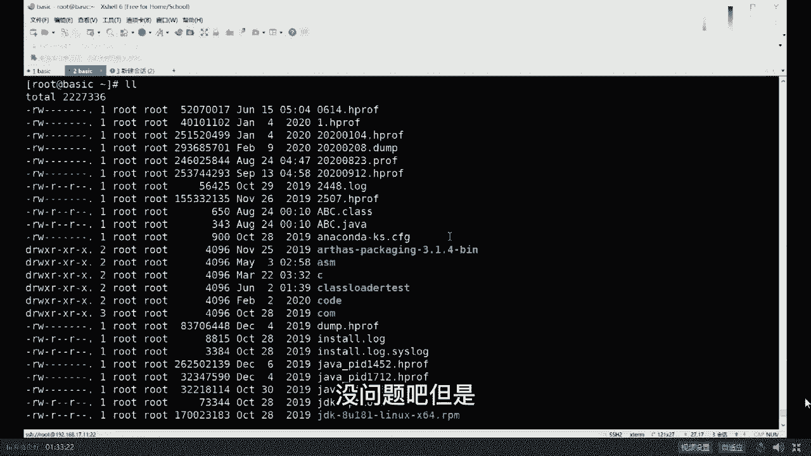
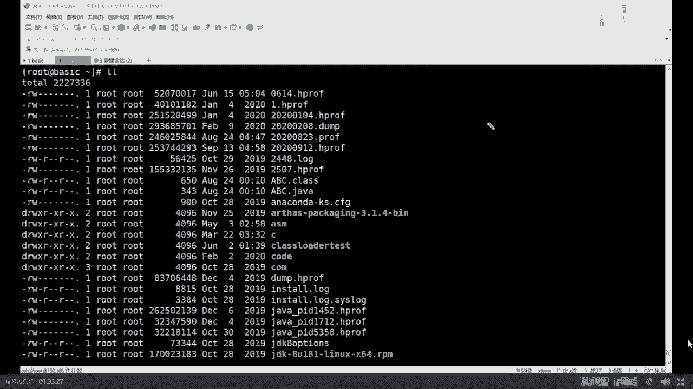
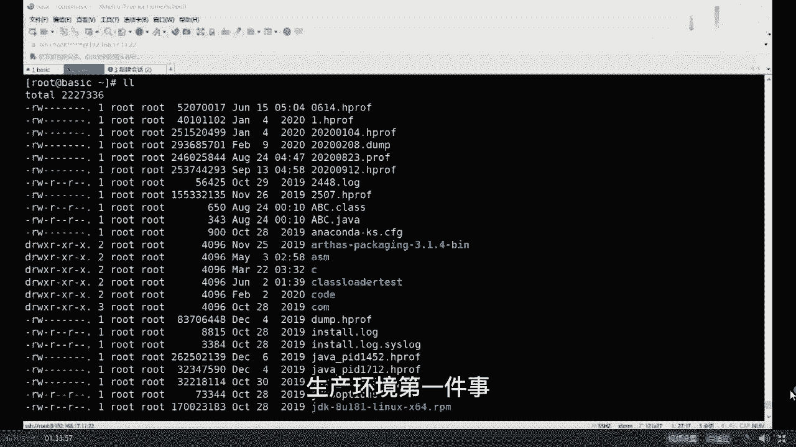
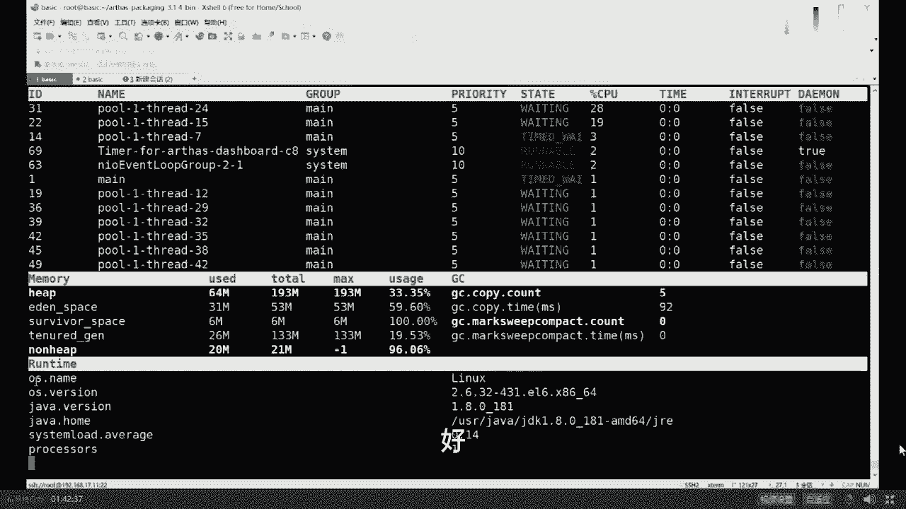

# 马士兵教育MCA4.0架构师课程 - P8：8、JVM调优实战（下） - 马士兵学堂 - BV1E34y1w773

For slb，摘下来执行，good不错，还有一种说法是什么，来的访问，复制一份，复制到备份机，在备份机上执行，good不错，测试环境压测的执行，good不错，都可以get了吗，嗯我们来看第j map。

第二个命令，第二个作用，我看这里呃，那么j map的第二个作用，我先把我的头像拖出去，再看这里，JIMAP第二个作用是什么呢，第二个作用是它可以用这样来写dump。

for a dob就是binary2进制类型，产生一个dump文件，file等于他说叫今天是2020年9月11号，20200912。2，H profi，后缀名无所谓啊，后缀名写什么都行。

这是产生一个我们整个堆内存转储文件，然后呢来对它进行分析啊，然后后面跟我们的id号id号是什么来着，1198811988回好了，他这时候开始把堆进行转储。

产生完了。

这是我们新产生的20200912的H方法，好听，我说一句。

这个堆专注文件的意思是把java的整个对，整个堆JVM的整个队导成一个文件，然后下面可以你对这个文件进行分析，对对文件进行分析的时候，就完全可以使用那些网上。

你们喜闻乐见的各种工具了，比如说图形界面的JVOVM，这是j visual vm，嗯你你你你打开文件装入，你就直接把那个刚才那个文件呀，给他装入进来就可以了，这种的profile给它装进来好吧。

然后呢装入进来之后呢，你找到内存，找到抽样，然后你就观察出来到底是哪些个呃，你对象啊占的内存比较多，你就观察出来了，嗯这是一种好吧，这是第一种，有同学说了，老师这个JVRVM我没接触过。

这是java自带的这东西，这东西用我说吗，这东西用我说吧，不用吧，不用不用，很简单啊，这是java jdk自带的好吧，说两句，我同学实在是基础太弱了，你基础这么弱，我就没招了，简单跟你说两句吧。

你你就是你java装完了之后，jdk binary里面你找到JVIVOVM，就是这个图形界面的工具，这图形界面的工具呢它也比较强大，他们除了可以观察你本机的这些id之外，也可以装入用文件来观察。

也可以干嘛呢，也可以远程来观察。

比如说这是你LINUX服务器，你也可以用一个GB ram远程连接去观察它，这也是可以的，这个没问题嗯。

然后你就可以对它进行分析了，分析完之后你也得出结论了。

原来是cut info那个类太多了，依然是这个结论，没有什么其他的好吧。

然后下一步查你业务逻辑，查业务逻辑，别人就替不了你了。

好这块内容讲的稍微快了一些，来能跟上老师扣个一。

我觉得这个比较简单，没问题吧。

但是但是。

我讲这么快是有原因的，因为实际生产环境之中很少这么玩。

原因是啥，你往外导文件依然会产生卡死，会让JVM卡死，你能不能让你随便倒吗，不能，所以这就涉及到，你什么时候才能把这个文件给拿到，生产环境里头的第一件事，好好听我讲生产环境。

第一件事叫做设置好你的启动参数。

这个启动参数啊。

包括这个参数，Heap dump on out of memory error，就是当我们启动的时候，一定要把这个参数设置好，这个设置好的意思是什么呢，就是hit down，什么时候产生OOM了。

什么时候它会帮我自动生成堆转储文件，再说一遍，什么时候你的内存爆了，它会自动帮你生成一个对转储文件DP文件，这时候你内存爆了，相当于你java进程已经死了，这时候就没关系了。

把你的文件拿出来做分析分析的工具特别多，我呢跟大家说过，JBJVMJDK自带的JHG命令行的eclipse，带的MAD完全也可以，还有其他各种各样的工具都可以，刚才有同学提到GCEY，那是读日志的。

跟这没有半毛钱关系，好了，同学们这块不知道我说清楚没有，所以你在生产环境之中，你说我用GMAP导的不对，这个事儿不对，这是第一个，第二个，你跟面试官聊的时候，说我远程是LINUX。

我用JVM远程连接上去，这事儿对吗，能这么说吗，告诉我一下这console也可以远程连接，比如VM也可以远程连接，这PROFILER收费的也可以远程连接来，你要跟面试官说。

你说我在生产环境之中，双11那机器人在那玩着呢，我上一个JBVM去观察它完蛋，面试官估计一个大嘴巴子抽上来，哪凉快，哪呆着去搁哪，学的吧，你出门右转啊，拜拜，听我说一句，在生产环境中的机器。

一般情况下除了运维之外，尽量不多开任何端口，但是你如果用远程的这种图形界面去连接它，sorry必须得开各种各样的端口，产生各种各样安全问题，另外呢它会对性能造成一定的影响，大概性能会下降10%到15%。

因为它需要不断的对这VIVM往外传，我每一个对象的状态，好吧，所以这是不行的，还有同学说老师，那我人家面试官问我，我是怎么查出来的呀，我该怎么办呢，好听我说一句，如果说你说是图形界面的工具观察出来的。

也可以，什么情况，比较牛逼的说法是我是在压测环境里头，压测的时候好挂一个上去，远程观察，这个没问题，这是第一种说法，第二种说法是我们机器做了负载均衡，我们发现程序有问题之后，我把这台摘出来。

从负载环境里头摘出来，我把它的堆转储文件导出来，好这个也没问题，Very good，这是第二种，第三种，由于双11的或者是什么样的，这些个从互联网过来的连接特别多。

我用TCP dump这个命令给他复制一份，一份打到我们的生产环境里头，一份打到我们测试环境里头，我们用测试在测试集上做观察，good牛逼，说明你不仅懂负载均衡，你还懂TCP蛋。

你还懂生产环境里头这么调优的手段好了，50万给你了，恭喜你。

呃我说清楚了吗。

Tcp sorry，TCP copy吧，Tcp copy，sorry啊，不是不是TCP dumb。

I'm sorry。

Super king，这是50万必备的技能之一。

反正不是你那按电源好吧，super你要按电门那个你别说50万了。

5000多钱多。

super king啊，好嘞。

我们可以继续了吗。

但是呢在这我今天给大家介绍的并不是这个，我今天给大家介绍的是阿里开源的工具，这个工具很有名，目前用的特别多，这工具名字叫做阿尔萨斯，叫S好听，我讲啊，作为ARTHAS来说，是阿里开源的中文文档的工具。

今天呢我带大家用一下，但是我不想带大家安装了，这个没问题吧，我不想带大家安装了，安装你们自己去玩，我要跟你讲，安装就没劲了，好，作为阿尔萨斯来说，下载下来之后解压，解压开之后得到这个目录。

进到这个目录里去，我已经进来了，想执行它的时候，执行这个站文件就可以，它有好多种启动方式，这是最简单的java杠站，Others gone boot，要站会说当它启动之后，它会自动寻找。

你当前机器里面的那些个java的进程，目前呢只有119988号进程，在他的阿尔萨斯的内部编号里头叫做一，所以你敲一阿尔萨斯，尝试着把自己挂到这个进程上，可能挂不上去了，因为他已经死了，重新起。

挂不上去了，稍等卡屏了，卡屏了吗，我还在吗，我还活着吗，你们还在吗。

你们还活着吗，一书ban。

重新启动，我们重新过一下嗯，Ok，重新启动了小程序，我们在阿尔萨斯里面挂上它。

回到当你看到这个输出的时候。

说明阿尔萨斯已经正常的挂到了。

我们这个进程上，这个进程号是12202，这块能跟上吧，就是在我们整个系统里头，这是1java进程，阿尔萨斯的进程，在这里阿尔萨斯挂到这个进程上，然后对他进行观察好了，可以继续吗。

下面我来介绍阿尔萨斯它的一些功能，这个不会STW这个性能上会有所降低，但降的不多，至于会不会STW大哥，取决于你要执行什么命令，阿尔萨斯完全可以替代我前面敲的，基本上能替代我们敲的所有命令。

而且他比较直观，大家看这里234还有好多命令，如果你不知道的话。

你就叫help就好了。

他有这么多命令，Help key map，I c s m class，Loader，JD带等等等等等等，乱七八糟的好了，同学们。

在这些命令里面，我教大家几个，一个叫dashboard。

这是最常用最简单的一个命令，dashboard仪表盘回车，他用命令行底下模拟一个仪表盘，在这里面基本上综合了top那个命令和top，GUHP命令以及g info命令的一个组合。

在这你能看到你的整个进程里面有哪些个线程，有哪些线程在吃CPU，线程吃CPU的都放在最前面，然后线程的状态是什么，接下来内存占了多大一点，区占多少，survivor占多少，老年代占多少。

非堆内存占多少K好。

这些都是常用的一些参数的信息，所以这个一个dashboard搞定了。

很直观，最关键的，最最好用的是，这个就是到底哪个线程在吃内存啊，吃CPU，你如果用JDK和top gun hp组合的话，你得来回的换算，因为他哥俩啊。

一个是十进制，一个16进制，我跟你说，这哥俩你得来回换算，但是你如果用阿尔萨斯的话。

直接一观察就知道了哦，原来是52号线程。

它的线程名字叫pro1three39，他在吃CPU，不知道大家听清楚没有好。

这是第一个命令，我们继续，除了这个命令之外。

还有一些什么命令呢，help看这个命令heap dump还用我解释吗。

这个命令不用我解释吧，hp dump替代谁的，替代哪个命令能告诉我，gm map是吧，这太简单了啊。

hdmp k j map对哦。

还有一个命令叫thread回车，它会把整个你的进程里面所有的线程全给你，列出来哪个线程吃CPU最多，最关键，这个工具有一个特别牛叉的地方，thread your gun help呃。

第一个呢他的帮助非常的给力啊，完全也有中文版，虽然这是英文版啊，但它是完全有中文版，另外呢还有好多好多这些examples，你都可以直接拿来用就行了，特别简单，来教大家thread里面最常用的一个参数。

这个参数叫杠B，看一眼这是什么意思，读一下thread，钢笔叫include blocking thread，啥意思，Final thread。

Who is holding a log that blocks，The most number of threads，啥意思，对查找死锁，查找死锁，你像我教你用JDK的时候，你还记得吗。

JDK如果你要观察死锁的话，你得去观察每一个线程，它是不是weight在同一把锁上，为了好长时间，这个时候有可能会产生死锁，链会检查，但是在阿尔萨斯里面一个命令就可以搞定了，直接敲，四代钢笔。

当然我由于我们这个线程呢，我们这程序它没有思索，所以他找不出来，Nous blocking three f，如果是你自己故意写一个搜索程序，你用这个来观察一下，一把就给你找出来，好用点赞，可以继续吗。

嗯还有一个命令叫JVM，Jvm，当然这个命令呢其实很简单。

他就是那个j info，差不多他会把这个java的进程。

一些常见的参数是怎么设的，给你列出来哈哈这里面有一个比较好玩的，你可以观察它的garbage collectors，就是它默认用的哪种垃圾回收器呢，Garbage collectors。

那你会你会发现年轻代用的是CP，老年代用的是Mark sweep compact，一般max sweep，max swept到一定程度碎片化了，compact进行压缩。

好还有其他命令吗，还有这几个比较酷的。

这就太简单了，这几个比较酷的。

来我们来看这个命令，可以跟上吗，新时代说抽奖吧，不抽不要带节奏带节奏。

我先把你的名字给踢出去，我再抽奖。

为啥这工具不会影响系统性能，大哥我哪句话说不会影响系统性能啊，我说过吗。

这个会影响系统性能10%到15%，好看这里，看这里教大家这个命令，这个命令叫JADKJAD的意思是什么呢，就在这个命令的话，那我就换一个程序吧，不用这个程序了，我们换一个小程序，clear在这。

我还有个小程序啊，这小程序叫。

叫T我们先来看这小程序啊。

there more t点java好看这里啊这个小程序。

我这个T这个小程序是干了这么一件事，你读一下很简单，3D main函数里面写一个死循环，这个死循环system nein read，我从命令行上读一个字符进来啊。

读一次我就new出一个TT对象来调它的M方法。

mt7点点了，com t t t t m方法怎么写的，这方法超级简单，就是system out prinline1就打了个一，所以你执行这个程序，执行起来是这样子的，java t回车输入一个字符。

它要出出一个一输一个字符，出一个一输个字符，出个一输出字符，出个一嗯，这个输了三个字符，所以出了三个一好的小程序，能看懂吗，相当简单，下面呢我们通过阿尔萨斯挂上哪，教大家一个命令。

就是GADGAD的意思是反编译，叫java d compile，反编译java j AD t就这好。

你就会看到诶，他把整个呃源代码呢给你反编译了出来啊。

然后你JADTT等TT回车啊，在线反编译啊，给你反编译出来，有同学在这就开始说了，老师你逗我玩呢，这破工具能有啥用啊，我代码是我自己写的，我还用反编译，我不是有毛病吗，来认为这个工具没用的，给老师扣二。

认为有用的给老师扣一，有扣二的吗，没有吗，嗯还有的说太有用了，还有cod说没有用来凡是科二的，我估计你们就是在小P公司里，一个小P工程师拧着一个小P螺丝，为啥呢，其实啊，在一个超级大型的项目里头。

是由很多个团队共同把代码往上写，A团队的代码有可能依赖B团队，B团队，一个程序员把整个程序上运行起来之后，发现代码怎么不对啊，我检查我自己代码也没问题啊，为什么输出结果是不对的呢，本来这里想输出的是二。

结果你问您老人家为什么输出的是一呢，好我给你听，我讲，你这时候怎么查呀，这个时候你如果怀疑有可能A团队用错了，B团队的版本版本，听懂了吗，很有可能是A团队用错了B团队的这个版本。

我的第一个版本里面输出的是二，第二个版本输出的是一，结果你用错版本了，你输出的不对，并不是我B团队的问题，我怎么定位这个问题啊，没办法，在线反编译对，先开始开始扯皮啊。

两个两个那个那个为什么我这图像这么模糊啊。

关闭摄像头，重新打开，诶为什么这么模糊呢，有点模糊，大家凑合看吧，对两个小组的组长，A组和B组开始扯皮。

看看谁嗓门大，互相猜忌，然后论证。

这时候呢其实很简单，去上线反编译一下，看看正在运行的是哪个版本就搞定了，建筑清零长得模糊，对你是怎么知道的，我用了好多锐化技术才达到这种情形，混淆过代码可以反编译吗，反编译，不管你什么代码。

当然可以反编译，只不过混淆之后，它反编译出来是那个混淆的那份代码，好了我知道这个问题大家听清楚了吗，在线定位一些问题，bug到底出在哪啊，这个反编译工具很重要，很有用，JD是哪个命令。

exception的名字是哪个，哎呦我的妈呀，这AD是哪个命令，你还要问我，这AD命令当然就是这AD了，大哥，idea自带反编译来super king，super king提出的问题总是能触及灵魂。

super team的意思是说，当你这个程序在远程你的服务器上运行的时候，它可以用idea远程连上去，给你反编译下来，哎呀super king，你赶紧，你这个骚操作如果能做出来，赶紧教我一下啊，佩服啊。

简直实在是太佩服了啊，我，可以用java p好，可以可以可以完全可以，好吧好吧好吧，你们别搁这扯了啊，那个凡是提出奇奇怪怪的问题的，那些奇奇怪的知识，奇怪的问题啊，奇怪的问话你就不要再提了。

好好反思你自己，你就是那个小P公司的小皮螺丝钉，记住这个就行了啊，好嘞，来我们继续，那现在下面我再讲另外一个比较酷的，比较酷的这样的一个命令，这个命令叫redefine，好refine是什么意思。

Define，define是定义，如果你学过老师讲的class loader，你就应该知道这个东西呢是定义一个class，用的是可以修改一个class的，refine叫在线修改class，啥意思呢。

仔细看现在这个小程序，当我们一敲回车，它输出一，一敲回车输出一，但是经过定位，你用错版本了，我不应该输出一，而应该输出的是二，那么这时候怎么办呢，一个骚操作是这样子的，注意看我不要把程序停掉。

你继续运行。

我干这么一件事。

我干这么一件事，VMT一点点啊，我把这里的一，直接给改成二，存盘退出，然后呢加了CTT，大家把它编译好，把这class上传到远程去，这是我本地上传到远程，接下来在阿尔萨斯里面redefine。

root下面的一点class，回收好redefine成功之后，直接在原来程序上回车，诶已经变成二了，这又是一个骚操作，当然有同学可能就会说了，老师这破东西有用吗，我难道就不能本地代码改好了，把一改成二。

编译好了，把原来的程序覆盖掉就行了吗，原来程序停掉，等我改好了覆盖，然后不就搞定了吗，对不对，你没事，在线改，你不是有病吗，来认为有用的老师扣一，认为没用的扣二，那又有人说可太有用了是吧。

嗯李晨李晨扣二扣二的不多，特别有用是吧嗯，你们该担心这种权限问题的，那是人家运维的权限的管理，跟这有半毛钱关系吗，担心的问题都不知道，担心在哪，这边你跟你媳妇结婚呢，你担心呀。

那个美国那边要大地震着火了，这不扯呢吗，对在线改代码，这个呢最关键的点就不用重启，你的在线程序听懂了吗，因为什么呢，如果说敲二的，您，您还是那个小P公司的小P螺丝钉，为啥大企业做项目，做在线项目。

我就问你这在线项目能随便停吗，随便说哦，我这有1bug来把它停掉，等我修改完了之后，传上去，发现产生了新的bug，没事停掉，传上去能这样干吗，大哥，你知道在一个大型的公司里头，咱们不说大型互联网公司。

说银行吧，银行一个系统上线上线之后启动开始服务，经过多长时间呢，多长时间的审批，有没有在银行呢，有没有挺好发公告的，对啊，一周两周很正常吧，就是一个新系统上线的审批过程，很可能就要一周两周。

长则一周两周，短则一天两天，就为了修改你一个特别小的bug，你得把这些东西全部停掉，如果是大bug，灰度恢复原系统，如果是小bug，直接在线先把它改了，双11马上到了一个小时之后，秒杀开始了。

你的这个价格原来是100，你不小心写成了1000，你怎么改啊，能停掉吗，没关系，直接在线，先把它改过来，等下一个版本升级的时候，整个bug全部覆盖成新的，这就是救命用的紧急救命用，嗯好了。

集群用脚本批量执行替换，对啊，你集群只能用脚本啊，没错一般这是救命用的，并不是特殊的情况下都特别有用好吗，好这个是阿尔萨斯的骚操作之二，还有一些其他的骚操作，你想看吗，比如说我前面讲过的。

你怎么定位一个系统的系统瓶颈呢，阿尔萨斯是可以的，瓶颈平静静还写错了，一会教你234的下一个骚操作好吧，你看音传宁啊，我就知道有人得有人问这个问题，炸包情况下怎么操作呢，哎呦我的音传宁啊，我的音传宁。

你你你先拿大腿给我想想这边操作怎么操作，其他同学也帮他解答一下，指向炸包里，哎呦我的妖娆尾随你，赶紧嫁给银川宁，你们夫妻两个叫做对眼水平一致，大哥我就想问你啊，各位小伙伴们。

在JVM的内存里有炸包这件事情吗，有没有有没有一个炸包在JVM内存里，这包是干嘛的，里面装了好多class，放在硬盘上，这VM启动的时候，从这个炸包里面解压，把这class漏到内存，JVM管理里边。

有没有什么大包啊，对你咋不说落包呢，没错啊，你咋不说zip呢，你咋不说R呢，你看super king又问了个突击灵魂的问题，super king问的问题一般水平都比较高啊，super king什么的。

VIP中P只要他说话，所有人都给我停止，认真看100台服务器怎么改啊，不能一个一个改吧，怎么改，写个脚本呗，写个脚本批量改呗，good嗯，找另，好了呃，09：30了，我怎么说来着，09：30是09：

30，是开一个二等奖是吧，那个听我说啊，你已经录入过信息的，就不要再录入了，如果没录过信息的话。

微信搜索马士兵老师服务号，点抽奖，抽个二等奖。

一会儿我们抽个二等奖好不好，万一我又中了，你中了不算ALAN，我定一下规则，elan中了不算，那不可能能换吗，然而并不能，嘿嘿嘿，李先生来给大家几十秒时间，没有录过信息的，抓紧录完了给老师扣一灰。

没看到我的名字，哭了，无图无真相啊，你到底哭没哭啊。

没有哭的话，其他人把他打哭，好我们准备开始抽奖，这个奖品是小米手环，321，恭喜张文来，张帆，你在吗，张湾在吗，加文在吗，不在我们就不算了，在张直啊。

bug好了，不是bug啊，这个是人家开发那边给起了一个新的地址，昨天我用的是那个老地址，不是人家开发的问题，是我的问题嗯，好嘞好嘞好嘞好吧好，恭喜张万啊，自己去截屏截屏，好我们继续讲我们的骚操作好不好。

开完二等奖，大家别着急啊，就算你今天没有奖品，课程结束，每个人都送一本书，OK跟着老师把课程结束，陪着老师聊会天好，每个人都送一本三选一，我填了一个贼长的名字，没看到过，会有的面包会有的，好好了。

我们继续来看，另外一个骚操作，这骚操作呢我重新起一个小程序啊，我记得这小程序我忘了，有点小程序叫ABC吧，我记得ABC点，jav more abc点的，先读一下啊。

clear more abc AAA来读一下。

小程序很简单，看能不能读懂，看一眼，十几秒钟读一下，还有小程序干了件什么事呢，new就在for循环里面，main方法里面new了一个ABC点点，A调用了ABC调用它的A方法。

A方法呢是睡了一秒钟之后掉了B方法，B方法睡了两秒钟之后掉了C方法，C方法睡了三秒钟，哼哼哼，很很简单啊，好听我讲啊，就这东西呢，呃我主要是模拟每一个方法的调用栈，就是这里面你一定知道A是调用了B。

B调用了C，然后我用sleep模拟的是什么，sleep模拟的是我业务逻辑，在里面执行了多长时间，大家应该知道作为一个系统来说，有的时候呢，你会观察到你的系统响应速度特别慢，这种的呢。

我在我们学员里头已经遇见过好多次了，他说老师我这个系统呢想要做的特别慢，并发量特别低，比方说这个并发量，你你做一个压测访问我的A方法，发现我设计是要达到1万的QQPS好，但实际当中呢我只能达到100。

原因是啥，原因很简单，一定是A方法执行速度特别慢吗，本来设计之中是10ms完成，结果你500ms完成一次，你一秒钟也就执行个二次啊，听听懂我意思了吗，同学们这块大概知道什么意思吧。

OK就是说我们要查的时候，我们我们我们不知道这个系统的性能点，到底这个瓶颈在哪呢，是A呢还是B呢，还是C呢，这个调用栈有可能非常长，C又掉了，D又掉了F，F又掉了E等等，这个调用栈可能特别长。

这个链路上，整个这条链路上到底是哪个方法出问题了呢。

OK阿尔萨斯可以帮我们干这件事，好这个过程中我说清楚了吗，可以继续给老师扣个一来，嗯true boy，你看人家是真正的男孩，他说链路追踪，这叫单机版的链路追踪，单机版的就是你在这一个JVM内部里面。

A掉了，BB的，掉了C，但如果是微服务版的呢，这个服务调用了另外一台机器上的，另外一个服务，他又掉了其他的服务，它又掉了别的服务，好，这个叫做分布式链路追踪，今天我给大家讲的是单机版的阿尔萨斯就可以。

这个呢如果你要用分配律动，zip k sky walking都可以好吧，这在咱们VIP课里全都有，好听讲阿尔萨斯就可以，当然这种工具特别多，除了S之外呢，好多好多其他工具都可以用。

比如JPROFILER，但是JK自带的还有一个命令，我忘了叫什么了，其实也可以命令很多，但是阿尔萨斯的很好用，这个东西是收费的，这PROFILER是收费的，JDK自带的呢相对于阿尔萨斯的难用。

所以我讲阿尔萨斯这个版本好吧，好看这里厚德载物，厚德载物，不要停啊，你居然你居然说的是名字，是我们学校的校训，知道清华的校训是什么，自强不息，厚德载物是吧，清华的校歌是什么，清华的校训是什么，忘了啊。

你们知道北大的小哥是什么，肖俊是什么，小辉是什么，没有啊，北大的全没有，所以北大又称三无学校，北大每年那个都探讨，说我们距离国际双一流学校代理还差，到底还差多远，一般情况下我们都会告诉他。

出你们东门左转100米就到了，就差100米，嗯北大就是这么一个牛逼的学校啊，开个玩笑啊，我们继续，我们来我们来来来来，追踪整个呃这个链路到底哪出了问题啊，这怎么追踪呢，我们先把它跑起来。

java abc回车，依然是挂上阿尔萨斯，挂上阿尔萨斯，一回正好这次我们的命令是什么呢。

是这个这个命令的叫trace，trace的意思叫trace the execution，Time of specific method invocation，看一眼这啥意思啊。

trace这个没这个方法的执行时间嘛，嗯choose your help。

来看看它的例子程序就知道了啊，trace这个类名方法名来trace trace。

ABC方法名是A回正，然后他就开始trace这个方法，Effetic classon one on one coin。

这是他方法的分析过程，看到了吗。

他分析出来了，他说呃他分析了好几次，他说你看那个我执行A的时候，我执行了六秒钟，我的老大爷哇，你会发现哇，不会吧，我A设计的是500ms，你居然给我执行出六秒钟出来，什么情况哦，他给你定位。

在A里面自己睡了一秒钟，给你跟踪出来了，我的我的娘啊，所以B1定是有问题的，这能看懂吗，能看懂的，给老师扣一，那既然您老人家B是有问题的，咋办啊，追B吗，看看B是啥情况，怎么回事，怎么执行这么长时间。

好B追踪出来了，说B总共花了五秒，他自己执行的时间是两秒钟，sleep了两秒，但是呢它掉了C你会发现C执行了三秒，我勒个去C怎么回事，C1定一定是有问题的，所以跟到C里面去嗯，然后来看看。

当然你一路追踪下来，你就会发现你这条链路上到底哪个方法，它的执行过程花费的时间太多了，剑走轻灵啊，前几天刚调是吧，嗯剑走轻灵不错，super king这功能好哇，遭到了super king的表扬啊。

今天晚上没白讲，VIP有这些吗，必须有的歌，我公开，各位都有了，Vip。