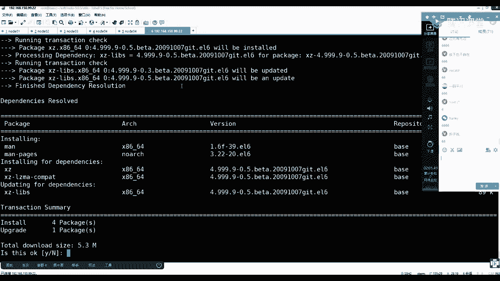

# 马士兵教育MCA4.0架构师课程 - P90：90、 epoll介绍 - 马士兵学堂 - BV1E34y1w773

谭总啥时候一炮啊，刹车一炮这块从这讲吧，我这讲就有点有点累，我简单给你说一下吧，公开课有人听，有人没听过，是不是不是，现在简单说一下，咳咳咳，计算机啊，在这插一个小小插曲，做个查询，计算机是用内核。

内核呢像内核可以接得住很多的连接，然后向下是有连接的，是有所谓的客户端，我就直接下边就是客户端连接，有很多的客户端连接，然后客户端连接肯定有很多，然后所有的连接肯定是先到达内核，对不对，新内核。

然后这个时候早先的，我们的内核里面会有这个连接，其实就是文件描述符，然后呢早先是通过瑞的命令，只有一个read可以读文件描述符FD，一个连接就是一个FD文件描述符，比如文件描述符八。

然后这个是文件描述符九，然后这里面这个瑞子说我要读一下八，我要读一下吧，这个文件标识符，那么这是你的一个线程，你可以有一个线程或者一个进程线程，或者是因为java中我们可是线程，然后另一个就是进程。

因为你一个进程可以复刻出很多紫禁城，HP老是那个web server，他就是fork出来的，但是NINDEX就是使用的什么一种义不飞则，但现在描述是早先的，那么这个时候他肯定是期望着什么呀，去瑞的。

FD9我加这个差距可以吧，同学们加这么一个差距，因为的确是要讲他那个模型啊，这讲的还是靠谱的，那么这样的话为什么，因为re，因为socket在这个时期，是block blocking是阻塞的。

socket是阻塞的，也就是socket产生的这些文件描述符，你读它的时候，他如果数据包没到的时候，你这个read命令就不能返回，就在那阻塞着，所以是blocking的，那么这时候我们之前。

我们的早先的7。01版本，之前的top hat是不是阻塞的，IO也就是说你需要抛出一个线程，然后读这个网网卡，这个链接有数据就处理，没数据，在这阻塞的下面，那行不了，你只能抛出更多的线程。

抛出更多线程的话，如果你只有一颗CPU的话，其实某一时间片上面，某一个时间点上只能用一个线程助理，这里边数据还没到，但是别人数据到他还不还轮不到他处理，所以整个的计算机其实CPU并没有时刻在处理。

那些真正到达的数据，会有很多资源浪费，以及线程更多的话，切换线城市也有成本的，所以这就是早期的bl时期，因为socket是阻塞的，所以叫bl，好吧，这是第一个时期，那么这样的话。

计算机硬件是很难被利用起来的，所以谁发生了变化，内核发生了变化，注意再来画一张图，内核肯定是有一个跃迁，一个变化的过程，什么叫一个跃迁，一个变化的过程，在系统中都可以看到这个东西。

首先我们可以通过yum install一个man帮助man，然后杠pag menu是看帮助的一个帮助程序，manage的所有帮助页回车。

他给补一下，你要想这么去做，先用这个知识，ym install men和menu page。

首先把刚才的知识理论验证一下，menu可以看，比如我们之前用的命令，比如LS这个命令怎么去帮助的，他是一位文档，还有八类文档，帮助程序可以看八种类型的文档，然后二类是系统调用。

就是内核可以对外提供，像那个瑞的命令。

就是一个系统调用，然后比如说看read回车，然后它是二类的系统调用啊，就是内核给我们程序暴露了调用的方法，对吧，然后这个是一个总称，它的系统调用有三个create poctrl e weight啊。

现在看这个早先的那么调re的时候，这个raid方法里面是传承，是传了一个文件描述符，文件描述符就是file descriptor，而java当中是用object来代表一个对象，代表一个输入输出流。

就是input output，在系统中它不是面向对象的，它是一切皆文件，所以都是拿着文件描述符文件来代表，这其实是一个数值，1234讲成这样的时候，应该都知道零是标准输入，一是标准输出，二是错误输出。

然后你再开启这个新的这个这个IO的话，就会产生更多的，比如说我们可以看一眼啊，克隆一下这个标签，任何进程在操作系统里面都会有它自己的，IO对应的文件描述符，PS杠F杠grape redis。

然后就看6244这个进程，然后怎么去看CDPLC6244，然后你看FD就是看这个进程，它有多少个文件描述符，有多少个IO呢，一切皆文件，在你的系统中都能看到，程序里面的那些东西回车。

然后这里面有零标准输入，一标准输出二包括输出，且这个REDIS有动用了pap的调用和e even pl，这是一炮，有socket，因为它开启了一个6379号，这就是所谓的文件描述符。

这个10123456就是文件描述符，任何的进程都有，你去我们当前这个bh k l c dog dog f d，那么也有012，就任何进程012肯定都有的，剩下的是V其他的好吧，那么回来看。

先知道你瑞的这是内核，内核报的内核报了一个raid，然后他能读一些描述符，那么关键这个描述符对应那个socket也好，对应的那个连接那个文件也好，他是一个什么什么什么形式的，然后再来看。

man2socket学java的时候，我们是不是可以用server socket socket来开启连接，对不对，所有链接对不对，那么这个时候你注意看那个你要调solid的话，然后给出读慢域名。

然后号拉的，然后这时候看，如果你所有的看下边，这里边会有一个隐秘的tab pro，就是八零或者22这个协议，前面就是那个IP地址，然后int tab tab是什么意思，往下往下走。

就是这个方法的时候给你返回一个，这是什么类型的呢，这个tab类型的往下走。

这就是currently defended tax，再往下下面。

这是做的tab，然后如果你传了一个socket nblock，NG什么意思，NBLOCK什么意思，是不是非得那么这时候并不是给你瞎忽悠啊，就是socket内核当中socket可以是非阻塞的。

所以才有了一个非阻塞的，就是你一定要明白，IO好像看似BIONIO和AO3，但是它的发展过程是很细节有很多的，首先是因为内核的socket可以是nine block，刚才是不是blocking。

也就是对应的文件描述符是NBLOCK，这个文件描述符是不是可以NBLOCK了，那么NBLOCK之后，这个时候刚才说了，线程多是不是会有弊端，那么这时候哎你不阻塞了，我是不是可以用一个线程。

比如说用一个线程，我就一个CPU，那我就这一颗CPU上面只跑了一个线程，只跑了一个进程，它不切换就尽量少切换一个没用的，然后这个县城里边写一个循环死循环，while死循环先去问read，然后文件名八诶。

你给我给我给我给我读一下，然后他肯定给你返回什么呀，因为他是非读错了，告诉你有数据或者没有数据，然后这时候你变成了八，发现没有数据好，你在便利谁啊，再调read，然后FD9没什么意思吧。

就你这个进程可以循环先调，先先去读它给你返回没有，那你就再去读它给搞，你有了拿着有的东西可以开始处理，处理完之后才能再去循环并列文件符标，文件符名符八，他没有，然后再进来往下循环，一直循环遍历，叫轮询。

这个轮询发生在哪了，轮询发生在了用户用空间，能听懂吧，这个时期叫什么，这个时期就是非阻塞IO的到到到达了，但是它是同步还是异步的，什么叫同步，什么叫异步，什么叫同步啊，什么叫异步。

便利取出来处理都由他自己来完成，所以叫同步，非阻塞时期，是不是不注册了，是不是堵你一下就可以进去玩做代码，但是这个所有你有的时候我从你取出去的事，是不是还得自己做，是不是同步非子是能听懂了吧。

然后这个时候就可以叫什么，是不是可以叫NIO了，很清晰吧，但是技术是永远向前发展的，但是技术的发展不是因为技术，而技术就是你非得酷炫，技术一定是要解决问题，那么请问我现在的问题是什么。

请问现在的问题是什么，这个模型已经是同步非阻塞NL了，那么问题在哪呢，问题在问题在哪，还没有倒钩子呢，因为先要再出现一个多路复用，后面才能是什么，才能是这种所谓的AL异步的。

那么问题出现在如果有1000个FD，注意听1000个FD代表什么意思，代表用户进程，轮询调用1000次kernel，就是成本问题，注意这叫成本问题了，是不是成本很大。

因为想找到问题问题才能促使科技的进步，也就是说这个进程不是自己处理，不处理的问题啊，你写那个后边的多路复用，也是也是自己做这件事情，他是自己的，用空间查询一个文件描述符，就得调一次系统调用。

然后内核用它内容切换，CPU保护现场恢复现场一大堆事在那换来换去，换来换去，这随着你的这个连接数，如果其实连接数很少的话，无所谓，两三个两三个连接切入也就这样了，没必要往前发展一。

那么怎么解决这个问题啊，当你翻问题怎么解决问题，如果有1000个，但是这1000个里面谁能不能读了，不需要触发1000次性掉一次，掉两次就能发现这个问题，是不是可以加快这个速度。

就是将这个问题不解决就可以了，但是要想解决这个问题，少减少这个这个这个信条用，那么用户自个儿能实现吗，是不是实现不了，所以内核得向前发展，能跟着这个思路吧，就是内核不变，这辈子你可能实现不了，没错。

就是把你这轮的事扔到内核里去，内核里从而多了一个系统调用，他就是增加一个性能，这个性能用早餐叫什么呀，叫做select，增加了这么一个系统调用select，然后这个时候其实你的用户间是调到新的系统。

调用了新的掉落的时候，其实就是调个select，这个系统要用select，但是调它的时候我们可以看一下啊，如果你的进程想调select。

下面假设有1000个文件描述进来了，来看推出来menu2select系统调用select，然后这个时候注意看这是一个select方法，然后int然后有多少个文件描述符，然后这需要一个指针。

指向一个没有符的一个结构，这里面是你要想读的那个，一共有1000个文件描述符，然后set有有就读写了两个方向的，你要把1000文明都作为参数传给这个系统调用，然后有没报错，就这么三类啊。

以及这个这个轮询时间，是立刻还是阻塞在这个这个轮询结果上就掉了，一个系统不用，那么这个select可以完成什么事情，就是内核里面提供1slide，然后select就完成这件事情。

你看这个字根本就不需要老师，完全你你看看看人的帮助就知道了，就是同意a program一个程序to monitor，监控更多的file depression，文件描述符S是个负数。

然后waiting until等待直到什么呀，直到one or more，一个或多个of the file distributor，文件描述符become reading就可以触发IO操作了。

这英文读的还行吧，还可以吧，啥意思啥意思。

画一下画图是这个世界上表示知识，表示语言，人类沟通最容易的事情，比如调select时候你穿啥了，曾经进了一个一个链接，你这边拿到了他一个文件描述符，以前是自己用写一个死循环，现在不写死循环了。

哎我统一的把这1000个文件描述传给你，然后你去做一件事情，你内核去什么呀。

这个监控这些东西，然后waiting until什么，One or more。

文件描述准备好之后给你return返回，返回之后，然后他再返回之后，你再拿着返回的那个文件描述符，水有了，然后再去调什么叫re，如果还有一个性调用，就再去调这个read，就是把RT不会掉。

那些没有数据的那个文件名，Read，是你在这步完成之后，是第一步，第二步，第三步，黑返回之后，你拿着反思结果编译一遍，哎你因为你给他传1000个，他给你给你返回1000个。

你的1000个里面的便利1000个哎，在这个里边看一眼，谁谁谁那个状态标识那个有了，然后直接调read，然后把那个文件传进去，给个传单，传的是有数据的那个文件描述符。

那么这样的话这个时期和前面那个时期一对比，你会发现多了一个什么好处，精确了，这两个时期比较，是不是内核的发展决定了一件事情，让你用空间复杂度是不是变低了，这是应该FDS严谨一点，这是一个复数，能看懂吧。

没错，批量批量交给别人去，你给我的时候，我这个主要不是多少的问题是以前1000个，我说掉你1000次，现在1000个我吊你一次，我等着你回来告诉我这里边50个，那我觉得这50个挨个挨个去读。

它还是这个同步非阻塞的，这只是减减少了这个内容太动态的切换，对不对，这个东西叫什么呀，叫做多路复用，是不是出现多路复用了，选择一些有的我直接去直接执行就可以了，那谁有了是你，我第一次叫你。

你来告诉多多少个，有了，多路复用的NL，就是为了减少UI切换，对不对，能看懂这个意思吧，没错，这些都是底层壳的碰撞的，其实这些事情这些东西谁掉的，是你代码调的吗，谁掉的，你一定要明白，我们的程序。

我们的逻辑跑在谁身上，我们的逻辑跑在JVM身上，GEM用什么写的，你的代码是java语言，GM言写的，C语言写的，没错，如果内核不加，这些系统都要用不增，不不出现这个NBLOCK这辈子实现不了这些东西。

就像LINUX能实现NIO，但是LINUX实现不了AIO，内核上还没有还没调动一件事情，只有windows才能真正实现AI好吧，但是这时候注意听，如果你的思路就停止到这个环节了，觉得OK了。

已经可以多个复用了，但是这里面你会发现一个问题，什么问题啊，我每次都给你传很多的文件描述符，你得给我回，然后我还得挑在里面谁能用，然后再去再去找，再再再再再去调，这个还是有点复杂。

如果把这个复杂度再降低，就追求更快的速度，就尽量的做一种伪AI o vi，这件事情也是增加再去减少这个这个过程，我把这个调大一点，讲REDIS把这个L全讲了一遍，然后select有了pl我就不讲了。

后面出现一炮了，我们快点说完了，赶紧说完，我想这个是不是也想听，对不对，不投诉我吧，你们要有人说不想听，我就直接讲REDIS，但是我觉得REDIS如果大部分人这块没听懂的话，讲的话，其实有点有点跳。

那时候还得发展，前面的问题你得找到问题，前面的问题是啥，你找到问题才能找到突破，问题是啥，前面的问题，你学知识一定要找到问题，你才能知道我要学啥，这里面一定要明白一个事情，就是用在内核态。

只有两个菜或者两个空间，你的进程啊有一堆有自己的一个内存空间，里面放着1000个文件描述符，这个这个所有的二零制，你调内核的时候得传参，你把它传过去，只要数据的拷贝，听过零拷贝吧。

是不是大家在传输的时候都希望有零拷贝，不考来考去，不考来考去，速度变得更快了，那么其实现在找到问题了，就是拷贝拷贝来拷贝去的数据，并不是我说的数据，并不是你IO里面到达那个数据啊。

是我对内核跟我用户进程俩人沟通，这IO里面有没有数据的事，咱俩还得传数据，跑来跑去，跑来跑去，能不能听懂这个过程，就在决策的环节的时候，文件描述符这样的数据都成为累赘了，当这个成为累赘的时候。

内核如果出现新的东西可以解决这个问题，做好呢，有什么问题出现了什么东西。

来看一个一个调用，Mm ap，map或者是卸载files or davis memory，挂一个映射，map是映射这个事情的，是不是都硬着来啊，然后这个时候他可以解决什么问题。

曾经你的内核有内核的内存地址空间，你的应用进程和应用进程地址空间，那么这时候其实都是虚拟地址空间，那么站在物理内存上面无非就是两个区域，然后这个时候内核的区域你进程是不能访问的，所以需要传参传这批数据。

所以考来考去，那么怎么规避这个问题，如果内核说得了，咱俩喝出一个空间来，你也能访问，我也能访问，然后你直接在你这个你这，而且这个空间在你这是属于你的，虚虚拟空间里边，你往8号位置写了一个东西。

其实间接写到那个位置，等于如果你来调一个信条，要用的话，就不需要传单，把这东西拷给我，你只要告诉我8号的位置，然后我翻我通过CPU翻译一下，我就知道是我这边的9号位置，我直接可以读那个数据了，换言之。

我这边如果有一个这个地址空间，我把那个10号的位置放了一个东西，一个文件描述符是可以可以读的，然后这个10号位置，其实对应的是你里边8号位置，你直接就可以通过你，那不是那个那个那个7号位置。

通过你七独断的那个数据，就不要再给你拷贝的过程减少减少拷贝，说通俗点就是一个所谓的共享空间，没错就是这个意思，但是共享空间是通过什么系统调用实现的，你一定要知道，这都是内核来实现的，这个系统调用就到了。

没错，相当于用它那个态度，有一个空间是共享的，当有这个共享之后，有了一个共享之后，那么做了一件什么事情，内核内核怎么去用这个空间，应用空间，我们程序怎么用这个空间呢，在这个空间里边，他做了这样一件事情。

三线不在线，我忘了，这是一个链表，明白什么意思吧，然后这个空间里面放了一些数据结构，数据结构里面什么东西啊，我的我的进程通过一炮一炮可以看啊。

它是一个整体，它不是一个性别，用你直接搜，系列杂项杂项里面给你解释什么EPOE，POE里面会有相应的调用，这个性标用是一炮二类的，有1create易爆的CTL，e weight和EPOCTL。

这是三个三个系统调用，你可以读一段英文就知道怎么工作了吧。

我简单给你解释一下，你的用空间只需要我我我手里有个文件文，有1000个文件描述符，OK我就写到这个共享空间里去，把这1000个，其实自己就是一定要明白自己还会有一个空间，你都有共享空间了。

还需要再准备一个空间去存1000个，完全描述符吗，先把这点弄明白了，有了共享空间，这个共享空间其实间接可以得出一个结论，共享空间就是他自己的空间，对不对，他可以直接访问，对不对。

所以曾经如果把1000多硬币放到自己的进程的，某一个自己私有地址地址里边，是不是可以换换位，换到这个位置了，这个听的同学来刷不了，这才是本质，你要明白，共享空间是进程了自己的空间的一部分。

也是内核那个虚拟机的一部分，所以这时候从这个歌词就不用，不用单单独去维护这1000个文件，描述这个地理数据，所以进程里边多了一个文件描述符，就把这个固定空间的宏宏数据放往里放，往里放，往里放。

他放的这边只要调性调用，不需要传这个数据，就没有拷贝的过程，内核是不是就可以看到这个分数，一共都是文件描述符的对，然后由红由我们那盒当中拿着刘文那边服，去通过所有的IO这个中断谁的数据到达了。

谁的缓冲区有了，然后把到达的放到列表里，放到列表之后，然后这时候如果这边有数据了，你上层用空间，是不是可以从列表中取出这个文件，直接发生读取DNA文件描述符就可以了，这跟零拷贝没有关系。

这跟零拷贝没有关系，这叫共享空间，各自的零拷贝是什么意思。

零拷贝是另外一个性质，用来来来给你看一下，零拷贝叫做SFSN，写错了，send the f sofile是完成零拷贝的，然后center file是什么意思，也多了一个系统。

要用它有一个输出的文件描述符，一个输入的文件描述符，给出片量和8号和这个的统计。

明白吧，也就是说再给你画的，举个例子，也就是内核里面多了一个坑，里边，多了一个性能用，Sf，但是说SOFILE这个系统调用的时候，SOFILE里面它需要俩参数，一个输入，一个输出。

跟你使用阿帕奇那个IOUTILS，里面会有一个out in的对象，是不是一个概念，但是你要明白，有他之前内核发展出这个系统调用之前，它还会有另外两个系统调用，一个是刚才看的瑞德可以读一个文件描述符。

有re的读就一定会对应有一个什么write写，对不对，还是应该是right，回来吧，你以前程序，如果你有一个文件，有一个文件，然后有一块网卡，网卡到内核肯定是一个socket。

socket IO文件到内核肯定是一个文件的，IO对不对，这俩是两个IO，两个IO是不是文件描述符，假设这是FD3，然后这个是FD4，然后你之前re的时候，你之前的时候肯定read读三。

从三把文件读出来，然后再去掉血写出去，然后这个时候你的这两个系统调用，发生在内核身上，内核得完成一件事，是不是得先瑞的给你，你再rise出去，这能看懂吧，也就是你的数据。

你的文件数据先到内核的800能区，然后再由这个这个这个调用，然后这个调用还考虑你用空间，用空间再再尽量再拷回来，然后再发出去，这是需要拷贝的过程，是需要拷贝的过程，那么现在有了之后，你的程序是一个过程。

是直接掉了这一个，然后由内核当中内核拿着缓冲区直接读，它放到缓冲区，然后直接发出去，就不给你的程序考来考去了，这是SFILE，它跟前面那个一样吗，跟那个MV一样吗，不一样，然后send file。

如果加上MVP可以组建一个什么东西啊，一个高效的技术，谁不卡不卡，卡卡是不是肯定会有网卡来的数据，网卡的数据来，然后写进了数据之后必须走，你卡玛卡玛是什么JM，对不对，GBM我多说一点吧，说的开心了。

他是GBM，是一个用户关键进程，网卡肯定走内核，然后走塌塌完了之后，然后它里面一定会使用map，然后Mac里面他是不是可以对files和DAVIS进行挂载，对不对，它可以挂载到你的文件，直接挂载到文件。

然后又因为这个map做的空间是是这个共享空间，内核是共享的，所以这时候其实你map，你这卡夫卡通过map看到这个内存空间，完了写了东西之后，其实内核也能看到，他直接触发内核就减少系统调用，减少数据拷贝。

也约等于是达成了一个他的到时零拷贝，但是零拷贝不是两个文件描述符之间的，是内存到，是用用用户空间到内存空间，减少了一个拷贝的过程，所以直接写文件了，然后这是为什么他进来的数据，让你打数据的时候可以很快。

而且可以存存存到文件上，然后这时候但是别的人是不是有消费者，消费者是不是还得需要去把它读出来，消费者是不会拿着拼音来读数据，学者拿着pl来读数据的时候，其实这时候走到哪了，是不是走到零拷贝了。

Simple f，确实走到零零拷贝了，零拷贝里边，他的输入来自于文件，输出，来自于他，不迷惑吧。

一切的知识来自于底底层的内核。