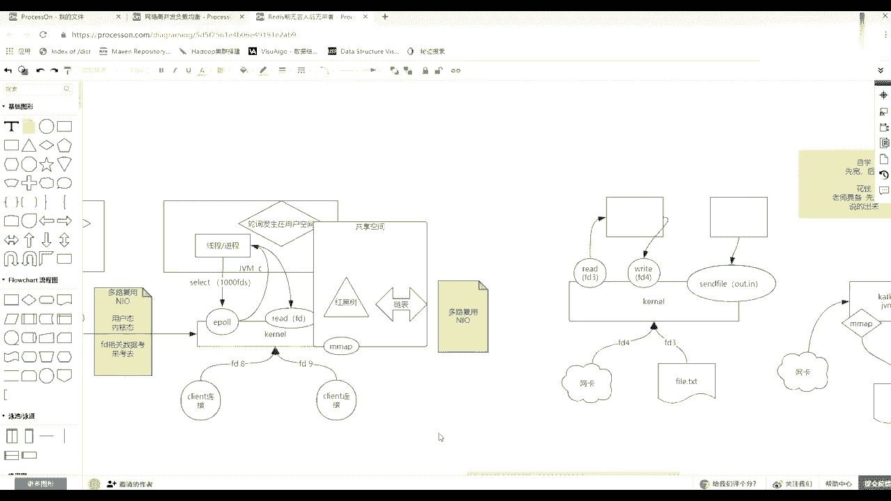
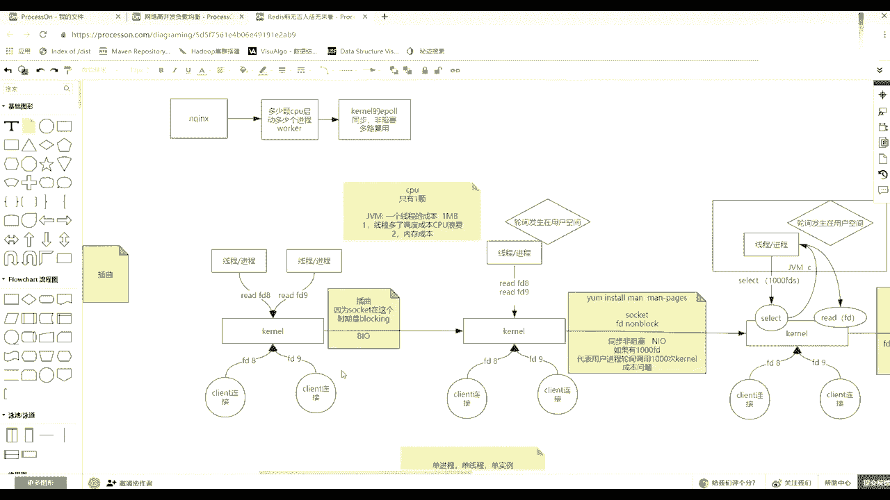

# 马士兵教育MCA4.0架构师课程 - P92：92、 redis及NIO原理复习 - 马士兵学堂 - BV1E34y1w773

简单回顾一下，是把REDIS安装了一下，装完之后呢还没来得及使用。

然后呢就讲到这个IO模型这块了，因为要我我让你脑子里有一张图。

就是这个计算机当中这个REDIS怎么运行的，就说就是大力的1PO就讲到IO模型这块来了。

然后讲完之后呢，跑到后边的时候又讲到这个零拷贝。

结果一炮这块说的还不太清楚，先把那个E炮，因为现在无论你的N个等用的这个一炮的那种，IO复用的模式比较多一些，咳咳对不对。

安装资料就在咱们这个大数据的那个GITHUB就有啊，所有的安装的步骤，但是那个东西包的话，你check一下，如果是网盘链接失效的话，然后我再给你发一下好吧。

收回来，然后在这个E炮这个模型，这说这个画着这个这个图的眼睛过程。

先是BIO就是阻塞的一个美连接。

会抛出一个线程去，然后内核发生变化之后，连接这个soc上就可以是NBLOCK，就可以不用阻塞了，那么会发生用户空间程序，拿着1000个连接描述符，然后疯狂的去掉裂痕。

然后这样的话虽然他可以不用抛出很多的线程，在这多说一句，在这多说一句，就是大家都是搞JVM的，在GBM当中，一个线程的内存成本多少，一个线程为什么说前面这个模式当中。

抛一个线程对应一个连接，这个就有问题，你知道问题了，就是因为每年1000年就一个县城的县城多了，到底哪不好，有人知道一个连接的成本是多少吗，不是一个线程的成本，我们可以控制，我们可以调。

然后呢但是我们只聊啊，java内存当中堆是共享的，但是县城站是独立的，县城那个站是独立的，这个站的大小默认可以是一兆一兆B，然后呢你也可以调调，把这个这个站的这个线程，占的这个单位调小一点。

也就是代表着你的单位内存内，可以创建更多的这个线程，现在数上去了，但是你CPU数还就那么几个，其实线程多了，第一在这你要知道D就有两，有两个有两个不好的地方，第一线程多了，调度成本CPU浪费。

CPU正在忙着调度这个事，消耗在内核空间，第二个内存成本，你想如果你是32位的话，就一个4G内存，一一千个，约等于下1000个线程就消耗出一个G去了，3000个县城，你内存就光光把县城占据了。

然后你还不能new对象，因为堆米还没地儿了，一堆怎么也得给个12G嗯，所以这种抛线程的方式肯定不太好，而且一般也会限制，就是无论C的还是做java还是做C的，都会控制这个线程的数量。

那么就聊县城不好，所以才有这么一种方式，就是我最低可以一个县城，或者几个县城来做这件事情，那么这就是非阻塞，因为只要你消费不阻塞，我调你询问的时候，你不阻塞的，你就告诉我立刻立刻回话，有没有。

所以这时候我可以用一个线程厚度1000个连接，但是每一个连接都要调一次内核。

那个调性调用，所以成本又很高。

这个很高，怎么降低，就无非把这个1000个连接的1000次调用，这个数减下去。

所以才出了这个IO多路复用，也就是用我们的一个线程，就是1000个链接复用了一个线程去处理，那么县城这次只需要调用内核给的select这种方式，然后把1000个文文件名传给他，他就在那等着内核在内核态。

因为掉了他一次，他把1000个遍了一遍，然后给你返回几个，然后这个时候注意，你这个还得拿着这几个文件描述符，自己调这个阅读数据，或者写程序的这种系统调用，所以你这边还得是自己去完成数据的写出和读。

回来就是这个数据的拷贝拷贝来拷贝去，这个事情就是rewrite方法，还是用过去调的，那么这个时候其实叫做同步非阻塞，前面那个也叫去，就是你无论便利有没有数据到达和读数取出事。

都是你现实空间自己做的事情的时候，都是你都是你用空间自己做的时候，那么叫同步的，只不过是非阻塞的。

然后在这种情况下又一个问题，虽然他解决了这个疯狂迭代这个便利，这个文件描述符的数量，然后但是它有一个新的问题，就是每次我这写一个死循环，每次都要传了1000个，然后他给我编了一下。

然后返回来后我再编辑这个返回的可用的，找找到可用的，然后再去调方法，这样的话用山在传递数据的成本比较高，而且完全你自个儿去，每次要传了1000多个标书，回来变一个1000个文件描述符。

然后等于其实力度不够细，因为你在便利的时候可能有数据到达了等等，这个就因为时间上和那个用餐间的切换。

数据库的话确实程度比较高，所以才出了一套这种方式。

那么除了一炮的话，一炮是一个大的概念，它里面其实有三个调用，它select就是一个一个select调用，那么一炮有三个调用，第一个就是我用户空间当中可以create create。

那么在这就不是select，我在叫的时候，和我肯定给我返回一个EPO的完全描述符，E po，那么反问一破文描述之后，然后未来我用空间有一个连接进来了，我就把这个连接交给这个，写给这个E的那个描述符。

文件描述符，其实这边会准备一个共享空间，是MAAP，明白吧，就就就一个共享空间，一定要明白，它们两者的变化，是在这块有一个非常重要的一个东西，那么有了一个共享空间之后，它里面只需要维护一个红位数。

用中间的每连接1000个连接的话，以前是每调每每学学C4之后，1000个城给他，现在是一清，来了之后1000块钱注册进去就注册红黑树了，那么注意这个空间里边，增删改的操作是内核外完成的。

然后查询是两边都可以查，两边都有查，尤其我们要查这边这个供电分类的数据，然后当你注册一个链接写进去之后，写的同位数，然后由这个运动空间还会掉一个东西，对这个一个信标用调到一上。

这么去写了会掉一个weight，有两个调用，一个是CTRL的调用是往里加，比如app或者delete我的这个真正的socket文件描述符，然后还有一个方法就是wait，为什么吗，那么往里掉了。

这种传递这个新来的链接就往里放，传送红玉柱了，然后用空间调位置调位置，在等待等待等待事件，这个其实叫做事件驱动，就是这么来的，因为这个内核里边去完成这，你注册这个红树这个这么多文件。

描述1000个谁数据到了，到了之后就会把这个节点，然后放到列表里去，并维护这个这个数据是写可写而可读，然后呢你这个wait只要这边有了wait，就可以返回你wait从阻塞，然后就可以变成不阻塞。

然后取了个链表，把实际到达的那几个文件描述符，然后因为这个空间是共享的，直接取出来到你这边，然后你自己还得单独去调read方法，re的方法，所以它不叫AIO，千万记住了，一炮也叫做NIO。

它不叫做AIO，什么时候你用空间这个录音的方法掉它了，就是这个给了他一个八分，我不管了，然后数据什么时候到的，我也不不是你数据，到时候我才去调这个方法，我是先注册，把所有化注册到内核。

然后内核里边某一个来了数据之后，re的方法假假设是在内核当中完成这个读写了，然后最终给了你一个消息，或者给了你一个通知，你或者毁掉了你一个，就比如那边准备了一个线程池回调。

把你那个方法要到他那个线程站里面去，然后这个时候你的主线程忙你自己的两边事，根本那边的读数的事都不是不是不是你去做的，就读这句话，不是你到了之后才把它吊起的，那个时候才叫AIO。

但是000很难实现这种方式，0AO发展的历程非常复杂，有兴趣的可以去看，所以这时候一般就停到NL就不聊了，虽然它也有AO相调调用方法，但是LINUO发展发展路程是相当相当复杂。

好吧，就给补这么一点。

把这个知识补起来就可以了，好吧，OK收IO这块就不做更多的细讲了。

那么回来回到这块的时候，当你IO的模型能听懂吗。

这个时候要把学有所用，把学校的那个理论应用到实际场景，比如第一个redis release的话，就会有很多的客户端，很多稍微连接进来，可能一个客户端，比如你准备了一个一个一个套卖的，还有一个线程池。

他连过了很多或者是几台机子分布式的，很多台去连着一个REDIS，不管怎么样，最终站在这个release所机器来说，就是进了SKET，很多全打在内核，上了，内核内核的时候，你的REDIS是一个进程进程。

可以调我们所谓的e poo，然后来便利寻找这里面哪一个客户端，soc的那个信息就发过来了，然后这个时候注意他REDIS是单进程，单线程来处理用户这种，这关于他这个数据的处理的。

但是他人类自身是就一个线程一个进程吗，不是，明白了就是你要明白处理用户的对数据的操作，是它里面的一个线程来完成的，但是他可能还有别的线程在做别的事情，但是那个事情可能跟你的数据没有关系。

所以这时候一般我们就直接说REDIS是单体能，单线程来处理我们用户的请求，那么这样的一种单机能单线程处理用户请求，会有什么好处，这个顺序性，但是这个顺序我再给你强调一下，因为一旦在分布式情况下。

这个数据一致性等等就很重要，而且是一个非常头疼的事情，注意这个顺序什么顺应是连接内，或者以每每连接，美联接内的命令，这个能听懂什么意思吧，每连接每个链接里面的这个命令，是顺序到大的顺序处理的。

但是如果说比如说这个UK这个K为A，那么他也发了一个对A的操作，他也发了一个对A的操作，那么无论从你网络当中跳跃，谁先到达的，或者一报名只能先轮到谁了，那么其实这两个人对一个的操作。

就很难判定是谁先谁后，但是如果是一个人，它里边线性，而且没有使用多线程，线程，线程还是安全的，虽然它可以有多线程，但是只要线程安全，对A的操作，他这边能控制住，先创建A再删除A，只要他那边能操作的话。

那么这个顺序是可以保证的，如果他是单线程，这个客户端就是一个线程，就是一个socket，里边也是一个线程，那么这个线程肯定是先发出一个创建，创建A再发出一个删除A。

但是如果他自己这个库存里边是多线程多线程，那么这一个创建和删除的指不定谁跑到前面的，如果线程不安全的话，那么有可能先把这个删除的发出去，再把这个创建的发出去，这块能不能听懂，尤其在分布情况下。

多线的情况下，无论什么场景，这个数据一致等等，这个事物的情况一定是最头疼的好吧，所以以后开发的时候一定要关注这一点，注意这个小细节。

也就是说你在前面会有很长的路，你在做负载的时候，或者在做业务这个这个这个网关路由的时候，你要把尽量的把相同的东西打到一个节点上去，就跟卡夫卡一样，为了保证一个资源的顺序，虽然顺序可能是差差。

时间差差很久，但是尽量用在一个topic的一个分区里放，对于一个K的所有的操作，那么这时候他们到达的是相互可以保证的。

这简单说一下它的顺序，那么这里面注意他这一个线程来处理这么多，然后每每连接里面是可以有顺序的，那么这块完事之后，那么到后边到REDIS里release，再往后是什么样的，而且我把客户端拿到这个方向来。

因为画到这边就有点看不清楚了，假设一个客户端，未来我可能还有一个客户端去访问的REDIS，那么我客户端和REDIS访问的时候，数据如何传输的，以及release应该怎么去使用。

