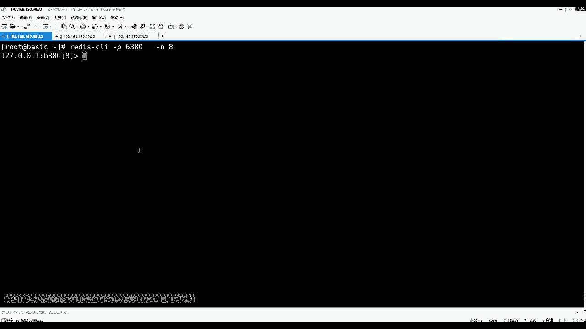

# 马士兵教育MCA4.0架构师课程 - P93：93、redis使用 - 马士兵学堂 - BV1E34y1w773

理论东西都铺起来了，开始比较实用，比使用的时候注意看。

首先我这台计算当中已经起了REDIS，PS杠F杠grape redis，这里面有6379和6380，只有两个REDIS进程已经跑起来了，那么客户端内容是什么，客户端怎么去连我们先讲命令行的客户端。

APS先不说，因为REDIS其实还是源于的，你只要会用命令行的那些指令了，那个指令在他的app当中，基本上可以找到那种API的那个对应的，对应的那个调用。

那么客户端是用redis gun client这个命令来直接启动，那么直接回车的话，它默认是连着6379，但是如果你退出的话，EE退出，你还可以REDIS杠CLI，然后杠H看帮助帮助里面它会有一些选项。

比如说你连到具体哪一个主机的哪一个端口的，像我们当前这台主机就有两个端口，63796380，所以这么一个过程，然后后面讲验证的时候可以输密码，然后下面还注意还有一个杠N。

这是选一个dB database number，然后还有一个杠杆RAW，这是要么使用的是默认的，要么使用格式化的这个新技术大纲给你讲，首先先看到一个dB在这扩展一下到图上。

那么只要是数据库，学MYSQL的时候也会建库库里面的电表，不同的部门可以建立自己的那个库，然后表是隔离的，在REDIS里面也有这么一个概念，就是REDIS里边准备了16个，默认是16个库，默认16个库。

也就是有一个0号库，然后还会有一号库，2号库一直到16，但是这个东西可以在你的配置当中去修改，配置文件，也一会来讲，这是一个概念，有0号库，一号库，你连接的时候可以通过杠来指定。

我连那个库或者到内部的进去之后，来切换那个库，但是这个零一这个是死的啊，他是不能起名字的。

就这么一个概念，好吧，我们演示一下，比如REDMCLI，然后呢先是用P，然后呢接一个6380，这给多尔号，那么进来的时候就连6380了，然后呢你还可以在里边，先在这边这边简单设置一下下一个K1。

这个是比如说K0号库的380，380里边的，然后K380，然后第一个冒号一，这是第一个K，然后value是hello回车，那么这时候GK380里边就会有一个hello，然后你还可以select。

比如选择一个8号库回车，那么差异在这出现了，你可通过内行，你也发现刚才肯定是走的0号库，默认就进了零，然后现在进了8号库了，8号库里边，然后你get k380冒号一是没有数据的。

new就是没有的意思，所以现在知道REDIS，它里边这个进程里边分为了16个独立的区域，你的K串在哪个区域里了。

那么其他区域看不到是隔离的好吧，然后退出来，也可以通过刚才连接的时候直接给定，比如去8号库，那么连点二八就是简单的操作没写明白了。

好吧好吧，那么你可以连接的了，那么在使用的时候，注意rise里面刚才简单的是使用了几个命令。

那么正确的如何去学呢，不需要老师进来之后，学任何东西都有一个help回车，那么在REDIS客户端客户端里面有这个help，客户端的help当中，你如果直接输help。

它可以告诉你这个help的使用有run几种使用方式，第一个help加一个那叫符符，后面可以跟一些组GRP，他把很多命令分组了，或者是直接接到的命令，他告诉你怎么去用。

或者help后面可以直接用table，他挨个给你提示，给你提示，现在这个前面带符的，就是后面各种组，后面再出现命令，或者你直接写一个SE它还能补全，这是他客户端比较人性的一个地方。

好当这个help这个事情会用了之后，我们来简单看一眼help，用at它分了很多组呢，第一个通用组是全局的意思，基本配置，那么回车之后，他会告诉你在这个哪些是属于这一组的，我们先简单看一眼。

这里面比如说鉴定之意比例的删除K，你给这个K它会删除，然后呢exist判断K是否存在，或者是像这种给出定义时间的啊，K的这个存活时间，这个后边讲他这个内存优化的时候，再说这件事情，还有K使用的时候。

case是可以接个这个通配符，或者是这个这个一个一个一个描述吧，可以筛选我们的Q有哪些，然后还有move移动，然后object可以查询关于我们K，关于我们K他自身的这个诶，怎么黑了自身的定义。

后面会讲这个proceed，可以将一个你定一下，过期的东西给它持久化下来等等，这是面向K的，等于这些命令，其实都是在面向K去做些什么事情好吧，还有一个tag常用的就这几个啊，我先给你标一下，你走一遍。

这是关于常用组的，比如说我在这里面可以简单的用case加一个星号，脱位符，然后这个时候可以显示我曾经见过哪些K，然后有一个命令在这说一下，large flash或flash dB这两个东西我演示一遍。

你知道吧，然后那头忘掉它，比如flash dB回车，然后在K星就没有了，那么你也知道他做一件什么事情了，他其实是在做清库的这种命令，在生产当中就尽量的不要使用这个命令，而且一般运维都会把这个命令给你。

Relime，就是你到预约到你到公司的时候，你可能会发现没有这个命令，他给自己改名了啊，咳咳好了，那么这是刚才用的是一个通用的一个组，再来看除了通用组往下，那么说了，还有五种基本的类型啊。

五种基本类型value的value，那么value型为string that on table list，然后有set，然后有so sad排序的哈，希然后向下的这种就是消息队列了，往下就不是了事物。

这是它的几种几种功能等等的，然后先不说，那么一个来看，先看我们今天先学的第一个string类型，那么切了类型之后。

他会把关于string这个Y类型里面的，所有的命呢给你展示出来。

一定要记住那句话，就是上面给你描述这个图，那么比如说在0号库或者拿一号库来说吧，你按库分好了之后，这里面有会有K，会有一个K还是key，会有个key，它因为它release是这个间接对的。

所以有key了，key还会有一个指针指向一个value，那么value里边它是具备五种类型，这个概念要找出来有五种类型，今天先学哪个，先学spring string就行了。

但是string其实你要把它想成是BT，后面给你解释就有这个string string，其实后面还可以再说它有关于字符串，字符串，字符串或者直接数组的操作，这是第一个反应。

有哪些命令还可以基于数值和位图的，Bitter m，这就是REDIS非常强大的一点。

那么现在我们看到哪了，看到K然后上面那个value，然后根据A的组可以显示这么多命令好吧，那么刚才比如我set的时候，我通过set设置了一个K，然后value是hello，然后可以通过get现在取出。

可以通过一个get箱子取出，那么这就是关于spring的一个那么修思路。

带回来看这张图，你要会看懂，脑子里面一定要明白LINUX操作系统当中，然后可以有多个REDIS实例，一个REDIS实例当中会有0~10，这个就是多个库，但是库就是从0123789开始做。

做隔离的这个东西，后面配置文件告诉你能改一个库下都是存在的，键值，对存的都是建筑队从新建设过程当中，然后K其实是个对象，除了K自身的这个名字之外，还有他的tag类型。

然后以及encoding type类型是用户访问的时候，直接看你的方法，这个这个这个类型是不是具备这个方法操作，可以快速返回，你是我这个这个这个方法，这个命令执行错了，不需要去真的去拿这个数。

真正参与计算的时候，报报异常可以规避异常，然后用Q音的话也可以规避，你后续直接透穿到拿这个字节拿出来做计算，这个事可以在前面做挡挡一次，对这个能听懂吧，然后就是他身上有这些东西，然后什么浪等等。

其实你的value长度LSS当中，K当中那个对象当中也会保存，因为只要你做增删改这个value了，做资产，同时把这个长度算完之后，后边如果1亿次定位查询的话，不需要再重复计算的长度，长度直接返回。

因为你从来在再也没有改过它，所以这是要用这个作者在这个K上的小心思，它让我们的rise虽然是单单记单线程，但是有一些操作都会预埋下来完成，对后续与高并发的查询速度极快的返回。

基本都是online oe的复杂度，这是K然后value当中他的REDISVUE类型丰富，value的类型的丰富，现在只看到了string，它的使用类型当中，我给你总结的可以面向最少三三类使用场景。

纯字符串的名词化的切割覆盖，然后还有基本的设置统一长度，还有那个数值类型的增删改查，那么数值类型的这种快速的，其实有一个场景这块没有说完，这个也是他的一个地方，下面这个位图这个场景给写出来了。

那么面向这个数值计算的场景，其实就是我们的这个抢购商品，要什么东西来着抢购，还有什么什么场景来着，那叫什么叫什么来着，这词突然忘了，那就秒杀，秒杀还有详情页，像淘宝的详情页。

详情页当中大部分静态的图表中的信息，但是他一定会这个后后端发起一个异步查询，用异步查询，查询你这个商品的这个所有的购买数额，然后等一系列的东西，所以这个数如果REDIS没有这个数值。

没有RODEGREES的话，你要到数据库的话，等于一个并行度的，多个人想去同时对一个商品加加加减的话，必然会触发数据库的事物，对不对，所以这时候其实如果有了这种REDIS，对数值类型的话。

可以规避并发下对数据库的事务操作，然后完全由REDIS内存内存代替，完全有REDIS的内存操作代替，而且这个东西叫做计算项，数据移动上上节课其实也说过这个事了，这个能看懂吧，嗯像微博当中的。

除了这个这个这个像页微博当中呢，是不是还有什么点赞，评论等等这样的一个评论数，评论数，好友数，凡是那些看似不是特别重要的数据，看似不需要必须精准的，但是银行里的钱这种事他出了多少钱，利息多少。

这个事他不适合用REDIS那个东西，必须要染指事物和必须要持久化存储，数据可靠性必须要保证，所以这时候在不同的场景下，你要做正确的技术选型，就这句话就是他就光一个string，我可以讲出这么多东西来。

right的事物是另外一回事，现在说的是一个值，在关于库里表里面的一个值的变化，使用关系数据库肯定得触发事物，在并发情况下多的情况下，但是这个值挪到REDIS里，因为它自身它就是一个进程。

一个线程所有的请求增改查，而且计算机数据移动，所以发生它的那个内存地址空间自身上面，所以这个时候他其实是比关键数据要快很多的，可以规避这个事物的那个那个发起。

但是但是如果对REDIS里面如果多条执行的话，必须先前前面成立，后边后边才能才能成立，他对多比命令会组成一个事物，那是那是另外一个事，好吧，没错，这个世界上肯定，关系数据库是你们最最能看到的。

而且是被公认的，但是这个世界不可能就只有这一种关系型模型，肯定键值对的数据库能出现，就一定都有它的意义，还是那句话，那节课有没有让你去做这件事情，dB engines嗯。

这个世界上不止不是只有关系型数据库，这一种数据模型，并不是所有的数据都必须是主外键，然后这种翻1F2换三，还有很多的模型，比如说这里边还有我们的键值对key value的模型。

然后还有宽列列式的这种模型，然后还有document storage这种模型的啊，所以还有图的，还有时序的有很多，我建议你们回去之后把这个网站这几个模型，游戏会标准的，必须要看的，什么是文档存储的。

什么是图的，什么是时序的，什么是关系的，什么是键值的，什么是劣势的，这几个必须要看，你看完这个之后，把这些都背下来，心里面有点概念了，什么搜索引擎那种的，他们各自的差异在哪，所以面试的时候聊这些东西。

都让面试官觉得你和别人掌握的东西不一样，好像具备3年工作经验，而不是只只是被简单背背背概念，背知识。

好吧。