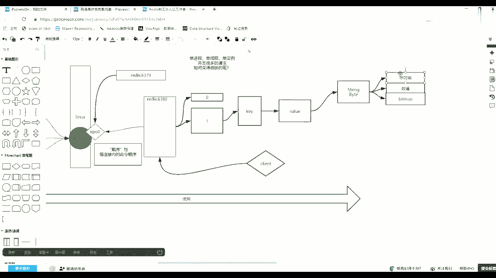
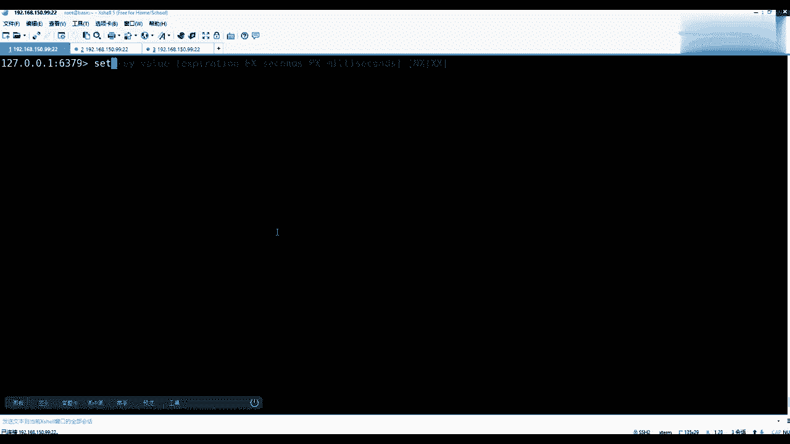
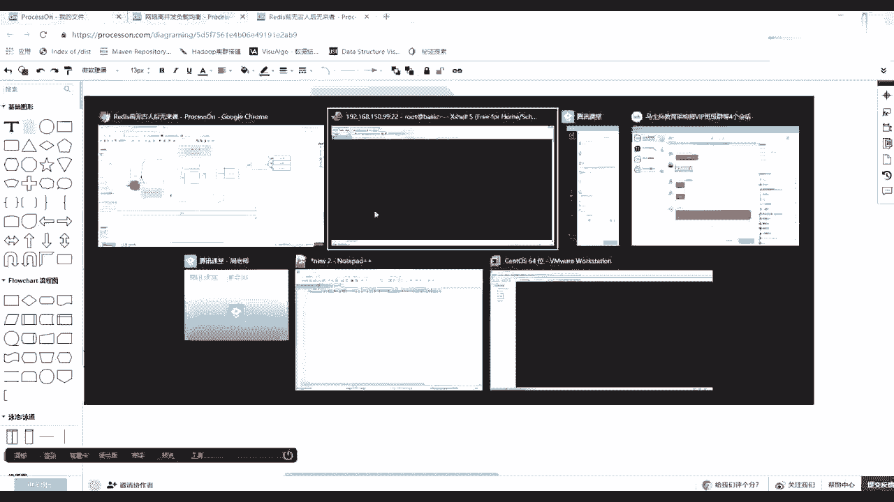
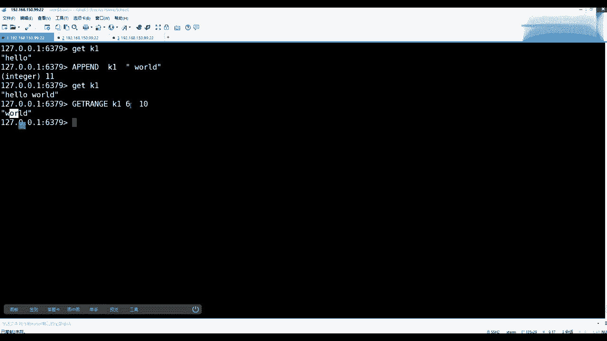
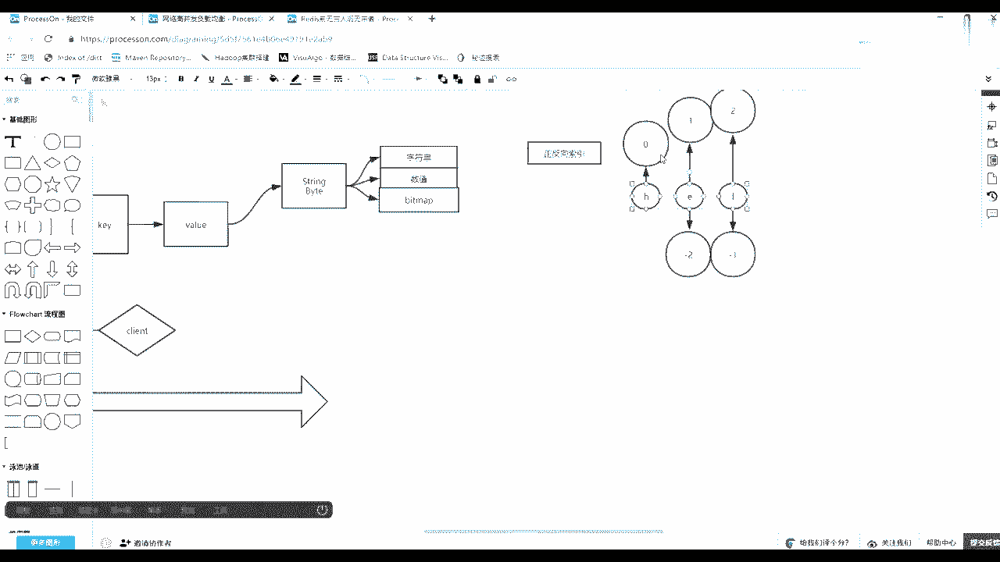
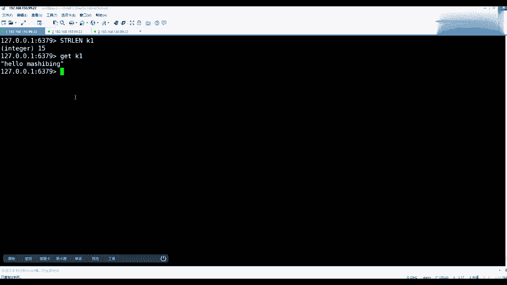
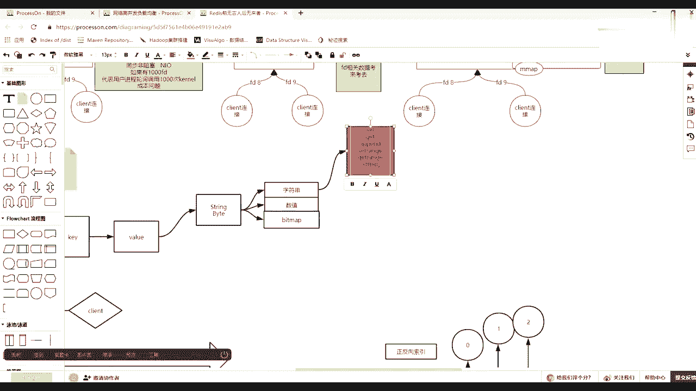

# 系列 5：P94：94、 redis中value类型--字符串 - 马士兵学堂 - BV1E34y1w773

站在字符串的角度，现在开始讲这个外套，站在这个字符串的角度，如果没有字符串的时候，你想一想面向字符串都有哪些操作，面向字符串你可以有操作。

最简单的可以设置，比如set一个K啊。

注意这个K并没有类型的区分，只有value才有K。

你是要随便给一个K的名字，比如说K1，然后value里边，比如刚刚给一个hello回车，然后可以get k1，这是他最基本的一个面向字符串的一个，就是这个字符串类型可以设置，可以取出。

然后还可以什么关于set这个这个at string的时候，或者是你直接看那个set set的时候，不应该加这个这个这个这个and符，看set的时候，可以看出这个set命令后面除了可以接KJY。

还有相应的可以追的参数啊，那么前边这个是可以接一个过期时间，后边以毫秒到后面秒了，这个先不用管后还有两个，一个是NX，一个是XXNXX什么意思，就是我在设置的时候，比如设置一个K1。

然后我想给它变成刚才hello，我现在变成圈圈叉叉，然后后面接一个NX，那么回车，然后他又反映一个new，然后这时候你get k1依然是hello，那么NX什么意思，是不存在的时候才去设置这个K1。

如在里边没有出现过，那么你这个size才能把它设置上去，但一旦K1有这个K了，只是啥无所谓，你再想给他变成吞噬差是不允许的，就是不存在的时候才才让你设置，那么这个时候像什么，它的使用场景是什么场景。

比如说分布式锁的时候，分布式锁没错，那么一一堆人拿着一个REDIS来这个做一个参考，说这堆人都想都想删一个删一个文件，那这堆人谁谁去删呢，谁去操作这个文件呢，一堆人拿着很多链接。

对一个单线程的REDIS发起set k1，然后NX那么谁成功了，谁就拿到锁了，剩下的人都返回失败，因为别人抢了他前面创建了一个K了，能这个意思吧，然后xx是什么意思，比如说我set一个K2。

然后给他赋一个值，Hello，然后xx回车也是6get k2，然后发现没有值，等于上面没有设置成功，是什么意思，只有存在的时候才可以操作，也就只指它只能更新，只能更新NX只能只能新建，只能只能更新。

能理解什么意思吧，就是他们两个最基本的这么一个选项，那么除了单条的get set，还有多比的，比如说M3，然后M3之后你看他现在5。0之后很人性化，你给出命令之后，他会给你一个灰色的动态提示。

比如我可以设置一个K3，Ak4，B可以设置两个，然后这个时候你get的K3就是A，get k4就是B然后同样的有m set，就有M盖，我可以把K3K四两个K都给出，分别给你取出好吧。

这就是面向字串这个K的类型的最基本操作，然后web这个类型，如果string的时候想想还有什么操作，比如说append，我们可以拿string这个类型来看一眼，下面会第一个就是append，可以追加。

可以追加，然后big map这个未读先不用管，然后数值的操作的也不用管，然后下边还有get range，取你这个K对那个value里面的某一部分截取，然后还有干set取出来，然后放到这个取回老的值。

设置新的值，还有M盖茨讲过了，还有，还有一个东西三认证，可以把一个字串，这个覆盖到你原有这个KY的某一个位置，偏移量那个位置，好吧，我们先统一的演示一下，比如说GK1，现在里面hello。

我可以用append来对我的一个K1，追加一个这个word回车，那么get k1取出来就是一个hello world，等于把刚才word追加上去了，能理解吗，同学们，然后除了append。

还有比如说像这个字符串当中，我要取出其中word，把这个word去了，怎么取，那么最后一个get range在乱整，这时候注意看你要给出KK是谁，肯定K1，然后找到这个value value之后。

他有一个start和end这个概念，那么and什么意思，你要给出从哪取到哪结束，对不对，那么数一数最简单的123456，空格也是一个，然后第七个七的话其实就是什么呀，从K17就是六。

因为我们程序员是从零下标，从零开始的，然后我取到哪了，然后就是6789十，你发现这个过程现在看是不是把word取出来了，但是这一过程是不是好麻烦。

你是不是去数，对不对，那么在这说一下它后面一系列的相似的知识，就是正反向索引，正反向索引什么，什么叫正反向缩减，如果你有一系列的元素，如果你有一系列元素，比如像刚才hello，我就简单写了一下HE。

L那么简单写，如果你的字符串是HEL的话，然后他有一个正向索引，第一个就是零，第二个就是一，然后以此类推，它会自动的这个递增，然后就是二还有一个反向的，最后一个就是零这个一，然后前面那个就是一个二。

也就是面向元素，它有正向索引和逆向索引。

所以这个时候如果我们想取的话，给的话，如果想取出这个word的话，你后边完全可以写一个一，你只要找到它从哪边起了，我就写到最后，那么给一个一可以了，如果game是从零开始到一呢，就是取正向索引。

零开始到它一这个位置，所有的元素，这是正正负向索引，这个能理解，同学们，然后再来看K1，除了grange，然后还有一个set range，所以说也是给出K1，然后这时候注意给出一个奥赛，奥赛的话。

比如说刚才给一个从这个word变成这个马士兵，怎么怎么去给，那么offset是从六第七个位置开始，后面给出一个外角，那个Y轴多长都无所谓，超过这个长度，它整个会整个整个整个覆盖覆盖进去。

会会这个做个扩充，比如给个马士兵回车，那么再get k1，那么就会从刚才那个位置，从你偏向那个位置，然后把它覆盖进去，这是这是面向字符串最基本的操作，这个都没问题的，同学们好吧，面向字符串还有什么操作。

你在编程的时候，面向一个字符串的类型，string类型，你还有什么操作，是他们想查看它的长度，对不对，客户端也给你封封，这个也不是他的服务器也给你封好了，就是STRLTH。

后面可以接我们的K1回车会告诉你有15个，为什么有15个你盖了K10个字符，是不是一共15个字符，对不对，那么这个取出来的长度就取出来的长度了，OK当这个都听懂的时候。

当这个听的时候，注意以上那些字符串很简单，常有的操作直接放这边占地儿啊，嗯面向字符串常有的操作，回去我在这给你标出来，你自己去补笔记，自己去补，我不给你写完整的笔记，因为太low了，好吧。

这里我就简单跟你说，肯定有set，然后get，然后还会有append，然后还有会有s range，range等等的一系列的名字符串，该有的操作还要取它的长度，取得长度OK。

