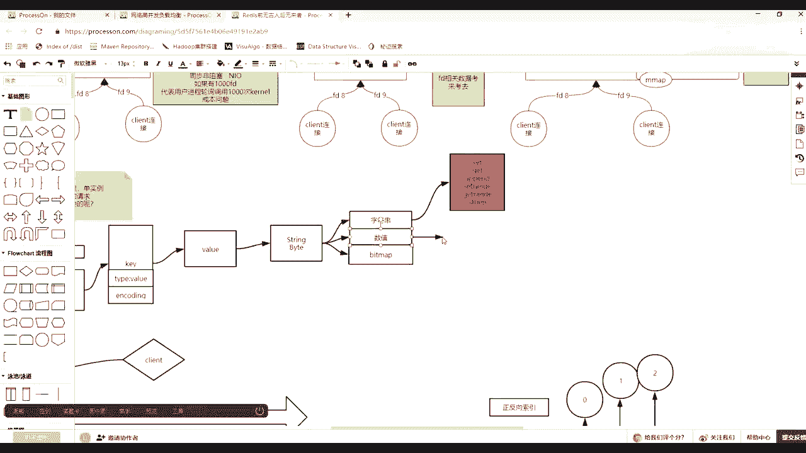
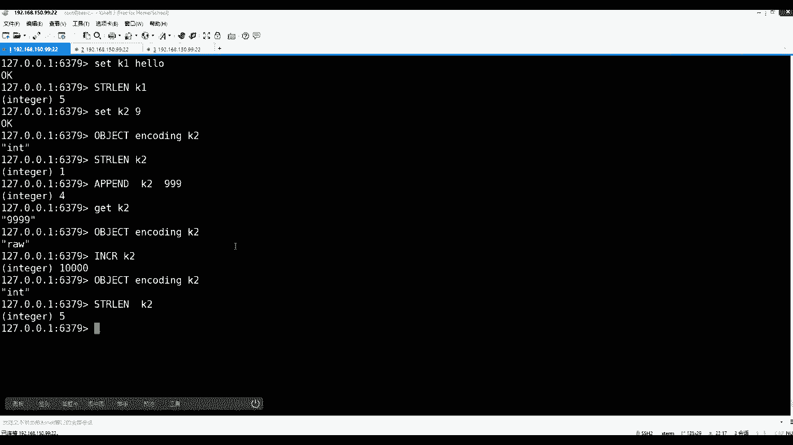
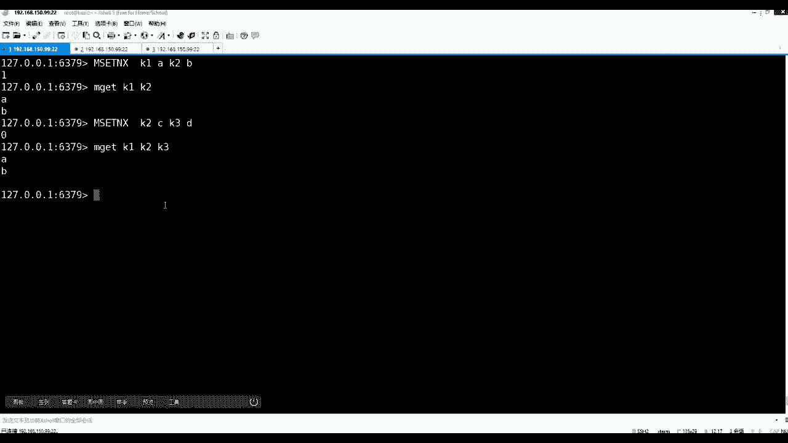

# 马士兵教育MCA4.0架构师课程 - P95：95、redis中value类型--数值 - 马士兵学堂 - BV1E34y1w773

D那么在这当对REDIS的基本使用有一个认知之后，那么现在高级的地方就出现了，马上出现了，那么首先进来一个命令，刚才看这个全局命令的时候，一个tab type，比如接我的K1，它会返回什么。

tab是不是看类型的意思，我刚才面前K1调过一些命令，你命令其实都归属于spring组，所以type kk1的时候，可以看这个K它的value值的类型是string类型，这是一个常识。

你用tab命令审视一个K的时候，可以是类型。

为什么，因为它有五种value类型，每一种value类型都会有相应的什么，都会有相应自己的方法，每一种方法是和类型绑定的。

如果你从客户端就是发出了一个，非死亡类型的方法，想操作这个spring k的话，不用发生实际的操作，他只需要拿你那个方法对应0K类型找不匹配。

直接给反应报错，这是最基本的一个一个优化，也就是说他这个K里边会登记，K里面会有一个属性，就在这加了，除了value上面说的一个知识，先补一个，在K里面会有一个最基本的态度。

tab描述的是value的类型，tab描述就是value的类型，那么除了有一个tab，还有什么东西。

还有什么东西来注意看，如果我用set连清一下库啊，Flash d flash，然后我用S首先看一眼help，下个命令这个set这个一定是属于类型的，对不对，所以说我set一个K1个99回车。

那么现在注意我刚才set一个什么hello之类的，这个可以hello跟set99，那么这时候注意看type k1请我回去之后，他应该是个啥来看，如果他们可以用它回来的时候是个啥，没错是个string。

因为我说了你这个命令是哪个分组的，那么未来这个K的value就是哪个类型的，所以肯定是string类型，对不对，哎那么这时候再来看我set一个K2，然后一个hello，那么这时候不用想。

因为你的命令是什么类型的，所以K2的tag类型也是类型的好了。

这两个都是之后，然后注意看他的type是绝对外面的形，那么K其实它就是一个ob de，在越南就是O价格，除了这个type也是你客户端，只要调到这个K上面，同学tape去审视它的话。

就告诉你外面类型除了他之外，简直是ob的，还有一个东西，还有一个命令是审视K里面其他元素的，比如说它里面还有一个命令可以看到coding。

那么因为CODY是什么意思，ob ject有这样一个命令，在read当中有OPGG的命令，它可以接受一些子命令，你可以通过help，Ob ject，然后ob jack e c t直接回车吧。

可以通过ob dx后面这个help看不到，我让他调一下，OKI可以接受，子命令当中就有一个encoding编码的意思，你要给个K那么什么意思，比如object，然后对我们的bn coding。

然后刚才K28楼，注意我回去之后就会显示啥，走会告诉你是一个EMB编码的一个string，不管怎么样，它看成string了，因为我刚才K2是不是就是一个hello，就是一个string，对不对。

这个应该认可吧，没有没有毛病，对不对，那么除了大家注意看刚才是1K1，如果用ob dein coding对K1，请问回来之后应该是啥，是最高的行吗，是不是自传类型来刷一下，是不是自传类型。

这应该大一个是int类型好，如果这个你能懂，因为毕竟刚才我给你演示的时候，可想你看到了我对K1C的一个99，对不对，那么这时候注意看。

一定要记住，人类当中类型当中五个类型里边有这种例子，还有什么类型吗，并没有int类型，我们这个int是个啥意思，这个int0是啥意思，它并不是太好注意，你并不是用tab去看的，这一定要注意了。

是这个对象，B站指向这个value里面，它的编码说的现在的include编码，这个编码如果是运营的话。

这个value的话，它有可能是使用，有可能是int，为什么，因为面向，因为面向release使用类型除了刚才字符串的操作，还有一些计算的操作，如果发现这个K1K1，你存的99，如果他发现int类型。

比如说impress，对我们的K1做一个增加，那么这时候跟K1就变成100了。

所以这时候立刻先排除一个概念，就是面向的话，除了自传这些操作指令，他还有一系列数值的操作。

能看到increase，Increase，怎么了呀，怎么不加一，而且你看，Include the integer value of key by one，它是固定加一的，那么除了，除了有加一。

还有一个带带，后边是可以跟我们那个K1，然后后面给出一个加几，加一个就是这个22回车，那么再盖个K1，就从刚才100变成122了，这是哪家，那么有哪家的demine DC d com对着K1会减一。

然后d create，然后Y然后这时候对着我们的K1-22，就变成99，能加能减，加个Y就可以加东西，那么除了可以加整数，还可以接后边by float，然后对着我们的K1，然后加了一个0。5。

然后get k1就会有一个小数加进来了，这就进了一个常识，没问题，同学们那个EMDSCR什么意思，就前面不用管，你只需要关注TR就可以了，为啥比如我给你再设一个size，就就这么几种提示啊，比如K3。

然后Y轴是123456789十十一十二十，三十四十五十六十七十八十九，二十二十122324252627，2829，33，1323334，35363738393 19吧，设置了39个字符。

然后这个时候在ob，然后EN头顶，然后我们的K3哎，那我再给他看一下append k3，注意看现在是不是还是SR类型的啊，刚39个，再给他追加追加几个123454 14左右的。

然后在object encoding k3roll，就这么瞎提示一个roll，一个是EMBS2，一个是int，刚才有这个int类型好吧，这是啥，这是啥，你现在肯定不懂，我要把下面讲完了才可以了。

现在收做减法，现在知道了，我们一直在讲string这个value的类型，它里面有字符串的操作，然后呢还有面向数值的操作，这里面有increment decrement。

Increment decrement by，还有一个这个关于防火的浮点型的计算，都可以在上实现，对不对啊，这个都听懂了，没问题了，那么这时候首先你要知道还有这种操作。

但是它来自于string，对不对，那么现在问大家一个问题，flash清一下，清完之后，如果看现在case里面库里什么都没有了，注意看，如果我在一个K1hello，如果用star lost来看K1。

请问长度多少，前面两个枝都铺完了，金块了，树枝都铺完了，那么现在接着往下走，一个一个过渡的知识，赛文K12楼请的长度多少，长度是多少，长度是多少啊，为什么是五呢，回车的确是五，为啥是五。

好像是按照字符的字符的个数，一个两个三个四个五个，对不对，是不是按照逻辑损的，对不对，但是这时候注意下，先往上攒，慢慢攒，跟着我往坑里走，下来一个K2，如果我设置一个九，设置一个九回车，牛射成功。

然后ob ject，然后encoding，然后K2它能设置成int类型，那么这时候如果再用string这个spring lose，然后对K2的长度进行判断，请问他是几，请问它是几。

那么这时候其实有一些常识，一些理论，就是如果我用一个字节可以表示零到多少，25或者正负的话，是0~127或负127到正127，对不对，然后呢在不同语言里边，比如java语言里边还分为具体的类型。

比如说double和int不同的宽度，那么在REDIS里边，在REDIS里边如果它能识别出int的话，那么这个int代表的是java，给他开辟四个字节来存到一个数值呢，还是就开辟了一个字节呢。

是不是相关的很多知识带出来，对不对，你要先把这个知识铺垫一下，这都是常识，为什么，先来看结果是一，明白这是一对不对，那么这时候注意看，如果注意看，如果append对着K2，刚才那个九，我append。

比如对九，这个再再end一个九，后来我占了三个九，三个九回车之后，然后我get k二一定变成了四个九，对不对，四个九，然后再看OP g，然后ANQ兵，然后对我们的K2注意看是弱弱的行为，对不对。

是不是先分类型英语，除非是end之后，他哎哎这四个角应该能为什么还漏了呢，这是他的方法的问题，但是不要紧，如果increase对着我们的K2是不是这样加一，能不能加一，能不能加一，能还是不能回答。

可能的也能加一，你发这也能加一，对不对，也能加一，那么这时候加个一之后再看，应该是int了，特别是int，也就是说一些方法，一些方法会让这个类型变了，一些方法会提前固定的这个编码。

这个in in int对不对，那么这些都能看懂，比较基本比较基本，但是这个时候要问大家一个问题了，如果在their loss，然后看我们的K2，现在蒙是对的，因为我一步把你往这个坑里带。

那么齿轮的长度是多少，都1万了，一半的时候应该是几个长度多少来，变成了五，为啥变成了五，为啥是标示标，都为啥都改，不算完还不算完还不算完还不算完。

再来看，给你演示这么半天就是为了带出来什么呀，注意他的二进制安全的一个事，然后还有数值计算。

那么还有一个命令可能没有演示的，这是作者非常细腻的地方，help string类型，它里边还有一个比较长一个get set，Get set，有这么一个小命令，这个get set什么意思。

就是get string value of the key and return is old value，不是set，设置你这个K的新址，并把老老值给你返回，很简单，比如我塞了一个K。

把刚才K1设置成hello，那么get k1的时候肯定是哈喽，然后这时候还有一个证明，set get get set get set get set里面我可以对着K1，然后给他一个马士兵。

然后注意看回车的时候，如果你扣扣弄掉的话，他会把哈罗给你取回来，老的值给你取回来，写新的值，这是马士兵了，更新了，那么这个命令有啥意思没有，你要感觉REDIS在各种场景下，为你的这个系统的一个考虑。

其实这个命令可以完全不需要开发出来，不是原则性，不需要开发出来，也就是用户直接可以先get k1，然后呢在SK1，那么用户等于既取到老的值，又更新了新的值，但是这时候你要考虑什么问题，就是成本问题。

什么叫成本问题，你发送一个get，再发送一个set，等于在通信的时候发了两个包，两次的IO的请求，但是这个时候其实这两个命令如果合成一的话，等于在通信上你就发了这么一个命令，过去就发了这么一个命令。

过去能理解什么意思吧，同学们就带了一个value的过程，会减少一次IO通通信，这就是做的比较细腻的一个地方，然后除了这些你说的原则性了，然后看help当中还有一个关于多比操作的。

波比操作的一个more set，在more set设置很多K的时候，K y k y k value，还有一个more set是more snx和ex，比如说像NXNNX是什么意思。

Only if none of the key exist，就只有k line的时候是不是才能才能设置，但是这个前面注意多了一个M，就可以设置多个k value key value key value。

那么注意来看走一个过程，比如我先把它清库，把我们的库清掉之后，现在case都没有了，那么这时候如果m set nx，然后你可以设置一个K1AK2，B两个K那么走，然后m get把你的K1K20来。

这个值都能更新上去了，对不对对吧，但是这时候注意看，如果你要这么做，M set nx，然后对着K2给它变成CK3，变成D做这样一个操作，那么注意听注意看回车，然后m get k1K二K三回车。

那么你会K1AK2还是存在，B没有变成CK3，也没有设置上去，那么这个时候这个东西才叫做原子性操作，能能能能盖过这个点吧，也就是你在同时设置多笔直的，这个时候加这个M多比的，加个N顿。

在的时候他其实想多多多比的时候，它一定是一个原子的，有一个失败了，有一个失败了，其实这里边谁失败了，K3肯定能充电，只不过K2已经已经存在了，他失败代表着所有人都失败了，好吧。

K3根本没上去啊，根本没上去啊，好了，那么这时候他们向我们的string，这个类型里面的组织数值的基本操作好吧。

