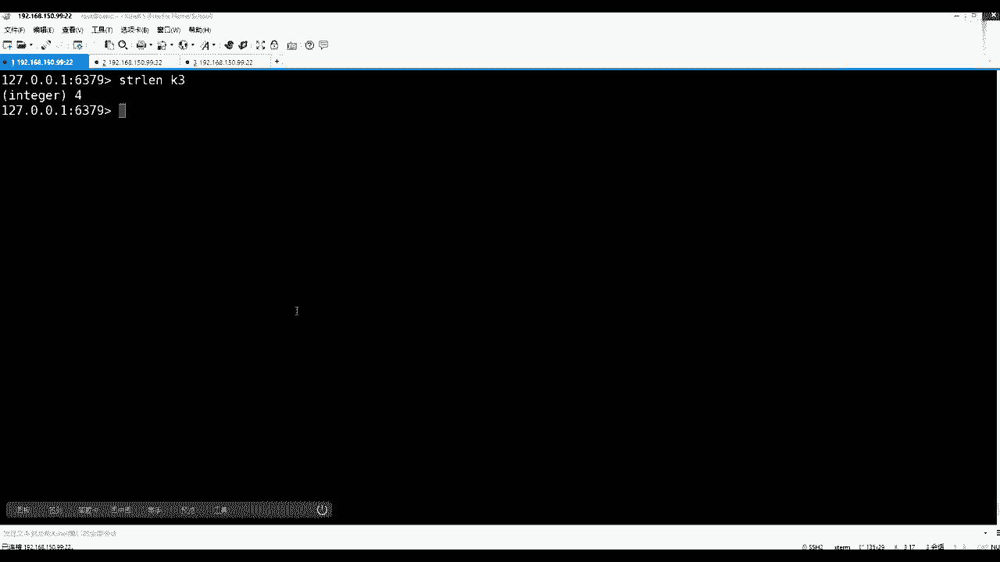
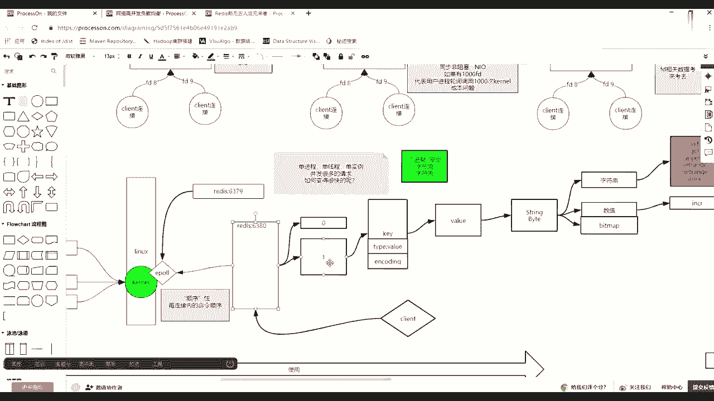
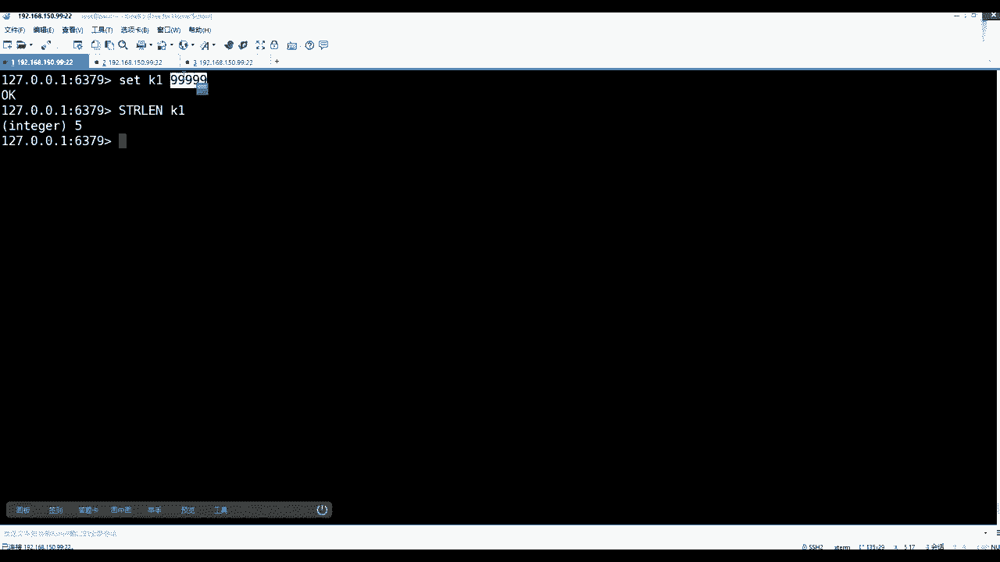
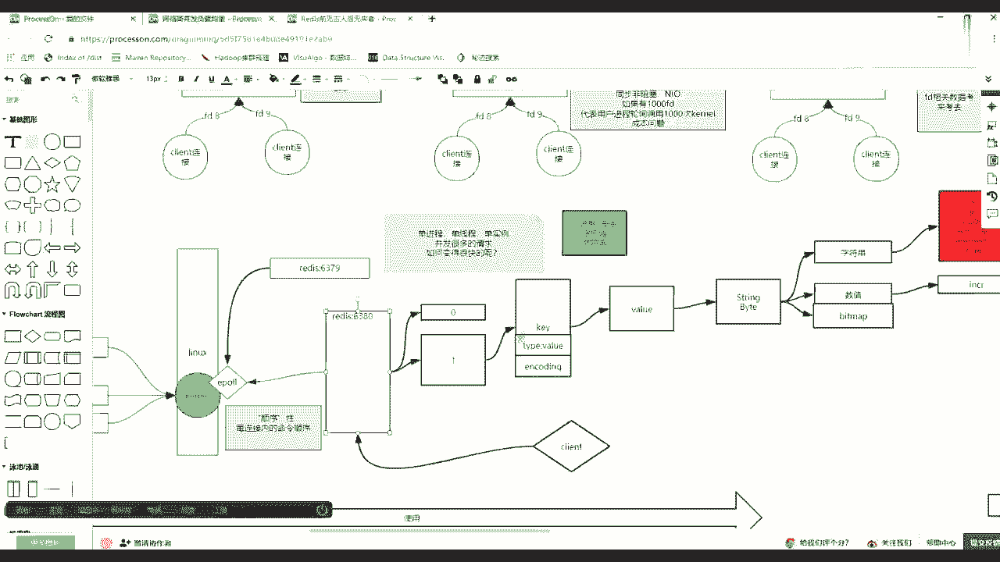
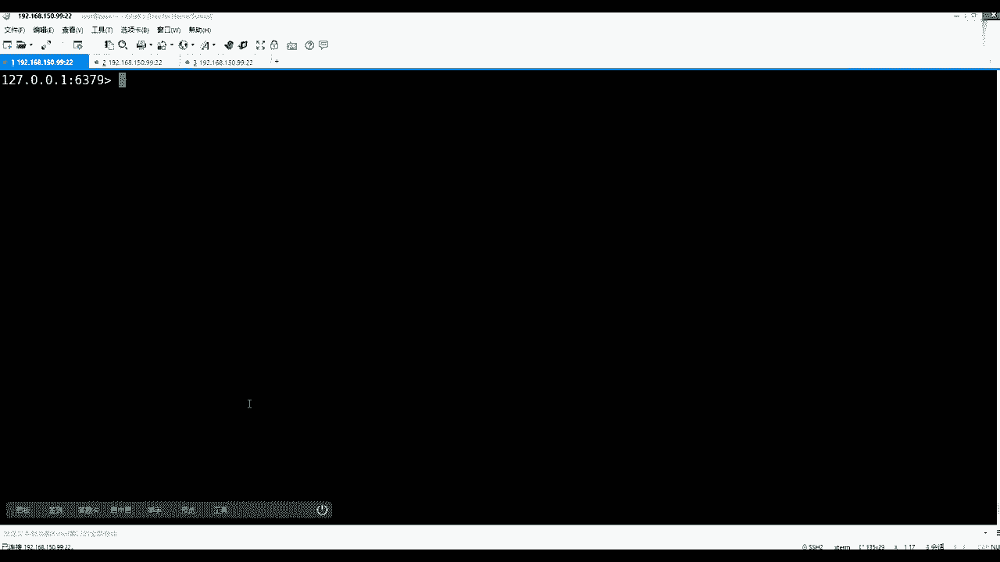
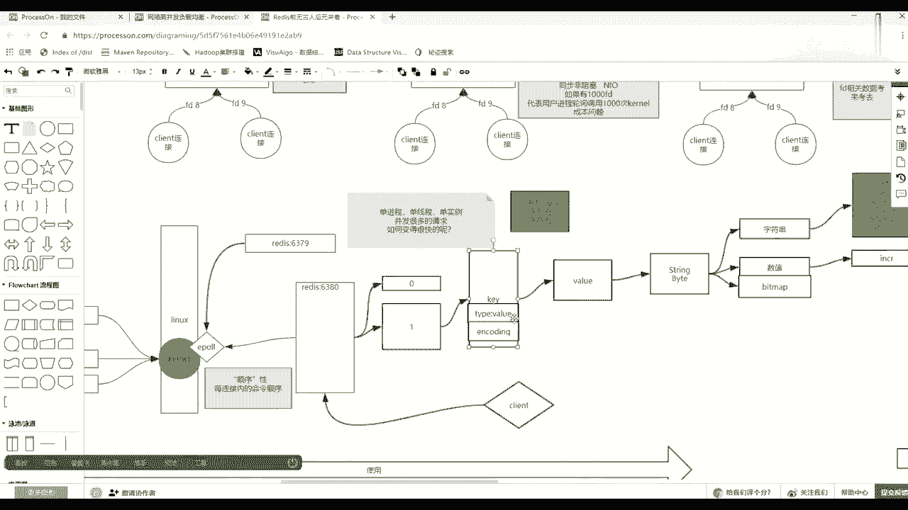
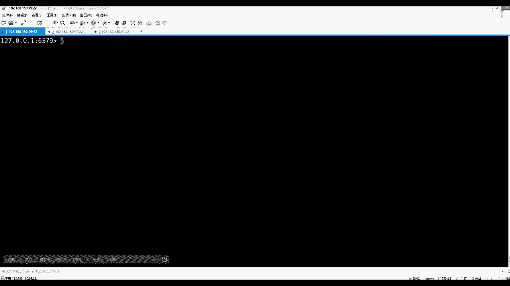
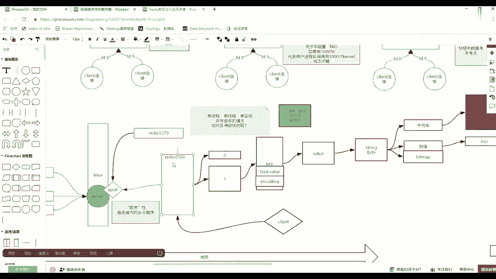

# 马士兵教育MCA4.0架构师课程 - P96：96、redis--二进制安全 - 马士兵学堂 - BV1E34y1w773

下载一个K3，如果A然后这个时候你get k3就是一个A，然后lost，然后看K3也是一个字节，对不对，这都没问题，如果append我对着K3注意看追加一个什么，我不能增加一个中国的中字，回车。

然后你get，K3不应该先盖子漏出来了，赶紧刷一下，K3，请问它的长度是多少，我刚才K3是不是一个A后面不是中国的中字，对不对，那么现在的长度是四，不是二，好像都已经懵掉了。

演示这么半天，为啥我给你带一个概念，叫做二进制安全，好用，红色看不出来，有一个概念叫做二进制安全，就是在raid当中自有的一个特征，什么叫做二进制安全，这些low的听上去很高级，但是这些low也就是说。

在rise进程与外界交互的时候，他与外界交互的时候，可能给他东西的时候，永远给他的字节数组等于其实按压，你想，我们一般面向流有字节流和字符流，那么REDIS如果别人通过solid访问他的时候。

大家从socket里面拿到的什么流呢，他只拿出了字节流，并没有拿字符流，他并没有拿自助球，为什么，因为如果REDIS它只存字节，没有同字节取出东西，按照某一编码集转换的话，也就换言之。

只要你未来的双方客户端有统一的编解码，数据就不会被破坏，这句话听懂听懂吗，所以叫做二进制安全重要是安全这个字，如果REDIS它自身除了value那种大的类型type之外。

他还有一个真正要动这个音coding，比如你给了我一个999，我就存成什么什么东西，然后你别人取的时候可能一出还不同不同语言，因为他知客户端语言很多嘛，那么不同语言的时候。

其实对整形的宽度理解是不一样的，就有可能发生阶段一出这样的一个错误，我有什么意思，同学们就像在多语言开发的时候，我们更倾向于使用JASON，使用XML这种文本表示数据的方式来交互，而不使用序列化。

序列化之后，这个时候大家就必须要自己增加一个什么，编码器和解码器，对不对，如果编码器解码器不一样，你那边认为int是四个，我这边认为int就俩，你那边写的时候成功了，我用一个比较大的一个四四字节。

能表示一个特别大的数写进去了，然后release也是四字节，但是这客户端认为这一类型不应该俩字节吗，求出来之后一出了不够了，说完显不对了，所以这时候其实REDIS作为一个非常核心的一个，中间一个中间者。

他其实有个二进制安全，它只只只取字节流，所以再来看刚才所有的和你想的不一样的地方。

第一再清一下拉是，哦听到之后，第一个数值这块set一个K19999999，这是五个九，但是SPIRLK1是五，现在就明白了吧，他并没有，虽然他知道o b I/O b i encoding。

它是int类型，但是他并不会把它按某一种数据类型给你存，比如按四个字节或两个字节，它就是一个字符，一个字节，一个字符，因为REDIS拿的是字节流，你这个它形容那个客户端，它的编码也是一个字符，一个字节。

然后直接向字节流去写，首先说先听一步来先听，这能听懂吧，是不是能听懂这块能够有，因为保证2D的安全，但是它里面的确会有increase decre，这样的一个计算，这个计算的过程。

其实他是要把这一个字节的内存里面拿出来，先转换成数值的。

转成数值之后，然后他会更新，我们K上那个这个encoding编码是int。

那为什么要加这么一个，因为加了它之后会方便，如果我调一次encoding，然后呢把他可能开始绕，可能是字符串，但是我把我把它识别出来之后，把它转成数字，没有报没有报错，没有报异常，没有报异常。

你给的参数也是一个数值，我加成功了，只要我计算成功，我就给encoding更新成int，代表着这个K状态往后都是int类型的，下次如果加计算的话，是不是就可以直接拿出来往上加，如果发现不是int类型。

那么它其实可以尝试来规避这个报错的问题，明白什么意思吧，就是为了一个加速，就是要更新这个这个这个这个这个所谓编码，这个过程，但是它的编码现在我强调的是，你要看这个长度，它的编码并没有影响数据的存储。

这是第一个知识点，还有一个迷惑，刚才那个中的中字为什么四个字节，对不对，是不是为什么四个字节这数据来看，SK二一个中国，我直接写一个中国的中子，我直接写一个中字中字回车。

那么这个时候我get我现在看长度，Length，看K2形的长度是啥，是三个，为什么是三个，那么注意看我这有关系的是看工具，然后看看在哪看看属性吧，我当前的这个插销连我的REDIS还有一个编码，编码在哪。

我在这也就是我这个x shell，这个软件和我的ready通信是UTF杠八的，然后呢，你看我刚才在一个地方下，我试了一个中度中字，长度是三，然后我给他切成JBK编码集，切成JBK回车。

这个时候我再set一个K3，然后再写一个中国的中字回车也OK了，那么这时候relax，然后来看我们的K3，请问长度多少，长度是二，因为中国的中字在UT当中是占三个字节，在JP当中。

JPGBK就偏向于我们中国自己的语言，所以它其他语言不会顾不会顾虑，所以压缩空间，然后用两个字也可以表示变成二，这能看懂吧，也就是说其实他真的走的是字节流，当这个看懂之后，然后把客户端退出。

注意客户端连接的时候，他默认啊不能退出啊，再来看一眼case星，那么这里面有K2K3，那么这时候注意看get k2，get k2的时候走，说三个字节，一个16~8，然后GK3是不是K30K是两个字节。

一个三个字节，一个两个字节，这这个这个是16进制的，它的值，它那里面的代表的值就是UT8当中，中国的中字，他这个值代表的是GJBK编码集中，中国的中字，它的编码这两个听懂之后，然后再退出。

然后这时候用怎么进redis client，然后杠杠roll这个ROS触发一个格式化回车，进来之后注意看，如果你get了K3是中的中子，get k2是这个字，为什么别忘了。

我现在现在连接的编码机是不是已经JDK了，如果你只需要知道，如果不带着它，也就是无力，只会识别什么呀，只只会识别阿斯玛了，超出阿斯玛他就直接按照16进制给你显示，但是如果你加了这个选项。

它就会触发编码集的格式化，也就是他发现了这三个16进制，且符合U这个你当前那个编码集的编码规则，就从编码集当中给你找到那个字符，就不给你显示三个或两个了，现在这个K2因为预定了八的UT和马当中。

这三个东西在这当中就是他就属于乱码了，其实最核心就是一句话，REDIS是2D的安全的，学大数据的同学应该更懂谁，还是2D的安全的，HBASE是不是也是二进制安全的，是不是我们在向HBASE写数据的时候。

也是要先给它做序列化，变成一个字节数组，HBASE根本不会去破坏你的编码的，这个时候再看看长度长度这个事，它就是长度K3，就这俩K2就是三长度是不会发生变化的，底层就是即便我在这个这种模式下。

即便在这个模式下，比如我set一个K4，一个中国的中子走，然后star lose一个K4，依然是俩字节，在JDK的情况下，也就是说给你上层客户端外围你啥编码，REDIS不知道raise不知道。

你只要想使用raise给他的，就一定是你这个客户端先变成字节数组，可以一开始就设置这个int类型，不是自己设置的，是在你设置的时候，你设置了一个K5，一个五，然后这时候object然后encoding。

而且这个时候虽然我告诉你，有这个编码这个事了，但是忽略了他会做一些预判断，它是一个int类型，那么这个时候如果他已经判断int类型的话，你未来调increase，然后K5的时候。

他就直接可以触发这个计算，而不需要做一个排错的过程，就不需要判断他能不能转成，只能直接发生计算就可以了，就提速，可以把一个判断转转转内行，这过程给他忽略掉。

没错，其实说白了就是它底层存的时候，就是按照字节去存的，上面只是说在K上面要做一些优化，K上面如果没有in coin的话，你每次计算的时候，他都要先走一次，判断这东西能不能转成，如果发现诶。

你上次的计算是围绕着这个spring的字节，数组的类型当中，作为一个数据数值计算体积就成功了，我就在include给你标标准例子之后，你下次计算的时候直接直接对着二进制，然后做累加就可以了。

就反正他就会加速一点，相当的就是适当的会加速这个加速这个过程，如果他说识别出是这个M4S2的话。

如果你加的话，他就根本就不需要去转码。

直接给你报错，这个类型不符，它不能完成计算，是大啊，这个点一定要get到啊，这个其实就是作者比较细腻的一个地方了，作者剩下的时候完全可以不用带它，但是带它的话就会稍微好一点啊。

它可以让他的一些方法这个速度更快一些啊，OK现在什么是二进制安全，听明白了吧，就是未来代表一个什么问题，代表一个什么问题，所有使用REDIS，你在很多人使用REDIS时候。

大家一定要在用户端这个叫什么呀，沟通好我们的数据的编码和解码，REDIS里面是没有数据类型的，他虽然是为了客户端，但其实也给客户端稍微带来了一个问题所在，公司当中大家一定要预约。

