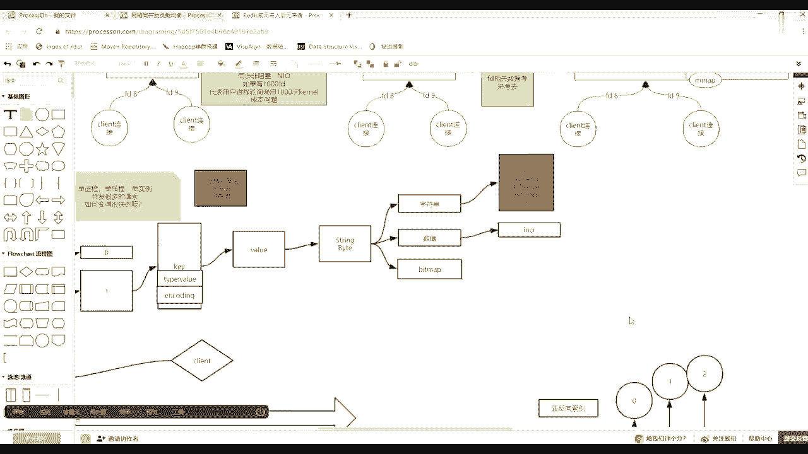
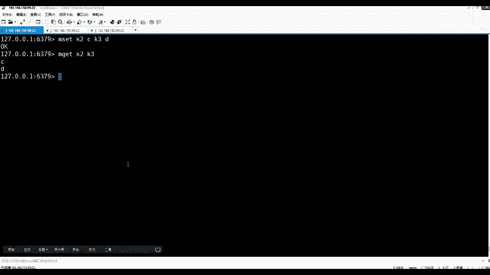
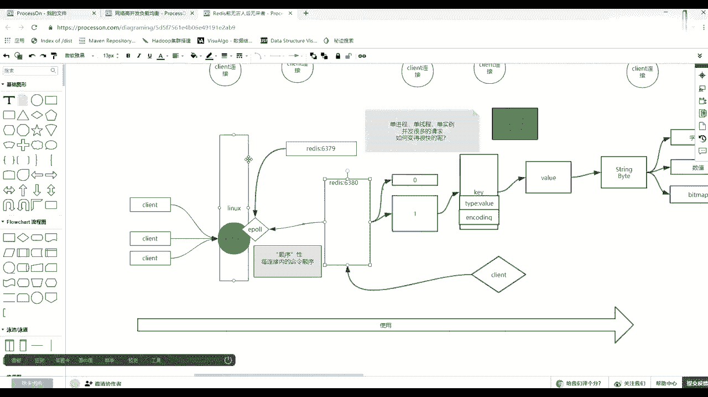

# 马士兵教育MCA4.0架构师课程 - P97：97、redis中value类型问题解决 - 马士兵学堂 - BV1E34y1w773

你可以试吗，比如说MSK2K，3DIMGK2K三，那么谁是谁触发原则的呀，什么叫原子，你如果就一比的话，谈不上原子，因为它单线程的肯定是原子，那么一定是在多M的情况下，然后且出现NX的时候。

那么这个时候肯定是原子的大大脸猫理解了吧，你回想关关雎鸠，你回想你在写NIO的java，java是不是他的这个模型使用的是EPOD本，你在修的时候是不是也是需要他那个selector。

你虽然看他那个DK里面的selector，但是其他底层如果发现内核里面有select就用select，没有SLG，如果有一炮使用一炮，没有一炮就看有没有select。

所以其实JDK对着操作系统做了一层屏蔽，他给用户暴露的是一个selector，是不是道理，但是它底层根据内核优先使用IP，所以那时候你会发现注册完之后，是不是自个儿，你每次还得循环要这个数据，对不对。

等于他底层循环是循环这个位置，其实说白了还是你用户自个儿那边有一个县城，得去循环为，或者给你返回了，你就拿出这个，拿出所有的K，每个K都拿出通道，然后开始读写，处理完之后，然后再去wait，他就调一下。

调一下再调一次，这个selector，区别区别怎么会没有区别。

他俩区别多大啊，他俩区别多大了，一个select1炮，这俩区别，你select你用中间调select吧，这不是java select，就是内核里边就是操作用CLINUXC的时候，如果叫SLG。

你要给他1000个文件描述符，但是这个时候如果是一炮的话，你只需要调一次wait等着就可以了，之前的时候有一个就放一个，有一个放一个，有一放通过CTRL，有一个放进一个，有一个放进一个来。

然后后边你只需要轮询调wait，等一个事件就可以了，有几个吧为他左侧一取消，然后开始开始读那几个处理，处理那几个IO，前面那个是我每次循环的时候，都得都得压进1000个文件描符，告诉你你啊你我阻塞。

然后你告诉我这个1000里面有有能读的了，有几个我还得把这1000个就过一遍，找出那些K来找这些文件，不如哪个哪个可以读了，然后不再便利他们吊坠的方法，这边是我来一个压一个，来一个等于1000。

如果select循环了十次，循环了十次select的话，1000要压十次，1000个文明能压十次，那么在一炮的时候有1000个的话，如果我就是每个每个socket只压一个状态的话。

比如都压读物都压血的话，那么其实每个只会压一次C条，只会一次，1000个就压一压1000个就可以了，不需要再有，即便循环十次，这位置循环十次，也不需要压那么多，肯定有诅咒的，可以调，你可以调成非阻塞的。

但是这个时候这个点不重要，重要的重要的是哪一块的变化，就是前面成本比较高，压1000押1000，押1000就压一次之后，就为了等列表上有了，我就取出来那几个文件描述符，挨个DOREAD，或者用多个线程。

每个线程发一个，然后这几个线程同时对不同的那个那个，那个那个文件文去读，对不对，然后你这个线程又可以再去注册这个这个列表，这种叫做同步的模式，什么叫异步，什么叫AIO，什么叫AIO。

其实你可以在这个模式下自个包装一下，也就是说我把这个底层还是这种同步的上层，我可以基于事件驱动，那其实不叫不叫ALO就是伪伪LO，就是感觉我这个用户写代码的时候，我把一个re的方法里边。

要传这个某一个文件描述符，就是某一个socket一个对象，然后再接上一个回调的那个对那个对象的方法，因为面向接口嘛，然后我发出去之后扔给一个线程，那个线程底层其实还是要走这个wait。

只不过你不需要自己端着那个线程去处理了，那个线程只要拿到之后，然后毁掉你这个方法，但是这时候其实你跟自个儿脱了裤子放屁一样，所以NT就根本没有使用这个所谓的伪AIO。

他直接用的是直接用这个NLOO这种方式，因为真正基于事件驱动的AIO，在LINUX系统当中是很难实现的，光最早先的时候IBM想实现AIO，然后后来oracle想实现AIO，结果这俩人玩到最后都退出了。

而且最至关重要的，你要明白LINUX的生态和windows生态不一样，windows是自个一家说了算琳琳的生态，然后他是有一个人占主要地位，就是林纳斯琳科隆内核的地道者，这个缔造者其实他是有代码洁癖。

洁癖这么一个问题，就林纳斯的代码那个有有代码洁癖，他就要求如果想在LINU内核当中开辟的话，这个AIO除了是异步之外，它有all in all l，意思就是所有就统一所有的IO，无论你烧黑种的会堵塞的。

还是那种所谓的磁盘文件的IO，所有IO都必须使用统一的接口，写这个接口一定是内核系统调用机的，且必须是速度最快的，要超过这种，但是这个所有的条件压出来之后，这个代码一上来的话。

他就一直在否定所有人给出的这个框架，结果那其实net也测试了，目前GMC当中实现的IO的速度，跟NLO的速度，就是这种方式的速度基本差不多，因为现在的实现的模式，DFC的代码当中也底层调的，其实还是一。

因为它不像windows内存空间访问那么随意，因为LINUX它更倾向于服务器级别，它是要求安全的，快啊这个哲思问了一个问题，就是说这么多客户端往外发东西的时候，那么你这边只有一个线程。

那么是不是就会处理处理一个的时候，别人都排队等着，的确是一定要注意，刚才说为什么强调个顺序，但是排队进来的，但是这时候你就明白了，之前给你讲那个那个那个最近的常识的时候，内存寻址是纳秒。

你这个socket其实对于那个网卡，它的寻址是毫秒，也就是说差了将近小10万倍，你除非有10万个连接，我有10万个链接，大家疯狂的同一时刻到达，那么这时候可能会造成秒级的响应，没错的确15万。

你看他俩的倍数可以看出来了，这都是小学算法吧，是不是小学算法，因为它的寻址之间那种级别吗，而且是记得像是移动就在内存里边，也没有磁带，我话说我就单一个建成，然后呢，我这个E炮这种方式。

还是基于这种内内核和内技能之间共享内存的，等于哪个文件描述，有了之后，我直接就从调一个raid，把你的这个链接里面拿出来之后，然后8K加一，然后加一之后，我手里知道你下一个下一个文件描述是谁。

因为共享内存嘛，我就直接入了另外一个文件描述符，又把你那个命令拿出来，你可能是减一就减一，所以那时候其实你看所有的通信的距离，跳这个折板都是很少的，所以这时候近似于可以达到十个，而且15万1秒钟。

15万收入的单机都没有走网卡，我对这个这个还得强调一点，就是它是单机压测的，就是这个计算机当中不需要走网卡，计算机有一个客户端，然后呢有一个REDIS他俩走的内核都直接回来，这么请求完全纯内存的话。

15万是没问题的，但是如果走了网卡的话，就会降到10万以下，67万78万，我头发这个问题的确的确点到这个点上了，很好奇内存是啥结构的，不是善道吗，硬盘是扇区，是磁道，内存就是一个线性地址空间。

内存就是一个线性的一个地址空间，其实你就想这么一个事情，如果我给你100个格子，格子长得一一模一样，从格子标号从0~100，然后但是我会给你不同重量的大米，黄豆红米，然后不同东西，然后你怎么往里去放呢。

重量不一样代表体积不一样，所以那时候他们需要的格子是不一样的，对不对，然后这时候还不能把他们混在一起放，那么一定会有浪费，对不对，所以这时候其实在内存相比，这种小格子上面又多了一个叫这个内存页。

然后呢如果100格的从0~10这里边放大米，而且大米的权重比较高，大米是可以去访问别的那些格子的，那么这个大米就是内核，剩下那个从一从这个11~100，这一个小盒子里面放红豆，放小米也放，放黑豆。

他们就用无线的程序，这些动物还不如混起来，所以各自有各自的物理空间，这个这个这个这个这个范围，但是这个时候其实每个程序都是靠什么训地址，讯地址，通过C的MV管理做映射，单线程是不是规避了线程切换的时候。

用户太像内核态切换的过程，所以选择单进程，单线程不是不完全是不完全是用户，这个多个用户进程切换的确是有性能的损耗，但是这个损耗站在数据一致性面前，这个损耗算不了啥，是不是换开了就跟你写java程序一样。

你到底是写一个线程，然后用NIO都能复用，让每个人的操作都是原子的，还是说我要在融入多线程，融入所，让多尔多多多多多服用进来，是不是有道理，所以这时候你就看把两个东西摆在一起的时候。

就是做歌手的一个过程，举手的一个过程，这就跟讲集群一样，集群里面为什么都是主从集群，主从集群的主，就是单单单个他说191说话就这样，他不需要和别人协商，所以主要是主入口，它的性能必须高。

所以一般这个它就是一个这样速度才能最快，那多线程只不过是并行了磁盘IO时间，如果没有网络或磁盘IO完全没必要多线程，这个脑洞有点大，我这个脑子转不过来，你再问啥，我再读一遍。

那多线程只不过是并行了磁盘IO的时间，如果没有网络或磁盘IO完全没必要多线程，那么在这注意一点啊，是REDIS，就是在面向网络很多IO的时候都复用的时候，REDIS用单线单线程单进程就可以处理，对不对。

然后你再想另外一个存储数据的就是MYSQL，MYSQL是不是处理也是存数据的，但是MYSQL的数据不是放在内存，它是放在磁盘，对不对，那么MYSQL就它更倾向于使用的是那种BO。

MYSQL更倾向于使用BLO就是一个链接一个线程，一个链接一个线程，他反而不倾向于使用IP，它需要更多的线程，一个链接来一个线程，为什么，因为你你去想，如果MYSQL它让连接进来了很多。

进了个10万百万条连接的话，但是这时候其实这么多连接，可以很快到达很多的请求，这个请求如果每个请求都要触发磁盘IO的话，在磁盘IO带宽上就会阻塞住，所以说你好似让很多人进来了，但大家要等很久。

所以其实你前面用e poo反而没有意义，还不如直接用bl更省事一点，索引会有预加载，然后索引的叶子是在你的磁盘当中的主干，可以预见到内存的，而且MYSQL也可以开启缓存。

就是比如你发了一个SQL select from a这张表，这个SQL你发过一次，他查完了数据，如果你开启了缓存，这个数据缓存内存里边主要它不大，然后就把这个SQL哈希亚放在内存里。

如果你下一条SQL长得一模一样，他其实MYSQL是先预判断你这个SQL，我是不是刚刚查过，查过的话，直接从缓存给你返回，后边什么SQL的语法书啊等等就不做了，就省了一大块的东西。

但是好像听上去开局缓存可以逼近REDIS的性能，但是毕竟你MYSQL肯定是数据大过内存的，内存可能就四个G，MYSQL数据库可以一个T两个T，所以这个时候其实开机缓存，如果表行比较多的时候。

它会降低MYSQL的性能，反而不它没加速，反而降低了性能了，因为多多一次判断的一个过程和缓存，这个这个内存内存空间被占用的过程，还不如直接把缓存关掉，所以说了，这个要的是你这个SQL。

他会做一个整个搜索字符串的，你前后两次SL都串外条件都是都是难，前面一个难，后面一个难，你这俩肯定还一直一样，那么这个上一次好像都可以用，你这个如果事后万一每次执行结果不一样呢，这个什么意思。

那你就说这个数据被改过了，所以这还这还有一个问题，所以这个它会断不判断，所以这个你开启了MYSQL的缓存，虽然想模拟REDIS充分利用内存，但是反而不好，的确是这个意思，你像之前你讲。

这个时候NDEX是不是，就是他你有多少个物理核心，开启多个进程，对不对，是不是道理，而且除了开启相应的技能数，还有一个亲密度，差一个亲密度，比如我这台电系统有四颗核心，我起了一个REDIS。

我会把这个rise亲密到第三颗核心上，然后把所有其他的事情，其他的那些进程，可以让他们在别的那个核心上去跑，那么等于因为你CPU是有时间片的，等于更多的时间片，这个3号四号核心就一直在处理REDIS。

尽量减少他去处理别的进程，那么这样的话，它缓存123级缓存也不会听来听去，所以这时候release才能达到最快的那个所谓的秒级，10万或8万这样的一个速度，就是你让这个进程一直内核调度的时候。

一直跑在哪个核心上。

