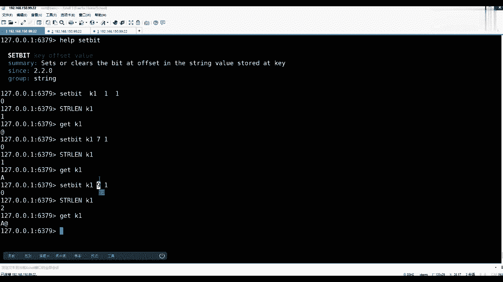
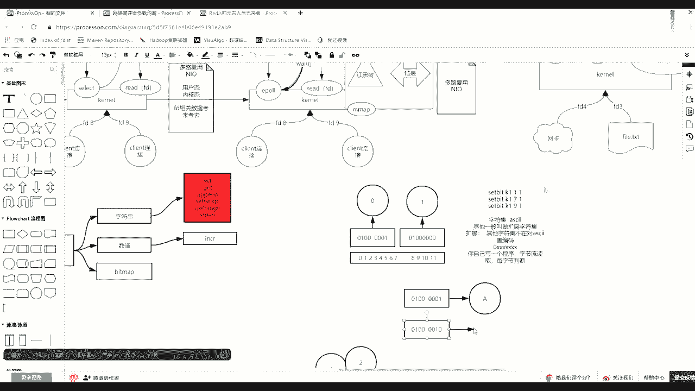

# 马士兵教育MCA4.0架构师课程 - P98：98、 redis中value类型--bitmap - 马士兵学堂 - BV1E34y1w773

下面开始讲这个未除B的map，呃，我上节课为什么花了一点点时间把你往坑里带，然后为什么你带带出这个二进制安全，最终为什么让你明白他就是一个字节流，而非一个字符流。

然后最终为什么让你明白它底层存的就是字节，其实知道字节这种存储形式之后，位图这个事就好学了，好吧，比如说自己要什么意思。

你看我先清一下库，什么叫做位图，都没有了，那么第一个命令CD，注意这个SB的命令它也归属于string，value类型为字符串里面会有这么一个命令，然后这个命令会给出一个会给出一个offset。

然后给出一个value，当然这时候注意了，他已经带出这个BITV的操作了，那么这就意听outside是二进制位，而非数字节，数组是二进制位的偏移量。

那么通俗来说画一个画一个东西来说，首先一个字节有多少个二进制位啊，12345678，这是一个字节，对不对，一个字有八个胃，然后再有一个字节的话，是不是也会有八嘎那味，对不对。

那么这个字节刚才说在release里面的时候才说，他这个索引的时候，它是面向面向的字符，也就是面向字节它会有索引，也就是说第一个字节的索引offset是零，对不对，第二个是不是一了，这个理解吧。

大家注意听注意PO面向二进制位也有索引，它的二进制位也有索引，如果你在使用未命令的时候，使用未命令的时候，他的二进制位也是有索引的，它的索引是从左向右，0123456789十十一，那么这个就很难画了。

就是前七个是肯定是起这里面对应他那个位置，然后八九十十一二十三十四出是对应他的，就是二进制位，虽然字节是割裂的分开的，但是对于react里面二进制位，它就想成一长串，所以按这位从左向右。

一直从零一直到他那个位置最大最大。

这个模型先先先到的柳树，那么像这里面set bat时候给出一个K。

你给出这个offset，注意这个offset说的哪个offset，说的是二零之外的offset。

而非字节道赛，举个例子，这个位置我对K1，然后注意all set是一，然后value那么二进制的value无非就两种，要么是零，要么是一，对不对，哎我给一个一，那么回车想大脑里有几个问题。

第一K1的长度是多少，第二它的二进制表示什么东西，有两个问题，先告诉我的长度多少，没错就是一个字节，那么这时候你要明白这个一是什么意思。

这个一是他这个第一个字，第二个字节的一个作用吗，不是他说的什么呀，是这个一，也就是说其实它的内存当中是把从左向右，第二个因为从零下标开始把它变成一了，刚才在B上是发生了这么一件事情。

能理解吧，那么它是个啥东西呢，这个艾福在阿斯玛当中01000的一个字节，正好是艾福好吧，然后注意再看到这个门门的感觉，如果set date，Co k k1，请问长度是多少，请问它是个啥东西，长度是多少。

没错还是一个字节，V1是因为七代表的是第八个二进制位，从零开始的，在02478还没超过一个字节呢，所以他不需要开辟新的字节，他最小的开闭空间是一个字节，对不对，它它它不需要开辟第二个，刚开辟一个就够了。

所以它的长度就还是一个字节，但是它它的数值是什么呀，你要看你对阿斯玛熟不熟了，是大写的A就是那按照这表示表示。

注意是01234567，是不是第八个是把它变成了一，注意01000001。

现在K1的只有一个字节，这一说字节的二进制位就是01000001，那么它的阿斯玛值就是大写的A，你可以怎么去验证mu阿斯玛，你就去找大写的A大连一多少啊，这里面是，这是16进制，对不对。

然后这两个数字代表的是前面四位，这个数字代表后四位。

后四位是不是一样，16进制是不是这么表示的，因为1248满的话，就是16该进一了，对不对，就0~15，然后16就到这了，所以这个后面四个正好是这个一，前面这个四是什么意思，124这个位唯一就是代表四。

41就代表的是大写的A没毛病。

同学们，然后这个会了，注意再看，如果做这样一个操作，set beat对着我的K1，然后对他一个九，如果设成一了回车，那么请问这个长度多少，没错长度二九已经超过了，因为他第一个字节的下标是0。35789。

已经超过了第一个字节的这个八的宽度，所以长度为二，那么请告诉我，根据刚才的知识get了K1的值的时候，它是什么，GK1的值是什么，没错是AI，就是这么简单。

它的命令行客户端是可以不全都显示，这个16进制。

如果那个时定制，刚好那一个字节能能转成阿斯玛的，给你按阿斯玛给你给你显示能看懂意思吧，因为现在这个K1在内存里面。

第一个字节就是01000001，因为我刚刚对九九其实就是八七，下标为0123789，把这个位置改成一了，他就是at，现在看懂了吗，追风，因为开始的时候你注意我这个这个这个命令，这个顺序。

我这个位置是这么顺序的，Set beat，然后对K1开始是为一的时候给了一个一，对不对，注意K1可能就是我一个K，然后第一个offset偏移量偏移量为一的时候，就是零一在这等一个一这个命令执行完之后。

我是不是set b对我的K1的，然后为七七的话，你就是下下标为七，就是第八个，对不对，就是012301234567，就是第八个在这摆了一个一，就变成他了，然后下面又执行了一个set beat。

然后对K1对九打了一个一，那么这时候一定要知道二进制，这个offset是从整个所有二进制里边，从左向右写的，就是012347899的话，是不是第二个第二个第二个位置打一了。

那么这时候你的需要天量没有超过两个字节，其实最终就两个字节，这两个字节就是你的K整个value的内容。

所以这时候你在get k1的时候得到了AI，因为它是以一个字节来显示的，刚才这个追风这个这个这个过程听明白了吧，OK好吧，这是面向我们的二进制位，可以做这个设置了，这个能听懂，比较简单。

为啥是ask ask了，不是UTF8啊，首先你退出去啊，注意看。

这是我给你补上吧，有这么一个基本常识，这个我都讲过，这个字符集，字符集标准的是sci阿斯玛字符集，其他的一般叫做什么呀，扩展，扩展字符集，关键是这个扩展这个意思，什么叫做扩展啊，什么叫做扩展啊。

其他字符集不再对ASCII重编码，服用服用的时候注意阿斯玛有个规律，就是零必须的，然后1234567，也就阿斯玛里边第一个第一个字节，第一个必是零，后面可以从全0~1个全新的变化，代表不同的东西。

所以这时候当这个常识，这叫常识，有了之后，任何的程序你自己写的程序，你自己写一个程序，字节流读取，然后你肯定是每字节，美字节判断，你要每字节判断，如果你读到的第一个字节就是零开口，那么你脑子根本不用想。

你都不考虑你自己是JPK还是108，直接拿着这一个字节，只要他是第一个是零开头，直接去阿克曼那把这个字符就显示出来了，但是一旦发现不是零开头，是一开头，比如一个一个一个八当中有三个一一个零的话。

那么你除了这个字节，还在读出两个字节，因为三个一代表我用三个字节来表示，把那个东西之后，然后再把他的前导码踢掉之后，拿剩余的二进制位拼成一个数值，去你的那个你这个客户端，那个现在那个字符集当中。

把那个东西取出来，那个字符显示出来，这中有中字，字符集这块能听懂的同学来刷波一。

好吧，所以这时候你会发现很多客户端，你比如DX当中也是哎，这个英文字符怎么能显示我别的东西，怎么还是那种16进制都乱码似的，就是因为什么软件字符集里面，大家都认识阿斯玛，但是他未必去认识其他的嘛。

而且他一般也不会给你做强转。

因为人家放的时候，因为你release2里的安全，我这边需要客户端是那个U6杠八了，但是人家放的是不是按U放的，我不知道，所以我就一定是什么呀。

就是按实时定给你显示了，但是如果你课文当中给出什么呀，REDISCLI告诉他，你尽量的拿着我打开的这个就是把它一加，然后我客观现代一执行的时候是啥编码集，那么就尝试着拿那些16进制的，那个不是零开始的。

拿着我这个这个字符集去找那个字符去显示，但是就有可能会出现乱码，因为人家对方可能拿拿UT网吧，到这里是二进制安全的，还是那个U妈的编码，到时候到这边拿JDK1翻译就错了，就乱码了，好吧说的有点多。

回来收好，我们再讲我们的两位除了一件事情，现在往里设置，往里设置这个事情可以可以可以会了，然后再来看还有什么相关其他的随便组当中，面向B的操作，这个操作还有什么bit co。

然后big field这个往后讲啊，这个这个3。2出来之后，这个东西比较复杂，今天讲的更晕了，先看简单的be co b beat operation，然后beat pose，还有下面有sat beat。

看别了，就这么多，一般来说你都往里设置了，现在还有一个是beat，pose这个命令big post命令是做什么事情呢，是find first beat，寻找第一个按键位置。

然后在你的这个字符中在哪个位置，它的语法格式用这个命令后面接你单位一个K，然后呢给出你要寻找的二进制位，这是我们无非就两种状态，要么零，要么一，然后你要给出一个区间，但在这注意了。

这给的是start end，它并不是说outside。

那么这个3end说的谁说的是你这个字节的索引。

我们来演示一下，如果用beat pose，我要查20~120制，这个一二进制，这个一在0~0，star0N零，那么请问他会出现吗，Bipose，你要注意这些干什么，干什么事情呢，我要找的是二进制为一。

在这个零到这个零。

这俩零是什么意思，其实这俩零说的是第零个，就是第一个字节，那么找一的话。

它出现在哪了，是不是出现在一这个位置了，走回车。

零我没有给出K。

没有给出K是哪个K是我的K1，对不对，你要先给出一个K回车，是不是在这个这个唯一的位置，在这个一的位置，然后注意看，如果把这个零换成一的话，换成一的话，应该反反反什么1~1。

那么这两个1STR都指向一的话。

其实说白了就是第二个字节，对不对，是不是第二个字节。

那么请问如果查一的话，它的偏移量，它返回的偏移量偏量是多少，是多少。

要小心回答了是多少。

是多少，没错是九。

他给你返回的是那个一在二对，26中位置的位置，这么翻译就对了，而不是在这个字节里，它出现在第几个二位的时候。

它是全亮的，它是全亮的，那么这个时候如果改成0~1呢，它返回多少，他是找到第一个的first。

如果beat pose，我要在K1这样的一个二这两个字节这么多。

二进制状态当中，我要找一个二进制第一次出现的位置。

且是在零和一这两个字节数当中去找，那么回回这就是一，就是这个下标一，他找的是第一个出现的位置。

这应该能听懂，这个还比较简单好吧，好了，那么除了BP这个beat pose，还有一个是bit co beaccount，BEACCOUNT后面要接个K然后给出end。

注意end说的是什么，是你的字节的起始和结束。

然后count是什么意思，count他只是抗抗的一只抗抗的一出现几次了，那么这时候如果对着K1，我从0~1这个范围，这个字节单位的范围区间内，统计一出现了几次审问后。

回解是不是出了一次两次三次。

对不对，那么这时候回的就是一个三，他可以做二进制为一的统计，你给出这个字节的区间，如果给的是0~0的话，就第一个字节里面两个一，如果1~1的话，这个时候出现出现过一次，这个一二是这个一，那么接着往下讲。

好那么接着看，除了这些，还有一个是叫做beat option operation，为了操作，那么这个语法的命令是我可以注意注意，这DISS就是目标K，目标K后面可以接一个K或者更多的K。

这个目标K是结果是结果不打印了，是要放到这里面来，那么你参与的K会触发什么，触发一个关于二进制，为了逻辑操作与或非异，或是and or travel或者not学过计算机二进制的。

这应该都知道是不是面向二进制会有与或非，对不对，抑或按按位的按位操作的，那么举个例子，比如说要注意听啊，我先准备两个，我先把这个库清一下flash，然后清完了，然后我塞了一个K1，然后把他的一标成一。

然后，然后再set dk1的七标成一时候K1大写的A，对不对，然后这时候再注意看，如果我想得通过二进制位的操作，得到一个大写的B我应该怎么设置，我通过给K2，我最终想把K2里面重新代理的B。

但是通过四个B这种方式怎么去设置，是不是set beat，然后对K2的第二个，这个V是不是标一个一就可以了，就零幺啥啥的不对，当我给你讲哪哪用它，然后再set beat对着K2是什么呀。

AB是不是顺着来的，零一是A10是不是B了，一一是不是C对不对，所以这时候我对他的六这个位置打一，这能看懂吧，所以这时候get了C2是不是带个B，因为后面要用到它做逻辑与逻辑与或的时候，用它好了。

现在我KK二一个分别是A1个分别B，我给你写出来了。

因为咱们的确有的人可能对，这个这个值是不是大写的A，对不对，然后换一个值，后面改成1020，这个零一是110是不是二，所以对应的是B了。

对不对，现在这就是K1，这就是K2，我要做一件什么事情，Be operation operation，然后目标k and t，先写的是operation and做and安慰语。

然后目标K是and key，参与的是K1和K2，明白啥意思吧，然后这时候回车，那么目标把k car的安慰语的操作，是不是存到目标K里去了，所谓目标K的话，那么这时候我get and key它的值是什么。

请告诉我值是啥，按位与的操作的时候，直接回答我，知识上，这全答错吗，按位与操作，什么叫按位与啊，什么语操作，有一则一，不是这个有有零则零。

全一为一，对不对，你琢磨琢磨，这俩如果按位与的话，得出这是个啥呀。

是不是01000000，所以它的值是at明白了吗，现在这个时候的安慰啊，B的BOORIN了吧，如果改一下，如果bit operation，然后给的是一个按位或操作，然后是all key。

然后也是K1K2，那么这个时候我get ok。

那么它里面存的是啥，这是不是C了，安慰或操作的时候，是不是有一则一了，全因为赢得不对，那就是01011。

明白了吧，好了，OK这就是按位操作。

有这么几种方式，那么有人说了，老师你在讲啥，你在讲啥，这点这个支点很重要，在国内当中最值钱的就是BM，这是位图，举一个经典的例子，首先我先告诉你的命令，你回去自己整理，这里面是不会有这个CD。

然后还有beat count，回忆一下，还有beat pose，然后bit operation有这么几种方式，对不对。

