# 系列 5：P99：99、 redis中value类型--bitmap例一 - 马士兵学堂 - BV1E34y1w773

这个位置因为上面都很容易理解数值运算，字符串的操作就是位图，你们很多人可能第一次听说，所以给大家这个这这单独给你做一个笔记，就把场景写出来，两个场景，第一个听需求，第一个听需求，如果你的公司有用户系统。

公司有用户，那就用户点呗，是不是很多用户对不对，然后这时候这个需求是什么需求，帮统计未来这个需求是统计用户的登录天数，且窗口随机什么意思，比如说在电商的公司当中，电商的网站一般都是说你老板心血来潮好说。

马上这个今天是8128828，马上就9月了，那么9月1号往前推一周，9月1号往后推一推一周，这14天所有用户的登录的天数帮我统计一下，然后没过两天，该双11双11的前后帮我总结一下。

然后哪天他老婆生日了，我老婆生日前后前后几天给我统计一下，就是你的老板会随机的让你统计，指不定哪天到哪天结束这个范围之内，能听懂我什么意思，同学们，在这个需求下，你是怎么维护这P术语。

支持用户登录的时候登记，且可以把这用户一年的数据随机窗口去查询，比如就查A的用户，A这个用户在某一个时间窗口内都有几次，那么怎么去处理，不处理的解放是不是很多，你尝试着多想一想，多说一说。

用你之前的这个思想和过往的经验，你是不是可以拿一个数据库MYSQL，然后呢创建一张用户登录表，用户每一笔登录，是不是可以在里面产生一行记录，然后登记他的时间，哪天登录的，对不对。

然后用户的所有东西是不是可以往里灌，但是这时候你想一想这样的存储的时候，是不是就要从存用户的id，因为MYSQL是关系型数据库，它里边关表表之间必然有一个主外键，对不对，关联对不对。

所以D这个D可能就是几个字，几个字节了，最少得三四个字节，存一个id吧，能听出来表达什么的，咱们现在算这个成本复杂度，对不对，这张表最少每行是不是得存一个日期，再存一个它哪天登的吗，日期日期的话。

你最少也得准备一个四个字节，ID你得准备一个四个字节，这是八个字节，表示一个用户的一笔登录要消耗八个字节，这是第一反应，那么你京东有多少人，每个人一年基本上得有200多天登录。

这张表的数据是不是其大查询的时候，用户老板给出一个随机端口，是不是要所有的数据成本高，怎么优化，怎么优化大数据处理，不需要REDIS足矣。

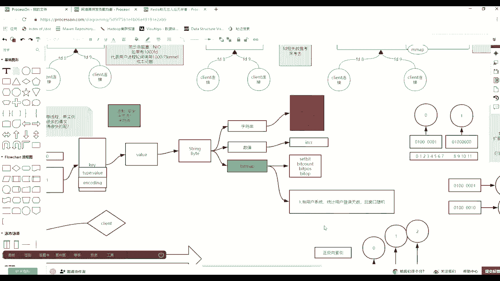

来看各有思路走啊，各有思路走，你只需要算一个成本，这里面有一个固定的一个数值，有两个固定的数值，第一个固定的数值，就是一年有365天或者366天，对不对，我大方一点，一年400天。

如果每一天对应一个二进制位，就是从左向右，第一个二进制位代表第一天，第二个二进制位代表第二天，也就是四个四个二进制位，400÷8是50个字节，用50个字节可以最大记录一个用户，全年365天的登录状态。

比如比如说这么做，Set date，肖恩我就说，那么我这个人就是key，然后给我的1+1个一是什么意思，回车这是什么意思，我第二天登录一次，因为你一定明白20位偏向是零，对不对，所以是我第二天登录了。

然后我过两天之后，如果我的用户再产生登录，你就看哪天了，第八天就下班为七打一个一，我第365天登录的时候要做什么，364打一个一，对不对，打一个一，我第一年是不是就是第二天，第八天，第365天登录了。

只有三笔登录，顶天46个字节，顶天是最浪费的，如果天天登录的话，是不是也是四个字，也是四十四十六个字节，你就算你你的电商当中有多少个用户，无所谓了，就用户每个用户是不是一比一录，哎。

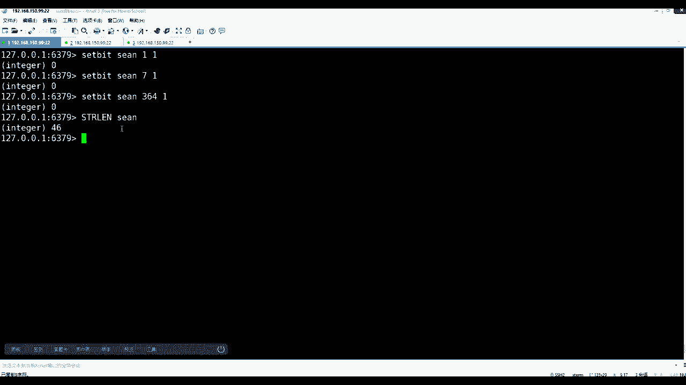

这个数据能登了，那么最终问题是不是老板会给出随机窗口。

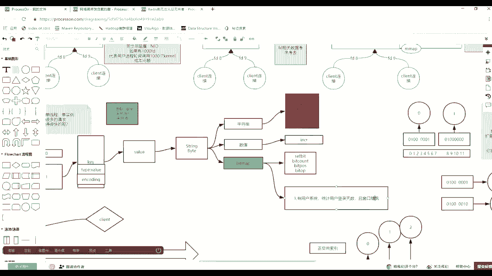

随机窗口什么意思，这个用户最后最后的这几天有没有登录啊，一个字节是不是八天的，是不是八个人是八天的，那么看这用户最后两周有没有登录，你只需要取什么就可以了，beat count肖恩。

然后给出sand360，不是一共是天，是这么多，要除以八，对不对，就是负二和一是不是最后两个字节，两个字就是最后16天，对不对，是不是登录过一次，是不是按照字节的逆向索引，这是统一用户的登录，对不对。

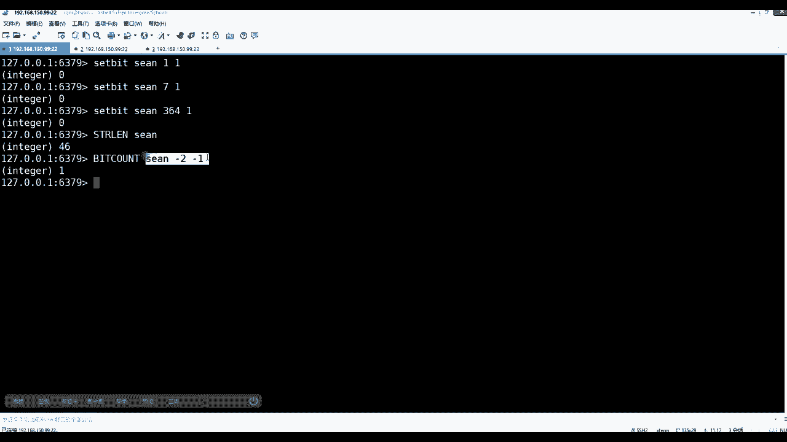

这是第一个场景，再来这个思路走，能看懂吧。

我把这个笔记给做一下。

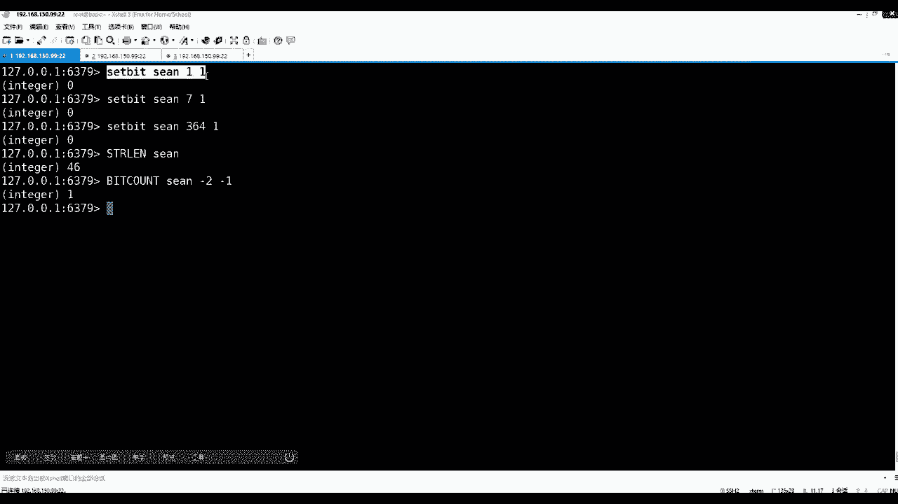

什么意思。

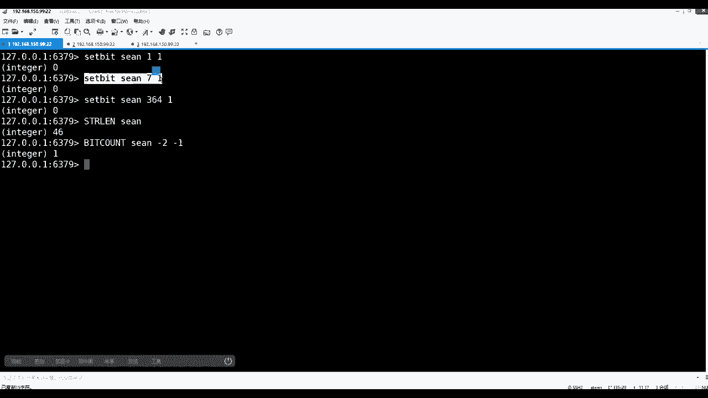

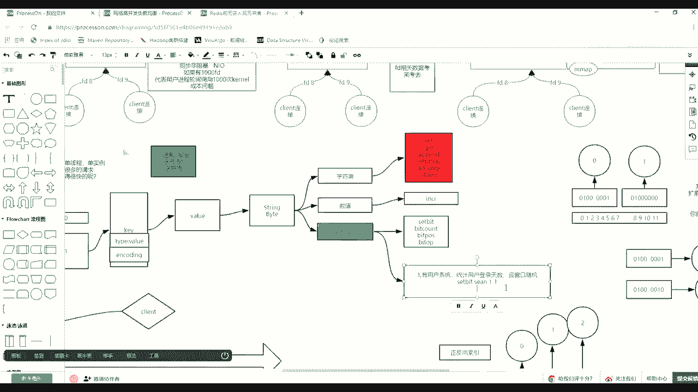

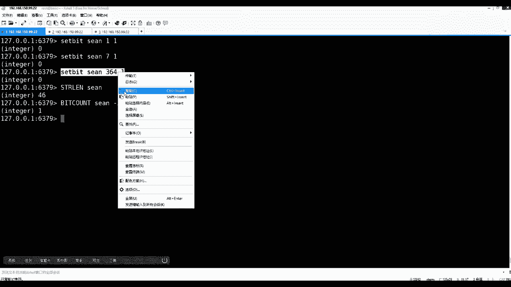

这就是所谓位图。

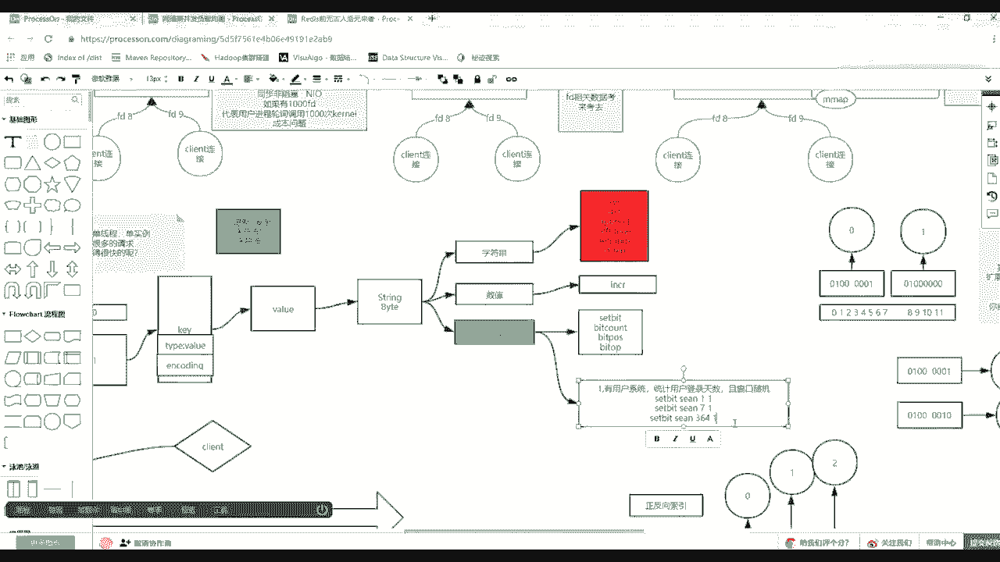

然后你学过你就去思考一些事情，比如劣势存储或者什么大量的数据。

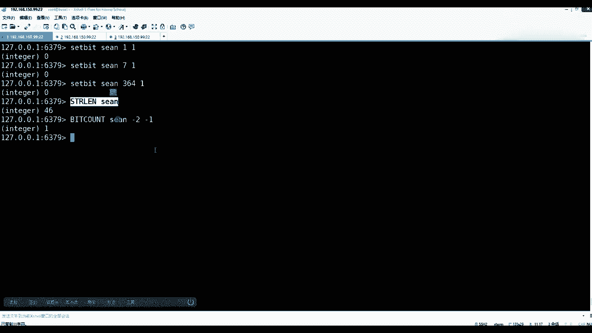

然后想理解就是有的有的有的行有数据没数据。

是不是你可以挂一个索引来标识这个用户的，某些行业，有数据好像没数据。

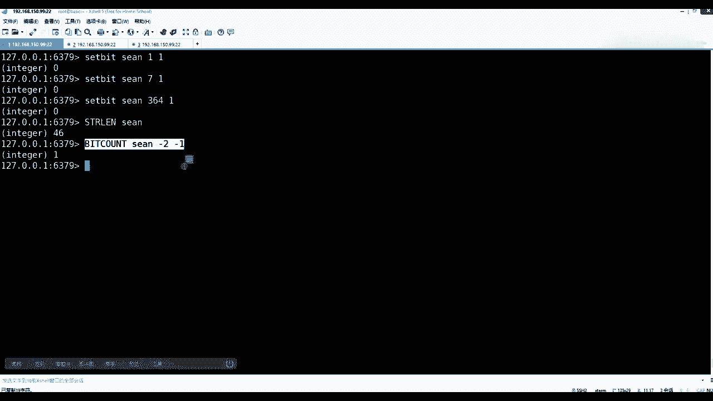

然后是不是可以外挂一个位图了，你看这位的一个状态，一个缩影，按这位的缩影对不对，其实内存消耗很小，好吧，这是第一个需求展现出来的，这个矩阵是什么矩阵，上面这个矩阵和矩阵分别长什么样的。

上面矩阵是比如说肖恩，然后这里面如果二进制的话，这是key value的话，比如说0101010101，这是在不同的天出现，对不对对不对，然后比如说有消音了，然后库里边还有这个JS。

然后0101011111，这是他的不同的登录这种场景，然后上边对应的是日期上面，比如说这个0102，然后零三第三天，然后零四，把这个最好向右，我就不画全了好吧，其实你整个公司无论你怎么去设计。

就这么点数据，要么就是用户id为key，天为位，要么就是什么，这个时候其实整个内存消耗你可以算算上边，如果如果上边每一个用户，每个用户是多大的，每用户46字节，每用户40，刚才看是不是46字节。

然后乘以什么用户数乘以无数，那么46个字节乘以乘以乘以乘以千万个，十百千万，10万百万千万就拿1000万为单位，说1000万的话，就是46乘以它最终等于四十六四十六，然后后边加上个十百千万，10万百万。

是不是这样一个，然后就是1K然后兆十兆百兆就知道不是，这是1K然后怎么算1K10K8K照，然后40兆是应该四五十兆的，这是三个三位是1K对不对，三位是1K然后这是1K了。

这是1K10K百K然后兆十兆百兆，400多兆，400多到400多道可以放下，你精通所有人，就是1000万人的全年的登录的明细，然后如果你觉得大的话，是不是可以把这个用户拿出来。

十这个一半的用户放到一个REDIS，另外一个REIS的另外一台存，另外一半一半的用户，是不是可以单独去统计他们了，是不是可以分开了，问问我爸下面的字表来算算，基本上，但是这东西一定会小于什么呀。

第一小于MYSQL，第二速度快过MYSQL，都是二人之位的计算。

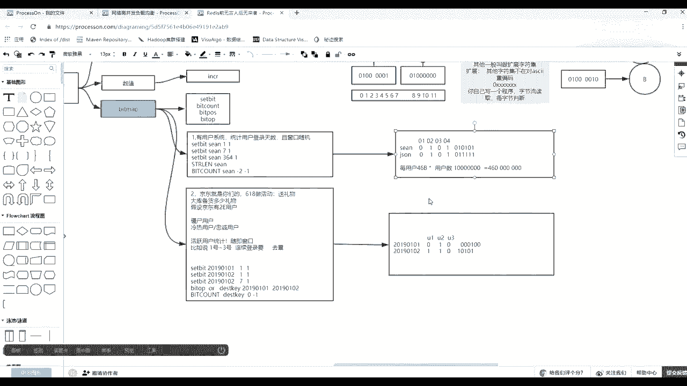