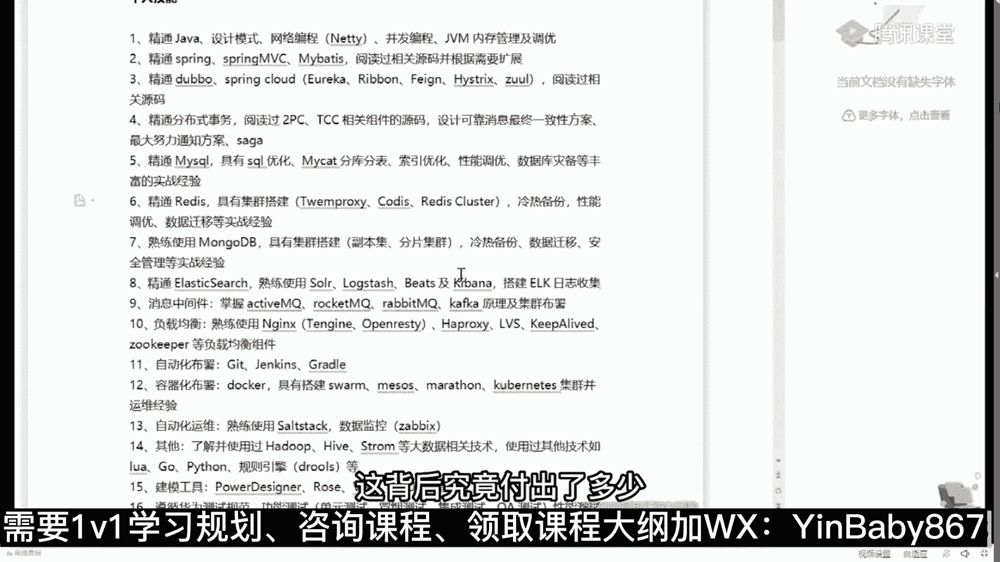

# 马士兵教育MCA4.0架构师课程 - P9：9、以阿里为例，补全你的简历缺陷 - 马士兵学堂 - BV1E34y1w773

首先我跟大家说一句啊，这个P5是一个什么直径，P5是一个入门级别的大厂，入门级别的职级，实际上以前阿里是有P4的实习生，但是后来P4这个直接就不招了，现在基本上就是P5，P5是什么样的人，会是P5呢。

按理说应该是零到3年，他们认为你是P5好吧，也就是说你社招3年以上的，那直接就是P6了，但是到在目前的情况下来说呢，大多数的情况下，作为P5是你刚刚毕业的应届生，应届生往往是定级P5呃。

不管你是本科生也还是研究生啊，我这里没有提专科，因为专科屁股这个直直击你进不去好吧，刚刚毕业的应届生，然后呢大概在你工作，你比方说你最开始的时候没有进到大厂里面，你进到了一家中小厂工作3年左右。

哎你社招通过社招进大厂了，这个时候往往是P6，然后你在你项目组里头，慢慢成长为带那么四五个人，这个时候你往往是P7，当你负责完整的整个的项目组的时候，我告诉你，你这个时候呃，大概你手底下是几十个人的。

这样的一个一个一个规模的时候，大概就是P8了，当你手底下有不同的技术团队，包括业务团队的时候，你这个时候就是P9啊，那个如果从额薪资的角度来说，P5的薪资的话呢，大概是20万到40万左右。

那么如果是从嗯。

P6的薪资来说呢，大概是40万到60万左右啊，呃如果是P7的话呢，大概是50万到70万，但是这时候是有股票的，就是大部分P7是有股票的，只有少部分没有，因为阿里有一种文档，P7也比较好玩啊。

他专门写文档的，他那个薪资就低很多，50万到70万，大概再加上800~1000 200股啊，你这个股票比较值钱的时候呢，这个差不多P7的薪水能拿到120万左右，顶薪，哎我讲到这。

有没有同学想想看看那个P7的简历的有没有，有没有有的话给老师扣个一来，3年以上还可以练屁股吗，3年以上你就要搬P6去了，你为什么还要练屁股啊，干嘛这么看不起自己，嗯我给大家看一个非常牛逼的简历啊。

这个是顶薪的，120万年薪的简历，我找一下。

这个呃这哥们儿当时是29岁，拿到的是阿里的P7plus，它不叫P7，这个叫P7plus，我一会给你解释什么叫P7plus，P7plus那个100就是80万的正常薪资，外加40万每年的股票嗯。

就类似于大概的估算的值啊，120万年薪呃，你们也可以读一读，看看看这个简历呢，自己能不能罩得住这个简历呢，如果你仔细读的话，其实你会看得出来，那个这里面最重要的最值钱的点到底在哪，5年java开发经验。

其中3年以上全是大型系统架构设计经验，3年以上团队管理经验，分布式高并发，高可用大数据量的系统架构设计和研发经验，好了，这是最值钱的，当然目前政府的注册用户多少，日活多少，日访问量多少。

这种的比较吹牛逼的啊，这实际当中的数据很可能到不了这么多，对开源源码有过深度阅读，好，从这儿呢你大概可以看出来，P7到底是一个什么样的水平，架构设计，源码阅读，这就是为什么我在课程里面。

会给大家这么设计的原因。

明白吧，就是老师的课程设计，不是说随随便便给你设计的啊，为什么要读读源码，读原理，为什么要做架构的设计，其实就在于这就是希望你们能达到这样的水平。

当然不是说每个人的薪资都能达到120万，不是那么容易的呃，取法乎上得乎中，取法乎中得乎下，你的目标定的高一点，哪怕没有道，你跟其他人相比，你都是赚的，你的目标本身就定的非常低，我今天就吃掉一个饺子。

你就算达到了，你也就吃了一个，我今天要吃100个饺子，然后就算没吃完，我吃了50个，那我比你这一个也要牛逼的多得多好，这是他的一个技术站，这些技术站咱们课程体系里全有呃，可以这么说。

我的很多的课程的设计，是根据咱们同学们遇到的各种各样的问题，来设计的，那个这这这这全是一堆一堆精通了啊，这个你放心啊，其实看上去很难，但是呢不是想象中的那么难，无非就是你需要掌握架构的一些个技术。

选型是吧，当然最新的还有power啊，然后呢搜索上的一些技术选型啊，这种那种呃这个持久化的一些技术选型，缓存的一些技术选型等等，就这么多，加上一些底层的知识啊，呃他这个呢还没有写算法，写太多啊。

嗯其实还需要有一点算法的知识就OK了，这背后究竟付出了多少。

呃不要不要羡慕别人，我有的时候会说可以拿别人来举例子，但是呢每个人的路啊，每个人的人生路都是不一样的，你不可能完完全全的复制另外一个人的人生，跟自己比就OK你比自己更强了，今天我比昨天强一点点。

明天比今天强一点点，时间稍微一积累都不用长，几个月的时间，你就会发现你已经脱颖而出了，其实就这么简单，那个嗯，你们你们你们，你们想知道那个那个那个他现在的一个状况吗。

这个这哥们是是咱们史上最牛逼的一个学生啊，史上最牛逼的学生，你找一下他现在的一个状况啊，这里是大概有1000多位我的学生，然后做的一些小小的总结和聊天的这个过程，我找一下啊，嗯就是他，对。

呃这个呢是他那个最近，然后拿了5000万的股票呃，套现之后，然后从公司离开，做了一个小小的总结，就是P7的一些一些一些内容啊，P7说到底是硬通货，是个分水岭呃，这里面需要你掌握什么，需要你掌握什么。

需要你掌握什么，K大家可以到这个网站上去访问访问看看啊，这里面都是很多同学非常真实的聊天啊，你们看看就会知道了，那个呃当然还是那句话啊，就是这种的比较极端，我也绝对不会说奢望。

说我们每个人都能达到这样一个水平，我在他这个年龄的时候，也达不到这样的一个水平，好吧，所以大家呢也不要说太羡慕，这个也没有意义，但是呢最起码这份简历会给你指出方向来，我们可以朝这个方向去吧。

我们今天啃下来，其中的一小点是不是就进步了一点点。

我说今天我们甭啃别的，我今天啃了一个分布式事务，这东西不难的，咱们一堂课里头呢，差不多你花个三天，顶多花个三天左右的业余时间，就能把这个就能就能够把这个搞定，你知道吗，我们是不是搞定一条好。

我今天不干别的，我就聊一个自动化部署，我今天不干别的，我就把docker给搞定了，你想想看这个三天，这个五天，然后那个七天加起来的话能有多长时间。

最重要的是你根本没有必要每一个都全部精通，面试的时候，我说过了十加成两家就可以了，不用面面俱到，这大家能听进去吗，天神下凡对什么学历学历相对比较好，985，浙江大学，浙江大学是985吧，嗯肯定是啊。

当然我说到这很多同学就开始给自己找借口了，老哥我是大专，所以我不如他很正常，因此我又可以安心的躺平了，我说我再给你说一遍，我说他这个案例不是要你跟他比，而是要你建立起来跟自己比的感觉。

你今天要比昨天强一点，以他的这个技术为目标，能听进去吗，就是你天天跟比尔盖茨比，那你这辈子永远完蛋，你天天跟埃隆马斯克比，哎你这辈子就别活了，所有人都别活了，对不对，跟自己比，我今天比昨天强一点。

明天比今天强一点不就成了吗，嗯能忽悠大钱的背景，肯定背景必须放光，这就是背景背景决定论嘛，来我想问你那个马云背景怎么样，马云985的对不对，马云是杭州师范的大专生吧，如果没记错的话。

任正非是原来当兵的嘛，对不对，英语老师对啊，所以不要找借口，我跟你说，你所有的这些这么说的，其实都是在暗示自己，我没有他的硬件，所以我有自己的不成功的借口，其实就是这个给自己一点心理安慰嘛。

嗯我是种田的，对嗯嗯好了，但这个就比较夸张了啊，我们想想想起来了，拿这个举个案例呃，这是一个P7的薪资，那P8的薪资的话呢，多数人应该是到不了的，到目前为止，我直接培训的学生里头还没有还还目前啊。

我跟大家说，我确实我还没有能把一个人直接呃，学完咱们课给干到P8的，I'm sorry，我这个还确实还没有干到，因为P8呢真的就很难培养了，他的这个薪资呢大概是200万呃，就是按照官方的说法。

应该是120万到200万啊，这是这样的一个薪资，那么这里面就有很多很多的非技术的因素了，技术层面我完全可以让你到这个水平，但是非技术层面我也在尝试呃，目前呢也有一点点好一点的好消息了啊。

就是这这这这种层面的也。

我我也在给大家做尝试，就是课程体系里面。

为什么给大家要增加团队的管理课，产品的管理课。

其实呢就是想让大家在你以后的职业生涯里头，走到高端的时候。

也能够还有空间呃，到现在为止，我是我们现在有一个学生啊，我在我的微信里已经把他给置顶了，我只有一个学生，他已经灭了七面了，明白吗，他现在面P8，他灭了七次了，已经灭完这七次之后呢，还有第八轮的交叉面。

就是为什么说，那个那个那个那个那个那个哥们说那个我靠，这灭了，灭了七次了，还没这个P8，定级太难了，确实非常的难，然后呢还有最后一轮的交叉面，因为什么，因为他要求的定级太高了，所以就一轮面一轮面。

一轮面一轮面，然后很多人都认为你确实到这个程度之后，才会给你这个职级，当然这个职级到来的时候，就意味着200万年薪了，OK呃据我知道的，从京东跳到高德的，就是那个有一本书叫亿级流量。

我不知道你们了解过没有，那本书，它的作者就是从京东跳到高德啊，我当时微信联系了，说给咱们来讲讲课，然后呢高德实在太忙了，高德可能是阿里里面所有最忙的BO，然后那个没有时间讲课啊。

不然的话把他请过来讲课呃，从京东跳到高德，大概是据我了解，应该是这个数400万啊，嗯所以小伙伴们，你首先要敢于想，就是你要知道呢，这个世界上是有好多好多潜力的，你首先你你的潜力呢也不要想那么高。

我现在拿12万好，我明年的目标能不能拿到18万，听懂了吧，这就是一步一个脚印的扎扎实实的，今天比昨天强的非常科学的一个目标的定级，OK怎么说呢，机会有的是啊，在这里呢大概是1000多份。

1000多位的同学啊，好同学说，老师你做假放心，老师这里头全部的案例要有一份是假的，十倍学费赔付给你，你随便找，你想找任何一个人，说他的那个那个找他联系方式，只要他同意，我都可以给你联系上啊。

嗯怎么说呢，这里面的案例呢就是不同的人，不同的案例都多的是有顶级的，我刚才介绍的都是顶级的案例，当然也有呢刚刚入门级别的，我还是有话就是路是一步一步走的啊，比方说入门级别的像什么样子的呢。

嗯这种的最开始呢原来是拿8000块钱，然后学学四个月给拿到1万，1万4还可以吧。

一年就7万多呀，这就是学习的收获啊，当然扯得远了，我们翻过头来再来看看啊，就是什么样的人可以到P5，什么样的人呢可以到P6，什么样的人可以到P7，他到底是都需要哪些哪些东西。

呃我刚才呢给大家讲了一个概念，这个概念呢叫什么呢，叫P7plus，你们这个你们知道这个plus是什么意思吗，有没有知道这个plus什么意思，SSPP最高呃，我想问大家一个小小的问题，这里有一堆P6。

1233个P6，我要在这三个P6里面挑一个人做晋升，升值为P7，来你告诉我谁会升上来，谁会升上来，Who，当然有同学说就开玩笑了，开始是吧，长得漂亮的跟评跟那个考考评官有一腿的，跟考评官关系好的。

首先第一点，高级别的晋升并不是只有一个考评官，也不是只有你熟悉的那个第一点，长得漂亮跟漂亮，长得漂亮确实有点优势啊，但是呢他肯定不能不是决定性的因素，好好听我说，如果我要在三个P6里面挑一个P7出来。

那么我一定会找那个优先，已经开始做P7事情的人，能听懂吗，我再说一遍，如果我要在一堆P6里找一个P7出来，我一定会找那个已经开始在做P7事情的人，好了，这个就是P6plus，同理那个就是P7plus。

就是我为什么说在你们平时工作的时候，要多承担一些，多做一些，不要老在那斤斤计较，我给我这点钱，我就干这点活，我多干点我就亏了，我是真的遇见过这样的人，这样的人最终的结果就是滚蛋，没有别的。

所以让自己就是简单说提前一步好吧，来听进去的，给老师扣个一啊，讲点，今天感觉讲的比较碎，因为主要我没有给大家解释为什么自己体系，典型的自己体系是什么样，嗯以及呢他的一些个各种的说法啊。

我简单跟大家说一说，也就是大概是一个什么样的，什么样的，什么样的一个一个一个一个水平吧，就是P5呢他大概做了一些哪些事情啊，P5大概是这样的，它叫做嗯直职级的入门就是新兵啊，给你一个模块。

独立完成就是给你个程序，在别人的指导之下，我告诉你啊，这个这个东西要完成这个业务，然后告诉你用什么技术好了，你能独立完成这个基本上就是就是P5，听懂了吧，然后作为P6来说呢。

就是你独立开发某一个这个不能叫模块啊，就是P5来说就是某一个模块的分支，就是一个小程序啊，独立完成你自己的一份呃编程的工作，就这样简单，那么P6呢可以独立完成一个模块模块级别。

那么P7的话呢实际上就是项目整个项目级别，你可以带领团队来完成整个项目，好吧，呃基本上大多数人都是集中在这三个职级啊，我目前只有一个学生在冲P吧，他冲不冲的下来，冲下来我会告诉大家，冲不下来的话。

我也不会跟着吹牛逼啊，那个呃作为P5来说呢，一般来说我刚才说过了，就是应届生，所以呢你社招生呢。

