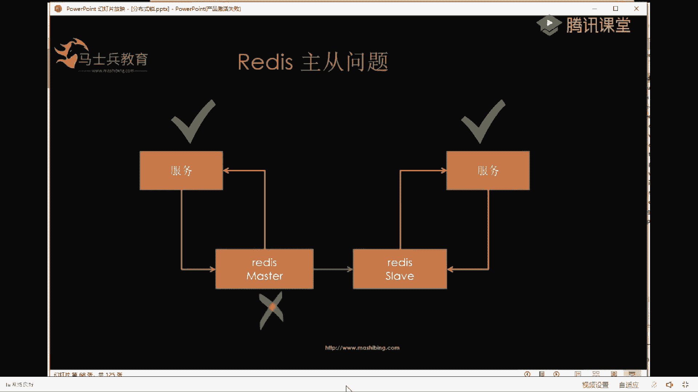

# 马士兵教育MCA架构师课程 - P102：高并发秒杀场景下Redis分布式锁实战 - 马士兵学堂 - BV1RY4y1Q7DL

对一些中小型项目会用。重点是reice，对，重点是reice，reice用的才是最多最多最多的重要的事情说三遍ok。下面先说readdies单节点解决方案。刚才用mysql的时候，我讲过了。

加锁的时候用主键或者唯一索引。那么用redice的时候，用什么东西来。做他的唯一的那么一个东西，您你真硬。嗯，你说的对，醉梦今宵，你说的对，就是用这个命令side NX。戴taNX的意思就是什么呢？

就是说原来reies里有这个reies的存储结构，就是KV值啊。不懂reice，我简单过一下KV值。如果原来这个reice里有这个key，如果有我set就set不成功，如果没有，我才能set成功。

大家这么一想，是不是就能想到加锁了。如果原来没人给他加锁，那么我加锁成功，如果有人加锁，我去加锁就失败。懂了吗？这块如果没有readiness基础的同学，我简单的这么一说，可以懂吗？😡，可以的。

我继续了，get继续好吧。😊，来，除了加锁之后，还有一个放锁，就是说通过set NX去加锁，还要通过deelete key去放锁。就是你加了锁，你执行完业务了，你不能不放锁吧。如果这个key一直在这。

你执行完业务，你不管它，别人再来加key就加不了了，懂了吧？所以除了加锁还有放锁的操作，记住啊，s NX加锁，delete NX放锁。好了，给大家简单说一下这个死锁的概念，就是刚用刚才的。😊。

set key value和delete key有一个死锁的概念。大家可以看先看一下我这个小小的动画。

先拿拿一台rediis过来，然后呢，这台服务器给它加锁里面设置了1个KV值。就是K1Y6的值已经有了。然后呢。这台服务器挂掉了，就是说它的业务没有执行到释放所，就是说它没有执行delete的时候。

没有执行dele这个key的时候，它挂掉了。那么你说。key还在不在reads里？😡，嗯。在是吧，如果可以在的话。😡，其他的服务再来加锁。他还能加上吗？对他就抢不到了是吧？所以这个就造成了。死索。

能理解吧？就是如果你单纯的如果你要单纯的看代码的话，就是用这个代码去写的话，是不是那么完美的。

就说你的业务代码挂了，没有执行delete的时候，会造成死锁，其他的其他的业务再来加锁加不到，那怎么解决呢？

怎么解决，看这么一段动画。然后呢，就是你这边加锁的时候给它设置一个过期时间，就是说这个KV值有一个过期时间。比如说这边服务挂了，挂了之后，它里面的key就消失了。然后呢，其他的服务再来加锁，它就可以。

加得上。理知啦嘛。😡。

的。用这个。设置过期时间设置过期时间怎么做？就是有的时有的时候有的人写代码这么写是吧？s nX一个key，一个value值，设完之后再写一个exel是吧？exp key。😡，1秒有是吧。这么写也不对。

因为你的程序如果执行到这，刚加完锁之后，在这个地方挂了。就是你还没有等过期给他设置过期时间的时候，他就挂了。然后这个key也会一直存在于reice中，其他的服务器再来加锁，它还是加不到。还有这种事儿。

太有了，这不是告诉你了吗？我我跟你说清楚了吗？那个积木。😡，积木，那咋整？咋整肯定会告诉你咋整是吧？然后跟照这个加锁的方式就不对嘛，那怎么加？😡，通过这样去加s KVNXEX10。这就是一行命令。

让他用一行去加，也不用lowa脚本，直接就这么一行命令reice支持直接可以加好了。直接有参位。对，就是我的意思就是说你不要把过期时间和sNX分两行去写，你把它写在一行里就没问题了。😊，OK懂了吧？😊。

然后呢，好多人用的reis是老版本的，老版本的它不支持这个的话也没有关系。然后呢，老师这里面也给你准备了。

落脚本。是吧撸尔也有撸尔加锁的代码。Alu啊。放锁的代码，这里面都有这个找小姐姐。领取这段代码OK然后这块加锁的时候，加锁的时候就先过。好了，扫完小姐姐吱一声，我们继续讲课。给你刚才给你说到了啊。

用撸老版本的reis用lua也可以。我给你说到这了。好了，小姐姐抬走。😊。

继续我们的课程。然后呢，就是基于刚才的这种情况，就是这不是set一个key，一个value，然后它也有了过期时间。知道吧？就这个这个时候大家看似完美是吧？过期时间也有了，我能保证我的服务挂了，锁也不挂。

😡，不是保证我的服务挂了，所以自己会慢慢的释放掉，让别的服务也来加锁，是不是感觉此时很完美？大家觉得这里面还有很还有坑吗？好了，我给大家看一段例子。😊，给大家看这么一段一段小动画，大家理解一下啊。😊。

然后呢，你看啊ready设置设置过期时间引发的一些问题。还没到还没到单机挂了的时候啊来。他给res设置了一个key一个value，它的过期时间是10秒。结果呢这边的程序就是它的程序执行了10秒钟。啊。

程序在左边已经执行了10秒，然后它接着。到10秒的时候，key没了，因为这个key。😡，他过期了，知道吧？K过期了没了。😡，然后呢，他还在往下执行。他还在执行。他一共执行了14秒，当它这最后4秒的时候。

看这里面颜色一样。这个程序进来加锁能不能加得到？因为它的reies里面已经没key了，所以它可以。加锁成功，然后这个时候呢，就有两个线程同时拿到了一把锁，这样往下走的话，它还会遇到超卖的问题。

就是刚才说的。本来一个一个的来，结果两个人一起来了，就会遇到两个定两个库存被卖了10个人的问题。来这块清楚的同学，你敲个一，就是为什么两个县程同时拿到了一把锁，是因为程序还没有执行完锁过期了。

在程序的执行过程中，这边的程序来了之后，同时加上了这把锁。好了，这是这个问题。然后紧接着这个思路啊。😊，这个思路还有一个问题是什么呀？它这个程序比如说执行到这个地方的时候，它去执行delete操作。

那么是不是就把。😡，这个程序s的那个key给。delete掉了。没想到这一层是吗？没事，老师会给你把你没想到的东西都给你想到，让你这节课不白来，好了。😊，他去执行delete的时候。

是不是把这个线程加载锁就给delete掉了？就是说。我删除了别人的锁。能听懂的敲个一。好啦。😊，我删了别人的，那么往后，如果别人再来呢？然后就会造成。这个又去伤他的锁以后这么一直上下去，你你他伤他的。

他再伤后面的是不是就乱了？首先咱就不说又抢到又不抢到的是吧，他肯定就是宁您你说的这个是对的，他后面呢又能抢到，只不过是他说只不过这个里面更更纠结的问题就是我删你的锁，你去删他的锁，他要来删我的锁。😡。

知道吧？这是会会引起程序的混乱。那么怎么解决这个问题呢？我们这么解决。😊，删除锁的时候。加那么一个判断，就说如果这把锁是我家的，那么我来删除它。如果不是我家的，我直接略过。

是不是就解决了我删你你删他的这个问题，听懂的敲一。增加识别吗？增加一个判断，一会儿告诉你判断怎么写。好了，这是一个问题，这个问题解决掉了，然后再解决另外一个问题，就是说锁过期的问题。

就是说我程序给锁设置了10秒，结果我程序执行了14秒，怎么解决？那么我给锁设置1个14秒，好不好？😊，如果设置14秒，因为程序的执行时间你无法控制，万一它就执行了15秒呢。反正是说设置15秒。

那我程序就是执行20秒是吧？那只设置100秒，那我程序就是执行101秒，你无法预估你程序的执行时间。😡，懂了吧？所以我们需要引入。另外一个机制。另外一个机制是什么？看门狗。看门狗是一个什么情况呢？

给大家举一个例子，就是说比如说这边有一个大房子。这个大房子是什么呢？就是说你要进行业务处理的一个代码块。是吧然后我给这房子标个标个名字叫toilet。然后你要进去进行业务逻辑的处理。

你进去处理业务的时候呢。你在reis外面，你给它设置设置一把锁。然后这个锁呢，你看这把锁已经有了，然后你再给锁设置一个过期时间是一分钟。然后呢，你再拉条狗。到门口。这条狗呢它干啥的呢？他就说。😡。

如果过半分钟主人不出来。我再把锁的有效期再续一分钟。能理解我这个意思吗？就是说你不用管那个锁有效期是多长时间，就是你就给它设置一分钟。然后只要你在里面不出来，你的狗到第30秒的时候，自动把它续到一分钟。

😡，老师，我发现别人和你举的例子都一样哈，行业通用的，谁跟我举的例子一样。😊，那那就是抄我的啊。好啦。😊，这块大家理解了吗？😡，能够理解。就说拉条狗放门口，这条狗呢就是另外一个县程。

结另外一个线程就监视着你的主线程完成没完成。get到了是吧，理解不知道怎么实现，哎，肯定会教你怎么实现的，别着急啊。😡，好啦。Yeah。ok。😊，那我就给给大家看一下这条狗怎么实现。

重启一下。就是你来了，别乱刷屏啊。你要在乱刷屏。不要影响大家学习。好了，reis我起了。然后呢，其实我起了很多个reies在我本地，然后这是一个reies。然后呢呃我去看一下这个锁点开。😊。

Reiesister。锁。然后这里面呢我让他睡，我把这个5分钟打开吧。睡5分钟意思是啥？让大家看到那个狗狗生效不生效，就是主人进去卫生间，在主人在里面待5分钟才出来。哈。老师会延伸到红锁吗？太会了。

今天给你把红锁也讲完。踢了是吧？对，捣乱了就踢掉。大家都是来好好学习的。你要想听了就好好听，不想听了，你自己走就行了，就不要在这捣乱啊。好啦。😊，老师，我想问一下ZK的分布热锁情况下。

可以实现类似的看mon狗的功能吗？可以的。呃，这个Z一会儿到课程的后面，我给你说一下ZK的怎么实现啊。ZK其实呃它有它不叫看门狗，它叫临时节点，你给它连上，你给它连上它的临时节点就一直生效。

它就不需要看门狗，知道吧？一会儿到后面我会给大家讲，就讲到reice的缺点的时候，我给你讲ZK的时候，给你讲到这一点啊，你别着急。好了，然后程序起来，我把数据恢复一下。好了，代码删掉。然后再来进行压测。

好了，压瑟的时候他肯定走不完，为什么呢？因为我程序睡了5分钟。😊。

睡5分钟的情况下，看那条狗在不在。大家看一下这边的数字。这个22我圈住他。然后看一下啊，212030看到没有？它变到20的时候，它就增加增加到30、25、24、23、22、21、2030看到没有？

看到我圈州的这块了吗？好神奇是吧？先看先看结果，狗生效了，然后我把程序停掉。

别压了，因为我睡了5分钟。狗怎么做的？简单给大家看一眼狗怎么做的。chlock。点开点开。点开。点开。嗯，然后看这个schedule exp，renew，就看这个点进去。然后看到没有？

按照这个delay。一个时间除以3，这什么意思呢？大家大家看到我刚才演示的时候，就是我在我在这边演这边看看reice的时候，刚才看到的结果是这边是30秒，当它降到20秒的时候，又把它变到30秒。

你算一下。30除以3是不是等于10？就是说它往下降10秒的时候就降到了20，再给它续上。来，这块听清楚的敲个一。好啦。😊，那我们我们继续啊，然后这个是用reds做锁的一个例子代码的演示。我给大家说过了。

然后。

呃，说完这个之后，res还有这么一个问题。叫单节点故障。就是说呃你的业务来一台reli去加锁的时候，如果这台reis整个都挂掉了，你其他的业务再来加锁是加不上的。能能否懂。呃，如何判断需不需要过期？呃。

需不需要过期这么判断啊，就是说你不是你的主业务在执行吗？你的主业务执行的时候是不是设置了一个K1个V。比如说这写个V一吧，然后你的你又另外开启了一个线程，这个线程就去get那个key。

如果get的K等于V一，就说明你是你在执行。那么我把这个key给它延长。10秒就延长到30秒。是吧如果你主页执行完deelete的那个key，这个key就没有了。你在这块在get的时候，get不到。

所以这块也就不用延，也就不用去延时了。懂了吗？刚才问那个怎么get kid的同学。😡，是哪个同学问的，如何判断是不是早晨不起床？😊，早晨不起床懂了吗？我把你的问题回答完了。😊，哦，懂了是吧？

找着木地床好的。😊，那空的他还在get吗？因为你程序就程序就走完了，他就。😡，不再去执行他那个起的那个后台那个demon的项程了。知道吧？好了，狗不会死的，狗随着主人与主人共存晚。

因为狗和主人都在1个JM进城里。好了，我们说reice的单点故障。rease如果说有一台re，如果挂了之后，它就加不了锁怎么办？那么我们要用reisister。集群方案。知道吧？有re集群方案的话呢。

这么做集群一组。二从三少斌，我这里面就写了一个主，一个从。好吧，就是用两台reice之间做主存。主业务挂了，导致key一直在怎么说。😡，我我在前面课程已经说过了啊，那个这个知乐同学。

你可以找小姐姐要一下录播。来，这块大家记了么？为了避免reice的故单点故障，我引入了主存。这个。记住单点故障。但那故障就是一台热就子挂了。😡，怎么办？然后我引入多台，然后这多台之间做主存好了。

这块能清楚的同学敲个一，就是我为什么要做主从，为什么在此时要做这么一件事，把一台readd扩成多台redies好了，懂了是吧？懂了就继续，那做主从之间它还有问题吗？他还有他还有问题吗？

他的问题给大家解释一下啊。😊。

没有问题是吧，来。看这么一个reies主存的问题。你好，readdiness一主一从是吧？然后呢，一个服务过来加锁，然后呢加到了锁是吧？这边服务左边的服务加到了锁，然后呢，忽然之间。

这台relish挂了，就是这个master。挂掉了挂掉之前呢，数据还没同步到这边来，这边里面是空的空的空的。然后那么你说另外一个服务再进来的时候。它能否设置成功，能否加锁成功，因为它里面没T。

它能成功吗？不能。能。能啊当然能，因为它这里面没有key。没有key，就是key在这边还没有同步到这边来，这里面没key，我说的是没key的情况啊，没key，所以呢它就可以成功。

然后呢他俩加锁加锁加锁还有成功。那么。两个线程都拿到锁成功，是不是又会导致我们课程最开始的那个问题？多个县城拿到一把锁，导致超卖。卖出去俩库存少了俩，然后订单加了4，是不是又会导致那个问题？来。

这块理解了吧，这就是主存之做主存会有这么一个问题。O理解了吧。😊，好了，那理解了之后，我们怎么解决这个问题？😊，脑子里把这个词记住。单点故障，一会肯定有人会问这个单点故障，记住啊。的从机能写啥意思？

class好吧，它的问题我们分析一下原因，原因就是说它的数据没有同步没有同步给他。知道吧？所以我们又为了解决单点呃，避免单点故障，我们要用多个redis，但是多个redies又不能做集群。

那么我们怎么做，那就用reds，不用集群就好了。这是我们分析出来的啊。知道吧？😡，第一，为了避免单点故障，我们要用dotareies。dotare之间用主存同步的话会有问题，那么我们就不用主存同步。

怎么整？😡，这里面。😊，有一套解决方案叫红锁。

