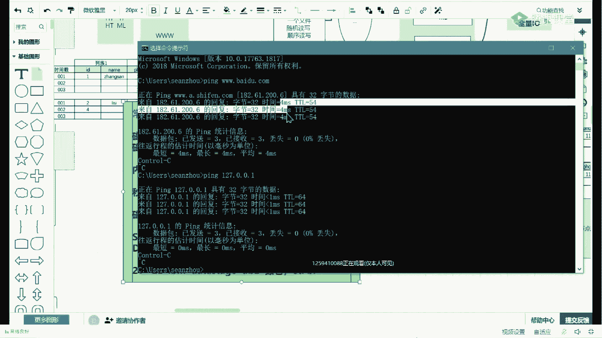
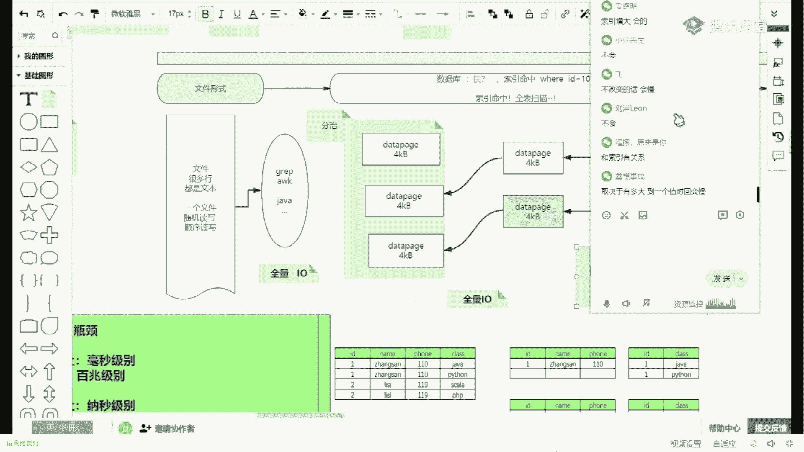

# 马士兵教育MCA架构师课程 - P107：redis、kafka、es、hbase等技术技术选型总结 - 马士兵学堂 - BV1RY4y1Q7DL

乘以100。对吧那好，这个如果能听懂我们延伸到什么地方去啊，做架构的时候，注意听，在你做这种架构，做三高系统的时候。很多人都说三高三高三高。🤧三高的话刚才给出好多词，什么高并发、高性能、高扩展、高可用。

这都不止三个高好多高。但是这里面有一个核心的点。整个架构当中，你最后最后存数据的地方，注意啊，其实无论你是做单体还是做架构，数据，是最终的有价值有意义的东西。数据之外的都其实可以成为函数方法或者是服务。

那些东西其实是一种可以理解为单立的，可以为理解为可云可弹性的。听懂听不懂，不要怕。往这看，如果前面有服务。那这时候其实还有客户端请求。那么到数据库粘数据的时候，像刚才说了，欧N复杂度这个这个成本很高。

那数据库的操作也是会很慢的。我们不应该把什么呀？无效请求打到数据库上。我们不应该把无效的请求，为什么？因为这个数据库一秒钟如果支持100次查询，注意听。100次每秒钟的一个查询。

那这时候如果你把无效的请求的50次传过来了，那么你只能有它还能只能承担50个有效请求。那但是前面你还积压着好几百个有效请求，就被你有效有有效请求被被被拖慢了。

但是这时候如果注意听你用了一个readdies。在ready当中，我们用了这种二进制的这种字节的。这种布能过滤器。那么这个时候其实你再大的请求进来之后，先不透传到DB，而是通过我们的reis布能过滤器。

通过刚才那个焊线函数拿这个这个字节空间这个这个事情做一个比对，把无效请求给它过滤掉。那么这个时候再到达数据库的，就是精准的一定有数据的就可以放过来了。也不是精准的，有有有有有数据的。

就是它会放过一就是因为因为它不能过滤器，说数据库有不一定百分百有，但是说没有是不是一定一一定没有说有，但是这个事儿你得思考是不是呢？但是不能过滤器告诉你这个请求说，数据库里边没有没有是不是一定精准的。

就根据刚才这得出结论，就是过滤无效请求是一定精准的。😡，就一定会把无效请求过滤掉。但是还有一部分请求是不能过滤器hold不住的，因为碰撞成一了。那么这时候说有了，但是这个又里边比如说刚才所所说的。

它只能接受100个请求，那这个时候就会明显降低到什么呀？曾经可能有50个无效的那现在可能变成了4个无效。然后96个有效的。因为布鲁模具说有这事儿碰撞这事儿是一个概率的问题了。所以如何降低这个损耗。

这个误差，其实在这加函数就可以了。函数越多，这个宽度越宽，牺牲的空间再大一点。那么这时候可以降低无效请求的放这个这个这个这个风这个。这个通行率对不对？计算越慢OK有这个想法真的很屌了。

已经你已经你已经知道这种线性增长的这个这个这个事情了。但是线性增长一般要和我后边说的分制挂上钩了，前面这块都能听懂了吧。那么这时候注意听。当你能得出前面这个结论之后，我们随着函数越多，字节空间越来越大。

体积越来越大，计算的函数越多。那么每笔就是它就注意看啊这个位置不容过不容过滤器的增长，它越增长，它会什么呀？让这个的ON请求复杂度就是每一个请求。都会变慢一点。每个请求都会变变慢，这个能听懂出来刷一。

这这都是理论知识啊。其实你没做过，没见没借触过三高系统，没去过BAT这都听懂。就是如果你把一个东西，它本来就一个函数两个函数两调两个函数可以计算完的事情。你让调10个函数调10个函数。然后呢。

本来是可以在这个这个几百几百K变成几十兆几百兆。那这个整体的每一个请求因为做到组时先判断一下，整体的每个人都会变慢，对不对？但是在真正的互联网解决三高的时候，其实最核心的就是后边其实要讲的。

我现在前置了解决这个问题应该怎么解决，尽量的做到是一个什么呀？哎我用一个波龙过滤器两个可不可以。😊，对不对？我用一个服务，两个服务可不可以？我将请求给他分摊分摊，可不可以？对不对？然后做一些规则上去。

比如说做上每种布能步滤器，因为这个其实到这儿，首先这叫分制了。我是不是两个reis里边各包含了，我把它扯扯一半出来。是不是可扯一半出来，把这个帮一撅撅一半出来。但是这个东西是注意听啊，这个东西叫做分制。

😡，跟着我速度走，我现在我现在把你我明确告诉你，我现在把你往坑里带嘛，跟着我的速度走，这是不是要分制了。😡，但是告诉我，我现在这个模型里边存在什么问题，到底真的分支了吗？性能真的降低了吗？

反而还是说反而变高了。😡，回答我。这个过程很自激。😡，能跟着思路吧，就是我本来在re个一个reit里边放了一个布隆路理器，我把它剪剪掉一半，这边放到前半拉，这边放到后半放到后半拉。

那这时候我准备两台服务器，你高并发的话，一部分并发走置，一部分并发走置，能把请求是不是分开了。那这时候理论上看那个图来说的话，是不是请求就这边请求就访问他，这边请求就访问它。这边的请求需要访问它吗？😡。

需要仿他吗？需要还是不需要？😡，Yeah。有需要有不需要需要和不需要取决于另外一个词汇。当你只是做了分而置之，那么其实并不能像你们在网上看的说性能会提升，反而下降。为啥你缺了另外一个至关重要的词汇。

就是路由加索引。就路由啊锁引啊。等等巴拉拉一些词汇。什么意思？如果只做分制的话，其实你把它东西分开了。但是你如果查那边的话，又考虑那边是不是是不是应该在那边，你是不是不知道应该一个请求应该去哪儿去判断。

对不对？😡，你说要把两个分制全部走一遍，是不是还是ON的？😡，还是那个全亮的，而且这次还有两次IO通信了，两次网络连接了，对不对？😡，到这儿能接受同学来刷波一。所以只有分制的话。

往往你这个架构设计的是有问题的。你看你学过的任何的技术，其实都会有一个分制，只是一种结构存把它分开了，隔离了。但是外边都得挂一个什么如索引能够区分。比如说我们确定啊这边不能过滤器里边。

就是那些个商品的ID从0到1万的，这是1001到1001到2万的，你加了这么一个索引了，每一个请求过来之后，我这个东西是在哪个区间里，我只需要连谁。那个东西我绝对不需要碰减少一次请求。😡。

就是每一个请求都不是两边都扫了。那这这个时候才真的可以做到什么呀？分开听同学来敲包666。😡，是吧其实这个思想你慢慢的放大放大放大，可以套在什么秒杀系统啊，红包啊，那什么什么位置都可以套收。

那这个其实想的有点早了。我本来是想顺滑的去引出啊，往下聊，因为聊太多了，收回来啊，这这这块惊验了一下，咱们收回来了。那回到原点上开始这个列表查找的话，那么我们我们来说布伦不离器能符合我这个开始的问题吗。

是不是不符合。因为你在布隆过滤器想使用的时候，还得开辟空间，还得又不精确。最终有一部分请求还得推回到欧N复杂度。所以其实。不对啊，这些回答都是不对的。

都因为都要在现有的一个基础这个数据结构之上再去开辟数据结构，对不对？哎，O收那么怎么办呢？还没有其他的方式注意听啊，下边的跟着我的思路走了，已经已经已经这个这个这个这个露馅了。

已经这个这个这个跟这个这个叫什么剧透了，那我就直接快速讲了。其实如果上边一万个元素是ONO1万很复很复杂的话，那注意跟着个思路走，链太长了，一万个好难，那我可不可以做这么一件事情，跟着我的思路走啊。😊。

场景什么的不容易过滤器给你讲完了，差不多了，你就先跟着我思路往下还有好多知识。那么我的链表如果只有4个宽度，一个链表，两个链表、三个列表、四个列表，5个列表。那要存现1万个元素的话。

我只需要准备2500个列表。到这儿能接受吧？我只需要准备2500个列表，每个列表4个4个宽度，那我就能存现这1万个元素。那这个时候一看这个现象叫什么呀？这是不是就分而制制了，就隔离了，隔离开了。

把数据是不是打散了，四个4个四个这么装成4个桶了。那这个装完之后，请请回答我性能速度有没有提升，就是做了分支之后，速度是否提升。😊，回答有的我告诉你回答有的，你给我站着，你别走。我刚才讲了半天。

尺脖子长了半天。😡，你听什么呢？😡，呵。你如果只是把它们分制分开了，我现在问你一个问题，查找一个X，你要怎么去做，你是不是拿X从第一个链，虽然这长度是4个变量完，你能确定它有吗？

这个机子里边是拍的第二个链，第三个链有可能是最后一个链的，最后一个元素，它依然是1个ON的复杂度。😡，所以只做分置，只做隔离并不能做到一个真正的提速，还缺个什么东西，缺一个路由缩引。路由索引。什么意思？

就像刚才举一个例子一样，如果查找一个元素，只确定其中的某一个链，就像刚才使用这个把布隆科器的拆解的时候，我只需要知道连某一个re用一半的这种布隆，我就不用碰另外一个布隆。那这时候性能是有提升的。

能能能挂上关系吧。所以这时候其实你差的什么？还是差路由所引映射这一类名词代表的这个这个逻辑。那这是怎么怎么实现的？注意看，首先就2万两2500个列，那你是要扭出2500个变量吗？能不能用一个变量持有。

哎，你准备一个数组数度下标这个数组的宽度是2500。那你数组速循环的时候，循环到下标为零的时候，有一个列表，四个元素帮引引上了下标为一的时候，再引一个链，下标为2，再引一个链。

那这时候有一个数组就持有了所有的链。那这时候跟着速度走啊，X你要做一件事情，我哈希。Yeah。哈奇是个应用算法，对不对？嗯，哈奇 code的应用算法得到了一个数值。😊。

这个算法可以帮我得到一个映射的一个数值。这个数值我在哈西这个，然后再取膜膜上2500。就是取余的取余数这个过程。那么取模取余的一个特这个这个计算的特征就是。取完那个结果，那个余数值是什么呀？

是这个你磨的这个数的，从0到2499，就是N减一的这个区间之内的某一个值。比如摩安的纸是三啊，比如摩安纸是一吧，假设X哈西啊99999摩安25001代表什么意思？你就找到了这个数度下标为一。

那就找到这个链映射关系就有了。映射关有了之后，其实你就可以得出一个结论，只要这个链上有就有这个链上没有就没有。这找到了唯一性，可以排除其他的了。分制。如果只质分制还是全ON的，但是加上这个东西。

它就不会是ON的。就像前面讲这个redis不能过滤器一样。所以你会发现真的是我说那个道理，很多基础知识，很多知识点它是通用互通的。感觉找的同学来刷波666。碰撞的碰撞是会在这个链上。

比如说XZW他们三个来了，然后他们的其实结果都就哈希碰撞，那哈希碰撞成一个值，代表他们的模式余数值都都是一样的。那么他们都会在这一个链上。对不对？OK那这个能听懂的话，其实这一个小坑，什么小坑？😊。

开始的时候是这个链都是空的，里面是没有元素的。第一步是存，对不对？存的时候这样存的。比如Z先过来了，嗨取猫是一就放那个链上了。大不来的时候刚巧碰撞了，也是这个链上了。然后这这个下边的元素再来。

那就会造成一个现象，有的链长，有的链短，其实它并不是很均匀，有的长一点，有的短一点，但是即便是这样，这个链儿它的长度也远小于曾经那个O1万ON那个长度。😊，对吧路由数组是怎么存的？其实刚才我解释了。

你只需要准备一个数组，这个数组的宽度是2500，那么它下标的区间就是0到2499。然后呢，便利它的时候用出了2500个链表，列表都是空的，然后呢准备一个算法，注意前面这是一个算法。这个算法准备好之后。

来一个元素，经过算法，找到数组的下标，往这个链上去append或者去set去装装装装装。那随着这个所有元素，1万个元素过一遍之后，有的在这个链上装了，有有的有的在这个链上。

那最终其实就趋向于把数据散列开了。但是其实未来查找的时候，只要再经过这个算法，就可以确定某一条链而排除其他的链。这才叫什么呀？真正的分值的处理的方式。对吧这个时候它叫什么？其实它叫个哈西table。

或者你们知道哈西迈ap可以这样去理解吧。但这是一个小细节啊，有一个小细节，就是哈西map。😊，它里边的K的数，这个这个K是不是去虫的？对不对？然后他是建的都是K value的value支撑n。

其实就只剩个K了。K是去虫的那这时候得到了一个什么呀？是不是得到了哈西赛。😡，这种思路走啊，哈西麦它是KV的。然后如果把vio value全都制成那只存K在这个这个这个这个这个就这个这个集合里边。

那这时候其实它的就得到一个结果，就是哈西赛集合集合是去虫的，对不对？那其实有人说了，那1万个元素里边，比如说如果重复元素，那这个结果是不是存不进去了，其实关键的点是什么呀？

找哈这个路由找到某一条链的时候，你是如何向这个链上去放这个放法可以append追加也可以什么呀？put进去。在put的时候加上一个判断。如果存在了，就forget它。他是不会去相互追加的。

只有这种追加行为的时候，哎，有一个Z出现了，一会儿又来了一个Z，肯定还在这个链上。那Z可能追到追到后边去了。完了你要提取的时候，就把它提取出来，到这儿能听出来刷波6。

就这个结构有很能小细节一调就得得到不同的结果。😊，对吧？OK收其实转了这么大一大圈儿，随便咱们随便聊，然后呢梳理你可能知道的一些个知识点，别人问的问题，然后呢，我就给他回答了，咱们互动一下。

其实你被动的去学学习接收一下。然后呢也给你展示了，其实最最最核心心得出这个结论来分制。🤧是要做的是隔离这件事情。然后但是光有分制是不行的，他必须要路由速映射这一类你可能听过的词。比如数据库里边有索引。

比如像我们的依赖设置里边会有路由。像数据库里边，其实它是数据也是分制的。像一来设置也是分制也是分制，对不对？哎，像映射的话，你比如说我们对数据做了区间的映射，做AKO划分等等的。

其实你会听到很多这样的思维，其实他们合在一起才是一个基础理论。这个理论很重要，很值钱，把它记住。好吧，那接下来向下延伸，我们从一些其他的技术站去感悟这个过程。这个过程这么讲可以吧，能接受吧。喝水。

Okay。Yeah。🤧再往下捋。再往下捋。那么接下来我会用一系列的技术。推院的一个过程。这个技术什么东西？以以一类技术啊，注意听一类技术。以前你可能学知识点的时候是垂直学的，今儿学了一个readdis。

人学了一个数据库，后学了一个蓝色者，大会又学了一个Hb。那那天我学了HTHTFS。那你是垂直学的，然后你很少有的时候把它们横向关联起来，他们之间有什么特点特征。为什么前后我这个技术的出现，对不对？

那这节课我是按照横向知识点，找到他们像刚才找这个内聚的这个这个支识点一样给你穿起来。所以接下来好好听。Okay。存储注意心啊，存储我们计算机存数据的话，其实。存储加查找这个事情有很多种技术方案。

要么存在文件里边，用代码的方式，要么用数据库，要么用redice，要么用Hb等等。还有很多像卡法其实都可以做存储层，像流式的数仓等等的，实时数仓，用卡法也可以实现。有很多技术都是它是天生就可以存数据的。

但是我们先按照这个时间轴的发展，先砍掉后后续的技术回到远古时代。比如说只有文件，那文件如何存数据，注意跟着思路走完啊，你是不是可以在文件里边用换行符的方式？然后把刚才那1万个元素。

是不是就是一行存一个元素，一行存一个元素，用换行符涂这个存进去，它能存能不能查找也能查找，随便用门语言或者是一个命令。然后呢读取这个文件，读出一行比较一下，读出一行比较一下，最终也可以达到查找。

这个都能听懂吧。很简单的一个事儿。但是在这儿有一个前置的一个一个基础知识，一个常识要给大家灌输一下，这也是你学到架构的时候。要就是你在扩展学技术站的时候，必须要向这个维度去想。即便学大数据的时候。

这是一个核心。这个常识什么东西？就是计算机存数据可以存到哪儿？有两个位置可以存，一个是在磁盘当中可以存数据，一个是放到内存。但是大家都知道放到内存，一条电数据丢了，对不对？

但是其实也会出现一些内存技术的这种存储。那为什么？因为它们的性能不一样，如果存在磁盘上，数据存进去了，我要把它找出来，注意听，我要把它找出来。那么磁盘的寻址时间是毫秒级别。内存的循址之间是纳秒级别。

磁盘归属于IO系统IO设备。那网卡也是IO设备。其实网卡磁盘它们速度损耗是差不多的，只有内存是很快是纳秒级别，它们之间的差距有多少？将近10万倍，秒的1000分之1是毫秒毫秒的1000分之1是微秒。

微秒的10分之1才是纳秒。他们将近有10万倍的一个差距。在这可以举一个例子。特别特别明显。来看啊，如果我信。3W点儿百度点儿COM。拼百度百度肯定没在咱们公司，那一定我拼百度这件事情。

这个数据包从我的网卡物理网卡发出去，发到百度又回来了，给了一个时间是4毫秒，看到吧？是4毫秒。但是同样是这个聘啊同样是这一个行为聘。我拼另外一个东西。😡，或者聘用local house的。

注意看它的时间路长是不是小于1毫秒。都是病，为什么时间差异这么大？😡，为什么呀？因为拼百度的时候走网卡网卡和磁盘一样是IO设备，但是P1270。0。1或者local house这种这种回环接口。

这个地址所在那个网卡，它是一个虚拟网卡是内核是操作系统，在内存里给你虚构出来的，它并不是一个物理的一个设备，一块网卡，是内存里的，所以内存里的操作的速度要远大于什么呀？物理IO上的这个速度。

这是一个明显的一个结论，到这儿有感受的同学来敲一，这是常识。第一个维度寻址时间是差了很多，所以你大胆思考。如果未来你开发程序的时候，尤其在数据量特别大的时候，你如果想追求速度的话，先不考虑其他的维度。

那一定是放在内存里，而不能放在磁盘或者网络当中。

对吧就是你有有的学大数据的时候也听说过尽量本地化，哎，咱们不走网卡，就走本地磁盘就可以了。而是尽量什么？在内存里边做缓存层。那这样的话，速度，你的大数据计算分布计算速度很快。

也是因为这这一点就是整个计算机的瓶颈，就在IO设备上，在磁盘上，这是第一个维度。还有一个维度被大大家忽略的就是带宽和吞吐。磁盘如果一秒钟想从磁盘里边读点东西出来的话，那么它有一个上限。

不同的硬件接口不一样，有百兆级别的，有GB级别的23G34G或者6个G顶天了。它有个吞吐。如果恰巧你的程序需要读取100个G的数据，一秒钟只能读出一个G。那你这个程序碰了一个数据的时候。

就一定是最最最最低是100秒才能过完那批数据。😊，能懂什么意思吧？所以硬件，尤其IO设备，它的这两个指标真的是最终体验到你程序的跑的这个快慢了，也决定了一个决策的事情。好吧，这个能听懂之后。

把它听懂之后啊，来回到这个问题，往后延延延续延伸啊。当你使用文件的时候，一般会得出这么一个结论。随着文件体积从几K几十K变成几兆几十兆几G几十G。那么也是这样，一行存一个元素。

那么这个时候它会随着文件越大。查询的速度越慢，请问为什么？嗯。其实我直接跟你说了，就都最起忘忘了删这个已已已已已经穿帮了，因为触发了一个全量IO的过程，能听懂这意思吧？因为它是全量IO的过程。

为什么注意这是两个词儿？😡，我都说了，IO什么，就就两个词儿，一个是选量，一个叫做IOIO这边已经说我平静了，速度一定会慢。你10个G的话，每秒钟一个G，这最少得10秒。而且它是不是10秒。

还取决于是不是全量操作。因为如果这个文件做了某种分制行为了的话，其实你可以跳过一些数据的话，那这时候他就不需要读全全部。😡，跳过前面跳过前面9个G，直接去最后一个G，那它就一秒就可以完成了。

所以你一定说它的慢是因为没有办法，因为这个存储结构像什么呀？像上面哪种存储结构，是不是像我的这种单项链表，一个元素排在一个元素后边，它没有做所谓的分制和路由索引。😡，所以他就一定会触发全量L。

所以它随着文件越大，速度越慢，听不出来敲6。这是文件，这么单一文件的形式，必然存在的一个一个特点。哎，那OK了。那这个数据我想查快点怎么办？😡，长的快是怎么办？那么我们跳过自己想解决方案。

我们直接去学习另外一个解释另外一个解决方案。那比如说来到数据库啊，注意听来到数据库，首先问几个问题啊，一定要跟我互动问题。你这样咱们学的还还有还有还还有还有劲儿啊。同样一批数据放到文件里边。😡。

和把这个数据放到数据库里边，谁更快一些？查询的话，你们告诉我答案，同样一批数据我放到文件里和放到数据库里，谁的查询更快？😡，疯狂的刷数据库，疯狂的刷数据库啊。😡，文文件还需要读取。

那数据库好像是是这这就是凌空的一样。哟哎我这么一说，一一吓唬你还一样快了，你根本没有原则，你们。😡，还有如文件块的。😀呵。😊，好，这就是你看啊这这个过程很重要啊。

就是突然因为这个问题是不是从来没有人问过你？我这么问你了，你没有给出一个我我满意的答案。那因为什么？因为你在学习知识的时候，没有成体系，没有考虑过what外好，为什么这点很重要，很多人面试面不好。

就是因为你没有做横向的学习知识，这点认可吧？😡，都是LO应该一样快啊。那我上面讲这堆东西有有毛意义吗？这个东西是很值钱的，对不对？跟着思路走啊，最终有两个结果，它有可能速度一样，有可能快是未知的。

就取决于什么呀？有没有所引命众这件事情，对不对？但是先这种思路走。数据库我讲一个粗略的一个理解啊。数据库是怎么保存数据是怎么查找数据的？数据库里边注意听，在存储数据的时候，它和单文件有一定有一定差异。

它有一个概念，就是小格子的概念。😡，这个小格子比如说都是叫这个有的有的技术管的叫dta配，有的叫做这个t，有的叫block这个数据页呀、格子呀，然后槽位啊等等不同不同的叫法，这个叫法不用统一。

你只需要知道它是一个一个小格子就可以了。它的大小可以是4K8K106K32K64K或者大数据里边的64兆、18兆，512兆。明了吧？就反正一堆堆小格子，它有一堆的小格子组成。那这时候注意听。

曾经的数据是放到一个大格子里边的，一个问题是大格子。现在把这批数据啊扔到很多小格子里边去了，给它散开了。那这明眼一看是一个什么东西啊，它就做了一个分制了。那数据库是通过这个分制查找而快的吗？是还是不是？

😡，Yeah。Okay。又有答势又答不势的。我前面铺垫那么多，你们再去想什么？这个知识点注意听，注意听，一定应用到你未来学东西。假设现在是第一次学数据库，这个知识点就开始条件反射往里去想啊。

要完你去想啊。😡，分制了，你只是做分制，是不是差另外一个词，路有索引，在没有路由索引的时候，它能快吗？它是不是依然是一个全代O的过程？😡，为什么你把它分开了之后，如果查想查询某一个东西的话。

是不是打开第一个格子走走了走了IO了，没找到打开第二个格子，走了IO没找到。第三个格子走了IO没找到。最大的复杂情况就是最后一个格子最后一行。那其实它还是一个全表扫描的过程。

它和文件的一个速度是一样慢的。😡，对吧那这句话其实鉴今你经得出结论了。如果使用数据库的时候，没有锁引。😡，没有索引的情况下，或者是如果触发了选表扫描，就对着整张表扫描的话。

其实它和单文件存储这个数字是差不多的。这点任何同来刷波666，你只有分制，其实不能达到提速。那真正提速怎么提速的，注意听。😡，加缩引。什么叫缩引？索引的话，比如说表里边这一行有100个列。

宽度是不是很宽，每个列四个字节的话，还400个字节呢？什么叫缩引？你比如说对里边身份证这一列做了索引了。身份证，比如就假设假设身份证就四个字节。那其实把这个身份证号是不是拿出来放到这个再准备dta配置。

把这个身份证号放进去了，并且告诉他是来自于哪个data配置，这个身份证号来自哪哪哪个哪个小格子。那这样的话，每一行其实就垂直切割了一小粒数据放放进来了，并补了一小溜什么呀，他们在哪个格子里。

你就想这就是所谓的索引。那注意听数据是数据，索引也是数据，索引也消耗空间，但是索引的体积远小于数据的体积。😊，这点认可吧？索引的体系远小于数据体。如果索引有两阶段发展的话，就现在这种傻瓜式的索引。

就来这数据，我就把它这个除了把他这存下，把那个身份证号拿出来，搁这把格子也放这儿质要好了。那这时候存完之后，这次再查找怎么查找的，速度会提升吗？是不是查的时候，第一要要怎么查找。

是不是你要查的东西过来之后，我先从第一个索引格子里边看看。如果这个时候注意听啊，你必须在这个写字口的时候给出什么呀？😡，这个你的那个所有那个列那个列的那个那个名称，以及你要查那个身份证号。

要给出这个东西，然后呢，他才能触发索引，拿着那个你要查那个身份证号，然后在所有里边第一个格子里找，哎，没没找到第二格子，第三个格子，第四个格子，那最大复杂度是什么呀？是对着索引走了一个全量的IO。

把所有的格子全部穿了一遍。它最后一行找到了命中了，并且知道是在哪个数据的格子里了。😊，能听懂什么意思吧？找到数据格子之后，是不是数据里边只需要碰一个格子，也就是全量的索引格子加上一个数据格子。

就可以找到你要找的东西。而且前提是索引命中。中要给出索引条件，命中了就会走这个。而且我得出一个结论，所谓的体积远小于数据的体积。那么这个速度一定会比你做全量数据遍利要快。😡，对吧索引比喻有序，那是后话。

到这儿能能能能听懂吧？这是不这是不是就是一个提速的过程了，对不对？这是最low一种索引的方式啊，就这样也可以了。😡，对不对？你只需要做索引的全量，那索引题永远小于它码，速度肯定比你之前做这个过程。

那这是不是缩这个简单索引。但是这个索引的过程又翻一个词汇，注意啊，作为程序员。😡，你只要知道某一个技术是全链IO的，有问题。这东西肯定能优化。如果在你做架构设计的时候，他需要扫描所有的东西才能得出结论。

或者做所有的操作，这东西一定能拆解。那比如说在索引上再做二级索引，比如我对索引做有序维护，用某种数据结构，对不对？比如B加术。对不对？毕加树树干体积更小了，所有的缩影了。

所引的这个这个这个这个这个东西它体积更小了。😡，是不是一层比一层体积更小。那这个东西假设能放到内存里去了。那这时候再查找怎么查找，从内存纳种级别快速定位到了某一个分支，分支就指向了某一个索引页。

索引页取出来之后，8G一判断直接取出数据页。那这时候你的索引那块数据还是全量吗？是不是就不是全量LO了。那么整个数据库是不是可以规避全量O这件事情？😡，到这儿能听懂的同学来刷波一。

在这不深不太深入追究某一厂商的，你这个围绕的就是一个核心概念，你找到的是他们水平走的这个这个特点。😡，Yeah。好，那你这个能听懂了之后，然后一般还会伴随着一道问题。那，这先说啊，就是所有民众才会快。

全面扫描的话依然是慢的这是一个结论。那再来一个问题，这个问题是如果。也不是我就是是不是随着表的体积越来越大。那么查这个这个速度。会变慢，跟着速度啊，随着表的体积越来越大，比如说达到了1050万哈。

然后呢10个G，那么这时候就开始变慢了。会不会变慢？有人说会有人说是的，有人说不会再来一个叫许峰峰说为啥我听了半天，感觉什么东西没有学会，是这个这这个是这个意思吗？注意听啊。

这节课咱们一个公业课就两个小时，我能教你的是什么东西，梳理的是一个学习方法，横向总结的一个过程。找到的是脉络。因为如果这个这个东西我不给你讲的话，你未来也能找到感觉。

但是你要拿你的时间去拿你的时间去换这件事情。😡，能懂我什么意思吧？你要拿你的时间，拿你未来工作了好多年，用过的工作更多之后，可能遇到一个面试题的时候，才能想到这个这个问题。

这节课是从这个维度去解决根本的一个问题，也是改变什么本质。😊。

