# 马士兵教育MCA架构师课程 - P10：mca3.0更新升级！全新内容，全新教学模式 - 马士兵学堂 - BV1RY4y1Q7DL

听我说，你听完这一遍是对整个java课程体系的梳理，你可以梳理一下你什么地方还有欠缺的，听明白了吧，梳理完你就知道你以后的学习方向，奔哪个方向去，整个mc后端的架构师。

我大概是用分大厂级别的方式来给大家设计的，整个课程体系大概会分成四个大的方向，第一个是关于技术的，第二是关于项目的，第三个是关于面试的，第四个是关于进阶的，我们先来聊关于技术的，关于技术这块儿。

我首先给大家聊的是p6 级别的技术，这个技术呢是集中在操作和落地上，这是大多数人目前努努力就可以到达的水平，阿里的p6 大概是30万~70万年薪，你可以对应一下你现在的薪水呃，为了由于这是一个进阶的课。

当然如果你今天愿意找老师来报名，我送你一个入门的课，好吧，今晚送送十个，就是你现在觉得水平还比较差，没关系，在进阶课之前，我们还有一门专门入门课，我送给你从零基础开始的，所以呢在进阶课里面。

首先会给大家来聊前置知识，常用的工具，jdk的特性，mysql的基础，s s m的核心，spring boot的应用，java ee的项目，在这个基础之上开始正式进入p6 的内容。

p6 内容大概分成底层基础，这块比较重要，主要是操作系统，计算机组成原理，在马老师这堂课里面组成了一门课，java成员应该掌握的底层知识，io和网络计算机网络，linux系统，算法与数据结构。

这是我们的底层基础，正常的一个二本左右的计算机系要学的内容，在这个之后非常重要的并发编程的内容，今天我讲的很多内容是jz于这门课，然后是rpc的通信框架原理，为什么要讲这个分布式必用。

接下来是消息中间件的应用和原理，这个比较重要，消息中间件目前用的最多的，原来讲叫四大消息中间件，active rabbit，rocket，卡夫卡，但是active已经基本没人用了。

rabbit用的越来越少，现在用的最多的有两个，一个叫rocket，一个叫卡夫卡，大概都讲到源码级别，那么后起之秀有可能流行起来的新型叫power，所以这是我们的消息中间件，然后叫做缓存中间件。

这里面最流行的叫redis，这是面试的重中之重，重灾区中的重灾区，redis搞定架构师成了一半，作为一个java架构师，有两大工具你是必不可少，一个叫redis，另外一个叫什么呀，叫engines。

这两个弄完你架构师就成了一半了，听懂了吧，所以架构师没那么难，但是呢这两门课都不太都不太容易，他们的源码都是c写的啊，我们抠会抠到它的源码，但是你你你得你得做好这样的心理准备啊。

嗯因为我们面向的阿里的p6 ，35万~70万年薪也不是很容易能达到，接下来呢是软件设计的基础，这里面主要讲u m l设计模式啊，软件工程的发展史，中小系统的开发，软件工程常用的文档的案例。

这些呢主要是你项目组工作的时候，遇见这些东西不要觉得生疏，然后是分布式的架构实践，这里面的内容就会相对多一些，现在最流行的是分布式，主要是包括高频和高可用，通信和调用rpc thrift。

ninety double缓存的中间件，就是我们的redis存储的中间件，这就比较多了，大概有这么多个啊，fedf s h d f s h base mongotdb。

neil for the influence db，ocean base click house啊，皮皮诺德peanut呃，这些红色的呢是小众一些，但是有流行的可能性，这是存储中间件，那么关于分布式锁。

各种各样的分布式锁的实现是etc d的锁，db的锁，还是手写的，还是场景方案和选择，分布式事物，到底是two pic，three pc tcc saga，还是柔性事物，分布式的链路追踪。

这个呢最主要是skywalking，这用的是比较多的啊，zip in用的稍微少一些，分布式的预警监控，这里头最多的用的最多的，最流行的叫普罗米修斯给大家讲这个课的呢，就是咱们字节亲自落地。

普罗字节定制版，普罗米修斯的老师很牛逼很牛逼，一个课就把你分布式预警监控，就给你搞到位了啊，分布式的权限控制，这个主要涉及到jw t o r s二点，spring security和shero呃。

新手的老师也是原来京东他们内部怎么落地，怎么实现的，都是这么讲，分布式的id密等分布式的任务，分布式的绘画，这个大概是分布式的专题，那么在分布式专题的基础之上呢，我们要聊服务，微服务架构，微服务。

你了解了分布式在聊微服务就方便多了，那么这时候呢就是配置中心注册与发现，网关与路由，当然内容也会比较多，因为这里面主要涉及到两个大小，一个是spring cloud奈飞。

一个是spring cloud阿里巴巴，那么阿里巴巴呢，是在奈飞的基础之上发展起来的，这两个呢有可能会混着用，目前呢我们主要通过两个项目来给大家讲清楚，什么是奈飞，什么是阿里巴巴。

分别是网约车的第三版和第四版，讲完分布式，讲完微服务，下面要进行系统的性能优化，主要分成四个大的层面，jvm调优，今天呢我也大概给大家讲清楚了啊，它是什么，长什么样，但这里面内容也会比较多。

因为它有十种，到目前为止是有十种垃圾回收器，不同的垃圾回收器用不同的调节方式，mysql性能优化，tom cat性能优化，nginx的性能优化，高并发大流量的服务调优的实战好吧，这是系统的性能优化。

想多要钱，我所有标红的东西，那么这是面试的重灾区，也是展现你水平的时候，好除了这个之外，我们讲数据的处理，主要讲海量数据的存储，搜索和处理，处理呢主要有批处理和实时处理，现在最多的实际上叫湖仓一体。

这只能慢慢学吧，你先从最基本的批处理开始好，湖仓一体批流一体啊，二合一的处理，那么在这个基础之上呢，我们讲基本的运维知识呃，你作为一个架构师，要懂一点基本的运维，比如说多机房的问题。

比如说自动摘除的发现，比如说d n s相关的，比如c d n相关的，这些东西呢都是跟你的优化有关系，就是你搞高并发大数据量，在很大程度上是离不了这部分知识的，在这个的基础之上。

我们再来聊deos dv o p s，我这是没什么可说的，这是这是现代的，只要你跟跟跟紧我们的开发的流行趋势的话呢，应该都会有，我们作为一个小公司，我们研发部目前为止，大概有30位左右的研发人员。

他们呢为大家研发了大概是我们的网站。

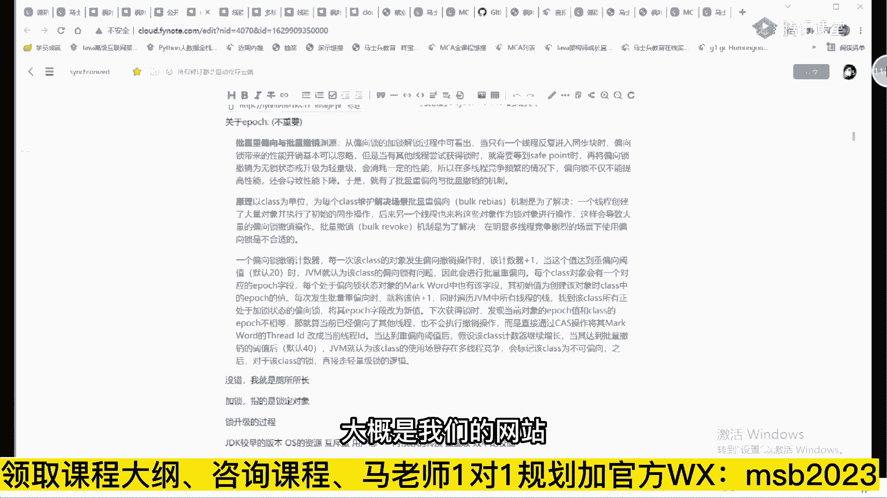

我们的app啊，我网站大家看到了，也包括我们的直播，我们的录播系统都是他们来研发的，然后研发了呢我们的笔记软件。

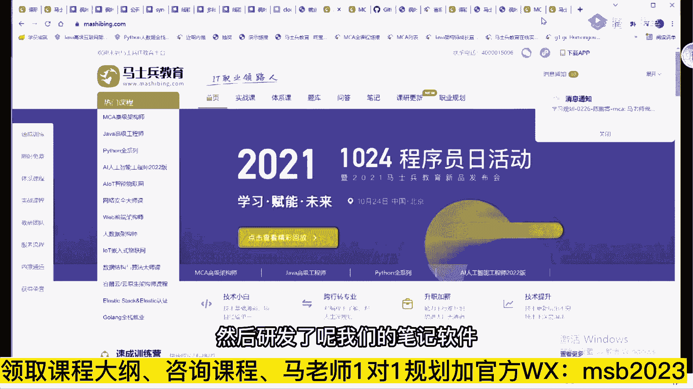

就是这个风叶云笔记，大家也可以拿来用啊，欢迎大家用，这个挺好用的，你们用用就知道了，比如我给你举个例子啊，我我我我现在的枫叶云笔记，我给大家分享的，这不是我给大家分享的这个内容吗。

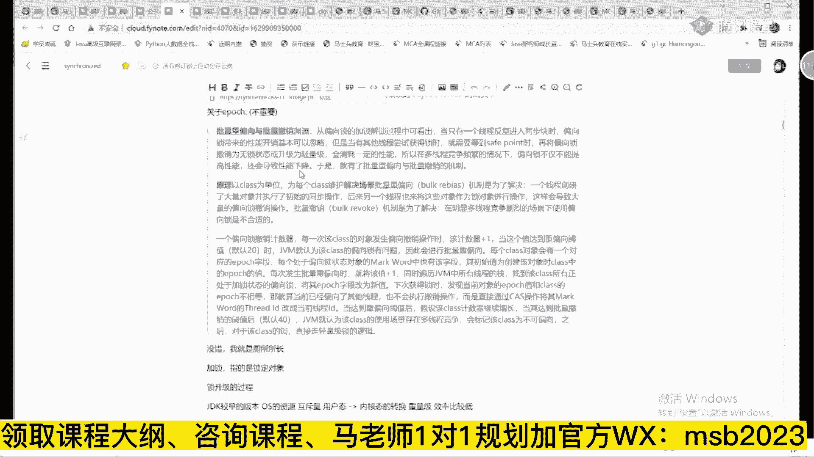

就是我一键就可以给大家分享出去，你就可以拿来用了。

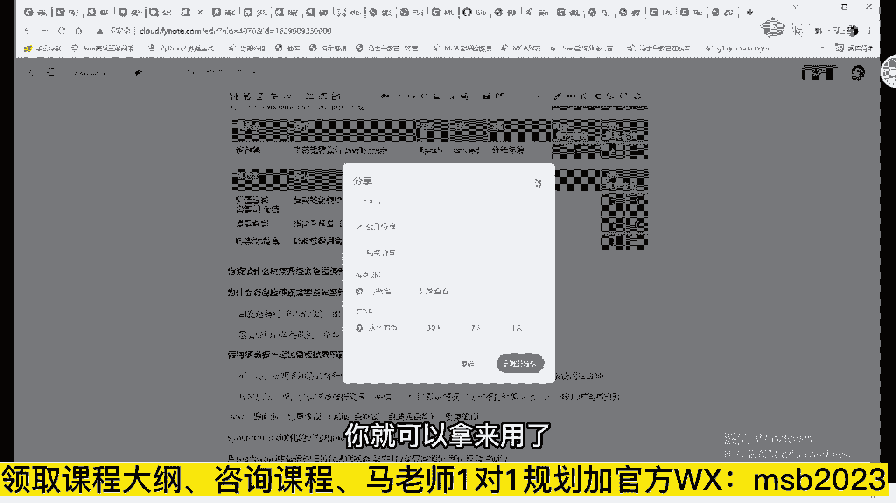

然后我里面呢还可以，比方说我想给大家做讲解的话，我还可以插图，我可以插入一个画图，这个是很多笔记软件都没有的好吧，网易云差不多，网易云差得多了，我们在那个专业支持it上比网易云做的要好。

因为他需要漏的一些东西稍微有点慢，所以大家稍等一下就就可以了，就是我可以在做md笔记的时候，直接插入我们的画图，有点有点太慢了啊，演示一下吧，就是你那个自己可以进行相关的画图啊，反正这方面还得优化。

它确实前端这块挺耗资源的啊，loading嗯正在漏的嗯，这是咱们的那个画图呃，你比如说啊我给你举个例子，就是你如果想做笔记的时候这样来做呃，我截了一段代码是吧，然后我把这个代码贴这好，把代码贴这之后呢。

你就可以用随便拿一个画笔取个颜色，红色，我就可以在这做标记啊，这段代码是长这样，为什么这段代码长这样，为什么，ok然后呢，你可以把这个东西直接插入到我们的md里面。

就是插入到我们的那个那个markdown里面，这个有bug也正常啊，如果说没有bug，这么大一个软件也也不太正常，大家多用免费好吧，当然我们现在所有老师都会有啊，你大家知道吗。

我们现在整个研发部devops k，实际当中我们在实践的，我们现在整个研发部我跟你说，阿里云就是基于云的开发，基于divers的开发，运维一体化，非常好用，比腾讯笔记好用吗，我只能说在代码这方面。

我们还没有找到比我们更好用的，听懂了吧，好所以这块的知识呢你一定要学啊，这是能够切实提升你开发效率的啊，我们研发人员试过引入divers的整个流程之后，它的研发的效率确实是有大幅度提升的，呃软件测试。

这个呢主要是基于架构师的角度考虑，你需要了解一些测试的知识，所以在这里呢赠送大家一期软件测试，然后呢是service mesh，service mesh叫做第二代的微服务，这是下一代微服务的。

关键是基于云原生的微服务，很多地可能还不知道这是什么东西呢，没有关系，马老师这里已经教你怎么落地了，我们网约车的第五版用的就是service mesh，好了，这是p6 的内容，在我讲到这里。

我估计有同学该叫唤了老师，这么多，我什么时候才能学完呀，有这个疑问的同学听我说，it技术永远在发展，你从一岁，你从六岁开始学，学到20多岁知识，你曾经学完过吗，不要想着把它学完。

而想着在其中找你最需要的知识，跳槽涨薪之后再来整体搞定，我们的学生曾经测算过，大概用业余的时间来学习，把整个大纲学完，差不多需要1年左右时间听懂了吧，但是在绝大多数情况下呢，我不需要你学完。

我只需要你按照我们的路线学，那录这个路线长什么样子呢，其实这个路线呀就是老师来帮你做定制的啊。

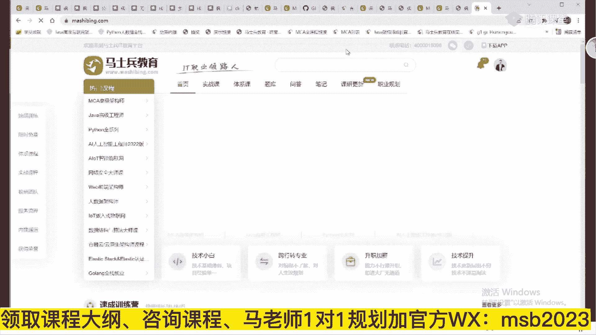

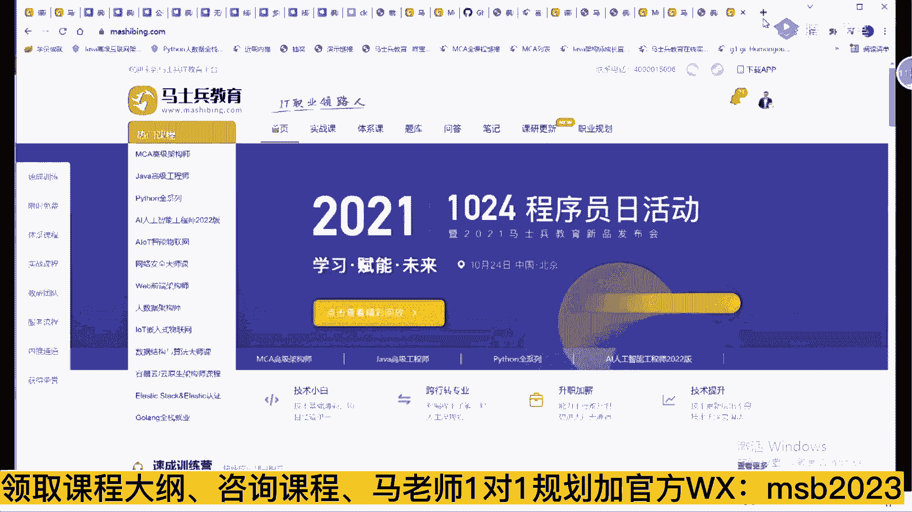

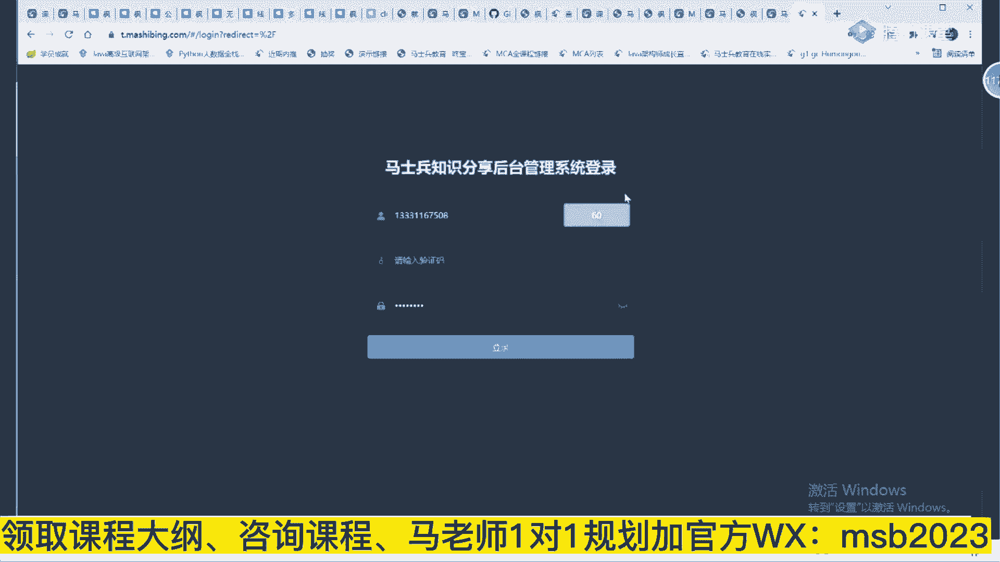

这个我得我得把我的那个手机号引去啊，嗯这个路线的定制是什么意思，稍微给大家做一点小小的演示。

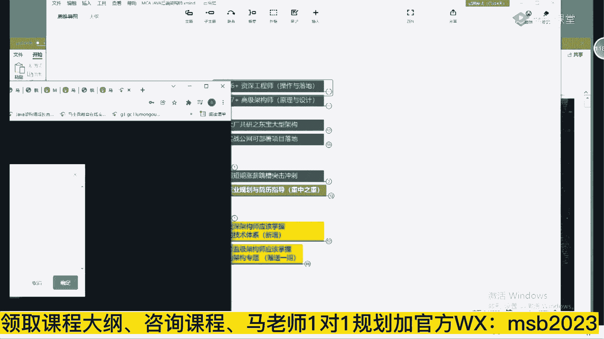

卧槽这现在需要让我改密码，哎呀算了，我没我没法给大家演示了啊。

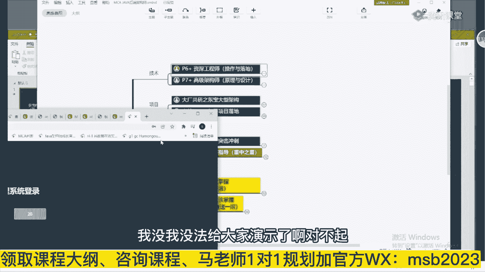

对不起，主要是我们我们刚才登录了一下。

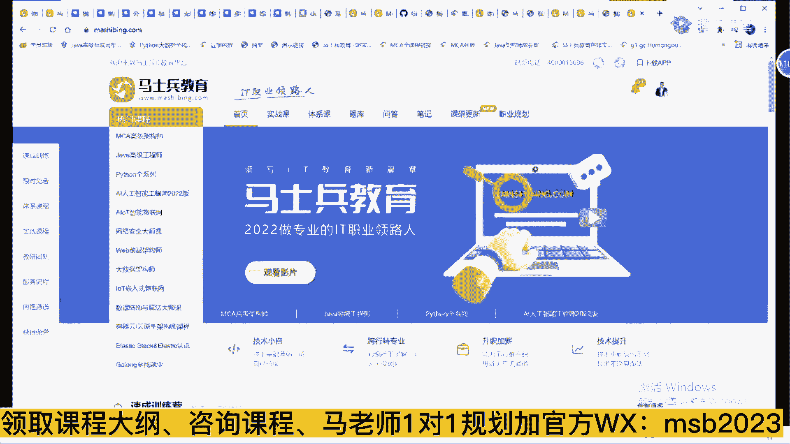

需要需要改密码啊，嗯我看看能不能给大家大概交代清楚。

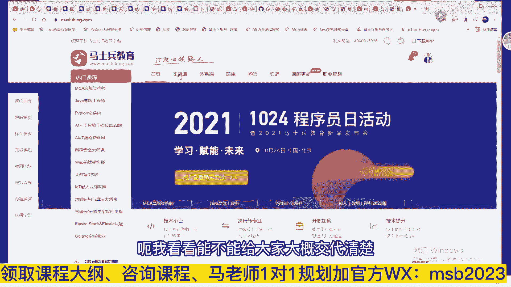

是定制化路线长什么样子啊，啊大家从这里可以大概的演示能看到，比如说啊给你举个例子，张宝骏的学习路线，我们打开来看看，就是说这个学校是一个零基础的学员，简单接触过，没有系统深入学习，所以他应该怎么学。

首先先学习先导部分，在学习初阶再学jdbc，再学何嘉元什么，再学到这儿再学这m调优好，大概呢你给你个路线，你简单跟着学就可以了，点开直接跟着学好吧，我们来这两个人，呃不是让你全学完，这个大家能理解了吗。

能理解的给老师扣个一来，我觉得这是我们的一个亮点啊，我非常喜欢这个功能，怎么说呢，就是这个功能呢，让咱们同学们的学习效率变得无比的高，就你不用你走弯路啊，不用你非得a b c d e这么堆着走。

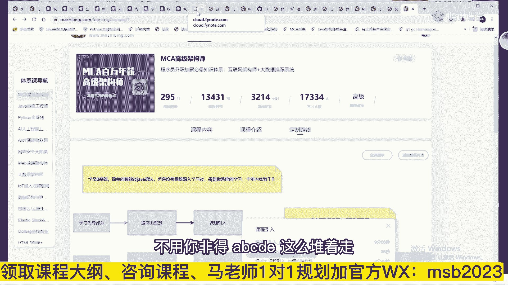

没有这个必要呃，大概在这种情况下呢，最长的最长的基本学个半年左右啊，你看你看像这种的学个两周涨5000的，怎么来的，你不可能把所有课全学完再去找心结，对不对，没有这个必要啊，但是完全你可以做到什么呢。

短期涨完薪，长期继续跟着学，第二次再涨薪，然后由于我们每年都在更新，大家看到了，这是我们的更新的内容，这是我们更新的内容，科研更新，你都能看得到啊，这是我们d d d的内容好，由于我们每次都在更新。

你年年跟着雪年年涨薪，它不香吗，你为什么要想着学完它呢，这块大家能听懂了吧，o内容我是追求整个课程体系要给全，我不太想给大家一点简单的体系，所以整个课时已经讲完了3000多个小时，没有讲完，正在直播的。

每周都有，我知道在整个市场上有很多比较短课时的，300多个都算多的呃，但我觉得我们讲一个东西要讲细讲透，讲到位，时间不够是不可能能达到这种效果的，举个最简单的例子，我们讲源码课。

拿连老师的源码课来举例子，源码，这是林老师讲的源码课，大概一共有277节，整体的时长我记得是80多个小时嗯，我知道有好，市面上有好多讲那个spring源码的课，但是大多数六七个小时搞定。

梁老师呢大概用了80多个小时给大家讲，清楚了spring的源码课的所有的内容，讲完之后的效果长什么样呢，你可能只用听这一个源码课，大概就能达到p7 级别的内容，这个不夸张，我，首先看。

这小伙spring源码面试直接通过蚂蚁金服，这是他的原画，第三面的时候，和面试官扯了一个多小时的spring源码，面试官怎么说，理解的很不错，很少见到对spring源码理解这么深的，然后就给过了p7 。

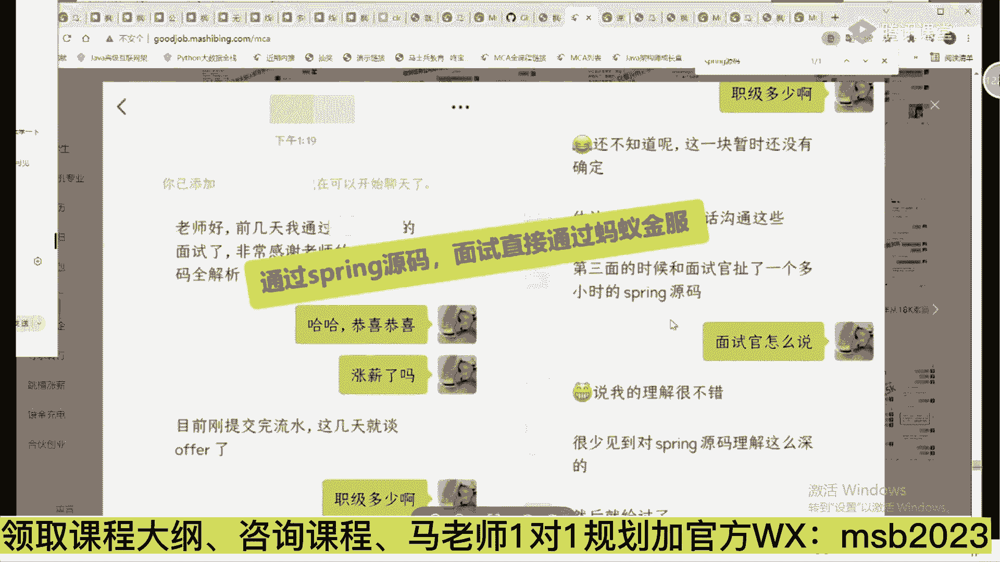

呃一门课我觉得就是说体现我们的态度，就是把它讲精了，讲深了，而不是囫囵吞枣的带大家过一遍好吧，所以这是为什么课时比较多的原因，讲得深，讲得多，讲得全，然后用定制化的方案来帮你做到效果最好好了。

这是p6 ，再说一遍，不需要你学完，也没必要听老师的，走捷径，不走弯路，然后接下来是p7 的内容，p7 呢就到架构师这个级别了，这时候主攻的是原理和设计，会涉及到理论基础，会涉及到分布式的算法。

会涉及到框架的原理和源码的剖析，刚才大家看到的spring的源码就属于这部分，在这个基础之上，还有tom cat源码，还有mq的源码，net的源码，lk的源码等等，呃读源码的话呢，多数读一篇就可以了。

没有必要说所有篇全读，除非你时间非常的充裕，在这个基础之上，高性能的架构设计理论，这个内容就比较多了，高性能架构怎么做，分流设计怎么做，并行并发怎么做，缓存怎么设计，存储怎么设计，可靠性怎么设计。

应用保护怎么设计，这个课程来自于阿里的实战，很多年的老师为大家做分享，了解理论之后，要了解实战，了解案例，所以在这里头再设计不同的情况下，不同的案例情况下做，应该做出什么样的设计，不同的专题抢红包。

红包与微博互关，12306，b站弹幕等等，应该做出什么样的设计，才能做到高并发，高可用亿级流量，多级缓存的专题设计又该怎么做，那么这部分内容大概能够支撑你很高，很高的一个薪水，举个小例子。

昨天我举过这个哥们儿，90万年薪干进腾讯，腾讯的面试就是案例架构设计，好了，我觉得呢大体的技术内容就讲完了，你们呢自学跟老师学都可以，把这个按把这个把这个呃咱们的大纲拿走，对照着学好吧，不走弯路啊。

当然好多人学了技术之后，尤其是一些没有项目经验的，我简历上没项目可写怎么办，没关系，东宝商城的大型架构，这个是完全模拟了淘宝京东他们的技术实现，我们的顾问就是来自于京东呃，会牵扯到方方面面的架构。

前端架构，后端架构，后端架构是核心，注册中心，配置中心，网关服务调用，限流认证，授权链路追踪数据同步，全文检索词等等等等，把这些综合起来完成一个项目大数据的架构，做数据推荐，ai的数据分析。

做推荐云原生的架构直接部署在云上，这个项目的第一版，目前在网上应该是直接能访问的，现在在讲的应该是第二版啊，那我们应该是在更新第二版了啊，shopping的这我得问一下研发部啊，应该是在更新第二版啊。

我问一下网址在嗯，需要等你白皮书就可以了啊，就是白皮书上写的也非常的清楚，那么这些架构长什么样，目前呢我们是部署在了华为云上面，与此同时呢，我们跟华为云是合作关系，大家伙想用华为云的内容免费。

咱们的学员用华为云做实验，免费听，明白了吧，然后还有其他的可以写在项目里的各种项目，网约车推荐流失平台，单体版，网游服务器等等等等，我在这就不一一展开了，好吧，这怎么可能链接第一版，第二版都有啊。

过去听就可以了，呃怎么说呢，我们今年呢还将落地四个项目，就是每个季度一个，你不用担心没有项目可写，马老师，这里呢你简历上没项目找咱们就可以了，好面试相关，昨天我也大概介绍过，主要是我们短期的冲刺。

当我讲完昨天短期冲刺之后，这个冲刺效果也是非常好的，快的两周其实有三天的，慢的一个月就能达到跳槽涨薪的效果，这也是很牛逼的，我跟我跟你讲啊，乱七八糟的，没有这个这是很牛逼的，非常短期。

一个冲刺就让你长心了，昨天有同学就一直问我说，那这个面试冲刺能不能单独买呀，我跟你说，面试冲刺单独买起来没有用，你知道为什么吗，因为我们在讲冲刺的时候，某一个技术点我们会会会聊这个问题，就说你去哪个课。

第几节老师讲到的内容去复习一下，你说你买了这个有用吗，只买这个有用吗，不单独卖，因为它和其他的完全是综合在一起的，呃今年金三银四的课呢已经开始了，今年g314 的课已经开始了。

2022请看g314 面试突击班，后端开发部分已经开始了啊，星期三的晚上啊，这是星期星期六的晚上，那个如果你特别着急，还可以去跟去年的，我们去年的讲的内容，你大概读完。

你也就知道冲刺班冲刺课的内容长什么样了，为什么效果比较好了好吧，这是咱们的去年的面试突击，大概464节课，当然这课呢实际上不是很长，为什么呢，因为有一些我们就是以内容，以以以以以以以提作为标题的。

它有的时间非常短，五分钟，有的是一分钟，有的是两分钟啊，所以他不要想着时间特别长，就是一个冲刺，比如说说一个直白一点的，就是hr问你为什么跳槽，你的优点是什么，你的缺点是什么，你对你上司怎么看。

这一类的问题就能死好多人，所以我们对这类问题呢，大概有70个软性问题是在第一部分搞定的，然后在软性问题之后才是我们的简历怎么写，然后呢才是被调的问题该怎么做，没有项目经验该怎么办。

然后再来谈具体的spring面试题长什么样，redis面试题长什么样，jvm的面试题长什么样，你但是呢我们讲的这个面试题，我们说老年的新生代，我会告诉你去哪个课去把这个复习一下。

你说你你你你你只买这部分能成吗，不成的啊，好这是面试的突击部分，然后是咱们的简介部分也很重要，在整个的大纲里面列了很多进阶的内容，这个内容呢是我认为将来未来的趋势，比如说云原生，这肯定是重中之重。

云计算到云原生，这以后移，一切都是云原声，大家伙看到的马士兵教育的网站，看到的枫叶云都是在云上面，你们现在没有用运，只能说你们公司现在比较落后，听懂了吧，但是并不意味着你们将来不会用。

你可以建议你们公司要用，远比你们自己去维护一些东西，成本要低得多，这个大家能不能，这个大家能理解吗，云原生aaas paas，saas到fa as到bas是吧。

到s s storage as a service啊，到云基础到云架构，docker k8 s源码解读，普罗监控dios研发流水线持续集成，科普菲尔的多云集群服务网格。

istio terraform和androbot，自动化编排公有云和私有云的搭建方案，无服务器方案，混沌工程方案，这些是未来的架构，尤其是哪些个在二三线三四线城市的，怎么装逼。

拿这个绝对唬得很多人一愣一愣的，当你去面试，别人问你，你的项目里面遇到什么难点，没有有人遇到过这个问题的，给老师扣个一，项目里面你们你遇到过什么难点吗，你有什么亮点吗，多数人说我就天天c r u d。

我有什么亮点，难点根本就没有，这里专门为这个为大家设计了一个课，这个课叫痛点规避和大厂bug处理，这是咱们在京东和新浪做开发的时候，真正遇到的线上事故，非常宝贵的经验，你写出来说出来。

对于面试官那就是强烈的加分项，你知道吧，他一听就知道哦，你是干过大项目的人，大厂的bug处理，关于管理层面的技术技术，实战层面，技术管理实战，大规模促销系统的架构设计和演练规划。

双11 618我怎么去调动各个层面的内容，软性的，ok总监级别架构师，当你年薪已经相当牛逼了，像年龄也差不多了，想朝更高程度走怎么办，欢迎参加咱们的大型团队管理，还有里边儿教你。

怎么样用实际的管理工具去带队伍，怎么样去做任务的监控，怎么样去做质量的监控，怎么样去做绩效的监控，怎么样去做项目管理，这个老师本身就是阿里p8 ，请阿里p8 为大家讲课，讲句实在话，也叫马老师。

有这面子，他年薪是200万，你要觉得说他在乎这点课时费，在乎大家这点学费，你可能就想多了，好好听，认真听手下管理过上百个人，上百个人的管理经验，好中台构建和架构领域，领域和这个领域驱动设计ddd d呃。

ai的人工智能以及产品管理，产品管理呢是咱们p9 的老师，他是真正的阿里p9 ，年薪大概400万左右，真正为大家讲了代理一个带一个整个的产品线，一系列的队伍，跨部门的带应该怎么去做呃。

初级的程序员意识不到这个课的宝贵，但我觉得应该有人能够意识到它的价值，能意识到的，给老师扣个一吧，如果觉得这种课没价值，我以后也就不不给大家请这么高端的老师了，反正教点简单的技术也能搞得定是吧。

不吸血管好吧，不计成本为大家设计了这些这些课程，这是我们的课程大纲，大家把它拿走，当然在这个基础之上还有一系列的更新，每年的新技术it层出不穷，老有同学说我能不能什么时候学完，同学你觉得你真的能学完。

我不太相信每年都有新技术，但我觉得吧你真正能掌握的是一些底层的基础，万年不变的东西，是值得你真真正正掌握的，我给你举个例子，左老师的算法，所有进大厂的人逃不过去的，也是比较难的内容，我跟我跟你讲，就是。

源码算法啊，啊算法，但是另外一门课啊，sorry数结尾算法啊，源码算法，就是这个呢大概是你进大厂永远比不过的，内容呢也非常的多，但是呢都是从零开始，什么是微运算，算法是什么，简单怎么简单排序啊。

有序数组呃，整个算法课呢，到目前为止是820个小时左右，然后呢，呃这个高频面试的，每周有营养的大厂算法面试题啊，11月4号，第四周的流行题目是第一周的流行题目啊，这都是咱们学生面试的时候所遇到的啊。

这是咱们新增的嗯，这些东西呢叫做万年不变的，基本上你算法掌握完一遍之后呢，他几十年几十年都不会变，我觉得这些是值得你人人掌握的，有好多新的内容啊。

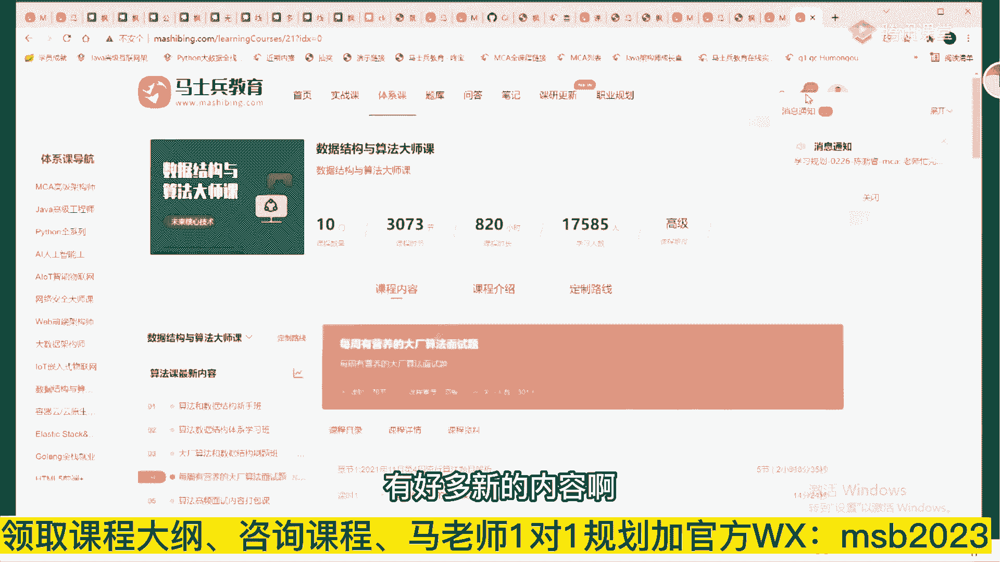

优先学会怎么用，再慢慢去探究它的原理就可以了，但是优先学会怎么用，你以后就每天来查查马老师的讲过没有，你们公司要遇到过一个什么新的东西了，来到马老师查一下马老师讲过没有讲过，直接拿去用就ok了。

这就是方便之所在，好了，我的整体性的东西我就介绍完了，关于价格，那个市面上的大多数的300个小时左右的，他们的价格大概是8000块左右，我们是3000个小时，我们应该是8万块对吧。

每天每周直播只有三节课的8000块钱左右，我们每天都有直播的10万块，没问题吧，好除以11万块给你了，1万多一点，不能再便宜了，每个课时算下来，一个课时三块多，三点x人民币一个小时。

如果你觉得大厂的老师20多位不值这个钱，我也就不该不知道该说啥了，这1万多投下来取得的效果，大家去访问这个网站，1100位学员的就业案例，向你明确的表述这个效果长什么样，报名三天涨薪2000。

怎么做到的，就改简历，啥都没干。

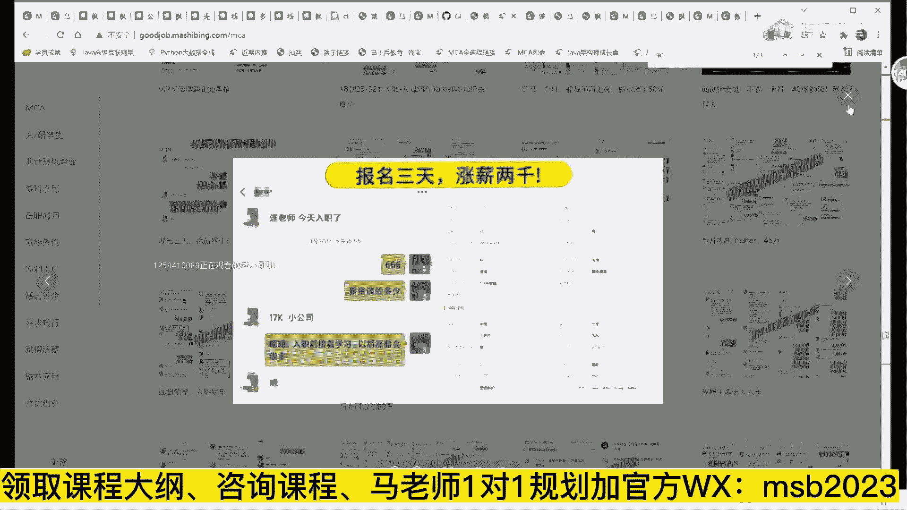

遭遇企业争抢，这就不说了，两个月涨薪5000，1年6万，1万多块钱的投入，6万多块钱的产出，每年年年有，这还算低的，薪资翻倍，原来年薪25，现在给51，你们这技术教得太好了，也是麻烦事儿。

值不值自己判断，33岁的研究生报名之前离职学四个月，5k涨薪，回到行业。

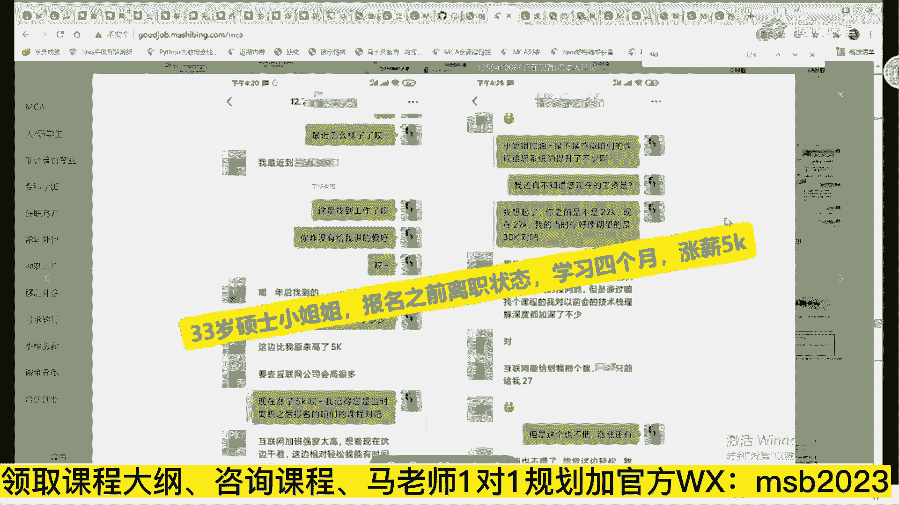

点点滴滴，方方面面，一个字儿都没有造假，自己去比较就可以了，所以对自己有能够负责任的，平时你学个什么东西都知道找个专业教练的，学个健身，学个乒乓球，你都知道找个专业教练学个四级，你也知道报个新东方。

当跟你息息相关，每年都能让你涨薪，你就不知道跟一个专业教练来训练了吗，o，今晚的活动介绍完，看这里，今晚活动啊，这也是咱们的那个枫叶云做的p p t啊，就是咱们在枫叶云上可以直接做。

做我自己的p p t呃。

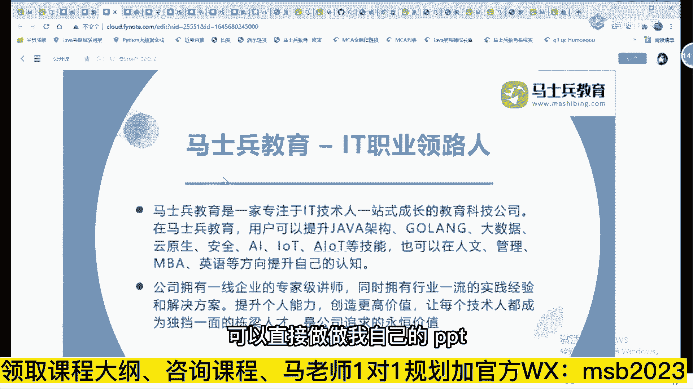

今晚活动我们有最后的白金卡十张，就今晚送完为止就十个多，一个都没有，白金卡意味着什么，我刚说了以后每年有新增的内容，新增1年只需要188元，1年，一整年大概每年接近1000个小时的更新内容啊。

呃各位兄弟们自己想着值不值，就成了最后十张思域优先内推个性化的方案，定制我们自己app的使用权限，现在呢大家可以通过手机下载马舒新钓鱼app，上面也有一些免费的课，上面你是vip，也可以直接用来学。

另外今晚报名，2月28号，明天晚上的咱们每月最后一天的抽奖活动，这是我们的奖品，这个不是很重要，最重要的是你买来的是你将来的职业发展，好吧，我会对你进行技术评测，量身定制学习内容，一对一的实战指导。

简历优化，面试指导，我们的学习服务，我们的专属福利。