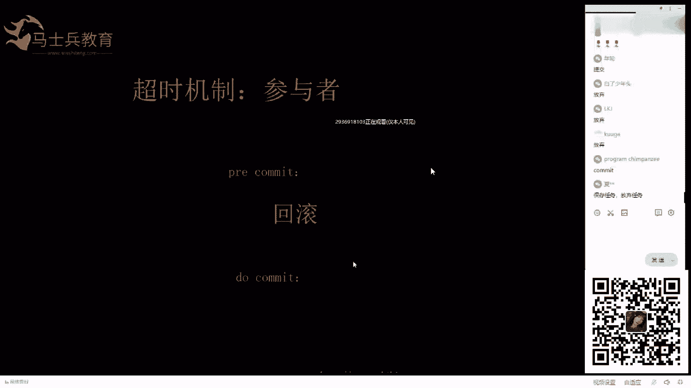
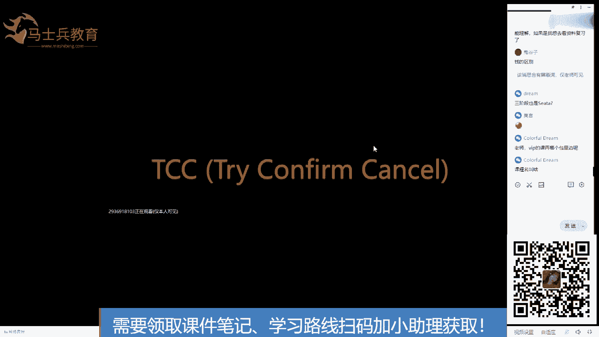
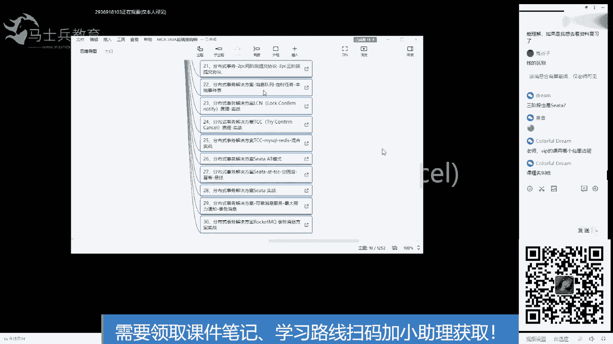
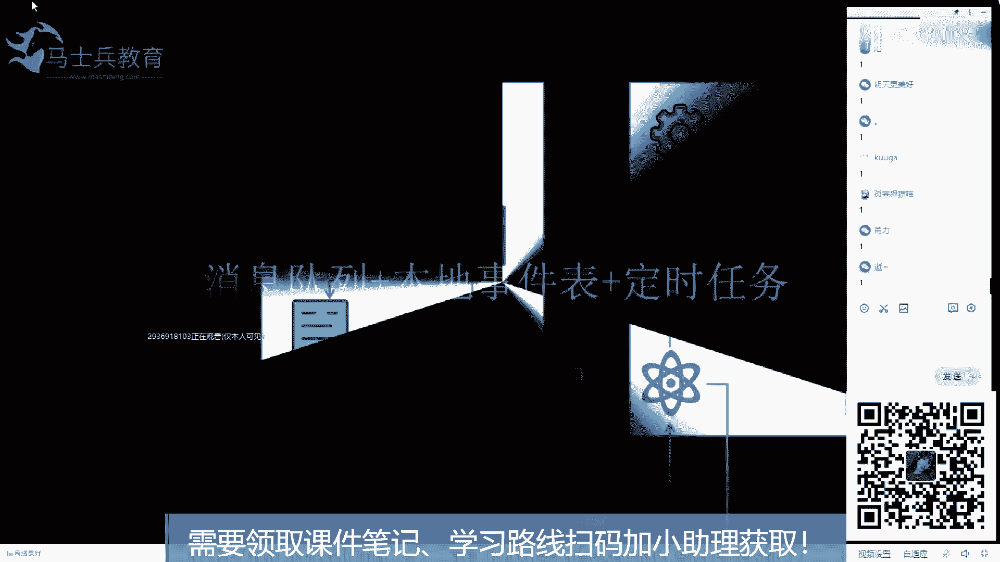
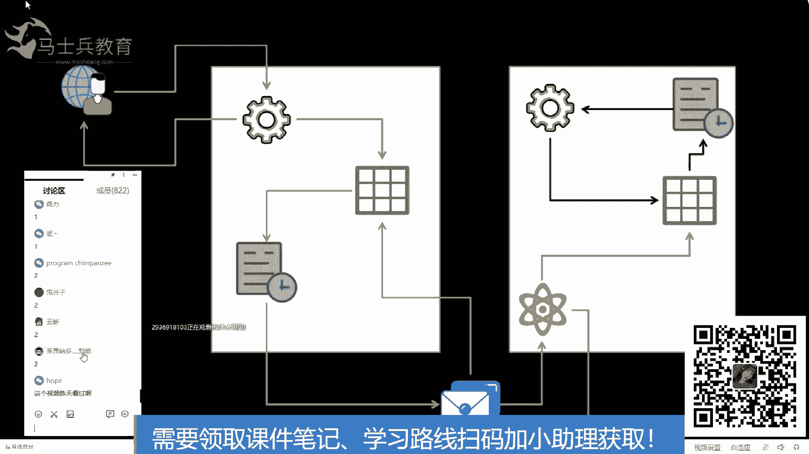
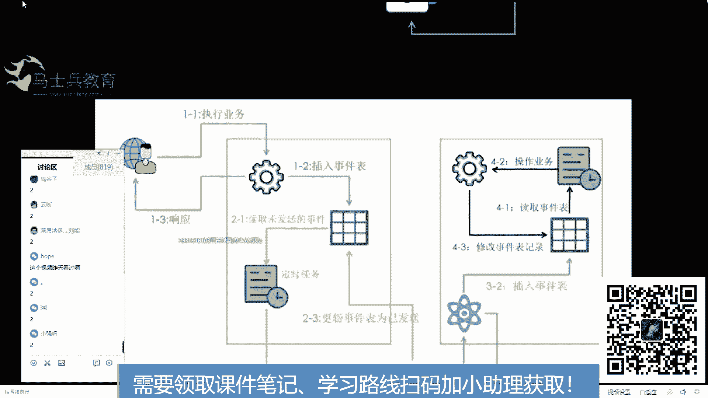
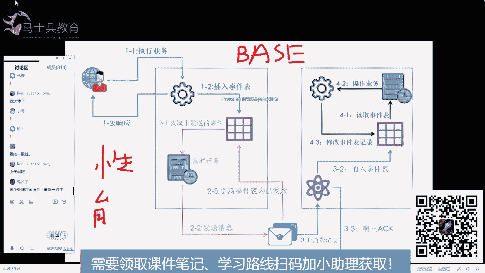

# 马士兵教育MCA架构师课程 - P113：TCC（Try Confirm Cancel）解决方案 - 马士兵学堂 - BV1RY4y1Q7DL

吃呀是吧吃是吧，那就是。那就提交嘛，对吧，小强是吧，吃。是吧当然得吃了。因为对猫来说，第一主人问我能不能抓，我我说能抓，然后主人让我去抓，结果我也抓回来，也把老鼠摁死在这了。

然后主人又不让我吃我对这个主人有多失望，所以为了表示我对主人的信赖，我把它提交了。😡，是吧因为因为大概率主人让我吃，不然他让我抓他干啥呀？😡，我只是说大概率。啊，没有说绝对的啊。

万一主人就是让我抓来玩一玩，看一看老鼠长啥样子。是吧大概率让他吃，所以他提交记住这块啊，就第一阶段成功，第二阶段。业成功。第三阶段大概率是让我提交的。ok k。如果出现这种张数据，是我们的脚本来检验吗？

是的。是的啊是的。好了，这话能理解吧？大概率大概率大概率。好了，这个我总结一下啊，如果说用两阶段。这种强一致性的事物。没有人能做到百分之百的保证。数据与直线这个C。数据执行。

没有人能百分之百的保证数据执行。ok。我说的清楚了吗？所以只能大概率降低发生脏数据的。情况就是只能降低发生脏数据的概率，但是不能百分之百的保证。O可以了吗。老师三阶段怎么做？三阶段我跟他说了。

百分之市面上99%呢不用。😊，两只段已经够了。第二阶段PRE执行超时收回收到回文指令。回滚指令有没有可能比之前的PI指令相知，那回滚就不白，那回滚不就白回滚了。好了，这个同学说的这些问题呢？呃。

是属于一些异常的情况。这个呢有这么几种情况叫空回滚，叫密档，还有叫悬挂。这个里面的各种异常情况很多，但是这个东西呢我要给你解释清楚呢。耗时很长。所以在这个课里呢不解释这些东西啊。

这些东西在我们VIP课里有在我们VIP课里有这个解释，就是各种异常情况的解释ok。因为公开课我只能把一些核心的观念告诉大家，因为就只有两个多小时是吧？要么3个小时。

我在VIP这个东西我上了20个小时的课。所以不能面面俱到是吧？公开课就so say sorry了啊，对大家。好了，可以理解了吧，这块。😊，能不能理解啊，啥啥情况？咋了？伤心了，你也不是VIP课。

听不着伤心了。不要伤心。是吧毕竟VIP跟非VIP还是有区别的嘛。是不是要不然你让我们那些交了钱的VIP情何以堪？没事，不理解我们报VIP是吧？老师剩下的时间管告了吗？我能理解，如果我想复习份资料。😊。

没课还没讲完呢，管啥告呢？别着急啊，你咋这么想听广告呢？你要想听广告，我就给你说说广告。😡，好啊。Okay。别哭别哭，课还没讲完呢啊。好了，往下走啊，你要想听课多着呢。😊。

老师VIP的课在哪个包里面呢嗯。找班主任找你的班主任去，课证名叫啥？来来来来来来来，等会儿我我。耽误30秒的时间，我让这哥们看一下客栈哪啊。

客栈哪？等会啊，这30秒啊别走，不是广告啊，他说不是广告啊，只是给我们VIP找一下课啊。😊，在网原车三板里。然后这个。分是5从2十一节课开始，一直到20到3030节课。一共时间每节2小时自己去找去啊。

找你的班主任去要我在这里面都讲过了。OK好了。😊。

是吧，go ahead。好了，说着下一个说TCC。现在还有多少人在听课，敲个一。嗯。都在是吧。🤧嗯。哦，都在啊，这移动联通天翼也来了。对对他啊吧，感觉白了头的。啊，猫还在啊猫还在就行。好好好好好。

带着好带着继续讲啊。好了，来继续讲听CC。😊，TCC什么意思？如果学过前面的两阶段，那么你理解TCC就方便多了。从名字上好好看一下，try confirmc中间加一个O，这俩是一伙的，这俩是一伙的。

明白了吗？现在能不能明白，能认识这这这这这仨单词的意思吧？第一阶段。拜一下是一下。如果没问题，第二阶段confirm。如果有问题，第二阶段cancel好了，PCC说完了。听楚了吗？

为什么前面花那么花那么长时间给你讲两阶段是吧？学完两阶段，你再理解TCC这不很很容易吗？😊，为什么要有TCC？😡，大家想过这个问题吗？为什么有脸阶段了还有TCC？😡，想过这个问题吗？讲得好，鼓掌。

谢谢啊。好了，想过这个问题吗？😊，提高性能TC在太差。哎，这。这这有什么性能提升呢？虽然说也有一些性能提升的考虑啊，首先第一步try它是落库的，就类似于C塔的那个操作方式一样，是落库的。性能是有所提升。

但是最主要的原因是这个。你在你的方法里。调用了that KV。调用了up date circle。ok。所以用这个，如果你用前面的连接段，那个的话，你能保证他和他。在一个事物里吗？

能保证readninginess和my circlecle在一个事物里吗？能不能保证？能不能保证快点的？Quly， quietly。能不能往证想想。不能是吧不能保证是吧，都不能保证okK那不就得了。

有TCC来了，明白了是吧？OK我就喜欢这样的这样的学那个。😊，那个这样的朋友啊，一说就一说就懂。系话，好啦。明白了是吧？好了，明白就好，其他的我去。😊，这什么？来其就是明白的同学敲一。不明白的同学敲2。

明白的敲一不明白的敲2，有不明白的啊。嗯。为爱活着了，只为爱活着。小迪。我去怎么二变多了呢？😡，明天会更好。怎么二还边，我操，怎么哎呀，我去。这这啥又是小强，又是老孙的，又是猴子，又是啥呢？

好了好了好了，那不明白没关系啊，给你解释清楚就好了。好了，这个二太多了啊，都都都都2好了。😊，喂。😊，嗯，对不起啊，刚才有口误的地方，大家不要介意啊。好了，我举一个例子，你就明白了。好了，现在。😊。

现在我们做一个业务，这个业务上呢，张三给李四转账转100块钱，明白了吧？张三给李四转转100。ok。待阶段怎么做？出外阶段啊。踹阶段。张三的余额钱包表里有这么两个字段，一个叫余额字段，一个叫冻结字段。

踹阶段就是张三的余额表里减100。冻结字段加100能理解是啥意思不？来这块刚才敲二的同学能理解的话，你现在敲个一。😡，是吧超了相对先理解这一点啊。小强懂了是吧？我知道小强乔二了啊。😊，嗯，好了。

明天更好，我知道你也敲二了啊。好了，喵，你刚才敲的是问号。😊，是吧这是你刚才抄的，你也抄到了，好了好了。😊，这话能懂是吧？比较快要试一下。然后李四呢冻结字段加100，你可以看到整个系统中全在尝试。

并没有说李四的余额加了100，只是余李四的冻结字段你先加了100是吧？先做一个缓冲，先大家先试一下嘛，能不能成。是吧就像你跟你你偷你女朋友钱出来花一样。你们俩抽屉里。一共有1000块钱。举个例子啊。

你要偷100块钱出来花，你胆子够我大吗？😡，是吧如果胆子不够大，先拿出100是吧？先到抽屉里是吧？放冰箱里。是吧先放冰箱里先不花，万一女朋友发现了，说哎，怎么放冰箱里了是吧，再把这钱还回去。

万一女朋友过了半年了也没发现。然后你从冰箱里把这100块钱拿着出去花了。😊，是吧这不就神不知鬼不觉吗？所以这个道理一样，先把这个钱拿出来，放冻结字段里先待一会儿。😡，如果说整个系统都没有发现。

都没有出错的话，那再把它花了，这只要踹，先去踹一下。好了，这个应该好理解了啊。好了，如果说前面没有任何问题，那么执行的是。conform。是吧就是什么张三从冰箱里把钱拿走，花掉。是吧这次彻底花了。

钱没了，女朋友有没有发现？😡，是吧然后李四呢是吧，也也大大方方的接受了。😊，是吧张三媳妇没有发现，然后李四是吧，冻结这段把刚才那100减掉，余额加了皆大欢喜。明白了吧？这叫conform确认是吧？

如果在踹阶段被媳妇发现了呢？很简单吗？还回去吗？是吧从哪少的放哪去，从抽屉里捡了100，给他加回去，冰箱里多了100给他减回去。你是呢冰箱里原来多了100，也给他还回去是吧？世界恢复平静，白干一场。

明显了吗？那里是的余额加100的时候，系统出错了，咋办？哎，一问如果李四的余额加100系统出错，那就把你媳妇抬出来，让你媳妇来解决是吧？也就叫人工补偿，大不了你挨一顿是吧？要么潜滚，要么李四就加100。

张三打一顿是吧？要么李四少100给张三退回去，要么这就叫系统里叫要么叫潜滚，要么叫回滚，反正就就就这这么这么个意思。李四为什么要冻结？😡，好吧，那我我这么给你解释啊，这个灶看来你没投过钱，我跟你说。

来往回走。😊，往往往回走啊。如果李四不冻结，你现想会遇到一个什么情况？举个例子，张三余额减100，李四不冻结，李四的余额直接加100。是吧这是李四余额里加100。OK然后还在踹阶段。

然后张三被媳妇发现了，偷钱了。然后李四一看他的余额，我去，我的余额怎么加100，李四把他的媳妇叫过来了，说媳妇，你看我多了100块钱。😊，结果张三被媳妇张三事发，然后媳妇说你把钱给我要回来。

结果张三把钱恢复了。那么李四加了这100是不是也得减回去？😊，然后李四的10元减回去了，然后张三莫名其妙媳妇说你骗我。你玩我。是吧然后炒一下再打一顿，李斯是不是白白的瘦了？受这么个罪。

是吧所以冻结一下嘛，缓冲一下嘛，不就完了。明白吧？从用户体验上来说。😡，你不要让你的用户有这种大喜大悲的情绪。怎么我卡里多了这么多钱呢，忽然间花一下又没了。😡，是吧多尴尬，所以缓冲一下嘛。

从用户体验的角度来说这个事啊。好了，现在理解了吧，给你解释清楚了吧？你是不动也不加呢，那你这个业务干啥呢？😡，两个人两个人通过心灵感应就做了数据传输。是吧没必要嘛。是吧好了，这个过了啊。😊，好了。

这个可以过了吗？能不能过了，快点，能过敲一，刚才超二的那那那帮人。难过了吗？哦，这就对了嘛，是吧？节奏得得带好，是不是？好了，往下走啊。然后下一步。下一个方案。消息队列加本地事件表加定时任务。

OK从这个从我PPT上列的这这一行字里，大家应该明白。我所用的技术就是这些技术，没别的了是吧，也不用中间键，也不用第三方就这么搞。然后再来看这张图。

我把大家都挪走了啊，先挪走看这张图能看明白吗？😊，能不能看明白？把它挪到这儿吧。能不能看明白？是吧刚才我说了不能看明白。鬼谷子也不懂啊，鬼谷子，你不是智慧的化身吗？你也不懂。😡，刘能也不懂。

不懂啊，不懂，那再看一张图。

好了，我这张图懂了吗？刚才刘南跟鬼谷子，你俩应该是西安区啊，你俩应该懂啊。啊，东北F4。啊，鬼谷子懂了嗯，鬼谷子懂了，果然是鬼谷子。辽达吗？我能哥呢？赵本章不让你拍戏之后，你你你也不懂了，是吗？

这个刘能还换了个外国名字，赵四有个外国名字叫。尼古拉要亚洲武王尼古拉斯赵四啊，现在懂了吗？啊？其他人懂了吗？能懂的给老师敲个一。通过流程明白了是吧，刚才又也是流程啊，刚才也是流程懂了是吧？

我工作就是用的这个是吧，你敲代码敲的挺好的。懂了吗？啊，还用还用还用说吗？只为爱活着。也懂了是吧？你看前面好好听课的都懂了。唉C一个懂，哎呦，我去都懂了。好了，懂了，那就过了，不讲了啊，可以过吗？😊。

不可以，我操。讲一下小强讲一下啊，小强还小是吧？照顾一下，你看这个猫，我跟你说，这个猫每次都打问号，别过。😊，哎，不要是吧，不要过好了好了，来说一下啊，画几个圈。😊，先看大圈。这两个这是什么什么颜色的？

咖啡色吧，这两个咖啡色的圈。来看这两个咖啡色的圈。是两个服务。这是俩服务O。机长，这是两个服务。好了，我删掉。这个用户的请求进来，这是用户发起请求进来。第一步执行业务逻辑。第二步，插入事件表。

第三步给用户一个响应，OK用户干的事就这么多。嚟。从这个流程里大家看到执行业务的circle和插入事件表的circle。是一个事物吗？是是吧，这是一个单机的事误是吧？所以能保证是吧？

加个at second注解OK没问题。好了，这步过了啊，第二步读取事件表里未处理的未发送的事件，然后把它发送到消息队列，然后回来发送成功更新状态以后就不读它了。OK这也在一个事物里。能不能。

理解还在一个事物里。是吧可以吧？okK好，一敲起来了啊。好了，再往再往下走。3。😊，这边有一个服务去监听这个队列。监听完之后，监听到一个消息，把消息插入到这个表里。插入成功。

然后给消息队列一个响应ACK1个响应。OK点完协议之后，以后就再也收不到这个消息了。也说这个消息我平安的把它从这放到了这，我以后就不管了。可这块可以理解吧？能不能理解能理解是吧？OK好了。😊。

那个事件到这之后，那么就执行他的业务呗，把事件取出来，该执行你的circle，该操作的操作，该更新更新，这又在一个事务里。老师ACK如何执行呢？这是MQ自带的。MQ自带的是吧，rocket MQ呃。

rocket MQ有activeMQ也有这后队队都有都有SCK都有SK。你可以你要用过的话，你可以知道。😊，OK好了，一般的发送失败尝试，比如说roingMQ16次。如果没有记错的话。

就是这个消息发16次。如果16次都接受失败的话，进入死信队列就呆的量。那个死性对列死性对列它也是一个对列，你还可以去监听，监听到死性对列之后人工处理。就OK了吗。理解了吧？其实他的整体思想就是把一个。

大的跨服务的事物把它拆掉，拆成小的每个服务的事物。现在理解了吧。是吧积少成多。今夜陈裘。什么，还有什么，反正就这个意思。😡，能能来这块能懂的给老师敲个一。手机砸脸了，那啥呀？这个会有时效性问题吗？会的。

会有时效性问题的。是吧这叫b斯理论。保证了最终一致性，但是牺牲了时效性。好了，那么它新生的时效性，它有什么优点呢？它的优点是。性能提升了，仔细仔细琢磨一下这句话。性能提升了。

考虑一下为什么性能提升了。