# 马士兵教育MCA架构师课程 - P127：学完RocketMQ之后对面试有什么帮助？ - 马士兵学堂 - BV1RY4y1Q7DL

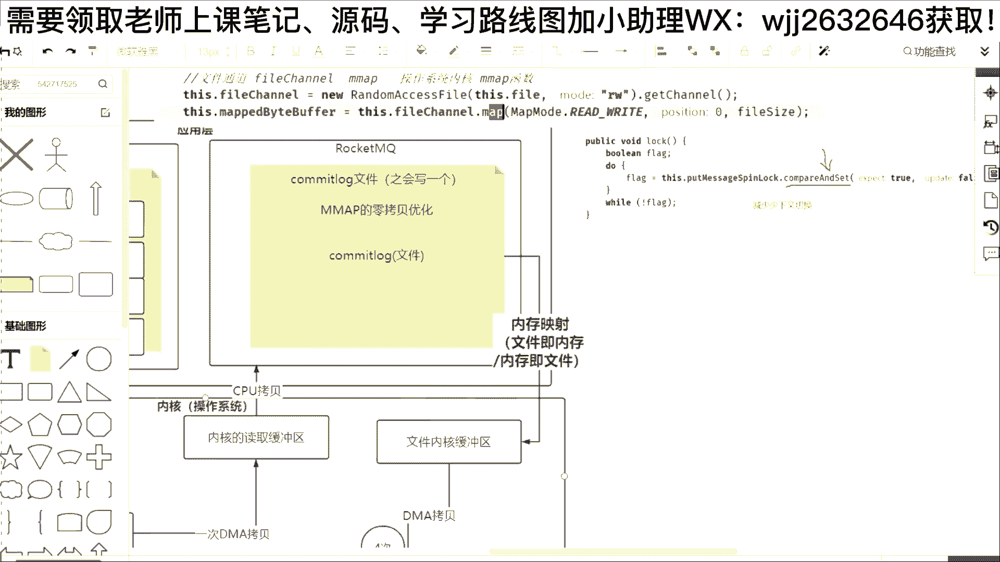

啊，所以我们再回到后面这个问题。就是学完，比如说你对req读了一部分，或者是把它读了大部分，对你的面试和工作有什么帮助？😡，O。你觉对什么帮助？😡，啊，就是今天你你你把这个零考贝说出来，对不对？😡。

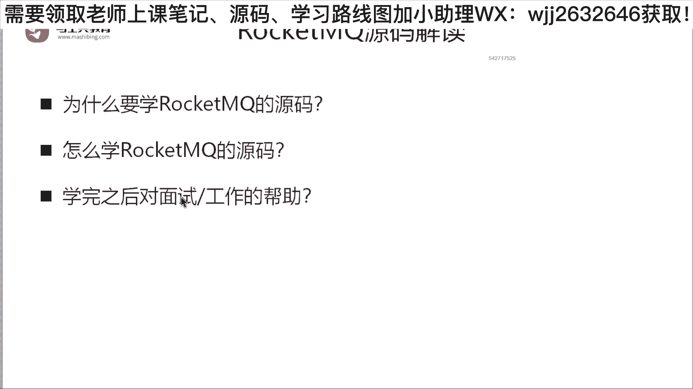

啊，你的帮助在哪里？其实我前面给大家。

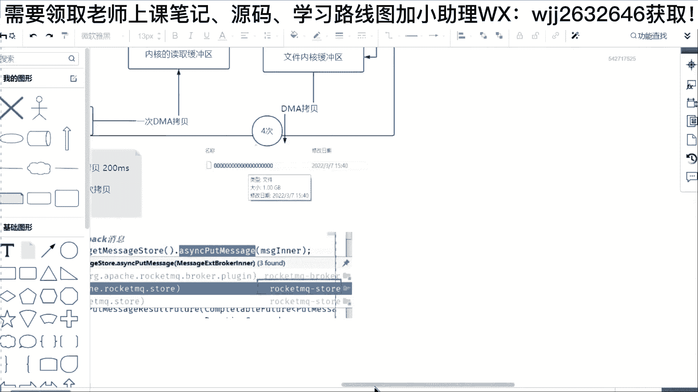

说了一个比较泛的点啊，这里给大家说一个比较具体的点。😡。

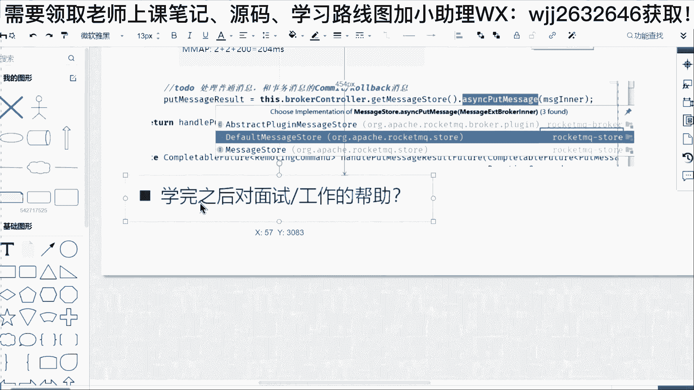

你读原嘛，第一个。亮点搞定。对不对？有东西说。啊，你不然的话呢，你说你读了一个源码，你结果跟面试官去说我的流程，那肯定不行的。好，这是第一点，有东西可以说，并且的话说的话说主线。😡。

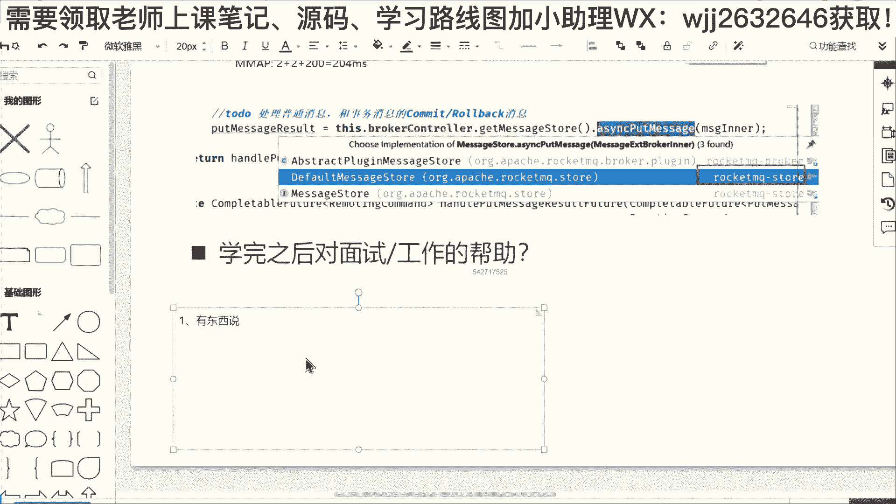

同学们。说主线啊，你不能说跟很多面试关军说我的原码这里也读了，那里也读了。😡，吹牛逼，反正他也听不懂，怎么可能？啊。啊，这里给大家说一下，如果是一个java开发。😊，他听不懂，难道听不懂锁吗？😡。

你要听他能听懂的。所以你再去比如说你去面试的时候，你跟别人去说业务，他肯定听不懂啊。你说你你公司有什么业务，我是啊我是什么医疗项目的。我听过我是什么keys项目的，我是什么外包项目的，你给他讲业务。

我怎么听得懂，你给他讲锁啊，你给他讲什么哈西 mapap啊，你给他讲零拷贝啊，他如果听不懂的话，就是他菜嘛。😡，所以大家知道读元吗？为什么说。😡，你的流程其实是次要的，你的主体是主线亮点主线亮点。

就是跟跟你的简历写的是一样的，你去描述你简历的时候啊，你其实有一句话叫做什么？我们去学这个热Q。😊，啊，学到后面或者是学很多的这种源码。😊，后面你会发现有一点就是你开始是向他学，后面叫做向他学。😡，啊。

就是我首先学这个ro是学它的技术点，然后向他学的话呢，是学他的一些。😊，方法论或者是学它的一些设计。就是向他学习。OK那你你平时我们所说的，哎呀，大家使用的这种什么，为什么要面试的时候考多线程。

考什么县程安全，考所机证。😡，那我的代码里面目没有多线程，那你看一下ro的源码，它都是多线程高并发。😡，他扛阿里的双十一，我记得是去年今年的2呃，就是去年的双十一。

还有前年的双十一reckconQ是百亿级的数据流转，就是它可以架很多集群。然后reckQ可以扛住百亿的数据。😊，ok。打印的数据流转，你你知道什么概念？😡，对不对？然后。啊，第三个点。

这个跟我们的自身相关。现在大家发现为什么面试的时候总问圆嘛啊，有的同学说了，问圆嘛就什么卷。😡，对不对？今天老李给大家一起来卷，大家卷起来啊，卷死他。其实本质上面不是的啊，因为李老师的话呢。

我工作13年。😊，这个现在这个卷它其实是跟我们现在的项目或者是跟我们的市场相关。哎，你会发现在其实我早期啊我给大家说一下，在早期里面呢。😊，那个时候他非常鼓励叫什么个体开发啊，叫做个人开发啊。

包括我很多同学啊，还有一些朋友啊，他们之前做什么。😊，啊，记得最早的做那个iphone的这种游戏开发，做这种iphone的APP开发啊，IOS这种开发赚了不少钱。后但是到了近几年没市场了。

包括安卓的开发也没市场了，为什么啊？因为现在慢慢的他都是往这种大型项目。😊，就是你虽然说你是一个小型项目，但是慢慢的话呢，它就算这种大型项目或者是小型项目，它慢慢都是往这种什么分布式微服务，对不对？

往这个上面去发展，然后很多东西他都要做什么性能调优，要做什么高并发，然后要做什么高拓展，要做这些东西。😊，啊，这些东西就是市场的要求。啊，为什么是市场的要求？你你现在我们把视频教育，我们也招老师。

我们也招招开发啊，我们内部有系统，我们招开发的时候，我们要求的至少是中级高级啊，薪资的话我们可以谈的很高。但是的话呢，你说你一20K，我不要。😡，啊，这种一二0K左右的或者是低于120K的，我不要。

为什么？因为饱和了啊，因为现在我们整个系统的要求就是我要提高并发。😊，啊，我们的学员要什么就是提出很多各种需求，这个需求是建立在一个更高的体验上面。😊，啊，所以大家所说的为什么问源码？如果不问圆码的话。

这些东西你怎么去卷嘛啊，我招一个过来CULD我们公司已经有CLD了啊，我们的开发团队已经有很多的CURD了，我还想淘淘汰一些，对不对？😡，啊，所以现在你就会发现面试中间为什么总问员嘛？包括毕业生。😡。

也问啊，就算你是个大学毕业生，那我肯定会问最基础的ssp的源码，你要懂一点嘛，对不对？然后你至少是说mycyclical数据库。😊，啊，然后再加一个readdis要用过MQ的话呢，可以选两个啊。

卡夫卡或者是rockcomQ。😊，啊，中间几叫做精通或者是熟悉当中的一种。那除此之外，我还可能会考核多线程，还会考核GVM啊，甚至我还会考核一点这种设计模式相关的东东啊，比如说常见的23种设计模式。

对不对？然后大场的话肯定会考核算法。😊，就是我对算法也一定考核。😊，所以你看到东西是不是足够卷，那这里面圆码就非常关键了。😡，因为原码的话给大家说一下，其实包括卡夫卡，包括radies。

如果你有这样的时间，我也建议你可以去读一下它的原码。就rease大家知道是C写的。😊，啊，redies的源码的话呢其实也非常经典啊。为什么经典的原因啊，我告诉大家举个例子，大家知道在redis里面啊。

我们经常所说的redis它是干嘛啊？readdis我们是一个key value的数据库，对不对？key value的内存数据库。那我问你这个地方它怎么组织的？😊，怎么存储的？你就懵逼了。

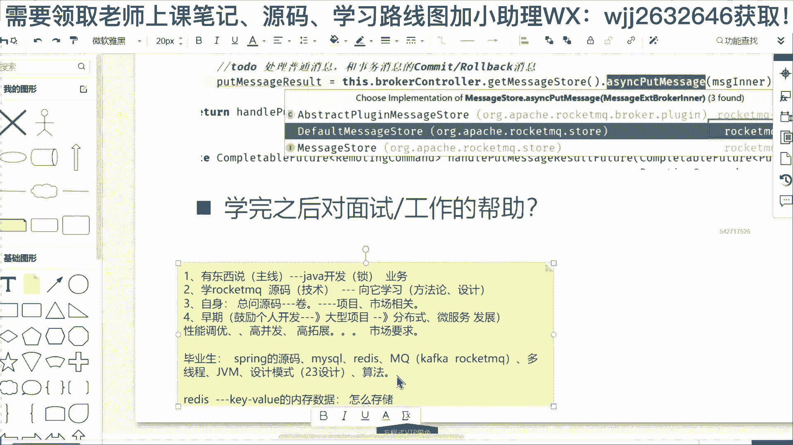

啊，在听的各位小伙伴知道就是readdis作为一个keywi数据库，它的key和wi怎么存储的，能回答我吗？😡，这个地方不是valueue的数据类型啊。😡，🤧Yeah。哈希表对。

跟我们今天讲的东西哈就是一张哈希表。😊，好，你能回答哈哈希表没有问题。那说哈希表底层实现。😊，最基础的数据结构有什么？有数组吧。😡，一般来说就是数组加链表。

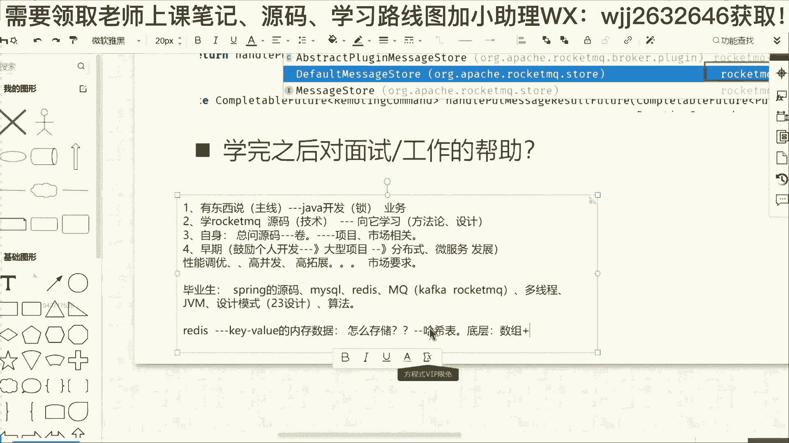

这一点是不是不是没问题？好，没问题，我接着问。😡，接着怎么问？你要知道在哈西表里面，我不断的往readdies里面。我们知道我不断的去往这个readdius里面，我去设置。😊，T设置value啊，设置。

比如说我的K数量。😊，很多。这个时候是不是会涉及到我们数组的扩容啊？啊，大家知道书。😡，不足的扩容阻塞，因为他要重新哈希。我们称之为瑞哈西。就是重新把这些元素放到不同的位置上。进行分散。好。那接着我问。

那这个地方它会阻塞。😡，我readds好像没有感觉到堵塞，我readdis里面存了1万个键，我也没阻塞，它的原因是什么？😡，啊，你能回答出来吗？😊，这个地方会涉及到一点点。源码相关的知识。

其实内部你会发现它里面使用到的是两张哈希表。啊，就是它里面用到了两张全局哈希表去存储我们的keyvalue，就类似于我们经常所说的垃圾回收里面的什么S0和S1就是。😊，一般只用一张。是一般啊只用一张。

好，但是一旦涉及到我们在进行扩容。扩容里面的话呢，注意他就会用到另外一张。但是这个地方有个关键点，这个地方它在扩容的时候，你要知道readdis它的这个并发非常非常的高。

它动不动就10万的这种什么QPS。😊，啊。因为radis它不能达到10万的QPS，它的性能就会很差。因为它是挡在我们查询上面的第一个层面。😡，ok。那大家可以发发现redis并发10万家的话。

这个地方我前面一旦说我的数组，因为大家都道知道数组的话，你把它创建出来16。😊，那就只能存放16个，那超过16个的话，有哈西冲突就变成链表。链表如果过长的话会影响性能。所以在这个地方我是不是要扩容。

比如说比如说把它变成32，把它变成64，把它变成640等等之类的。好，在这个地方这个阻塞怎么解决？😊，这个阻塞它的时长它其实已经影响了我们的性性能，对不对？所以在reds里面，它有一个叫做渐进式的哈希。

😊，渐进式的维哈系。怎么做的？原理很简单。你这个地方要阻塞，比如说我阻塞的时间要阻塞1秒钟。😡，那瑞利斯说我受不了。😡。

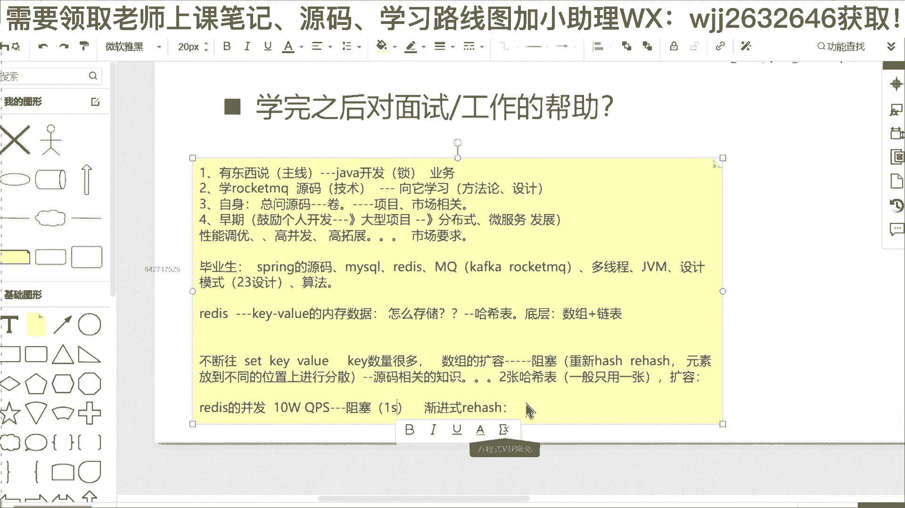

啊，你要阻塞一秒钟的话，那我的reis会卡，对不对？我要卡住一秒钟，所以渐进式哈希它的处理方式是说在我们每一次。😊，啊，叫做每一次比像readdies，比如说有个客户端cl端。

然后去向我们的这一个啊对应的readdies去发消息的时候，比如说我是get也好，是st也好，是其他东西也好，没关系，对不对？我就发这种请求的时候，那么我就转移一个元素。😊。

请注意为什么可以转移一个元素？因为我有两张哈希表。😊，系。啊，我转移数组的一个元素。比如说第一次我转移位置是0，第二次转移数组下边是一，第三次转移下边是2，第四次转移下边数组是3。

所以大家发现当我readis在这里不断的进行处理的时候。😊，我就转移一个。就是我在进行re哈的时候，我这两张表它都可能存数据。哎，你去访问的时候，我再用一张表做个记录，对不对？你这张表的记录可能在老表。

你这张表已经转移了，在新表。那么每一次。😊，我在进行客户端访问的时候，那原来假设里面你在进行约哈西的时候，有1000次，有1000个元素要重新定位。到这个地方，那是不是我可以把它分摊到每一次。

所以每一次它的开销就只有一毫秒了。😊，因为这个地方我总共干完是1000嘛，我要把1000个元素全部转移完，它的整个耗时就是一秒钟。那现在我每一次在客户端访问的时候，我阻塞的时间是不是就只有一毫秒了？😡。

所以这就是渐进式的维哈西。所以大家看到没有？通过技术，很多情况下面有通用性。就是你一次干的时候阻塞的太厉害了怎么办？每一次访问的时候，我转一个元素。😊，啊，比如说第一次访问转移下边是零的。😊。

第二次转移下边是一的23，然后再不断的啪啦啪啦啪啦啪啦，对不对？因为res请求的话，它肯定有非常高并发的请求去访问我。所以的话呢很快我就可以把所有的元素把它转移到另外的一张哈西表当中来。😊。

所以在执行命令的时候，我们进行对应的转移。ok。😊，啊，所以大家前面所说的，你看到没有？为什么卷的原因？其实卷的原因说白了就是现在菜的人太多了。😊，哎，所以你你要知道你写简历的时候，为什么像多线程。

还有GBM，还有一些什么readdisMQ，还有mycyclcle spend的源码，还有像这种设计模式，还有像这种算法，这些东西才是核心。😊，好不好？这些东西才是核心啊。😊，啊。

同时的话呢啊就是大家还要注意一点，你要去补补一些什么计算机的基础。😊，我们常说计算机的基础里面会包含网络通讯。😊。

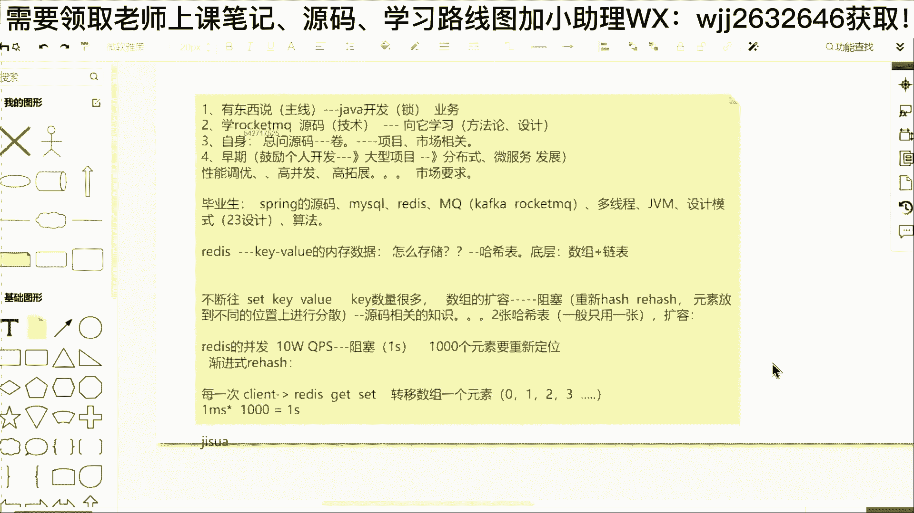

基的基础知识。基础知识有哪些了？我给大家就是不再这么去画了啊，给大家看一下。😊。

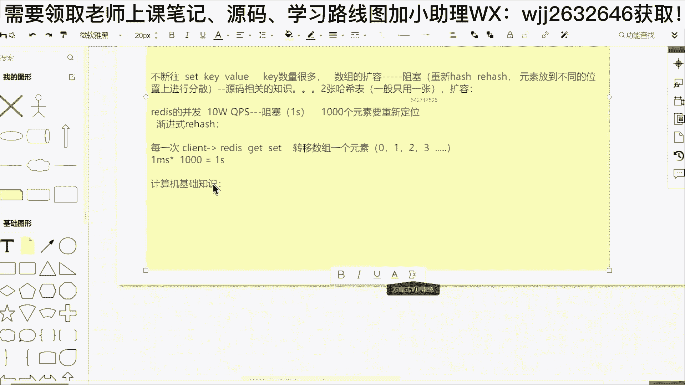

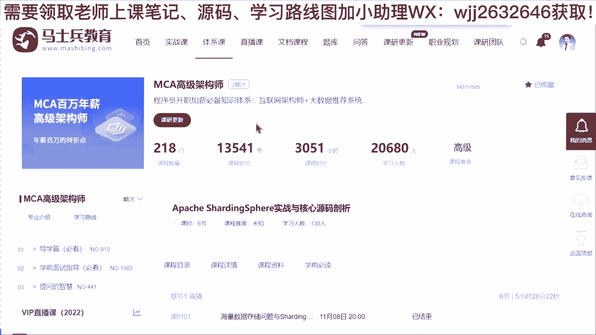

基础。基础你像linux是不是基础？😊，因为你玩系统的话，lininuxmin你必须熟。😡，对不对？linux里面还涉及到网络命运，然后还有包括什么？像我们经经常所说的。

还有一些就是rockkenQ里面的也有基础。你像如果说你能够去懂一些汇编或者C语言的基础的话啊，也不错。😊，啊，所以大家可以看到基础知识的话，还有像这个什么TCP。😊，啊，TCP里面的话啊。

最简单什么三次握手啊，四次挥手啊，半连接啊、红泛攻击啊，然后当中TCP的豹纹啊，还有包括呢keep eye，然后TCP的这种什么流量控制，就是那个呃我们常经常所说的滑动窗口协议，还有了端口。

还有TCP当中的一些场景，一些工具。😊，对？就是说如果你能够把这些东西补一下，那你去面试的时候就是非常的有竞争力啊。😊，同时的话呢嗯。

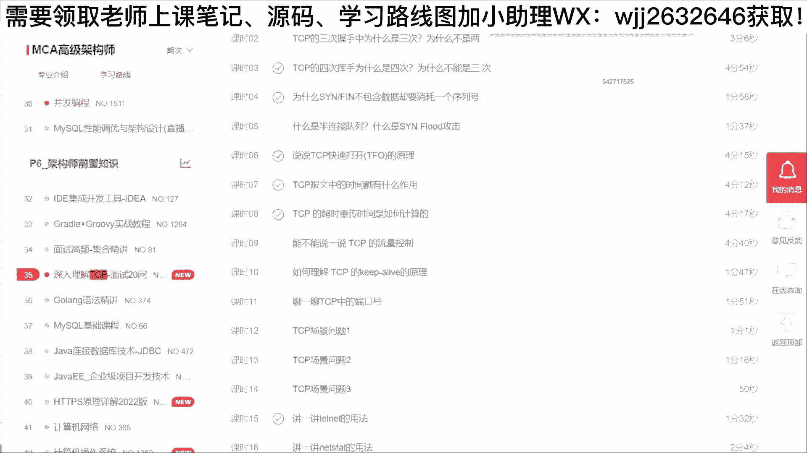

。注意啊，同时的话除了大学生。😡，其实很多小伙伴呢在昨天也好，今天也好，给我这样的一个反馈。我发现了一些叫做大龄巨婴。😊，啊，什么叫大龄聚婴呢？就是年龄在30岁甚至30岁以上啊及以上。😊。

然后基本上是CURD的水平。啊。基本上就是1个普通的C1D年龄并且在30及30以岁，30岁以上啊。😊，大家自己可以看一下，就是前面我们讲的这些技术点。😊。

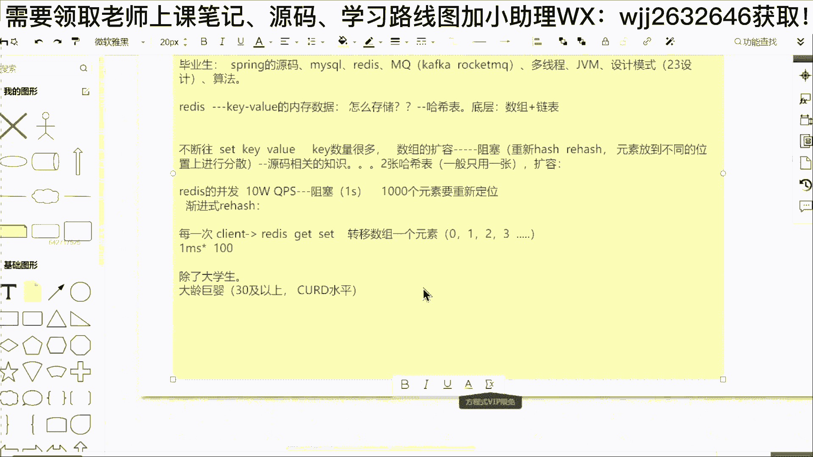

啊，这些技术点如果说你中间某一些基本是知道的很少的话，你工作超过3年。那可以定位成你就只有1个CURD的水平啊，就是这些技础点的话，你不能掌握30%、40%以上。基本上啊你就是一个平时CURD。😊。

怎么跟GUM的增量收集是一个概念。😊，其实技术的延伸，当你学了这个技术之后，很多技术的思想是通用的。就是我们为什么去读源嘛？😡，啊，就是你如果说你跟你玩的这些人跟你在写代码的这些人，对不对？

天天只是说哎想哪个妹子好看，然后的话想着哪个时候我们去吃个夜宵，或者哪个时候啊去玩个其他东西啊，老想着这些这样的话呢，你们就在一个层次啊。但如果啊我读了这个源嘛，然后我的思想架构，我的技术架构。

我在这个层次。那么其实我看其他东西的时候，他就会是站在这个点。😊，OK其实要老李说给大家就去说技术啊。😊，你如果说想拿到高薪。😡，或者是说啊大家所说的不单纯是高薪，对不对？

平时大家可能遇到了很多这种什么叫做危机感。😊，啊，觉得太大家太卷了。同时有的小伙伴说啊，我想转行。😊，啊，原来可能不是做java的，原来是做什么其他东西的啊，可能是做测试的，甚至是说我想去冲击架构师啊。

我冲击这种什么高薪岗位。😊，好，在这里面你首先要改变的是思维。😊，其实改变的不是说啊你说啊我去读断代码，对不对？然后的话呢，我去把这个API写的很好，然后把我的这1个API写的更快。😊，他并不是。是的。

他是在思维，就是同样看一个东西啊，就是同样看个代码啊，为什么别人有收获？😡，啊，或者是别人他有成长。😡，啊，你可能说没有成长，对不对？我们看代码的时候看源码。😊。

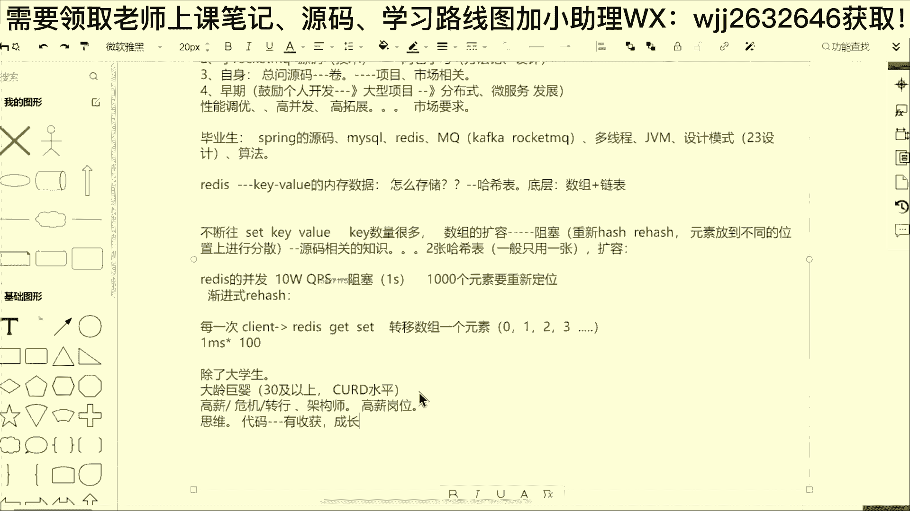

你看到这些东西的时候，可能就这么过了。😊。

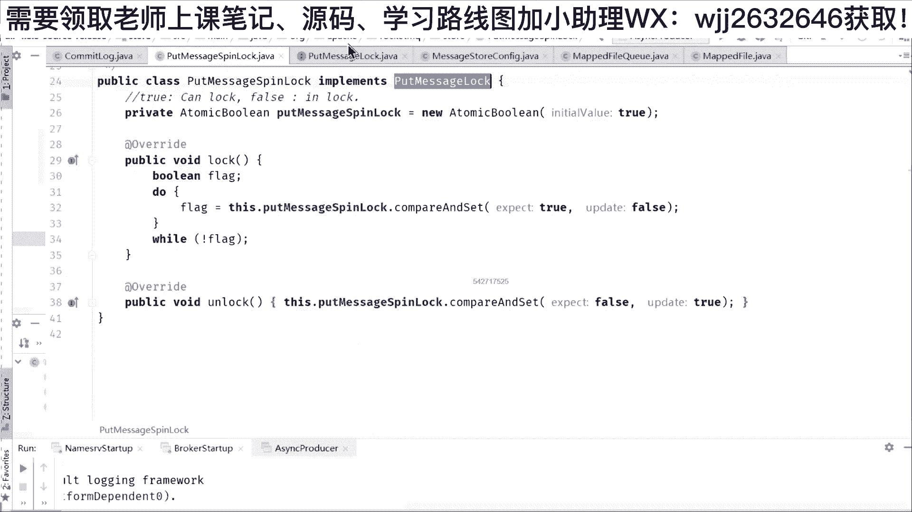

啊，在这里面的话呢，一段两段三段三三段啊，但是核心。😊。

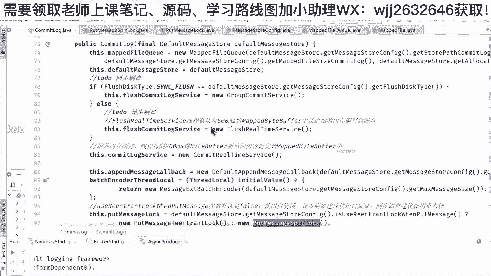

找重点，找主干。找亮点，就是包括我们项目也是这么回事。其实项目里面它会充斥着大量的CRD，但是往往去提高你技能的，它可能就是那么不到百分之。😡，5的代码甚至不到3%。😡，啊。

就是100行代码里面可能只有5行写的比较好一点，然后甚至只有3%的这个代码，它的技术含量相对来说比较高。为什么？你就算阿里的rock andQ啊，这里面这么牛逼的框架，它里面刚给大家演示的时候。

是不是也一大堆的ifS。😊。

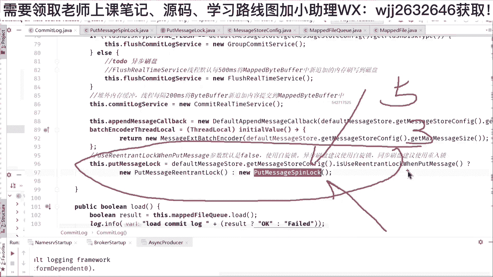

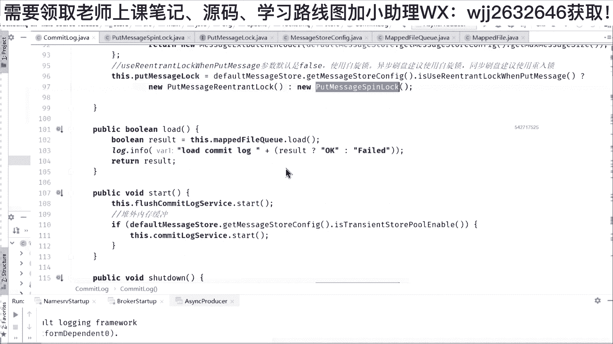

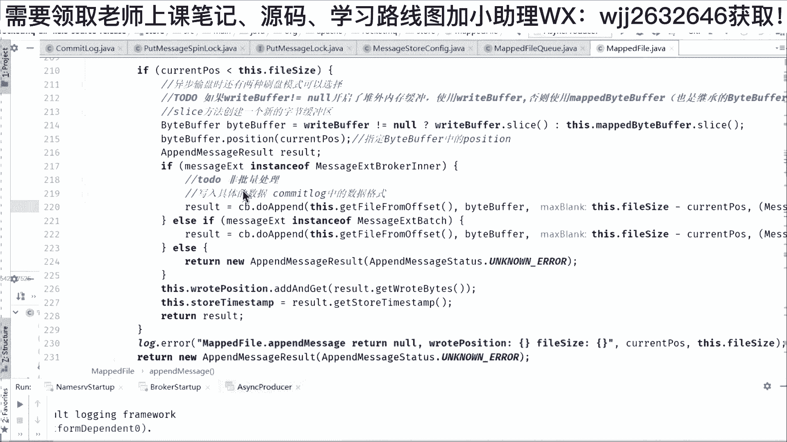

啊，这种判断if else其实这些这些东西不用太在意，好不好？你要在意的是里面，比如说方法的转跳，比如说涉及到一个核心内的处理，比如说它的主干，你不可能说把这个源码背下来。😊。

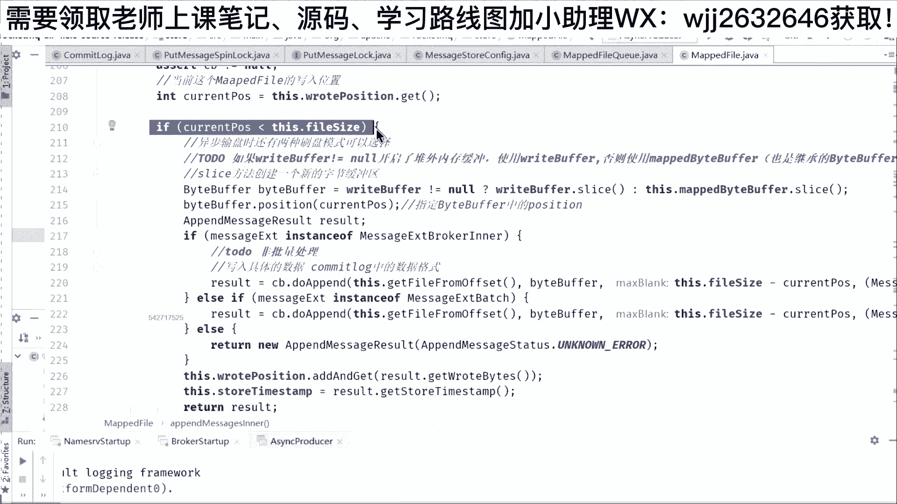

对不对？你读spring也好，读其他框架也好，你不可能背下来。但是你要去说你在工作当中运用或者面试当中，你要展示出来，你拉一个主线。😡，什么主线reQ无非就几大组件。

然后proder我们的consumerbro和name server每个组件做什么用？好，第二个第二个主线怎么启动的？启动，当然是name server先启动bro后启动那么name server的话。

当然要把所有的数据加载在哈 mapap里面啊，然后利用读写索的方式提高性能。然后作为bro的话，大家知道。😊。

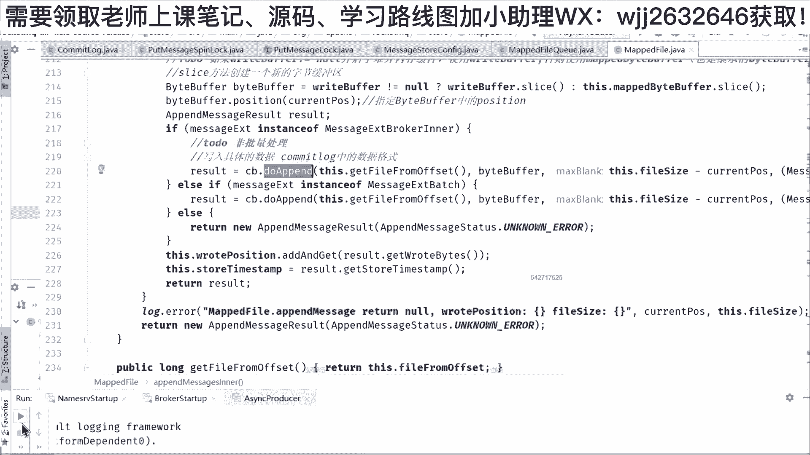

啊，我回到这张图啊，作为我们bro的话，是不是要把我们的这个存储文件要完成零拷贝，就是提高我们去写的一个效率。😊。

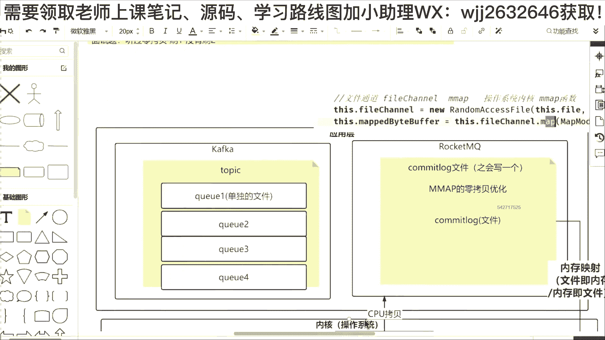

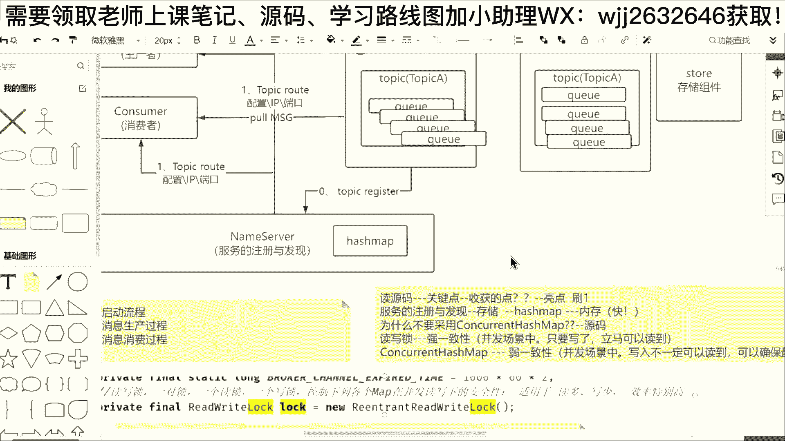

然后再站在另外一个点，这个角度的话，你去发消息有个主体流程，发消息的时候对不对？接受这一方怎么处理，一层层转跳，然后里面用到了countable future异步调用，里面也用到了锁机制。

因为这个地方它是一个文件，如果不用锁，它会有多线的安全，但是锁的话也不能用reent默认情况下面是CAS。😊，那除此之外的话呢，我去消费的时候，他还有更多的逻辑。😡。

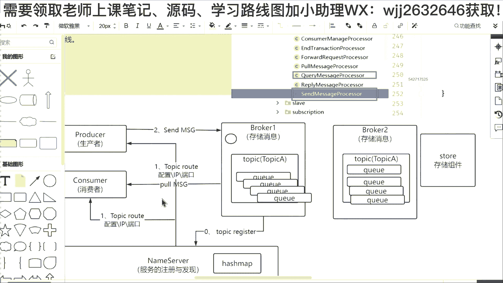

所以呢你可以看到像我去讲源码啊，这个地方我讲rock andq的源码。😊，里面呢就很多了啊，就是这个地方呢其实还有一个叫做定时任务的超时呃。

就是剔除超时name server的无状态化读写锁基于内存启动流程，对不对？里面有功能号的设计，存储设计消息写入流程M map自选锁对外内存机制啊，你在进行消息发送的时候，有对内选择，有 lock。

有建立客户端的时机，你在进行消费的时候，有什么有并发消费，它的整体流程，它数据怎么在里面落地的。😊，啊，还有包括我们的这一些常见的问题，因为消费当中容易卡死。😡，啊，除此之外的话呢，分布式事物怎么玩的？

😊，分布式师傅他的整个的源码流程，他的消息确认流程，它的回滚流程，它的回查源码的流程。😊，啊，所以这个的话呢，你才能去把这个runq整体的这个源码把它全部搞懂。😊。

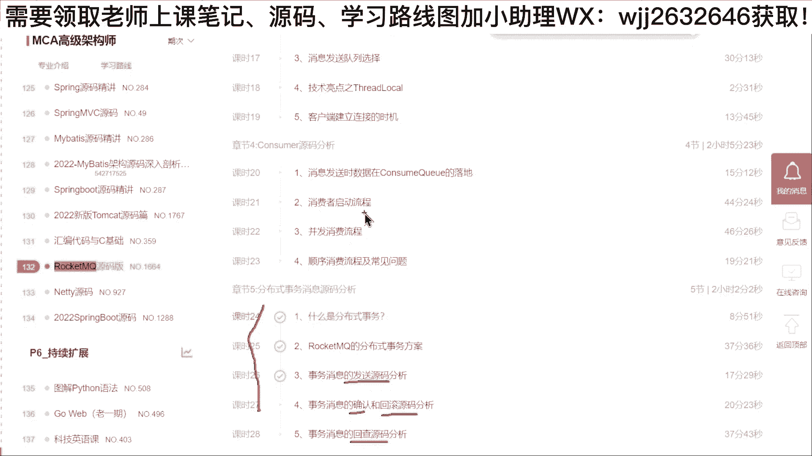

OK啊，所以呢你可以看到，这是我们MCA的一个高级架构师。为什么称之为MCA呢？啊，这是我们针对的是互联网架构，然后大厂的一个相关的一些推荐啊。😊。

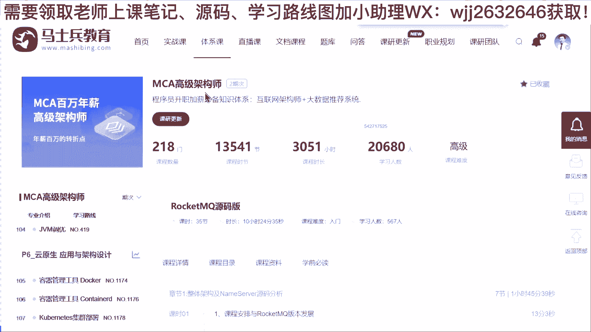

啊，里面是218门课啊，李老师在里面讲了很多，比例不少啊。你像不单纯是rockQ，比如说readdies。😊。

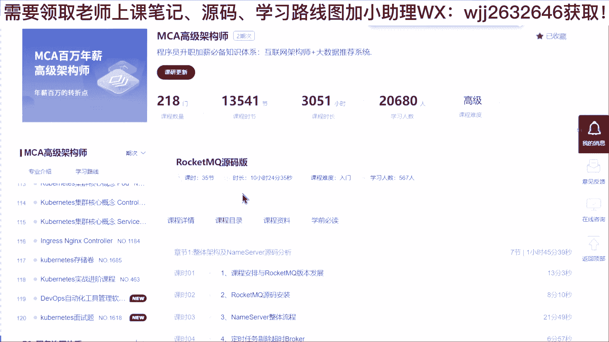

Read is。😊，呃核心技术与实战。😊，讲的数据结构。啊，数据结构讲的list set z set啊map。

然后高级数据结构讲的beat map讲的hplock lock慢查询拍 plan事物发布订阅，然后还有持久化机制，高可用哨兵集群缓存应用大厂问题设计实现啊，然后还有包括lay。😊，媒体大家知道。

Yeah。Yeah。雷体的话呢，这里面。我们讲了java的网络编程，就是lay。如果说你要从零门槛入门啊，就是可能前面网络编程知识很差，所以要补。一些java网的编程的知识。

就是scket啊s soet这些知识，然后再到NIO，再到late入门。然后四节课解读readdies的呃lateate它的底层原理以及它的处理流程。😊，啊，就是站在两个点，它的底层原理的支持。

它的整个线路的处理流程的这个流转。😊，O。吓。😊，所以这个当然了我们里面还有一张大纲图啊，就是MCA到底是怎么回事？MCA包括哪些东西？有位同学提出这样的一个问题，对不对？MCA包括哪些东西。

包括我们架构是启航，这个就是针对那些相当于基础比较差的。然后呢对数据库不太了解，对我们的java编程基础不不够了解，了解我们的网页开发不够了解，对不对？没有做过相关项目实战的。

包括没有接触过微复架构 cloud呢这个呢你可以去看看它如果说你有一定的开发经验，这个时候应该你要深入向性能调优。性能调优里面会分成这几个部分啊。

就是我们常见的my然后GVM n几个就是站在这些我们常说的GVM调垃圾回收my的话呢，要涉及到表优化索引优化，以及my排查，还有包括我们的一些啊就是里面要去。😊。

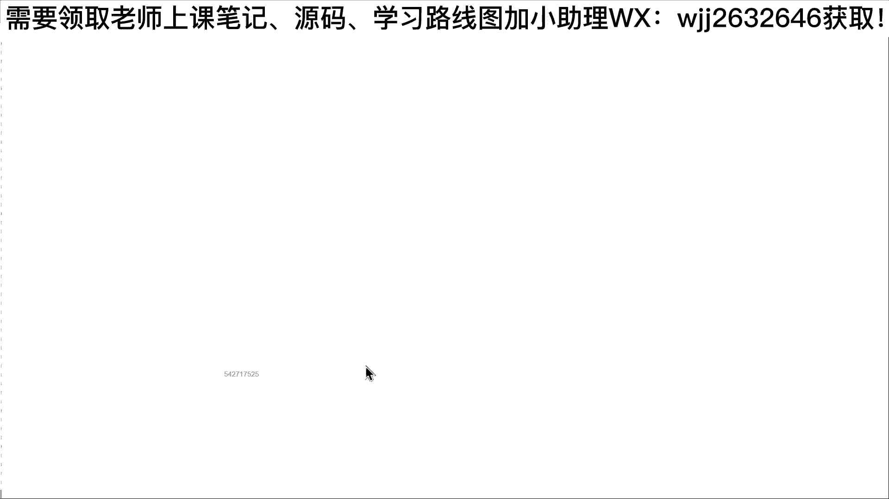

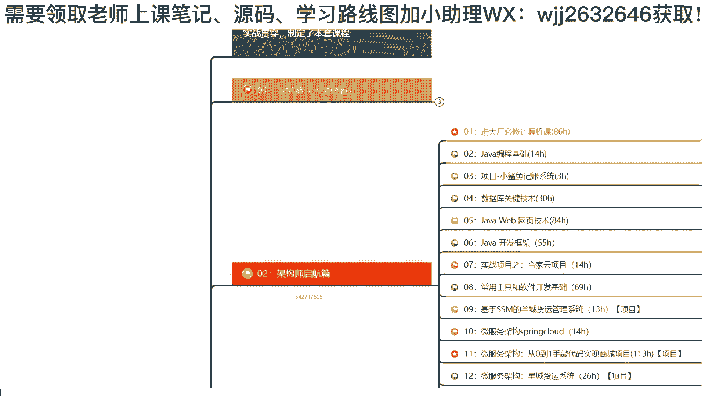

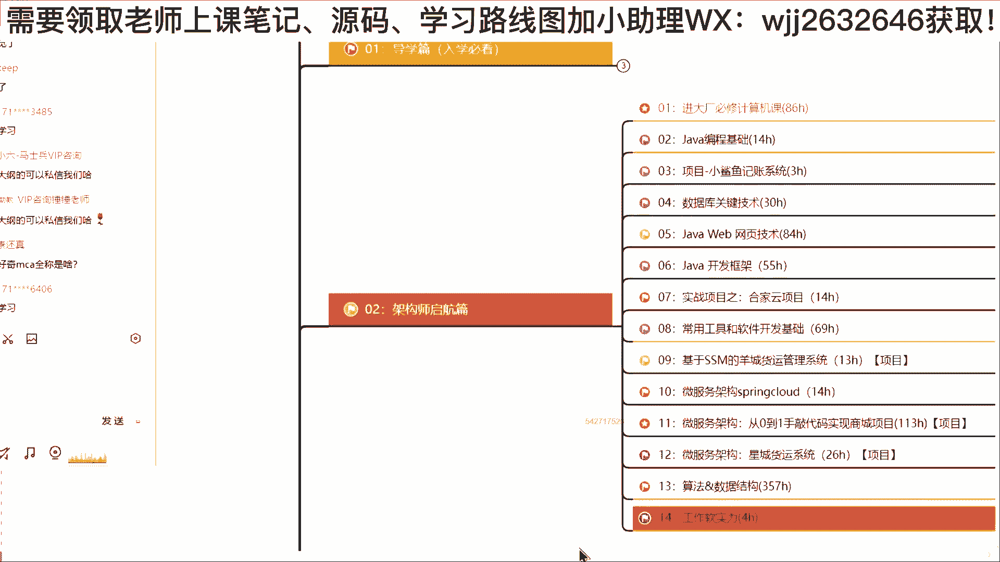

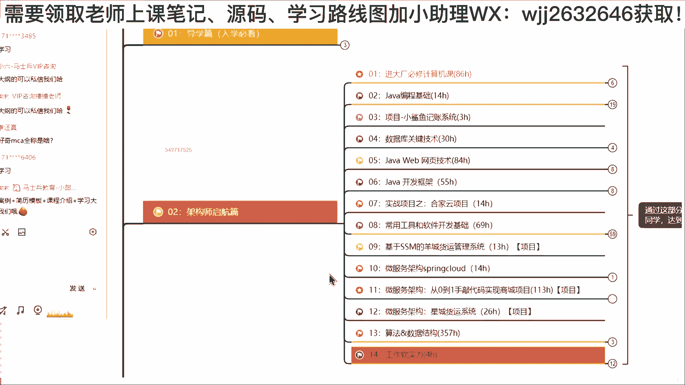

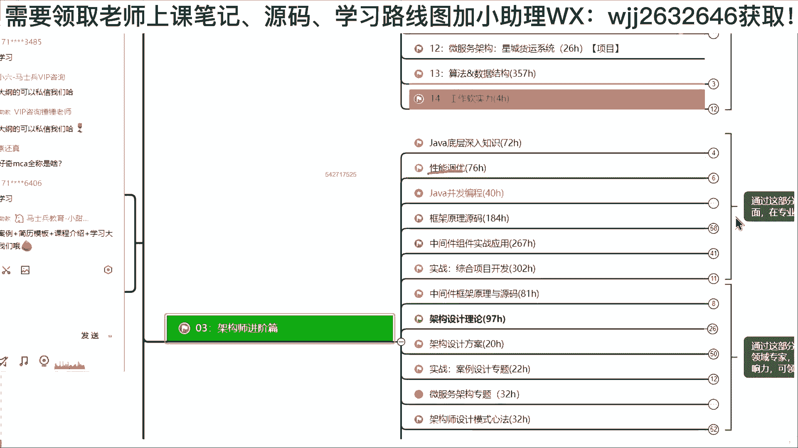

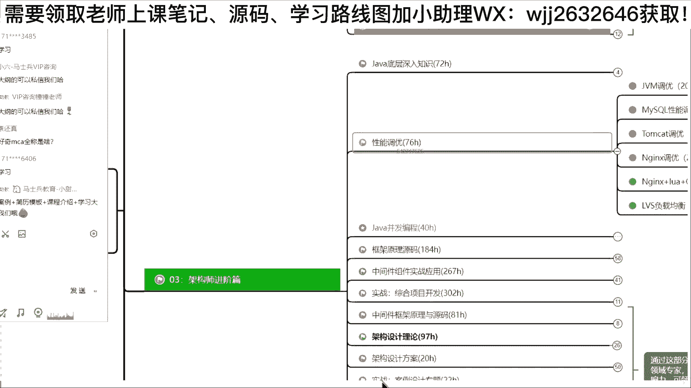

做一些性能优化。然后还有t的话要调我们的模型，要懂它的处理流程N的话，我们要实现动静分离啊，除此之外，并发编程它里面很多点都是优化。因为并发编程的话，锁是一个很大的优化。那除此之外。

线程池怎么配参数用哪种线程池。那并发容器今天其实讲了很多，今天讲的哈西 map那里面还有什么写池复制容器，还有我们经常所说的delayq这些东西要要了解要熟悉。还有像异步编程，今天我们也讲了案例，啊。

但是异步编程的话呢，这里面不单纯是con futurefu task，还有它的流转，它的每个方法，它的整个的一条线是怎么回事。那除了这个之外的话，你像框架源码。大家知道框架源码的话呢。

spring是核心。😊。

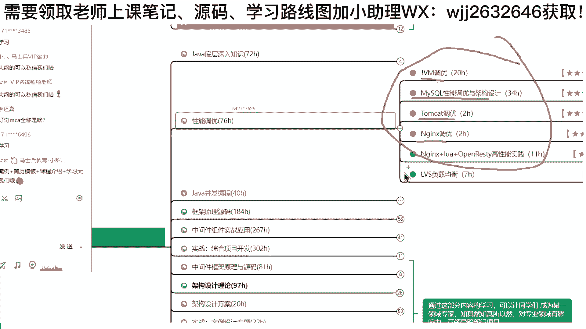

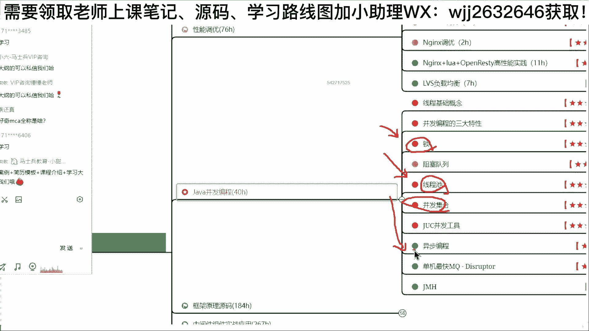

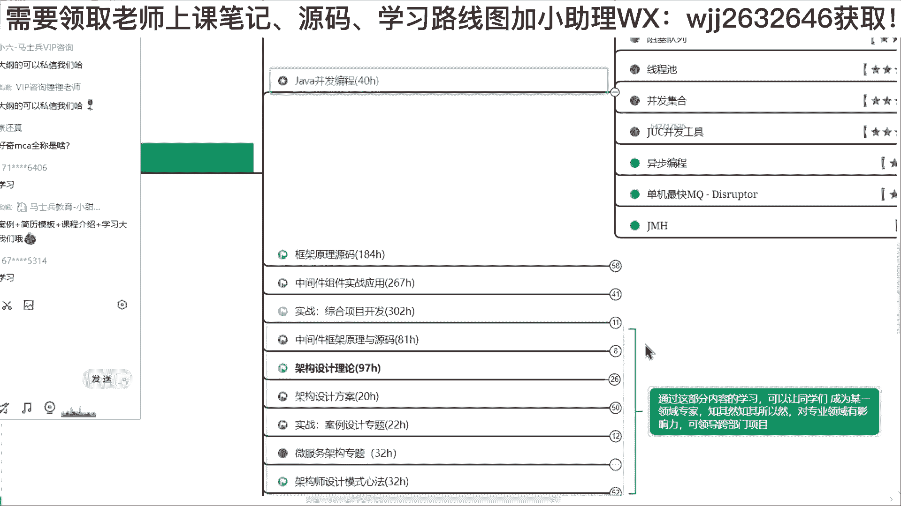

sring的底层源码有了spprintring源码之后的话，你再到MVC myies再到我们的这个spprint boot到cloud阿里巴巴这些源码，你就会轻松很多。还有像我们we webfls。

我们也会进行一个深入的实战。😊，OK然后再到我们的这个中间键啊，中间件的话，所有的现在所有的开发不可能不用中间件啊。如果说你写的项目里面没有用到reies。😡。

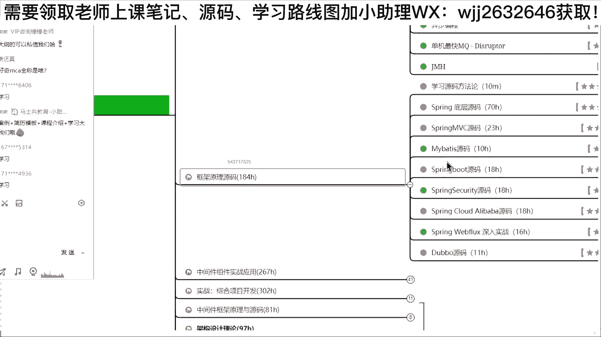

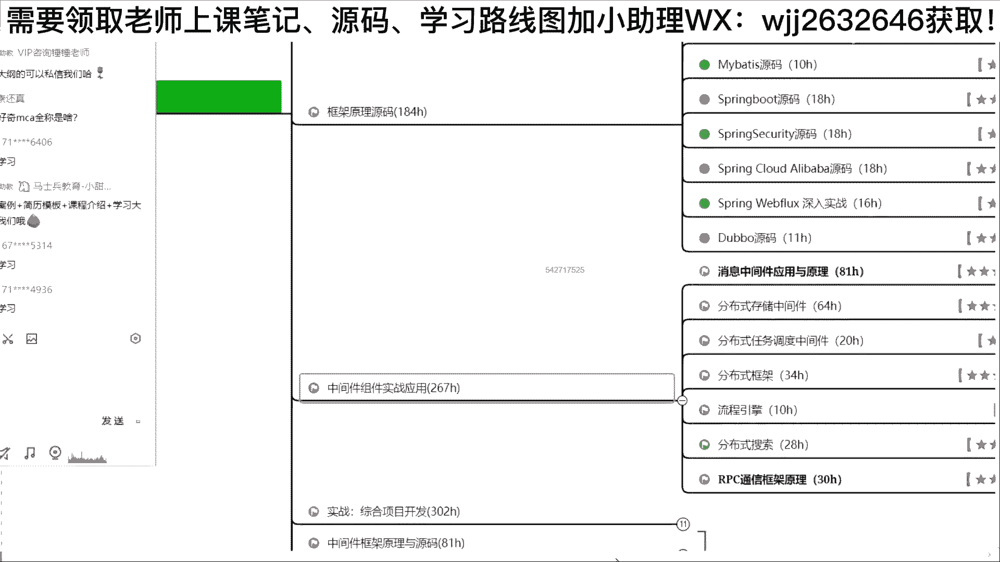

对不对？基本上我可以断定这个可能就是一个毕业设计的项目。😊，啊，redis或者MQ一般来说都可能同时使用。如果你res没有使用过的话，那这个项目你要建来有多low逼，对不对？你没有缓存啊。😡。

所以呢我们会去讲。😊，分布式的缓存中间件分布式的消息中间键。作为消息中间件的话呢，我们会讲很多种。😊。

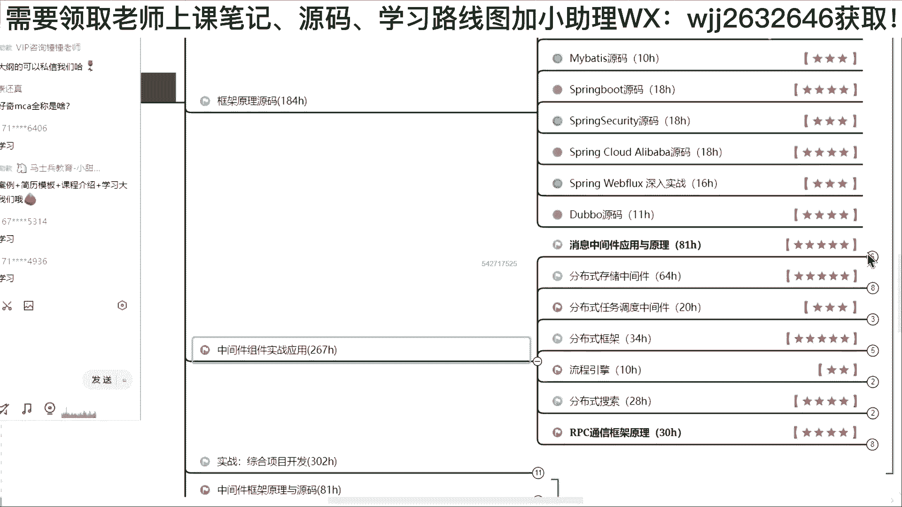

就是包括。最新的paer我们都会去讲，就是最老的rapq到卡夫卡到rapq，然后到paer，我们都讲好。除此之外的话呢，你像这种分布式的存储中心件。😊。

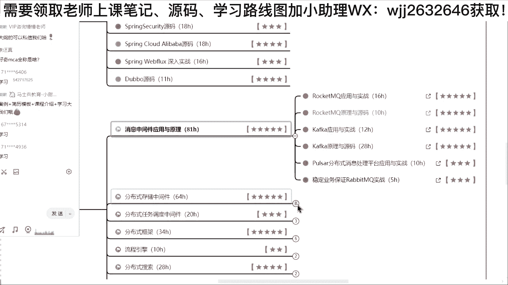

就是不不是我们的单纯的readdies啊。readies的话呢，我们。😊，基本上讲的比较透彻啊，然后再会去讲多级缓存架构啊，这是readdies。在很多场景当中。

你单纯靠分布式readdies也不一定能够解决性的问题。就是你的并发要求的更高的话，那这个时候你像我们经常所说的啊叫做Hcaash，还有像我们的这一个数据同步工具canal。😊，是什么呢？

就是mycycl在进行同步的时候，经常会用cana去捕捉mycycl的 bin lock的日志，然后进行一些数据的分析。😊，除此之外的话呢，像芒果DB啊，它会可以去完成我们的文件的存。😊。

楚还有像我们的一些什么命IO啊，faDFS啊，然后尼尔基啊这些东西我们都啊其实都已经讲过啊。除此之外的话呢，你像分布式电视任务调度啊，这个地方呢我们什么啊elastic job啊，然后叉叉 job啊。

还有像我们的分布式框架啊，分布式框架里面呢像double。😊。

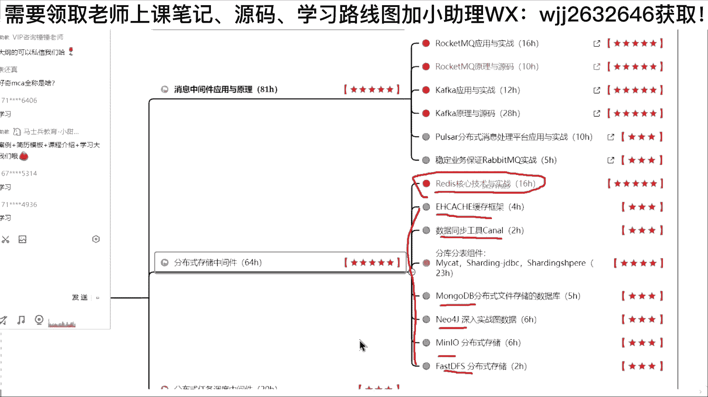

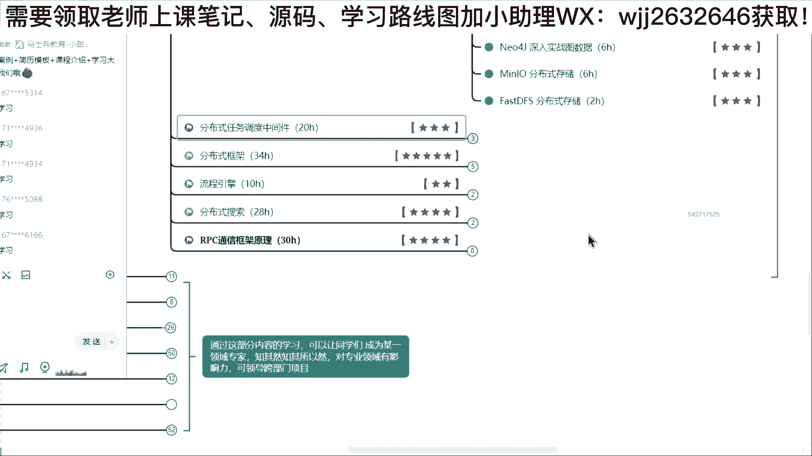

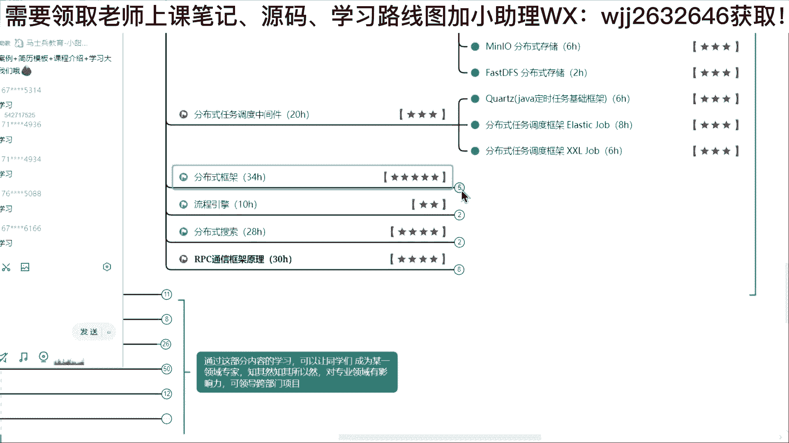