# 马士兵教育MCA架构师课程 - P135：找工作的心态该是什么样的？ - 马士兵学堂 - BV1RY4y1Q7DL

还有一件事，同学们很多同学啊有了面试机会之后，他会有一个东西叫虚。有多少人是比较虚的，给老师扣个一。就面试时候比较虚的。我给大家扭转一个心态，记好我这句话，这也是我之前上课的时候经常跟我们同学说的。

我找一下，我之前讲。将个手给大家总结了一个东西。嗯，找一下啊。当时面试总总结了几句话，可能我希望你能听好。这是我当时在讲面试突击班的时候，给大家总觉得我希望所有人能引以为戒吧，我把这东西。

站出来，大家写一下。

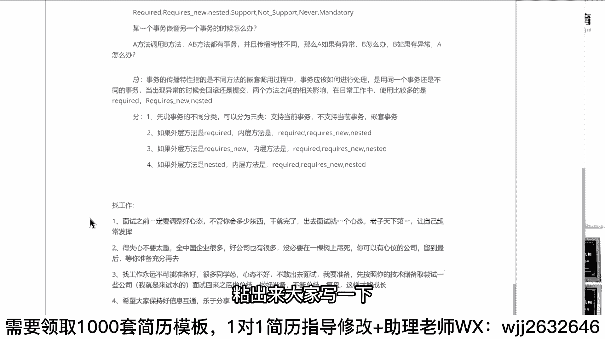

就找工作时候的心态。

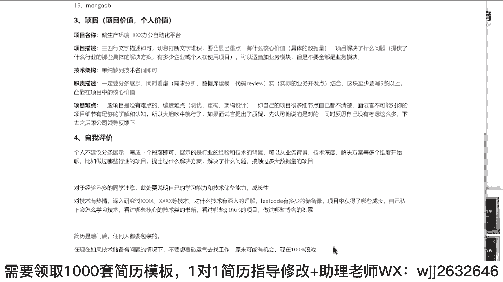

Yeah。Yeah。一说一句话。第一个，面试之前一定要调整好心态，不管你会多少东西，干就完了。面试的时候出去就一个心态，老子天下第一。

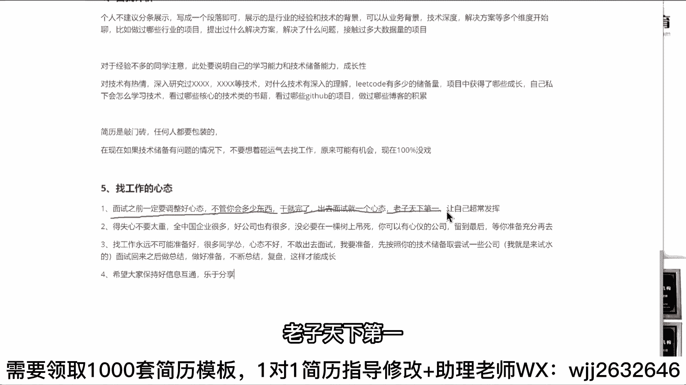

因为当你出去准备去面试的时候，那个时候你说老师我再看点技术吧，我再学点别的东西吧。那个时候已经于事无补了。所以你再说这些东西它是没有意义的，它是没有意义的。听到了吗？所以心态就是一句话，老子天下第一啊。

不管面试官多牛逼，我就是天下第一啊，不服咱们打一架，懂意思吗？还有一件心态是什么？得失心不要太重，很多同学去很多同学去呃找工作的时候，就会想老师我这家面试过不了怎么办？我觉得过不了是正常的。如果过了。

反而不正常。你要抱着这种心态，所以就是什么意思？得失心不要太重，全中国企业很多，好公司也很多，没必要在一棵树上吊死，你可以有心心的公司聊到最后，等你准备充分再去。😊。

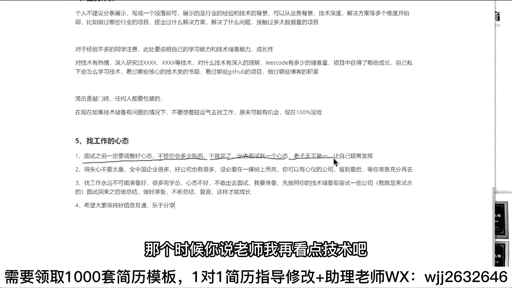

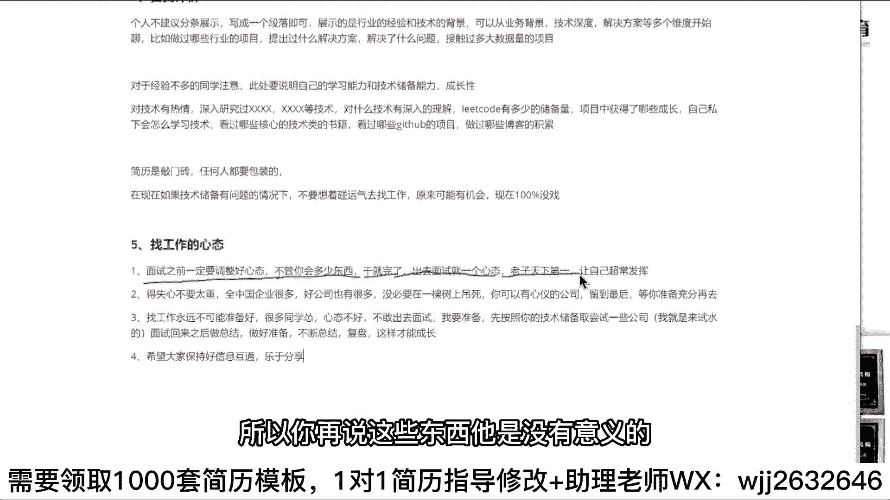

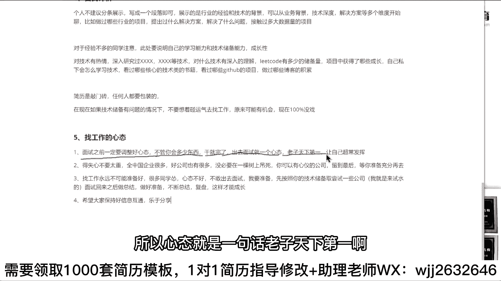

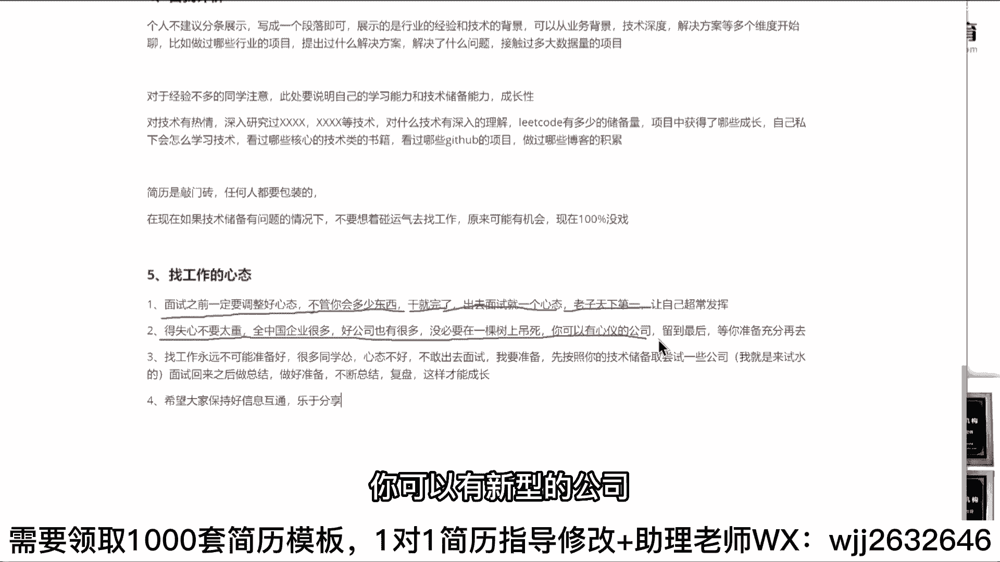

好吧，再一个找工作永远不可能准备好，很多同学怂心态不好，才不敢出去面试。我要准备先按照你的技术储备尝试一些公司。好吧，心态就是我是来试水的，面试回来之后做好总结，做好复盘，不断这样才能才能去成长。

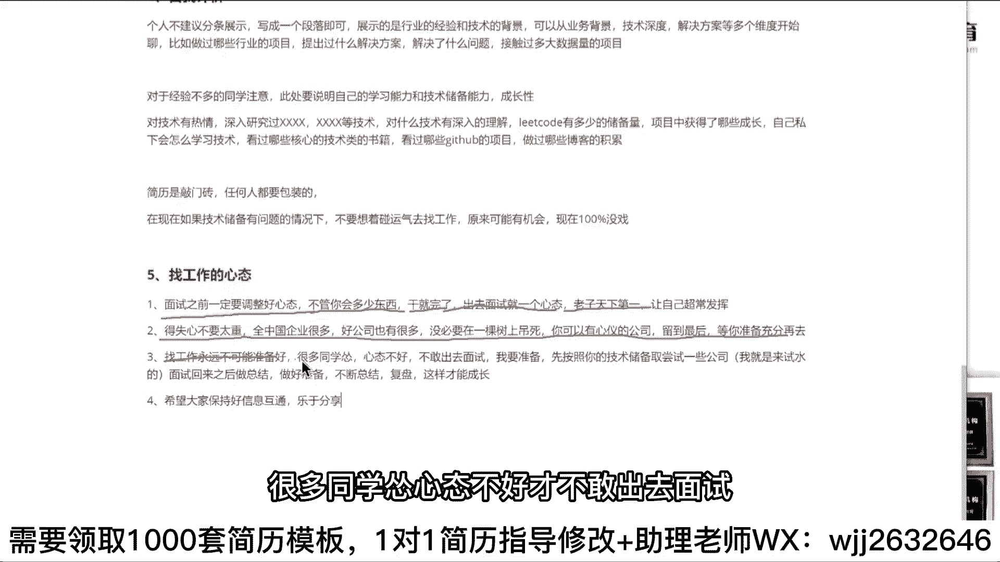

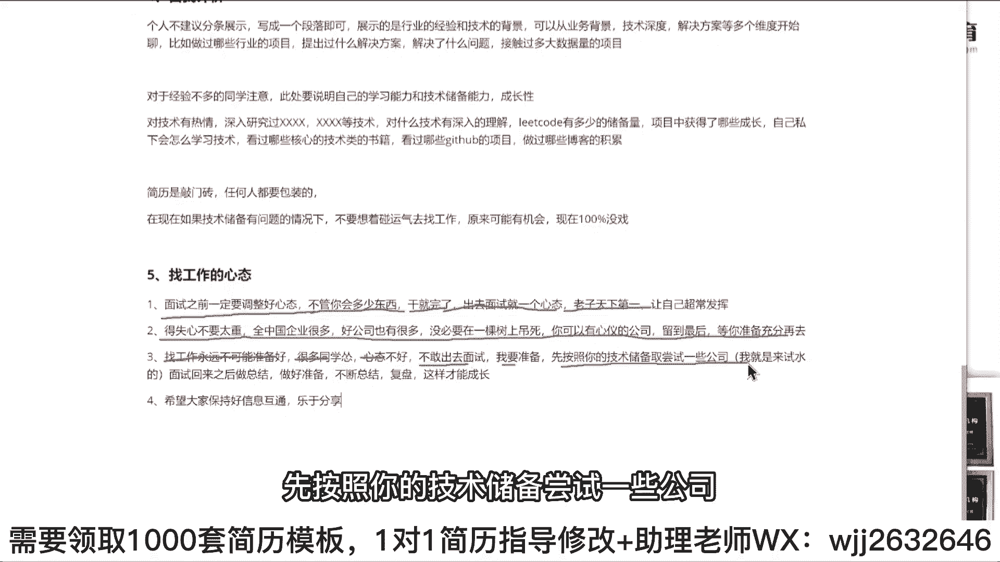

好吧，第四个希望大家保持好相我们的消息互通，乐于分享，可以跟我们的VIP说了。😊。

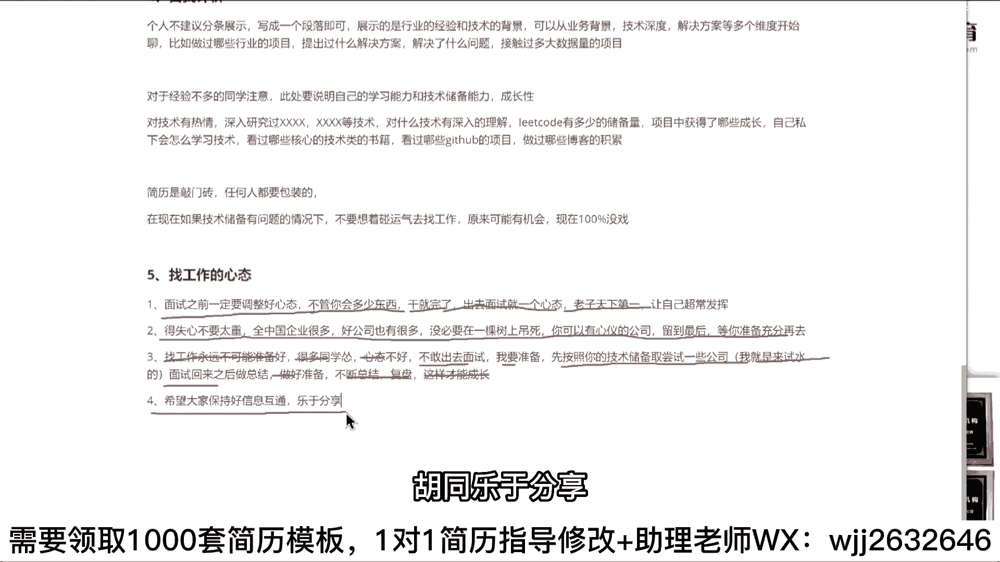

好吧。这个FLMY12同学说技术数平有问题，感觉跟您讲的夸大夸。

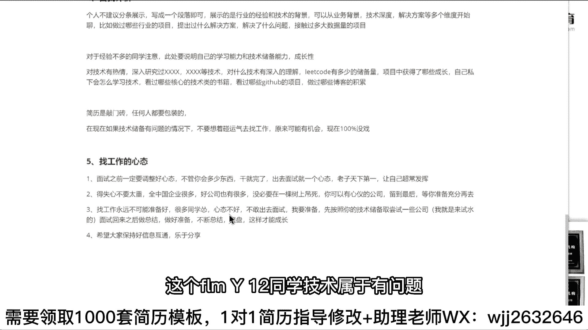