# 马士兵教育MCA架构师课程 - P144：JDK 类库常用的设计模式有哪些 - 马士兵学堂 - BV1RY4y1Q7DL

同学们大家好，接下来呢我们来看一道来自于百度的面试题。CDK内库常用的设计模式有哪些？对应的薪资呢是25到30K，对应的岗位是高级开发工程师。😊。

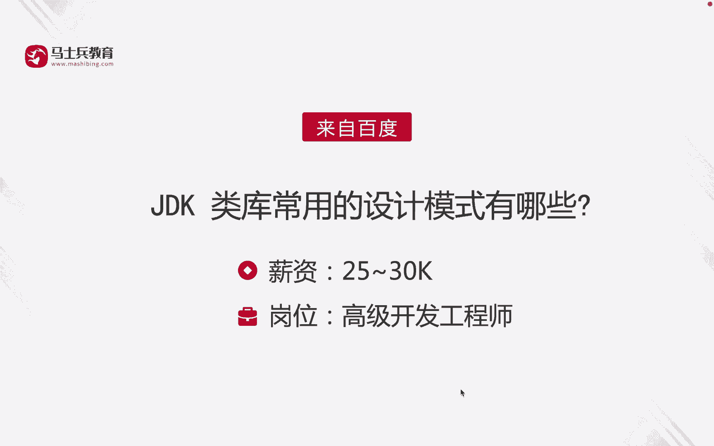

那么我们先来看第一个抽象工厂模式。在这个ZDKZDK类库当中呢，有一个document build factory这样的一个抽象类。它有一个方法就叫做new instance方法。

注意这个方法它返回的其实是一个什么呢？一个工厂的实力啊，也就是它的一个啊具体的一个实现类啊，这是我们说抽象工厂模式，然后呢还有建造者模式啊，那么stream builder。😊。

这个类呢它就用到了监测者模式。那么它是一个final类，它其中有一个判断方法啊，那这个方法呢它是接收一个什么接收一个啊字符串。然后呢，这个方法就是啊根据现有的字符序列和追加的这个字符。然后呢。

通过这个系统的拷贝方法去生成一个新的字符序列。😊。

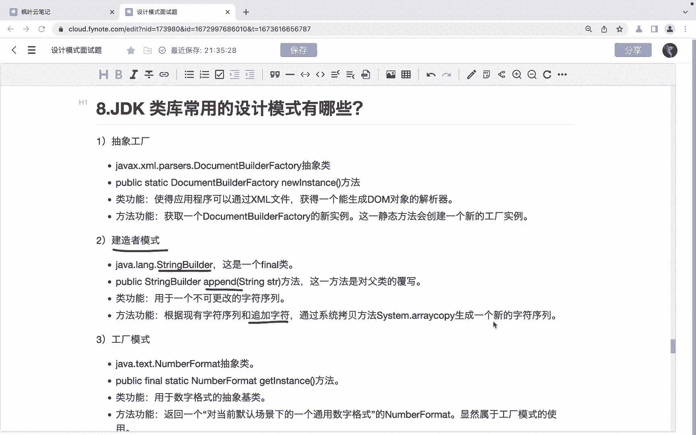

啊。然后。还有工厂模式。工厂模式的话呢，这里边它有一个number。

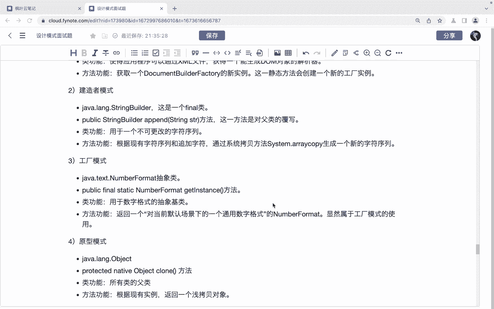

formar这样的一个抽象类，它有一个方法，get instance方法，返回的是一个number of类型的子类啊，那么我们可以通过这个get instance方法啊，然后呢来去什么呀？

获取这个number format抽象类，它的一些子类实现啊。好，然后还有就是原形模式。原形模式的话呢是我们可以通过这个object类它的克隆方法啊，来去根据现有的实例呢来去。😊。

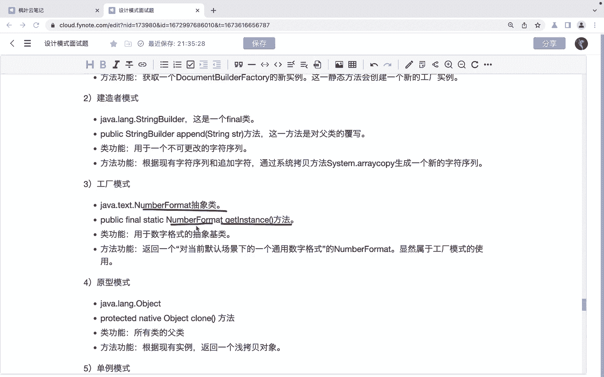

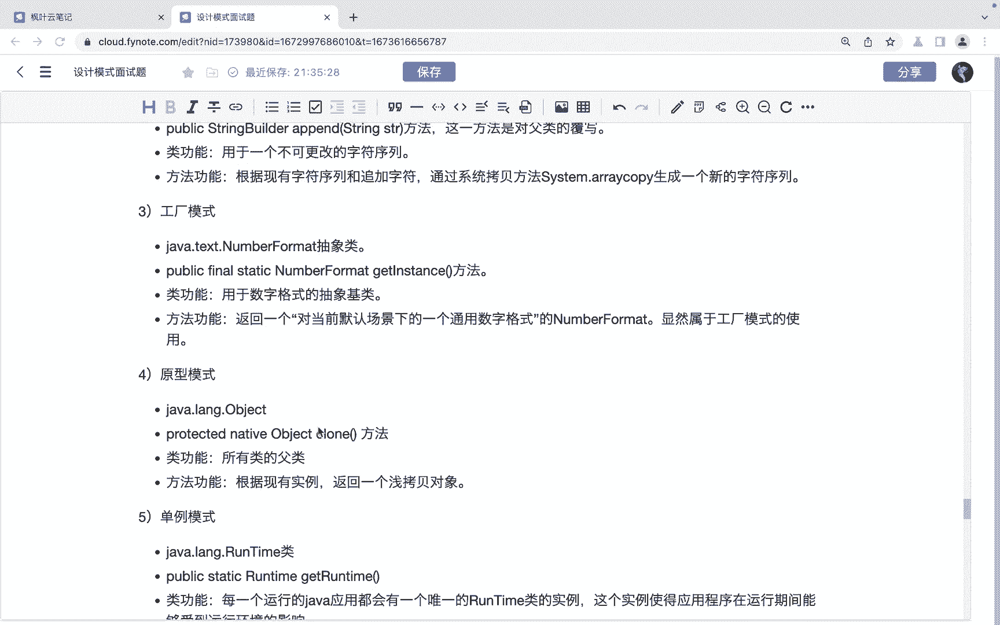

克隆一个啊前拷贝，返回一个前拷贝的对象，这是原形模式。

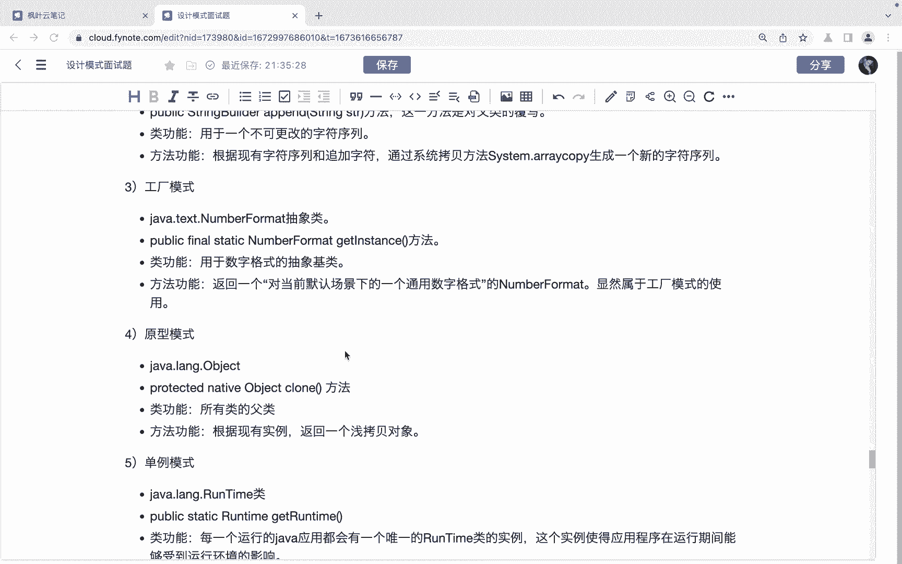

还有一个单立模式。单列模式的话，这里它有一个runtime类啊，runtime类。😊，它有一个get轮胎方法啊，那么它的作用呢是。返回一个当前和当前java应用关联的这个runtime对象。

那么每一个运行的。java应用呢它都会有一个唯一的runtime类的一个实例。

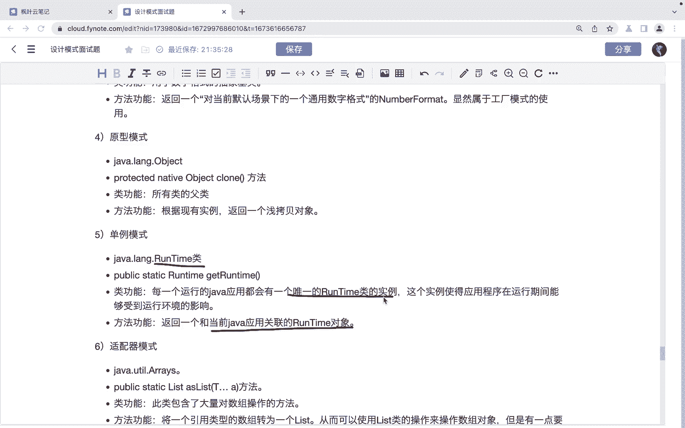

这是大力模式，然后再来看就是这个适配器模式。啊，识配机模式。这里边呢有一个俄瑞斯这样的一类啊，那么这个类呢它其实是一个数组工具类啊，包含了大量的对于。数主操作的方法，它有一个as list的这个方法。

那么这个方法呢，它其实是它的作用呢是将一个。传入一个什么传入一个啊数组，把它转为一个list。啊，转为一个list。那么这个里边呢就是我们可以使用这个通过这个方法啊。

我们可以使用list类的操作呢来去操作速度对象。但是呢是不能使用这个ADDre的一些操作的。因为返回的list的它的底层是基于数组的那数组结构是不能够更改的啊。

所以呢这个list类呢啊大家可以看看作是一个适配器。😊，那么通过这个适配器呢，对数主的直接操作呢，我们把它变为一个间接操作。

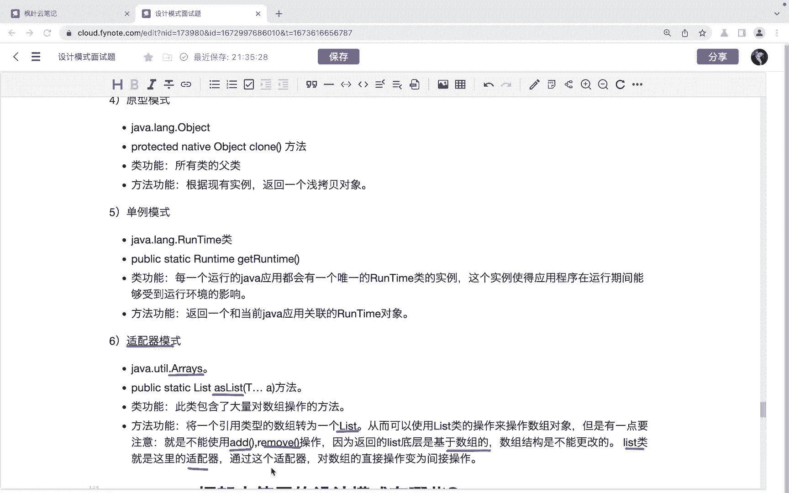

OK那这个就是这个适配器模式啊，那么以上呢就是CDK内库当中的常用的设计模式。我们这里边呢介绍了这个6种啊。好，那么。😊。

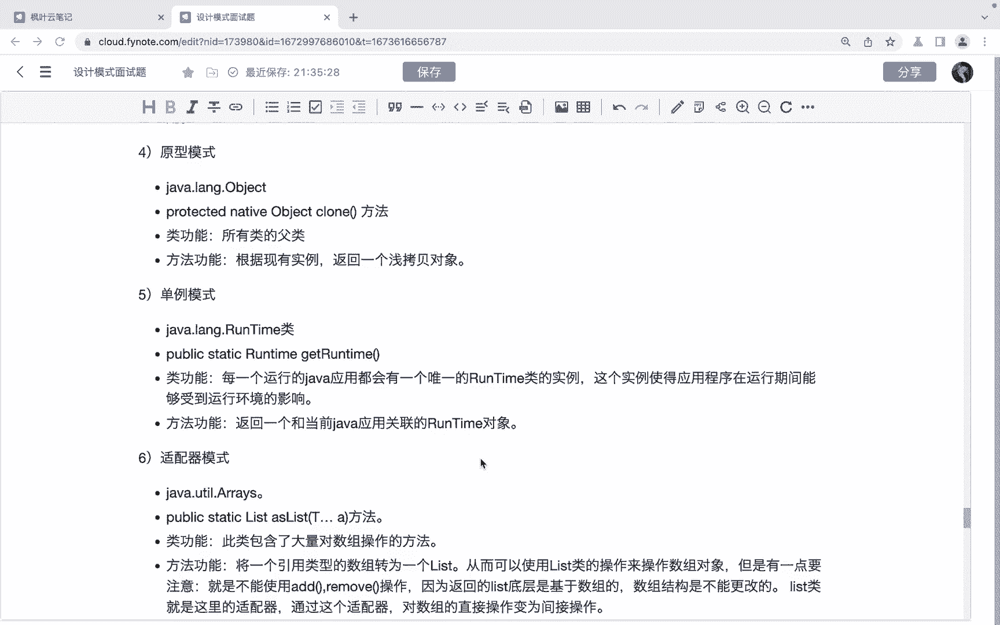

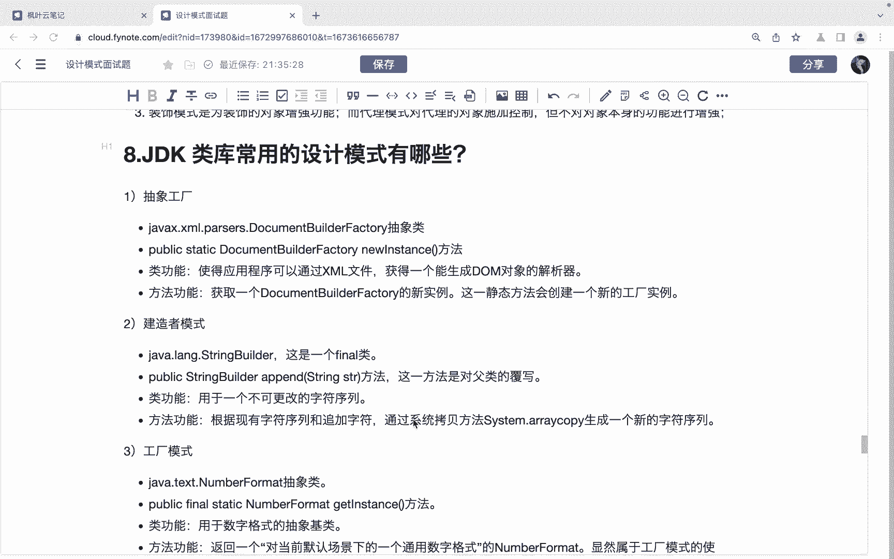

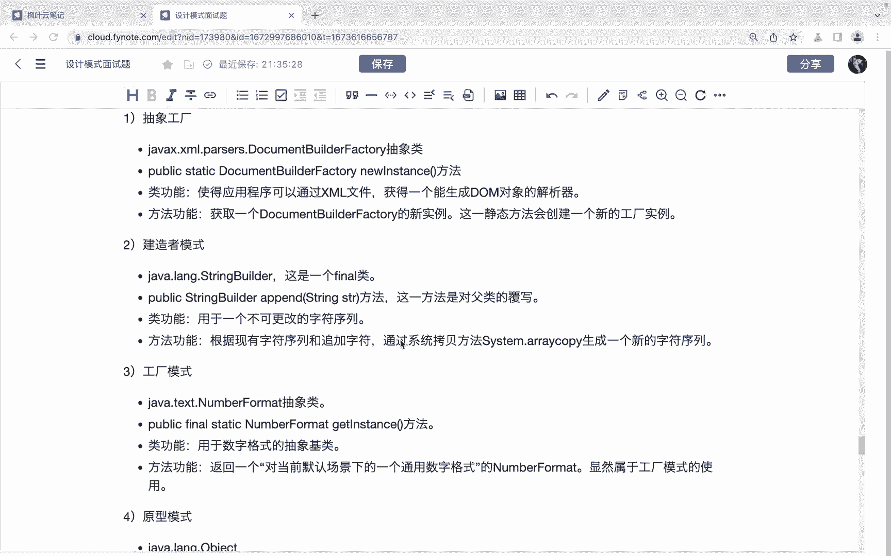

上面呢就是关于这道面试题的讲解啊，希望呢能够帮助到同学们。

