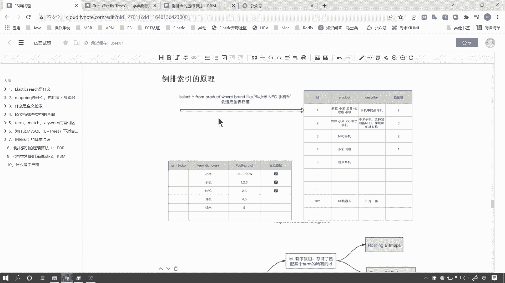
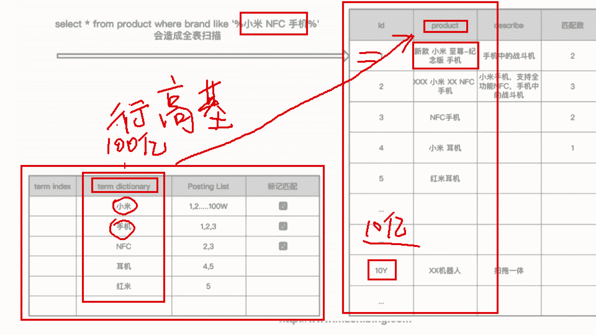
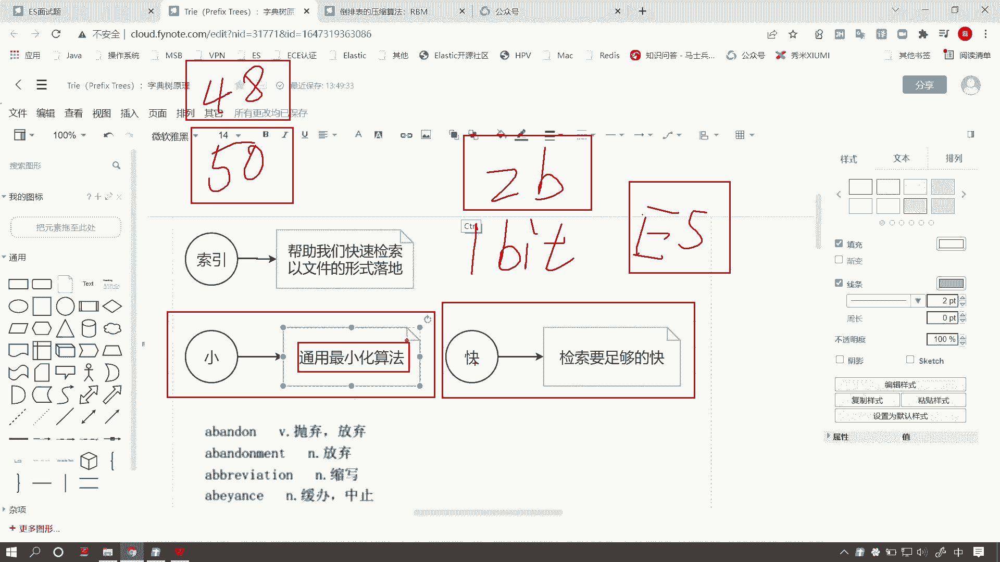
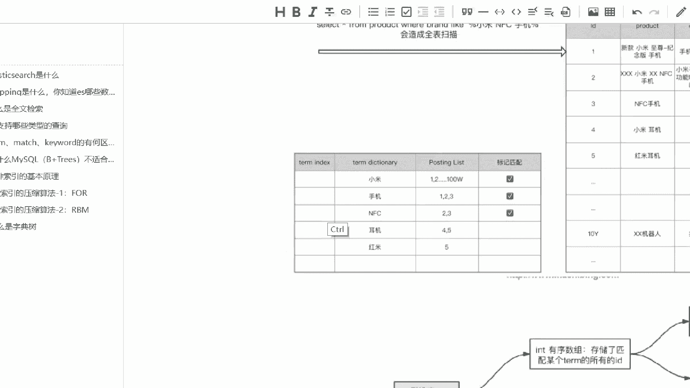
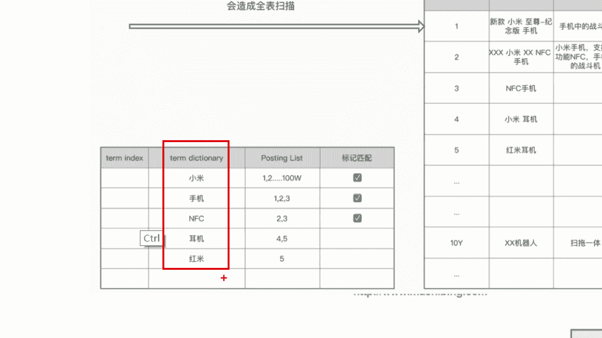
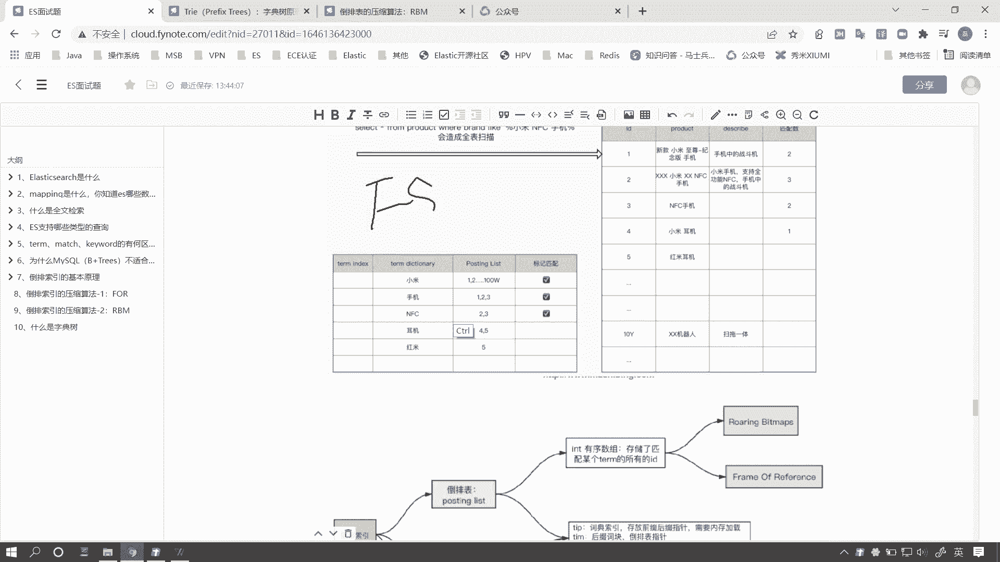
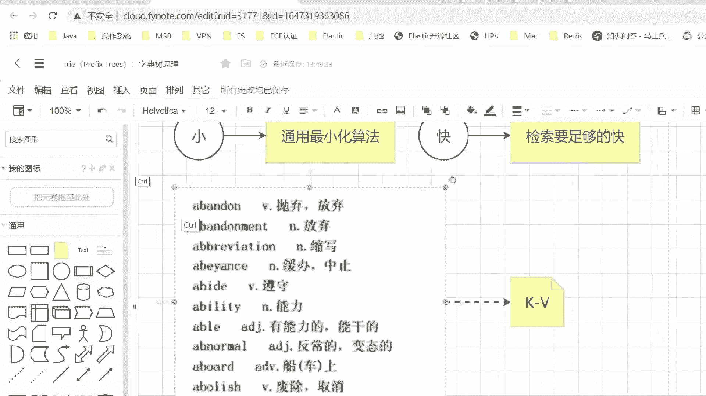
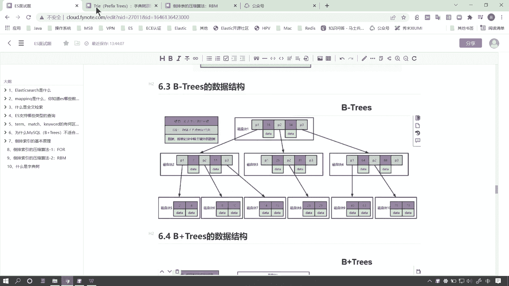
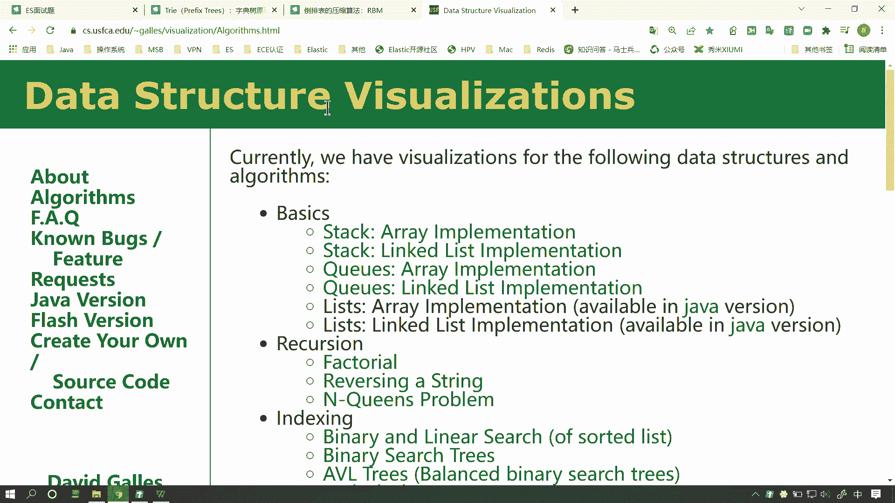
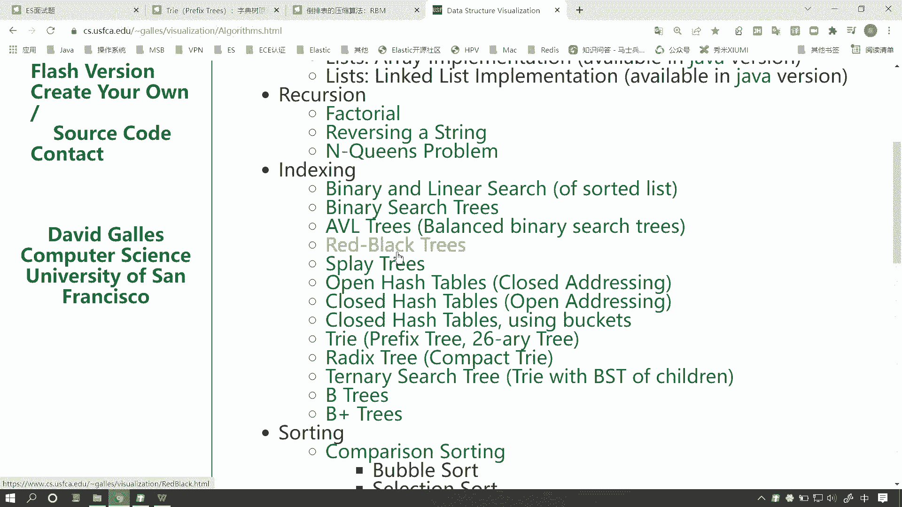

# 马士兵教育MCA架构师课程 - P157：字典树 - 马士兵学堂 - BV1RY4y1Q7DL

好，我们来看下一个问题。什么是字典数？啊？这是一道来自百度的面试题，对应的岗位薪资呢大概在30K左右。我们来分析一下面试官为什么会问这么一道问题。其实倒牌索引的底层的数据结构FST啊，就是基于字典数啊。

也就是前缀数，它的变种衍生而来的。O那么下面我们来看一看这道问题，我们如何来回答。好。回答这个问题之前，我们先回到之前一个问题啊，我们在讲倒排索引原理啊，基本原理的时候呢，遇到过这样一个问题。

我们稍微放大一些好。

我们讲到这个图的时候呢，实际上是把全文检索啊基本的过程呢给大家讲明白了。那么右边作为原始数据呢，我们首先呢有一个前提呢，就是这个数据有一个很大的数量级。比如说10亿啊，我们的单位是亿。好。

那么如果我们在某些文本字段上做检索的时候，无非就是面临一个扫表的问题，一个精准度的问题是吧？我们要做模糊查询。好，那么首先我们抽象的把这个二维表格作为了一个盗牌索引，它首先只解决了一个问题。

就是把模糊查询呢变成了精准查询。什么意思呢？好，我要包含以上若干信息呢。我这个字段呢不能只能不能就是说准确的就是说做一个eccels查询，不能说去做等号查询。所以说啊性能会非常的差。

那么倒牌索引呢无非就是把这些啊拆分成成一个一个词像。那么如果说如果说我这个字段里边的词项特别多，又没有重复，也就是所谓的一个高级字段。那么这种情况下呢，会面临一个问题。

我的term diction呢就是存降子典，有可能数量级是大于我的原始数据，它的数量级的。比如说这个是10亿，那么有可能我这有100亿个行，对吧？这都是有可能的。啊，当然这是一个极端的情况啊，那么。

这样的问题会导致我们呃思项字典在做便历的时候，或者在做检索的时候呢，又面临一个更啊更复杂的这个性能问题。

怎么办？好。带着问题啊，我们来看什么是字典数。首先呢嗯我们要我们理解这个索引啊，它是帮助我们去做快速的检索和查询的是吧？那么要实现这个目标呢，其实我们首先要追求两个最基本的要求啊。

那么其实这个也是我们软件行业呢自打诞生以来啊，所到目前为止啊，不断在追求的一个目标。所谓的小呢就是通用最小化算法啊，我们能用一个比特来存储的。啊，这个数据我们坚决不用两个比特。好。

不要觉得我们这样抠细节啊，其实这个和性能啊和ES的性能高低是有直接的关系的。当然，不光是ES啊，任何任何软件你用到的readdis啊，或者说这个这个其他的一些中间件呢啊都是一样的。

它都要遵循通用最小化的算法。我们能用最更小的空间来存储。我们坚决能省得省。它不像我们在嗯可能在做业务开发的时候，我们关系型数据库my circlecle是吧？你起一个名字，比如说我的name字段啊。

你随随便便就给了50个字符的长度。那么可能大家觉得这个50个字符的长度啊，是足够我们用了。但是大多数我们比如说起一个name可能就是4个字符啊或者8个字符就够用了，你没了足够用就开辟了50个字符的空间。

但是只要你啊只要你不管用或者不用，我们当前都要占用50个字符的空间啊，当然了，这是可变的，这是不可变长度啊。好，扯远了，咱们首先要理解，咱们要用最小的空间存储最多的数据啊，这是通用最小化算法。

那么快呢就是我们检索的速度要足够快。好，带着这两个啊带着这两个信息呢，我们往下看啊。

那么我们把当前这个是从英汉字典里边截取的一小段啊一小段内容。那么我们以它来代替什么呢？来代替我们当前这个思想字典，我们可以把它理解为就是英汉字典的英文部分呢，理解为这一部分，这是我们要存储的信息。好。

但是有点区别啊，这个英汉字典里边是有只有value的，就是我们这个是key，后边有个value，咱们先不用管它value。其实在。

嗯，这个慈项字典它的最终存储方式呢是FST里边也是有valueue的啊。但是咱们先先不用管，先来看字典数。好，那么我们现在要做的什么呢？要把当前。

这一段啊就是这一串英文单词，我们做高效的存储。好，那么我们当然这的数据太多啊。如果说英汉词典可能有比如说上10万个单词啊，甚至呃因为这是英汉词典，就是说可能就是这么一个数量级。

那么我们有可能存储的是全国人啊，外国人的姓名啊，比如说全国的这个人口人口普查有60亿啊，现在可能是70亿啊，70亿个人的姓名啊，如果全都是英文字母的话，它是不是一个非常庞大的数量级啊。

咱们先不用管什么70亿啊，咱们就看1万如果说10万个英文单词，按照字典序来排，什么是字典序呢？这其实就是字典序啊，我来解释一下啊，有人可能还不知道。那么我们来看啊，首先如果一个字母A。

它一定是排在第一位的。好，只要是我们来看啊，当前前两个字符呢abbandon放弃。那么第和第二个单词是有一个公共前缀的。abbandon后边有个MNT，那么MENT就排在后边。

也就是说呢我们第一个字母一定是首先呢哎。

我们首先排序呢是按照第一个字母来排。第一个字母是A的，一定排在第一个字母是B的前面。如果第一个字母相同，看第二个字母。好，我们来看第二个字母，第二个字母都是B。那么如果说第一个字母都一样的前提下啊。

我们来看第二个字母，第二个字母是B，一定排在第二个字母是C的前面。如果第二个字母都一样，我们来看第三个字母。好，第三个字母，我们这儿就有一点区别了啊，我把这个。重新画一下啊。好，我们来看第三个字母。

第三个字母，我们看第一个是A，第二个是A，那么第三个就不一样了。第三个是B，那么B一定排在A后面。好，第二个字母，第三个字母仍然一样。我们看第四个。没有的话一样的话，我们再看第5个、第6个、第7个。

直到看第八个啊，空白排在最前面。啊，后边是任何字符都要排在后面，这个就是字典序。其实我们在很多比如说电影的演员表，他们都是按照字母呃字母的顺序啊，其实就是按照这个字典序来排的。好，知道了字典序之后。

我们再来看当前如果我们要存储这一系列的英文单词，那么如果我们为每一个单词开辟一部分空间，是不是会造成很多浪费，为什么呢？你想啊如果这个单词有10万个。假如说呢这个10万个都是以A开头呢？

或者说里边有9万个以A开头呢？那么其实这个字母A这个字符A，我们是不是要存储10万个。是不是非常浪费啊？其实甚至说像这种你看完全重复的这些abend和abment。

那么这两个词呢其实就有6个7个字符是一样的。那么我们有必要把它存储两次吗？其实没必要啊，我们可以把它作为一个公共的前缀来存储。那么这个也就诞生了叫前缀数。其实叫字典数啊，那么它也可以这样叫叫profi。

啊啊他两种叫法都是一样的。好，那么我们往下看啊，假如说我们要存储这么一个英文单词，我们下面呢来演示一下。呃，我这儿呢假如说这个t拼写错了啊。好，假如说呢我们下面呢就是这是一个字典啊，这是一个词项字典。

就是我们倒派所用的词项字典。我们就以四个为例啊来演示一下它存储的一个过程。好，首先呢我们要存储第一个term啊，这就是一个词项嘛。Okay。叫MSB。那么我们之前讲过什么呢？讲过这个。🤧呃。

B数和B加数啊，那其实这里边的节点的概念是一样的啊，节点里边会存储很多信息。那么。那么这个箭头啊这个箭头它就叫度。它就叫杜，咱们在。cer啊这个这个前缀数啊，carry啊，这个怎么读的？好。

这个前缀数里边呢，我们用箭头来表示它的度啊有点粗度。因为它是往右出出去的嘛，出度。好，那么当前的这个零呢就代表一个节点，这个节点里边也是存储的一些信息呢啊。比如说它是一个起始节点是吧？

那么我们起起始节点可以标个号，零这个节点呢它有一个出度啊，我们来看其实其实呢你像这个每个节点呢可能有多个出度是吧？指向多个子节点啊。那么我们当前输入零节点。

那么它的第一个出度好来存储第一个字符MSB的第一个字符就是M啊，然后那么它指向它的一个它给的节点啊，就是目标节点。好，我们称之为一给它标个号。那么一呢有一个出度叫S。

就是存储当前MSB的第二个字符，同样B第三个就是第二个第三个节点的出度。好，因为B是最终字符，所以我们指向一个final节点。啊，就是中止节点。我们用这个粗一点的这个边框来表示啊。好，那么我们来看啊。

当我们去存储MSBTECH的时候。好，同样我们可以在这个数上进行扩展。那么前一部分实际上都是一样的。MSB啊MSB到这儿是一模一样的。那么当输入到T的时候，这个也就是它的第四个字符啊，我们。

这个字符那么到这儿为止，到这儿呢，就要在它原本的这个终止节点上呢去引出一个出度。然后我们来存储字符T。好，然后我们接着往右看啊。好，然后最终呢就是TECH啊一个一个指向指向最终节点。

当H是呃这个当H是最后一个字符的时候呢，我们指向该种节点。好，终止节点有两个啊，当前这个数呢有两个终止节点。好，这个终止节点的作用是什么呢？啊，其实我我待会儿给大家演示一下啊。

这个终止节点是用来判断当前是不是啊存储了一个完整的字符串。好，我们来看第三个词项啊，就是MSN。好，那么这儿就有点区别了。同样MSB和MSN的这个公共前缀是什么呢？

首先呢前两个字符呢有一个完整的公共前缀。到第三个词项的时候，那么公共前缀变成了MS。好，我们看到这里边呢，其实应该明白一个道理啊，就是说我们每一个词项在输入下一个词项的时候呢，都要判断我们的公共前缀。

最大公共前缀。前两个词项的最大公共前缀是MSD到前三个的时候，他们三个有无公共前缀就是MS好，MS也就是说当S指向下一个节点的时候。往下看啊，当S指向下一个极点的时候，它们就会产生分支。

MSN也就是S指向这个节点，它就会有两个出度。第一个节点就是指向MSB这个数的分支。而这个N呢就是一个指向的另一个分支O并且N指向的这个节点也是一个final节点。OK好，以此类推。

我们输入WLTECH的时候。好，那么这个就有明显的区别了。什么区别呢？我们看到MS开头的啊已经结束了。那么到WLTECH的时候，它们的初始节点都不一样了。第一个字符都不一样了。那这个时候呢。

其实呢我们当前零这个节点其实就是entre啊，初始节点。那么零这个节点呢我们往下看啊，它初始节点就会产生一个。第二个出度啊，其实这是一个出度，这是一个出度。出度我再写一遍。好，产生了两个分支。好。

那么也就是说其实M这个里边有它的公共前缀全在这个分支里边。而W的公共前缀全在下面这个分支里。好，当然了，咱们WLTCH往下存储，大概就是这个样子啊，那么最终指向一个终止节点。好。

那么下面啊呃我来讲解一下这个数呢，它有一个呃什么样的特点呢？首先呢是最大限度的来保证我们前缀的复用率，比如说前两个单词，比如说前三个单词，如果像我们当前这种情况，我们在存储这种大量有重复字符的时候。

比如说那么AB如果有1万个以AB为前缀的时候，我们只需要指存储1个AB。当我们有比如说有5000个以ABA开头的啊三个字符重复的这个公共权缀的词项的时候呢，我们同样也只需存储一个。

并且这个AB也没有浪费。好，那么这样的话，我们就最大程度的保证了前缀的一个复用率。其实这里边还有问题，因为我们没有公共后缀，我们来看这个问题。好。往下。好，也就是说呢。

其实WLTECH和这个上面MSBTECH那么这两个分支呢，因为初始啊就是第一个初度第一个字符都不一样，所以初始节点这个NJ节点呢产生了两个分支。但是呢你看这里边呢。

其实还有一部分字符是重复的TECHTECH好，那么这个就是咱们后边要说的FST了啊。也就是说，在前缀数上做优化啊，同时我们要共享后缀，并且我们还要存储value值。因为我们要存储的这个值呢。

它还有什么呢？他还有个value60呢，是吧？也就是说我要我们要存储的这些信息。好，那么这些信息啊在FST里边存储着什么呢？好，我们后边再说啊，呃，下面的话我来演示一下。

就是用一个网站小网站来演示一下这个字点数，它存储和便利的过程。我这儿呢有一个网站啊，这个网站咱们之前也用过。

好，我们找到这里边呢有一个。

啊，在这呢啊，叫哎在哪呢？

啊，在这儿呢啊叫四点数。

好，字典数啊，我们尝试把当前我们的这个例子呢一个一个的去录入到这个字典数里面。

inert好，我们来看这个过程啊，放大一些。

它是不是创建了第一个分支MSB指向一个终止节点啊。那当然这个终止节点，它这里边呢实际上是用了一个绿色的填充颜色来表示当前它是一个final节点。好，那么我们来接着来看啊，当我们存储第二个磁项的时候。

诶。第二个事项MSBTECCH我把这个速度调慢一些啊。

好。没有。好，看第一个第一个节点哈，发现第一个出度是相同。MSBTETECHMSB前三个出度都一样。好，我开始产生啊，在这个终止节点后往后延伸。

TECH。好，当初度变为H的时候，判断当前指向的是中值节点标率。OK好，我们来看第三个事项MSN。

好，来，我们输入MSNreer。好，第一个出度相同啊，这个空的是ent垂节点啊，初始节点。第二个相同。第三个不同了，那么产生了第三个啊，就就是S这个节点呢。因为它的出度不同，所以产生了第二个分值。

也就是N指向了一个终止节点，它也是一个final节点了。好，我们来看最后一个啊。

好，最后一个呢，首先初始节点，因为第一个字符都不一样，1个M1个W，所以初始节点就产生了第二个出度。那么也就是说初始节点我产生了第二个分之TECH。好，让他慢慢来ECH。好。

最后一个直向中止极点H就是中止极点。好，标率完成。好，那么我们当前这个字典数就已经呃创建完成了。那么怎么辨历呢？好，假如说我查询当前数中是不是包含一个叫MSB的这么一个词项，怎么来检索呢？哎。

我们便历一下啊，不在这儿啊，在。

啊，find好，点find呢就是在当前数中电力是否包含我们当前这个词项。查询首先看它的过程。好，首先根据点啊，第一个出度M有好，第二个出度S。

B有，并且好这里边注意啊，它检索的过程，我们要检索看这个输出结果，首先是放的，就是发现了MSD。那么第一个字符M，我在当前初始节点叫ENTRY。我们在初始节点中，电力有没有第一个字符M。

首先我们发现了它的速度M，我们就去顺着M去查询它的target节点，目标节点。好，M这个节点找到之后。查询有没有SS发现好，这个M的唯一出度就是S。那么接着往下走。那么B好，那么S呢有两个出度。

1个B1个N显然这个B是存在的，那么指向了B节点。那么是否当前啊就是查询到了这个MSB还取决一个条件，就是最终查询到的这个节点，它是不是一个发译中节点。好，显然B是一个value动节点。

所以执行的结果呢就是查询到了MSB。那么我们再换一个例子啊，MSBTE。TE。好，我们来查询。首先，MSB肯定没问题。MSB。好，接着往下走，T找到了E也找到了。但是我们看结果not found。

这是为什么呢？好，首先我们MSBTE这个此项呢在这棵树中每一个出度都找到了MSBTE，但是不符合一个条件，就是最终这个E指向的这个节点呢，它并不是一个。诶。并不是一个什么ban节点。😡。

所以当前没有查询到，所以当前这个数中并没有存储MSBTE这个词项。那么我们再来看，我们把MSBT啊MSB改改成MSD查询。

M。S好，到这儿往下看。C没有找到。首先MSnot found。那么M第一个字符找到了S第二个字符找到了。那么S指向这个节点呢，它并没有一个C这个出度，所以也就是说没有找到C字符。

所以最终是not found的。好，那么这个就是字典数的一个存储和便利的过程。

