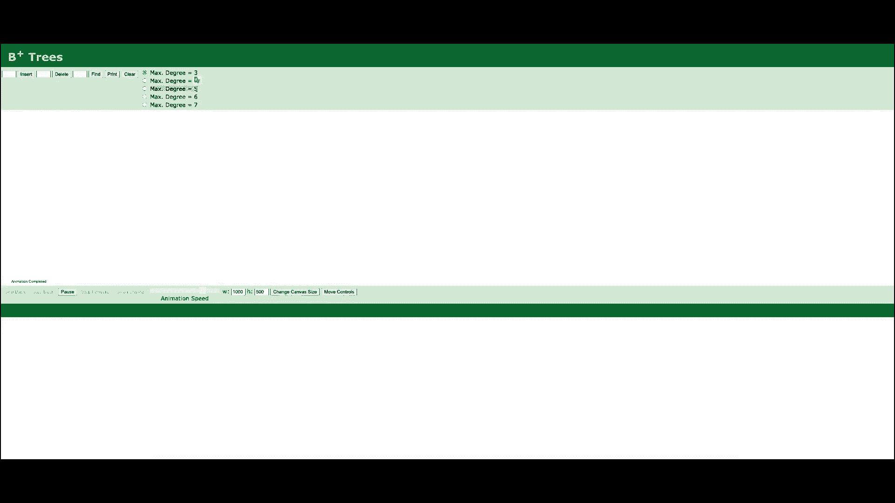
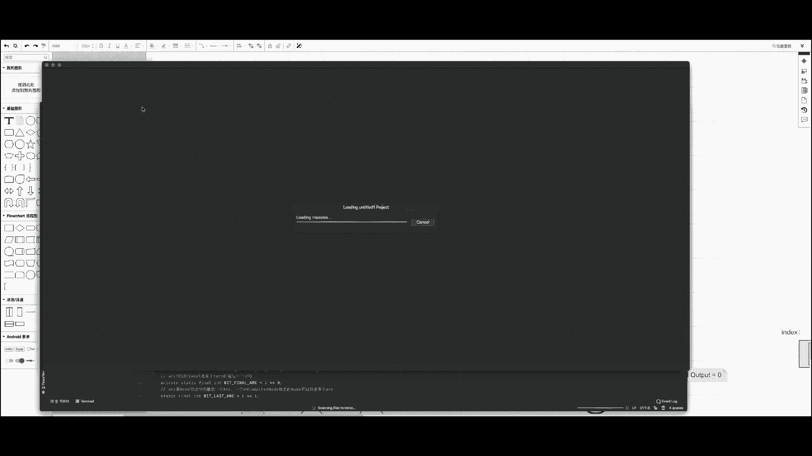
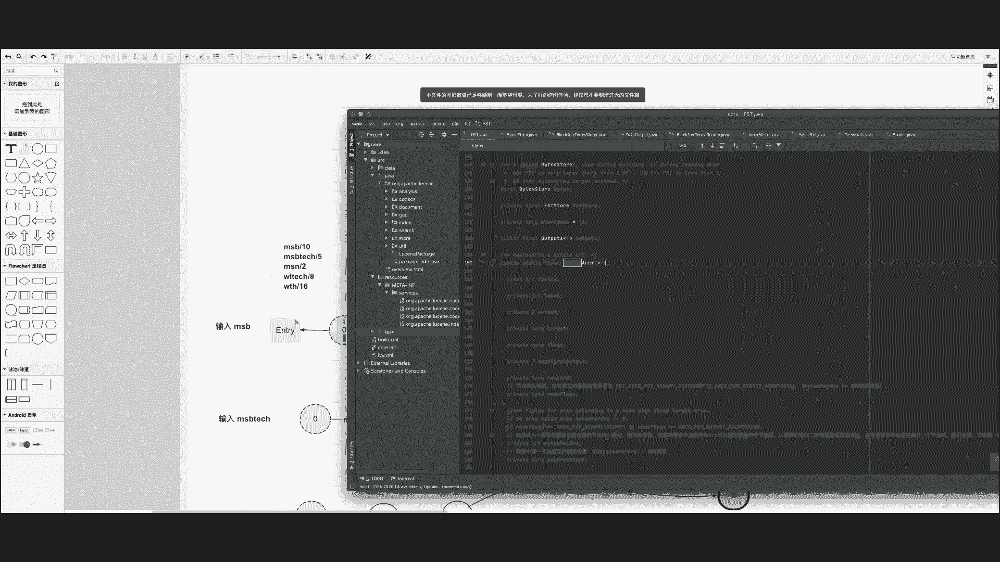
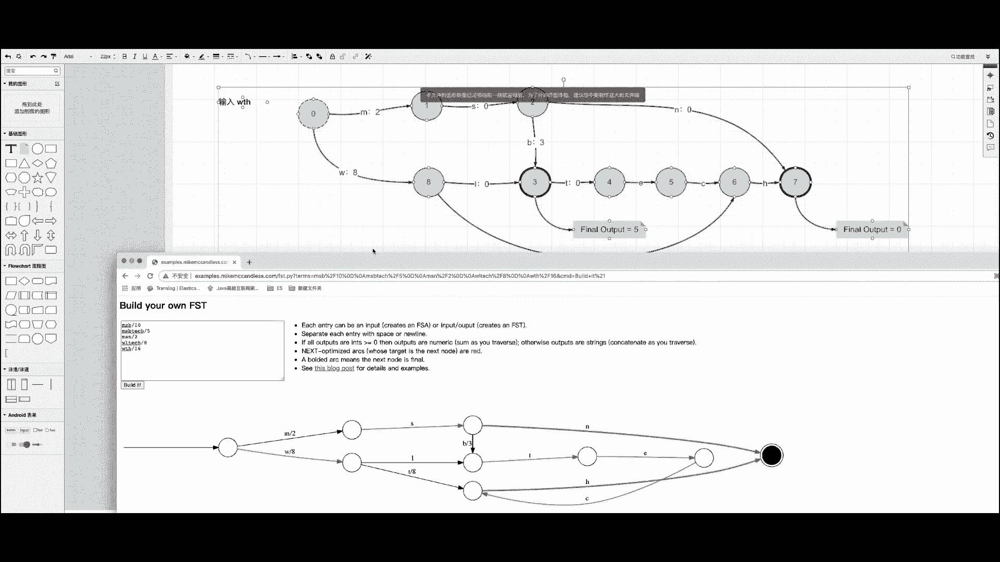

# 马士兵教育MCA架构师课程 - P158：FST 的构建原理 - 马士兵学堂 - BV1RY4y1Q7DL

好，我们继续来看下一个问题，讲一讲FST底层的构建原理。这同样是一道来自百度的面试题。对应的岗位薪资呢在40K到50K之间。那么这个问题呢是有一些难度的。FST呢是倒排索引底层的数据结构。

那么一般来说在面试倒排索引的时候，FST通常会做为一个进阶或者衍生的问题来提问或者回答。好，那么下面我们来看一看这个问题该如何来回答。FST是什么呢？FST名字叫有限状态转换机。那么这个名字比较抽象。

很。很不方便我们去理解。所以在我们理解FST之前，我们先来看一种数据模型叫FSM。FSM叫做finit。也就是有限状态机。那么这个这个东西是什么干什么的呢？好，我们来看下边这个图。我们用这个图来表示啊。

比如说表示周老师的一天，那么他的一天可能有以下这么几个状态。首先是睡觉吃饭啊，周老师有可能在卫生间有可能啊这一天有可能在工作，有可能在玩手机。当然了呃，这个是没有开始，也没有结束的。

他有可能这个时候在睡觉，有可能这个时候在工作，工作累了，有可能就玩手机，玩完手呃，手机玩玩完了，有可能又去工作。当然了，工作的时候有可能去上厕所。当然了呃这个啊这个描述这个周老师一天啊。

这个数据数学模型，这是一个数学模型，叫做有限状态机。那么它表示有限的状态。也就是说我们在呃。我们在表示一件事儿的时候，这个状态是有限个的呃，并且这有限的状态之间可以互相转移。

OK但是呃这种有线状态机啊有有几个特点。首先状态有限个。另外的话，同一时间啊只能呃只能处于同一个状态。也就是说比如说。周老师在吃饭的时候不能不能同时睡觉，对不对啊？吃饭的时候不能同时睡觉。

工作的时候不能同时睡觉，工作的时候不能同时吃饭啊，其实我有的同学可能会教一个真儿啊，说工作的时候我一边工作一边吃饭，或者一边吃饭，一边上厕所是没有问题的啊，不要这么杠，咱们只是啊描述这么一个问题。

描述这么一个现象。这种机制呢啊是存在这样的问题。就是说首先啊我是一个我是一个有环的，有闭环的。我可能是无限的循环，就是说没有没有一个开头也没有一个结尾，所以状态是无序的。

那么它的特点就是说我们用一个节点来描述一个状态。我们看到这个圆球形的形状，叫做da是一个节点，它来存储一个状态。那么我们用这个边用一个双向的箭头来描述状态之间的转换啊，其实在FSM里边，这种叫做度。啊。

不光FSNM里边叫数啊，很多种数据模型。比如说呃多路平衡查找数，也就B数啊，B数和B加数，它们都是其实又叫多路平衡查找数啊。多路平衡查找数之间的那个路其实就是说的是柱。来，我们看一下。好，我们看B加数。

B加数里边有一个属性叫degreeedee这个也也就可以理解为度。所以max degree等于5，也就代表我们当前这个B加数的最大出度等于5。

好，在这里边我们用箭头来表示度，这是它的几个特点，有限的状态啊，是一个闭环。OK当然了，所以说周老师的一天有可能是这样的，先去睡觉吃饭，然后上卫生间工作睡觉，有可能是工作、玩手机、工作卫生间。

有可能是工作工作工作，对不对啊？当然了这个不会是同一个状态，我们会记录多次啊。OK有可能是工作，玩手机工作。当然了，这种不确定性有很多，它有可能是很多种情况，而且这种情况是无限多个，并且呃没有。

并不代表睡觉就是他一天的开始。有可能啊0。00的时候有可能是在吃饭啊，有可能是在上厕所。所以啊FSM是一个呃无效的，也就是说它是没有顺序的。OK这就是FSM，也就是有线状态机的一个机制。好。

理解了这个机制啊，我们再来看另外一种数学模型叫做FSA。和FSM不一样的话，呃，FSA叫做有线状态接收集。那么和SSM的区别就是呢我们有了一个开始节点和一个final终止节点。

意思就是说哎我们的一天啊从哪开始是要固定下来了。比如说啊我们同样用一个圆圈来表示一个状态，用一条出度来描述啊一一个事件的转换啊，这里边存储的其实就是我们呃图像中的字符。OK我们还是以刚才那个例子啊。

还是以刚刚才这个前缀数的这个例子，我们拷虑下来考虑到这儿啊。我们看一下，如果使用FSA来存储这个comitionary这个词项字典啊，它的存储的过程是怎么样的？首先输入MSB的时候，和前缀数是一样的啊。

开始节点终止节点是一样的。MSB分别对应3条出度。OK当输入MSBT值的时候，还是和前面数是没什么区别的。这个时候呃，节点三作为一个终止节点来表示。

节点三是MSB的一个final nodefinal node的一个终止节点。节点7表示MSBT的一个终止节点OK那么区别在于什么呢？区别在于我们刚输入MSN的时候。如果我使用的是前缀数前缀数啊。

那么这个节点啊这个节点的初度是指向一个单独的节点的。我们可以去看一下是不是这样的啊，它是指向一个单独的节点8的。如果我们使用的是FSA啊，有线状态接收机。

那么我们当前这个出度是指向直接指向同一个终止节点嘛，也就是这个vimo。状态为7的这个节点。OK那这样做有什么好处呢？我们为什么或者说换一句话说，我们为什么要这样做呢？哦。

那么我们把当前WLTH啊作为一个。啊，再次输入我们看一下为什么要这样做。如果我们使用WLTH啊，WLTH呃，使用MFIA来存储的时候。和上一个前缀数不一样的是。当WL啊第一个出度不同的时候。

那我们后边便不会再有交集。那么如果使用FA的时候，WL啊W第一个出度和M和零零节点的第一个出度不相符的时候，我们新开了一条就是新开了一条路WL没有任何重复的地方，那我们TECCH啊。

因为和上一个和MIN输入的时候，TECCH是可以重复使用的。所以啊我们把终止节点这个WL的终止节点值呃不是终止WL的下一个节点指向了这个节点3。那么TECH就呃得到一个复用。那这样的话。

我们又提高了这个数据的存储的使用效率。那么观察一下FSA有什么特点呢？首先是确定性，也就是说在任意几定状态下，对于任何输入只能便利一个transor。什么意思呢？比如说我们便利WLTH的时候，呃。

在节点零的前提下，我们只能走啊走这一条走这一条幅度啊，不可能重复便利同一个状态。也就是说实际上我们FSA是没有呃是有向的不循环的。所以我们不可能比如说我们WL从这个三节点要绕过去，那是可能的。

O这就是说不可能重复遍历同一个状态。单个的唯一性就是说紧张啊紧当啊当前紧张有限状态进在输入啊末尾处于终止节点啊，最终状态时，所谓最终状态就是我们啊以粗框你这个边框加粗的这个节点来表示。

当只有处于最终状态时才接受的输入序列。什么意思呢？其实和前面数一样。比如说我们输入的是MSBTECCH啊，这个时候我们可以啊放的就是说我们接受这个输入，呃，代表当前MSBT取是一个完整的图像。

当我们输入MSBTE的时候，因为节点5不是一个中止节点，所以也就是说我们不接受特定的输入。也就是说当前的图像不存在。好，举例MSMC是否存在MS不存在MSC啊，因为初动不存在，所以啊这个实项也不存在。

OK那下面啊我这儿给大家去描述了呃在。FSA这个检索过程，它的一个便利顺序。首先是节点0，节点0的时候，我们当前出这个节点没有任何出度，T式的运营。当输入MSB的时候，呃。

当输入这个当这个状态达到节点一的时候，呃，我们的T变成了M。当状态变成了二的时候，我们K变成了MS。当状态为三的时候。K为MSB以此类推啊，因为MSB这个final节点是一个final的节点。

所以啊我们就找到了MSB。同样呃，如果。呃，这个状态接着往下走啊，4567到7的时候，我们也就发现了MSDTCH这一个。呃，这一个节点那不是这一个时项。啊，到七怎么办呢？到7哎。

我们退回来到2退回来节点6543到三的时候，因为3啊T是节点三的唯一一个出度，所以我们就往后退往后退推到节点2当退到节点二的时候，我们刚才已经便利了B的出度，所以我们要便利下一个出度，便历下一个初度啊。

T啊这个N是节点2的下一个出度，所以我们便利啊便利完之后呢，我们便要变立一个N初度N啊，初度N因为它也是一个终止节点，所以我们就便利到了MSNMSN。OK那么同样啊到MSN以后呢。

我们还是要反向的去啊反向的退回去MS二节点二节点呢，因为N是节点二的最后一个输入，所以我们要接着往后退。S只有唯一的输入，接着往后会到M的时候。因为M还有下一条出路叫W，那么这个时候我们就要开始建立W。

也就是节点走到9，然后以此类推，WLWL找到三个节点WLTECH。OK那就这就完成了我们呃四个图项的一个便利。OK也就是说完整的FIC的一个变过程。好，那我们思考WL是否存在呢？

因为如果按照我们刚才说的呃，首先我们输入WL。第一呃我们前几个条件都满足，并且我们观察当前紧张，我们输入的最终状态呃，是一个呃这个末尾是处于最终状态的，就是WL指向的一个节点，它是一个终止节点。

但是关 node。那么我们也就代表我们当前输入LFL呃WL的时候是应该有个输出的。但是我们当前的图项字典里并不包含WL，对不对？所以为了解决这个问题呢啊我们就引入了一种新的啊一种新的。

也就是我们今天要讲的这种数据结构叫做FST有限状态转换机。啊，你先状他找问。嗯，其实FST啊最重要的功能就是实现Kvalue的映射。什么意思呢？就是说除了K，我们刚才看到的这儿只有K，对不对？

我们的K值是4个值向，那么FST支持K到value的映射。也就是说我们的每一个指项对应的应该是有一个value的啊，相当于但是FST啊经过检测，因为FST的查询速度要比哈需要要慢一点。

但是它有什么好处呢？它可以极大程度的节省内存。因为其实字母只有26个。如果按理来说，我们如果使用FST来存储的话，我们只需要这个最最大出度不会超过26个。那么有人有同学问了，哎，我们的词像有中文啊。

有中文怎么办？虽然有中文啊，但是我们有一种东西叫编码，比如说常见的中文编码，UTF8，对不对？啊，可以把中文转换成英文啊，用来存储。那这样的话，实际上你不管多少个图项，不管多少个词项啊。

我们其实最终可以把它压缩成一个非常小的数量级。这样的话呃我们就有条件把一个实项可能上一行的数据，甚至缓存到内存里边去。啊，所以它达到的特点它的特点就是说在呃内存的使用上要比他基M少很多。

但是可能性能上要比还子慢一点，但是仍然是一个非常快的呃，这个查询速度啊，是可以接受的，查询速度非常快。FST在路ing中使用的非常广泛。比如说道派索引啊，同义词、正态索引。

还有搜索关键词、建义词等等等等。好，那FST啊说到这儿，FST其实我们还是不了解什么叫FST。FST顾名思义有限状态转换题，这儿既然多了一个转换。首先啊我们往下看。嗯，我们来看这儿往下往下翻。啊。

来看这里边是FSP的一个构建过程。首先我们给每一个磁项去多了一个value值。啊，这里边的value值是我提前给好的啊，是比较具有代表性的。我们观察怎么样去把呃。

这个value值存储到FST的这个构建过程中呢。首先FST和FSA的啊一样，也是一个有一个初始节点，有一个终止节点。我们仍然用这个。呃，粗框的节点来表示终止节点。但是不一样是每一个呃终止节点的话。

有可能会有一个那个outputfinal out的final output的一个输出。嗯。OK那么我们接下来把尝试把这下面几个词项啊通通的去存储到呃FSP的这么一个结构中去。首先是输入MSB啊。

输入MSB的时候啊，因为MSB有一个value，它跟MSSA的区别就是多了一个value。那么我们怎么去存储呢？好，这个其实我们可以参照FSDloing底层一个源码，我们来看一下啊。啊，我们打开看一下。

啊，稍微等一下啊啊，这里边FG已经打开了。

好，我们参考FSP嗯，FSP嗯找到这个。十点。哎他对。

好呃，在FST的描述中啊呃这个这个出度就是2。FSE中用这么一个对象，也就是arrk啊范这么一个范形对象来描述节点的出动边。那么它里边包含了几个属性。lel呢就是我们当前啊这个出度里边乘组的字符啊。

在这儿就是M。当然了，这个实际上SSD存储的是labelled的呃S码对应的二进制二进制啊内容。那么output呢存储的就是我们呃这个建制度的value值。好。呃。

target就是我们当前指向的呃下一个节点flag呢呃这个解释起来比较复杂。我们在后边的课再给大家讲解，它其实是记录。因为我们呃虽然这个数据要进行压缩。呃，但是你虽然你压缩的足够小，但是你不管压缩多小。

我们数据仍然是需要解码的。呃，你既然需要解码，那么其实有些东西你是需要标记起来的那ag这个东西呢，它其实类似于我们之前在讲呃RBM算法的时候里边那个我给大家去看一下啊。啊。

我们在讲RBM里边有一个这个东西。它其实就是用来标记当前啊这个东西它就是用来标记当前这个数组每一个数字里边使用了几个字符啊，其实它就是一个flag，它就是一个flag，只是标记的东西不一样。

但是他们的目的都是为了让当前的呃数据结构能够快速的解码就是解码回去，逆向的把数据啊逆向回去啊，他们的作用都是一样的啊，这个就是flag的一个作用。那么至于flag的具体啊，具体代表什么含义。

我们在讲解不来那个FST的存储存储的过程时候再去做细致的讲解。那么这个四个对象就是呃。二次啊这个这个对象的主要的4个主要的资格属性。啊，主要的四个成本属性nex flag output put啊。

这个我们在后边去讲OK啊，理解了这四个基本的属性之后呢，我们再来看当我们。呃，当我们啊存储十的时候，十也就是我们当前呃valued output好，我们存储到当前。啊。

这个ar的里边的out put这个属性中去out put这个字段。OK那呃一般来说我们把呃这个数据啊都存储的越靠前越好。因为是为了为了构建哎最小化的SST的存储。所以啊我们通常来说呃越往前越好。

数字越小越好，能能得到最高呃最高的一个复用效果。OK比如说好，那存储完第一个，我们再接着往下看。当存储MSBT的时候。诶。存储节点和出度的这个过程和之前是完全一样的，但是不一样是什么呢？不一样啊。

我们先把这个out先给它干掉。把奥的干掉了，这个箭头先把干掉吧。一开始这里边存储的不是一个十嘛，对不对？好，这里边存储的是个十。那么因为我们要复用什么？要复用MSD。呃，这三条出路。

那么但是我们MMSBT值它的output的值是5。那么如果我这儿存10的话，你想想我们在取MSBT值值的时候，MSBTECH实际上就是10加0加0加0加0加0加0啊，实际情况下这个零啊是不存在的。

如果我们这个值是零的话，其实在存储的时候是不做任何存储的啊，我这儿显示为零是为了方便大家去理解O那怎么办呢？啊，如果既然是MSB是MSBT取是5的话，那我们就把当前的值改成5好，改成5之后怎么办呢？

改成5，我的MSB它的数它的这个output就变了，那怎么办呢？我们就往后一倍想想移到这儿行吗？移到这也不行，因为MS一相加它还是10，那么和我们SBMSBT值就不一样了，违背了。那么我们接着往后移。

我们移到这儿行不行呢？我们移到这儿唉。貌似是可以的是吧？那么也不行啊。因为好，现在如果移到这个位置的话，MSB等于5MSBTECH等于10，那这个值相反的。如果MSB等于5MSBT值等于10。

那这样就可以的。那怎么办呢？好，那么所以我们就给当前的MSB啊，去构造了一个什么final。当前这个值是记录当前节点的终止节点的一个output那这个节点啊。

这个这个output是不计算在我当MSBTC是计计算它的value的时候啊，是不不参加计算的OK那它这是呃这是一种计算的方式。那这样的话，我们再去计算它的结果的时候，我们观察MSB就是5加0加0等于5。

再加上fin节点的output。那这个时候啊我们的结果MSB就是10MSBT是就是5加0加0，加到最后还是5fin output等于0。哎，这个时候就符合了我们的要求。当然了，这个值是越小越好。

能往前存储的，我们不往后存储。OK那MSN等于2的时候，原理是一样的。原先这不是5嘛，对不对？原先哎我们先给它改过来。原件照是5，哎，这是5。好，这是0这儿是。这是0fin等于5。唉。

那这个时候如果这改成二了，我们输入了个MN因为MSN等于2，那这儿改成2。那么如果我们改变了MSN，那么我们就要呃去。修改啊去检查一遍任何以MS就是说跟他有共共前缀的所有事项。

首先是MSB等于10MSV等于10。哎，这个时候MSNMSB。等于2加0加0加5等于7，显然是不可以。那么我们能不能还差多少？还差3差三我不能放便吗？不能因为MSB和MSN共用了MS这个前缀。

所以MS不可以动。所以我们只可以考虑在MSB这去修改它的值。差一个3，我们把它改成3。哎，这样的话，MSB这三个数值加起来是5是没有变的。那么再看一下MSBT值MSBTECCH加起来还是5啊。

仍然是符合条件的。MSN等于2MSN加起来等于2，没有问题。O那这样的话就满足了啊我们所有前三个值项啊，就是说到目前为止三个项都可以满足。OK。那么我们再来看录入最后一个图像的时候。

输入WLTECH的时候，因为啊我这就拷贝一个和上面是一样的啊，WTHWLTECH。输入WLTECCH首先啊呃M是2S是0，我们这儿加1个WLW是8，因为WLRTCHWL是8，W是8，那这儿是0。

后边的都啊，因为复用了，后边都是0啊，这个是没有什么特殊的地方。那么这儿啊所有的节点都是满足的MSB我们检查一下MS。B加起来是5MSBT取。

不是MSB加起来是12加3加5等于10MSBT取MSBTECH等于5。因为啊因为我们只有当你是MSBB是B指向的这个呃target节点是终止节点的时候，我们才要加5，所以我们MSB是要加5的。

但是MSB teach取因为MSBB并不是T取的终止啊，终止终止节点。所以说我们不能把这个终止节点的out去加到这个MSBT的计算中来。所以MSBT取加起来还是5MSN还是2，没有问题。

MSSNHR那么WLTHWL加TCH也还是8没有问题。好，那我这里边加了1个WTH啊，这是为了为了去讲解。呃，大家先看吧啊呃加入WLRTH的时候，因为WLTH是8W呃，首先W是TW是8。

那么L呃WTH啊，W是8，那么L是0。那么因为我第二个字符已经和WL的第二个字不一样了。所以我第二个初度，也就是几。8的初度啊，我的初度值也是8。那加起来就是8加8加加0等于16啊，这样的话也满足了。

因为我们没有和呃这个M这个公共前缀去产生任何的没有产生任何修改。所以也就是说。我们在修改WTH和W和M就前三个词项的时候，如果我们没有发生呃前缀的冲突，我们是不用和呃我们是不用去检查它的值的变动的。

只有发生了冲突的时候，比如说WL和WTH呃，比如说这个MSN和MSB通们有公共前缀的时候，这个时候我们才需要去检查之前啊就是我们改变出改变out的时候啊，是不是对前面的节点有有任何影响。

OK那这就呃完整的展示了FST去存储啊，去存储呃这么一个词像字典的一个过程。好，那我这儿给大家准备的一个网站啊，这个网站是一个叫FSBbu。

那这个网站是演示FST它一个构建过程的那我们把当前这个值和value啊拷虑过来啊，直接复制过来。我看见丢了一眼。啊，他构建的结果和咱们是不是一样的，我把这个拽出来了。哦。这个。好，我们来看一下M。

首先啊可能这个画的图不太一样，但是咱们呃。美观这个画的图的方式不太一样，但是结果是一样的。我们需要比对的是哪些东西呢？首先是初度啊初度的这个路径是不是一样的？首先我们看MSBMS。B啊B是一个终止节点。

但这里边并没有啊任何的就是展示终止节点的地方。这个首先这个地方是你们按照我们的来这儿我们是有一个终止节点，并且终止节点是有一个奥德斯的输出的啊，另外的话呃我们再看第二个MSBT去MSBTE啊。

E这居然拐回来了，这但这并不代表一个循环。我们把这个只要把这个节点的位置啊，挪到这儿挪到它的后边啊，和我们的画的基本上是一致了。MSBTE然后C然后再走H到终止节点。

也就是MSBTECH和我们是一样的好，MSBTCHCH之后呢，我们看MSNMSAN是第三条是这个节点，第三个节点的第二个幅度MSN。也就是第三个节点，也就是序号为20个节点的第三个幅度到第二个幅度。好。

也就是它的第二个出步MSN啊，这是一样的。它这儿没有标记这个零就代表当前的N没有output啊，我这其实按理来说是应该不加这个零的。但是这也是我们为了方便我们去看啊，有地方我加里。加啊，嘉陵和梅加一。

我们都视为没有auto的就OK了。好，那么说完了MSN我们再看WLRTHWLTCHW是第二个速度，是节点0的第二个速度。然后L是当前的这个。当前WLL指向的是和B和这个B指向的是同一个节点。

L和B指向同一个节点。B的output是等于3啊，这儿我们也是3M的是2，我们这儿也是2啊，L的这个output是0，对不对？TH也都是也都是空的好，那再看WTHWTHW是8，那么T啊，我这也是8。

那么这Tout也是8啊，那这就验证了我们当前这个FST它的构建是没有问题的。但是需要注意的是呃在这个网站中，它构建并没有关于out和和这个呃关节点的一个一个就是说一个咱们非常明显的看出来的地方啊。

所以要以我们这一种方式为准啊，它是有这两个节点，这个节点是有out的。那么这个节点output是0。

O。有两个终止节点。那这样的话呃我们就可以去理解FST它的一个它的一个呃构建构建的这一个过程。啊，回过头来，我们再看看这个问题啊，我们这个WL是不是存在我们刚才在构建FSA的时候啊，FSA的时候哎。啊。

这样思考WL是否是否存在呢？哎，我们把这个拿过来啊，拿过来。好，WL是否存在呢？WL如果WL是有值或者没值的，那么可以比对当前这个output值是不是存在啊，那显然啊在这里边是不存在的啊啊。

因为我们多了一个output，我们就可以去比对WL是不是存在。当然这是一个比较啊取巧的一个去判断呃，其实并不严谨。那么我们在后边的课啊去给大家讲解FST它存储的一个详细的详细的一个存储的数据结构啊。

这儿我们只是讲解了一个原理啊，就是存储的一个原理这么一个过程。真正去存储的时候，它是用两个数组来存储的FST一个cur数组，一个叫fo两个数组来存储它的节点它的速度的。好，那么这节课先到这啊。

下节课我们。

