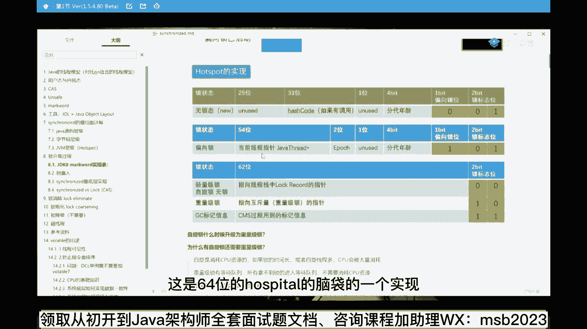
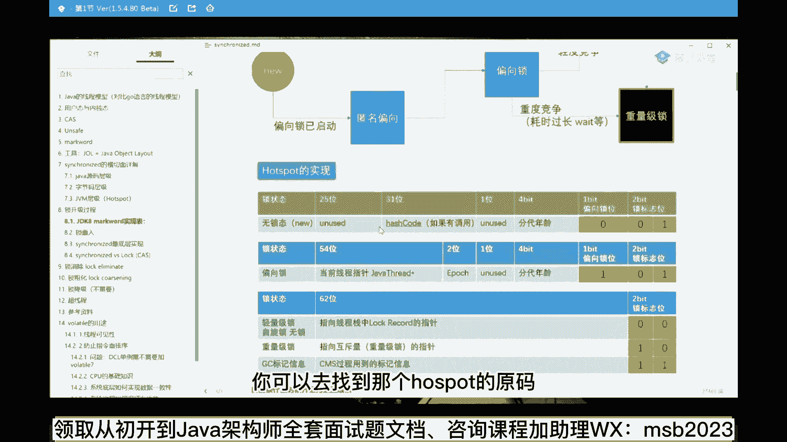
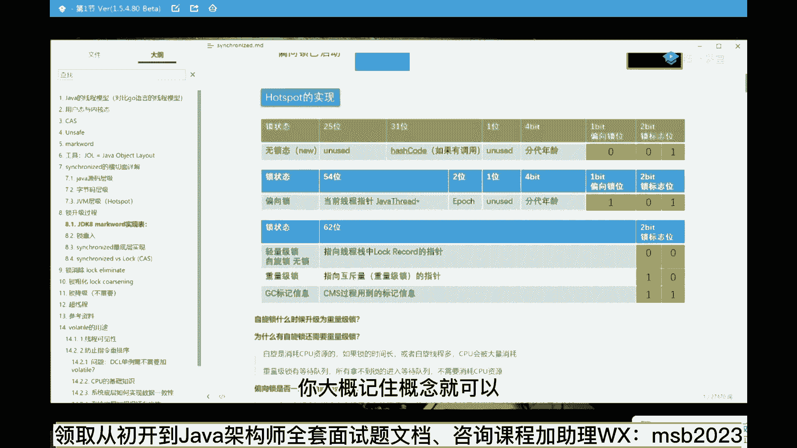
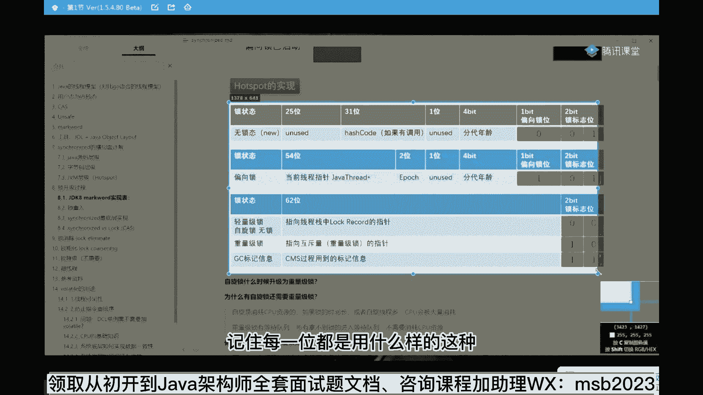
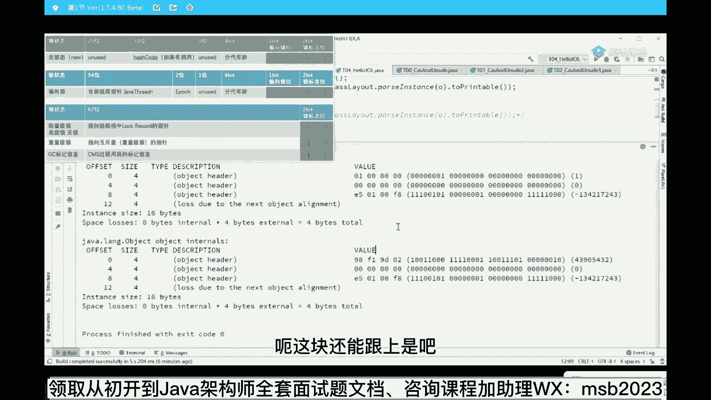

# 马士兵教育MCA架构师课程 - P16：hotspot底层原理 - 马士兵学堂 - BV1RY4y1Q7DL

我们做一点点小小的实践，先做一个小小的实验，就是呃这里面牵扯的内容呢有点多，我们先看呃最终的一个结论啊，就是这个结论呢是synchronized的，内部执行的时候，他有一系列的优化过程。

所以现在有一个结论叫做呃，当你进行一些简单同步操作的时候，你没有必要去使用新的锁，没有必要去写使用新的lock，新的什么reaction lock，新的read red lock等等。

你先不要去使用这些，优先去使用synchronized，为什么，因为这些都是用cs实现的，而synchronize内部也集成了cs的升级过程，所以你应该优先使用它，它不够使的时候或者功能不够的时候。

再去考虑用新的锁来实现好嘞，当然有同学可能会说，老师这个我我能观察到它的锁升级的过程吗，可以可以啊，小嘟嘟是一听觉得懂了过后啥也不是全忘了，你是能够听完了之后一点印象都没有是吧，那你也够牛的，够神奇的。

你是喝了什么健忘爽嘛，回头也发给我一个忘情水，你喝了刘德华的忘情水吗，大家看这里，如果你想跟踪到这个过程，就特别好玩的一件事情，我觉得大家用一个框架，这个框架呢叫呃j o l，这框架用起来相当简单啊。

同学们，这用起来超级简单，你没有用过的，没有关系，这个框架呢是那个open dk提供的叫j o l，j o l的全称叫java object layout，跟我读java object layout。

java的对象布局，这个框架用来干嘛的，用来观察，当我们new出一个对象来之后，它的内存之中到底是怎么样进行布局的，好我们先说结论，结论是java中的内存布局是这样子的，这个还是要讲。

你在这边没在这张ppt上看在哪里，ok对象在内存中的存储布局，这个是hosport一个具体实现，我再强调一遍，这种东西啊，是jvm的这种规范级别，它并没有要求的，这东西都是hot sport的具体实现。

作为我们new出一个对象来说，在内存之中它是这么来布局的，这个面试面的特别特别多，超级超级多，所以你啥也别说，你给我背过，他有同学说老师我开发之后用不上，没错，你是用不上，但是你面试中用上了。

每个月就能给给你涨个3000~5000，你不美吗，所以你好好听，认真听，给我背过就行了，这东西没什么道理可讲，他就这么设计的，这个设计是啥好作为一个对象来说，new出一个对象来的时候。

大家都知道在内存里头开辟了一块空间，现在这块空间里边到底是怎么布局的，这个布局是这样子的，普通的对象分四部分，四部分，第一部分叫macworld，叫标记字，这东西你就别翻译了，背过的名词就行了。

叫macworld，macworld占八字节，作为64位虚拟机，64位的虚拟机，64位的gm，他就八个字节，64位嘛，八个字节，第二个呢叫类型指针，叫class pointer，这个的意思是。

这个new出来的对象是属于哪个类的对象，你比如说new了一个object，那它指向的就是object。class，如果你用的是一个t那就是指向t一点，class好，这是一个指针。

这类硬指针叫class pointer，第三个呢叫实例数据叫instant data，这块就是我们普普通通所说的成员变量，比如说我们有一个类t里面写了一个成员变量，int类型的m。

那时候呢里边这个实际数据里面，就有一个int类型的m，如果还有一个指针类，是有一个指针类型啊，如果有一个long，那就有一个long类型好，这里头叫成员变量叫instant data。

第四个呢叫padding对齐，叫padding，对齐是什么意思，对齐的意思就是八字节对齐，就是如果前面这三项加起来不能被八整除，后面再给他怼上一些字节，让它能被整除为止。

有好多基础特别弱的小伙伴总是理解不了，为什么要对齐，对齐的时候是因为装配效率特别高，我举个形象一点的例子，比如说我们往那个集装箱里装货，我拿这个货物的时候，一双鞋一朵花，我完全可以直接来拿。

但是我为什么要装到一个集装箱里，规定的大小的这种集装箱大小是一样的，为什么，是因为我装配的时候，读取的时候，读数据的时候效率特别高，哪怕你里边只装了一半，但是我也要给你一个完整的箱子。

我装这个箱子的时候，是由于我装那个空间里，船里等等，我用这种空间这么大的空间装起来效率特别高，这个大家能理解吗，就是没有了web的碎片，如果你用那种特别小的好多好多小碎片，我还得计算你这个对象从哪开始。

到哪结束啊等等，好这个叫对齐，好能get到这一点的同学给老师扣一，就说我宁肯浪费一些空间，以前还有同学说说一个特别好玩呢，就说老师我非得往上补吗，我不能把前面一部分砍掉吗，大哥真的有人问这样的问题吗。

有没有人有这样的疑问呢，就是你你你你们家那个你个儿特别高，然后睡睡了一个墙，睡了一个床，这床不够长，你不是补床，你是把自己脚给砍了，牛逼啊，我只能说你你我只能说你太牛了，好开个玩笑啊，来看这里。

就是那个大家记住这个四部分嗯，mark word class，pointer，instance state和pdding，有同学说我能观察到这四部分吗，可以你用j o l这个框架就可以。

这个框架用起来超级简单好，打开这里，呃我们来观察这个它里面的布局，object o等于new object，我们new了一个object对象。

this is mode prinline class out，好这个下面就是把这个布局给打印出来，估计短出来的呢，就是用到了jo m一个类叫class lyout，静态方法。

pass instance，解析一个对象，哪个对象，older对象，two printable，把解析的结果转成可以打印的字符串，然后把它打印出来，跑一下跑一下，声音有点像胡歌，你说的。

其实我我我我我我我我不喜欢胡歌的声音，我喜欢王刚的声音，然而学不会好，大家看这里，这就是打印出来的内存布局，你看啊，从第零个字节，这是我们一个一个一个呃对象，一个operate最普通的一个对象。

最简单的一个对象，它里面没有成员变量吗，诶第零个字节开始往后数四个字节，这里指的是orbit header，叫对象头，第四个字节开始又往后数四个字节还是对象头，第八个字节开始往后数四个字节。

还是对象头好，这12个字节叫对象头，这对象图分两部分，前面八个字节，前面这八个是mark word，后面这个class pointer指针，有同学会说，ok那这个我能看懂吗，这东西是什么。

好这个你就可以认为是一个指针，一个地址，它指向的是谁呢，指向的是object。class，就是找一个对象之后，能通过这个指针找到对应的具体是哪个class，大家知道吗，作为一个普通对象来说。

它都有一个方法叫get class，对不对啊，应该有好多同学都用过这个方法，任何一个对象都有这个方法叫get class，拿到的就是class类的对象，好通过哪来拿的，就是就是通过这个指针拿到的。

好第12个字节往后数，由于前面三个加起来只有12个字节，不能被八整除，所以再补四个，所以他是lost due to the next ordinate alignment，对齐，根据对象对齐来说。

我在补四个字节，所以一个object对象，在内存之中一共占了16个字节，有同学说老师有人问这个吗，没错就有一线大厂问你一个object的占多少个字节，还有一个经典的问题。

就是mark word里面装的是什么内容，在我继续讲mark word之前，前面讲的这部分有没有同学有疑问的，有问题直接提，没有问题的给老师扣一看，我们能不能继续啊，可以是吧，ok不错，嗯你知道吗。

我一般都会问诶，没有问题，给老师扣一，总会有人扣一，那些扣二的都不好意思问，所以我也就混过去了，应该是20个字节，no new一个object 16个，这个看操作系统还是32 64的机。

目前64位不仅不聊32位这件事，你要聊的话，你还不如聊16位，八位的呢，没意思啊，16个，当然里面好多细节就是这个class pointer，会不会被压缩，压缩完也是16个，你不信你自己去算。

不压缩也是16个啊，这个不用去管它，那有同学就说哎老师这跟所有半毛钱关系吗，好，下面这个问题就是，mark word里面记录的到底是什么信息，mark word里面记录了啥信息，你仔细看。

这是我们刚刚用了一个非常非常普通的一个呃，object对象，你看它这里面的这个记录是什么，010000000这些是吧，看这里，假如我给这个对象上，把所有同学什么叫给对象上锁。

给对象上锁的意思就是这个叫synonoma，锁定这个对象，然后执行下面的操作，这就是被锁定的对象，这就是叫临界区啊，叫critical section，就是临界区的，意思是只有持有这把锁的时候。

才能够执行这个操作，形象一点的例子，你进一个厕所之前，锁上之后你才能去干事，你们都说俩人同时干啊，这个事情不能同时不合适，同时上一个坑屁股，对屁股不太合适啊，所以锁定这个门儿来干里边儿的事儿。

就是给这个对象上锁，看这里比较一下，跑一下，好我们来对比一下，所谓给对象上锁，这是对象没有上锁的状态，这是给对象上锁的状态，诶结果你发现没有，所以我们第一个结论就来了。

这个mark word里面记录的是什么所信息，就所谓给对象上锁，就是修改了对象的mark word，来给get到这一点的同学绕口一，这就是大厂问的这个问题，就是michael里面主要记录什么信息啊。

所信息这是最主要的，当然标准答案除了锁信息之外，还有什么信息，hash code，除了hash code之外，还有什么信息，gc垃圾回收信息，也就是这个macworld。

在hosport的具体时间里担任了很多很多的角色，最主要的是锁，有同学会说了，老师这个里面真的会所，会发生各种各样的变化吗，会的好，现在还能跟上是吧，能跟上我们继续啊，来看看笔记里头这张图。

看这里看这张图，这是64位的hosport的脑内的一个实现，如果你要观察它具体的实现。

你应该去哪查，你可以去找到那个hosport源码。

hot sport的源码就是c加加那个源码，mark o p s头文件啊，那个地方去读它，这个好像是给大家，摘下来了吧，我有印象是摘下来的啊，在这里就是你要是想去读他的那个每一位。

到底代表的是什么意思呢，你应该记住jdk 8的一个源码的mark o p h p d，在这个里面，64位的每一位都代表的什么意思，都给你做了详细的解释，我能给大家做了一张图，你不用去看那么琐碎的细节。

看这张图就可以，这一定作为一个锁升级的过程，刚才我说过，有偏向锁，有自旋，所有重量级锁，这两个锁是在升级为重量级锁之前的，一个用户空间的锁，作为这个锁来说，它是怎么标记的，不同的锁的呢，是这么来标记的。

优先看整个mark word里面的最低位的两位，这这这两位叫做锁标志位，比如说我们看到零零的时候表示的是自旋锁，比如说我们看到一零表示是重量级，所比如说我们看到一一，这个很难观察到。

表示它正在被回收的信息，比如说我们看到有同学会说前面还有俩呢，这五种状态怎么能用两位来表示，两位最多能表示四种状态啊，所以在一个前面这两类的时候，都比两位都是零一，没关系，前面再加一位。

看到001表示的是无所，刚刚new出来这个对象，如果你看到的是101，表示的是偏向锁o当然这个细节非常的琐碎，你大概记住概念就可以仔细听我说啊。

就记住概念就可以，你没有必要说记住每一位都是用什么样的这种。

具体不同的未来来标志的，我给大家把这个切下来，然后我们来对比一下刚才那个实线，你看这个时间，来看这里，你看啊这里看到的001，这是什么状态啊，对比一下是不是就是无锁开了，就是刚刚new出来一个对象嘛。

我们看到的是零零，看到什么状态了吗，这是什么状态，是不是就是自旋锁对吧，零零ok，这个你就能观察到它的一个所升级的一个过程，ok那有同学可能会说，这里面其实还有好多好多小的细节。

我不知道有没有同学有这个疑问的，就是老师啊，您这个最低位不应该在这儿吗，对吧，你最低位不应该在这儿吗，你为什么看第一个字节啊，为什么y有没有同学有这样疑问，有这样疑问给老师扣二，如果你有这样的疑问。

各位小伙伴麻烦你去查这两个东西，big ending大端，little ending小端，这叫高字节在前还是低字节在前，这个牵扯到计算机最基本的知识，作为一个比方说int 16位的这样的一个实现。

这两个字节的排列顺序到底是低位在前放前面，还是高位放前面，低位放前叫小端，高位放前叫大端，他这里展现出来的叫大端的一个，小端的一个视线，i'm sorry，小端的一个视线，ok所以你应该看第一个字节。

而不应看，不应该看最后一个字节，来这块能听懂的，老师扣一听不懂的，你给老师扣5693，乘以3762。64的最后的一个结果，你们你们你们反正答出来的数字好像都不对，我带小数点，你们都没带啊。

所以大家都听懂了，ok如果没有听懂的，去搜索这个东西，很简单一个事儿好吧，一般来说java的内部的一个实现都是小端在一起，而网络上的传输都是大端，好了不开玩笑了啊，呃这块还能跟上是吧。

