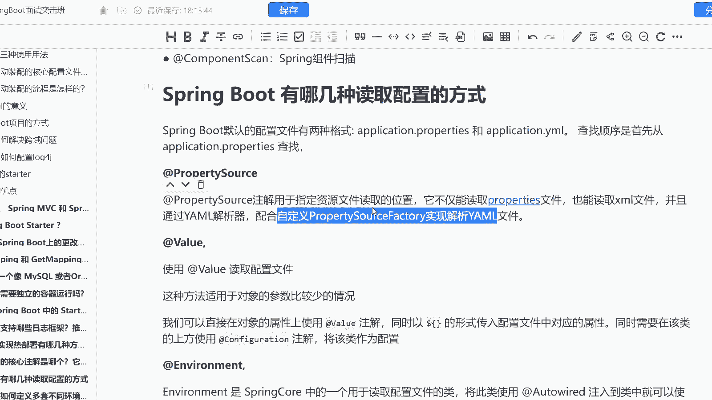

# 马士兵教育MCA架构师课程 - P176：Spring Boot 有哪几种读取配置的方式 - 马士兵学堂 - BV1RY4y1Q7DL

下面这道题呢是来自于阿里的一道面试题啊。然后呢这道面试题叫做spring boot有哪几种读取配置的方式呢？那么这道题呢对应的是终极java开发工程师的一个岗位，新资呢是15到20K。这道题并不难啊。

它主要考核的是什么呢？是你对于spring boot配置的一个理解啊，并且一般情况下，我们要去干嘛呢？要去把每个配置在哪几种情况下使用，把它给描出来。

首先spring boot默认的配置文件有两种格式啊，obplication点pro以及obplication点mail两种格式查找的顺序呢是优先proice其次是mail啊。

那么这个时候呢我们第一种方式是pro source。而这个注解呢是用于指定资源的一个读取的位置它不仅能读pro也能读叉mail，并且我们能通过mail的一个解析器配合自定义的pro factory啊。

pro呃呃proty source。

factorory实现解析压mail文件。OK这第一种方式啊，它是用于指定资源的一个解析的。第二个呢叫做valuevalue注解应该大家用的比较多啊，这种方式呢适用于对象。

我比如说我某个某个对象参数比较少，我可以直接在对象的属性上使用values，然后呢以doner括号的形式传入配置文件中对应的属性值，同时呢我还要声明当前类为配置类。ok。

第三种呢叫做environment注解。 environmentvironment实际上它是thringcur包中的一个读取配置文件的类。而我这个类，如果我一旦使用ult word注入类。

或者说我使用resource啊去注入类就可以使得它的get这样的一个方法来获取某个配置项的值，这是我们的一个呃叫做环境的一个注解啊，第四种呢是configuration properties。

而使用这种方式呢去读取配置文件的话，一般比如说这种是对象参数比较少，而这种呢就是对象参数偏多的情况下面，我们会推荐使用configuration properties。

它不需要你在每个字段上我都加上values这样的一个注解，而是我只需要去加上configuration properties来注解声明当前类为配置读取类就可以了啊。

比如说类似于我preitq就表示我当前读取前缀为raitq的所有的这样的一个属性啊，一般。

情况下就是这四种就OK了啊。所以你只要聊出来这四种，并且把这四种每一种的应用场景给聊出来，基本上就没问题了。这是sring boot有哪几种读取配置的一个方式的这样的一个面试题。

