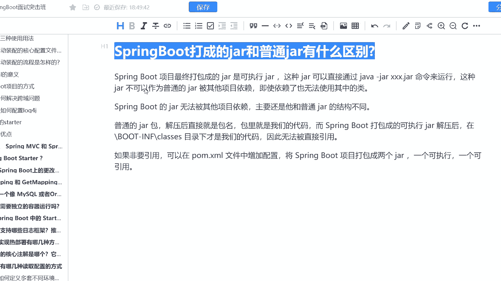
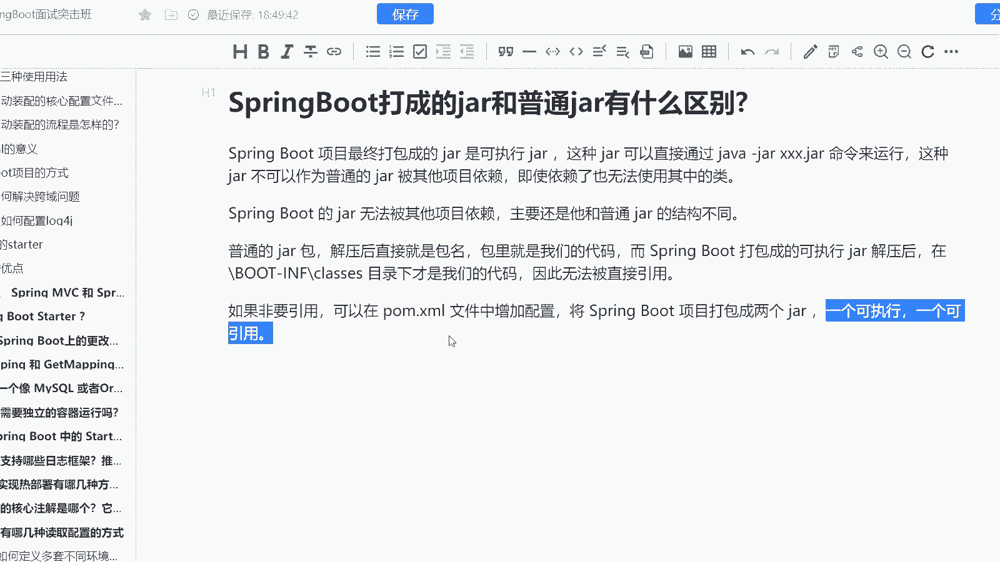
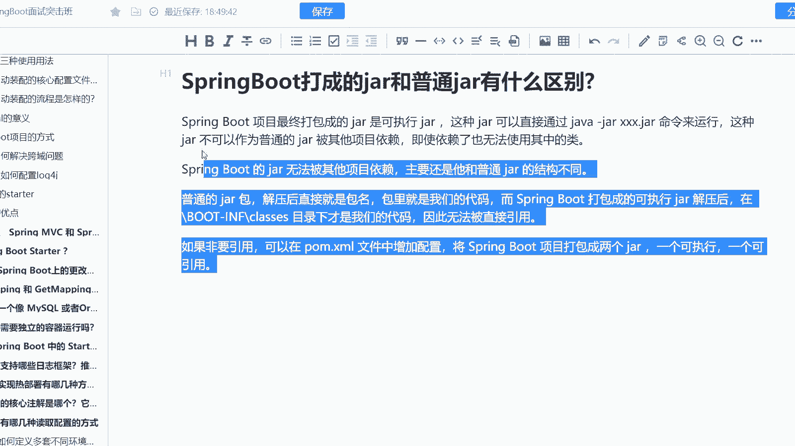

# 马士兵教育MCA架构师课程 - P180：SpringBoot打成的jar和普通jar有什么区别 - 马士兵学堂 - BV1RY4y1Q7DL

来自于阿里巴巴的一到9月份的面试题啊，说是spring boot打成的架包跟普通的价格架包有什么区别呢？这个题啊其实很多同学都是一脸懵逼啊，说老师这东西呢有什么区别？

这道题主要考察的是你对于spring boot的一个理解啊。这道题在面试高级java开发工程师的过程当中会遇到可能很多同学在面试的时候遇到这道题都是一脸懵逼。

而这道题对应的薪资呢是25K到40K的这样的一个区间范畴啊，我们来看一下，首先第一个spring boot项目最终打包成的价，它是一个可以执行的价。因为它内嵌了而这个架包可以直接通过java杠架。

比如说某某架包的一个命令来运行。而这种价它是不可以作为普通的架包被其他项目依赖的啊，即使依赖了你也无没有办法去使用其中的类。因为它没有办法去加入到当前的IC容器当中。

所以ring的架是无法被其他项目依赖的，它跟主要它跟普通的架。

结构也不一样，普通的价解解压后直接就是包名，对吧？包里面就是我们的代码，而spring boot打包成了可执行的价。它解压了之后呢，是在boat杠 info杠 classes目录下才是我们的代码。

因此呢它是无法被直接引用的。O如果非要引用呢，我们需要就是说在po文件当中增加一个配置。然后将spring boot项目打包成为两个价，一个是可执行的，一个是可以引用的两种方式啊。

O包括其实我们的公共star，其实就是可引用的这样的一个价。O。

