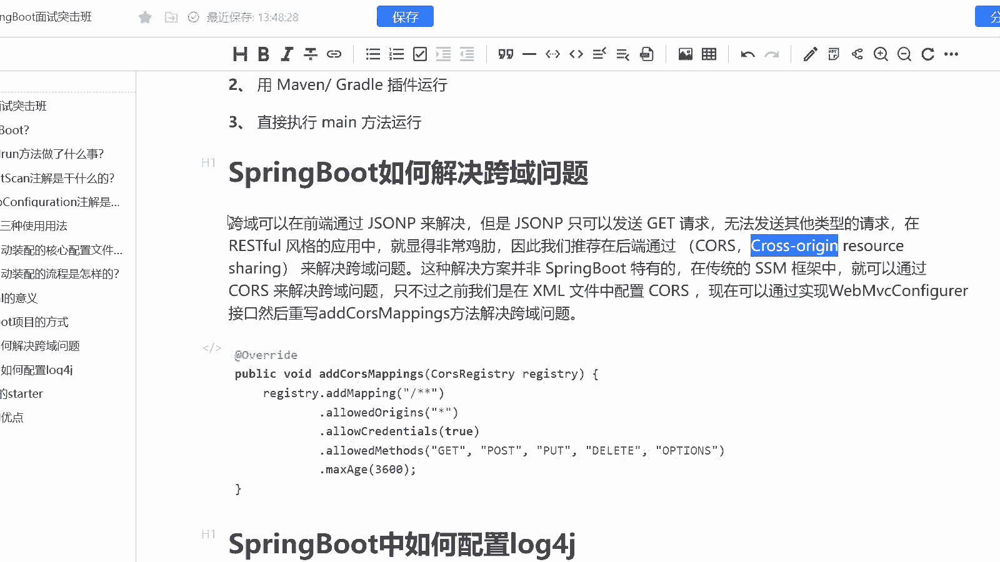
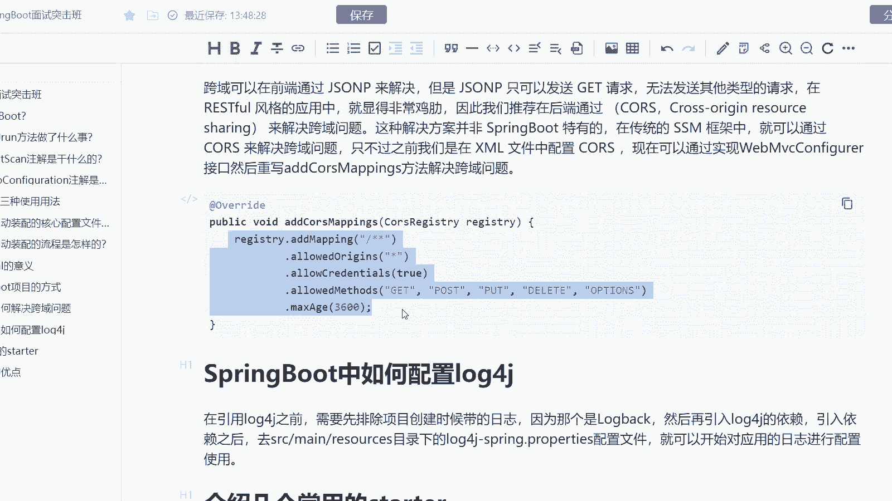
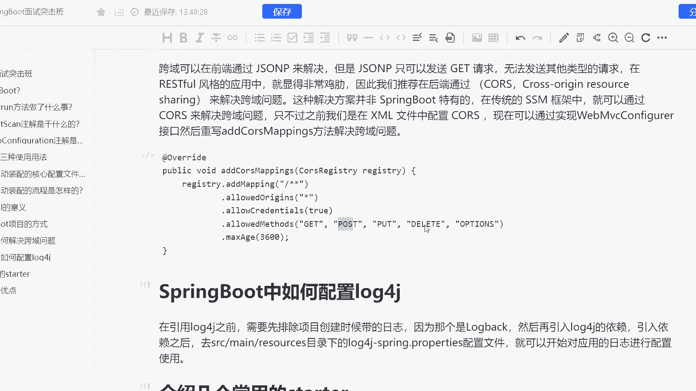

# 马士兵教育MCA架构师课程 - P183：SpringBoot如何解决跨域问题 - 马士兵学堂 - BV1RY4y1Q7DL

下面这道题呢是来自于阿里巴巴的一道7月份的面试题。而这道面试题呢主要讲的是什么呢？spring boot如何解决跨域的问题。而这道题呢考察的其实有两个点。第一个点是对于ring boot的一个理解。

其次呢是说的是跨域到底怎么解决跨域其实是我们java领域一个经典的问题。而这道题呢会在考察中高级java开发工程师的时候会遇到对应的薪资范围呢是15到25K这样的一个区间范围啊。

然后呢首先我们来看一下这道题跨域呢其实我们可以通过三种手段来解决。第一种呢是通过前端跨域通过层。然后呢，森它确实能够去解决。但阶层是通过回调钩子来解决的。所以呢它只能发送ge请求。

而无法发送其他类型的请求。所以呢在大家去构建微服务的时候，在re phone风格的应用当中，好像就解决起来没那么的简。

因为像我们正常情况下发请求，可能发的都是pos的请求，对吧？所以呢它就显得可能没那么好用，所以呢我们推荐在后端使用quis这个框架来进行一个跨域的解决qui指的是 resource啊来解决跨域问题。

而这种解决方案呢，它不是说spring boot单单独有的啊，在传传统的SSM当中，你本身就可以通过我们的跨域来解决问题。只不过我们之前可能会在叉mail当中去配置qui。

而现在呢我们可以直接通过web mV configurationfiration接口来重写m方法来解决跨域的问题。而这里呢给大家去构建了一个案例啊，包括其实我们可以在网关直接进行跨域。

因为我们只要统一了入口，而网关实际上也不会有所谓的一个跨域问题的存在啊，所以呢这是我们的一个解决方案，包括大家可以看见我们可以添加get。

post post delete，包括options这样的一个方式去进行一个解决啊OK。所以大家直接把这段代码copy上去就OK了啊。

