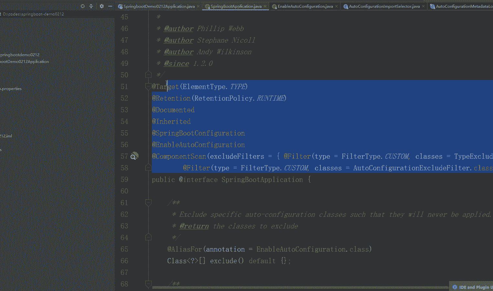
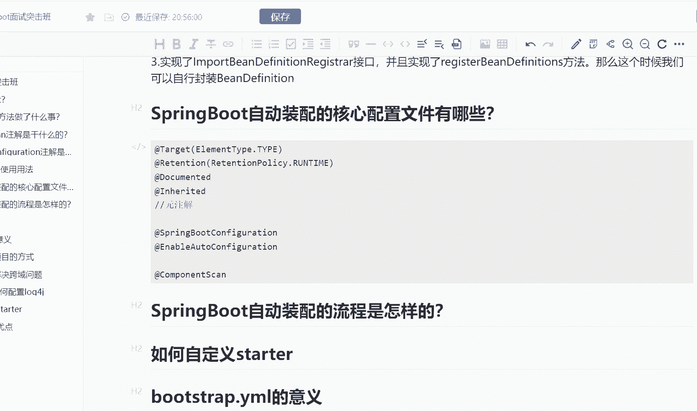
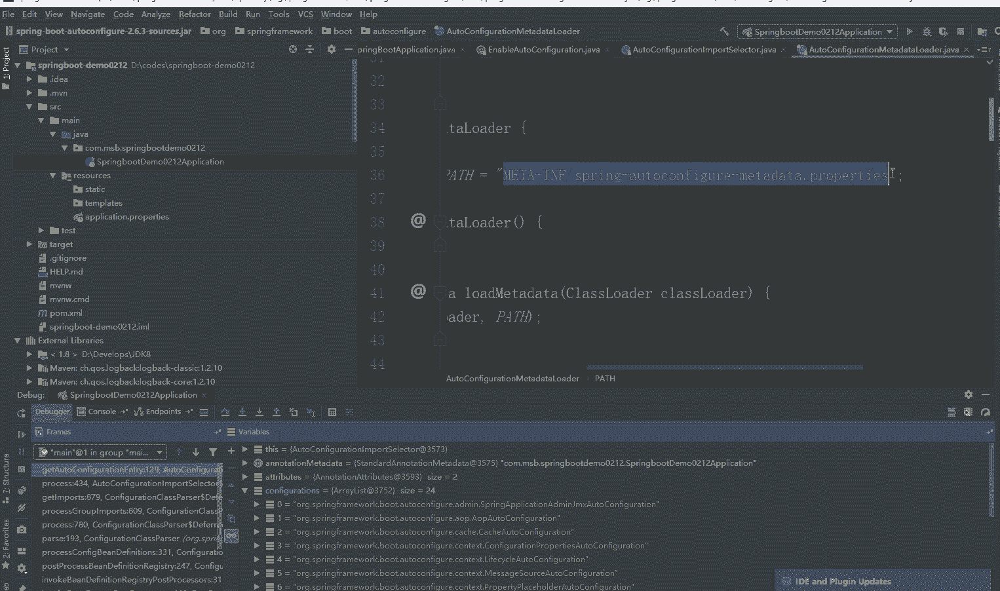
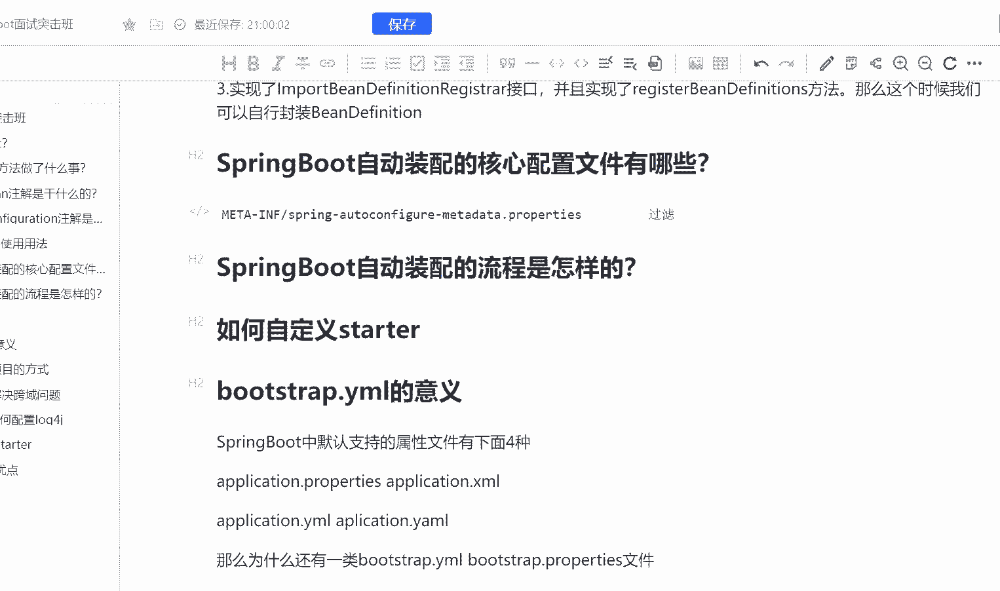
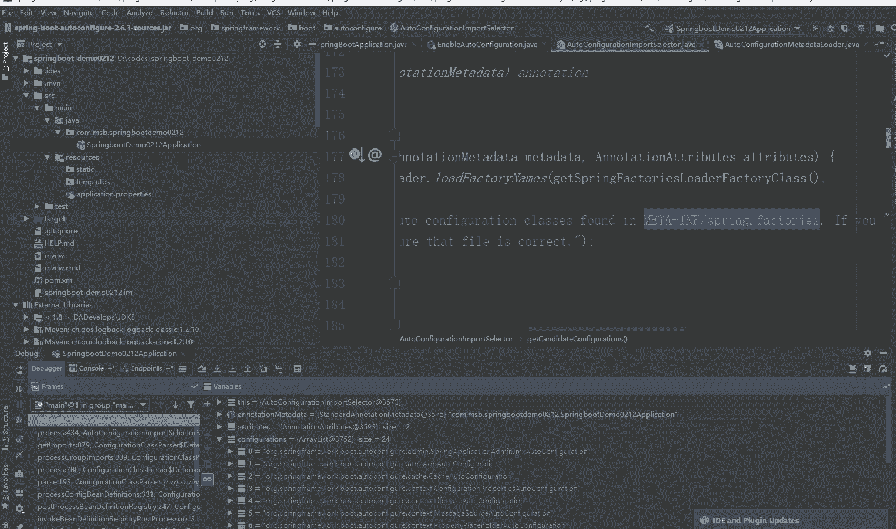
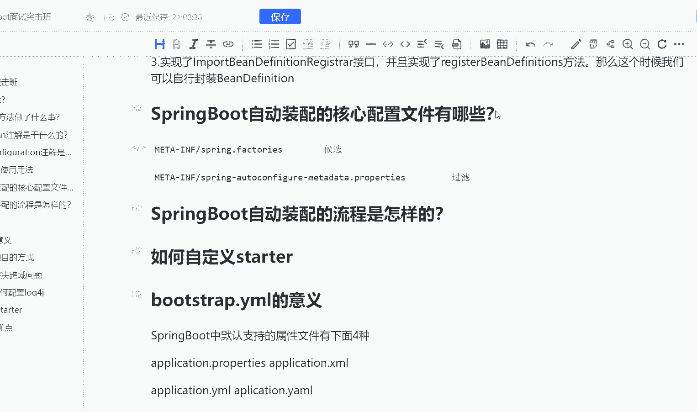

# 马士兵教育MCA架构师课程 - P186：SpringBoot自动装配的核心配置文件有哪些？ - 马士兵学堂 - BV1RY4y1Q7DL

这道题呢是来自于阿里的一道8月份面试题啊，说是什么呢？说是spring boot自动装配的核心配置文件有哪一些呢？而这道题主要考察的是什么呢？考察的是你在面试java开发工程师的一个高工的过程当中。

你对于源码的一个理解。而它对应的薪资是25K到40K一般情况下就是你在面P6比较高级的P6或者说呃第PP7会面到啊，那么呢这道题我们可以来看一下。

首先第一个呃我们可以去翻翻看一下我们的一个spring boot的一个源码。我在前面曾经给大家介绍过，就是咱们spring boot它的run方法是干了一件什么事情啊。

是做了一个类似于IOC的一个初始化的操作。实际上呢他做了IOC初始化的操作。那它怎么去将我们的代码自动去进行扫描呢？这个功能会不会是我们这个注解实现的呢？sring boot application样。

的一个注解。所以我们点进去啊，点进去之后，我们会发现这里面有很多的这样的一个内容，对吧？那么这个内容它到底是干了什么样的一个事情呢？首先我们把不注解给写出来啊。

我们把度解给写出来。O那么这么多的注解，我们来看一下，首先前面四个是什么注解呢？前面四个是原注解啊，原注解。那么除了原注解之外呢，我们下面会有一个注解。而这个注解呢。

我们在上面介绍过comp这个注解它是被comp被comp scanner所修饰的java类呢，如果假设你是没有去指定你的扫描路径的情况下面，它呢默认情况下是扫描当前java类以及其子类路径啊。

ok这都是被扫描的范围。而这里面呢是被排除的对吧？过滤的相关的一些内容，就是它的所谓的属性啊而除此之外呢，我前面也曾经讲过，就是这两个注解啊，ring boot以及able这两个注解一个是干嘛呢？

一个是spring boot它的一个配置注解啊另外一个呢是able自动装配的这样的一个注解，我们可以直接点。

自动装配的一个注解。我们会发现这里有一个inport注解。而前面我也说了，inport注解的三个用法啊。

那么在au to configuration importport select这样的一个轮序器当中，我们可以直接找到它的一个方法叫做select import啊。找到它的select input方法。

找到了之后呢，我们会发现，首先我们会去判断标识位是否开启了enable is unableable对吧？那么在判断了之后，我会直接进到一个方法叫做get out to entry啊，直接进点进去之后。

我们会发现在这里有一个get configuration被后选的加配置类。点进去之后，我会发现啊，这里它会有一段注释啊，怎么注释呢？

他说我会根据mat in spring点factorory下面的一个内容去判定当前的类是否加入候选范围。那么此时我们可以去看一下当前的这样的一个配置文件啊，在哪里呢？在这个位置啊。

OK大家可以看这个配置文件啊，这个配置文件当中，它会有这样的一个叫做什么被 enable configuration这样的一个权类限定名所干嘛作为key的这样的一个下面是value的内容啊。

这样的一个内容呢，它会整体的去展示在咱们的一个什么展示在咱们的内存当中啊。所以呢我们可以打到断点去看一下，看一下咱们内存当中是不是真的是有这样的一个内容的啊。O打个断点。点进去在这里断点一下。

然后呢重新启动啊。呃，稍微把它放小一点点啊，不然应该是有些同学看不清的啊，把这个稍微设置小一点。好，这么大差不多啊，设置成这么大，刚好所有人都看得清。好嘞。第bu个。嘿。😊，第bug还挺慢的啊。

OK那么大家可以看到啊，当前我内存中是没有任何的信息的。好，第一步我注入了一些属性，对吧？第二步好，我把一些configuration的配置就注入进来了。大家看这133个。

就是它默认情况下会去注入这样的一个配置，这是第一个配置文件啊，各位往下看看看看。好，往下直接133个变成了24个，这里就不得不提我们第二个比较关键比较核心的一个配置文件了啊。而这个配置文件是什么呢？

这个配置文件就是咱们的一个比较核心的这样的一个配置文件，它会去过滤掉咱们的一个内容啊，过滤掉咱们的一个内容。那么这个时候呢我们可以就是说去干嘛呢？去看一下它到底过滤掉的是什么样的一个内容啊。

O大家可以看到这里是个循环。其实我们会在循环当中去匹配咱们的一个候选信息啊，而此时这里有一个this点 configuration，就是自动的配置咱们的原数据啊，核心数据点进去我发现它是一个属性。

而此时这个属性呢，它会在它的构造器当中通过load的方法进行初始化，对吧？那么这个时候呢我们可以直接点进去看它在干嘛？而这个load呢实际。上午会发现一个pass。

而这个pass就是咱们第二个比较关键比较核心的配置文件，它的一个什么它的一个。

配置啊，所以我在这里写一下，首先这是第二个配置文件，它的作用是过滤啊，它的作用是过滤。然后呢，第一个配置文件呢，它的作用是候选啊，O呃，也返回一下返回一下。

好嘞，找到第一个配置文件，get。然后呢，在这里这个配置文件。

它的作用是候选。这就是我们两个spring boot自动装配的时候比较核心的一个配置文件啊OK。

