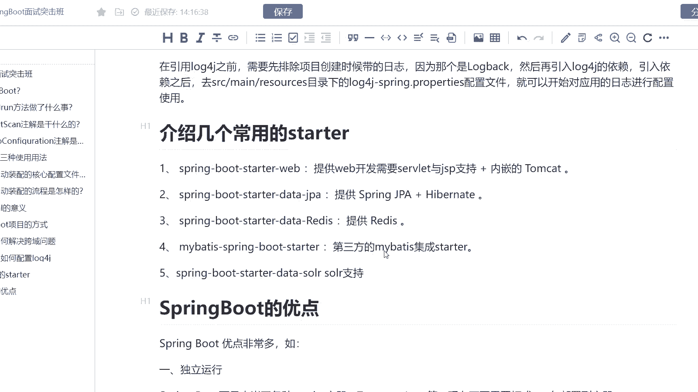
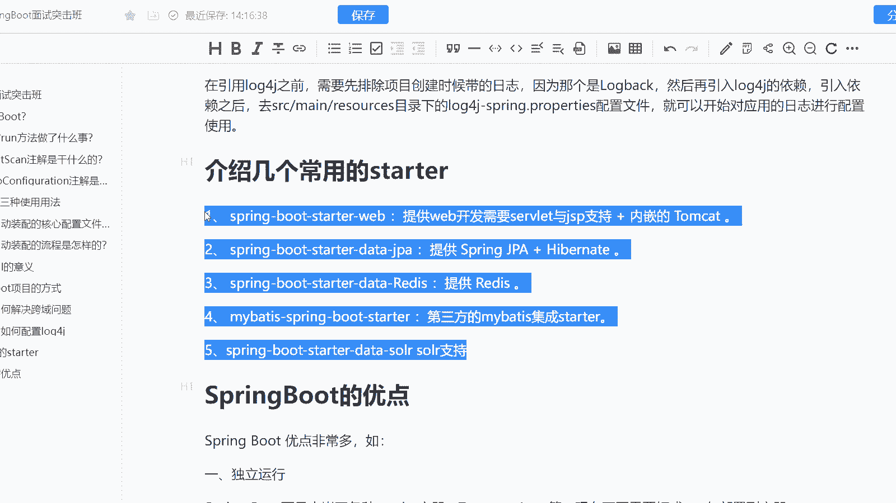
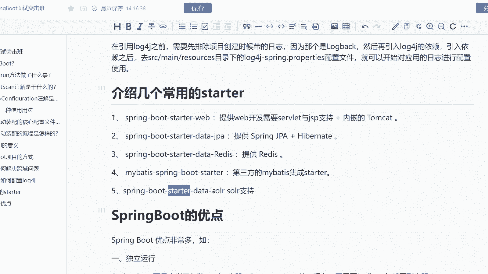
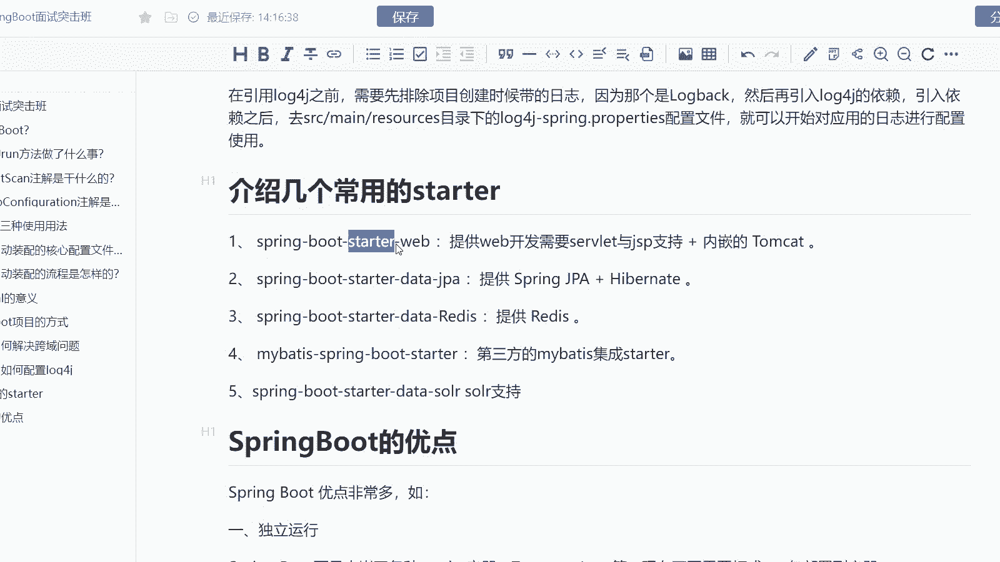

# 马士兵教育MCA架构师课程 - P188：介绍几个常用的starter - 马士兵学堂 - BV1RY4y1Q7DL

道题呢是来自于阿里巴巴的一道8月份的面试题啊，说是介绍几个常用的start。我们都知道啊star其实是我们spring boot开放的一个功能啊。

它可以集成第三方的一个star来完成我们项目的一个集成啊。这道题主要考察的是你对于spring boot的一个star的一个理解啊。而这道面试题呢在面试中高级 java开发工程师的时候会问到。

对应的薪资呢是15到25K的这样的一个区间。然后呢我们来看一下，我在这里其实列举了5个这样子的一个star啊，常用的star。那么首先第一个呢是spring boot start web。

它提供的是we开发所需要的一个slet以及gSP的支持，包括我们内嵌的一个。第二个呢是spring boot的一个spring很很明显啊，它提供的是J8加上net的一个支持。第三个是read。

第四个呢是my集成我们的一个start所需要引的这样的一个公共的。

第五个呢是我们的一个solo所需要引用的一个start。很明显啊，除此之外，还会有比如说像你要引入MQq引入ES等等等等相关的一些。而这个首先第一个啊，我想告诉大家的是这里面埋藏了两个点。

第一个它你看你有没有用过这些组件，比如说你说你项目当中用的reies又用的MQ那么MQ的star你应该是知道的。第二个有没有真正的去理解star这个东西，它到底是干什么的。

OK所以面试的时候注意这两个点就OK了啊，介绍几个常用的star这道题完成。

