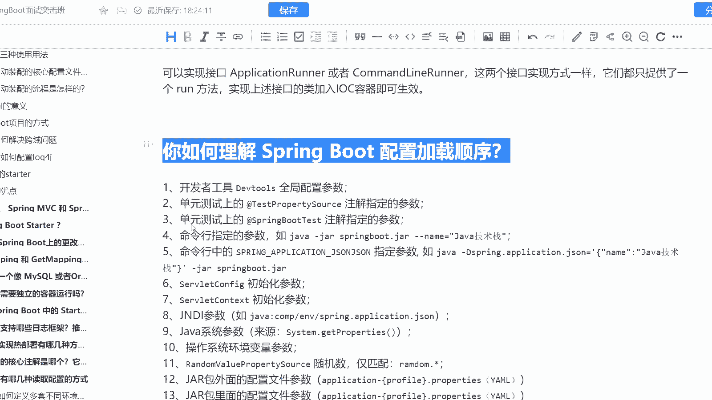
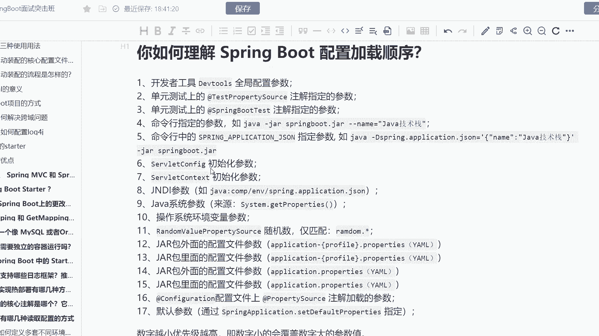
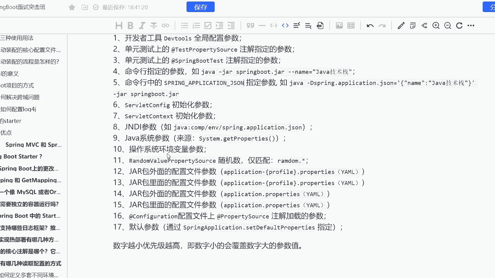
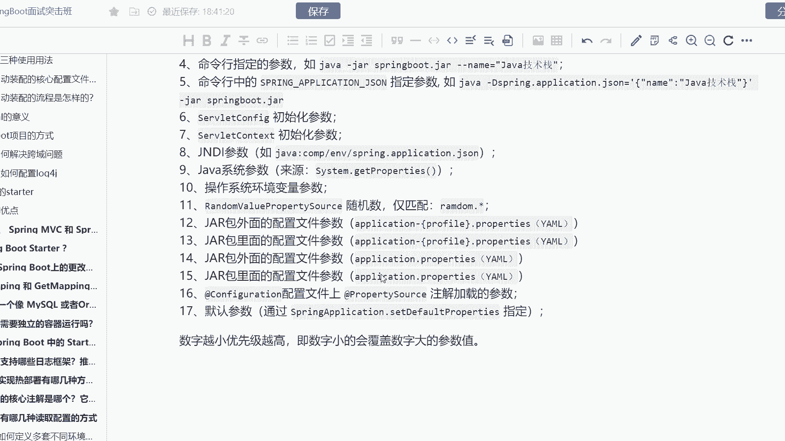
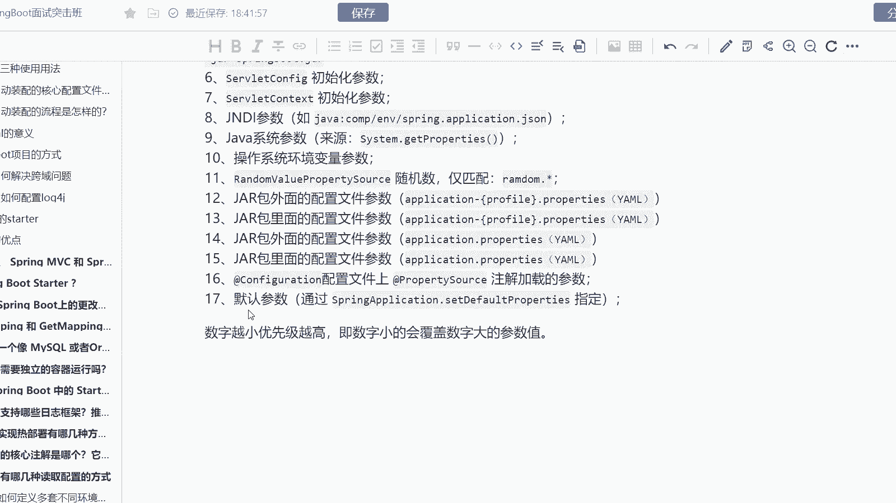
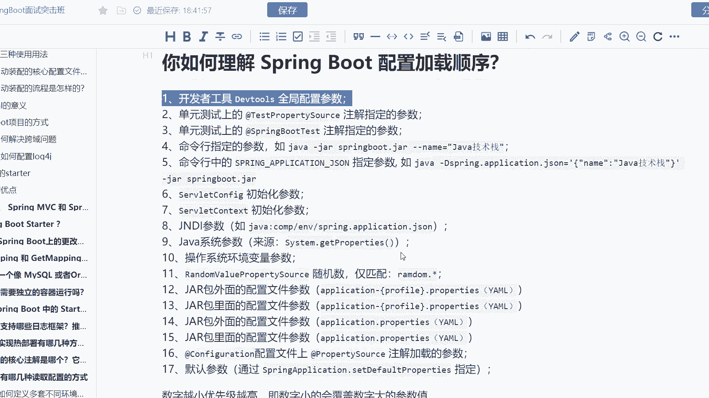
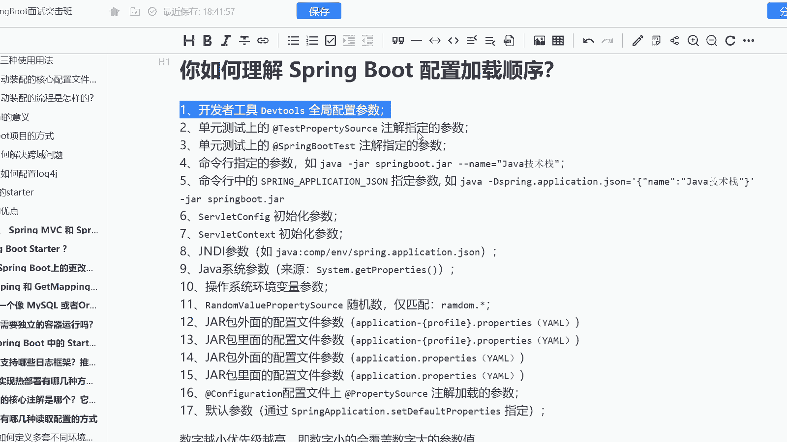

# 马士兵教育MCA架构师课程 - P189：你如何理解 Spring Boot 配置加载顺序？ - 马士兵学堂 - BV1RY4y1Q7DL

啊是来自于阿里巴巴的一道11月份的面试题啊，说是你如何理解spring boot当中的一个配置的加载顺序啊。这个面试题其实考察的是什么呢？

考察的是你对于spring boot当中的一些配置文件加载顺序的一个理解，先加载什么后加载什么，包括你对于spring boot启动流程的一个理解啊。而这道面试题呢会在面试高级java开发工程师的时候。

面到啊，对应的薪资是25到40K。很多同学其实对于spring boot的一个配置加载顺序是有一定的了解的。但是可能说的不是那么的详细。所以呢我们接下来就来看一下这道面试题啊。

首先它一共是分为17个步骤啊，比如说开发的工具。

全局配置参数，这是我们优先级最高的啊优先级最高的。如果当你配置了全局参数的时候，你一定是优先去加载。其次呢就是单元测试上面的testpro source注解指定的参数。

这个的优先级呢仅次于我们全局的配置参数啊，然后才是spring boot test注解指定的参数，包括我们再往下就是我们的命令行op上面的一个参数，再接着往下来呢。

就是命令行当中的一个spring applicationsonson啊，son啊，不好意思个son去了son当中去指定的一个数据。后呢这个优先级优 call后一点。

然后再是sfi初始化的参数以及s初始化的参数，包括我们的NDI啊包括我们的java的系统参数，操作系统的环境变量参数ment这个时候才加进来啊，然后再是 value source。

以及后面就是我们的一个配置文件，mail中的ymail中的几个配置文件啊，包括我们的一个configuration配置文件上的一个参数，最后才是我们的一个默认参数啊。数字越小优先级越高。

而默认参数优先级是最低的数字小的会覆盖数字大的。也就是说越往上它会往下去覆盖参数。如果你要去配置的话，我建议啊优先配置全局参数，它会把你其他的参数全部的给覆盖掉。

O这是我们spring boot配置加载的一个顺序。

